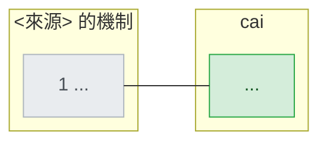
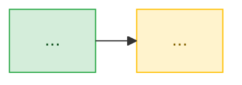

# cai 與 <來源名稱> 的差距

## 比較基準

- **cai**：`main` `<sha>`（plugin <version>，<YYYY-MM-DD>）。`python -m pytest --collect-only -q` 收到 <N> 個測試；`.claude/track/done/` 有 <N> 條走完的 track，<N> 條進行中。
- **外部**：<來源清單與日期>。二手數字都標「二手」。

## 定位差異先講清楚

<來源描述的是誰——組織／個人／內部 CLI；我們是出貨給個人安裝的 plugin。比的是機制有沒有，不是規模。>

## <來源> 的機制

| # | 機制 | 誰在做、怎麼做 | 數字 |
|---|---|---|---|
| 1 | | | |

## 逐項對照

| # | 機制 | cai 現況 | 證據 | 判定 |
|---|---|---|---|---|
| 1 | | | `path:line` | 對得上／領先／部分／缺／形狀不同／規模差異 |

## 差距總覽

## 我們領先的地方

<只寫這次對照才多出來的；前幾份列過的不重複。>

## 差距有多大

<N> 個機制：**<n> 個對得上或領先**、**<n> 個部分**、**<n> 個缺**。哪些是規模差異不追、哪些是形狀選擇要明講、哪些真正該補。

一句話：<結論>。

## Tasks

| ID | 標題 | 優先 | 相依 | 規模 |
|---|---|---|---|---|
| <前綴>-01 | | P1 | 無 | S |

規模：S = 一次 session、M = 一個 track、L = 多個 track、XL = 需要先做高階設計。

### <前綴>-01 — <標題>

**優先 P?・規模 ?・相依 ?**

**來源** <來源哪一頁／哪一段說了什麼>

**現況** <repo 裡對應的東西與 `path:line`；零命中要寫搜過的路徑>

**完成判準**
- <機械可判的條件>

**風險** <做錯會變成什麼>

## 與前幾份的關係

| 項目 | 上一份狀態 | 這一份狀態 | 證據 |
|---|---|---|---|
| | | | |

## 建議順序

<先做哪一項、為什麼；哪些可以隨時插隊。>

## Sources

- <名稱>：<URL>（二手／一手）
