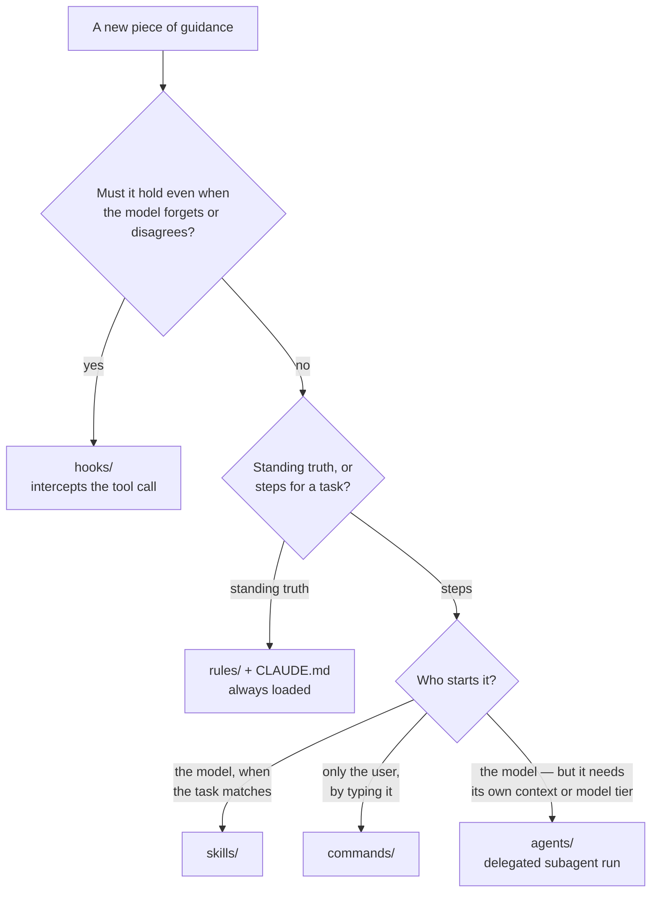

# Where does it go?

The one question worth getting right when configuring Claude Code: a new piece
of guidance arrives — a convention, a procedure, a hard limit — which component
should hold it?

Put it in the wrong component and it quietly stops working. A constraint written
as prose gets followed until the session is long, the context is full, or the
model simply reasons its way around it. A procedure written as prose is
re-derived from scratch every time, differently. Neither failure announces
itself.

## The two questions

**Does it have to hold even when the model forgets or disagrees?** If yes, it
needs a mechanism that sees the tool call and can refuse it — a hook, or a deny
rule in `settings.json` when the thing to block is a whole tool or path.
Everything else is advice.

**Is it a standing truth, or steps for a task?** Standing truths are cheap to
keep loaded and expensive to look up on demand. Procedures are the reverse:
long, specific, and irrelevant most of the time.

If it's steps, one more question — **who starts it?** This is what separates a
skill from a command, and it matters most when running the procedure has
consequences.

## The components

| Component | Holds | Triggered by | Costs |
|---|---|---|---|
| `rules/`, `CLAUDE.md` | Conventions — how to work, always true | Loaded every session | Tokens in every session, forever |
| `skills/` | Procedures the model should start on its own | The model, matching the task against the skill's description | Loaded only when matched |
| `commands/` | Procedures the user must ask for by name | The user typing `/name` | Nothing until invoked |
| `agents/` | A delegated job with its own context and model tier | Dispatched, or `@agent-name` | A whole subagent run |
| `hooks/` | Constraints that must not depend on being remembered | Mechanically, on every matching tool call | Runs on every matching call |

## Skill or command?

Both hold procedures; the difference is who pulls the trigger, and it is a
safety decision more than a style one.

A skill fires when the model decides the task matches. That's what you want for
`git-pr-rebase` — "squash this branch" should just work. A command fires only
when typed. That's what you want for `setup`, which rewrites files under
`~/.claude/`: a procedure with side effects outside the repo should never start
because a description happened to match.

**If you would be unhappy to see it start on its own, it is a command.**

## The diagnostic

Read the conventions and look for absolutes — *never*, *always*, *must*. Each
one is a claim that something cannot be skipped. Ask what actually stops it.

If the answer is "the model remembers," it is in the wrong component. Either
demote the wording to a preference, or promote the rule to a hook.

The same test applies in reverse: anything in a hook that is really a matter of
taste will block work that should have been allowed, and gets disabled — taking
the genuine constraints with it.

## Known gaps in this repo

- `rules/workflow.md` states two absolutes that nothing enforces: never work
  directly on `main`, and never commit or push unless asked. Meanwhile
  `bash_guard` does enforce the weaker `--no-verify` rule.
- Several procedures still live as prose in `rules/` rather than as skills: the
  subagent flow in `model-selection.md`, the test loop in `workflow.md`, and
  the "validate the diagram before shipping" step in `documentation.md`.
