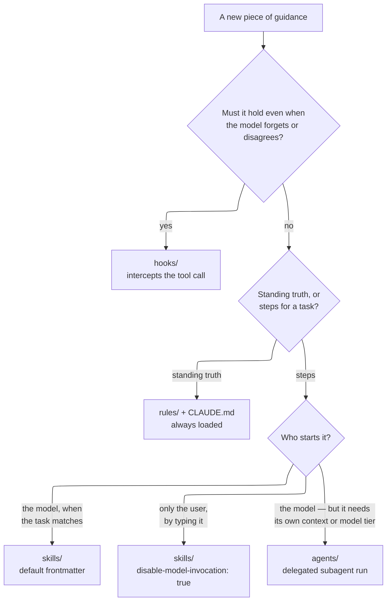

# Where does it go?

The one question worth getting right when configuring Claude Code: a new piece
of guidance arrives — a convention, a procedure, a hard limit — which component
should hold it?

Put it in the wrong component and it quietly stops working. A constraint written
as prose gets followed until the session is long, the context is full, or the
model simply reasons its way around it. A procedure written as prose is
re-derived from scratch every time, differently. Neither failure announces
itself.

## The two questions

**Does it have to hold even when the model forgets or disagrees?** If yes, it
needs a mechanism that sees the tool call and can refuse it — a hook, or a deny
rule in `settings.json` when the thing to block is a whole tool or path.
Everything else is advice.

**Is it a standing truth, or steps for a task?** Standing truths are cheap to
keep loaded and expensive to look up on demand. Procedures are the reverse:
long, specific, and irrelevant most of the time.

If it's steps, one more question — **who starts it?** This is a frontmatter
setting on the skill, not a choice of directory, and it matters most when
running the procedure has consequences.

```mermaid
---
config:
  flowchart:
    defaultRenderer: "elk"
---
flowchart TD
    Q["A new piece of guidance"] --> A{"Must it hold even when<br/>the model forgets or disagrees?"}
    A -->|yes| HOOK["hooks/<br/>intercepts the tool call"]
    A -->|no| B{"Standing truth, or<br/>steps for a task?"}
    B -->|standing truth| RULES["rules/ + CLAUDE.md<br/>always loaded"]
    B -->|steps| C{"Who starts it?"}
    C -->|"the model, when<br/>the task matches"| SKILL["skills/<br/>default frontmatter"]
    C -->|"only the user,<br/>by typing it"| SKILLCMD["skills/<br/>disable-model-invocation: true"]
    C -->|"the model — but it needs<br/>its own context or model tier"| AGENT["agents/<br/>delegated subagent run"]
```

## The components

| Component | Holds | Triggered by | Costs |
|---|---|---|---|
| `rules/`, `CLAUDE.md` | Conventions — how to work, always true | Loaded every session | Tokens in every session, forever |
| `skills/` | Procedures, whoever is meant to start them | Frontmatter decides: default is model-or-user, `disable-model-invocation: true` restricts it to the user typing `/name`, `user-invocable: false` restricts it to the model | Loaded only when matched or invoked |
| `commands/` (legacy) | Same as `skills/`, flat-file form predating the frontmatter switches | The user typing `/name` | Nothing until invoked |
| `skills/*/references/` | A procedure's steps, kept out of the skill body | A skill or a dispatched agent reading the file | Nothing until read — and no invocation gate to trip over |
| `agents/` | A delegated job with its own context and model tier | Dispatched, or `@agent-name` | A whole subagent run |
| `hooks/` | Constraints that must not depend on being remembered | Mechanically, on every matching tool call | Runs on every matching call |
| `scripts/` | The half of a rule or step that has exactly one right answer | A hook, a skill, a stage, or a rule's self-check running it | No tokens; milliseconds |

## Who may invoke it?

Custom commands have been merged into skills. A file at
`.claude/commands/deploy.md` and a skill at `.claude/skills/deploy/SKILL.md`
both create `/deploy` and work the same way — the directory no longer decides
who can invoke a component. New work goes in `skills/`; `commands/` is only
the flat-file form kept for what predates the merge.

What decides who can invoke it is frontmatter, and it is a safety decision
more than a style one. By default a skill fires when the model decides the
task matches, or when the user types its name — that's fine for
`refactor`, where "clean up this function" should just work. Set
`disable-model-invocation: true` and only the user can start it — that's what
`setup` needs, since it rewrites files under `~/.claude/` and a procedure with
side effects outside the repo should never start because a description
happened to match. Set `user-invocable: false` and the inverse holds: the
model can reach it, the user cannot type it directly.

**If you would be unhappy to see it start on its own, it needs
`disable-model-invocation: true`.**

The directory move doesn't remove the trap it replaces: a skill and a command
that resolve to the same name still collide, and the thin one can win. That's
what happened to `/cai:build-from-design` — it existed as both
`commands/build-from-design.md` and `skills/build-from-design/SKILL.md`, both
produced the same `/name`, and the 37-line command shadowed the 303-line
skill until the command was deleted.

## The diagnostic

Read the conventions and look for absolutes — *never*, *always*, *must*. Each
one is a claim that something cannot be skipped. Ask what actually stops it.

If the answer is "the model remembers," it is in the wrong component. Either
demote the wording to a preference, or promote the rule to a hook.

The same test applies in reverse: anything in a hook that is really a matter of
taste will block work that should have been allowed, and gets disabled — taking
the genuine constraints with it.

### Split off the half that has one answer

Most guidance is not all one kind. A rule usually carries a part that needs
judgement and a part that does not, and the second part can be a script that
answers in milliseconds, costs no tokens, and fails the same way twice. Keep
the judgement in prose; move the rest.

- `rules/option-explainer.md` says which six fields every option carries.
  Whether an ELI5 really is an analogy has no single answer, so that stays in
  the rule's self-check. Whether the six fields are a numbered list a reader
  can scan, or one 90-word paragraph, does — `scripts/options_lint.py` checks
  exactly that shape and nothing more.
- "Do not start `build` without that sign-off" is a sentence in the track
  skill, and on its own that is the model remembering. `preflight.py`'s `design_signed_off`
  now refuses `build` unless the last pass the ledger holds for `design` is a
  person's Approve, and
  `artifact_unchanged` refuses it if the document changed after — the promote
  path from the diagnostic above, taken.
- Design documents promise absolutes — every capability carries evidence,
  every glossary term points at a line that exists. `scripts/design_probe.py`
  is the mechanism for the ones with one answer.

Ask before any model is called: does a deterministic check already settle
this? That is the cheapest layer in `rules/model-selection.md`, and it is the
one to make bigger first.

### When one rule lives in two places

A hard rule often gets restated where it is applied — the parallel-subagent
cap in `rules/model-selection.md` shows up again in the `build` and `verify`
stage procedures and in the refactoring scan. Each copy is a place for the
number to drift. In this repo such a rule gets an entry in
`docs/rule-provenance.md`: the failure that produced it, where it is cited,
every `Restated in:` location, and the `Shared value:` they must all agree on.
`validate.py` runs `provenance.py` against that ledger, so a copy that
drifts fails the build instead of quietly winning. Pinning one more
restatement is a ledger line, not new code.

## Known gaps in this repo

- `rules/workflow.md` says never commit or push unless asked, and nothing
  enforces it — deliberately. A hook sees the command, not the conversation, so
  it cannot tell an asked-for commit from an unasked one. The rule stays prose;
  the diagnostic above says to demote the wording rather than pretend.

  Its sibling — never work directly on `main` — *is* decidable from the command
  plus `git symbolic-ref`, so `bash_guard` now blocks it. That split is the
  whole diagnostic in one example: same paragraph, same tone of voice, only one
  of them mechanisable.
- The guard reads text, not intent, and two limits follow from that. It resolves
  the branch from the session's working directory, so `cd sub && git commit`
  is judged against the parent — the deny message names the directory it used so
  a wrong verdict is at least diagnosable. And it matches one command at a time,
  so a PowerShell pipe that feeds a recursive listing into `Remove-Item -Force`
  reads as two harmless halves. Both are the cost of a hook that has to stay
  fast and never guess; the alternative is parsing shell grammar.
- The guard's one scan tracks only single quotes, double quotes, backslashes and
  heredoc delimiters. It does not parse `$'…'`, `#` comments, quotes inside
  `"$(…)"`, or an unusual heredoc delimiter such as `<<'A-B'`. After one of
  those it blocks any backtick and stops recognising heredocs, rather than
  guess. The rewrites in its advice always pass: single quotes, `-F <file>`,
  `<<'EOF'`, or `$(…)`.
- Several procedures still live as prose in `rules/` rather than as skills: the
  subagent flow in `model-selection.md`, the test loop in `workflow.md`, and
  the "validate the diagram before shipping" step in `documentation.md`.
  `skills/track/references/stage-discover.md` and
  `skills/track/references/stage-build.md` are the worked examples of the fix
  — in both cases the rule keeps the standing truth (*when* to prototype,
  *when* a change needs checkpointing) and the reference takes the steps,
  where they cost nothing until the task matches.
- Fixed, but worth keeping as the worked example: `refactor-auto` used to tell
  the model to run `refactor-scan`, `refactor-plan` and `refactor-apply` as
  steps in its own loop, and all three carried `disable-model-invocation:
  true` — which closes them to the model entirely. The instruction had never
  been executable. Nothing caught it because nothing was looking: the flag
  reads like "don't fire on your own", and the fact that it also means "the
  model cannot reach this at all" lives elsewhere on the same page.

  The fix was to stop making them skills. Their procedures are reference files
  under `skills/refactor/references/` now, and reading a file has no such
  gate. That is the same shape the stage procedures use, and for the same
  reason — **if something has to be driven by the model, it cannot be a skill
  the model is forbidden to invoke.** Check that before reaching for the flag.
- Fixed, and the same failure from another side: stage procedures told
  whoever ran them to ask the user — `stage-design.md`'s decision rule,
  `stage-build.md`'s commit-per-unit question, `stage-ship.md`'s confirmation.
  Dispatched by the track, that runner is a subagent, and the platform removes
  `AskUserQuestion` from every subagent whatever its `tools:` field says. The
  instruction named a tool the runner did not have, so it answered the
  question itself instead.

  The fix moved the asking, not the question: a dispatched stage finishes
  what the answer doesn't block, hands the decision up under `## Pending
  questions`, and the main session — which does have the tool — asks
  (`skills/track/references/pending-questions.md`). Before writing "ask the
  user" into a procedure, check who will actually be running it.
