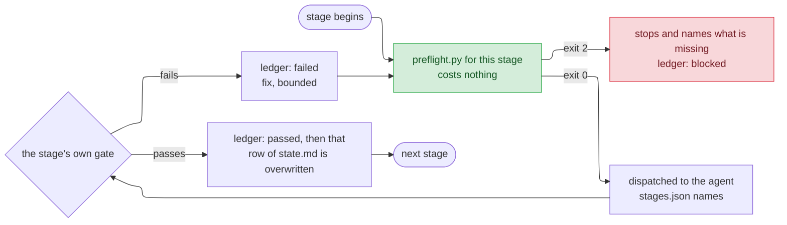

# Driving cai

`README.md` says what the pieces are. `GUIDE.md` says which component a new
piece of guidance belongs in. This file says how to actually use the thing:
what to type, what happens next, and what to do when it refuses.

Nothing here is required reading before you start. `/cai:track <feature>` and
answering its questions gets you a long way; come back when something blocks
you and you want to know why.

## What to type

Every entry point lands somewhere different on purpose. When two of them feel
like they fit, the more specific one is right.

| You want to | Type | What happens |
|---|---|---|
| Build a feature properly, from nothing | `/cai:track <name>` | Opens a track, walks six stages |
| Pick up where you left off | `/cai:track` | Resumes whatever `current` names |
| Know where a track stopped | `/cai:track status` | Reads files, calls no model |
| Fix something broken | `/cai:debug` | Root cause before any fix |
| Clean up code that already works | `/cai:refactor` | Behaviour unchanged, by the catalog |
| Ask whether a branch is mergeable | `/cai:verify` | Four review lenses over the diff |
| Find out what you're missing | `/cai:discover` | Surfaces unknowns before code |
| Check your own grasp of a diff | `/cai:quiz` | Asks *you* questions |
| Review a plan or spec | `/cai:plan-review` | Traces design back to requirements |
| Choose between options you can't compare | `/cai:options` | Six fields per option, then a pick |
| See what a track, or a month, cost | `/cai:usage` | Relays what `usage_report.py` computed |
| Put the tiers on a newer model | `/cai:models` | Saved for you alone; restart to apply |
| See which agents need you | `/cai:viewer` | Opens a local web page, one row per session |
| Run a git or gh operation | `/cai:git` | Runs on the chore tier, not your session's |
| Run a mechanical one-off | `/cai:chore` | Chore tier; hands back anything needing judgement |
| Apply one named refactoring | `/cai:extract-method` | One of 72, tab-completable |

`debug`, `refactor`, `verify`, `discover`, `plan-review`, `git` and `chore`
also start on their own when what you say matches them, so you rarely type
those. `quiz`, `options`, `usage`, `setup`, the 72 named refactorings, and the
four stages that write things (below) only ever start when typed.

## What you see when one fires

The seven that start on their own raise a different question: not how to type
them, but whether one actually ran. Each leaves marks you can check in the
transcript without opening its `SKILL.md`. One mark is shared — the turn shows
a `Skill` tool call naming it, `cai:debug` or `cai:verify`, before the work
begins. The rest are each skill's own.

**`debug`**

- Before any theory, one command and its red output (secrets replaced by
  `<REDACTED>`), or a plain statement of what was tried and a stop at
  reproduction. A theory arriving first means it is not running.
- The failure it reproduces is the one you reported, and it shrinks the repro
  until it can say why each remaining piece is load-bearing.
- Three to five hypotheses arrive as a list — each "if X is the cause, changing
  Y makes the symptom disappear" — before any one of them is tested.
- Every temporary log carries one tag like `[DEBUG-a4f2]`, and a grep for that
  tag comes back empty before it calls the fix done.
- The fix is preceded by a failing test run you can see, and followed by the
  passing one.
- After three fixes that did not hold, it stops and questions the design
  instead of trying a fourth.

**`refactor`**

- It says which hat it is wearing — refactoring, or adding function — and
  never swaps mid-edit; a bug noticed on the way is written down, not fixed.
- The test command runs green before the first edit. No coverage on the target
  means characterisation tests first, or an explicit "the net is missing".
- One named refactoring per step and per commit, the message
  `refactor: <Name> on <target>`; a red run reverts the step rather than
  debugging forward.
- Smells are named from the catalog before anything moves; "clean this up"
  never appears as the reason.

**`verify`**

- One message dispatches four agents at once — three `reviewer` lenses and
  `security-reviewer` — not one reviewer reading everything.
- Every finding carries `file:line`, a failure with concrete inputs, and the
  smallest fix; "consider extracting" and "this could be cleaner" are absent.
- The report opens with `Ready`, `Revise` or `Rework`, ranks findings Blocker
  → Major → Minor, lists "Requirement decisions to confirm" on their own, and
  ends with "Not covered".
- Only Blockers and Majors get fixed, each with a failing test run shown
  before and a passing one after; Minors stay in the report.
- With a `CLAUDE.md` at the repo's top level, a convention finding cites a line
  in it — or it is not a finding.

**`discover`**

- It names one of five moves — blindspot pass, vocabulary ladder, interview,
  option space, directions and mock — says what it costs, and waits before a
  long pass.
- An interview is one question per turn with a default ("I'd assume X —
  correct me"), biggest blast radius first; a numbered list of questions is
  not it.
- A blindspot pass ends in a rewritten prompt, after 5–8 landmines each
  carrying `file:line`, why it bites, and the sentence to add.
- An option space is about ten options sized S to XL, each grounded in a
  file, and it ends by asking which resonate rather than picking one.
- A mock is one HTML file with fake data and several deliberately
  incompatible directions, and it is never committed.

**`plan-review`**

- It stops first when the plan states no requirement or no acceptance
  criteria, and offers the matching skeleton.
- A traceability table comes before any opinion — requirement → element and
  element → requirement, gaps and orphans marked.
- Findings run through eight lenses in a fixed order, requirement fit first
  (precision first only against a detail design); each finding quotes where,
  the failure, and the smallest fix.
- Orphans come back as one-sentence requirements for you to accept or reject,
  never deleted and never quietly folded in.

**`git`**

- `git status` — and `git diff` before a commit — runs before anything
  changes.
- Only the paths you named are staged; never `git add -A`.
- A multi-line message goes through a file and `-F`; the subject is a
  conventional commit in English.
- Nothing is pushed unless you said push or pr, and never with force,
  `reset --hard` or `--no-verify`.
- It ends with the branch, the commit hash, and the push target or PR URL.

**`chore`**

- The reply is terse: what was done, files touched, result.
- A task that turns out to need a design decision or multi-file reasoning
  comes back as "run this on the main session", not as a guess.

## Walking a track

```
/cai:track billing-export
```

That creates `.claude/track/billing-export/state.md` with one row per stage,
writes `.claude/track/current`, and begins at `intake`.

Do one thing once per repo: add `.claude/track/` to `.gitignore`. A track's
files are working state, and `ship` refuses a dirty working tree — so a repo
that tracks them trips over its own bookkeeping at the last stage. `intake`'s
preflight says so when they aren't ignored, without blocking.

Each stage runs the same shape. A free check first, then the paid work, then
the outcome is recorded — every attempt, not only the ones that worked:



The six stages, in order:

1. **`intake`** — turns the request into a problem statement whose acceptance
   you could actually check. Asks one question at a time and waits.
2. **`discover`** — surfaces what nobody knows yet. Says what the move costs
   before running it.
3. **`design`** — writes a design document under `docs/design/`. Two
   entrances, and `intake` already picked between them with one test: can you
   write a test that fails now and would pass if an existing promise held?
   **diagnosis** when yes (something is broken: root cause and fix, one page),
   **stance** when no because nothing ever promised it (what this optimises
   for, what it gives up, the invariants). Then **decisions** — the choices
   that follow, with only the ones that need you reaching you — and **detail**,
   the document the build works from. **delta** recovers decisions from a
   branch already built.
4. **`build`** — works the design's own work breakdown, one unit at a time,
   test-first. Nothing starts until the unit before it is green and committed.
5. **`verify`** — four read-only reviewers over the diff: correctness,
   conformance to what was asked, whether a test would fail if the change were
   reverted, and security — shell execution, what reaches an argument vector,
   secrets in what is kept, guard bypass. Then fixes Blockers and Majors only,
   with a failing test first.
6. **`ship`** — squashes the branch into one conventional commit and writes a
   release note.

Two of the boundaries stop for a person, and only two: **after `design`**,
while no code exists yet and changing your mind is cheap, and **before the
irreversible parts of `ship`** — merging, tagging, publishing. Nowhere else
waits for you.

Both arrive as a menu you pick from, never a prompt asking you to type
`approved`. The design one offers three: approve it, ask for changes (which
sends `design` round again with what you said, at most three rounds), or
reject it. Ship's quotes the exact commands about to run, and offers to hand
them back instead; the squash before it, and — with ticket mirroring on — one
last ticket update and whether to close the issue, are each asked on their
own turn, because a yes to publishing is not a yes to any of them. Every menu also takes free text, so "yes
but rename the flag" is a first-class answer rather than something you have
to squeeze into one of the options.

### The design sign-off is checked, not trusted

Picking Approve writes `approved <date>` into the document's `## Status`, then
records your sign-off in the ledger together with the document's SHA-256.
`build`'s preflight reads that record, so two things stop it: no sign-off from
a person on the ledger at all, and a design document that has changed since
you signed it. An edit made after approval is not the design you approved —
revert it, or take the changed document back through the design gate.

### When a stage has a question for you

A stage the track dispatches runs as a subagent, and Claude Code gives
subagents no way to ask you anything. So a stage that reaches a decision only
you can make finishes everything the answer doesn't block, ends its report
with `## Pending questions`, and the main session asks you — one menu per
turn, the one that constrains the rest first. Run the stage standing alone
and it asks you directly.

### Skipping a stage

Stages are skippable, never silently:

```
/cai:track skip design --reason "reusing the spec from the CSV importer"
```

`--reason` is required and the command is refused without it, because
`/cai:track status` reads those reasons back months later when nobody
remembers. A skip also clears that stage's retry count. There is deliberately
no `advance` subcommand — a gate that passes writes the next row itself.

Skipping `design` leaves `build` nothing to build from, so `build`'s preflight
refuses and says to skip `build` too, or fill the design row in.

### Closing it

```
/cai:track done
```

First prints what the track left open — the `Left open:` items from each
stage's note, as a list you can paste straight into `/cai:intake` to start the
next track. Then moves the track to `.claude/track/done/<feature>/` and clears
`current`. Refused while any stage row is still empty or `in-progress`, and it
names which.

## Running one stage alone

Every stage is also a command: `/cai:intake`, `/cai:discover`, `/cai:design`,
`/cai:build`, `/cai:verify`, `/cai:ship`. Both routes read the same reference
file, so the procedure is identical.

One difference matters: **running a stage this way writes nothing to any
track.** There is no track underneath it, so nothing advances, no ledger
records the attempt, and `/cai:track status` will not know it happened.

Four of the six do not start on their own — `intake`, `design`, `build` and
`ship` all write things, and a description that happens to match your sentence
should not be enough to begin any of them. `discover` and `verify` only read,
so they stay open.

## When it blocks you

A stage that cannot start says so before anything reaches a model. The message
names one of these:

| Names | Meaning | Do this |
|---|---|---|
| `not_main_branch` | You're on `main`/`master`, or git could not be asked at all. Checked at `intake` and again at `ship` | Branch first. An unreachable git also blocks — not knowing is a reason to stop, not to continue |
| `active_tracks` | Five tracks are already open | `/cai:track done` on one. Archived tracks never count |
| `reserved_name` | You named a feature `current` or `done` | Pick another; both already mean something under `.claude/track/` |
| `state_md` | No `state.md`, or no row for the stage this one reads | Open the track with `/cai:track <name>` first |
| `intake_status` | `discover` asked to run before `intake` was `done` or `skipped` | Finish intake, or skip it with a reason |
| `artifact_named` | `build` asked to run, and the design row names no document | Run `design`, or record the document you're reusing. If you skipped `design`, skip `build` too |
| `artifact_kind` | Filename ends in none of `-diagnosis.md`, `-stance.md`, `-decisions.md`, `-high-level.md`, `-detail.md`, `-delta.md` | Rename it. The suffix is how the kind is known — there is no separate field |
| `artifact_exists` | The document `state.md` names isn't on disk | Fix the path, or re-run the stage that should have written it |
| a `design_probe.py` line | The design document fails its own structural check | Read the probe's lines; each names one missing heading, citation or number |
| `design_signed_off` | `build` asked to run, and no person's Approve on the ledger carries the sha of the document the design row names, as it stands now | Go through the design gate and pick Approve; its ledger row takes `--artifact` with that document. Changes requested and Reject don't count, and neither does an approval of another document, such as the stance one. An Approve recorded without `--artifact` ties to no document at all, so record it again |
| `artifact_unchanged` | The design document changed, or vanished, since it was signed off | Revert the edit, or take the document back through sign-off. `build`'s unit table lives in `implementation-notes.md` for exactly this reason |
| `work_breakdown` | A *detail* design has no `## Work breakdown` | `build` consumes that table as its schedule. The other kinds need none — `build` cuts the units itself |
| `has_changes` | Nothing to review — clean tree, no diff from base | Commit something first |
| `verify_status` | `ship` asked to run before `verify` finished | Run verify, or skip it with a reason you'd be willing to read back |
| `clean_tree` | Uncommitted changes at ship time | Commit or stash. Ship rewrites history and won't do it over a dirty tree. If the dirty files are the track's own, ignore `.claude/track/` |
| `ledger_attempts` | Any stage: five failed or blocked attempts since it last passed or was skipped | The message lists every attempt's note and the three ways out: `/cai:track skip <stage> --reason "<why>"`, `CAI_TRACK_MAX_ATTEMPTS` set higher (or `0` for no cap), or deleting the track's `ledger.jsonl` |

Two more lines always print as `PASS` and are still worth reading:
`track_ignored` at `intake` says when git is *not* ignoring the track's files,
and `ledger_intact` on every stage counts ledger lines that could not be
parsed. Neither ever blocks. A dispatch the provider refused — a rate limit,
an overload — is recorded as `unavailable` and never counts toward the cap.

This layer exists because refusing costs nothing and asking a model costs
something. A stage that can't start should find that out before anyone pays
for it.

You can run the same check by hand:

```bash
python <plugin-root>/scripts/preflight.py <stage> --track-dir .claude/track/<feature>
```

`<plugin-root>` is the installed copy, under
`~/.claude/plugins/cache/claude-all-in-one/cai/<version>/` — or
`plugins/cai/` in a checkout of this repo. Every script command below uses it
the same way.

## State, and what survives a new session

```
.claude/track/
  current                    one line — which track /cai:track resumes
  billing-export/
    state.md                 one row per stage, overwritten in place
    ledger.jsonl             every attempt, appended, never edited
    implementation-notes.md  build's unit table and deviations, once build writes one
    ticket.json              the linked issue, only with ticket mirroring on
  done/
    csv-import/              archived; never counts toward the cap

~/.claude/cai/usage.jsonl    every ledger record from every project, for /cai:usage
~/.claude/cai/model-choice.json   your own tier -> model choice, for /cai:models
```

`state.md` holds one row per stage — status, the artifact it produced, and a
note. The status column takes exactly four values: empty (not reached yet),
`in-progress` (a `build` that stopped between units), `done`, and `skipped`;
anything else makes `/cai:track status` stop and say so rather than guess.
**Where a track sits on disk is its status**: active ones are directories
under `.claude/track/`, finished ones live under `done/`. No field duplicates
that, because two sources of truth drift apart.

`ledger.jsonl` is the part `state.md` cannot be: a stage run twice leaves one
row but two records. Each carries the outcome, whether a person or the
pipeline let it through, the artifact's SHA-256, and the tokens spent since
the record before. `python <plugin-root>/scripts/ledger.py show --track-dir
.claude/track/<feature>` prints it.

None of it is version-controlled, and that is deliberate — a stage pointer is
not a deliverable, the ledger is append-only and would conflict on every
merge, and your `git status` stays clean. The cost is real: clone the repo
elsewhere and the track does not come with you. Design documents do, because
`design` writes them to `docs/design/` and the ones worth keeping travel with
the PR.

`/cai:track status` answers all of this by reading files. It calls no model,
so asking where you are is free.

### Between stages: keep going, resume, or compact

The six stage reports all land in one conversation, and nothing in the track
trims it. The place to decide what to do about that is between stages — once
the one that just finished has its row in `state.md`, and before the next one
is dispatched:

| Do | When it fits |
|---|---|
| Keep going | The next stage wants this one's report verbatim, not the note cell's summary of it — `discover` → `design` is the usual case — or your peak (below) still leaves room |
| End the session; `/cai:track <feature>` in a new one | You are stepping away, or the window is close to full. The new session resumes at the next unfinished stage from the files above and nothing else: a report longer than its note cell is gone, and so is anything you said that no file took down |
| `/compact`, naming the next stage in it — `/compact next is verify` | Same session, with room made. The summary keeps what you point it at, so name the stage; left to choose, it keeps what looked important at the time, which is not always what that stage comes back to |

Only there, never mid-stage: a stage cut off before its row is written leaves
none, so a resume runs it again from its preflight, and a pending-questions
round dies with the conversation — `build` alone stops mid-way on purpose,
and the `in-progress` status above is its handoff.

The number to decide by is your own peak, not a threshold from somewhere
else: `python <plugin-root>/scripts/context_peak.py --track-dir .claude/track/<feature>`
prints, for each session the ledger names, its peak context occupancy in
tokens and as a share of a 1M window (`--window` for a smaller one). Run it
at each boundary, and break at the one where the climb
has got too close to your model's window.

## Seeing what it cost

```
/cai:usage track     this track's tokens and equivalent spend, per model
/cai:usage 30        every project, over the last 30 days
```

Ask for metrics instead, for one track or over a number of days, and it prints
four numbers per stage: `first_pass` (did the first attempt pass), `cycle`
(from the stage's first record to its last pass), `rework` (how many attempts
it took), and `human_signed` (the share of attempts a person signed off).

Every figure comes from `usage_report.py`, not from the model. Two things to
read it by: every dollar is *equivalent API spend* — what the same tokens
would cost on pay-per-token pricing, not what a subscription billed — and
anything from before central tracking was first turned on shows as "no data",
not as zero.

## Mirroring a track into a GitHub issue

Off unless the project says otherwise. To turn it on, add
`.claude/cai.json`:

```json
{ "ticket": { "enabled": true, "backend": "github" } }
```

Then start the track from the issue, which points it for you:

```bash
/cai:track https://github.com/<owner>/<repo>/issues/123
```

Or point an existing track at one, in the same repository:

```bash
python <plugin-root>/scripts/ticket.py point --track-dir .claude/track/<feature> --ref 123
```

### Worked example: from an issue link to a merged PR

You paste a link and say what you want:

> `https://github.com/acme/api/issues/241` — take this one

**1. Hand the track the issue.** One command — paste the URL where the name
would go:

```bash
/cai:track https://github.com/acme/api/issues/241
```

`/cai:track` recognises a ticket-shaped argument — one containing `://`, or
made only of digits — and does **not** use it as a directory name (a URL
cannot be one on Windows at all). It reads the issue first, without creating
anything, proposes a name from the title, asks you to confirm or replace it,
and only then creates the track and points it.

The two-step form still works, and is what to use when you want the name to
be something the title would not give you:

```bash
/cai:track retry-on-timeout
python <plugin-root>/scripts/ticket.py point --track-dir .claude/track/retry-on-timeout --ref 241
```

`--ref` takes the number or the whole URL either way: it is handed to `gh`
unchanged, and `gh` accepts both. To read a ticket without starting anything
at all — deciding whether to pick it up is not the same as picking it up —
`ticket.py read --ref <number or URL> --project-dir .` needs no track and
creates none.

Point it right after creating the track. Nothing reminds you: a track with no
pointer runs to the end perfectly happily, just without ever reading the issue
or reporting back to it.

**2. `intake` reads the issue and routes it.** The routing is the part worth
watching, because the issue's title does not decide it. Issue #241 says *"add
a retry when the upstream times out"*, which reads like a feature. `intake`
asks the one question that settles it:

> Can I write a test that fails now and would pass if an existing promise
> held?

- **It writes one** — `tests/test_pool.py::test_returns_connection_on_timeout`
  fails today, and `docs/api.md` has promised since March that a timed-out
  connection goes back to the pool. So #241 is **broken**, the retry would have
  been treating a symptom, and the design stage runs **diagnosis**.
- **It cannot** — nothing anywhere promised retry behaviour. Then #241 is
  **never there**, and the design stage runs **stance**.

Either way you get the problem statement, the route *with its evidence*, and
2–3 approaches, as a menu.

**3. The design stage takes that entrance.** Diagnosis writes one page —
symptom, the failing test, root cause with `file:line`, blast radius, the fix,
and a diagram with the fault marked — and stops. **What you sign is the root
cause**, not the fix: a wrong cause makes every fix under it wrong. Stance
instead writes the trade, and then `decisions` puts at most five choices to
you one at a time.

**4. `build`, `verify`, `ship`.** The fix goes in test-first, four reviewers
read the diff, and `ship` looks #241 up again so the number lands in the
commit message and the PR body exactly once.

**5. The issue gets closed — if you say so.** After the merge and tag commands
have actually run, `ship` asks on its own turn. "Close #241" closes it;
anything else leaves it open.

Throughout, one comment on #241 is rewritten after every stage, carrying the
six stage rows. Local paths are left out of it.

### What each stage does with the issue

- `intake` reads the issue as its starting request, and derives the route
  (broken, or never there) from evidence rather than from its wording.
- Every passing stage row, and every skip, updates one comment on the issue
  with the six stage rows. Local artifact paths are left out — nobody reading
  the issue could open them.
- `verify`, on a track whose `intake` was skipped, reviews conformance against
  the issue's body.
- `ship` looks the issue up again before quoting its number in the commit and
  the PR, and asks on its own turn whether to update the comment one last time.
- Once `ship`'s merge, tag and publish commands have actually run, it asks —
  again on its own turn — whether to close the issue. Only "Close" closes it;
  if you had the commands handed back instead, it doesn't ask and the issue
  stays open. A close that fails says the issue is still open and is not
  retried.

`ticket.py show --track-dir .claude/track/<feature>` prints the pointer, the
GitHub login it cached, and how the last update went, without calling GitHub;
`--dry-run` adds the comment it would write. Each update ends in one word —
`ok`, `auth-failed`, `unreachable` and so on — recorded in `ticket.json`; a
failed one never fails a stage or counts toward the retry cap. After `gh auth
switch`, run `point` again so the cached login is re-read.

## Questions people have asked

One question has been filed twice (#73, #113), so it gets an answer here;
nothing else has been asked more than once yet.

**The options arrived as a file path and one-line summaries instead of the six
fields.** Fixed in cai 1.27.1 and cai-codex 0.1.1: the linted text is now sent
in full as the message that asks. The file under
`.claude/track/<feature>/options-*.md` is where the lint and `preflight.py`
read it, not a substitute for the message. Seeing the old shape means an older
installed copy — update (below) and restart.

## Limits worth knowing

- **Five active tracks.** Archived ones under `done/` are excluded — they only
  grow, and counting them would eventually make a sixth feature impossible to
  start.
- **One track is *current*.** Others stay open; `/cai:track <name>` switches to
  one. Bare `/cai:track` always means the current one.
- **Five attempts per stage**, counted since it last passed or was skipped.
  `CAI_TRACK_MAX_ATTEMPTS` changes the number; `0` removes the cap.
- **No locking.** Two sessions driving the same track means the last write to
  `state.md` wins, silently. This is built on one person moving it.
- **Ticket mirroring speaks GitHub only**, to an issue in the repository's own
  remote — not one in another repository.
- **`/cai:goal` still exists and is on its way out.** It predates the track and
  does a narrower version of the same job. The condition it was waiting on —
  a track run end to end — has long been met; retiring it is its own change.
- **Changing the rules needs two restarts.** `plugins/cai/rules/` is the
  source, but sessions read `~/.claude/rules/`. Editing the first does nothing
  until `/cai:setup` copies it out and the session restarts.

## Updating

```
/plugin marketplace update claude-all-in-one
/plugin update cai
# restart the session
/cai:setup          # only if rules/ changed
# restart again — rules are read at startup
```

The installed copy lives under `~/.claude/plugins/cache/`, keyed by version,
and tracks the marketplace's default branch on GitHub, not your local
checkout. Editing this repo does not change what your session runs until the
change is merged, the version is bumped, and the marketplace is refreshed.
