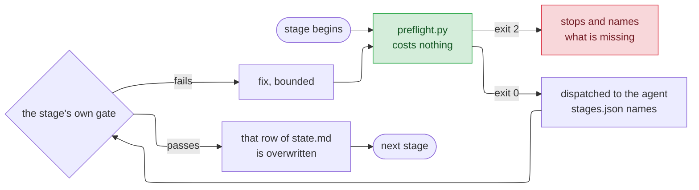

# Driving cai

`README.md` says what the pieces are. `GUIDE.md` says which component a new
piece of guidance belongs in. This file says how to actually use the thing:
what to type, what happens next, and what to do when it refuses.

Nothing here is required reading before you start. `/cai:track <feature>` and
answering its questions gets you a long way; come back when something blocks
you and you want to know why.

## What to type

Every entry point lands somewhere different on purpose. When two of them feel
like they fit, the more specific one is right.

| You want to | Type | What happens |
|---|---|---|
| Build a feature properly, from nothing | `/cai:track <name>` | Opens a track, walks six stages |
| Pick up where you left off | `/cai:track` | Resumes whatever `current` names |
| Know where a track stopped | `/cai:track status` | Reads files, calls no model |
| Fix something broken | `/cai:debug` | Root cause before any fix |
| Clean up code that already works | `/cai:refactor` | Behaviour unchanged, by the catalog |
| Ask whether a branch is mergeable | `/cai:verify` | Three review lenses over the diff |
| Find out what you're missing | `/cai:discover` | Surfaces unknowns before code |
| Check your own grasp of a diff | `/cai:quiz` | Asks *you* questions |
| Review a plan or spec | `/cai:plan-review` | Traces design back to requirements |
| Run a git or gh operation | `/cai:git` | Runs on the chore tier, not your session's |
| Apply one named refactoring | `/cai:extract-method` | One of 72, tab-completable |

`debug`, `refactor`, `verify` and `discover` also start on their own when what
you say matches them, so you rarely type those.

## Walking a track

```
/cai:track billing-export
```

That creates `.claude/track/billing-export/state.md` with one row per stage,
writes `.claude/track/current`, and begins at `intake`.

Each stage runs the same shape. A free check first, then the paid work, then
the row gets written:



The six stages, in order:

1. **`intake`** — turns the request into a problem statement whose acceptance
   you could actually check. Asks one question at a time and waits.
2. **`discover`** — surfaces what nobody knows yet. Says what the move costs
   before running it.
3. **`design`** — writes a design document. High-level weighs architecture
   options; detail turns an approved one into something a team can build from;
   delta recovers decisions from a branch already built.
4. **`build`** — works the design's own work breakdown, one unit at a time,
   test-first. Nothing starts until the unit before it is green and committed.
5. **`verify`** — three read-only reviewers over the diff: correctness,
   conformance to what was asked, and whether a test would fail if the change
   were reverted.
6. **`ship`** — squashes the branch into one conventional commit and writes a
   release note.

Two of the boundaries stop for a person, and only two: **after `design`**,
while no code exists yet and changing your mind is cheap, and **before the
irreversible parts of `ship`** — merging, tagging, publishing. Nowhere else
waits for you.

### Skipping a stage

Stages are skippable, never silently:

```
/cai:track skip design --reason "reusing the spec from the CSV importer"
```

`--reason` is required and the command is refused without it, because
`/cai:track status` reads those reasons back months later when nobody
remembers. There is deliberately no `advance` subcommand — a gate that passes
writes the next row itself.

### Closing it

```
/cai:track done
```

Moves the track to `.claude/track/done/<feature>/` and clears `current`.
Refused while any stage row is still empty, and it names which.

## Running one stage alone

Every stage is also a command: `/cai:intake`, `/cai:discover`, `/cai:design`,
`/cai:build`, `/cai:verify`, `/cai:ship`. Both routes read the same reference
file, so the procedure is identical.

One difference matters: **running a stage this way writes nothing to any
track.** There is no track underneath it, so nothing advances and
`/cai:track status` will not know it happened.

Four of the six do not start on their own — `intake`, `design`, `build` and
`ship` all write things, and a description that happens to match your sentence
should not be enough to begin any of them. `discover` and `verify` only read,
so they stay open.

## When it blocks you

A stage that cannot start says so before anything reaches a model. The message
names one of these:

| Names | Meaning | Do this |
|---|---|---|
| `not_main_branch` | You're on `main`, or git could not be asked at all | Branch first. An unreachable git also blocks — not knowing is a reason to stop, not to continue |
| `active_tracks` | Five tracks are already open | `/cai:track done` on one. Archived tracks never count |
| `reserved_name` | You named a feature `current` or `done` | Pick another; both already mean something under `.claude/track/` |
| `state_md` | No `state.md`, or no row for this stage | Open the track with `/cai:track <name>` first |
| `intake_status` | `discover` asked to run before `intake` finished | Finish intake, or skip it with a reason |
| `artifact_named` | The design row names no document | Run `design`, or record the document you're reusing |
| `artifact_kind` | Filename ends in none of `-high-level.md`, `-detail.md`, `-delta.md` | Rename it. The suffix is how the kind is known — there is no separate field |
| `artifact_exists` | The document `state.md` names isn't on disk | Fix the path, or re-run the stage that should have written it |
| `design_probe` | The design document fails its own structural check | Read the probe's lines; each names one missing heading, citation or number |
| `work_breakdown` | The design has no `## Work breakdown` | `build` consumes that table as its schedule |
| `has_changes` | Nothing to review — clean tree, no diff from base | Commit something first |
| `verify_status` | `ship` asked to run before `verify` finished | Run verify, or skip it with a reason you'd be willing to read back |
| `clean_tree` | Uncommitted changes at ship time | Commit or stash. Ship rewrites history and won't do it over a dirty tree |

This layer exists because refusing costs nothing and asking a model costs
something. A stage that can't start should find that out before anyone pays
for it.

You can run the same check by hand:

```bash
python plugins/cai/scripts/preflight.py <stage> --track-dir .claude/track/<feature>
```

## State, and what survives a new session

```
.claude/track/
  current                  one line — which track /cai:track resumes
  billing-export/
    state.md               one row per stage, overwritten in place
  done/
    csv-import/state.md    archived; never counts toward the cap
```

`state.md` holds one row per stage — status, the artifact it produced, and a
note. **Where a track sits on disk is its status**: active ones are
directories under `.claude/track/`, finished ones live under `done/`. No field
duplicates that, because two sources of truth drift apart.

None of it is version-controlled, and that is deliberate — a stage pointer is
not a deliverable, and your `git status` stays clean. The cost is real: clone
the repo elsewhere and the track does not come with you. Design documents and
review reports do, because those go in `docs/` and into the PR.

`/cai:track status` answers all of this by reading files. It calls no model,
so asking where you are is free.

## Limits worth knowing

- **Five active tracks.** Archived ones under `done/` are excluded — they only
  grow, and counting them would eventually make a sixth feature impossible to
  start.
- **One track is *current*.** Others stay open; `/cai:track <name>` switches to
  one. Bare `/cai:track` always means the current one.
- **No locking.** Two sessions driving the same track means the last write
  wins, silently. This is built on one person moving it.
- **`/cai:goal` still exists and is on its way out.** It predates the track and
  does a narrower version of the same job. It stays until a track has actually
  been run end to end.
- **Changing the rules needs two restarts.** `plugins/cai/rules/` is the
  source, but sessions read `~/.claude/rules/`. Editing the first does nothing
  until `/cai:setup` copies it out and the session restarts.

## Updating

```bash
/plugin update
# restart the session
/cai:setup          # only if rules/ changed
# restart again — rules are read at startup
```

The installed copy lives under `~/.claude/plugins/cache/` and tracks the
marketplace's default branch on GitHub, not your local checkout. Editing this
repo does not change what your session runs until the change is merged and
pulled.
