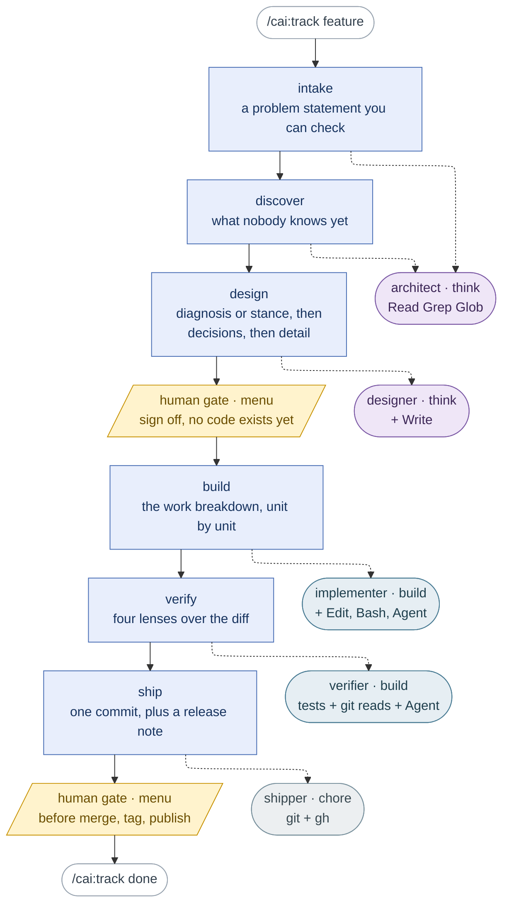

# claude-all-in-one

A [Claude Code](https://claude.com/claude-code) plugin — with a generated
Codex CLI counterpart, `cai-codex` — that installs a working set of everyday
capabilities — cheaper model routing, safer git, and a shared set of
behavioural rules — into every project on your machine.

Three documents, and they answer different questions. This one is what the
pieces are. [`MANUAL.md`](MANUAL.md) is how to drive them — what to type, what
happens next, and what every refusal means. [`GUIDE.md`](GUIDE.md) is where a
new piece of guidance belongs when you are extending the plugin rather than
using it.

## The shape of it

Four layers, plus one underneath all of them.

- **The track.** `/cai:track <feature>` carries one feature through six SDLC
  stages, keeping state in `.claude/track/<feature>/state.md` so a new session
  with no memory of this conversation can resume it. `/cai:track status` names
  where it stopped; `/cai:track skip <stage> --reason "<why>"` records why a
  stage was skipped instead of silently omitting it.
- **The six stages.** `intake`, `discover`, `design`, `build`, `verify`,
  `ship`. Each stage's procedure is a reference file under
  `skills/track/references/stage-*.md`, read two ways: by the subagent the
  track dispatches, and by that stage's own thin skill (`/cai:intake`,
  `/cai:discover`, `/cai:design`, `/cai:build`, `/cai:verify`, `/cai:ship`)
  when someone wants to run just that stage, track or no track. Exactly two
  stages stop for a human sign-off: after `design`, before any code exists,
  and before the irreversible operations inside `ship` — merging, tagging,
  publishing. Both arrive as a menu you pick from, never as a prompt asking
  you to type `approved`, and the first one is enforced rather than
  remembered: `build` refuses to start until the ledger records a person
  picking Approve, and again if the design document changed since.
- **The tools.** Reachable any time, with no track running: `/cai:refactor`,
  `/cai:debug`, `/cai:git`, `/cai:chore`, `/cai:quiz`, `/cai:plan-review`,
  `/cai:options`, `/cai:usage`.
- **The knowledge.** Reference files that cost nothing until something reads
  them: 72 named refactoring cards under `refactoring-catalog/`, the
  smell-to-refactoring routing table, the six stage procedures above, and a
  template for each kind of design document — diagnosis, stance, decisions,
  detail, delta.

Underneath all of it: `preflight.py`, `track_state.py`, `design_probe.py`,
`options_lint.py`, and `validate.py` answer what a deterministic check can
settle — is this stage allowed to start, where did the track stop, does this
design document actually have the shape it claims, can a reader find "how
reversible" in the options they are being asked to choose between — before
anything reaches a model. `ledger.py` keeps the record those checks read:
every attempt at every stage, appended and never edited, so a new session can
say how many times a stage has been tried, why it failed last time, and who
let it through.

### The six stages, and who runs each one

Stages run in order, top to bottom. The dotted line off each one names the
subagent it dispatches to — `stages.json` decides that, never judgement,
because the model tier rides on the agent. Agent colour is that tier: purple
is `think`, teal is `build`, grey is `chore`. Amber is a person: exactly two
boundaries wait for one.



Two things the diagram cannot show. Every stage runs `preflight.py` first — a
check that costs nothing and refuses before any model is called; the shape of
that is in [`MANUAL.md`](MANUAL.md). And `architect` appears twice because
`intake` and `discover` both only read: one agent, two callers, which is the
test for whether an agent deserves its own file at all.

Agent choice follows tool grant, not tier. `design` needs an agent that can
`Write`, `ship` one that can run `git` — picking by tier alone is how an
earlier draft pointed `ship` at a read-only agent that could never have pushed.

### The track's tools

| Command | What it does |
|---|---|
| `/cai:track <feature>` | Create or resume a track. Refuses `current` and `done` as names; refuses a sixth active track (`done/` tracks don't count). Also `status`, `skip <stage> --reason "<why>"`, and `done`. |
| `/cai:intake` | Turn a request into an acceptance-testable problem statement before any code exists: explore context, ask one question at a time, propose 2-3 approaches, wait for approval. User-invoked only. |
| `/cai:discover` | Surface what you don't know before writing code — a blindspot pass, a vocabulary ladder, an interview, an option space, or a mock, whichever unknown would change the most work. Also fires on its own when the codebase is unfamiliar or the result will be judged by look and feel. |
| `/cai:design` | Write a design document for review. Two entrances, picked by one test — can you write a test that fails now and would pass if an existing promise held? Yes: **diagnosis** (root cause and fix, one page). No, because nothing ever promised it: **stance** (what this optimises for and what it gives up, one page). Then **decisions** (the choices that follow, routed so only what needs a person reaches one), **detail** (what gets built from), or **delta** (recovers the decisions already made in a built branch). User-invoked only. |
| `/cai:build` | Build a detail design's work breakdown unit by unit, test-first, verifying and committing each one before the next starts — or cut your own checkpointed units with no design doc. User-invoked only. |
| `/cai:verify` | Dispatch four read-only reviewers (correctness, conformance, coverage, security) over a branch diff in parallel, reconcile their findings, then fix Blockers and Majors with a failing test before and a passing one after. |
| `/cai:ship` | Squash a branch into one conventional commit, write a release note, and stop before merging, tagging, or publishing until a person confirms. User-invoked only. |

### The other tools

| Command | What it does |
|---|---|
| `/cai:refactor` | Restructure code without changing its behaviour: the safety-net loop, the smell routing table, and the mechanics for all 72 named refactorings, on the `build` tier. |
| `/cai:debug` | Find the root cause of a bug before proposing any fix — a failing test, a crash, a stack trace, something that used to work and stopped. |
| `/cai:git` | Runs git and `gh` operations on the `chore` tier instead of the main session model. Confirms what it will touch before acting, never stages files you didn't name. |
| `/cai:chore` | Runs any mechanical one-off — renames, formatting, lookups — on the `chore` tier, and reports back if the task turns out to need real reasoning. |
| `/cai:quiz` | Quizzes you on your own branch diff before you merge it: a report on the non-obvious behaviours, then questions you have to answer — none of them answerable from the report alone. |
| `/cai:plan-review` | Reads an implementation plan, design doc, or spec the way a senior architect would: traces every design element back to a requirement, then eight lenses — over-engineering, boundaries, data and state, failure modes, testability, delivery, sequencing, and precision. Ships a skeleton for each kind of design document. Runs on Claude's own plans too, before they reach you. |
| `/cai:options` | Lays out two or more ways forward so a person can actually choose between them: shared comparison dimensions, six fields per option including an everyday-life ELI5 analogy, a recommendation, and the condition that voids it. Use before a list of options goes out, or after one already did and the reader could not act on it. |
| `/cai:usage` | Token usage and equivalent API spend for one track, or across every project over the last N days — plus per-stage process metrics: whether the first attempt passed, cycle time, rework, and how often a person actually signed off. Every number comes from `usage_report.py`; the model restates none of them. On the `chore` tier. |

### The 72 named refactorings

Every refactoring in Fowler's catalog is also its own slash command —
`/cai:extract-method`, `/cai:replace-conditional-with-polymorphism`, and 70
more — living under `plugins/cai/refactoring-catalog/`. Each one carries
`disable-model-invocation: true`, so only a person typing the name can start
it, and its `description` is skipped by the always-on budget check below —
72 procedures that would otherwise sit in every session's context whether
or not anyone ever refactors that day.

### `/cai:goal` — still here, on its way out

`/cai:goal` predates the track: it reviews a design document and routes it —
a work breakdown goes unit by unit, everything else to a single implementer,
both converging on the same test-and-report step. It still ships and still
works, but `/cai:track` is meant to replace it, and `goal`'s own routing
already overlaps what the `design` → `build` → `verify` stages now do more
explicitly. It was to stay only until someone had run a track end to end;
that has happened many times over (eleven finished tracks by 2026-09-14),
so its retirement is now its own change, not a condition still waiting. If
you're starting fresh, reach for `/cai:track` instead.

### Subagents

No component names a model — everything below names a **tier**; see
[Model tiers](#model-tiers). Each subagent is dispatched either by a track
stage or by one of the tools above.

| Agent | Tier | Dispatched by |
|---|---|---|
| `explorer` | `chore` | Read-only scouting. |
| `test-runner` | `chore` | Runs the repo's own automated checks. |
| `shipper` | `chore` | The `ship` stage. |
| `implementer` | `build` | The `build` stage, `/cai:build`, `/cai:goal`. |
| `reviewer` | `build` | The `verify` stage, `/cai:verify` — three at once, one lens each: correctness, conformance, coverage. |
| `security-reviewer` | `build` | The `verify` stage's fourth lens: shell execution, what reaches an argument vector, secrets in what is kept, guard bypass — those four and no fifth. |
| `refactoring-detector` | `build` | Parallel smell analysis across module groups during a refactoring scan. |
| `verifier` | `build` | The `verify` stage. |
| `architect` | `think` | The `intake` and `discover` stages. |
| `designer` | `think` | The `design` stage. |

### Also always on

| | |
|---|---|
| **Bash safety guard** | A `PreToolUse` hook on the Bash *and* PowerShell tools. Blocks force pushes, `reset --hard`, `git clean -f`, `--no-verify`, `rm -rf` and its `Remove-Item -Recurse -Force` equivalent, commits made straight onto `main`/`master`, and PowerShell here-string syntax inside a Bash command — the one that leaves stray `@` characters in your commit messages. It also blocks `git checkout -- <paths>` and `git restore` **when the working tree is dirty**, which is the shape of a verification step eating the fix it was meant to check; on a clean tree those discard nothing and go straight through. Hands the command back with the fix rather than just a refusal. |
| **Shared rules** | Eight instruction files covering how Claude should communicate, verify claims, write code, run its workflow, choose models, use memory, write docs, and lay out options. Installed to user scope by `/cai:setup`. |
| **Attempt ledger** | Every stage attempt a track makes — `passed`, `failed`, `blocked`, `skipped`, or `unavailable` when the provider refused to serve it — is appended to `.claude/track/<feature>/ledger.jsonl` with its gate (`auto` or `human`), the SHA-256 of the artifact it named, and the tokens the session spent since the last record. A copy carrying the project and track name goes to `~/.claude/cai/usage.jsonl`, which is what `/cai:usage` reads across projects. Five failed or blocked attempts since a stage last passed or was skipped cap it, and the refusal prints the three ways out; `unavailable` never counts. |

### Ticket mirroring — opt-in, per project

A track can mirror its progress into one GitHub issue. Nothing happens unless
the project turns it on in `.claude/cai.json`:

```json
{ "ticket": { "enabled": true, "backend": "github" } }
```

Then start a track from the issue itself — `/cai:track
https://github.com/<owner>/<repo>/issues/123`. An argument containing `://`,
or made only of digits, is read as a ticket rather than used as a directory
name: the issue is read first, a name is proposed from its title for you to
confirm, and the pointer is written before the first stage runs. The two-step
form (`ticket.py point --track-dir … --ref …`) still works when you want to
choose the name yourself; both, and a worked example from an issue link to a
merged PR, are in [`MANUAL.md`](MANUAL.md).
From there `intake` reads the issue as its starting request **and routes it**:
it tries to write a test that fails now and would pass if an existing promise
held, and what comes out decides whether the design stage runs `diagnosis` or
`stance`. The issue's own wording does not decide that — "add a retry" reads
like a feature and is often a symptom. Then every passing stage row and every
skip updates one comment on the issue — the six stage rows, not the local
artifact paths — and `ship` asks separately, each on its own turn, whether to
project its own row and, once its commands have run, whether to close the
issue. It
uses the `gh` CLI against the repo's own remote. A projection that fails is
recorded in the track's `ticket.json` and never fails a stage or counts toward
the retry cap.

## What it deliberately leaves out

Four things the large-company AI-SDLC write-ups all have, and this plugin
does not. Each is a trade-off with a cost, not a gap waiting to be filled,
and each names the condition under which it would change.

**The artifact chain stays on your machine.** A track's `state.md`, its
attempt ledger and its implementation notes live under `.claude/track/` and
are not version-controlled: the ledger is append-only, so a tracked copy
would conflict on every merge, and a stage pointer is not a deliverable.
What links a track to the outside is a ticket number — `ticket.py` projects
each stage's row onto the linked issue, one way. Design documents are the
exception: the ones worth keeping go into `docs/design/` and travel with the
PR. The cost is that a design document cannot be reviewed on a PR before it
is built against, and one machine's ledger cannot be compared with
another's. It would change if a second person needed to sign off a design
on the PR rather than in the session.

**No fleet of background agents opening pull requests.** A track is one
lane through six stages: the main session runs it, dispatches one subagent
per stage, and stops at two human gates. There is no issue-to-PR path where
agents pick work up unattended. It would change if a stage ever needed to
fan out past five subagents with merge logic between them, if the flow grew
a real "on failure, go back to build" loop, or if the stage order were found
being skipped in use — the three conditions recorded when this was first
declined.

**No review or eval job on pull requests.** The four review lenses run in
the `verify` stage, on the machine driving the track, on a subscription; the
eval suite runs from an optional local command. Neither is wired to CI. A
PR-triggered job would bill every PR against an API key and needs a runner
credential nobody has set up, and the eval suite (three cases, eleven
graders) is too thin to carry a red/green gate. Measured: one four-lens
review is about US$3.25 of equivalent API spend, one eval run about US$0.24.
It would change when the eval suite can gate — enough cases that a red means
something — or when a contributor's PR needs a review nobody local will run.

**No maintain-stage automation.** The large-company write-ups' Stage 6 comes
with automatic triggers when a control band is breached, scheduled scans, an
agent sitting on-call — all of it assuming a running service with a signal to
watch and an on-call rotation to page. This plugin has neither. What it keeps
instead: `/cai:track done` runs `track_state.py left-open` and prints the
track's `Left open` items in a form that pastes straight into `/cai:intake`
to start the next track — it opens no issue and schedules nothing on its
own. It would change if cai ever ran against a live service with a signal
worth watching.

## Prerequisites

- Claude Code CLI, installed and authenticated.
- Git.
- Python 3 on `PATH` — `python3` on macOS/Linux, `python` or the `py` launcher
  on Windows. The bash guard needs it; `/cai:setup` tells you if it's
  missing.
- Optional: the GitHub CLI (`gh`), authenticated — for the pull request
  `ship` opens and for ticket mirroring.

## Install

Inside any Claude Code session:

```
/plugin marketplace add millerlai/claude-all-in-one
/plugin install cai@claude-all-in-one
```

Restart the session, then run:

```
/cai:setup
```

Setup copies the rule files into `~/.claude/rules/`, asks which language you
want Claude to reply in, sets up your global `~/.claude/CLAUDE.md`, offers a
project CLAUDE.md for the current repo, verifies the bash guard actually
fires, and offers to install the status line. Restart once more so the new
rules load.

Agents, commands, and the guard work in every project from then on. The rules
apply to every project too, since they live at user scope.

## Updating

The marketplace is cloned locally, so refresh it first — otherwise an update
re-serves the cached commit:

```
/plugin marketplace update claude-all-in-one
/plugin update cai
```

Re-run `/cai:setup` afterwards to pick up rule changes, and restart the
session — running sessions don't hot-reload plugin agents or hooks.

If content changed without a version bump, or the cache looks corrupted:

```
/plugin marketplace update claude-all-in-one
/plugin uninstall cai@claude-all-in-one
/plugin install cai@claude-all-in-one
```

## Using it with Codex CLI

`cai-codex` is a generated counterpart of this plugin for Codex CLI — the
same cost-tiered agents, skills, and rules, kept in sync automatically
rather than hand-translated. See
[`plugins/cai-codex/README.md`](plugins/cai-codex/README.md) for exactly
what's equivalent, what's degraded, and what's documented but not yet
checked end to end.

### Install

```
codex plugin marketplace add millerlai/claude-all-in-one
codex plugin add cai-codex@claude-all-in-one
```

The `owner/repo` form is the one Codex documents; this build exercised the
equivalent local form, `codex plugin marketplace add <path to a clone>`.

Start Codex with `--enable default_mode_request_user_input` so `$setup`'s
language question renders as a menu. The track's two human gates ask the
same way when the flag is on, but can still fall back to numbered text even
then — observed once during a live run. Then, inside Codex:

```
$setup
```

Approve running it outside the sandbox when asked — it writes into
`~/.codex`, outside your workspace. Then run `/hooks`, review the cai
entry, and trust it; restart Codex.

### Use

`$track <feature>` carries one feature through the same six stages as
`/cai:track`, intake to ship. Every other skill works the same way with a
`$` instead of `/cai:` — `$design`, `$verify`, `$git`, `$chore`, and the
rest. See [`plugins/cai-codex/README.md`](plugins/cai-codex/README.md)'s
Usage section for the human gates, the ship push approval, and
Windows-specific notes.

### Update

```
codex plugin marketplace upgrade
codex plugin remove cai-codex@claude-all-in-one
codex plugin add cai-codex@claude-all-in-one
```

Then run `$setup` inside Codex. The first line refreshes Codex's copy of
this repository ("Refresh configured Git marketplace snapshots", in
`codex plugin marketplace --help`); it was not exercised in this build.
The remove/add pair and `$setup` were, but only against a local-path
marketplace, which is read fresh on every add.

### Uninstall

```
codex plugin remove cai-codex@claude-all-in-one
```

Then remove what `$setup` wrote by hand — see
[`plugins/cai-codex/README.md`](plugins/cai-codex/README.md)'s Uninstall
section for the exact list.

## Model tiers

No component names a model. They name a **tier**, and one file says what each
tier currently resolves to:

| Tier | Resolves to | The work it is for |
|---|---|---|
| `chore` | `haiku` | Needs no judgement on any given run — locating files, running a known command, a stated git operation, mechanical rewrites. |
| `build` | `sonnet` | Engineering judgement inside a fixed contract — writing code to a spec, reviewing one diff through one lens. |
| `think` | `opus` | Design trade-offs and repair — architecture choices, reviewing a plan against its requirements, ambiguous requirements. |

The test is *"does this step still need judgement on every run?"* — not how often
the task comes up. Frequency decides total volume; judgement risk decides tier.

Two things follow, and both are enforced rather than remembered:

- **Nothing is pinned to a model version.** Aliases already track the newest
  model of their family — Anthropic's docs are explicit that they "point to the
  recommended version for your provider and update over time" — so `haiku` keeps
  working when Haiku 5 ships. `validate.py` fails the build if any component
  pins a concrete version like `claude-haiku-4-5-20251001`.
- **Re-tiering is a one-line edit.** Change a tier's alias in
  `plugins/cai/models.json`, run `python plugins/cai/scripts/gen-models.py`, and
  every component in that tier moves together. `--check` reports drift without
  writing; `--list` prints the table. `validate.py` fails if any component's
  frontmatter disagrees with the table, if a component declaring a model isn't
  in it, or if any component names a model family in its prose.

Deciding *whether* to re-tier stays a human's call — that is a judgement, and
judgements are exactly what this table says not to automate.

## The rules

`/cai:setup` writes these to `~/.claude/rules/`. They are ordinary
Markdown — edit your copies freely; setup flags files that look hand-edited and
asks before overwriting them.

| File | What it governs |
|---|---|
| `communication.md` | Response language, conciseness, leading with the answer. |
| `epistemics.md` | Check before answering, cite sources, never fabricate, re-read as a skeptic before delivering. When to stop and ask, and how: one decision per turn, through the question tool, recommended option first. Verify against the original request before claiming done. |
| `coding.md` | Pure functions, comment the why, read the reference's source when matching an existing implementation, minimum code, surgical changes only. |
| `workflow.md` | Branch before touching code, plan non-trivial changes and order them by what you're likeliest to change, prototype taste-driven work, log deviations from the plan, run tests before claiming done, never commit unless asked. |
| `model-selection.md` | Settle what a deterministic check can before paying for a model, then which subagent and model tier to use for the rest. |
| `memory.md` | Record stable facts only; don't persist implementation details that go stale. |
| `documentation.md` | Markdown, Mermaid for structure, validate diagrams before shipping. |
| `option-explainer.md` | How to lay out two or more ways forward: shared dimensions, six fields per option including an everyday-life analogy, a real sample of each when the options differ in something you will see, and a pick with the condition that voids it. |

`communication.md` ships defaulting to English; `/cai:setup` rewrites
that line to whatever language you pick.

## Your global CLAUDE.md

`~/.claude/rules/` loads automatically, so your `~/.claude/CLAUDE.md` only needs
what the rules can't know — your OS, your stack, and the mistakes you don't want
repeated. Setup writes a thin starter there if you don't have one.

If you already have a CLAUDE.md, setup never overwrites it. It reports which of
your sections are now covered by a rules file and offers to slim the file down,
because a rule kept in both places is sent to the model twice in every session
and the two copies drift apart as soon as one is edited. `validate.py` enforces
the same invariant on the shipped template.

## Your project CLAUDE.md

`~/.claude/CLAUDE.md` above is user scope — your machine and your personal
habits, and it applies to every repo you touch. A project's own CLAUDE.md is
the other scope: the one command that proves a change is done in *this* repo,
its architecture, and conventions specific to it. It is checked in and shared
with every teammate, including ones who never installed cai.

Setup checks the repo you ran it from (`git rev-parse --show-toplevel`, not
just the current directory — Claude Code loads a CLAUDE.md from every parent
of your cwd, so the file that matters is the one at the repo's top level).

If neither `<repo>/CLAUDE.md` nor `<repo>/.claude/CLAUDE.md` exists, setup
offers to add one from `plugins/cai/templates/CLAUDE-project.md.tpl`, asks
once, and copies it verbatim on yes — it fills in nothing.

If one already exists, setup never overwrites it and never removes a
sentence. It reports which of the template's sections already have a
counterpart, which don't, and which sentences already live in a file under
`~/.claude/rules/` — then offers to **append** only the missing sections,
showing the result before writing.

Outside a git repository, setup skips this step and just prints the template
path so you can copy it in yourself.

## The status line

Optional, and offered by `/cai:setup` rather than shipped with the plugin —
Claude Code reads only the `agent` and `subagentStatusLine` keys out of a
plugin's settings, so a status line can only reach you through your own
`~/.claude/settings.json`.

```
claude-all-in-one · main · Opus 5 [max] · ctx 92% · 5h 75% · 7d 60%
```

Project name in bright cyan, git branch, the model with its live `/effort`
level, then three gauges that all read the same way — how much is **left**, not
how much is spent. Green at 50% or more, amber down to 21%, red at 20% or below,
so a colour means the same thing whichever number you look at. The two
rate-limit gauges appear only for Claude.ai subscribers, and only after the
session's first API response.

Setup copies the script to `~/.claude/cai-statusline.py` and points
`statusLine.command` at it. It never writes `~/.claude/statusline.py`, which
belongs to Claude Code's own `/statusline` command. If you already have a status
line configured, setup shows you what it is and asks before replacing it, and
leaves a `settings.json.bak` either way. Re-running setup after a plugin update
refreshes the copied script; it takes effect on save, with no restart.

## Also included

- `templates/multi-repo.settings.json`, at this repo's root rather than in the
  installed plugin — drop into a repo's `.claude/settings.json`
  to grant Claude access to a sibling repo via `additionalDirectories`, and
  optionally load that repo's own `CLAUDE.md`/rules too.
- Optional: [mermaid-cli](https://github.com/mermaid-js/mermaid-cli)
  (`npm install -g @mermaid-js/mermaid-cli`) so Claude can actually render and
  validate the diagrams `documentation.md` asks for.

Claude Code's built-in auto memory keeps per-project notes in
`~/.claude/projects/<project>/memory/` — inspect with `/memory`. Curated
instructions belong in the rules; hard constraints belong in hooks.

## Contributing / developing

Add the marketplace from a local checkout, then install to test your changes:

```
/plugin marketplace add /path/to/claude-all-in-one
/plugin install cai@claude-all-in-one
```

Everything users receive lives under `plugins/cai/` — the plugin cache
copies only that directory, so anything outside it never reaches an installer.
Decide which side a new file is on before writing it: [`CLAUDE.md`](CLAUDE.md)'s
"Who a file is for" draws the line between what ships and what only maintains
this repo (`docs/`, `scripts/`, `tests/`, `.github/`, `.claude/skills/`). The
plugin cache is keyed by version, so a pull request that changes anything under
`plugins/cai/` also bumps `version` in `plugins/cai/.claude-plugin/plugin.json`
— without it, `/plugin update` keeps serving the old copy.

Adding guidance rather than code? [GUIDE.md](GUIDE.md) covers which component
should hold it — a convention, a procedure, or a constraint — and why putting it
in the wrong one makes it quietly stop working. It applies just as well to your
own `~/.claude/` setup.

Before pushing, run both:

```bash
python scripts/validate.py
python -m pytest
```

`validate.py` checks the manifests, that every agent and skill has the
frontmatter Claude Code needs to load it, that hook commands point at files
that exist, that the guard still blocks what it should, that every rule file
and the `track` and `goal` skills stay within their line ceilings, that every
`.cmd` file is pure ASCII and no text file starts with a UTF-8 BOM, that the
eval graders are well-formed and carry no secrets, and — through
`plugins/cai/scripts/provenance.py` — that
every entry in `docs/rule-provenance.md` still cites text that exists and that
every place restating a rule still agrees with it. Because every `description`
the model can match on is sent to it in every session, it also checks that the
combined size of every agent's and skill's `description` (skipping the 72
refactoring cards, which carry `disable-model-invocation: true` and so never
reach the model unbidden) hasn't grown past what it measured last. It's a
ratchet, not a target: it can only shrink or hold, never quietly drift back up.

`pytest` runs `tests/`, which exercises what the scripts under
`plugins/cai/scripts/` actually do; it is this repo's only development-time
dependency (`pip install pytest`). CI runs both on every pull request, on
Linux. Windows is covered only by running them by hand; macOS not at all.

You rarely need to run `validate.py` yourself while editing:
`.claude/settings.json` registers a `PostToolUse` hook that runs it whenever the
Edit or Write tool touches `plugins/cai/` or `.claude-plugin/`, and reports
what failed. A file rewritten through the shell does not trigger it.

When a change touches `plugins/cai/{skills,agents,hooks,rules,evals}/`, an
optional local eval run is worth doing — about US$0.24 a run. Point
`--output-dir` outside the repo, or the results land inside the tree that
ships:

```
claude plugin eval plugins/cai --ablation none --max-cost-usd 1 --threshold 0 \
  --trust-plugin --no-publish --model haiku --output-dir <path outside this repo>
```

Maintainer tools, which no shipped component runs:

- `scripts/activation.py` — which skills and agents were installed, and on how
  many days each one actually ran.
- `tests/review-benchmark/` with `scripts/review_benchmark_score.py` — labelled
  diffs that measure what the four `verify` lenses catch; the paid half is
  `scripts/review-benchmark-procedure.md`.
- `/gap-analysis` (`.claude/skills/gap-analysis/`) — compares cai against an
  external practice and writes the result under `docs/design/`.
- `python plugins/cai/scripts/context_peak.py --track-dir .claude/track/<feature>`
  — a track's peak main-session context occupancy, read from local transcripts.
