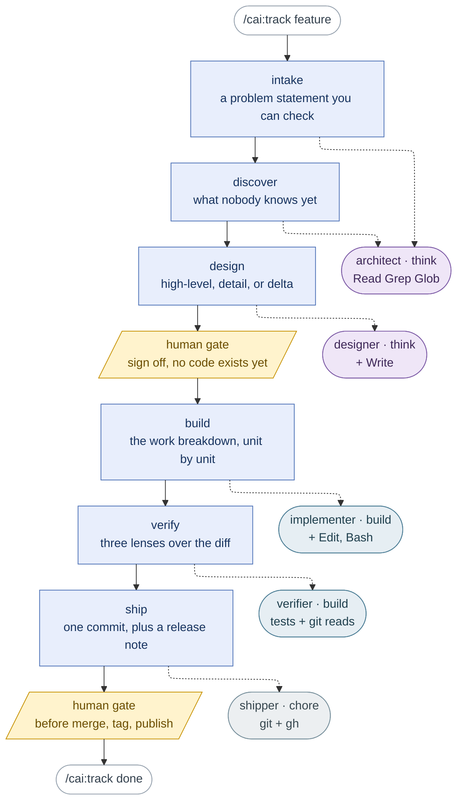

# claude-all-in-one

A [Claude Code](https://claude.com/claude-code) plugin that installs a working
set of everyday capabilities — cheaper model routing, safer git, and a shared
set of behavioural rules — into every project on your machine.

Three documents, and they answer different questions. This one is what the
pieces are. [`MANUAL.md`](MANUAL.md) is how to drive them — what to type, what
happens next, and what every refusal means. [`GUIDE.md`](GUIDE.md) is where a
new piece of guidance belongs when you are extending the plugin rather than
using it.

## The shape of it

Four layers, plus one underneath all of them.

- **The track.** `/cai:track <feature>` carries one feature through six SDLC
  stages, keeping state in `.claude/track/<feature>/state.md` so a new session
  with no memory of this conversation can resume it. `/cai:track status` names
  where it stopped; `/cai:track skip <stage> --reason "<why>"` records why a
  stage was skipped instead of silently omitting it.
- **The six stages.** `intake`, `discover`, `design`, `build`, `verify`,
  `ship`. Each stage's procedure is a reference file under
  `skills/track/references/stage-*.md`, read two ways: by the subagent the
  track dispatches, and by that stage's own thin skill (`/cai:intake`,
  `/cai:discover`, `/cai:design`, `/cai:build`, `/cai:verify`, `/cai:ship`)
  when someone wants to run just that stage, track or no track. Exactly two
  stages stop for a human sign-off: after `design`, before any code exists,
  and before the irreversible operations inside `ship` — merging, tagging,
  publishing.
- **The tools.** Reachable any time, with no track running: `/cai:refactor`,
  `/cai:debug`, `/cai:git`, `/cai:chore`, `/cai:quiz`, `/cai:plan-review`.
- **The knowledge.** Reference files that cost nothing until something reads
  them: 72 named refactoring cards under `refactoring-catalog/`, the
  smell-to-refactoring routing table, and the six stage procedures above.

Underneath all of it: `preflight.py`, `track_state.py`, `design_probe.py`, and
`validate.py` answer what a deterministic check can settle — is this stage
allowed to start, where did the track stop, does this design document actually
have the shape it claims — before anything reaches a model.

### The six stages, and who runs each one

Stages run in order, top to bottom. The dotted line off each one names the
subagent it dispatches to — `stages.json` decides that, never judgement,
because the model tier rides on the agent. Agent colour is that tier: purple
is `think`, teal is `build`, grey is `chore`. Amber is a person: exactly two
boundaries wait for one.



Two things the diagram cannot show. Every stage runs `preflight.py` first — a
check that costs nothing and refuses before any model is called; the shape of
that is in [`MANUAL.md`](MANUAL.md). And `architect` appears twice because
`intake` and `discover` both only read: one agent, two callers, which is the
test for whether an agent deserves its own file at all.

Agent choice follows tool grant, not tier. `design` needs an agent that can
`Write`, `ship` one that can run `git` — picking by tier alone is how an
earlier draft pointed `ship` at a read-only agent that could never have pushed.

### The track's tools

| Command | What it does |
|---|---|
| `/cai:track <feature>` | Create or resume a track. Refuses `current` and `done` as names; refuses a sixth active track (`done/` tracks don't count). |
| `/cai:intake` | Turn a request into an acceptance-testable problem statement before any code exists: explore context, ask one question at a time, propose 2-3 approaches, wait for approval. User-invoked only. |
| `/cai:discover` | Surface what you don't know before writing code — a blindspot pass, a vocabulary ladder, an interview, an option space, or a mock, whichever unknown would change the most work. Also fires on its own when the codebase is unfamiliar or the result will be judged by look and feel. |
| `/cai:design` | Write a design document for review: high-level (architecture options, stops before implementation detail), detail (an approved high-level design turned into something a team can build from), or delta (recovers the decisions already made in a built branch). User-invoked only. |
| `/cai:build` | Build a detail design's work breakdown unit by unit, test-first, verifying and committing each one before the next starts — or cut your own checkpointed units with no design doc. User-invoked only. |
| `/cai:verify` | Dispatch three read-only reviewers (correctness, conformance, coverage) over a branch diff in parallel, reconcile their findings, then fix Blockers and Majors with a failing test before and a passing one after. |
| `/cai:ship` | Squash a branch into one conventional commit, write a release note, and stop before merging, tagging, or publishing until a person confirms. User-invoked only. |

### The other tools

| Command | What it does |
|---|---|
| `/cai:refactor` | Restructure code without changing its behaviour: the safety-net loop, the smell routing table, and the mechanics for all 72 named refactorings, on the `build` tier. |
| `/cai:debug` | Find the root cause of a bug before proposing any fix — a failing test, a crash, a stack trace, something that used to work and stopped. |
| `/cai:git` | Runs git and `gh` operations on the `chore` tier instead of the main session model. Confirms what it will touch before acting, never stages files you didn't name. |
| `/cai:chore` | Runs any mechanical one-off — renames, formatting, lookups — on the `chore` tier, and reports back if the task turns out to need real reasoning. |
| `/cai:quiz` | Quizzes you on your own branch diff before you merge it: a report on the non-obvious behaviours, then questions you have to answer — none of them answerable from the report alone. |
| `/cai:plan-review` | Reads an implementation plan, design doc, or spec the way a senior architect would: traces every design element back to a requirement, then eight lenses — over-engineering, boundaries, data and state, failure modes, testability, delivery, sequencing, and precision. Ships a skeleton for each kind of design document. Runs on Claude's own plans too, before they reach you. |
| `/cai:options` | Lays out two or more ways forward so a person can actually choose between them: shared comparison dimensions, six fields per option including an everyday-life ELI5 analogy, a recommendation, and the condition that voids it. Use before a list of options goes out, or after one already did and the reader could not act on it. |

### The 72 named refactorings

Every refactoring in Fowler's catalog is also its own slash command —
`/cai:extract-method`, `/cai:replace-conditional-with-polymorphism`, and 70
more — living under `plugins/cai/refactoring-catalog/`. Each one carries
`disable-model-invocation: true`, so only a person typing the name can start
it, and its `description` is skipped by the always-on budget check below —
72 procedures that would otherwise sit in every session's context whether
or not anyone ever refactors that day.

### `/cai:goal` — still here, on its way out

`/cai:goal` predates the track: it reviews a design document and routes it —
a work breakdown goes unit by unit, everything else to a single implementer,
both converging on the same test-and-report step. It still ships and still
works, but `/cai:track` is meant to replace it, and `goal`'s own routing
already overlaps what the `design` → `build` → `verify` stages now do more
explicitly. It stays only until someone has actually run a track end to end —
that hasn't happened yet — at which point it retires. If you're starting
fresh, reach for `/cai:track` instead.

### Subagents

No component names a model — everything below names a **tier**; see
[Model tiers](#model-tiers). Each subagent is dispatched either by a track
stage or by one of the tools above.

| Agent | Tier | Dispatched by |
|---|---|---|
| `explorer` | `chore` | Read-only scouting. |
| `test-runner` | `chore` | Runs the repo's own automated checks. |
| `shipper` | `chore` | The `ship` stage. |
| `implementer` | `build` | The `build` stage, `/cai:build`, `/cai:goal`. |
| `reviewer` | `build` | The `verify` stage, `/cai:verify`, one lens of a diff at a time. |
| `refactoring-detector` | `build` | Parallel smell analysis across module groups during a refactoring scan. |
| `verifier` | `build` | The `verify` stage. |
| `architect` | `think` | The `intake` and `discover` stages. |
| `designer` | `think` | The `design` stage. |

### Also always on

| | |
|---|---|
| **Bash safety guard** | A `PreToolUse` hook on the Bash *and* PowerShell tools. Blocks force pushes, `reset --hard`, `git clean -f`, `--no-verify`, `rm -rf` and its `Remove-Item -Recurse -Force` equivalent, commits made straight onto `main`/`master`, and PowerShell here-string syntax inside a Bash command — the one that leaves stray `@` characters in your commit messages. Hands the command back with the fix rather than just a refusal. |
| **Shared rules** | Eight instruction files covering how Claude should communicate, verify claims, write code, run its workflow, choose models, use memory, write docs, and lay out options. Installed to user scope by `/cai:setup`. |

## Prerequisites

- Claude Code CLI, installed and authenticated.
- Git.
- Python 3 on `PATH` — `python3` on macOS/Linux, `python` or the `py` launcher
  on Windows. The bash guard needs it; `/cai:setup` tells you if it's
  missing.

## Install

Inside any Claude Code session:

```
/plugin marketplace add millerlai/claude-all-in-one
/plugin install cai@claude-all-in-one
```

Restart the session, then run:

```
/cai:setup
```

Setup copies the rule files into `~/.claude/rules/`, asks which language you
want Claude to reply in, sets up your global `~/.claude/CLAUDE.md`, and verifies
the bash guard actually fires. Restart once more so the new rules load.

Agents, commands, and the guard work in every project from then on. The rules
apply to every project too, since they live at user scope.

## Updating

The marketplace is cloned locally, so refresh it first — otherwise an update
re-serves the cached commit:

```
/plugin marketplace update claude-all-in-one
/plugin update cai
```

Re-run `/cai:setup` afterwards to pick up rule changes, and restart the
session — running sessions don't hot-reload plugin agents or hooks.

If content changed without a version bump, or the cache looks corrupted:

```
/plugin marketplace update claude-all-in-one
/plugin uninstall cai@claude-all-in-one
/plugin install cai@claude-all-in-one
```

## Model tiers

No component names a model. They name a **tier**, and one file says what each
tier currently resolves to:

| Tier | Resolves to | The work it is for |
|---|---|---|
| `chore` | `haiku` | Needs no judgement on any given run — locating files, running a known command, a stated git operation, mechanical rewrites. |
| `build` | `sonnet` | Engineering judgement inside a fixed contract — writing code to a spec, reviewing one diff through one lens. |
| `think` | `opus` | Design trade-offs and repair — architecture choices, reviewing a plan against its requirements, ambiguous requirements. |

The test is *"does this step still need judgement on every run?"* — not how often
the task comes up. Frequency decides total volume; judgement risk decides tier.

Two things follow, and both are enforced rather than remembered:

- **Nothing is pinned to a model version.** Aliases already track the newest
  model of their family — Anthropic's docs are explicit that they "point to the
  recommended version for your provider and update over time" — so `haiku` keeps
  working when Haiku 5 ships. `validate.py` fails the build if any component
  pins a concrete version like `claude-haiku-4-5-20251001`.
- **Re-tiering is a one-line edit.** Change a tier's alias in
  `plugins/cai/models.json`, run `python plugins/cai/scripts/gen-models.py`, and
  every component in that tier moves together. `--check` reports drift without
  writing; `--list` prints the table. `validate.py` fails if any component's
  frontmatter disagrees with the table, if a component declaring a model isn't
  in it, or if any component names a model family in its prose.

Deciding *whether* to re-tier stays a human's call — that is a judgement, and
judgements are exactly what this table says not to automate.

## The rules

`/cai:setup` writes these to `~/.claude/rules/`. They are ordinary
Markdown — edit your copies freely; setup flags files that look hand-edited and
asks before overwriting them.

| File | What it governs |
|---|---|
| `communication.md` | Response language, conciseness, leading with the answer. |
| `epistemics.md` | Check before answering, cite sources, never fabricate, re-read as a skeptic before delivering. |
| `coding.md` | Pure functions, comment the why, read the reference's source when matching an existing implementation, minimum code, surgical changes only. |
| `workflow.md` | Branch before touching code, plan non-trivial changes and order them by what you're likeliest to change, prototype taste-driven work, log deviations from the plan, run tests before claiming done, never commit unless asked. |
| `model-selection.md` | Which subagent and model tier to use for which kind of task. |
| `memory.md` | Record stable facts only; don't persist implementation details that go stale. |
| `documentation.md` | Markdown, Mermaid for structure, validate diagrams before shipping. |

`communication.md` ships defaulting to English; `/cai:setup` rewrites
that line to whatever language you pick.

## Your global CLAUDE.md

`~/.claude/rules/` loads automatically, so your `~/.claude/CLAUDE.md` only needs
what the rules can't know — your OS, your stack, and the mistakes you don't want
repeated. Setup writes a thin starter there if you don't have one.

If you already have a CLAUDE.md, setup never overwrites it. It reports which of
your sections are now covered by a rules file and offers to slim the file down,
because a rule kept in both places is sent to the model twice in every session
and the two copies drift apart as soon as one is edited. `validate.py` enforces
the same invariant on the shipped template.

## Also included

- `templates/multi-repo.settings.json` — drop into a repo's `.claude/settings.json`
  to grant Claude access to a sibling repo via `additionalDirectories`, and
  optionally load that repo's own `CLAUDE.md`/rules too.
- Optional: [mermaid-cli](https://github.com/mermaid-js/mermaid-cli)
  (`npm install -g @mermaid-js/mermaid-cli`) so Claude can actually render and
  validate the diagrams `documentation.md` asks for.

Claude Code's built-in auto memory keeps per-project notes in
`~/.claude/projects/<project>/memory/` — inspect with `/memory`. Curated
instructions belong in the rules; hard constraints belong in hooks.

## Contributing / developing

Add the marketplace from a local checkout, then install to test your changes:

```
/plugin marketplace add /path/to/claude-all-in-one
/plugin install cai@claude-all-in-one
```

Everything users receive lives under `plugins/cai/` — the plugin cache
copies only that directory, so anything outside it never reaches an installer.

Adding guidance rather than code? [GUIDE.md](GUIDE.md) covers which component
should hold it — a convention, a procedure, or a constraint — and why putting it
in the wrong one makes it quietly stop working. It applies just as well to your
own `~/.claude/` setup.

Before pushing, run:

```bash
python scripts/validate.py
```

It checks the manifests, that every agent/command/skill has the frontmatter
Claude Code needs to load it, that hook commands point at files that exist,
that the guard still blocks what it should, and — because every `description`
the model can match on is sent to it in every session — that the combined
size of every agent's and skill's `description` (skipping the 72 refactoring
cards, which carry `disable-model-invocation: true` and so never reach the
model unbidden) hasn't grown past what it measured last. It's a ratchet, not
a target: it can only shrink or hold, never quietly drift back up.
