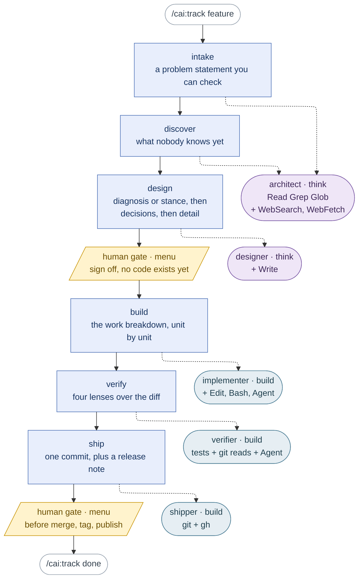

# claude-all-in-one

English | [繁體中文](README.zh-TW.md)

A [Claude Code](https://claude.com/claude-code) plugin — with a generated
Codex CLI counterpart, `cai-codex` — that installs a working set of everyday
capabilities into every project on your machine: cheaper model routing, safer
git, and a shared set of behavioural rules. Its centre is `/cai:track`, which
carries one feature through six SDLC stages and keeps its state on disk, so a
new session can resume it where the last one stopped.

## How it fits together

Four layers, plus one underneath all of them.

- **The track.** `/cai:track <feature>` carries one feature through six SDLC
  stages, keeping state in `.claude/track/<feature>/state.md` so a new session
  with no memory of this conversation can resume it.
- **The six stages.** `intake`, `discover`, `design`, `build`, `verify`,
  `ship` — each also runs alone, track or no track. Exactly two stop for a
  human sign-off, both as a menu you pick from: after `design`, before any code
  exists, and before the irreversible steps inside `ship` — merging, tagging,
  publishing.
- **The tools.** Reachable any time, with no track running — see
  [Commands](#commands).
- **The knowledge.** Reference files that cost nothing until something reads
  them: 72 named refactoring cards, the smell-to-refactoring routing table, the
  six stage procedures, and a template for each kind of design document.

Underneath all of it, small scripts (`preflight.py`, `track_state.py`,
`design_probe.py`, `options_lint.py`, `validate.py`) settle what a
deterministic check can — may this stage start, where did the track stop —
before anything reaches a model, and `ledger.py` keeps an append-only record of
every attempt at every stage.

Stages run in order, top to bottom. The dotted line off each one names the
subagent it dispatches to — `stages.json` decides that, never judgement,
because the model tier rides on the agent. Agent colour is that tier: purple
is `think`, teal is `build`, grey is `chore`. Amber is a person: exactly two
boundaries wait for one.


```mermaid
---
config:
  flowchart:
    defaultRenderer: "elk"
---
flowchart TB
    START(["/cai:track feature"]) --> S1

    S1["intake<br/>a problem statement you can check"] --> S2
    S2["discover<br/>what nobody knows yet"] --> S3
    S3["design<br/>diagnosis or stance, then<br/>decisions, then detail"] --> HG1
    HG1[/"human gate · menu<br/>sign off, no code exists yet"/] --> S4
    S4["build<br/>the work breakdown, unit by unit"] --> S5
    S5["verify<br/>four lenses over the diff"] --> S6
    S6["ship<br/>one commit, plus a release note"] --> HG2
    HG2[/"human gate · menu<br/>before merge, tag, publish"/] --> DONE(["/cai:track done"])

    S1 -.-> AR
    S2 -.-> AR
    S3 -.-> DE
    S4 -.-> IM
    S5 -.-> VE
    S6 -.-> SH

    AR(["architect · think<br/>Read Grep Glob<br/>+ WebSearch, WebFetch"])
    DE(["designer · think<br/>+ Write"])
    IM(["implementer · build<br/>+ Edit, Bash, Agent"])
    VE(["verifier · build<br/>tests + git reads + Agent"])
    SH(["shipper · build<br/>git + gh"])

    classDef stage fill:#e8eefc,stroke:#4a6fb5,color:#17335f
    classDef human fill:#fff3cd,stroke:#c79100,color:#6b4e00
    classDef think fill:#efe6f7,stroke:#7d5ba6,color:#3d2757
    classDef build fill:#e6eef3,stroke:#4a7c94,color:#1f3f4d
    classDef ends fill:#ffffff,stroke:#9aa5b1,color:#33404d

    class S1,S2,S3,S4,S5,S6 stage
    class HG1,HG2 human
    class AR,DE think
    class IM,VE,SH build
    class START,DONE ends
```

Why `architect` appears twice, and why an agent is picked by tool grant rather
than by tier: [REFERENCE.md](REFERENCE.md#what-the-stage-diagram-cannot-show).

## Commands

The six stages, each also runnable on its own:

| Command | What it does |
|---|---|
| `/cai:track <feature>` | Create or resume a track. Also `status`, `skip <stage> --reason "<why>"`, and `done`. |
| `/cai:intake` | Turn a request into an acceptance-testable problem statement before any code exists. |
| `/cai:discover` | Surface what you don't know before writing code. |
| `/cai:design` | Write a design document for review — diagnosis, stance, decisions, detail, or delta. |
| `/cai:build` | Build a design's work breakdown unit by unit, test-first. |
| `/cai:verify` | Four read-only review lenses over a diff, then fix Blockers and Majors test-first. |
| `/cai:ship` | Squash to one conventional commit and write a release note; stops before merge, tag or publish until a person confirms. |

Tools, reachable any time:

| Command | What it does |
|---|---|
| `/cai:debug` | Find the root cause of a bug before proposing any fix. |
| `/cai:refactor` | Restructure code without changing its behaviour; every one of Fowler's 72 named refactorings is also its own `/cai:<name>`. |
| `/cai:git` | Run git and `gh` operations on the `chore` tier instead of the main session model. |
| `/cai:chore` | Run a mechanical one-off — renames, formatting, lookups — on the `chore` tier. |
| `/cai:quiz` | Quiz you on your own branch diff before you merge it. |
| `/cai:plan-review` | Read a plan, design doc, or spec the way a senior architect would. |
| `/cai:options` | Lay out two or more ways forward so a person can actually choose between them. |
| `/cai:usage` | Token usage and equivalent API spend for one track, or across projects. |
| `/cai:models` | Put each model tier on the model you choose, for you alone. |
| `/cai:viewer` | Open the [Agent Viewer](#agent-viewer). |

What to type when: [MANUAL.md](MANUAL.md#what-to-type). Full descriptions, the
subagents, and the guard and hooks that are always on:
[REFERENCE.md](REFERENCE.md).

## Agent Viewer

<p align="center">
  
</p>

`/cai:viewer` opens a local-only web page (by default `127.0.0.1:7788`) that
lists every running Claude Code and Codex main session: which are waiting for
your answer, which have finished and wait for instructions, and which are still
running. A session that belongs to a `cai` track also shows its six stages and
the time recorded in each. Filter by *Needs you*, *cai track* or *Other
agents*, switch theme and language (English / 繁體中文), and optionally have it
chime when a session needs you. The page only shows; you answer in the
terminal. `/cai:viewer stop` closes it.

## Install

Needs Claude Code CLI 2.1.283 or later (installed and authenticated), Git, and
Python 3 on `PATH` — `python3` on macOS/Linux, `python` or the `py` launcher on
Windows. The bash guard needs it; `/cai:setup` tells you if it's missing.
Optional: the GitHub CLI (`gh`), authenticated, for the pull request `ship`
opens and for ticket mirroring.

Inside any Claude Code session:

```
/plugin marketplace add millerlai/claude-all-in-one
/plugin install cai@claude-all-in-one
```

Restart the session, then run:

```
/cai:setup
```

Setup copies the rule files into `~/.claude/rules/`, asks which language you
want Claude to reply in, sets up your global `~/.claude/CLAUDE.md`, offers a
project CLAUDE.md for the current repo, verifies the bash guard actually
fires, and offers to install the status line. Restart once more so the new
rules load.

Agents, commands, and the guard work in every project from then on. The rules
apply to every project too, since they live at user scope.

### Codex CLI

`cai-codex` is the generated counterpart for Codex CLI — the same cost-tiered
agents, skills, and rules, kept in sync automatically. It needs `codex-cli`
0.157.1 or later (`codex --version`); an older one drops the marketplace entry
silently.

```
codex plugin marketplace add millerlai/claude-all-in-one
codex plugin add cai-codex@claude-all-in-one
```

Start Codex with `--enable default_mode_request_user_input` so `$setup`'s
language question renders as a menu, then run `$setup` inside it. It writes
into `~/.codex`, so approve running it outside the sandbox when asked; then run
`/hooks`, trust the cai entry, and restart Codex. Skills work the same way with
`$` in place of `/cai:` — `$track <feature>`, `$design`, `$verify`.

What is equivalent, what is degraded, and the human gates:
[`plugins/cai-codex/README.md`](plugins/cai-codex/README.md). The full
install, update and uninstall steps:
[REFERENCE.md](REFERENCE.md#using-it-with-codex-cli).

## Updating

The marketplace is cloned locally, so refresh it first — otherwise an update
re-serves the cached commit:

```
/plugin marketplace update claude-all-in-one
/plugin update cai
```

Restart the session — running sessions don't hot-reload plugin agents or
hooks. If the update changed the rules, run `/cai:setup` to copy them into
`~/.claude/rules/` and restart once more, since rules are read at startup.

An update that doesn't take, or a cache that looks corrupted:
[REFERENCE.md](REFERENCE.md#where-the-installed-copy-lives).

## Model tiers

No component names a model. They name a **tier**, and one file says what each
tier currently resolves to: `chore` (`haiku`) for work that needs no judgement
on any given run, `build` (`sonnet`) for engineering judgement inside a fixed
contract, `think` (`opus`) for design trade-offs and repair. `/cai:models` puts
a tier on another model for you alone, and the choice survives
`/plugin update`. The full table, how re-tiering works, and what happens when
your account cannot run a tier's model:
[REFERENCE.md](REFERENCE.md#model-tiers).

## Compatibility

One version number, in `plugins/cai/.claude-plugin/plugin.json`, covers both
`cai` and its generated `cai-codex` counterpart — they always ship together
at the same version.

That version follows [SemVer](https://semver.org/) against a public
interface: skill names, `/cai:setup`'s write locations, the model-choice
save format, and the two platform floors below.

| Change | Bump | Example |
|---|---|---|
| Removing or renaming a skill; an old save file no longer loading; raising a platform floor | MAJOR | Dropping `/cai:quiz` |
| Adding a skill; adding an omittable field to an old save file; a track-format change | MINOR | Adding a new tool, or changing what `.claude/track/<feature>/state.md` records (called out on that release's GitHub Release page) |
| A script bug fix that doesn't change format; rewording a rule | PATCH | Fixing a guard regex |

Platform floors: Claude Code 2.1.283 or later, codex-cli 0.157.1 or later.

## More documentation

| Document | Read it when |
|---|---|
| [`MANUAL.md`](MANUAL.md) | You want to know what to type, what happens next, and what every refusal means. |
| [`REFERENCE.md`](REFERENCE.md) | You want the long form: every subagent, the always-on guard and hooks, how a test command is resolved, runtime verification, ticket mirroring, the rules, the status line, and what the plugin deliberately leaves out. |
| [`GUIDE.md`](GUIDE.md) | You are extending the plugin and need to know which component a new piece of guidance belongs in. |
| [`CONTRIBUTING.md`](CONTRIBUTING.md) | You are changing this repo: testing an unreleased checkout, the checks to run before pushing, and cutting a release. |
| [`plugins/cai-codex/README.md`](plugins/cai-codex/README.md) | You use Codex CLI: what maps onto what, and Windows-specific notes. |
| [`CHANGELOG.md`](CHANGELOG.md) | You want to know what changed in a release. |
