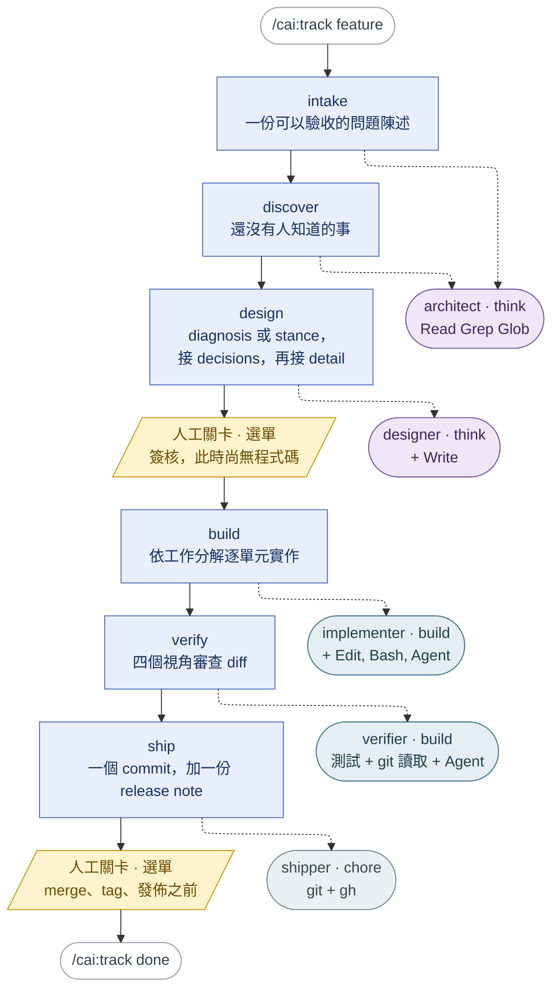

# claude-all-in-one

[English](README.md) | 繁體中文

一個 [Claude Code](https://claude.com/claude-code) plugin，把一整組日常能力裝進你機器上的每個專案：更省錢的模型分派、更安全的 git 操作，以及一套共用的行為規則。

三份文件，各自回答不同的問題。這一份說明「有哪些元件」。[`MANUAL.md`](MANUAL.md) 說明「怎麼操作」：該輸入什麼、接下來會發生什麼、每一種拒絕代表什麼意思。[`GUIDE.md`](GUIDE.md) 說明當你要擴充 plugin（而不只是使用它）時，一條新的指引該放進哪個元件。MANUAL 與 GUIDE 目前只有英文版。

## 整體架構

四層，外加墊在所有層底下的一層。

- **軌道（track）。** `/cai:track <feature>` 帶著一個 feature 走完六個 SDLC 階段，狀態存在 `.claude/track/<feature>/state.md`，所以一個完全不記得這段對話的新 session 也能接手繼續。`/cai:track status` 告訴你停在哪裡；`/cai:track skip <stage> --reason "<why>"` 會記下跳過某階段的理由，而不是默默略過。
- **六個階段（stage）。** `intake`、`discover`、`design`、`build`、`verify`、`ship`。每個階段的程序都是 `skills/track/references/stage-*.md` 底下的一份參考檔，有兩種讀法：由軌道派出的 subagent 讀，或由該階段自己的精簡 skill（`/cai:intake`、`/cai:discover`、`/cai:design`、`/cai:build`、`/cai:verify`、`/cai:ship`）在有人只想單獨跑這個階段時讀——有沒有軌道都可以。恰好有兩處會停下來等人簽核：`design` 之後、任何程式碼存在之前；以及 `ship` 內部那些不可逆操作（merge、打 tag、發佈）之前。兩者都以選單呈現讓你點選，絕不會要你打出 `approved` 這個字。而且第一個關卡是被強制執行、而非靠記憶：ledger 沒有記錄到「有人選了 Approve」之前，`build` 拒絕啟動；簽核之後設計文件若被改過，它也會再次拒絕。
- **工具。** 不需要跑軌道、隨時可用：`/cai:refactor`、`/cai:debug`、`/cai:git`、`/cai:chore`、`/cai:quiz`、`/cai:plan-review`、`/cai:options`、`/cai:usage`。
- **知識。** 在被讀取之前完全不花成本的參考檔：`refactoring-catalog/` 底下 72 張具名重構卡、smell 到重構手法的對照表、上述六份階段程序，以及五種設計文件（diagnosis、stance、decisions、detail、delta）各一份範本。

墊在最底下的是：`preflight.py`、`track_state.py`、`design_probe.py`、`options_lint.py` 與 `validate.py`，在任何東西送進模型之前，先回答那些確定性檢查就能判定的問題——這個階段可以開始嗎？軌道停在哪裡？這份設計文件真的具備它宣稱的結構嗎？讀者在一份選項清單裡找得到「可逆性多高」嗎？`ledger.py` 則保存這些檢查所讀的紀錄：每個階段的每一次嘗試，只附加、永不修改，讓新 session 能說出某個階段已經試了幾次、上次為什麼失敗、是誰放行的。

### 六個階段，以及各由誰執行

階段由上而下依序執行。從每個階段拉出的虛線，指向它派工的 subagent——由 `stages.json` 決定，絕不靠判斷，因為模型等級是跟著 agent 走的。agent 的顏色就是它的等級：紫色是 `think`、青色是 `build`、灰色是 `chore`。琥珀色代表人：恰好有兩道邊界要等人。



有兩件事圖上畫不出來。第一，每個階段都先跑 `preflight.py`——這個檢查不花任何成本，會在呼叫模型之前就拒絕；它的運作方式寫在 [`MANUAL.md`](MANUAL.md)。第二，`architect` 出現兩次，是因為 `intake` 和 `discover` 都只讀不寫：一個 agent、兩個呼叫者——這正是判斷一個 agent 值不值得擁有自己檔案的標準。

選 agent 看的是工具權限，不是等級。`design` 需要能 `Write` 的 agent，`ship` 需要能跑 `git` 的 agent——只按等級挑選，正是早期草稿把 `ship` 指向一個唯讀、根本不可能 push 的 agent 的原因。

### 軌道的工具

| 指令 | 作用 |
|---|---|
| `/cai:track <feature>` | 建立或接續一條軌道。拒絕以 `current` 與 `done` 作為名稱；拒絕開第六條進行中的軌道（`done/` 底下的不算）。另有 `status`、`skip <stage> --reason "<why>"` 與 `done`。 |
| `/cai:intake` | 在任何程式碼存在之前，把需求轉成可驗收的問題陳述：探索脈絡、一次只問一個問題、提出 2-3 種做法、等待核可。僅限使用者手動呼叫。 |
| `/cai:discover` | 在寫程式之前找出你不知道的事——盲點掃描、詞彙階梯、訪談、選項空間或 mock，哪個未知數會影響最多工作就用哪個。當程式碼區域不熟悉、或成果要憑外觀與手感評斷時，也會自動觸發。 |
| `/cai:design` | 撰寫供審查的設計文件。兩個入口，由一個測試決定走哪邊——「寫得出一個現在會失敗、而按照既有承諾本來應該會過的測試嗎？」寫得出：**diagnosis**（東西壞了，一頁寫根因與修法）。寫不出、因為從來沒承諾過：**stance**（為了什麼而犧牲什麼，一頁）。接著是 **decisions**（隨之而來的選擇，只有真正需要你的才會送到面前）、**detail**（據以實作的文件），或 **delta**（從已實作的分支回推既成的決策）。僅限使用者手動呼叫。 |
| `/cai:build` | 依 detail 設計的工作分解逐單元實作，測試先行，每個單元驗證並 commit 之後才開始下一個——沒有設計文件時，也可以自行切出帶檢查點的單元。僅限使用者手動呼叫。 |
| `/cai:verify` | 平行派出四個唯讀審查者（correctness、conformance、coverage、security）檢視分支 diff，整合它們的發現，再以「先寫會失敗的測試、修完變通過」的方式修正 Blocker 與 Major。 |
| `/cai:ship` | 把分支 squash 成一個 conventional commit、撰寫 release note，並在 merge、打 tag 或發佈之前停下，直到有人確認。僅限使用者手動呼叫。 |

### 其他工具

| 指令 | 作用 |
|---|---|
| `/cai:refactor` | 在不改變行為的前提下重整程式碼：安全網循環、smell 對照表，以及全部 72 種具名重構的操作步驟，跑在 `build` 等級。 |
| `/cai:debug` | 在提出任何修正之前先找出 bug 的根本原因——失敗的測試、崩潰、stack trace、以前正常現在壞掉的東西。 |
| `/cai:git` | 在 `chore` 等級而非主 session 的模型上執行 git 與 `gh` 操作。動手前先確認會碰到什麼，絕不 stage 你沒指名的檔案。 |
| `/cai:chore` | 在 `chore` 等級執行任何機械性的一次性工作——改名、格式化、查找——若發現其實需要真正的推理，會回報而不硬做。 |
| `/cai:quiz` | 在 merge 之前針對你自己的分支 diff 考你：先給一份關於不明顯行為的報告，再出你必須作答的題目——沒有一題能光靠報告回答。 |
| `/cai:plan-review` | 以資深架構師的角度閱讀實作計畫、設計文件或規格：把每個設計元素追溯回需求，再用八個視角檢視——過度設計、邊界、資料與狀態、失敗模式、可測試性、交付、順序與精確度。為每種設計文件附上骨架範本。也會在 Claude 自己的計畫交給你之前先審一遍。 |
| `/cai:options` | 把兩種以上的做法攤開，讓人真的能做選擇：共同的比較維度、每個選項六個欄位（含一個日常生活的 ELI5 比喻）、一個推薦，以及讓推薦失效的條件。在選項清單送出之前用，或在清單已送出但讀者無從下手之後用。 |
| `/cai:usage` | 單一軌道、或過去 N 天所有專案的 token 用量與等值 API 花費——外加各階段的流程指標：第一次嘗試是否通過、週期時間、重工次數，以及真正由人簽核的比例。所有數字都來自 `usage_report.py`，模型不自行重述任何一個。跑在 `chore` 等級。 |

### 72 種具名重構

Fowler 目錄中的每一種重構也各自是一個 slash command——`/cai:extract-method`、`/cai:replace-conditional-with-polymorphism`，以及另外 70 個——位於 `plugins/cai/refactoring-catalog/`。每一個都帶有 `disable-model-invocation: true`，所以只有人親手輸入名稱才能啟動，而且它們的 `description` 不計入下文的常駐預算檢查——否則這 72 份程序不論當天有沒有人要重構，都會常駐在每個 session 的 context 裡。

### `/cai:goal`——還在，但即將退場

`/cai:goal` 比軌道更早出現：它審查一份設計文件後分流——有工作分解的逐單元實作，其餘交給單一 implementer，兩條路最後匯流到同一個測試與回報步驟。它仍隨 plugin 出貨、也仍然可用，但 `/cai:track` 就是要取代它，而且 `goal` 本身的分流已經和 `design` → `build` → `verify` 階段現在更明確做的事重疊。它原本只保留到有人把一條軌道從頭跑到尾為止；這件事早已發生多次（截至 2026-09-14 已完成十一條軌道），所以讓它退場現在是一項獨立的變更，而不是還在等待的條件。如果你是從零開始，請直接用 `/cai:track`。

### Subagents

沒有任何元件指名特定模型——下面每一個都只指名一個**等級**；參見[模型分級](#模型分級)。每個 subagent 不是由軌道階段派出，就是由上述某個工具派出。

| Agent | 等級 | 由誰派出 |
|---|---|---|
| `explorer` | `chore` | 唯讀偵察。 |
| `test-runner` | `chore` | 執行 repo 自己的自動化檢查。 |
| `shipper` | `chore` | `ship` 階段。 |
| `implementer` | `build` | `build` 階段、`/cai:build`、`/cai:goal`。 |
| `reviewer` | `build` | `verify` 階段、`/cai:verify`——一次三個，各負責一個視角：correctness、conformance、coverage。 |
| `security-reviewer` | `build` | `verify` 階段的第四個視角：shell 執行、什麼會進入參數向量（argv）、被保存下來的內容裡的機密、guard 繞過——就這四項，沒有第五項。 |
| `refactoring-detector` | `build` | 重構掃描期間，跨模組群組平行分析 smell。 |
| `verifier` | `build` | `verify` 階段。 |
| `architect` | `think` | `intake` 與 `discover` 階段。 |
| `designer` | `think` | `design` 階段。 |

### 其他常駐機制

| | |
|---|---|
| **Bash 安全防護** | 掛在 Bash *與* PowerShell 工具上的 `PreToolUse` hook。阻擋 force push、`reset --hard`、`git clean -f`、`--no-verify`、`rm -rf` 以及等效的 `Remove-Item -Recurse -Force`、直接 commit 到 `main`/`master`，以及 Bash 指令裡出現的 PowerShell here-string 語法——就是那個會在 commit 訊息裡留下多餘 `@` 字元的寫法。它也會在**工作目錄有未提交變更時**阻擋 `git checkout -- <paths>` 與 `git restore`——這正是「驗證步驟把它原本要檢查的修正吃掉」的樣子；工作目錄乾淨時這兩個指令什麼都不會丟，直接放行。被擋下時會附上修正建議，而不只是拒絕。 |
| **共用規則** | 八份指令檔，涵蓋 Claude 應如何溝通、驗證主張、寫程式、執行工作流程、選擇模型、使用記憶、撰寫文件，以及呈現選項。由 `/cai:setup` 安裝到使用者層級。 |
| **嘗試 ledger** | 軌道的每一次階段嘗試——`passed`、`failed`、`blocked`、`skipped`，或供應商拒絕服務時的 `unavailable`——都會附加到 `.claude/track/<feature>/ledger.jsonl`，連同它的關卡類型（`auto` 或 `human`）、所指 artifact 的 SHA-256，以及自上一筆紀錄以來該 session 花掉的 token。另有一份帶著專案與軌道名稱的副本寫到 `~/.claude/cai/usage.jsonl`，這就是 `/cai:usage` 跨專案讀取的來源。某個階段自上次通過或被跳過以來，累積五次 failed 或 blocked 就會被封頂，拒絕訊息會列出三種解法；`unavailable` 永遠不計入。 |

### Ticket 鏡像——選用，以專案為單位

一條軌道可以把進度鏡像到一個 GitHub issue。除非專案在 `.claude/cai.json` 開啟，否則什麼都不會發生：

```json
{ "ticket": { "enabled": true, "backend": "github" } }
```

接著直接從那則 issue 開一條軌道——`/cai:track https://github.com/<owner>/<repo>/issues/123`。參數只要含 `://` 或全是數字，就會被當成 ticket 而不是目錄名：先讀那則 issue、從標題提一個名字給你確認，並在第一個階段開始之前寫好 pointer。想自己取名時，兩步式的 `ticket.py point --track-dir … --ref …` 仍然可用。兩種寫法、以及一份「從一個 issue 連結到 PR 合併」的端到端範例，都寫在 [`MANUAL.md`](MANUAL.md)。之後 `intake` 會把該 issue 當作起始需求讀入，**並且判定路線**：它會試著寫一個「現在會失敗、而按照既有承諾本來應該會過」的測試，結果決定 design 階段走 `diagnosis` 還是 `stance`。issue 自己的措辭不作數——「加一個 retry」讀起來像新功能，卻經常是症狀。每一列通過的階段與每一次跳過，都會更新 issue 上的同一則留言——內容是六個階段列，不含本機的 artifact 路徑；`ship` 會各用一個獨立回合分別詢問：是否要把它自己那一列也投影上去，以及在它的指令實際執行完之後，是否要關閉該 issue。它透過 `gh` CLI 操作 repo 自己 remote 上的 issue。投影失敗會記錄在該軌道的 `ticket.json`，永遠不會讓階段失敗，也不計入重試上限。

## 刻意不做的事

大公司的 AI-SDLC 文章裡都有、而這個 plugin 沒有的四件事。每一項都是有代價的取捨，而不是等著被補上的缺口，並且各自寫明了在什麼條件下會改變。

**產出物鏈留在你的機器上。** 軌道的 `state.md`、嘗試 ledger 與實作筆記都放在 `.claude/track/` 底下，不納入版本控制：ledger 只能附加，納管的副本每次 merge 都會衝突；而階段指標也不是交付物。軌道與外界的連結是 ticket 編號——`ticket.py` 把每個階段的列單向投影到關聯的 issue。設計文件是例外：值得保留的會放進 `docs/design/`，隨 PR 一起走。代價是設計文件無法在被據以實作之前先在 PR 上審查，而且一台機器的 ledger 無法和另一台比對。若需要第二個人在 PR 上（而不是在 session 裡）簽核設計，這一點就會改變。

**沒有一群背景 agent 自動開 pull request。** 一條軌道就是穿過六個階段的單一車道：主 session 驅動它，每個階段派出一個 subagent，並在兩個人工關卡停下。沒有讓 agent 無人看管地領取工作、從 issue 一路做到 PR 的路徑。若某個階段需要展開超過五個 subagent 並在其間做合併邏輯、若流程長出真正的「失敗就退回 build」迴圈，或若實際使用中發現階段順序被跳過——這是當初婉拒時記下的三個條件——這一點就會改變。

**Pull request 上沒有審查或 eval job。** 四個審查視角在 `verify` 階段、在驅動軌道的那台機器上、以訂閱方案執行；eval suite 則由一個選用的本機指令執行。兩者都沒有接上 CI。由 PR 觸發的 job 會讓每個 PR 都向 API key 計費，還需要一組沒人設定過的 runner 憑證；而 eval suite（三個案例、十一個 grader）太單薄，撐不起紅綠燈關卡。實測：一次四視角審查約等於 US$3.25 的 API 花費，一次 eval 約 US$0.24。當 eval suite 足以把關（案例多到紅燈有意義），或某位貢獻者的 PR 需要一次本機沒人會跑的審查時，這一點就會改變。

**沒有維運階段的自動化。** 大公司文章裡的 Stage 6 附帶了控制界限被突破時的自動觸發、排程掃描、一個待命的 agent——這些都假設有一個正在運行、有訊號可監看的服務，以及可以呼叫的待命輪值。這個 plugin 兩者都沒有。它保留的替代做法是：`/cai:track done` 會執行 `track_state.py left-open`，把軌道的 `Left open` 項目印成可以直接貼進 `/cai:intake` 開啟下一條軌道的形式——它不會自己開 issue，也不會排程任何事。若 cai 有一天運行在一個有值得監看訊號的線上服務上，這一點就會改變。

## 前置需求

- Claude Code CLI，已安裝並完成認證。
- Git。
- `PATH` 上有 Python 3——macOS/Linux 上是 `python3`，Windows 上是 `python` 或 `py` launcher。Bash 防護需要它；若缺少，`/cai:setup` 會告訴你。
- 選用：已認證的 GitHub CLI（`gh`）——供 `ship` 開 pull request 與 ticket 鏡像使用。

## 安裝

在任一 Claude Code session 中：

```
/plugin marketplace add millerlai/claude-all-in-one
/plugin install cai@claude-all-in-one
```

重啟 session，然後執行：

```
/cai:setup
```

Setup 會把規則檔複製到 `~/.claude/rules/`、詢問你希望 Claude 用哪種語言回覆、設定你的全域 `~/.claude/CLAUDE.md`、為目前的 repo 提供專案 CLAUDE.md、驗證 Bash 防護確實會觸發，並提供安裝狀態列的選項。之後再重啟一次，讓新規則載入。

從此以後，agents、指令與防護在每個專案都能運作。規則也套用到每個專案，因為它們位於使用者層級。

## 更新

marketplace 是 clone 到本機的，所以要先更新它——否則更新時拿到的還是快取裡的舊 commit：

```
/plugin marketplace update claude-all-in-one
/plugin update cai
```

之後重新執行 `/cai:setup` 以套用規則的變更，並重啟 session——執行中的 session 不會熱載入 plugin 的 agents 或 hooks。

如果內容變了但版本號沒升，或快取看起來損壞了：

```
/plugin marketplace update claude-all-in-one
/plugin uninstall cai@claude-all-in-one
/plugin install cai@claude-all-in-one
```

## 模型分級

沒有任何元件指名模型。它們指名的是一個**等級**，並由一個檔案說明每個等級目前對應到哪個模型：

| 等級 | 對應到 | 適用的工作 |
|---|---|---|
| `chore` | `haiku` | 任何一次執行都不需要判斷——找檔案、執行已知指令、明確指定的 git 操作、機械式改寫。 |
| `build` | `sonnet` | 在固定契約內的工程判斷——依規格寫程式、用單一視角審查一份 diff。 |
| `think` | `opus` | 設計取捨與修補——架構選擇、對照需求審查計畫、模糊的需求。 |

判準是 *「這個步驟每次執行時是否仍需要判斷？」*——而不是這種任務多常出現。頻率決定總量；判斷風險決定等級。

由此衍生出兩件事，而且兩者都是被強制執行、而非靠記憶：

- **不綁定任何模型版本。** 別名本來就會追蹤同一家族的最新模型——Anthropic 的文件明確寫道別名會「point to the recommended version for your provider and update over time」——所以 Haiku 5 推出時 `haiku` 照樣能用。只要有任何元件綁定具體版本（例如 `claude-haiku-4-5-20251001`），`validate.py` 就會讓建置失敗。
- **重新分級只要改一行。** 修改 `plugins/cai/models.json` 裡某個等級的別名，執行 `python plugins/cai/scripts/gen-models.py`，該等級的所有元件就會一起移動。`--check` 只回報差異不寫入；`--list` 印出對照表。任何元件的 frontmatter 與對照表不一致、宣告了模型卻不在表中，或在內文中提到模型家族名稱，`validate.py` 都會失敗。

*是否*要重新分級仍由人決定——那是判斷，而判斷正是這張表說不該自動化的東西。

## 規則

`/cai:setup` 會把這些檔案寫到 `~/.claude/rules/`。它們是一般的 Markdown——你可以自由編輯自己的副本；setup 會標出看起來被手動改過的檔案，並在覆寫前先詢問。

| 檔案 | 規範內容 |
|---|---|
| `communication.md` | 回覆語言、簡潔、先講結論。非英文的回覆或文件裡，保留英文的名詞第一次出現時先用該語言說明，再括號附上原文——或在開頭先放一張名詞表。 |
| `epistemics.md` | 回答前先查證、引用來源、絕不捏造、交付前以懷疑者角度重讀。何時該停下來問、怎麼問：一回合一個決定、透過提問工具、推薦選項放第一個。宣告完成前對照原始需求逐項驗證。 |
| `coding.md` | 純函式、註解寫「為什麼」、要仿照既有實作時先讀它的原始碼、最少程式碼、只做外科手術式的修改。 |
| `workflow.md` | 動程式碼前先開分支；非瑣碎的變更先規劃，並依你最可能改變心意的部分排序；憑感覺評斷的工作先做原型；記錄與計畫的偏離；宣告完成前跑測試；除非被要求，絕不 commit。 |
| `model-selection.md` | 付錢給模型之前，先用確定性檢查解決能解決的部分；剩下的再決定用哪個 subagent 與模型等級。 |
| `memory.md` | 只記錄穩定的事實；不要保存會過時的實作細節。 |
| `documentation.md` | Markdown、用 Mermaid 呈現結構、交付前驗證圖表。 |
| `option-explainer.md` | 如何呈現兩種以上的做法：共同維度、每個選項六個欄位（含一個日常生活比喻）、差異是你看得見的東西時附上各自的實際樣本，以及一個推薦和讓它失效的條件。 |

`communication.md` 出貨時預設為英文；`/cai:setup` 會把那一行改寫成你選的語言。

## 你的全域 CLAUDE.md

`~/.claude/rules/` 會自動載入，所以你的 `~/.claude/CLAUDE.md` 只需要放規則無從得知的東西——你的作業系統、你的技術棧，以及你不想再重演的錯誤。如果你還沒有這個檔案，setup 會寫入一份精簡的起始版本。

如果你已經有 CLAUDE.md，setup 絕不覆寫。它會回報你的哪些段落現在已被某個規則檔涵蓋，並提議精簡該檔——因為同一條規則放在兩處，每個 session 都會被送給模型兩次，而且只要其中一份被編輯，兩份就會開始分歧。`validate.py` 在出貨的範本上強制同樣的不變條件。

## 你的專案 CLAUDE.md

上面的 `~/.claude/CLAUDE.md` 是使用者層級——你的機器與個人習慣，套用到你碰的每個 repo。專案自己的 CLAUDE.md 是另一個層級：在*這個* repo 裡證明變更已完成的那一個指令、它的架構，以及專屬於它的慣例。它會被 commit 並與每位隊友共用，包括從沒裝過 cai 的人。

Setup 檢查的是你執行它的那個 repo（用 `git rev-parse --show-toplevel`，而不只是目前目錄——Claude Code 會載入 cwd 每一層父目錄中的 CLAUDE.md，所以真正重要的是 repo 最上層的那一份）。

如果 `<repo>/CLAUDE.md` 與 `<repo>/.claude/CLAUDE.md` 都不存在，setup 會提議從 `plugins/cai/templates/CLAUDE-project.md.tpl` 新增一份，只問一次，答應就原封不動複製過去——什麼都不幫你填。

如果已經存在，setup 絕不覆寫，也絕不刪除任何一句。它會回報範本的哪些段落已有對應內容、哪些沒有，以及哪些句子已經存在於 `~/.claude/rules/` 底下的某個檔案——然後只提議**附加**缺少的段落，寫入前先展示結果。

在 git repository 之外，setup 會跳過這一步，只印出範本路徑讓你自行複製。

## 狀態列

選用，而且是由 `/cai:setup` 提供，而不是隨 plugin 出貨——Claude Code 只會從 plugin 的設定中讀取 `agent` 與 `subagentStatusLine` 這兩個鍵，所以狀態列只能透過你自己的 `~/.claude/settings.json` 送達。

```
claude-all-in-one · main · Opus 5 [max] · ctx 92% · 5h 75% · 7d 60%
```

亮青色的專案名稱、git 分支、模型與它即時的 `/effort` 等級，接著是三個讀法一致的量表——顯示的是**剩下**多少，而不是用掉多少。50% 以上是綠色，降到 21% 為止是琥珀色，20% 以下是紅色，所以不論看哪個數字，同一個顏色代表的意思都一樣。兩個速率限制量表只對 Claude.ai 訂閱者顯示，而且要等 session 收到第一個 API 回應之後才會出現。

Setup 會把腳本複製到 `~/.claude/cai-statusline.py`，並把 `statusLine.command` 指向它。它絕不寫入 `~/.claude/statusline.py`——那個檔名屬於 Claude Code 內建的 `/statusline` 指令。如果你已經設定了狀態列，setup 會先讓你看是什麼、詢問後才取代，而且無論如何都會留下一份 `settings.json.bak`。plugin 更新後重新執行 setup 會刷新複製過去的腳本；存檔即生效，不需要重啟。

## 其他附帶內容

- `templates/multi-repo.settings.json`，位於這個 repo 的根目錄、而非安裝後的 plugin 內——放進某個 repo 的 `.claude/settings.json`，即可透過 `additionalDirectories` 讓 Claude 存取相鄰的 repo，並可選擇一併載入該 repo 自己的 `CLAUDE.md`／規則。
- 選用：[mermaid-cli](https://github.com/mermaid-js/mermaid-cli)（`npm install -g @mermaid-js/mermaid-cli`），讓 Claude 能實際渲染並驗證 `documentation.md` 要求的圖表。

Claude Code 內建的 auto memory 會把每個專案的筆記存在 `~/.claude/projects/<project>/memory/`——可用 `/memory` 查看。精心整理的指示屬於規則；硬性限制屬於 hooks。

## 貢獻／開發

從本機 checkout 加入 marketplace，再安裝以測試你的變更：

```
/plugin marketplace add /path/to/claude-all-in-one
/plugin install cai@claude-all-in-one
```

使用者收到的一切都在 `plugins/cai/` 底下——plugin 快取只複製那個目錄，所以它以外的東西永遠不會送到安裝者手上。寫一個新檔案之前，先決定它屬於哪一邊：[`CLAUDE.md`](CLAUDE.md) 的「Who a file is for」劃出了「會出貨的」與「只用來維護這個 repo 的」（`docs/`、`scripts/`、`tests/`、`.github/`、`.claude/skills/`）之間的界線。plugin 快取以版本號為鍵，所以任何修改 `plugins/cai/` 的 pull request 都要一併提升 `plugins/cai/.claude-plugin/plugin.json` 裡的 `version`——不升版，`/plugin update` 會繼續提供舊的副本。

要新增的是指引而不是程式碼？[GUIDE.md](GUIDE.md) 說明該由哪個元件承載它——慣例、程序或限制——以及放錯地方為什麼會讓它悄悄失效。這套判斷同樣適用於你自己的 `~/.claude/` 設定。

Push 之前，兩個都要跑：

```bash
python scripts/validate.py
python -m pytest
```

`validate.py` 會檢查：manifests；每個 agent 與 skill 是否具備 Claude Code 載入所需的 frontmatter；hook 指令指向的檔案是否存在；防護是否仍擋下該擋的東西；每個規則檔以及 `track`、`goal` 兩個 skill 是否在行數上限內；每個 `.cmd` 檔是否為純 ASCII、沒有任何文字檔以 UTF-8 BOM 開頭；eval grader 格式是否正確且不含機密；以及透過 `plugins/cai/scripts/provenance.py` 檢查 `docs/rule-provenance.md` 的每個條目引用的文字是否仍存在、每個重述某條規則的地方是否仍與它一致。由於模型能比對的每一段 `description` 都會在每個 session 送給它，它也會檢查所有 agent 與 skill 的 `description` 總長度（不含那 72 張重構卡——它們帶有 `disable-model-invocation: true`，因此不會在未被呼叫時送進模型）沒有超過上次量到的值。這是棘輪而不是目標：只能縮小或持平，永遠不會悄悄漲回去。

`pytest` 執行 `tests/`，驗證 `plugins/cai/scripts/` 底下的腳本實際行為；它是這個 repo 唯一的開發期相依套件（`pip install pytest`）。CI 會在每個 pull request 上、以 Linux 執行這兩者。Windows 只靠手動執行涵蓋；macOS 完全沒有涵蓋。

編輯時你很少需要自己跑 `validate.py`：`.claude/settings.json` 註冊了一個 `PostToolUse` hook，只要 Edit 或 Write 工具碰到 `plugins/cai/` 或 `.claude-plugin/` 就會執行它，並回報失敗項目。透過 shell 改寫的檔案不會觸發它。

當變更碰到 `plugins/cai/{skills,agents,hooks,rules,evals}/` 時，值得在本機跑一次選用的 eval——一次約 US$0.24。`--output-dir` 要指向 repo 之外，否則結果會落在會出貨的目錄樹裡：

```
claude plugin eval plugins/cai --ablation none --max-cost-usd 1 --threshold 0 \
  --trust-plugin --no-publish --model haiku --output-dir <path outside this repo>
```

維護用工具，沒有任何出貨元件會執行它們：

- `scripts/activation.py`——安裝了哪些 skills 與 agents，以及每一個實際在幾天內被用過。
- `tests/review-benchmark/` 搭配 `scripts/review_benchmark_score.py`——用標註過的 diff 衡量四個 `verify` 視角能抓到什麼；要花錢的那一半程序寫在 `scripts/review-benchmark-procedure.md`。
- `/gap-analysis`（`.claude/skills/gap-analysis/`）——把 cai 與某個外部實務做比較，並把結果寫到 `docs/design/`。
- `python plugins/cai/scripts/context_peak.py --track-dir .claude/track/<feature>`——一條軌道在主 session 的 context 佔用峰值，從本機 transcript 讀取。
