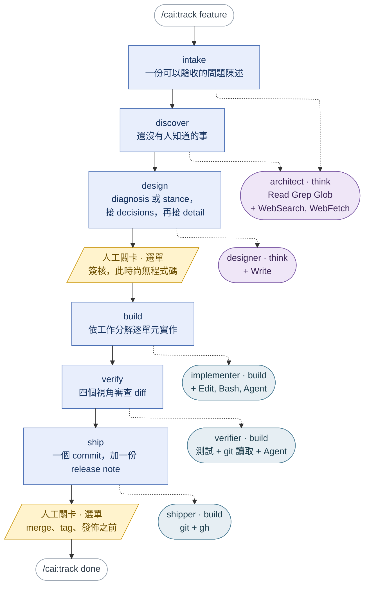
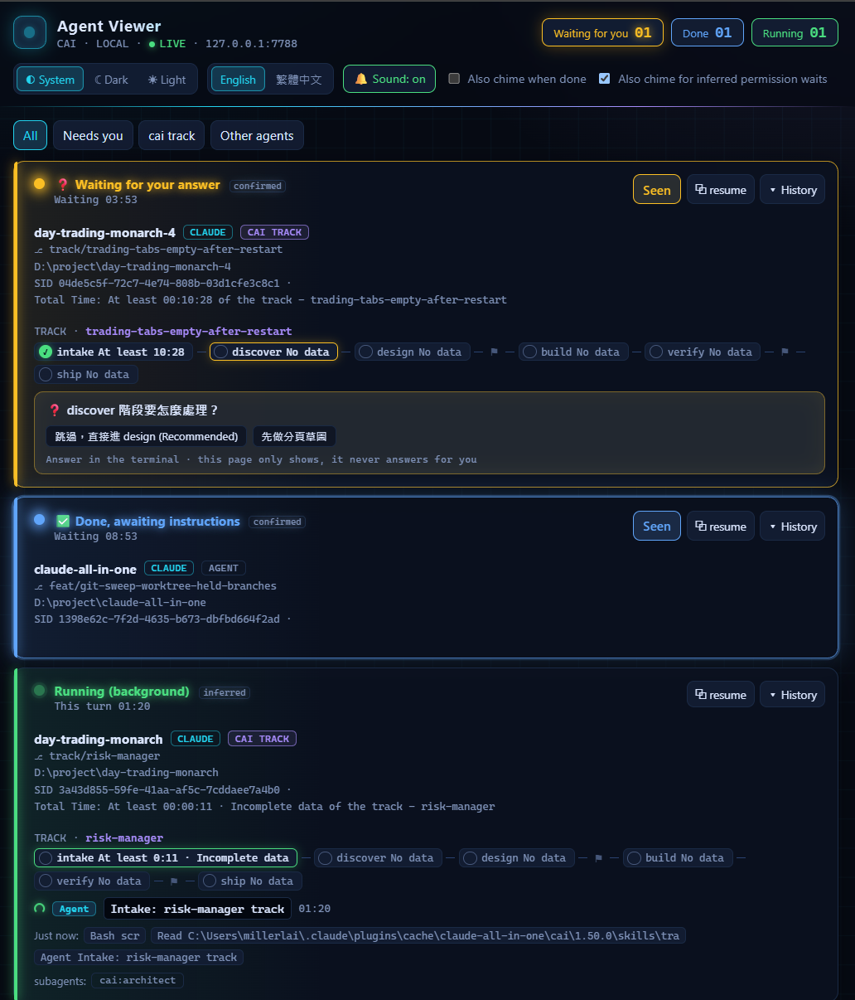

# claude-all-in-one

[English](README.md) | 繁體中文

一個 [Claude Code](https://claude.com/claude-code) 外掛（plugin）——另有一份自動產生、給 Codex CLI 用的對應版本 `cai-codex`——把一整組日常能力裝進你機器上的每個專案：更省錢的模型分派、更安全的 git 操作，以及一套共用的行為規則。它的核心是 `/cai:track`：帶著一個 feature 走完六個軟體開發生命週期（SDLC）階段，並把狀態存在磁碟上，讓新的 session 能從上一個停下的地方接手。

## 整體架構

四層，外加墊在所有層底下的一層。

- **軌道（track）。** `/cai:track <feature>` 帶著一個 feature 走完六個 SDLC 階段，狀態存在 `.claude/track/<feature>/state.md`，所以一個完全不記得這段對話的新 session 也能接手繼續。
- **六個階段（stage）。** `intake`、`discover`、`design`、`build`、`verify`、`ship`——每一個也能單獨執行，有沒有軌道都可以。恰好有兩處會停下來等人簽核，而且都以選單呈現讓你點選：`design` 之後、任何程式碼存在之前；以及 `ship` 內部那些不可逆的步驟（merge、打 tag、發佈）之前。
- **工具。** 不需要跑軌道、隨時可用——見[指令](#指令)。
- **知識。** 在被讀取之前完全不花成本的參考檔：72 張具名重構（refactoring）卡、smell（程式碼壞味道）到重構手法的對照表、六份階段程序，以及每一種設計文件各一份範本。

墊在最底下的是幾支小腳本（`preflight.py`、`track_state.py`、`design_probe.py`、`options_lint.py`、`validate.py`）：在任何東西送進模型之前，先回答那些確定性檢查（deterministic check，不需判斷、結果固定）就能判定的問題——這個階段可以開始嗎？軌道停在哪裡？而 `ledger.py` 以只附加、不修改的方式，保存每個階段的每一次嘗試。

階段由上而下依序執行。從每個階段拉出的虛線，指向它派工的子代理（subagent，由主 session 派出去做單一任務的 agent）——由 `stages.json` 決定，絕不靠判斷，因為模型等級是跟著 agent 走的。agent 的顏色就是它的等級（tier）：紫色是 `think`、青色是 `build`、灰色是 `chore`。琥珀色代表人：恰好有兩道邊界要等人。


```mermaid
---
config:
  flowchart:
    defaultRenderer: "elk"
---
flowchart TB
    START(["/cai:track feature"]) --> S1

    S1["intake<br/>一份可以驗收的問題陳述"] --> S2
    S2["discover<br/>還沒有人知道的事"] --> S3
    S3["design<br/>diagnosis 或 stance，<br/>接 decisions，再接 detail"] --> HG1
    HG1[/"人工關卡 · 選單<br/>簽核，此時尚無程式碼"/] --> S4
    S4["build<br/>依工作分解逐單元實作"] --> S5
    S5["verify<br/>四個視角審查 diff"] --> S6
    S6["ship<br/>一個 commit，加一份 release note"] --> HG2
    HG2[/"人工關卡 · 選單<br/>merge、tag、發佈之前"/] --> DONE(["/cai:track done"])

    S1 -.-> AR
    S2 -.-> AR
    S3 -.-> DE
    S4 -.-> IM
    S5 -.-> VE
    S6 -.-> SH

    AR(["architect · think<br/>Read Grep Glob<br/>+ WebSearch, WebFetch"])
    DE(["designer · think<br/>+ Write"])
    IM(["implementer · build<br/>+ Edit, Bash, Agent"])
    VE(["verifier · build<br/>測試 + git 讀取 + Agent"])
    SH(["shipper · build<br/>git + gh"])

    classDef stage fill:#e8eefc,stroke:#4a6fb5,color:#17335f
    classDef human fill:#fff3cd,stroke:#c79100,color:#6b4e00
    classDef think fill:#efe6f7,stroke:#7d5ba6,color:#3d2757
    classDef build fill:#e6eef3,stroke:#4a7c94,color:#1f3f4d
    classDef ends fill:#ffffff,stroke:#9aa5b1,color:#33404d

    class S1,S2,S3,S4,S5,S6 stage
    class HG1,HG2 human
    class AR,DE think
    class IM,VE,SH build
    class START,DONE ends
```

為什麼 `architect` 出現兩次、為什麼挑 agent 看的是工具權限而不是等級：見 [REFERENCE.md](REFERENCE.md#what-the-stage-diagram-cannot-show)（英文）。

## 指令

六個階段，每一個也能單獨執行：

| 指令 | 作用 |
|---|---|
| `/cai:track <feature>` | 建立或接續一條軌道。另有 `status`、`skip <stage> --reason "<why>"` 與 `done`。 |
| `/cai:intake` | 在任何程式碼存在之前，把需求轉成可驗收的問題陳述。 |
| `/cai:discover` | 在寫程式之前，找出你還不知道的事。 |
| `/cai:design` | 撰寫供審查的設計文件——診斷（diagnosis）、立場（stance）、決策（decisions）、細部設計（detail）或差異（delta）。 |
| `/cai:build` | 依設計的工作分解逐單元實作，測試先行。 |
| `/cai:verify` | 平行派出四個唯讀審查視角檢視 diff，再以測試先行的方式修正 Blocker 與 Major（最嚴重與次嚴重的發現）。 |
| `/cai:ship` | 把分支壓成一個遵循 conventional commit 慣例的 commit、寫一份 release note，並在 merge、打 tag 或發佈之前停下，直到有人確認。 |

工具，隨時可用：

| 指令 | 作用 |
|---|---|
| `/cai:debug` | 在提出任何修正之前，先找出 bug 的根本原因。 |
| `/cai:refactor` | 在不改變行為的前提下重整程式碼；Fowler 目錄裡的 72 種具名重構，也各自是一個 `/cai:<名稱>`。 |
| `/cai:git` | 在 `chore` 等級而非主 session 的模型上執行 git 與 `gh` 操作。 |
| `/cai:chore` | 在 `chore` 等級執行機械性的一次性工作——改名、格式化、查找。 |
| `/cai:quiz` | 在 merge 之前，針對你自己的分支 diff 考你。 |
| `/cai:plan-review` | 以資深架構師的角度閱讀計畫、設計文件或規格。 |
| `/cai:options` | 把兩種以上的做法攤開，讓人真的能做選擇。 |
| `/cai:usage` | 單一軌道、或跨專案的 token 用量與等值 API 花費。 |
| `/cai:models` | 把每個模型等級指定到你選的模型，只對你自己生效。 |
| `/cai:viewer` | 開啟 [Agent Viewer](#agent-viewer)。 |

什麼時候該輸入什麼：[MANUAL.md](MANUAL.md#what-to-type)。每個指令的完整說明、子代理，以及一律常駐的 guard（守門腳本）與 hook：[REFERENCE.md](REFERENCE.md)。這兩份目前只有英文版。

## Agent Viewer

<p align="center">
  
</p>

`/cai:viewer` 會開啟一個只在本機的網頁（預設 `127.0.0.1:7788`），列出每一個執行中的 Claude Code 與 Codex 主 session：哪些在等你回答、哪些已完成在等指示、哪些還在執行。屬於某條 `cai` 軌道的 session，還會顯示它的六個階段與各階段已記錄的時間。可以依 *Needs you*、*cai track* 或 *Other agents* 篩選、切換主題與語言（English／繁體中文），也可以選擇在有 session 需要你時發出提示音。這個頁面只負責顯示，回答要回到終端機。`/cai:viewer stop` 會關閉它。

## 安裝

需要 Claude Code CLI 2.1.283 或更新版本（已安裝並完成認證）、Git，以及 `PATH` 上有 Python 3——macOS/Linux 上是 `python3`，Windows 上是 `python` 或 `py` launcher。守門腳本需要它；若缺少，`/cai:setup` 會告訴你。選用：已認證的 GitHub CLI（`gh`），供 `ship` 開 pull request 與 ticket 鏡像（mirroring，把軌道進度同步到 GitHub issue）使用。

在任一 Claude Code session 中：

```
/plugin marketplace add millerlai/claude-all-in-one
/plugin install cai@claude-all-in-one
```

重啟 session，然後執行：

```
/cai:setup
```

Setup 會把規則檔複製到 `~/.claude/rules/`、詢問你希望 Claude 用哪種語言回覆、設定你的全域 `~/.claude/CLAUDE.md`、為目前的 repo 提供專案 CLAUDE.md、驗證守門腳本確實會觸發，並提供安裝狀態列的選項。之後再重啟一次，讓新規則載入。

從此以後，agents、指令與守門腳本在每個專案都能運作。規則也套用到每個專案，因為它們位於使用者層級。

### Codex CLI

`cai-codex` 是給 Codex CLI 的自動產生對應版本——同樣的分級 agents、skills 與規則，自動保持同步。它需要 `codex-cli` 0.157.1 或更新版本（用 `codex --version` 確認）；更舊的版本會悄悄地丟掉這個 marketplace 項目，不會有任何錯誤訊息。

```
codex plugin marketplace add millerlai/claude-all-in-one
codex plugin add cai-codex@claude-all-in-one
```

用 `--enable default_mode_request_user_input` 啟動 Codex，`$setup` 的語言問題才會以選單呈現，然後在裡面執行 `$setup`。它會寫入 `~/.codex`，所以被問到時請核准它在沙箱（sandbox，限制程式可存取範圍的隔離環境）之外執行；接著執行 `/hooks`、信任 cai 那一筆，再重啟 Codex。skills 的用法相同，只是把 `/cai:` 換成 `$`——`$track <feature>`、`$design`、`$verify`。

哪些是等價的、哪些有降級，以及人工關卡：見 [`plugins/cai-codex/README.md`](plugins/cai-codex/README.md)。完整的安裝、更新與移除步驟：[REFERENCE.md](REFERENCE.md#using-it-with-codex-cli)。

## 更新

marketplace 是 clone 到本機的，所以要先更新它——否則更新時拿到的還是快取裡的舊 commit：

```
/plugin marketplace update claude-all-in-one
/plugin update cai
```

重啟 session——執行中的 session 不會熱載入 plugin 的 agents 或 hooks。如果這次更新改了規則，執行 `/cai:setup` 把它們複製到 `~/.claude/rules/`，再重啟一次，因為規則是在啟動時讀取的。

更新沒有生效、或快取看起來損壞了：見 [REFERENCE.md](REFERENCE.md#where-the-installed-copy-lives)。

## 模型分級

沒有任何元件指名模型。它們指名的是一個**等級**，並由一個檔案說明每個等級目前對應到哪個模型：`chore`（`haiku`）給任何一次執行都不需要判斷的工作，`build`（`sonnet`）給固定契約內的工程判斷，`think`（`opus`）給設計取捨與修補。`/cai:models` 可以只為你自己把某個等級改指到另一個模型，而且這個選擇在 `/plugin update` 後仍然保留。完整對照表、重新分級怎麼做，以及帳號跑不了某個等級的模型時會發生什麼：[REFERENCE.md](REFERENCE.md#model-tiers)。

## 相容性

一個版本號（在 `plugins/cai/.claude-plugin/plugin.json`）同時涵蓋 `cai` 與它自動產生的 `cai-codex`——兩者永遠以同一版一起出貨。

版本號遵循[語意化版本（SemVer）](https://semver.org/)，針對一組公開介面：skill 名稱、`/cai:setup` 寫入的位置、模型選擇的儲存格式，以及下面兩個平台下限。

| 變更 | 升哪一段 | 例子 |
|---|---|---|
| 移除或改名某個 skill；舊的儲存檔再也載不進來；提高平台下限 | MAJOR | 移除 `/cai:quiz` |
| 新增 skill；在舊儲存檔上新增可省略的欄位；軌道格式變更 | MINOR | 新增一個工具，或改變 `.claude/track/<feature>/state.md` 記錄的內容（會在該版的 GitHub Release 頁面註明） |
| 不改變格式的腳本 bug 修正；改寫規則的措辭 | PATCH | 修正 guard 的正規表示式（regex） |

平台下限：Claude Code 2.1.283 或更新、codex-cli 0.157.1 或更新。

## 更多文件

| 文件 | 什麼時候讀 |
|---|---|
| [`MANUAL.md`](MANUAL.md) | 想知道該輸入什麼、接下來會發生什麼、每一種拒絕代表什麼意思。（英文） |
| [`REFERENCE.md`](REFERENCE.md) | 想看完整版：每個子代理、常駐的 guard 與 hook、測試指令怎麼解析、執行期驗證、ticket 鏡像、規則、狀態列，以及這個 plugin 刻意不做的事。（英文） |
| [`GUIDE.md`](GUIDE.md) | 你要擴充 plugin，需要知道一條新的指引該放進哪個元件。（英文） |
| [`CONTRIBUTING.md`](CONTRIBUTING.md) | 你要修改這個 repo：測試尚未發版的 checkout、push 之前要跑的檢查，以及發版。（英文） |
| [`plugins/cai-codex/README.md`](plugins/cai-codex/README.md) | 你用 Codex CLI：什麼對應到什麼，以及 Windows 專屬的注意事項。 |
| [`CHANGELOG.md`](CHANGELOG.md) | 想知道某一版改了什麼。 |
