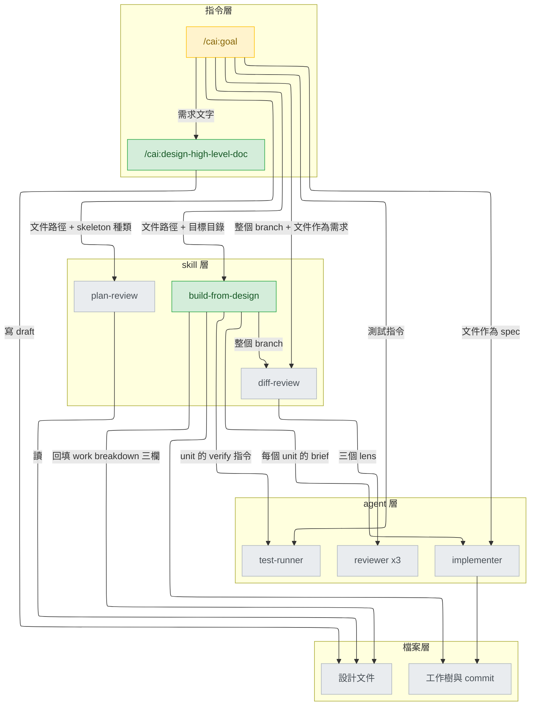
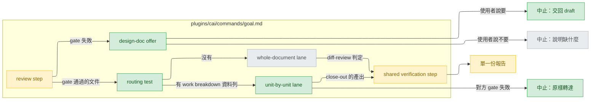
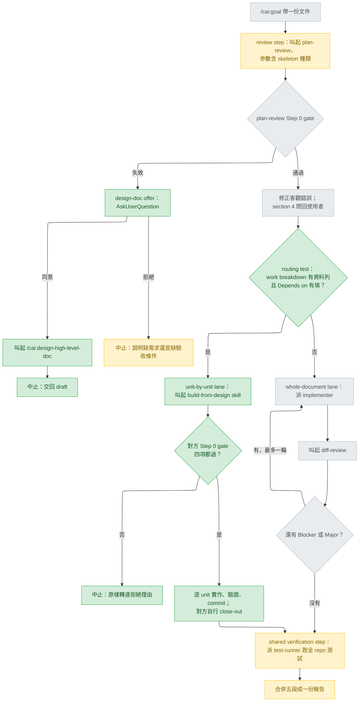
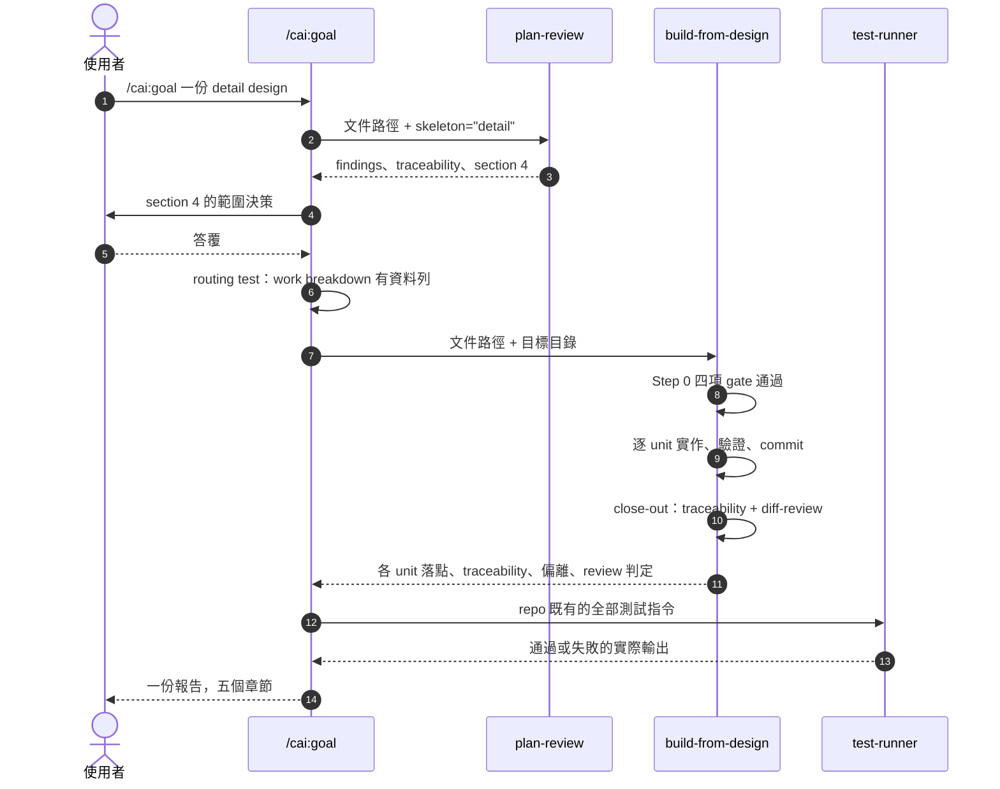
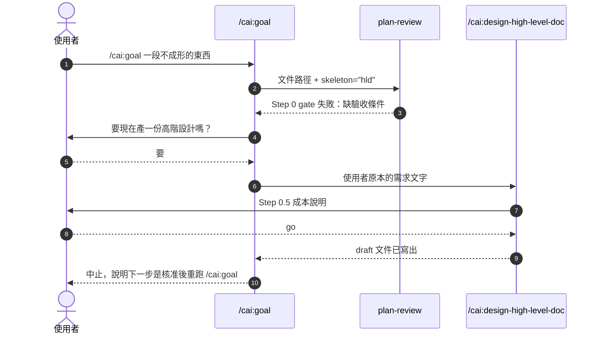
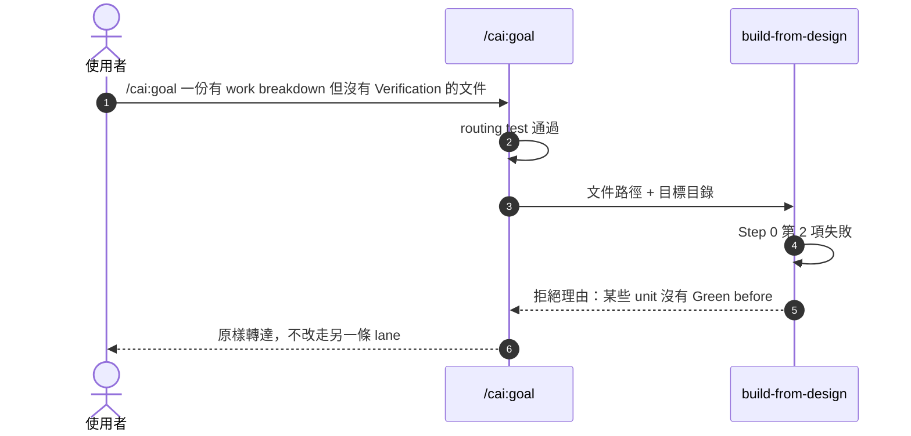

# goal-command-routing — detail design

## Reference

High Level Design doc: docs/design/2026-08-25-goal-command-routing-high-level.md
Status: approved 2026-08-25

### Traceability

| From the high-level design | Satisfied by | Status |
|---|---|---|
| UC1 | `plugins/cai/commands/goal.md:59-64`（分流判準）→ `:72-78`（交給 build-from-design） | covered |
| UC2 | `plugins/cai/commands/goal.md:12-31`（審查無條件先跑）；`:75-78` 明寫不重跑 close-out | covered |
| UC3 | `plugins/cai/commands/goal.md:40-55`（先問、同意才叫起、必然中止、`-p` 退回舊行為） | covered |
| R1 | `plugins/cai/commands/goal.md:75-78`（該 lane 不跑 diff-review）＋ `:110-117`（單一份五段報告） | covered |
| R2 | `plugins/cai/commands/goal.md:33-38`（真實 tier 軌跡） | covered |
| R3 | `plugins/cai/commands/design-implementation-detail-doc.md:425-428` 與 `:437-440` | covered |
| R4 | `plugins/cai/commands/goal.md:33-35` 取代了原本「runs on this session's own model」的錯誤宣稱 | covered |
| R5 | `plugins/cai/commands/goal.md:102-108`（兩條 lane 都到這裡，且必派 test-runner 跑目標 repo 既有檢查） | covered |
| R6 | `plugins/cai/commands/goal.md:14-19`（skeleton 為第二個必要參數） | covered |

建置後回填，每一列都指向已 commit 的真實行號（`ba11f2d`、`2ab424f`、`d8eddd7`）。附帶：`README.md:22` 讓使用者看得到的說明與上述行為一致（unit 2）。

反向追溯（本文件裡沒有對應高階設計 id 的元素）只有一個：`review step` 的**三輪修正上限**。高階設計沒有提過它，它是本層審查發現 `goal.md` 現行 Step 1 缺停止規則後，由使用者於 2026-08-25 決定補上的。記在這裡而不是回頭改已核准的高階設計。

## Requirement

`/cai:goal` 今天把任何設計文件都交給單一 `implementer`（`plugins/cai/commands/goal.md:28-31`），因此一份已經排好 unit、依賴與平行關係的 detail design，它的排程會被整份丟棄。

這次改動讓 `/cai:goal` 先審查、再依文件形狀分流、最後共用一段收尾：有 `## Work breakdown` 的走 `build-from-design` 的逐 unit 流程，沒有的走現行的整份實作流程，兩者匯流到同一段驗證與報告。

**怎麼知道成功**：拿三份文件各跑一次 `/cai:goal`——一份有 work breakdown、一份沒有、一份過不了 `plan-review` 的 gate——三次分別走到 unit-by-unit lane、whole-document lane、產設計文件的詢問，且每次都只產出一份報告。

## Glossary

| Term | Definition | Where it lives |
|---|---|---|
| review step | `/cai:goal` 的第一段：叫起 `plan-review`，修正客觀錯誤，把範圍決策問回使用者 | plugins/cai/commands/goal.md:11 |
| routing test | 讀設計文件並判定該走哪一條 lane 的檢查，判準與 `build-from-design` 的 Step 0 第 1 項逐字相同。**本文件的內部用語**，不寫進 `goal.md` | new — plugins/cai/commands/goal.md |
| unit-by-unit lane | 分流的其中一條：把文件交給 `build-from-design` skill，由它逐 unit 實作、驗證、commit 並自行收尾 | new — plugins/cai/commands/goal.md |
| whole-document lane | 分流的另一條：現行行為，把整份文件交給一個 `implementer`，再跑 `diff-review` | plugins/cai/commands/goal.md:26 |
| shared verification step | 兩條 lane 匯流後的共用收尾：派 `test-runner` 跑 repo 既有全部測試，並合併成單一份報告 | plugins/cai/commands/goal.md:44 |
| design-doc offer | `plan-review` 的 Step 0 gate 失敗時，詢問使用者是否要現在叫起 `/cai:design-high-level-doc` 的分支。**本文件的內部用語**，不寫進 `goal.md` | new — plugins/cai/commands/goal.md |
| Step 0 gate | `build-from-design` 開場檢查的四項條件：work breakdown 有資料列、Verification 覆蓋每個 unit、Implementation spec 有真簽章、不在 main/master 上 | plugins/cai/skills/build-from-design/SKILL.md:27 |
| skeleton | `plan-review` 用來判斷一份文件該被如何審查的兩套標題骨架，高階與細部各一 | plugins/cai/skills/plan-review/SKILL.md:179 |
| close-out | `build-from-design` 自己的 Step 6：回填 traceability、跑 `diff-review`、寫報告。**與 shared verification step 是不同的東西**，本文件不混用這兩個詞 | plugins/cai/skills/build-from-design/SKILL.md:267 |
| tier 軌跡 | 一次 `/cai:goal` 執行過程中，模型隨著被叫起的元件而改變的實際順序 | concept |
| pointer | 一份元件文件裡指向另一個指令的句子，例如「Implementing it is `/cai:goal`」 | plugins/cai/commands/design-implementation-detail-doc.md:435 |

## Budgets

| What | Number | Where it comes from |
|---|---|---|
| `goal.md` 改後行數上限 | 120 | 使用者決定，2026-08-25；現行 63 行（`wc -l plugins/cai/commands/goal.md`） |
| 改動的檔案數 | 3 | 使用者決定，2026-08-25 |
| whole-document lane 的重試上限 | 1 | plugins/cai/commands/goal.md:39-41 |
| `build-from-design` 每個 unit 的重試上限 | 1 | plugins/cai/skills/build-from-design/SKILL.md:172-176 |
| `review step` 的修正輪數上限 | 3 | 使用者決定，2026-08-25；沿用兩個 design command 的既有上限，plugins/cai/commands/design-implementation-detail-doc.md:408。`goal.md` 現行 Step 1 沒有上限，這是本設計新增的 |
| goal 自行檢查的 gate 項數 | 1（對方共 4 項） | plugins/cai/skills/build-from-design/SKILL.md:32-45 |
| 合併報告的固定章節數 | 5 | 本文件 Implementation spec 的 shared verification step |
| 需人工驗收的路徑數 | 3 | 本文件 Verification 表 |

## Design decisions

五項決策全部在高階設計裡由使用者選定，此處只記錄它們對實作的約束，不重新開放：

- **分流器保留原 lane**（HLD Decision 1，服務 UC1／UC2／R3）——`whole-document lane` 的**行為**一個字不改，但 `goal.md` 的**文字**必須重組，讓每一步都標明屬於哪一條 lane。
- **問過再叫上游**（HLD Decision 2，服務 UC3）——`design-doc offer` 一定先問，答應才叫起，且叫起後必然停在 `draft`。
- **交棒加薄收尾**（HLD Decision 3，服務 R1／R5）——`unit-by-unit lane` 不重跑 `diff-review`，`shared verification step` 只補全 repo 測試與合併報告。
- **接受 tier 軌跡並寫明**（HLD Decision 4，服務 R2／R4）——不加 frontmatter，改為在 `goal.md` 裡把真實軌跡寫對。
- **二次 gate 失敗就停**（HLD Decision 5，服務 UC1）——不退回另一條 lane。

本層新增的三項決策，均由使用者於 2026-08-25 選定：

- **範圍是三個檔案**——`goal.md` 加上兩處會因此變錯的指路（`README.md:22`、`design-implementation-detail-doc.md:426`／`:435`）。
- **命名採描述性**——`the unit-by-unit lane`／`the whole-document lane`／`the shared verification step` 三個名字進 `goal.md`，避開與 `build-from-design` 既有 close-out 的撞名；`routing test` 與 `design-doc offer` 只當本文件的內部用語，不進 `goal.md`。
- **`goal.md` 行數上限 120**。
- **`review step` 新增三輪修正上限**——現行 Step 1 沒有停止規則，沿用兩個 design command 的做法補上。

## Diagrams

### Architecture

### Component

### Flow

### Sequence — UC1（有 work breakdown 的文件）

### Sequence — UC3（過不了 gate 的文件）

### Sequence — 二次 gate 失敗

**跳過的 sequence 與原因**：UC2、R1–R6 沒有各自的 sequence。UC2 的呼叫順序就是 UC1 圖的前三步；R1、R2、R4、R5、R6 不是路徑而是同一批呼叫上的約束（誰不呼叫誰、參數帶什麼、哪一段在哪個 tier）；R3 完全不涉及執行期呼叫，只是兩處散文的改寫。九個 id 各畫一張會得到九張互相重疊的圖。

## Implementation spec

### review step

- **Responsibility**：把設計文件送進 `plan-review`，並告訴它該用哪一套 skeleton。
- **Interface**：`invoke the plan-review skill(document_path: str, skeleton: "hld" | "detail")`。第二個參數不是選填：`plan-review` 對細部設計要求 lens 8 先跑（`plugins/cai/skills/plan-review/SKILL.md:71-74`），沒有這個參數該規則不會被觸發。沿用 `plugins/cai/commands/goal.md:13` 既有的「invoke the *skill*」寫法，不指名工具。
- **Data**：入＝文件的絕對或 repo 相對路徑（字串）＋ skeleton 種類（列舉，`hld` 或 `detail`）。出＝`plan-review` 的五段回覆：verdict、traceability 表、findings、section 4、open questions。
- **Errors**：`plan-review` 的 Step 0 gate 失敗時，它回報缺的是 requirement 還是 acceptance criteria；此時控制權轉給 `design-doc offer`，不進 `routing test`。修正與重審**最多三輪**；第三輪後仍有 Major 就停下並報告未解項，不繼續迴圈。這條上限是本設計新增的（現行 `plugins/cai/commands/goal.md:11-24` 沒有），沿用兩個 design command 的既有做法（`plugins/cai/commands/design-implementation-detail-doc.md:408`）。
- **Concurrency**：不適用——單一 session 內序列執行，無共享狀態。
- **Observability**：把 `plan-review` 的 verdict 與 findings 數量原文放進最終報告第一段。
- **Where it lives**：`plugins/cai/commands/goal.md`，現行 Step 1（`plugins/cai/commands/goal.md:11`），改寫。
- **What it reuses**：`plugins/cai/skills/plan-review/SKILL.md:179`（兩套 skeleton 的定義）。

skeleton 種類的判定準則由**本設計新定**，既有元件裡沒有：文件含 `## Work breakdown` 或 `## Implementation spec` 標題即為 `detail`，否則 `hld`。挑這兩個標題的理由是它們只出現在細部設計 skeleton 裡，高階設計 skeleton 沒有任何一個（比對 `plugins/cai/skills/plan-review/SKILL.md:190-196` 與 `:206-218`），所以誤判需要一份刻意混合兩種骨架的文件。

這與 `routing test` 是**兩次不同的檢查**——skeleton 判定看標題在不在，`routing test` 看表格有沒有資料列。一份有 `## Work breakdown` 標題但表格空著的文件，會得到 `skeleton="detail"` 與 `whole-document lane`，那是正確的：它該被當細部設計審，但沒有排程可跑。

### design-doc offer

- **Responsibility**：`plan-review` 的 gate 失敗時，問使用者是否現在產一份高階設計。
- **Interface**：`AskUserQuestion` 一題兩選項——「現在產一份高階設計」／「先不要，我自己補」；答案為前者時 `invoke the /cai:design-high-level-doc command(requirement_text: str)`（依高階設計 C4，command 檔與 skill 一樣可被叫起）。
- **Data**：入＝`plan-review` 回報的缺項（`requirement` 或 `acceptance criteria`）＋ 使用者原始輸入。出＝使用者的選擇；選「要」時額外產出一份 `draft` 文件的路徑。
- **Errors**：非互動（`-p`）模式下問句無人回答，退回現行行為——說明缺什麼並停（`plugins/cai/commands/goal.md:22-25`）。
- **Concurrency**：不適用。
- **Observability**：不論走哪一支，最後訊息都要明說缺的是哪一項、以及使用者選了什麼。
- **Where it lives**：`plugins/cai/commands/goal.md`，新增，接在現行 Step 1 的第三個項目符號之後。
- **What it reuses**：`plugins/cai/commands/design-high-level-doc.md:39`（該指令自己會要成本同意）、`plugins/cai/commands/design-high-level-doc.md:251-259`（交回時必為 `draft`）。

叫起之後必然中止：該指令交回 `draft`，而只有使用者能改成 `approved`。這句話要寫進 `goal.md`，讓使用者在同意之前就知道。

### routing test

- **Responsibility**：判定文件該走哪一條 lane。
- **Interface**：讀 `## Work breakdown` 段落，判斷是否存在**資料列**——非分隔線的表格列，且該列的 `Depends on` 欄位非空。有＝`unit-by-unit lane`，無（含沒有該標題、只有表頭）＝`whole-document lane`。
- **Data**：入＝文件內容。出＝列舉值二選一。
- **Errors**：不適用——兩個結果都是有效輸出，沒有第三種。
- **Concurrency**：不適用。
- **Observability**：`goal.md` 要求把判定結果與判定依據（找到幾列）寫進報告，使用者才知道為何走了這一條。
- **Where it lives**：`plugins/cai/commands/goal.md`，新增，Step 2 開頭。
- **What it reuses**：`plugins/cai/skills/build-from-design/SKILL.md:32-34` —— 判準逐字取自該處，不另行定義。兩處必須一致，否則會發生轉派後立刻被退回。

不使用 `design_probe.py` 當判準：它只有 `hld` 與 `detail` 兩種模式，且 `detail` 要求十三個標題全到（`plugins/cai/scripts/design_probe.py:37-40`），外來文件必然失敗在標題上（`plugins/cai/skills/build-from-design/SKILL.md:56-58`）。

### unit-by-unit lane

- **Responsibility**：把文件交給 `build-from-design`，並在它拒絕時停下。
- **Interface**：`invoke the build-from-design skill(document_path: str, target_dir: str)`。回傳是該 skill 自己 Step 6 的報告。
- **Data**：入＝文件路徑＋目標目錄。出＝各 unit 的落點與 commit id、回填後的 traceability 表、偏離紀錄、`diff-review` 判定與未解的 Minor。
- **Errors**：對方 Step 0 四項 gate 任一失敗 → 原樣轉達拒絕理由並中止；**不退回 `whole-document lane`**。中途需要文件沒做過的架構決策時，對方自己會問使用者（`plugins/cai/skills/build-from-design/SKILL.md:134`），`goal.md` 不介入。
- **Concurrency**：對方可能開兩個 git worktree 平行跑兩個 unit（`plugins/cai/skills/build-from-design/SKILL.md:186-233`）。`goal.md` 不管這一層，也不得另行開 worktree。
- **Observability**：對方的偏離紀錄整段納入最終報告第三節。
- **Where it lives**：`plugins/cai/commands/goal.md`，新增，Step 2 的其中一支。
- **What it reuses**：整個 `plugins/cai/skills/build-from-design/SKILL.md:1`。

**這條 lane 不呼叫 `diff-review`，也不寫自己的報告。** 兩者都由對方 Step 6 完成（`plugins/cai/skills/build-from-design/SKILL.md:276-285`）。這一句必須明寫在 `goal.md` 裡，否則執行時會照著 Step 2 現行的無條件敘述再跑一次。

### whole-document lane

- **Responsibility**：沒有排程可用時，把整份文件交給一個 `implementer`，再審查其產出。
- **Interface**：`dispatch the cai:implementer agent(spec: 文件內容或路徑, named_targets: 它指名的檔案與行為)`，接著 `invoke the diff-review skill(requirement: 文件路徑)`。沿用 `plugins/cai/commands/goal.md:28` 與 `:33` 既有的「dispatch the *agent* / invoke the *skill*」寫法。
- **Data**：入＝文件。出＝改動加上 `diff-review` 的排序 findings。
- **Errors**：仍有 Blocker 或 Major 時最多再跑一輪 implementer 加 diff-review；之後仍未解就停下報告（`plugins/cai/commands/goal.md:39-41`）。
- **Concurrency**：不適用。
- **Observability**：`diff-review` 判定與未解 Minor 進最終報告第三節。
- **Where it lives**：`plugins/cai/commands/goal.md:26`，行為不變，僅在文字上標明它屬於這一條 lane。
- **What it reuses**：`plugins/cai/agents/implementer.md:1`、`plugins/cai/skills/diff-review/SKILL.md:1`。

### shared verification step

- **Responsibility**：兩條 lane 匯流後，跑 repo 既有的全部自動化測試，並合併出單一份報告。
- **Interface**：`dispatch the cai:test-runner agent(command: 目標 repo 自己既有的測試或檢查指令)`，之後在本層產生報告文字。**指令不得寫死在 `goal.md` 裡**——`/cai:goal` 出貨給任何 repo 使用，測試指令必須從目標 repo 當場判定（`plugins/cai/commands/goal.md:46-48` 現行寫的就是「every automated test/check this repo already has」）。本 repo 恰好是 `python scripts/validate.py`，那是驗收這次改動時要用的，不是 `goal.md` 該記住的。
- **Data**：入＝上游 lane 的產出（兩種形狀之一）＋`plan-review` 的結果。出＝五個章節：設計文件被修正了什麼、實作了什麼（逐檔）、審查判定與未解 Minor、測試實際輸出、編號的手動驗證步驟。
- **Errors**：測試失敗 → 報告如實寫出失敗輸出，不宣稱完成。找不到可跑的測試 → 報告明說「無自動化測試可跑」，不留空白。
- **Concurrency**：不適用。
- **Observability**：這一步本身就是可觀測性的產出點。
- **Where it lives**：`plugins/cai/commands/goal.md:44`，現行 Step 3，改寫成兩條 lane 共用。
- **What it reuses**：`plugins/cai/agents/test-runner.md:1`。

**tier**：這一步實際執行在 Sonnet 上，因為 `build-from-design` 的 `model: sonnet` 覆寫作用到本回合剩餘部分。這是高階設計 Decision 4 選定並接受的，`goal.md` 要把真實軌跡寫出來：`plan-review`（opus/high）→ 分流 →`build-from-design`（sonnet/medium）→ 本步（sonnet）。走 `whole-document lane` 時沒有 sonnet 覆寫，本步留在 `plan-review` 拉高的 opus/high 上。

## Naming

| Name | What it is | Chosen by |
|---|---|---|
| `the unit-by-unit lane` | 交給 `build-from-design` 的那一條分流路徑 | 使用者，2026-08-25 |
| `the whole-document lane` | 交給單一 `implementer` 的那一條分流路徑 | 使用者，2026-08-25 |
| `the shared verification step` | 兩條 lane 匯流後的共用收尾 | 使用者，2026-08-25 |

`goal.md` 是英文的，因此以上三個名字以英文原文進入檔案。這遵循本 plugin 既有慣例：所有出貨元件的散文都是英文（`plugins/cai/commands/design-high-level-doc.md:182`）。

`the routing test` 與 `the design-doc offer` **不進 `goal.md`**（使用者決定，2026-08-25）。它們只是本設計用來區分元件的內部用語，定義在 Glossary 裡；`goal.md` 那兩段直接敘述該步在做什麼，不給它們取名。使用者會看到的新名詞只有上表三個。

刻意**不**使用的名字：`close-out`——`build-from-design` 的 Step 6 已用此名（`plugins/cai/skills/build-from-design/SKILL.md:267`），共用會讓合併報告裡兩個不同的東西同名。`Lane A`／`Lane B`——不自我說明。

本設計不建立任何檔案、目錄、config key、環境變數、CLI flag 或欄位。

## Change points

| Path | Change | Exists today |
|---|---|---|
| plugins/cai/commands/goal.md | 重寫 Step 1–3：`review step` 加 skeleton 參數、新增 `design-doc offer`、新增 `routing test`、Step 2 拆成兩條具名 lane、新增二次 gate 失敗的中止、Step 3 改為 `shared verification step`、修正 13-14 行的 tier 描述 | yes |
| README.md | 第 22 行 `/cai:goal` 的描述改寫：現行寫「三個 phase、單一 implementer」，改後要說出分流 | yes |
| plugins/cai/commands/design-implementation-detail-doc.md | 第 426 行與第 435 行兩處指路，補上「goal 會依 work breakdown 分流」 | yes |

無新增相依套件。無新增檔案。

## Failure modes

| Situation | What happens | What the caller sees |
|---|---|---|
| `routing test` 比對方 gate 寬鬆，轉派後被退回 | 中止，不改走另一條 lane | 對方拒絕的原文，以及要修文件的哪一段 |
| 文件在 main/master 上被建置（對方 gate 第 4 項） | 同上，中止 | 拒絕原文，加上「先開分支」的建議 |
| 非互動模式，`design-doc offer` 的問句無人回答 | 退回現行行為 | 缺的是需求還是驗收條件 |
| `build-from-design` 中途遇到文件沒做過的架構決策 | 它自己問使用者（`plugins/cai/skills/build-from-design/SKILL.md:134`），`goal.md` 不介入 | 一個 `AskUserQuestion` |
| `whole-document lane` 兩輪後仍有 Blocker 或 Major | 停下報告，不再迴圈 | 未解的 findings 清單 |
| `test-runner` 找不到可跑的測試 | 報告明寫「無自動化測試可跑」 | 該句話，不是空白章節 |
| 實作後 `goal.md` 超過 120 行 | 依 `checkpointed-execution` 的格式記為 deviation 並回報 | 偏離紀錄一則 |
| `plan-review` 三輪後仍有 Major | 停下並報告未解項 | 未解的 findings 加上三個處理建議 |
| 使用者給的文件路徑不存在或讀不到 | 在 `review step` 之前就停，不猜測使用者指的是哪一份 | 路徑原文與「找不到」 |

## Rollout

- **能否分段出**：能。最小可用的第一片是 unit 1（`goal.md`），它一落地分流就生效；unit 2 與 unit 3 只是讓其他文件不再自相矛盾。
- **既有資料**：三個被改的檔案本身是無狀態散文，沒有 migration、沒有 backfill。但**這次改動讓 `/cai:goal` 開始會寫入使用者的設計文件**：走 `unit-by-unit lane` 時，`build-from-design` 會在該文件的 `## Work breakdown` 表加上 `Verify with`、`Status`、`Commit` 三欄並逐列填值（`plugins/cai/skills/build-from-design/SKILL.md:98-102`）。今天的 `/cai:goal` 不會碰設計文件，改後會。
- **進行中的呼叫者**：無影響。command 檔只在該指令被叫起時載入，已在執行中的 session 不受影響；下一次有人打 `/cai:goal` 就是新行為。
- **回退**：revert 這三個檔案的 commit，指令行為即回到今日。**但回退不會清掉上一段那些欄位**——已經跑過 `unit-by-unit lane` 的設計文件裡留著三欄與一串 commit id，那要另外手動移除。回退前先確認有沒有這種文件。

## Verification

| Criterion | Level | What it needs | Green before |
|---|---|---|---|
| UC1 | end-to-end（人工） | 一份有 `## Work breakdown` 資料列的 detail design——本文件自己即可 | unit 1 merges |
| UC2 | end-to-end（人工） | 同上；觀察 `plan-review` 只被呼叫一次 | unit 1 merges |
| UC3 | end-to-end（人工） | 一段只有一句需求、沒有驗收條件的文字 | unit 1 merges |
| R1 | end-to-end（人工） | 跑 UC1 那一次，數 `diff-review` 被呼叫幾次（必須是一次）與報告份數（必須是一份） | unit 1 merges |
| R2 | 檢閱 | 讀改後的 `goal.md`，確認 tier 軌跡與 Implementation spec 的 shared verification step 一致 | unit 1 merges |
| R3 | 檢閱 | 讀 `design-implementation-detail-doc.md:426`／`:435` 改後的句子 | unit 3 merges |
| README 描述與實際行為一致 | 檢閱 | 讀 `README.md:22` 改後的描述，確認它說出分流、且用的是 `goal.md` 裡的同一組名字 | unit 2 merges |
| R4 | 檢閱 | 確認 `goal.md` 不再宣稱 Step 1 跑在 session 自己的 model 上 | unit 1 merges |
| R5 | end-to-end（人工） | UC1 與 whole-document lane 各跑一次，兩次都要看到 `test-runner` 被派出 | unit 1 merges |
| R6 | end-to-end（人工） | UC1 那一次，確認送給 `plan-review` 的參數含 `detail` | unit 1 merges |
| `review step` 三輪上限 | 檢閱 | 確認改後的 Step 1 寫出停止規則，且未給 `routing test`／`design-doc offer` 取名 | unit 1 merges |
| 行數上限 | 自動 | `scripts/validate.py` 內建的斷言（unit 5 加入）；破壞時 exit 1 | unit 1 merges |
| 既有驗證不破 | 自動 | `python scripts/validate.py` 全綠 | 每個 unit merges |

**關於 Level 欄的用詞**：模板要求 unit／integration／end-to-end 三選一，那套詞彙假設受測物是程式碼。本設計改的三個檔案是散文，沒有可被單元測試的單位，所以行為類判準一律標 `end-to-end（人工）`——真的去跑一次 `/cai:goal` 並觀察它走了哪一條路；純文字正確性的判準標 `檢閱`。這是對模板的一處刻意偏離，寫在這裡而不是默默混用。

`scripts/validate.py` 是本 repo 唯一的測試（`CLAUDE.md`：「It is the only test this repo has」），它檢查 manifest、frontmatter 與 bash guard，**不執行指令流程**。因此上表的行為驗收全部是人工的，這不是疏漏而是這個 repo 的現況。人工路徑共三條，對應 Budgets 表最後一列。

編輯 `plugins/cai/` 底下的檔案時 `PostToolUse` hook 會自動跑 `validate.py`（`CLAUDE.md`），但那只在 Edit 或 Write 工具寫入時觸發；用 Bash 改寫的檔案要手動跑。

## Work breakdown

| Unit | Depends on | Can run alongside | Done when | Owns | Verify with | Status | Commit |
|---|---|---|---|---|---|---|---|
| 1 goal.md 分流骨架 | nothing | — | UC1／UC2／UC3／R1／R2／R4／R5／R6 的人工驗收都通過，`wc -l` ≤ 120，`validate.py` 全綠 | plugins/cai/commands/goal.md | `python scripts/validate.py && wc -l plugins/cai/commands/goal.md` | `done` | ba11f2d |
| 2 README 描述更新 | unit 1 的最終命名 | unit 3 | README.md:22 的描述說出分流，且與 `goal.md` 用同一組名字 | README.md | `python scripts/validate.py` | `done` | 2ab424f |
| 3 detail-doc 指路更新 | unit 1 的最終命名 | unit 2 | R3 的檢閱通過，兩處句子都提到分流 | plugins/cai/commands/design-implementation-detail-doc.md | `python scripts/validate.py` | `done` | d8eddd7 |
| 4 修復被弄斷的引用 | unit 1 | — | 三處 `goal.md:39-41` 都指向真正的上限位置 | design-high-level-doc.md、design-implementation-detail-doc.md、build-from-design/SKILL.md | `python scripts/validate.py` | `done` | db6cee0 |
| 5 行數上限自動化 | unit 1 | — | 破壞上限時 `validate.py` exit 1 | scripts/validate.py | `python scripts/validate.py` | `done` | b7e6afb |

`Owns` 是本次建置從 `## Implementation spec` 的 `Where it lives` 推出的擁有權對照，文件原本沒有這一欄。三個 unit 的路徑不相交。本設計文件自身（進度欄）由編排者維護，不屬於任何 unit。

執行參數（2026-08-25 由使用者決定）：每個 unit 驗證通過後 commit 一次；不使用平行 lane，三個 unit 序列執行。

**為何 unit 1 不再切細**：`goal.md` 是一份連貫的散文流程，把它切成兩個 unit 會在中間留下一份半改寫的指令——比沒改更糟，且違反「不得讓工作樹處於不可用狀態」（`plugins/cai/skills/build-from-design/SKILL.md:182-184`）。它同時是最高風險的 unit（`routing test` 與二次 gate 的互動），所以排第一，符合「先做沒有未滿足依賴的最高風險項」。

**unit 2 與 unit 3 可平行**：兩者的變更路徑不相交（`README.md` 對 `plugins/cai/commands/design-implementation-detail-doc.md`）。但兩者都很小，`build-from-design` 自己也說一兩個小 unit 不值得開 worktree（`plugins/cai/skills/build-from-design/SKILL.md:299`）——序列執行是預期做法，平行只是允許。

實作中發現本文件寫錯時，依 `workflow.md` 記錄偏離而非默默改變範圍，格式用 `checkpointed-execution` 已定義的那一種，不要另創第二種。

### 建置期偏離

依 `workflow.md`，實作發現規格不足時記錄而非默默改變範圍；格式取自 `checkpointed-execution`。

- Unit 2、3 — 設計說每個 unit 派一個 `implementer`，實際由編排層直接改。
  Why: 兩者各是一到兩句話的改寫，寫一份比改動本身還長的 brief 再派 agent，正是
  `plugins/cai/skills/build-from-design/SKILL.md:299` 警告的 ceremony。
  Cost: 無。兩者都過了同一個 verify 指令，也各自 commit。

- Unit 1 — implementer 交回後由編排層再修一次（`8ff74ea`）。
  Why: 它把「三輪上限」寫成第二個提前出口，但開場摘要只認一個出口，
  diff-review 的 correctness lens 確認了這個矛盾。
  Cost: 無，仍在 120 行內。

- 新增 unit 4 — 超出 `## Change points` 的三個檔案，動到 HLD 的 Out of scope
  明文排除的 `build-from-design/SKILL.md`。
  Why: 改寫 `goal.md` 讓三個已出貨檔案裡指向它的引用全部失效，設計沒有預料到
  這件事。使用者於 2026-08-25 決定修。
  Cost: 三個檔案各改一個字串，行為零變動。

- 新增 unit 5 — 動到 `scripts/validate.py`，同樣超出 `## Change points`。
  Why: `## Verification` 把行數上限標為「自動」，但那個自動化不存在。使用者於
  2026-08-25 決定真的補上而非改標籤。
  Cost: repo 唯一的測試多一條斷言；已用破壞法驗證它會擋。

### Upstream blockers

| What | Owned by | Needed before |
|---|---|---|
| 無 | — | — |

三個檔案都在本 repo 內，沒有任何外部端點、佇列或憑證需要先就位。
