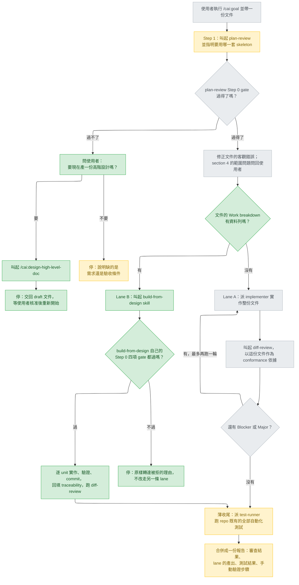
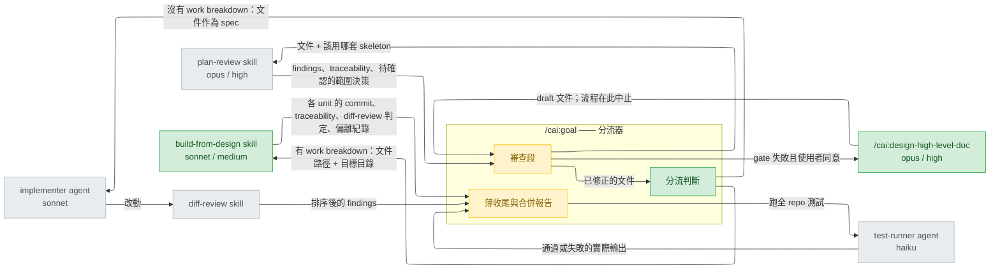

# goal-command-routing — high-level design

## Status

approved 2026-08-25

## Use cases / Issues

- **UC1** — 使用者手上是一份含 `## Work breakdown` 的 detail design，執行 `/cai:goal`。今天整份文件被丟給單一 `implementer`（`plugins/cai/commands/goal.md:28-31`），文件裡的排程、依賴、可平行欄位全部被丟棄，換回一個沒人能對著任何一列驗證的大 diff。**成功判準**：同一份文件改走 unit-by-unit，每個 unit 各自綠燈並各自 commit。
- **UC2** — 同一份 detail design，但沒有人審過。`build-from-design` 的 Step 0 gate 不含設計審查，它自己指名 `/cai:goal` 才是有審查的入口（`plugins/cai/skills/build-from-design/SKILL.md:296-298`）。**成功判準**：goal 先跑 `plan-review` 再轉派，而且轉派之後不會再跑第二次 `plan-review`。
- **UC3** — 使用者拿著一段還不夠格當設計的東西執行 `/cai:goal`，過不了 `plan-review` 的 Step 0 gate。今天的行為是停下來要求補齊（`plugins/cai/commands/goal.md:22-25`），使用者得自己知道下一步該打哪個指令。**成功判準**：goal 主動問是否要現在產一份高階設計，答應才啟動 `/cai:design-high-level-doc`；不論答案為何，goal 都不自己發明需求。
- **R1** — 兩條 lane 的尾端都會跑一次 `diff-review` 並各自寫一份報告（`plugins/cai/commands/goal.md:33-34`、`plugins/cai/skills/build-from-design/SKILL.md:276-285`）。天真串接會讓同一個 branch 被六個 reviewer 讀兩遍，並產出兩份互相重疊的報告。**成功判準**：單次執行只跑一次 `diff-review`、只交付一份報告。
- **R2** — tier 洩漏。skill 的 `model` 覆寫作用範圍是「本回合剩餘部分」，所以 goal 一旦叫起 `build-from-design`（`model: sonnet`），它自己後續的步驟也留在 Sonnet。**成功判準**：goal 收尾所在的 tier 是被明確決定並寫在文件裡的，不是意外的。
- **R3** — `/cai:design-implementation-detail-doc` 收尾時把使用者導向 `/cai:goal <this document>`（`plugins/cai/commands/design-implementation-detail-doc.md:426`、`:435`）。以今天的 goal 而言，這個指標會把一份剛寫好 work breakdown 的文件送進不看 work breakdown 的 lane。**成功判準**：不論從哪個入口進來，含 work breakdown 的文件都走 unit-by-unit，該指標因此變成正確的。
- **R4** — `plugins/cai/commands/goal.md:13-14` 宣稱 Step 1「runs inline, at whatever model this session is already on」，但 `plan-review` 的 frontmatter 是 `model: opus, effort: high`（`plugins/cai/skills/plan-review/SKILL.md:4-5`），依同一條覆寫規則，goal 從 Step 1 之後就在 Opus/high 上跑。文件描述與實際 tier 不符。**成功判準**：goal.md 裡描述的 tier 軌跡與實際執行一致。
- **R5** — 每個 unit 各自的 verify 指令是 scoped 到該 unit 的（`plugins/cai/skills/build-from-design/SKILL.md:87-96`），全部 unit 綠燈不代表 repo 綠燈，跨 unit 的回歸沒有任何一步會發現。**成功判準**：一次 `/cai:goal` 執行結束時，repo 既有的全部自動化測試都跑過且綠燈，不論走的是哪一條 lane。
- **R6** — `plan-review` 對細部設計文件要求 lens 8 先跑（`plugins/cai/skills/plan-review/SKILL.md:71-74`），但 goal 呼叫它時沒有說明文件是哪一種（`plugins/cai/commands/goal.md:13`），這個規則因此從未被觸發。既然分流器本來就必須判定文件種類，這個資訊是現成的。**成功判準**：goal 呼叫 `plan-review` 時一併指明要用高階還是細部 skeleton，細部設計因此拿到 lens 8 優先的審查。

## Feasibility

| Id | Capability | Verdict | Evidence |
|---|---|---|---|
| C1 | command 的內文可以用名字叫起另一個 skill，這已是本 plugin 的既有機制 | verified | `plugins/cai/commands/goal.md:13` 叫 `plan-review`；`plugins/cai/commands/goal.md:33` 叫 `diff-review`；`plugins/cai/commands/build-from-design.md:10` 叫 `build-from-design` skill |
| C2 | `build-from-design` 有真正的 skill 實體，整套流程可被 inline 取用 | verified | `plugins/cai/skills/build-from-design/SKILL.md:1-6` |
| C3 | `design-high-level-doc` 沒有 skill 實體，只存在 command 檔 | verified | `plugins/cai/commands/design-high-level-doc.md:1` 存在；`plugins/cai/skills/` 下只有 build-from-design、checkpointed-execution、diff-review、finding-unknowns、git-pr-rebase、plan-review 六個目錄，無對應項（skill 的列舉方式見 `scripts/validate.py:61`） |
| C4 | command 檔仍可經 Skill tool 叫起 —— command 與 skill 已合併為同一種東西 | verified | 官方文件：「Custom commands have been merged into skills. A file at `.claude/commands/deploy.md` and a skill at `.claude/skills/deploy/SKILL.md` both create `/deploy` and work the same way.」<https://code.claude.com/docs/en/slash-commands>；同頁：「By default, Claude can invoke any skill that doesn't have `disable-model-invocation: true` set.」 |
| C5 | skill 的 `model` / `effort` 會生效，覆寫範圍是本回合剩餘部分 | verified | 同頁 frontmatter 欄位表 `model` 列：「The override applies for the rest of the current turn and is not saved to settings; the session model resumes on your next prompt.」<https://code.claude.com/docs/en/slash-commands> |
| C6 | skill 可用 `context: fork` 在隔離 subagent 執行，呼叫端可用 `background: false` 等它回來 | verified | 同頁〈Run skills in a subagent〉：「Set `background: false` in the frontmatter to instead wait for the result in the turn that invoked the skill.」<https://code.claude.com/docs/en/slash-commands> |
| C7 | fork 出去的 skill 看不到對話歷史 | verified | 同節：「It won't have access to your conversation history.」<https://code.claude.com/docs/en/slash-commands> |
| C8 | `build-from-design` 的 Step 0 gate 正好就是分流所需的判準：`## Work breakdown` 是否有資料列 | verified | `plugins/cai/skills/build-from-design/SKILL.md:32-34` |
| C9 | `design_probe.py` 不能當分流器：`--kind` 只有 `hld` 與 `detail`，且 `detail` 要求 13 個標題全到，外來文件必然在標題上失敗 | verified | `plugins/cai/scripts/design_probe.py:286`、`plugins/cai/scripts/design_probe.py:37-40`；`plugins/cai/skills/build-from-design/SKILL.md:56-58` |
| C10 | `plan-review` 內建高階與細部兩套 skeleton，並規定細部設計時 lens 8 先跑；goal 目前呼叫時兩者都沒指定 | verified | `plugins/cai/skills/plan-review/SKILL.md:71-74`、`plugins/cai/skills/plan-review/SKILL.md:179-184`；`plugins/cai/commands/goal.md:13` |
| C11 | `/cai:design-high-level-doc` 無法無人值守跑完：Step 0.5 要等使用者同意，Step 6 交回時仍是 `draft`，且只有使用者能改成 `approved` | verified | `plugins/cai/commands/design-high-level-doc.md:39`、`plugins/cai/commands/design-high-level-doc.md:251-259` |
| C12 | `/cai:design-implementation-detail-doc` 開場即 gate 在檔案裡的 `## Status` 是否為 `approved` | verified | `plugins/cai/commands/design-implementation-detail-doc.md:21` |
| C13 | 在 `goal.md` 增減 frontmatter 欄位不會弄壞驗證：validate.py 對 command 只要求 `description`，不限制額外 key | verified | `scripts/validate.py:57-59` |
| C14 | `/cai:design-implementation-detail-doc` 已經把使用者導向 `/cai:goal <this document>` 作為實作入口 | verified | `plugins/cai/commands/design-implementation-detail-doc.md:426`、`plugins/cai/commands/design-implementation-detail-doc.md:435` |
| C15 | 兩條 lane 尾端都會跑 `diff-review` 並各自寫報告 | verified | `plugins/cai/commands/goal.md:33-34`；`plugins/cai/skills/build-from-design/SKILL.md:276-285` |

沒有 `UNVERIFIED`，沒有 `infeasible`。C3 是唯一的硬限制：往上游接只能經由 C4 的 command-as-skill 路徑。

## High-level design

`/cai:goal` 從「單一實作者」變成「先審、再分流、最後薄收尾」的三段式。審查與收尾仍是 goal 的責任，中段的實作依文件形狀交給兩條 lane 之一。

### 主流程

### 元件與交界

### 分流判準

判準不是 goal 自己發明的，就是 `build-from-design` 自己 Step 0 第 1 項的原文（`plugins/cai/skills/build-from-design/SKILL.md:32-34`）：`## Work breakdown` 有資料列，而且那些列的 `Depends on` 有填；沒有表格、或表格只有表頭，就是沒有排程。兩處用同一句判準，是為了避免 goal 分流過去之後才被對方以不同標準退回。

### 薄收尾

「薄收尾」在本文件中指兩件事，且只有這兩件：派 `test-runner` 跑 repo 既有的全部自動化測試，以及把審查結果、lane 的產出、測試結果、手動驗證步驟合併成單一份交付報告。它不包含 `diff-review`、不包含 traceability 回填、不包含任何實作。

Lane B 時，合併報告**引用** `build-from-design` Step 6 交出的內容（各 unit 落點、traceability 表、偏離紀錄、review 判定），不改寫、不重新整理；goal 只在前面接上 `plan-review` 的結果，在後面接上全 repo 測試的實際輸出。

### 兩條 lane 的分工原則

分流之後責任不重疊：`build-from-design` 是自包含的，它自己會回填 traceability、跑 `diff-review`、寫報告（`plugins/cai/skills/build-from-design/SKILL.md:267-288`），goal 在這條 lane 上不重跑其中任何一項。

Lane A 的**行為**不變：沒有 work breakdown 的文件本來就沒有排程可跑，`build-from-design` 自己也把這種情況指回 goal（`plugins/cai/skills/build-from-design/SKILL.md:292-293`）。但 goal.md 的**文字**必須重組——現行 Step 2 與 Step 3 是無條件敘述的，分流之後每一步都要標明它屬於哪一條 lane，否則 R1 會在實際執行時復發。

### 這份設計最脆弱的地方

是「分流判準」與「二次 gate」這一組互動。goal 只檢查 `build-from-design` 四項 gate 中的第一項，另外三項要到轉派之後才會被檢查；判準若寫得比對方寬鬆，使用者就會看到一次轉派、一次退回。實作時這一段應該最先寫、最先手動驗過。

### 怎麼驗收

這些成功判準都無法自動驗證。本 repo 唯一的測試是 `scripts/validate.py`（`CLAUDE.md`：「It is the only test this repo has」），它檢查 manifest、frontmatter 與 bash guard，不執行指令流程。驗收方式是人工各跑一次三條路徑——有 work breakdown 的文件、沒有 work breakdown 的文件、過不了 gate 的文件——並比對實際走的 lane。細部設計要把這三次人工執行寫進 `## Verification`。

## Architecture decisions

### Decision 1 — 改造後的 /cai:goal 定位

| Option | Rests on | Costs | Fails when |
|---|---|---|---|
| A 分流器 + 保留原 lane **(recommended)** | C1, C2, C8, C9, C10, C14 | goal.md 變長；分流判準要自己寫（C9 排除了拿 probe 的 exit code 當判準），且必須明寫哪些步驟在哪條 lane 上不跑，否則 R1 會在實際執行時復發 | 兩條 lane 的收尾差異將來擴大，goal.md 裡的條件分支開始比任一條 lane 本身還難讀 |
| B 純分流器，自己不實作 | C1, C2, C8 | 沒有 work breakdown 的小改動也被迫先補一份完整文件才有 lane 可走 | 面對兩三個檔案的小改動——`plugins/cai/skills/build-from-design/SKILL.md:299` 明說這種規模「Just build it」 |
| C 完整 pipeline 入口 | C1, C2, C4, C11, C12 | 範圍最大，且 C11 與 C12 證明中間有強制的人工核准關卡，所謂 pipeline 實際上是多次啟動的接力 | 使用者期待一道指令跑完，卻在 draft 狀態被中止兩次 |

**Chosen:** A —— 使用者選定。它同時解掉 UC1、UC2 與 R3，而且 Lane A 的行為不變，既有路徑不必重新驗證。C10 之所以列入：分流器既然已經判定文件是哪一種，這個資訊對 `plan-review` 就是現成的，這條需求記為 R6。

### Decision 2 — 上游怎麼接 /cai:design-high-level-doc

| Option | Rests on | Costs | Fails when |
|---|---|---|---|
| A 問過再叫 **(recommended)** | C3, C4, C11 | 多一次問答 | 使用者在非互動情境（`-p`）下跑 goal，問句無人回答 |
| B 只指路，不叫 | C11 | 使用者得自己重打一次指令；嚴格說這條不算「利用 design-high-level-doc」 | 使用者不知道有這個指令，於是自己動手補一份不成形的設計 |
| C gate 一失敗就直接叫 | C3, C4, C11, C12 | 只想要實作的人被突然拉進 Opus/high 的長流程；且依 C5，goal 後續回合被拉到 opus/high | 使用者的文件只是少寫一行驗收條件，卻換來一整輪設計流程 |

**Chosen:** A —— 使用者選定。C3 決定了實作路徑只能是 C4 的 command-as-skill；C11 決定了這條路一定停在 draft，所以 goal 必須把「會停下來」講在前面，而不是叫起之後才讓使用者發現。

### Decision 3 — 轉派之後的收尾歸屬

| Option | Rests on | Costs | Fails when |
|---|---|---|---|
| A 交棒 + 薄收尾 **(recommended)** | C8, C15 | goal.md 必須明寫「Lane B 不跑 goal 自己的 diff-review 與報告」，這是一句容易在執行時被忽略的散文 | 將來 `build-from-design` 的 Step 6 縮減，goal 卻沒跟著補回來，收尾出現空洞 |
| B 完全交棒 | C15 | 每個 unit 自己綠燈不等於全 repo 綠燈，跨 unit 的回歸要到 CI 才會被發現 | 各 unit 的 verify 指令範圍都很窄（`plugins/cai/skills/build-from-design/SKILL.md:87-96` 要求 scoped 到該 unit） |
| C 收尾一律拉回 goal | C15 | 得告訴 `build-from-design` 在被 goal 叫起時跳過 Step 6，等於在一個目前完全自包含的 skill 裡埋入呼叫者相關的分支 | 使用者直接跑 `/cai:build-from-design` 時，那條分支變成永遠不會執行的死路 |

**Chosen:** A —— 使用者選定。解掉 R1，同時保留 goal Step 3 唯一無可取代的部分：repo 既有的全部自動化測試。

### Decision 4 — tier 軌跡怎麼處理

| Option | Rests on | Costs | Fails when |
|---|---|---|---|
| A 接受並寫明 **(recommended)** | C5, C13 | goal 無法把自己的 tier 拉回來；薄收尾在 Sonnet 上執行 | 收尾將來長出需要更高 tier 的判斷（例如自行裁決跨 unit 的衝突） |
| B 讓 build-from-design 跑在 fork 裡 | C5, C6, C7 | 改的是 skill 本身，會連帶改變所有直接執行 `/cai:build-from-design` 的人；且 C7 使它看不到對話歷史，而它的 Step 0.5 需要跟使用者確認 commit 權限與平行 lane | 使用者直接執行該指令時，Step 0.5 的兩個問題無處可問 |
| C 先不碰，只把 R4 記錄下來 | C5, C13 | goal.md 裡會同時存在一句新寫的正確描述與一句舊的錯誤描述 | 下一個讀 goal.md 的人以兩句互相矛盾的話為準 |

**Chosen:** A —— 使用者選定。真實軌跡是 `plan-review`(opus/high) → 分流 → `build-from-design`(sonnet/medium) → 薄收尾(sonnet)，goal.md 照這個寫，順帶修掉 R4。合併一份已經存在的報告不需要更高 tier；C13 說明就算將來要在 goal.md 釘 frontmatter 也不會弄壞驗證，但依 C5，那只影響 Step 1 之前的片刻。

### Decision 5 — 轉派之後 build-from-design 自己的 gate 又失敗時

goal 只檢查 `build-from-design` Step 0 四項 gate 的第一項；另外三項（`## Verification` 是否覆蓋每個 unit、`## Implementation spec` 是否有真正的簽章、目前分支是否為 main/master）要到轉派之後才會被檢查，而且都可能失敗。

| Option | Rests on | Costs | Fails when |
|---|---|---|---|
| A 停下並原樣轉達拒絕理由 **(recommended)** | C8 | 使用者空手而歸，得先回去補文件 | 失敗的是第 4 項（人在 main/master 上），那其實一句話就能自己修好，卻被當成設計缺陷退回 |
| B 退回 Lane A 繼續 | C8, C15 | 文件已被判定有缺陷，卻還是拿它實作，且正是 UC1 要消除的那種做法 | 缺的是 `## Verification` 對某個 unit 的覆蓋——Lane A 一樣沒有辦法知道那個 unit 何時算完成 |
| C 當場問使用者要哪一個 | C8 | 多一層問答，而且使用者在該時點只看得到 gate 的錯誤訊息，資訊不足以判斷 | 使用者選了退回 Lane A，等於在不知情下推翻了 UC1 |

**Chosen:** A —— 使用者選定。這三項 gate 每一項失敗都代表設計文件真的有洞（沒有 done 的定義、或兩個 unit 在描述性介面上交會），退回 Lane A 只是用一個大 diff 把洞蓋住。第 4 項（分支）的情況在報告裡直接寫出可以怎麼修。

## Open questions

（無。五項架構決策都已由使用者選定，記錄於上。）

## Out of scope

- **不改 `build-from-design` 本身。** 它的 Step 0 gate、狀態表、平行 lane、Step 6 收尾一律照現狀使用。Decision 3 與 Decision 4 都刻意避開了會修改該 skill 的選項。
- **不改 Lane A。** 沒有 work breakdown 的文件走的路徑一個字都不動。
- **不改 `/cai:design-high-level-doc` 與 `/cai:design-implementation-detail-doc` 的內文流程。** goal 只是它們的呼叫者。唯一可能需要跟進的是 `plugins/cai/commands/design-implementation-detail-doc.md:426` 與 `:435` 那兩句指路——分流做完之後它們就正確了，是否要順手把語氣改寫得更明確，留給細部設計判斷。
- **不做自動核准。** C11 與 C12 的人工關卡保留原樣：goal 永遠不會替使用者把 `## Status` 改成 `approved`。
- **不為非互動情境設計專屬行為。** Decision 2 的選項 A 在 `-p` 模式下問句無人回答；該情境下 goal 退回今天既有的行為——說明缺的是需求還是驗收條件，然後停（`plugins/cai/commands/goal.md:22-25`）。這不是新決策，是現狀，本設計不為它另做安排。
- **不新增 skill 實體。** 明確不為 `design-high-level-doc` 抽出一個 skill 目錄來讓 goal 呼叫——C4 已證明沒有必要。
