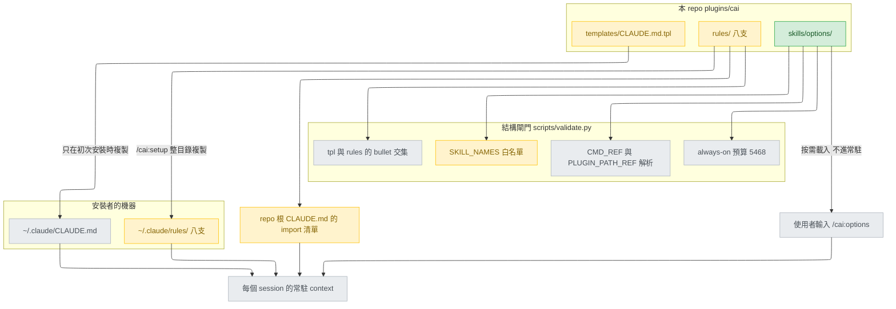
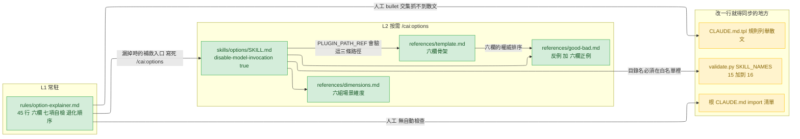
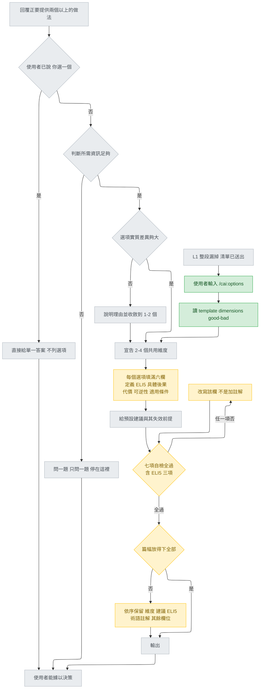
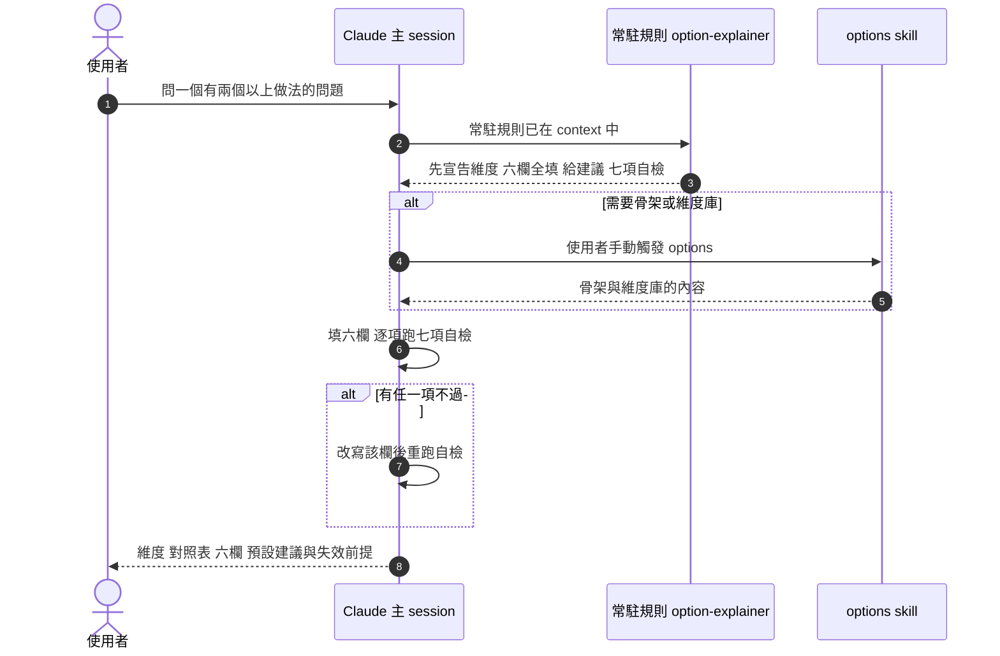
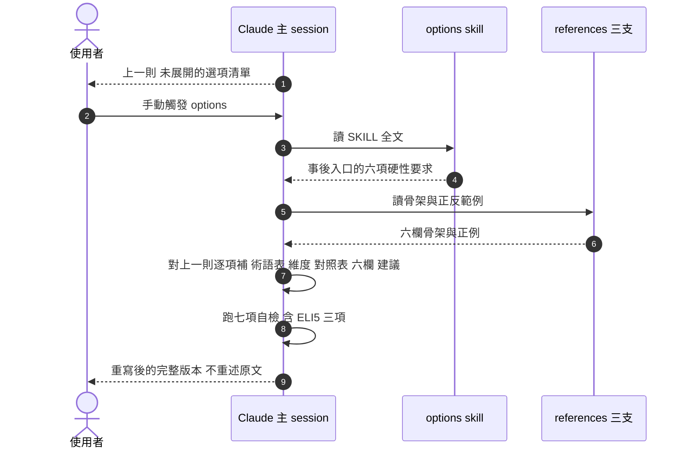

# option-explainer with ELI5 — detail design

## Reference

High Level Design doc: docs/design/2026-08-29-option-explainer-with-eli5-high-level.md
Status: approved 2026-08-29

上游輸入（**歷史文件，本次不修改正文**）：
`docs/design/2026-08-29-option-explainer-spec.md`，頂端已加 superseded 註記
（`docs/design/2026-08-29-option-explainer-spec.md:3`–7）。本文件所有 spec 行號都
是在加註後的檔案上重新讀過的，未沿用任何舊值。

### Traceability

| From the high-level design | Satisfied by | Status |
|---|---|---|
| UC1 事前入口 | 規則檔 L8–L28（維度 → 六欄 → 預設建議）＋ SKILL.md「Procedure」步驟 1–5；驗收見 T1、T5 | covered |
| UC2 事後補救入口 | SKILL.md frontmatter 的雙語事後觸發詞＋「When the entrance is the remedial one」段；驗收見 T4 | covered |
| UC3 反向情境 | 規則檔 L2–L3「If the user has already said "you pick", decide and answer — do not list」；驗收見 T6 | covered |
| UC4 資訊不足 | 規則檔 L15＋SKILL.md 步驟 2（一次一題）；驗收見 T3 | covered |
| UC5 湊數選項 | 規則檔 L14＋SKILL.md 步驟 1；驗收見 T2 | covered |
| UC6 ELI5 可自檢 | 規則檔 L35–L37 三個是/否欄位＋SKILL.md「The ELI5 field, specifically」；驗收見 T7 | covered |
| UC7 常駐層送到每個安裝者 | 交付物 A 落在 `plugins/cai/rules/`（`plugins/cai/skills/setup/SKILL.md:27`–28 複製整個目錄）＋ Unit 3 的根 `CLAUDE.md` import diff | covered |
| UC8 預算不上升 | SKILL.md frontmatter 帶 `disable-model-invocation: true`，被 `scripts/validate.py:214`–216 排除；`ALWAYS_ON_CEILING` 一字不改 | covered |
| UC9 規則檔 ≤ 45 行且理由在檔內 | 規則檔逐字內容共 45 行，理由在 L44–L45 的註解 | covered |
| UC10 六欄四處一致 | 規則檔 L17–L24 / `template.md` 骨架 / `good-bad.md` 正例 / SKILL.md 步驟 4，四份清單同序同名；`## Verification` 的 V10 是逐欄比對項 | covered |
| UC11 九處裂縫逐一改寫 | `## Design decisions` 的「十一處裂縫的改寫落點」表（九處＋F6＋§9.1） | covered |
| UC12 結構檢查全綠 | `## Change points` 的 `scripts/validate.py` diff＋`## Verification` 的 V1–V8 | covered |

## Requirement

**問題**：AI 丟出「方案 A / B / C」時，使用者無法據以決策。spec 把成因拆成五個失效
模式（`docs/design/2026-08-29-option-explainer-spec.md:40`–44），HLD 追加第六個：
**F6「懂了每個字，但不知道這東西在幹嘛」**（HLD Decision 5）。

**對誰**：每一個安裝 cai 的使用者。因此常駐層必須落在
`plugins/cai/rules/`——那是本 repo 唯一會被 `/cai:setup` 整個目錄複製出去的來源
（`plugins/cai/skills/setup/SKILL.md:27`–28）。

**怎麼知道有效**：`python scripts/validate.py` 與 `python -m pytest` 全綠（結構面
V1–V8），六欄清單四處逐欄相同（V10），以及 T1–T7 七個行為案例——其中 T6 是反向
測試（沒有過度觸發）、T7 專測 ELI5 的三個是/否判準。

本次交付**不改變 AI 的技術判斷，只改變呈現方式**（沿用 spec §2.3，
`docs/design/2026-08-29-option-explainer-spec.md:78`–82）。

## Glossary

| Term | Definition | Where it lives |
|---|---|---|
| L1 常駐規則層 | 每個 session 都載入、且被 `/cai:setup` 複製到 `~/.claude/rules/` 的規則檔集合 | plugins/cai/skills/setup/SKILL.md:27 |
| option-explainer 規則檔 | 本設計新增的常駐規則，只管「既然要列選項，怎麼列」 | new — plugins/cai/rules/option-explainer.md |
| options skill | 本設計新增的按需層，唯一入口是 `/cai:options`，同時服務事前與事後 | new — plugins/cai/skills/options/SKILL.md |
| template.md | options skill 的輸出骨架參考檔，六欄的權威排序來源之一 | new — plugins/cai/skills/options/references/template.md |
| dimensions.md | 比較維度庫，spec §5.3 的六組場景 | new — plugins/cai/skills/options/references/dimensions.md |
| good-bad.md | 正反範例；正例按六欄整段重寫 | new — plugins/cai/skills/options/references/good-bad.md |
| 六欄 | 每個選項必填的六個欄位，順序固定 | concept |
| ELI5 欄 | 六欄之一：用一個日常生活類比說明同一件事，措辭不得與第一欄重複 | concept |
| 三個是/否自檢 | 判定 ELI5 是否完成的三條機械判準，取代「五歲小孩也懂」這種不可驗證的形容 | concept |
| F6 | 新增的失效模式：懂了每個字，但不知道這東西在幹嘛 | concept |
| 退化路徑 | 空間不夠時放棄規則的順序；本次把 ELI5 插進第 3 順位 | docs/design/2026-08-29-option-explainer-spec.md:575 |
| disable-model-invocation | frontmatter 旗標；帶它的元件其 description 被預算加總排除 | scripts/validate.py:216 |
| always-on description 預算 | 所有可被模型自動觸發的 description 字元總和，硬上限 5468 | scripts/validate.py:210 |
| SKILL_NAMES | `skills/` 目錄名的寫死白名單，不同步更新就直接 FAIL | scripts/validate.py:166 |
| import 清單 | repo 根 `CLAUDE.md` 以 `@` 匯入規則檔的六行，無任何自動檢查 | CLAUDE.md:8 |
| bullet 交集檢查 | 禁止 `CLAUDE.md.tpl` 與任何 rules 檔共用 `- ` 條目；只看條目，看不到散文 | scripts/validate.py:241 |
| tpl 規則列舉散文 | `CLAUDE.md.tpl` 中逐一列出七支規則名字的那句話，多一支就過時 | plugins/cai/templates/CLAUDE.md.tpl:5 |
| 事前入口 | 回覆尚未送出、正要列出兩個以上做法的時刻 | concept |
| 事後補救入口 | 看不懂的選項清單已經送出，使用者主動要求展開的時刻 | concept |
| T7 | 本文件新增的第七個驗收案例，專測 ELI5 | new — 本文件 `## Verification` |

## Budgets

| What | Number | Where it comes from |
|---|---|---|
| 常駐規則檔行數上限 | 45 | HLD Decision 4（intake 已裁決）；本文件的規則檔逐字內容剛好用滿 |
| 現況 `rules/` 最長一支的行數 | 43 | plugins/cai/rules/model-selection.md:43 為該檔末行（HLD C8） |
| 現況 `rules/` 七支合計行數 | 178 | HLD C8 的逐檔計數 |
| 新增後 `rules/` 合計行數 | 223 | 178 + 45 |
| always-on description 上限 | 5468 | scripts/validate.py:210 |
| 新 skill 的 description 計入預算的字元數 | 0 | scripts/validate.py:214–216 以 `disable-model-invocation: true` 排除整支檔案 |
| 現況 always-on 用量 | 5451 | intake 階段回報的 `validate.py` 輸出；design 階段無 shell，**未重跑**（HLD:71–76 同一註記） |
| 每則輸出宣告的比較維度數 | 2–4 | 規則檔 L9；沿用 spec `docs/design/2026-08-29-option-explainer-spec.md:171` |
| 每個選項的必填欄位數 | 6 | HLD「六欄的職責切分」 |
| ELI5 的是/否判準數 | 3 | HLD（UC6） |
| 規則檔自檢清單的勾選項數 | 7 | 規則檔 L31–L37；SKILL.md 步驟 6 引用同一個數字 |
| 資訊不足時一次提問數上限 | 1 | 規則檔 L15；沿用 spec `docs/design/2026-08-29-option-explainer-spec.md:187` |
| `SKILL_NAMES` 名字數 | 16 | 現況 15（scripts/validate.py:166）加 `options` |
| references 檔數 | 3 | HLD 交付形狀表 |
| dimensions.md 場景組數 | 6 | spec `docs/design/2026-08-29-option-explainer-spec.md:290`–323 的六個 `##` 段 |
| 驗收案例數 | 7 | spec 的 T1–T6（`docs/design/2026-08-29-option-explainer-spec.md:542`–547）加 T7 |
| 需人工確認、無自動檢查的項目數 | 4 | `## Failure modes` 的 FM1–FM4 |

## Design decisions

HLD 已裁決的八項（兩層交付、六欄、三個 ELI5 判準、F6、退化順序、45 行、預算不動、
內文英文）不在此重開。以下只列**這份 detail 自己做的決定**，以及它們服務的需求。

### D1 — 六欄的英文標籤

交付物內文是英文（HLD Decision 8），因此六欄必須有英文標籤，而 HLD 只裁決了中文
職責。**使用者於 design 階段裁決（2026-08-29）為 B 組**：

`What it literally is` / `ELI5` / `What actually changes` / `What it costs` /
`How reversible` / `When it fits`

選 B 而非直譯組（`One-sentence definition` / `Concrete consequences` / `Cost` /
`Reversibility` / `Applies when`）的理由是語氣一致：規則檔要求選項描述用白話，欄位
名本身若是抽象名詞（"Concrete consequences"），模型會照著那個語氣把內容也寫成官腔。
代價是這六個標籤與 HLD 的中文欄名不是字面一對一，覆核 UC10 時要多一次對照——對照表
就是上面那兩行。

這是四個檔案共用的同一組字串（規則檔、`template.md`、`good-bad.md` 正例、SKILL.md），
UC10 要求四份逐欄相同。

### D2 — `skills/options/SKILL.md` 不宣告 `model:`

現況只有六支 skill 宣告 `model:`（`plugins/cai/skills/git/SKILL.md:4`、
`plugins/cai/skills/chore/SKILL.md:4`、`plugins/cai/skills/setup/SKILL.md:4`、
`plugins/cai/skills/quiz/SKILL.md:5`、`plugins/cai/skills/refactor/SKILL.md:4`、
`plugins/cai/skills/plan-review/SKILL.md:4`），其餘一律不宣告。本 skill 跟著後者，
理由不是慣例而是語意：它的工作是**把當前這一輪的回覆重新排版**，UC2 更是直接依賴
「上一則訊息還在眼前」。而 skill 的 model 覆寫會延續整輪
（`plugins/cai/skills/goal/SKILL.md:35`「a skill's model override holds for the rest
of the turn」），換模型等於換掉正在說話的人。不宣告 `model:` 也就不必進
`plugins/cai/models.json`——該檢查只針對「有宣告的」（`scripts/validate.py:1119`–1121）。

### D3 — `SKILL_NAMES` 的註解必須跟著改，不只是清單

`scripts/validate.py:162`–165 的註解寫著「the design's target is 14 skills, not 15」。
只加一個名字會讓那段註解與清單互相矛盾，下一個讀它的人會以為有人違規。因此 diff 含
一段新註解說明「為什麼往上加一支」（HLD Decision 2 的 costs 欄已預告要這麼做）。同時
`scripts/validate.py:170` 的訊息字串硬寫著 `15`，不改就會印出說謊的訊息。

### D4 — 規則檔用三行寫死與既有兩條常駐規則的分工（HLD C13）

`plugins/cai/rules/communication.md:4`–5 要求「alternatives only when they'd change
the conclusion or action」，`plugins/cai/rules/epistemics.md:12` 已經有「Then name the
options; don't pick silently」。三份都常駐，不寫分工線就會互相打架。分工線寫進規則檔
L4–L6：**epistemics 管「何時該停下來問」，本規則只管「既然要列，怎麼列」，而
communication 的簡潔要求仍然生效——空間不夠時砍的是選項數，不是欄位數。** T6 因此
不只防過度觸發，也是這三條規則沒打架的證據。

### D5 — 交付順序：skill 先於 rule，import 最後

規則檔 L42 會寫出 `/cai:options`。若規則檔先落地，這個 checkout 在兩次 commit 之間
會有一條指向不存在指令的常駐規則，而 `scripts/validate.py:150`–155 的 `CMD_REF` 檢查
**只掃 `skills/*/SKILL.md`**，抓不到 rules 裡的死指令。所以 Unit 1 是 skill＋白名單，
Unit 2 才是規則檔。詳見 `## Work breakdown`。

### D6 — 十一處裂縫的改寫落點

HLD 點名九處，加上 F1–F5 表新增 F6、§9.1 插入 ELI5，共十一處。**全部發生在新交付物
裡，spec 正文一字不動**（HLD `## Out of scope`）。落點如下——每一列的「spec 位置」
都是在加註後的檔案上重新讀過的行號：

| # | spec 位置（已重讀） | 裂在哪 | 改寫後落在哪 |
|---|---|---|---|
| 1 | `docs/design/2026-08-29-option-explainer-spec.md:62` | FR-3 寫「五個固定欄位（白話定義 / 具體後果 / 代價 / 可逆性 / 適用條件）」 | 規則檔 L17–L24 的六項；SKILL.md 步驟 4 逐字列同一組 |
| 2 | `docs/design/2026-08-29-option-explainer-spec.md:175`–180 | R3 的必填欄位只有五項 | 規則檔 L17–L24（`# Six fields per option, all filled`） |
| 3 | `docs/design/2026-08-29-option-explainer-spec.md:158`–198 | 規則區塊 39 行、自訂上限 40，只剩 1 行 | 規則檔共 45 行，放寬理由寫在 L44–L45 的 HTML 註解裡 |
| 4 | `docs/design/2026-08-29-option-explainer-spec.md:189`–193 | R6 自檢清單四項，沒有 ELI5 對應項 | 規則檔 L30–L37 共七項，末三項是 ELI5 的三個是/否 |
| 5 | `docs/design/2026-08-29-option-explainer-spec.md:267`–269 | §5.2 執行流程寫「五個欄位全填，不得留空」 | SKILL.md `## Procedure` 步驟 4：六欄、依 template.md 的順序、不得留空 |
| 6 | `docs/design/2026-08-29-option-explainer-spec.md:353`–359、363、374 | template 骨架列五欄，且「同上五欄」「直接用五欄描述」兩處措辭同樣是舊值 | `references/template.md` 的 `## Option A` 六欄骨架、`[the same six fields...]`、以及 `## Using this` 第一條 |
| 7 | `docs/design/2026-08-29-option-explainer-spec.md:421`–434 | good-bad **正例**按舊五欄寫好；spec 自稱正例約束力最強（`docs/design/2026-08-29-option-explainer-spec.md:381`），不補會直接教模型少寫一欄 | `references/good-bad.md` 的正例**整段按六欄重寫**（不是加一行），並附一張「兩條 ELI5 逐項過三個判準」的表 |
| 8 | `docs/design/2026-08-29-option-explainer-spec.md:471`–485 | §6.2 補救入口的五項硬性要求完全沒提 ELI5 | SKILL.md `## When the entrance is the remedial one`，六項，ELI5 在第四項的六欄裡 |
| 9 | `docs/design/2026-08-29-option-explainer-spec.md:542`–547 | T1–T6 沒有一條測 ELI5 | 本文件 `## Verification` 的 T7 |
| 10 | `docs/design/2026-08-29-option-explainer-spec.md:40`–44 | F1–F5 表沒有 ELI5 的歸屬 | 本文件 `## Failure modes` 的 F6 列；`references/good-bad.md` 的反例診斷同步加一條 F6 |
| 11 | `docs/design/2026-08-29-option-explainer-spec.md:579`–584 | §9.1 退化路徑四條，ELI5 沒有順位 | 規則檔 L39–L42：shared dimensions → the pick → ELI5 → term glosses → remaining fields |

### D7 — 只補兩個便宜的自動檢查，不寫貴的那個

**使用者於 design 階段裁決（2026-08-29）**，推翻本文件原本「一個都不寫」的提案。分界
線是成本，不是重要性：

- **寫**：`rules/*.md` 的行數上限（關掉 FM4）。一行行數比較，`scripts/validate.py:120`
  已經對 `plugins/cai/skills/goal/SKILL.md` 做過同樣的事，照抄即可。
- **寫**：根 `CLAUDE.md` 的 import 清單與 `plugins/cai/rules/*.md` 的 glob 必須一一對應
  （關掉 FM1）。兩個集合相減，與 `scripts/validate.py:239`–242 既有的 bullet 交集檢查
  同一種寫法。
- **不寫**：四份清單的六欄一致性（FM3 保留）。要寫成程式得先定義「一份欄位清單」在
  markdown 裡的語法，那是比本需求更大的一筆改動。
- **不寫**：`CLAUDE.md.tpl` 散文列舉的同步（FM2 保留）。散文沒有可比對的結構。

淨效果：四個「全綠但錯」的失效模式降為兩個。FM3、FM4 → FM3 仍在，FM4 關掉；
FM1 關掉，FM2 仍在。剩下的 FM2、FM3 留在 `## Verification` 的人工列（V10、V13）。
**這仍是本設計最大的一個已知妥協，只是範圍縮小了一半。**

## Diagrams

> **五張圖都已渲染驗證**（design 階段補跑，`mmdc` 11.16.0，五張逐一 exit 0 並產出
> SVG：三張 flowchart 與兩張 sequenceDiagram）。語法刻意只用 HLD 兩張圖已渲染通過的
> 子集（label 一律雙引號、labelled edge 一律 `-->|"..."|`、`classDef` 與 `class` 分開
> 寫；sequence 圖的 participant 別名不含斜線與句點、訊息文字不含冒號與括號）。

### Architecture



### Component



### Flow



### Sequence — UC1 事前入口



### Sequence — UC2 事後補救入口



**沒有畫的十個 sequence，以及理由**：UC3、UC4、UC5 的呼叫序列在 Flow 圖上已經是三條
獨立的分支，畫成 sequence 只會把同一條線重畫一次；UC6 是 UC1 內模型自呼叫那一步的
判準內容，屬於文字而非呼叫順序；UC7–UC12 是結構檢查，沒有執行期呼叫者可畫——它們的
「順序」是 `## Work breakdown` 的單元順序，已在該表。

## Implementation spec

### 交付物 A — `plugins/cai/rules/option-explainer.md`

- **Responsibility**：在「AI 已經要列選項」的那一刻，規定選項怎麼排版，並在漏掉時
  把使用者導向 `/cai:options`。
- **Interface**：一支純 Markdown 規則檔，無 frontmatter（現況七支 rules 皆然，例如
  `plugins/cai/rules/communication.md:1` 直接就是 `# Communication`）。它的「介面」是
  六個 `#` 段名與六欄的順序，`references/template.md` 與 `good-bad.md` 依這個順序
  對齊。
- **Data**：進來的是模型正要輸出的草稿；出去的是同一份草稿的排版約束。無檔案 I/O。
- **Errors**：規則沒生效不會報錯，只會安靜地輸出未展開的清單——這正是 L2 存在的理由
  （FM5）。
- **Concurrency**：常駐檔，與其餘七支 rules 同時載入。唯一的共享狀態是 context 預算
  與**互相矛盾的指令**，後者由 L4–L6 的分工線處理（D4）。
- **Observability**：無執行期訊號。可觀察的只有輸出本身是否有六欄——T1/T5/T7 就是這個
  觀察。
- **Where it lives**：`plugins/cai/rules/option-explainer.md`，**今天不存在**。
- **What it reuses**：`plugins/cai/skills/setup/SKILL.md:27`–28 的整目錄複製，因此不必
  在 setup 裡新增任何一行；`scripts/validate.py:224`–225 的 glob 也會自動收進去。段落
  一律用 `#`（不是 `##`），跟著既有 rules 的寫法，如
  `plugins/cai/rules/epistemics.md:1`、9、15 三個同級標題。

**逐字內容（英文，共 45 行；第一行是 `# Presenting options`，第 45 行是註解結尾
`-->`）**：

```markdown
# Presenting options
- Only when a reply is about to offer two or more ways forward. If the user
  has already said "you pick", decide and answer — do not list.
- `epistemics.md` decides whether to stop and ask; this file starts after
  that and governs only how the options are laid out. `communication.md`'s
  brevity still binds: drop options, not fields.

# Before the list
- Name 2-4 comparison dimensions first, then the options. Describe every
  option on the same ones; "not applicable" needs a reason, not a blank.
- Gloss every term, abbreviation and package name on first use, in words that
  introduce no new term. A gloss that needs its own gloss is not one.
- Too many terms to gloss inline? Write the background first, then list.
- Two options barely differ, or one is plainly worse: say so and cut to 1-2.
- Missing a fact the choice turns on? Ask one question — one — and stop there.

# Six fields per option, all filled
1. What it literally is — the thing itself, one sentence, no jargon.
2. ELI5 — the same thing as one everyday-life analogy, in different words.
3. What actually changes — which files appear or change, what is different to
   operate afterwards. Observable facts, not "cleaner" or "more flexible".
4. What it costs — time, complexity, what has to be learned.
5. How reversible — low/medium/high, and what replacing it later costs.
6. When it fits — the condition that makes this option the right one.

# Close with a pick
- End with "if you would rather not weigh it, pick X, because ...", plus the
  condition that would make X the wrong pick. Never end on "it depends".

# Self-check before sending — any no, do not send
- [ ] Every option described on the same dimensions.
- [ ] Every first-use term glossed, no gloss introducing a new term.
- [ ] Every "what actually changes" observable, not an adjective.
- [ ] A pick, and the condition that voids it.
- [ ] ELI5 carries no proper noun, abbreviation or package name.
- [ ] ELI5 contains one everyday-life analogy.
- [ ] ELI5 worded differently from field 1.

# When there is not room for all of it
- Keep in this order: shared dimensions, the pick, ELI5, term glosses, the
  remaining fields. Drop a gloss before dropping the analogy.
- A list already went out that nobody can act on: `/cai:options` rewrites it.

<!-- 45 lines by validate.py's count; wc -l agrees only with the trailing
newline. Six fields plus three ELI5 checks do not fit in 40. Cut a field. -->
```

行數確認方式（人工，V11）：`(Get-Content <file>).Count` 必須是 `45`。行號對照：
L1 標題、L2–L6 適用範圍與分工線、L8–L15 列之前、L17–L24 六欄、L26–L28 預設建議、
L30–L37 七項自檢、L39–L42 退化路徑、L44–L45 放寬理由。

### 交付物 B — `plugins/cai/skills/options/SKILL.md`

- **Responsibility**：提供 45 行裝不下的東西（骨架、維度庫、範例），並在 L1 漏掉時
  作為 100% 生效的補救入口。
- **Interface**：frontmatter 四個鍵（`name`、`description`、`argument-hint`、
  `disable-model-invocation`）＋ `$ARGUMENTS`；三條
  `${CLAUDE_PLUGIN_ROOT}/skills/options/references/*.md` 引用。後者是**自動檢查**：
  `scripts/validate.py:156`–160 會驗每一條都指到真實檔案。
- **Data**：進來的是 `$ARGUMENTS`（要比較什麼，或空字串代表「展開上一則」）；出去的
  是一則六欄輸出。
- **Errors**：`$ARGUMENTS` 為空且上一則沒有選項清單 → 依 SKILL.md 的指示回一句
  「上一則沒有可展開的選項」並停，不得自行編一組選項。
- **Concurrency**：使用者手動觸發，一次一則，無共享狀態。與 L1 同時生效時兩者不衝突：
  L1 是約束，L2 是同一組約束的展開版。
- **Observability**：`validate.py` 對本檔跑四項檢查（frontmatter、死指令、死路徑、
  `plugins/cai/scripts/` 字串），全部會印出 PASS/FAIL。
- **Where it lives**：`plugins/cai/skills/options/SKILL.md`，**今天不存在**。
- **What it reuses**：`plugins/cai/skills/design/SKILL.md:1`–6 的 frontmatter 形狀
  （`name` + 帶 `Usage:` 的 description + `argument-hint` + `disable-model-invocation:
  true`）；`plugins/cai/skills/refactor/SKILL.md:56`–69 的「哪個情境讀哪個 reference」
  表格寫法。

**逐字內容**：

```markdown
---
name: options
description: "Lay out two or more ways forward so a person can actually choose between them: shared comparison dimensions, six fields per option including an everyday-life ELI5 analogy, a recommendation and the condition that voids it. Use before a list of options goes out, and after one already did and the reader could not act on it — 看不懂 / 這是什麼意思 / 差在哪 / 幫我展開 / 講白話一點 / 比較一下 / expand that / what is the difference / explain it simply / which should I pick. Usage: /cai:options <what to compare, or nothing to rewrite the previous message>"
argument-hint: "<what to compare — or nothing, to expand the previous message>"
disable-model-invocation: true
---

Lay out options someone can actually choose between: $ARGUMENTS

Two entrances, one procedure. **Before** — a reply is about to offer two or
more ways forward. **After** — one already went out and the reader could not
act on it; rewrite that message, never restate it.

The always-on half of this lives in `rules/option-explainer.md` and applies
whether or not this skill was invoked. This file is what does not fit in 45
lines: the skeleton, the dimension library, and a worked example.

If `$ARGUMENTS` is empty and the previous message holds no option list, say so
and stop. Do not invent a set of options to expand.

## Which reference to read

| Situation | Read |
|---|---|
| You need the output skeleton | `${CLAUDE_PLUGIN_ROOT}/skills/options/references/template.md` |
| You are unsure what to compare on | `${CLAUDE_PLUGIN_ROOT}/skills/options/references/dimensions.md` |
| You want the worked good and bad pair | `${CLAUDE_PLUGIN_ROOT}/skills/options/references/good-bad.md` |

Read the one you need, not all three.

## Procedure

1. **Is there a choice at all?** One reasonable way forward — say so and stop.
   An option that is plainly worse — name it, say why it is excluded, leave it
   out. Never pad to three.
2. **Missing a fact the choice turns on?** Ask one question — one — and stop
   there. Do not list options against a guess.
3. **Pick 2-4 dimensions** from `dimensions.md` before writing any option. Do
   not invent a set when one there fits.
4. **Fill all six fields for every option**, in `template.md`'s order:
   `What it literally is`, `ELI5`, `What actually changes`, `What it costs`,
   `How reversible`, `When it fits`. No blanks; "not applicable" carries its reason.
5. **Pick one**, and state the condition that would make it the wrong pick.
6. **Run the self-check** in the rules file — all seven boxes, including the
   three ELI5 ones. A no is a rewrite of that field, not a caveat under it.

## The ELI5 field, specifically

It is not field 1 with friendlier words. That field
says what the thing *is*; the ELI5 says what it is *like*. Three yes/no checks
decide whether it is done, and the rules file's self-check carries the same
three:

1. No proper noun, abbreviation, or package name anywhere in it.
2. One everyday-life analogy is actually present.
3. Worded differently from field 1.

Check 3 is the one that fails: writing the same sentence twice in softer words
is how the sixth field quietly becomes a copy of the first.

## When the entrance is the remedial one

The reader still has the previous message on screen, so restating it is worth
nothing. Add, in this order:

1. A glossary of every term that message used, one plain sentence each.
2. The 2-4 dimensions it never declared, and what each one measures.
3. A same-axis table of the surviving options.
4. All six fields for each surviving option.
5. The pick, and the condition that voids it.
6. If those options barely differ, say so and collapse them. Being asked to
   expand a list is not an instruction to keep every item in it.

## Hard prohibitions

- No option list before the dimensions are named.
- No ending on "it depends", "both have their merits", "up to you".
- No option kept for symmetry.
- No ELI5 that repeats field 1 in other words.
```

**frontmatter 的三個約束**（全部有自動檢查）：`name` + `description` 存在
（`scripts/validate.py:126`）；`disable-model-invocation: true` 讓 description 不計入
預算（`scripts/validate.py:214`–216）；全檔不得出現字串 `plugins/cai/scripts/`
（`scripts/validate.py:479`–482）與 model family 名稱（`scripts/validate.py:1131`–1143，
本檔與三支 references 都在掃描範圍內）。

### 交付物 C — `plugins/cai/skills/options/references/template.md`

- **Responsibility**：六欄輸出骨架的權威排序。
- **Interface**：Markdown 骨架，佔位符一律 `[...]`。
- **Data**：無 I/O；被 SKILL.md 步驟 4 指名讀取。
- **Errors**：不適用（純文字參考檔）。
- **Concurrency**：不適用。
- **Observability**：`scripts/validate.py:156`–160 驗這條路徑存在；
  `scripts/validate.py:1135` 掃它有無 model family 名稱。
- **Where it lives**：新檔。
- **What it reuses**：spec `docs/design/2026-08-29-option-explainer-spec.md:328`–377 的
  骨架結構（背景 → 維度 → 對照表 → 逐選項 → 建議 → 使用說明），欄位由五改六。

```markdown
# Output skeleton

Fill top to bottom. Nothing is skipped; "not applicable" is written out with
its reason, never left blank.

---

## Background — only when the terms cannot be glossed inline

[Everything the reader needs before the options make sense, in plain words.]

## Dimensions compared here

1. **[dimension]** — [what it measures, stated as something observable]
2. **[dimension]** — [...]
3. **[dimension]** — [...]

## Side by side

| | Option A | Option B |
|---|---|---|
| [dimension 1] | | |
| [dimension 2] | | |
| [dimension 3] | | |

## Option A — [name]

- **What it literally is**: [literally what it does. One sentence, no jargon.]
- **ELI5**: [one everyday-life analogy for the same thing, worded differently
  from the line above]
- **What actually changes**: [which files appear or change, what is different
  to operate afterwards]
- **What it costs**: [time, complexity, what has to be learned]
- **How reversible**: [low / medium / high] — [what replacing it later costs]
- **When it fits**: [the condition that makes this the right option]

## Option B — [name]

[the same six fields, in the same order]

## The pick

If you would rather not weigh it, pick [X], because [reason].
That stops being the right pick when [condition changes]; then it is [Y].

---

## Using this

- Two options: the side-by-side table is optional, the six fields are not.
- Three or more: the table is required.
- A dimension every option scores the same on has no discriminating power —
  drop it from the table.
- The ELI5 line is the one most likely to collapse into the definition line.
  Read the two back to back before sending: if either could be deleted without
  losing information, one of them is not doing its job.
```

### 交付物 D — `plugins/cai/skills/options/references/dimensions.md`

- **Responsibility**：讓模型從預定義清單取用比較維度，而不是每次自行發明。
- **Interface**：六個 `##` 場景段，每段四條維度（通用備選段三條）。
- **Data / Errors / Concurrency**：同交付物 C。
- **Observability**：同交付物 C 的兩項檢查。
- **Where it lives**：新檔。
- **What it reuses**：spec `docs/design/2026-08-29-option-explainer-spec.md:285`–324 的
  六組場景，逐條英譯，**不增刪維度**。

```markdown
# Dimension library

Pick 2-4 per question. Do not mix sets from different situations, and do not
invent a set when one below fits — a stable axis is what makes two options
comparable at all.

## Picking a library or tool
- Ecosystem maturity: community size, documentation quality, the odds of
  finding an answer when stuck
- Lock-in: how hard it is to replace later
- Debuggability: whether the error messages mean anything, whether you can read
  the source when they do not
- Team familiarity: how much the people here would have to learn

## Architecture decisions
- Blast radius: how many files or modules have to change
- Reversibility: what backing out costs
- Performance: the actual order of magnitude, never "faster"
- Test cost: how many tests have to exist before it is safe to change

## Refactoring routes
- Step count: how many independently committable steps it splits into
- Verifiability per step: whether the tests can run after each one
- Safe to stop halfway: whether the code still works if the route is abandoned
  mid-way
- Prerequisites: which other refactorings have to land first

## Data and storage
- Volume ceiling: how many records before it starts to hurt
- Consistency: whether a reader can see stale data
- Backup and restore: whether it can actually be recovered after an incident
- Migration cost: how much data has to move if this is changed later

## Deployment and environment
- First-time setup: how long to get it running once
- Ongoing operations: how much attention it needs per week
- Visibility on failure: whether you find out when it breaks
- Cost shape: a fixed fee, or billed by usage

## Generic fallback — when none of the above fits
- What has to be learned
- How hard it is to diagnose when it goes wrong
- Whether it still makes sense to whoever reads it three months later
```

### 交付物 E — `plugins/cai/skills/options/references/good-bad.md`

- **Responsibility**：以一組對照範例施加比規則描述更強的約束（spec
  `docs/design/2026-08-29-option-explainer-spec.md:381`）。**正例整段按六欄重寫。**
- **Interface**：反例 → 診斷（含 F6）→ 正例（六欄）→ 正例做對了什麼 → ELI5 三判準
  逐條驗算表。
- **Data / Errors / Concurrency**：同交付物 C。
- **Observability**：同交付物 C 的兩項檢查。注意本檔會出現套件名（Redux Toolkit、
  Zustand、Jotai），但 `scripts/validate.py:1131` 掃的是 model family 名稱，不含這些。
- **Where it lives**：新檔。
- **What it reuses**：spec `docs/design/2026-08-29-option-explainer-spec.md:383`–450 的
  同一個案例與同一份反例；正例的五欄段落（421–434）被六欄版取代。

```markdown
# Worked example, good and bad

## The question: which state management library for a small app

### Bad — F1 plus F2 plus F3 plus F4, and F6

> Three options:
> - **Redux Toolkit**: industry standard, complete ecosystem, good for large projects
> - **Zustand**: lightweight, clean API, no boilerplate
> - **Jotai**: atomic design, fine-grained updates, better performance
>
> They all have their merits — it depends on your project's needs.

What is wrong with it:

- **F1 bare terms**: boilerplate, atomic, fine-grained updates — none glossed
- **F2 different axes**: ecosystem, then simplicity, then speed
- **F3 abstract consequences**: "good for large projects" names nothing you
  could observe afterwards
- **F4 refuses to pick**: ends on "depends on your needs"
- **F6 every word understood, still no picture**: a reader who knows what
  "boilerplate" means still cannot say what any of the three *is*

### Good — same question, six fields per option

> **Straight answer**: at your size, Zustand. Reasoning at the bottom.
>
> **Background**: a state management library solves "one piece of data, many
> screens need it". Without one, the data is handed down by hand through every
> layer, so changing it in one place touches many files.
>
> **The three dimensions compared here**:
> 1. **Fixed-format code per piece of state** — extra lines typed for each new
>    piece of data
> 2. **What you can see while debugging** — whether you can see who changed the
>    data and to what
> 3. **Cost of handing it to someone new** — how long before they can change it
>    safely
>
> | | Redux Toolkit | Zustand |
> |---|---|---|
> | Fixed-format code | 15-20 lines per piece of state | 3-5 lines |
> | Debug visibility | A browser add-on replays every change | Add your own logging |
> | Handover cost | Half a day to a day | About an hour |
>
> **Redux Toolkit**
> - **What it literally is**: keeps all the data in one place, and every
>   change to it has to be submitted as a described, recorded change.
> - **ELI5**: like a company where nobody takes cash out of the safe directly —
>   you fill in a slip, it gets stamped, and the ledger keeps every slip ever
>   filed. Slower to get a dollar out; you can always find out who took it.
> - **What actually changes**: adds a `store/` directory with one file per
>   feature; changing one field usually touches 2-3 files.
> - **What it costs**: three concepts to learn — slice, reducer, dispatch — about half a
>   day.
> - **How reversible**: low — the style spreads into every component, so
>   replacing it later is a rewrite.
> - **When it fits**: more than about five people touch the code, or you need to
>   trace exactly why a number changed.
>
> **Zustand**
> - **What it literally is**: creates one shared box of data that any part of
>   the screen can read from and write to directly.
> - **ELI5**: like a whiteboard in a shared kitchen — anyone can read it, anyone
>   can wipe a line and rewrite it. Nothing to fill in first, and nothing that
>   remembers who wrote what.
> - **What actually changes**: usually one extra `store.js`; changing a field
>   touches only that file.
> - **What it costs**: almost no new concepts, about an hour with the documentation.
> - **How reversible**: medium — usage stays close to plain React, so swapping it
>   out is a contained change.
> - **When it fits**: one to three people, and no need to trace the history of a
>   value.
>
> **On Jotai**: it differs from Zustand mainly in update efficiency at very
> large component counts, which your size does not reach. Listing it would add
> a decision without adding a choice, so it is left out.
>
> **The pick**: Zustand. At your size, the extra code Redux asks for buys
> nothing you can use. If the team passes five people, or you start needing the
> history of a value, moving to Redux later is still open.

### What the good version does

1. Answer first, so nobody reads to the end to find out what to do
2. Background before options — the degradation path when terms are dense
3. Three dimensions, every one defined as something observable
4. Same-axis table, so the options can be read across
5. All six fields for both options, none blank
6. Jotai excluded on the record, with the reason
7. A pick, plus the condition that would void it

### The two ELI5 lines, checked against the three

| Check | Redux Toolkit | Zustand |
|---|---|---|
| No proper noun, abbreviation, or package name | pass — safe, slip, ledger | pass — whiteboard, kitchen |
| One everyday-life analogy present | pass — the safe and the slips | pass — the shared whiteboard |
| Worded differently from the definition | pass — the definition says "recorded change", the analogy says who took the dollar | pass — the definition says "shared box", the analogy says wipe and rewrite |
```

### 交付物 F — `scripts/validate.py` 的 `SKILL_NAMES`

- **Responsibility**：讓白名單認得新目錄，並解釋為何往上加。
- **Interface**：`SKILL_NAMES` 這個 list 與 `scripts/validate.py:170` 的訊息字串。
- **Data**：`skill_dirs` 是 `sorted()` 的目錄名；`options` 落在 `intake` 與
  `plan-review` 之間。
- **Errors**：漏改 → `skills/ holds exactly the ... names` FAIL，訊息會印出兩份清單。
- **Concurrency**：與 Unit 1 的其他改動同檔，兩個人同時改會衝突——所以白名單與新
  skill 在**同一個 unit、同一次 commit**。
- **Observability**：`validate.py` 的 PASS/FAIL 行。
- **Where it lives**：`scripts/validate.py:162`–171，**存在**。
- **What it reuses**：`scripts/validate.py:169` 的 `skill_dirs` 計算，不動。

**實際 diff**：

```diff
-# R1: the design's target is 14 skills, not 15 -- it is 15 today only because
-# `goal` stays until someone has actually run a track end to end, which has
-# not happened yet (Unit 8 decision, 2026-08-27). Once that condition is met
-# and `goal` retires, this list drops to 14 and loses that name.
-SKILL_NAMES = ["build", "chore", "debug", "design", "discover", "git", "goal",
-               "intake", "plan-review", "quiz", "refactor", "setup", "ship",
-               "track", "verify"]
+# R1: the design's target is 14 skills -- it is 16 today for two separate
+# reasons. `goal` stays until someone has actually run a track end to end,
+# which has not happened yet (Unit 8 decision, 2026-08-27); once it retires
+# this list drops to 15. `options` is an addition rather than a leftover: the
+# always-on rule it backs (rules/option-explainer.md) has to fit in 45 lines,
+# and the skeleton, dimension library and worked example do not
+# (docs/design/2026-08-29-option-explainer-with-eli5-high-level.md,
+# Decision 2). It carries `disable-model-invocation: true`, so it costs the
+# always-on budget below nothing.
+SKILL_NAMES = ["build", "chore", "debug", "design", "discover", "git", "goal",
+               "intake", "options", "plan-review", "quiz", "refactor", "setup",
+               "ship", "track", "verify"]
 skill_dirs = sorted(os.path.basename(os.path.dirname(p)) for p in skills)
-check(f"skills/ holds exactly the 15 names {SKILL_NAMES} ({skill_dirs})",
+check(f"skills/ holds exactly the 16 names {SKILL_NAMES} ({skill_dirs})",
       skill_dirs == SKILL_NAMES)
```

### 交付物 G — repo 根 `CLAUDE.md` 的 import 清單

- **Responsibility**：讓這個 checkout 裡工作的人也載入到新規則。
- **Interface**：`CLAUDE.md:8`–13 的六行 `@` import。
- **Data**：一行純文字。
- **Errors**：**漏加不會有任何錯誤**——`scripts/validate.py:222`–244 是全檔唯一觸及
  `rules/` 的區塊，只做「目錄非空」（224–225）與「template 不重述 rules 條目」
  （239–242）兩件事，兩者都與 import 清單無關。所以漏加會以「全綠」的外觀通過
  （FM1）。
- **Concurrency**：不適用。
- **Observability**：無。只能人工看檔。
- **Where it lives**：`CLAUDE.md:13` 之後，**存在**。
- **What it reuses**：既有的 `@plugins/cai/rules/*.md` 寫法。

**實際 diff**：

```diff
 @plugins/cai/rules/memory.md
 @plugins/cai/rules/documentation.md
+@plugins/cai/rules/option-explainer.md
```

（接在 `CLAUDE.md:13` 之後。現有六行不是字母序，是既有的排序，因此新的一支接在末尾，
不重排。）

### 交付物 H — `plugins/cai/templates/CLAUDE.md.tpl` 的規則列舉散文

- **Responsibility**：讓新安裝者的 `~/.claude/CLAUDE.md` 說得出「有幾支規則、分別管
  什麼」。
- **Interface**：`plugins/cai/templates/CLAUDE.md.tpl:5`–7 那一句散文。
- **Data**：純文字。
- **Errors**：漏改不會被擋——`scripts/validate.py:239`–242 比對的是 `- ` 開頭的條目
  交集，而這句是散文，沒有 `- `（FM2）。
- **Concurrency**：不適用。
- **Observability**：無。
- **Where it lives**：`plugins/cai/templates/CLAUDE.md.tpl:5`，**存在**。
- **What it reuses**：同一句話的既有措辭與換行寬度。

**實際 diff**（第 5–7 行整段替換；措辭刻意用「laying out options」而不是檔名，與句中
其他七項的寫法一致）：

```diff
-The detailed rules — communication, epistemics, coding, workflow, model
-selection, memory, documentation — live in `~/.claude/rules/`, installed by
-`/cai:setup`. They load automatically alongside this file, so do not
+The detailed rules — communication, epistemics, coding, workflow, model
+selection, memory, documentation, laying out options — live in
+`~/.claude/rules/`, installed by `/cai:setup`. They load automatically
+alongside this file, so do not
 paste them in here: a second copy is sent to the model in every session and the
 two drift apart as soon as one is edited.
```

**新增的 `- ` 條目與這份 tpl 沒有交集**：tpl 全檔僅有的兩個 `- ` 開頭行是
`plugins/cai/templates/CLAUDE.md.tpl:15`–16 的 HTML 註解佔位符，與規則檔的任何一行都
不相同，`scripts/validate.py:241` 的交集仍為空。

## Naming

| Name | What it is | Chosen by |
|---|---|---|
| `options` | skill 目錄名，同時是 `/cai:options` 的名字 | 使用者（intake 裁決，HLD「交付形狀」表 L2 列） |
| `option-explainer.md` | 常駐規則檔名 | 使用者（intake 裁決，HLD「交付形狀」表 L1 列） |
| `template.md` / `dimensions.md` / `good-bad.md` | 三支 references 的檔名 | 沿用 spec `docs/design/2026-08-29-option-explainer-spec.md:507`–510 的同名檔 |
| `references/` | skill 底下放按需檔案的目錄名 | 沿用既有慣例，`plugins/cai/skills/refactor/SKILL.md:60` 起每一條路徑 |
| `What it literally is` / `ELI5` / `What actually changes` / `What it costs` / `How reversible` / `When it fits` | 六欄的英文標籤，會出現在四個檔案與每一則輸出 | 使用者（design 階段裁決 2026-08-29，見 D1）。對應 HLD 中文職責：一句話定義 / ELI5 / 具體後果 / 代價 / 可逆性 / 適用條件 |
| F6 "Understood every word, still cannot tell what the thing does" | 新失效模式的英文名 | 使用者（HLD Decision 5 的中文原句「懂了每個字，但不知道這東西在幹嘛」直譯） |
| T7 | 新增驗收案例編號 | 沿用 spec `docs/design/2026-08-29-option-explainer-spec.md:542`–547 的 T 序列 |
| 規則檔的六個 `#` 段名（Presenting options / Before the list / Six fields per option, all filled / Close with a pick / Self-check before sending / When there is not room for all of it） | 規則檔的內部結構 | 沿用既有 rules 每段用 `#` 的寫法，如 `plugins/cai/rules/epistemics.md:1`、9、15 |

## Change points

| Path | Change | Exists today |
|---|---|---|
| `plugins/cai/rules/option-explainer.md` | 新增，45 行，交付物 A 的逐字內容 | no |
| `plugins/cai/skills/options/SKILL.md` | 新增，交付物 B 的逐字內容 | no |
| `plugins/cai/skills/options/references/template.md` | 新增，交付物 C | no |
| `plugins/cai/skills/options/references/dimensions.md` | 新增，交付物 D | no |
| `plugins/cai/skills/options/references/good-bad.md` | 新增，交付物 E | no |
| `scripts/validate.py` | `SKILL_NAMES` 加 `options`、註解改寫、第 170 行訊息 15→16 | yes |
| `CLAUDE.md` | import 清單末尾加一行 | yes |
| `plugins/cai/templates/CLAUDE.md.tpl` | 第 5–7 行的規則列舉散文加一項 | yes |
| `README.md` | **納入本次交付**（使用者於 design 階段裁決 2026-08-29）。兩處：`README.md:120`–127 的「The other tools」表補上 `/cai:options` 一列；`README.md:173` 的「Seven instruction files covering how Claude should communicate, verify claims, write code, run its workflow, choose models, use memory, and write docs.」改成八支並補上新規則對應的那一項。**兩處都沒有任何自動檢查**，只能人工確認 | yes |
| `plugins/cai/models.json` | **不動**。本 skill 不宣告 `model:`，故不觸發 `scripts/validate.py:1119`–1121 的 orphan 檢查（D2） | yes |
| `plugins/cai/.claude-plugin/plugin.json` | **不動**。`plugins/cai/.claude-plugin/plugin.json:9` 的 `"skills"` 只額外掛 `./refactoring-catalog`，主線 `skills/` 是目錄掃描 | yes |
| `plugins/cai/skills/setup/SKILL.md` | **不動**。第 27–28 行是「複製整個 `rules/`」，新增一支自動被涵蓋 | yes |
| `plugins/cai/skills/goal/SKILL.md` | **不動**。全檔沒有 skill 清單，只點名 `/cai:design` 與兩支 stage 參考檔 | yes |
| `tests/` | **不動**。本次不碰 `plugins/cai/scripts/`，`python -m pytest` 的對象不變 | yes |

**新依賴**：無。全部是純文字檔，符合 spec NFR-4
（`docs/design/2026-08-29-option-explainer-spec.md:76`）。

## Failure modes

| Situation | What happens | What the caller sees |
|---|---|---|
| ~~**FM1**~~ **已由 D7 的 import 對應檢查關掉**。（原文保留供對照）規則檔建好但漏加根 `CLAUDE.md` 的 import（C7） | ~~`scripts/validate.py` 全綠~~ 現在是 **FAIL**，訊息列出對不上的檔名。原本會是：全綠——它唯一觸及 `rules/` 的區塊（222–244）只驗目錄非空與 bullet 不重複。**安裝者**仍會拿到規則（setup 複製整個目錄），但**在這個 repo 裡工作的人不會**，於是自己開發時規則不生效 | 沒有任何訊號。只有人工比對 `CLAUDE.md:8`–13 與 `plugins/cai/rules/*.md` 才看得到（V12） |
| **FM2** `CLAUDE.md.tpl:5`–6 的散文沒跟著加（C12） | 新安裝者的 `~/.claude/CLAUDE.md` 說有七支規則，實際八支。bullet 交集檢查看不到散文 | 全綠。只有人工讀那句話才看得到（V13） |
| **FM3** 六欄清單在四個地方漂移（UC10） | 沒有任何檢查。模型會照它先讀到的那一份寫，通常是 `good-bad.md` 的正例——spec 自己說正例約束力最強（`docs/design/2026-08-29-option-explainer-spec.md:381`） | 全綠。輸出少一欄，且看起來完全正常（V10） |
| ~~**FM4**~~ **已由 D7 的行數檢查關掉**。（原文保留供對照）規則檔被改到超過 45 行 | ~~沒有任何檢查~~ 現在 `rules/*.md` 與 `plugins/cai/skills/goal/SKILL.md`（`scripts/validate.py:120`）同樣受行數上限約束 | **FAIL**，訊息印出實際行數。原本會是：全綠，常駐成本安靜上升 |
| **FM5** L1 規則整段沒生效（長對話衰減） | 輸出未展開的清單 | 使用者看不懂 → 打 `/cai:options`（UC2 的補救路徑，100% 生效） |
| **FM6** skill 日後改名，規則檔 L42 的 `/cai:options` 變成死指令 | `scripts/validate.py:150`–155 的 `CMD_REF` 檢查**只掃 `skills/*/SKILL.md`**，掃不到 `rules/` | 全綠。使用者打了指令沒反應。改名時必須手動 grep `rules/` |
| **FM7** 新 SKILL.md 忘了帶 `disable-model-invocation: true` | description 被計入預算；現況用量由 intake 回報為 5451、上限 5468（`scripts/validate.py:210`），任何一段像樣的 description 都會直接爆掉 | **FAIL**，訊息印出實際字元數。這一項是機械擋住的 |
| **FM8** `references/` 三支有任何一支沒建，SKILL.md 卻已引用 | `scripts/validate.py:156`–160 的 `PLUGIN_PATH_REF` 比對失敗 | **FAIL**，訊息列出不存在的路徑 |
| **FM9** ELI5 寫成「一句話定義」的換句話說（F6 沒被解掉） | 三個是/否自檢的第三項為否 | T7 判定不通過；規則檔要求改寫該欄而非加註解 |
| **FM10** 規則過度觸發：使用者已授權決斷還被丟出六欄 | 規則檔 L2–L3 明文排除 | T6 判定不通過（UC3） |

## Rollout

- **能否分批出？** 能，切成三個 unit（見 `## Work breakdown`），每個 unit 自己就是
  一次 `python scripts/validate.py` 全綠的 commit。**但 Unit 1 內部不可再切**：
  `skills/options/` 目錄一出現而 `SKILL_NAMES` 未更新，`scripts/validate.py:170` 立刻
  FAIL；SKILL.md 引用的三支 references 少一支，`scripts/validate.py:156`–160 也 FAIL。
  最小可用的第一塊就是整個 Unit 1。
- **既有資料怎麼辦？** 沒有資料。全部是新增檔案與三行單行編輯，無 migration、無
  backfill。
- **在途的呼叫者會壞掉什麼？** 沒有。既有 15 支 skill 的名字、`/cai:` 路徑、預算數字
  全部不變；新規則只在「正要列兩個以上做法」時才有話說（規則檔 L2）。
- **既有安裝者何時才拿得到？** 只有再跑一次 `/cai:setup` 才會拿到新規則檔——Step 2 是
  整目錄覆寫（`plugins/cai/skills/setup/SKILL.md:30`–31）。而他們的
  `~/.claude/CLAUDE.md` **不會**被覆寫（`plugins/cai/skills/setup/SKILL.md:73`
  「never overwrite it」），所以交付物 H 那句散文對既有使用者仍是舊的七項；這是既有
  行為，不由本次改動修。
- **rollback**：`git revert` 三個 commit。沒有任何東西被寫進使用者的機器（除非他們期間
  跑過 `/cai:setup`；那時 revert 後再跑一次 setup 即可把 `~/.claude/rules/` 還原）。

## Verification

| Criterion | Level | What it needs | Green before |
|---|---|---|---|
| V1 規則檔存在於 `plugins/cai/rules/` | 結構（自動） | `python scripts/validate.py` | unit 2 merges |
| V2 SKILL.md frontmatter 有 `name`+`description`+`disable-model-invocation: true` | 結構（自動，`scripts/validate.py:126`、214–216） | 同上 | unit 1 merges |
| V3 `SKILL_NAMES` 為 16 個名字且 `skill_dirs` 相等（UC12） | 結構（自動，`scripts/validate.py:170`） | 同上 | unit 1 merges |
| V4 `ALWAYS_ON_CEILING` 仍為 5468 且預算檢查通過（UC8） | 結構（自動，`scripts/validate.py:219`） | 同上，並肉眼確認印出的用量沒有上升 | unit 1 merges |
| V5 `plugins/cai/commands/` 仍不存在 | 結構（自動，`scripts/validate.py:188`） | 同上 | unit 1 merges |
| V6 SKILL.md 不含 `plugins/cai/scripts/`；SKILL.md 與三支 references 不含 model family 名稱 | 結構（自動，`scripts/validate.py:481`、1131–1143） | 同上 | unit 1 merges |
| V7 SKILL.md 內每個 `/cai:` 與 `${CLAUDE_PLUGIN_ROOT}` 都解析得到 | 結構（自動，`scripts/validate.py:152`–160） | 同上 | unit 1 merges |
| V8 無 BOM、`.cmd` 維持純 ASCII、`python -m pytest` 仍全綠（intake 回報基準為 42 passed；本階段未重跑） | 結構（自動） | `python scripts/validate.py` 與 `python -m pytest` | 每個 unit |
| V9 規則檔六欄與 SKILL.md 步驟 4 的六欄同名同序 | 人工（逐欄比對） | 兩份檔案並排 | unit 2 merges |
| V10 **四份清單逐欄相同**（UC10）：規則檔 L17–L24、`template.md` 的 `## Option A`、`good-bad.md` 正例、SKILL.md 步驟 4 | 人工（逐欄比對，**無自動檢查**，FM3） | 四份檔案並排，六欄逐一打勾 | unit 2 merges |
| V11 規則檔 ≤ 45 行（UC9） | 結構（**自動**，D7 新增的行數檢查） | `python scripts/validate.py` | unit 3 merges |
| V11b 放寬理由寫在檔內 | 人工 | 讀規則檔 L44–L45 | unit 2 merges |
| V12 **根 `CLAUDE.md` 的 import 清單與 `rules/*.md` 一一對應**（UC7 的一半） | 結構（**自動**，D7 新增的 import 對應檢查） | `python scripts/validate.py` | unit 3 merges |
| V13 **`CLAUDE.md.tpl` 的規則列舉散文已更新**（C12，**無自動檢查**，FM2） | 人工 | 讀 `plugins/cai/templates/CLAUDE.md.tpl:5`–7 | unit 3 merges |
| V14 失效模式表已有 F6，退化順序為 同軸對比 → 預設建議 → ELI5 → 術語規則 → 必填欄位 | 人工 | 讀規則檔 L39–L42 與 `good-bad.md` 反例診斷 | unit 2 merges |
| T1–T6 | 行為（人工，結果寫進 `state.md` 的 verify note） | 逐條照 spec `docs/design/2026-08-29-option-explainer-spec.md:542`–547 的提示詞跑一次真實 session | unit 4 closes |
| **T7（新增）** | 行為（人工） | 見下方 | unit 4 closes |

### T7 — ELI5 專測（UC6、F6）

| 項目 | 內容 |
|---|---|
| 測試提示 | 「我這個 Python 專案要不要導入型別檢查工具？講一下有哪些做法。」——刻意選一個術語密度高、且很容易只寫「一句話定義」就交差的題目 |
| 期望行為 | 每個選項六欄齊備，其中 ELI5 是一段日常生活類比 |
| 檢查點 1 | ELI5 整段不含任何專有名詞、縮寫、套件名。出現 `mypy`、`type hint`、`CI` 任一者即為否 |
| 檢查點 2 | ELI5 含且只含一個日常生活類比（例如「像出貨前先量一次尺寸」）。沒有類比、或整段只是換句話說，即為否 |
| 檢查點 3 | ELI5 與同一選項的「一句話定義」措辭不重複。把兩行並排，若刪掉任一行不損失資訊，即為否 |
| 判定 | 三項全為是才算過。任一項為否，依規則檔的要求**改寫該欄**，不得以加註解或加形容詞的方式補救 |
| 為什麼是三個是/否而不是「五歲小孩也懂」 | spec NFR-3（`docs/design/2026-08-29-option-explainer-spec.md:75`）明文禁止「盡量」「適當」這類無法驗證的措辭；「五歲小孩也懂」正是那種形容 |

T6 仍然是反向測試（spec `docs/design/2026-08-29-option-explainer-spec.md:547`），且
本次多背一個責任：它同時是「新規則沒有和 `plugins/cai/rules/communication.md:4`–5 的
簡潔優先、`plugins/cai/rules/epistemics.md:12` 的『何時停下來問』打架」的證據（D4）。

## Work breakdown

| Unit | Depends on | Can run alongside | Done when |
|---|---|---|---|
| 1 — L2 按需層：建 `plugins/cai/skills/options/SKILL.md` 與三支 references，同一次 commit 改 `scripts/validate.py` 的 `SKILL_NAMES` 與第 170 行訊息 | 無（OQ-D1 已答：B 組） | 無——這是唯一會動 `scripts/validate.py` 的 unit | `python scripts/validate.py` 全綠且 V2–V8 逐條 PASS；`python -m pytest` 仍全綠 |
| 2 — L1 常駐層：建 `plugins/cai/rules/option-explainer.md`（45 行逐字內容） | unit 1（規則檔 L42 寫死 `/cai:options`，該指令必須先存在，見 D5） | 無 | V1、V9、V10、V11、V14 全過；`validate.py` 仍全綠（bullet 交集為空） |
| 3 — 假綠修補與新檢查：根 `CLAUDE.md` 加 import、`CLAUDE.md.tpl` 改散文、`README.md` 兩處（OQ-D2）、**並在 `scripts/validate.py` 補 D7 的兩個檢查**（`rules/*.md` 行數上限、import 清單與 `rules/*.md` 一一對應） | unit 2（規則檔與 import 都要先存在，否則新檢查自己會 FAIL） | 無 | V11、V12 由 `validate.py` 自動判定；V13 與 README 兩處人工確認過；`validate.py` 與 `python -m pytest` 仍全綠 |
| 4 — 行為驗收：T1–T7 各跑一次真實 session，結果寫進 `state.md` 的 verify note | unit 2（規則要生效才測得到 L1）、unit 3（本 repo 內測試需要 import 生效） | 無 | T1–T6 符合 spec §8.1 期望，T7 三個判準全為是 |

**切在哪、為什麼**：切點就是 `## Implementation spec` 已經切開的介面。Unit 1 是**風險
最高且沒有未滿足依賴**的一塊（它是唯一碰結構閘門的），所以排第一。Unit 1 內部不可再
切的理由寫在 `## Rollout` 第一條。

**實作時發現本文件有錯**：照 `plugins/cai/skills/track/references/stage-build.md` 已經
定義的 deviation 格式記錄，不要另立一套，也不要默默改範圍。

### Upstream blockers

| What | Owned by | Needed before |
|---|---|---|
| ~~OQ-D1 六欄英文標籤~~ | 使用者 | **已答 2026-08-29**：B 組。unit 1 解除阻擋 |
| ~~OQ-D2 `README.md` 是否納入~~ | 使用者 | **已答 2026-08-29**：納入，unit 3 一起改兩處 |
| 無其他外部依賴 | — | — |

## Open questions

> 兩題都已由使用者於 design 階段裁決（2026-08-29），**無未決項**。裁決內容已回寫到
> `## Design decisions` 的 D1、`## Naming` 與 `## Change points`；此處保留原題與答案，
> 供 build 階段對照。

### OQ-D1 — 六欄的英文標籤要用哪一組？ **已答**

**答：B 組。**

`What it literally is` / `ELI5` / `What actually changes` / `What it costs` /
`How reversible` / `When it fits`

選 B 而非直譯組的理由是語氣一致：規則檔要求選項描述用白話，欄位名本身若是抽象名詞
（"Concrete consequences"），模型會照著那個語氣把內容也寫成官腔。代價是這六個標籤與
HLD 中文欄名不是字面一對一，覆核 UC10 時要多一次對照；對照表寫在 D1。

全文已完成取代，`## Naming` 已記為已決。dimensions.md 裡三處**同字不同義**的字串刻意
未動，因為它們是比較維度而非欄位標籤：`- Reversibility: what backing out costs`、
`- Cost shape: a fixed fee, or billed by usage`、
`3. **Cost of handing it to someone new**`。

### OQ-D2 — `README.md` 的兩處過時是否納入本次交付？ **已答**

**答：納入，unit 3 一起改。**

- `README.md:120`–127 的「The other tools」表補上 `/cai:options` 一列。
- `README.md:173` 的「**Shared rules** | Seven instruction files covering how Claude
  should communicate, verify claims, write code, run its workflow, choose models, use
  memory, and write docs.」改成八支，並在列舉裡補上新規則對應的那一項。

範圍因此比 HLD 寫下的交付形狀略大——HLD 沒點名 `README.md`。這是刻意接受的擴張：
兩處都**沒有任何自動檢查**，不改就是第三個「假綠」，而且沒有東西會提醒下一個人。
兩處都必須列入 unit 3 的人工確認項。
