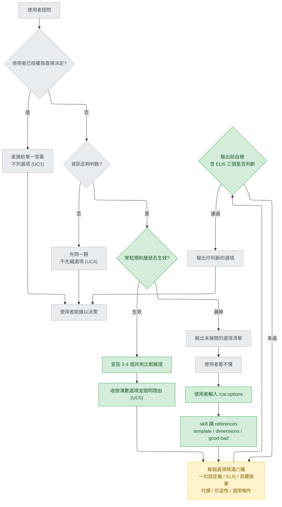
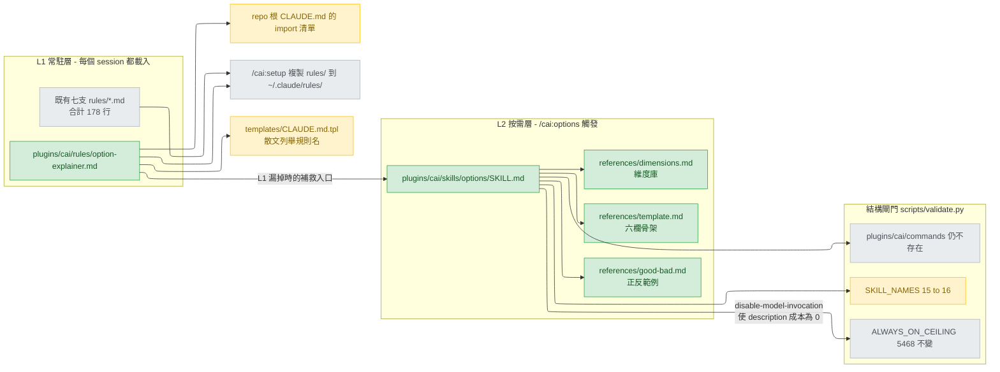

# option-explainer with ELI5 — high-level design

把 `docs/design/2026-08-29-option-explainer-spec.md`（以下稱 **spec**）的三層方案，
改寫成本 repo 的合法形狀：兩層交付，並在選項欄位裡加入一個獨立的 ELI5 欄。

spec 是**引用來源，不是產出**。它假設的目錄結構（`skills/option-explainer/`、
`commands/expand.md`）在本 repo 全部不成立，本文件的工作就是把它落到成立的位置。

## Status

approved 2026-08-29

## Use cases / Issues

> **編號慣例**：本文件用 `UC<n>` 統一編號使用情境與工程議題。**刻意不沿用 spec 那套
> 以大寫 R 開頭的規則編號**——spec 的常駐規則本身就用那個字母
> （`docs/design/2026-08-29-option-explainer-spec.md:164` 起的七條）。兩套編號同形會
> 讓 detail 階段的追溯表指錯對象，因為那張表是用同一個正規式抓 id 的。

行為面（每一條都指向 spec §8.1 的驗收測試編號）：

- UC1 — **事前入口**：使用者要在兩個以上的技術方案之間做選擇。成功判準：輸出先宣告
  2–4 個共用比較維度、每個選項填滿六欄、結尾有預設建議與其失效前提。對應 T1、T5。
- UC2 — **事後補救入口**：上一則回覆已經丟出看不懂的選項，使用者主動要求展開。成功
  判準：`/cai:options` 100% 生效，輸出術語表、同軸對照表、六欄描述，且不重述原文。對應 T4。
- UC3 — **反向情境**：使用者已明確授權「你選一個」。成功判準：直接給單一答案，不再
  列選項、不套模板。對應 T6，這是確認規則沒有過度觸發的那一條。
- UC4 — **資訊不足**：缺少關鍵判斷資訊時，先問一題，不先編選項。對應 T3。
- UC5 — **湊數選項**：選項實質差異過小或有明顯劣選時，主動收斂並說明理由。對應 T2。
- UC6 — **ELI5 可自檢**：ELI5 欄的品質由三個是/否判斷決定，不由「五歲小孩也懂」這種
  無法驗證的形容詞決定。成功判準：新增的 T7 逐項通過那三個判準。對應 T7（新增）。

結構面（工程議題，由 `python scripts/validate.py` 與 `python -m pytest` 判定）：

- UC7 — 常駐層必須隨 `/cai:setup` 送到每一個安裝者手上，且被 repo 根 `CLAUDE.md`
  的 import 清單納入。成功判準：新規則檔存在於 `plugins/cai/rules/`，且 import 清單
  有它。
- UC8 — always-on description 預算不得因為這次新增而上升。成功判準：
  `ALWAYS_ON_CEILING` 維持 5468 不變，且預算檢查通過。
- UC9 — 常駐規則檔行數 ≤ 45，且放寬的理由寫在規則檔內。成功判準：人工讀該檔的註記。
- UC10 — 六欄清單在四個地方完全一致：常駐規則的必填欄位、`references/template.md`
  的骨架、`references/good-bad.md` 的**正例**、以及 skill 補救入口的硬性要求。成功判準：
  四份清單逐欄比對相同。這條專門擋 spec §5.5 與 §6.2 沒跟著改的漏。
- UC11 — spec 有九處會因為加入 ELI5 而裂開（見「High-level design / 九處裂縫」），
  detail 階段必須逐一指定改寫後的內容。成功判準：detail 文件對九處各有一筆對應。
- UC12 — 結構檢查全綠：`SKILL_NAMES` 更新為 16 個名字、`plugins/cai/commands/` 仍不
  存在、新 SKILL.md 不含 `plugins/cai/scripts/` 字串與 model family 名稱、所有 `/cai:`
  與 `${CLAUDE_PLUGIN_ROOT}` 引用都解析得到、無 BOM、`.cmd` 維持純 ASCII。

## Feasibility

| Id | Capability | Verdict | Evidence |
|---|---|---|---|
| C1 | 帶 `disable-model-invocation: true` 的元件，其 description 不計入 always-on 預算 | verified | `scripts/validate.py:214` 的加總以 `if "disable-model-invocation: true" not in read_text(p)` 過濾，見 `scripts/validate.py:214`–216；設計意圖寫在 `scripts/validate.py:198` 起的註解 |
| C2 | 預算上限是硬閘門，值為 5468，設計目標 4673 | verified | `scripts/validate.py:210` `ALWAYS_ON_CEILING = 5468`；`scripts/validate.py:219` 的 `check(... always_on_total <= ALWAYS_ON_CEILING)` |
| C3 | 帶該 flag 的 skill 仍可被使用者以 `/cai:<name>` 呼叫 | verified | `scripts/validate.py:175`–176 註解明寫「keeps their descriptions out of the always-on budget while leaving them user-invocable」；`plugins/cai/skills/design/SKILL.md:5` 帶 flag 而 `plugins/cai/skills/design/SKILL.md:3` 的 description 寫著 `Usage: /cai:design`；`docs/design/2026-08-29-capability-gap-analysis.md:243` 記錄 `cai:design` 在 88 個 session log 中實際被呼叫過 1 次 |
| C4 | `skills/` 目錄名是寫死白名單，新增 skill 不同步改就直接失敗 | verified | `scripts/validate.py:166` 的 `SKILL_NAMES` 共 15 個名字，`scripts/validate.py:170` 斷言 `skill_dirs == SKILL_NAMES`；`scripts/validate.py:162` 起的註解說設計目標是 14 個，方向是往下收 |
| C5 | `plugins/cai/commands/` 被斷言不存在，spec 的 `commands/expand.md` 在本 repo 無法成立 | verified | `scripts/validate.py:188` `check(f"{PLUGIN}/commands is gone", not os.path.isdir(...))`；理由在 `scripts/validate.py:185`–187：同名 command 與 skill 會產生 slash command 衝突 |
| C6 | `/cai:setup` 把整個 `rules/` 目錄複製到 `~/.claude/rules/`，新增一支就等於發給每個安裝者 | verified | `plugins/cai/skills/setup/SKILL.md:27`–28「copy every `.md` file from `<plugin-root>/rules/` into it」；`scripts/validate.py:224` 以 glob 收集 `rules/*.md` |
| C7 | repo 根 `CLAUDE.md` 以 `@` import 七支規則中的六支，而**沒有任何自動檢查**驗證這份清單 | verified | `CLAUDE.md:8`–13 是那六行 import；`scripts/validate.py:222`–244 是全檔唯一觸及 `rules/` 的區塊，只做「目錄非空」與「template 不重述 rules 條目」兩件事 |
| C8 | `rules/` 目前七支合計 178 行，最長一支 43 行 | verified | ripgrep 逐行計數：workflow 40、model-selection 43、documentation 36、memory 11、communication 5、epistemics 22、coding 21，合計 178；最長者末行為 `plugins/cai/rules/model-selection.md:43` |
| C9 | Skill 自動觸發在本安裝上實測不可靠：15 支 configured、僅 4 支曾被呼叫 | verified | `docs/design/2026-08-29-capability-gap-analysis.md:240` 的表（skills 15/4/11、agents 9/4/5）；spec 自己也承認「Skill 低觸發」於 `docs/design/2026-08-29-option-explainer-spec.md:570` |
| C10 | `skills/*/SKILL.md` 不得含 `plugins/cai/scripts/` 字串；`skills/*/references/*.md` 會被掃 model family 名稱；`rules/*.md` 不在該掃描範圍 | verified | `scripts/validate.py:479`–482 是前者；`scripts/validate.py:1133`–1136 的 glob 只含 agents、skills SKILL.md、skills references、catalog，不含 `rules/`，理由在 `scripts/validate.py:1129` |
| C11 | SKILL.md 內每個 `/cai:<name>` 與 `${CLAUDE_PLUGIN_ROOT}/<path>` 都必須解析得到 | verified | `scripts/validate.py:135`–136 的兩條 regex，`scripts/validate.py:152`–160 逐檔檢查；可解析名單由 `scripts/validate.py:141` 的 `invocable_names()` 從 `skills/` 目錄名產生，所以 `skills/options/` 一旦存在，`/cai:options` 即合法 |
| C12 | `templates/CLAUDE.md.tpl` 不得與任何 rules 檔共用 `- ` 條目，且其散文逐一列舉了七支規則的名字 | verified | `scripts/validate.py:239`–242 的 bullet 交集檢查；`plugins/cai/templates/CLAUDE.md.tpl:5`–6 列舉「communication, epistemics, coding, workflow, model selection, memory, documentation」 |
| C13 | 既有常駐規則已經有兩條與本設計方向相反或相鄰：簡潔優先、以及「何時該停下來問」 | verified | `plugins/cai/rules/communication.md:4`–5「surface uncertainty/assumptions/alternatives only when they'd change the conclusion or action」；`plugins/cai/rules/epistemics.md:12`「Then name the options; don't pick silently」；兩者都經 `plugins/cai/skills/setup/SKILL.md:27` 發給使用者 |
| C14 | spec 的 L1 規則區塊正好 39 行，貼著它自訂的 40 行上限 | verified | `docs/design/2026-08-29-option-explainer-spec.md:159` 至 197 為 fence 內容（fence 本身在 158 與 198），197−159+1 = 39；上限寫在 `docs/design/2026-08-29-option-explainer-spec.md:73` |
| C15 | `disable-model-invocation` 的**官方文件語意**（它是否只關掉 model 自動觸發、而確定保留 slash command） | verified | 官方 skills 文件 https://code.claude.com/docs/en/skills.md 的 frontmatter reference：「Set to `true` to prevent Claude from **automatically loading this skill**. Use for workflows you want to trigger manually with `/name`. Also prevents the skill from being preloaded into subagents.」；同文件 "Control who invokes a skill" 段：「**Only you can invoke the skill.** Use this for workflows with side effects... like `/commit`, `/deploy`」。design 階段以 `claude-code-guide` 查證 |
| C16 | 帶 flag 的 skill，其 description **在平台端**是否仍進入常駐 context | UNVERIFIED | 官方文件只說 description 供 Claude 判斷「何時套用 skill」（同上文件 frontmatter reference），**沒有說明帶 flag 後 description 的去留**。這不影響驗收：`ALWAYS_ON_CEILING` 是本 repo 自訂的尺，按 flag 排除（`scripts/validate.py:214`–216），所以驗收標準第 4 條是機械保證的。真正未證實的是「這把尺量的是不是平台的真實成本」——那是該檢查本來就有的性質（已套用於 6 支 main-line skill 與 72 支 catalog alias），非本次改動引入 |

**關於現況預算數字的出處**：intake 階段回報 `python scripts/validate.py` 印出
`always-on description budget: 5451 chars (design target: 4673)`，也就是距 C2 的
5468 只剩 17 字元。本階段沒有可執行 shell 的工具，未重跑該指令，因此這個數字以
「intake 回報」的身分出現，不列為 C 列的 verified 證據。設計並不依賴它為真：真正
承重的是 C1（flag 讓新 description 成本為 0）與 C2（上限維持 5468）。即使餘裕不是
17 而是 170，做法 B 的結論不變。

**C9 的反向讀法必須一起記下**：`docs/design/2026-08-29-capability-gap-analysis.md:252`–260
自己指出這把尺的盲點——那 11 支「從未被呼叫」的 skill 有一部分是因為 `cai:track`
本身沒被跑過，而不是因為它們沒用；且 track 的 stage 是**讀 reference 檔**而非 Skill
呼叫，在這個計數法下永遠是 0。所以 C9 支持的結論只有一句：**不能把自動觸發當成唯一
防線**。它不足以證明「skill 一定不會被觸發」。

## High-level design

### 交付形狀

| 層 | spec 原本的形狀 | 本 repo 的形狀 | 為什麼改 |
|---|---|---|---|
| L1 常駐規則 | 貼進專案 `CLAUDE.md` 中後段 | 新增 `plugins/cai/rules/option-explainer.md`，並加進 repo 根 `CLAUDE.md` 的 import 清單 | C6：`rules/` 是本 repo 唯一會被 `/cai:setup` 發給每個安裝者的常駐來源；貼進 `CLAUDE.md` 只影響這個 checkout |
| L2 skill | `skills/option-explainer/` | `plugins/cai/skills/options/`，含 `references/template.md`、`dimensions.md`、`good-bad.md` | C4：目錄名進白名單；名稱縮短為 `options` 以配合 slash command |
| L3 slash command | `commands/expand.md` | **併入同一支 skill**，入口是 `/cai:options` | C5：`commands/` 已退役且被斷言不存在 |

L2 與 L3 合併後，那支 skill 同時是**事前入口**（UC1：「我要列選項」）與**事後補救
入口**（UC2：「上一則看不懂，展開」）。它的 frontmatter 帶
`disable-model-invocation: true`，因此 description 不進 always-on 預算（C1），但仍
可被 `/cai:options` 呼叫（C3）。

### 主流程

`SIX` 標成 modified 而非 added，因為欄位表本身是 spec 已有的五欄，這次改的是它的
組成（見下方「六欄的職責切分」）。

### 元件與變更點

**兩張圖都已渲染驗證**（design 階段補跑，`mmdc` 11.16.0，兩張皆 exit 0 產出 SVG）。
`elk` 佈局確認生效而非靜默 fallback：同一張圖拆掉 frontmatter 重繪，viewBox 從
`937.75 × 1754.9`（elk）變成 `971.18 × 2134.78`（預設 dagre），節點座標亦不同。語法
只用最保守的寫法（labelled edge 一律 `-->|"..."|`、label 全部加雙引號、`classDef` 與
`class` 分開寫）。

### 六欄的職責切分

spec 的五欄（`docs/design/2026-08-29-option-explainer-spec.md:62`、169–174）擴為六欄，
關鍵是把「一句話定義」與「ELI5」切開，否則兩欄會塌成同一句話：

| 欄位 | 職責 | 硬性約束 |
|---|---|---|
| 一句話定義 | 字面上這個做法在做什麼 | **限一句**，不含術語 |
| ELI5 | 一段類比式說明 | **必須用一個日常生活的比喻**，且不得重複上一欄的措辭 |
| 具體後果 | 會新增/修改哪些檔案、日後操作有何不同 | 可觀察事實，禁止抽象形容詞 |
| 代價 | 時間、複雜度、需要新學的東西 | 沿用 spec |
| 可逆性 | 低/中/高 + 換掉的成本 | 沿用 spec |
| 適用條件 | 在什麼前提成立時這個選項才是對的 | 沿用 spec |

ELI5 的品質不寫成「五歲小孩也懂」，而是三個是/否判斷，因為 spec 的 NFR-3
（`docs/design/2026-08-29-option-explainer-spec.md:75`）明文要求每條規則對應一個是/否
判斷、禁止「盡量」「適當」這類無法驗證的措辭，而「五歲小孩也懂」正是那種形容：

1. 整段不含專有名詞、縮寫、套件名？
2. 是否包含一個日常生活類比？
3. 是否與「一句話定義」的措辭不重複？

### spec 的九處裂縫（detail 階段逐一改寫）

加入 ELI5 後，直接照抄 spec 會在這九個位置產生自相矛盾。HLD 只負責點名與定性；
逐字改寫是 detail 階段的工作（UC11）：

| # | 位置 | 裂在哪 |
|---|---|---|
| 1 | `docs/design/2026-08-29-option-explainer-spec.md:62` | FR-3 寫「五個固定欄位」，欄位清單需改為六 |
| 2 | `docs/design/2026-08-29-option-explainer-spec.md:175` 至 180 | 必填欄位的規則文字只有五項 |
| 3 | `docs/design/2026-08-29-option-explainer-spec.md:159` 至 197 | 規則區塊正好 39 行、上限 40，**只剩 1 行**；加一欄再加自檢必破（C14） |
| 4 | `docs/design/2026-08-29-option-explainer-spec.md:189` 至 193 | 輸出前自檢清單四項，沒有 ELI5 對應項 |
| 5 | `docs/design/2026-08-29-option-explainer-spec.md:268` 至 270 | §5.2 執行流程寫「五個欄位全填」 |
| 6 | `docs/design/2026-08-29-option-explainer-spec.md:353` 至 359 | template 骨架列的是五欄 |
| 7 | `docs/design/2026-08-29-option-explainer-spec.md:421` 至 434 | good-bad **正例**已按舊五欄寫好。spec 自稱正例約束力最強（`docs/design/2026-08-29-option-explainer-spec.md:381`），不補 ELI5 會直接教模型少寫一欄——這是九處裡最貴的一處 |
| 8 | `docs/design/2026-08-29-option-explainer-spec.md:471` 至 485 | §6.2 補救入口的五項硬性要求完全沒提 ELI5 |
| 9 | `docs/design/2026-08-29-option-explainer-spec.md:542` 至 547 | T1–T6 沒有一條測 ELI5，需新增 T7（UC6） |

另有兩個 spec 內部一致性問題：**NFR-3 衝突**已由上面的三個是/否判斷解掉；
**失效模式沒有歸屬**（`docs/design/2026-08-29-option-explainer-spec.md:38` 至 44 的
F1–F5 表，FR 表每列都對應一個 F 編號）已裁決為新增 F6，見 Decision 5。這使九處裂縫
變成**十一處**：F1–F5 表要多一列 F6，§9.1 退化路徑要把 ELI5 插進第 3 順位。

### 驗收標準

結構面（自動；`python scripts/validate.py` 與 `python -m pytest` 全綠，兩者目前
由 intake 回報為 exit 0 / 42 passed）：

1. `plugins/cai/rules/option-explainer.md` 存在。
2. `plugins/cai/skills/options/SKILL.md` 存在，frontmatter 有 `name` + `description`
   + `disable-model-invocation: true`；`references/` 下有 `template.md`、
   `dimensions.md`、`good-bad.md`（C11 使 SKILL.md 內對這三支的
   `${CLAUDE_PLUGIN_ROOT}` 引用成為自動檢查）。
3. `SKILL_NAMES` 更新為 16 個名字且維持排序，該檢查通過（C4）。
4. `ALWAYS_ON_CEILING` 維持 **5468 不變**且預算檢查通過（C1、C2）。
5. `plugins/cai/commands/` 仍不存在（C5）。
6. 新 SKILL.md 不含 `plugins/cai/scripts/` 字串；SKILL.md 與三支 references 都不含
   model family 名稱；所有 `/cai:` 與 `${CLAUDE_PLUGIN_ROOT}` 引用解析得到（C10、C11）。
7. `templates/CLAUDE.md.tpl` 未重述新規則檔的任何 `- ` 條目（C12）。
8. 無 BOM、`.cmd` 維持純 ASCII。

**第 1 條的一半不是自動的**：新規則檔被 repo 根 `CLAUDE.md` import 這件事，
`validate.py` 不檢查（C7）。同理，`templates/CLAUDE.md.tpl:5`–6 的散文會因為多一支
規則而過時，bullet 交集檢查也抓不到（C12）。這兩項必須進 detail 的檢查清單並以人工
確認，否則會以「全綠」的外觀漏掉。

內容面（人工）：

9. 六欄成立，「一句話定義」與「ELI5」的職責在規則文字裡明確區分，ELI5 對應三個是/否
   自檢。
10. `references/template.md` 骨架、`references/good-bad.md` **正例**、以及 skill 補救
    入口的硬性要求，三者欄位清單與規則檔完全一致（UC10）。
11. 規則檔行數 ≤ 45，且放寬理由已註明於檔內（UC9）。
12. 失效模式表已新增 **F6**，且退化路徑順序為：同軸對比 → 預設建議 → **ELI5** →
    術語規則 → 必填欄位（Decision 5 已裁決）。

行為面（人工，結果寫進 `state.md` 的 verify note）：

13. T1–T6 全數符合 spec §8.1 期望，含 T6 反向測試（UC3：規則未過度觸發）。
14. 新增 T7 專測 ELI5，通過第 9 條的三個是/否判準（UC6）。

## Architecture decisions

Decision 1–4 是 **intake 階段已裁決**的項目，這裡把當時的選項與代價寫下來供覆核，
不重新開放。Decision 5 沒有裁決，交給 Open questions。

標記慣例：一列標 `(recommended)` 表示它是本文件在該題上支持的選項，且它依賴的每個
capability 都是 verified。

### Decision 1 — 常駐層放在哪裡

| Option | Rests on | Costs | Fails when |
|---|---|---|---|
| A 新增 `plugins/cai/rules/option-explainer.md` 並加進 repo 根 `CLAUDE.md` 的 import 清單 **(recommended)** | C6, C7, C8, C12 | 每個安裝者的每個 session 都多載入最多 45 行，是既有 178 行的約 25%；import 清單無自動檢查，漏加不會被擋；`templates/CLAUDE.md.tpl` 的規則列舉散文變成過時 | 使用者只想在單一專案試用、不想改變全體安裝者的常駐內容時 |
| B 只貼進 repo 根 `CLAUDE.md`，不進 `rules/` | C6, C7 | 常駐成本只落在這個 checkout；但 `/cai:setup` 不會發給任何人，等於這個功能只有本 repo 的維護者拿得到，與「讓 AI 解釋清楚選項」的受眾完全錯位 | 目的本來就只是自用時 |
| C 寫進 `templates/CLAUDE.md.tpl` | C12 | 只影響**新**安裝者的 `~/.claude/CLAUDE.md` 初始內容，既有使用者不會拿到；且 tpl 與 rules 的 `- ` 條目不得重疊，規則本身是條列式，會直接撞上該檢查 | 只想影響全新安裝、且規則不是條列式時 |

**Chosen:** A — intake 已裁決。理由是受眾：這條規則要在「AI 正要丟出選項」的那一刻
生效，而那一刻在每個安裝者的每個 session 都可能發生，只有 `rules/` 這條路徑（C6）
覆蓋得到。代價（常駐體積 +25%）由 Decision 4 的行數上限承接。

### Decision 2 — 第二層做成什麼形狀

| Option | Rests on | Costs | Fails when |
|---|---|---|---|
| A 照 spec：獨立 `skills/option-explainer/` + `commands/expand.md` | C5 | 不可行——`commands/` 被斷言不存在，且理由是同名 command 與 skill 的 slash command 衝突已經發生過一次 | 永遠不成立於本 repo |
| B 單一 skill `skills/options/`，帶 `disable-model-invocation: true`，入口 `/cai:options`，同時服務事前與事後 **(recommended)** | C1, C2, C3, C4, C10, C11 | 放棄語意自動觸發：使用者不打 `/cai:options` 就只剩 L1 常駐規則；白名單從 15 加到 16，與 `scripts/validate.py:162` 起註解所寫「往 14 收」的方向相反，需要在該處說明為何加 | 若使用者從不記得這個指令存在，第二層等於不存在，全部壓力回到 L1 |
| C 一般 skill（不帶 flag），保留語意自動觸發 | C2, C9 | description 進 always-on 預算，而預算上限是硬閘門且現況幾乎沒有餘裕；要塞進去必須先砍別支的 description，那是一筆與本需求無關的改動 | 若預算餘裕充足、且自動觸發實測可靠，這才是較好的選項 |
| D 只做 L1，不做第二層 | C9 | 範例與維度庫塞不進 45 行，而 spec 認為範例的約束力最強；且 UC2 的補救入口消失，L1 一漏就沒有第二次機會 | 若 L1 規則實測幾乎不漏，多的一層就只是維護負擔 |

**Chosen:** B — intake 已裁決。決定性的是兩件事：C5 讓 A 直接出局；C9 的實測
（15 支 skill 只有 4 支曾被呼叫）說明把可靠度押在自動觸發上沒有依據，既然如此，
自動觸發帶來的預算成本（C2）就買不到對應的東西，於是 C 也出局。B 用 flag 把成本
降為 0（C1）並保留使用者主動入口（C3）。

**C15 已於 design 階段查證為真**：官方 skills 文件明文「Use for workflows you want to
trigger manually with `/name`」與「Only you can invoke the skill」，Option B 不倒塌，
`/cai:options` 打得出來。原本標為「本設計唯一建立在未查證平台語意上的地方」的風險已
關閉。

**剩下的是 C16，而它不承重**：官方文件沒有說明帶 flag 後 description 在平台端是否仍
進入常駐 context。這不改變任何選項的排序——驗收標準第 4 條盯的是本 repo 自訂的
`ALWAYS_ON_CEILING`，而該檢查按 flag 排除（`scripts/validate.py:214`–216），所以 B 對
那條閘門的效果是機械保證的。C16 為假只代表本 repo 這把尺量的不是平台真實成本，而那是
該檢查本來就有的性質（已套用於 6 支 main-line skill 與 72 支 catalog alias），不是本次
改動引入的，也不該由本次改動負責修。

### Decision 3 — ELI5 用什麼形狀進欄位表

| Option | Rests on | Costs | Fails when |
|---|---|---|---|
| A 六欄，「一句話定義」與 ELI5 職責切開 **(recommended)** | C13, C14 | 欄位從五變六，四個地方的清單都要同步（UC10）；規則區塊行數必破 40（C14），需 Decision 4 承接 | 當兩欄的差異在實作時說不清楚，模型會把它們寫成同一句話的兩種說法 |
| B 六欄但職責合併（「白話定義（含比喻）」一欄） | C13 | 行數壓力較小，但把「限一句、不含術語」與「必須有比喻、不得重複」兩組互斥約束塞進一欄，自檢會互相打架 | 當使用者其實只需要一句白話、比喻反而變成贅字時 |
| C 維持五欄，把 ELI5 降為對「一句話定義」的措辭要求 | C13 | 幾乎不增加行數；但 ELI5 就變回一條風格建議，正是 spec §1.3 判定為無效的那種軟性要求 | 當常駐體積是唯一的硬限制時，這是唯一塞得下的選項 |

**Chosen:** A — intake 已裁決。B 的失敗模式（互斥約束同居一欄）與 C 的失敗模式
（退回風格建議）都指向同一件事：ELI5 要能被自檢，就必須有自己的欄位與自己的判準。
與 `plugins/cai/rules/communication.md:4`–5 的簡潔優先原則（C13）的張力，由 UC3 的
反向測試 T6 把關——授權即決斷時不套模板。

### Decision 4 — 常駐規則檔的行數上限

| Option | Rests on | Costs | Fails when |
|---|---|---|---|
| A 上限放寬為 45 行，並在檔內註明放寬理由 **(recommended)** | C8, C14 | 成為 `rules/` 最長的一支（現況最長 43 行），使常駐總量從 178 增至約 223；註明理由本身也佔行數 | 當實際寫下來仍然超過 45，代表欄位或自檢設計過重，該回頭砍而不是再放寬 |
| B 硬守 spec 的 40 行 | C14 | 39 行只剩 1 行餘裕，加一個欄位加三個自檢判準至少需要 5–6 行，必然得砍掉既有規則的內容（例如術語規則的退化路徑，或自檢清單的某幾項），砍哪一條沒有依據 | 當常駐 token 成本是真正的瓶頸時 |
| C 不設上限 | C8 | 失去 NFR-1 的成本閘門；常駐內容一旦沒有上限，之後每次「再加一條就好」都沒有東西擋 | 當這份規則不常駐、只按需載入時 |

**Chosen:** A — intake 已裁決。45 這個數字的來源是算術而非偏好：C14 的 39 行 + 一個
新欄位（1 行）+ 三個是/否自檢（3 行）+ 「一句話定義」與 ELI5 職責切分所需的補充
（1–2 行）= 44–45。放寬理由寫在檔內，是為了讓下一個想再放寬的人先讀到這次的算術。

### Decision 5 — ELI5 在失效模式表裡的歸屬

| Option | Rests on | Costs | Fails when |
|---|---|---|---|
| A ELI5 是 FR-1 的強化，不新增 F 編號 | C13, C14 | 失效模式表維持 F1–F5 不動，改動最小；但 FR 表會出現「一個 F 編號對到兩條 FR」的不對稱，且 ELI5 在 §9.1 退化路徑裡沒有天然位置——它會跟著術語規則一起被降級 | 當「懂了每個字卻不知道這東西在幹嘛」實際上是獨立於 F1 的失效，把它綁在 F1 底下會讓它跟著術語規則的退化路徑一起被砍掉 |
| B 新增 F6「懂了每個字，但不知道這東西在幹嘛」 | C13, C14 | 失效模式表、FR 對應表、§9.1 退化路徑三處都要改；換到的是 ELI5 有獨立編號、獨立退化順位，可被單獨保留或單獨放棄 | 當 F6 與 F1 在實際輸出上分不開，多一個編號只是多一份維護負擔 |

**Chosen:** B — 使用者於 design 階段裁決（2026-08-29）。新增失效模式
**F6「懂了每個字，但不知道這東西在幹嘛」**，ELI5 對應到一條新的 FR，取得獨立編號與
獨立退化順位。

連帶裁決的 §9.1 退化順序（`docs/design/2026-08-29-option-explainer-spec.md:579` 至 584
的改寫目標）：

1. 同軸對比（核心，最後放棄）
2. 預設建議
3. **ELI5** ← 新增的順位
4. 術語規則（可退化為只解釋最關鍵的 2–3 個術語）
5. 必填欄位（可退化為只填「具體會發生什麼」）

也就是空間不夠時，**寧可少解釋幾個術語，也要保住那段類比**。選 B 而非 A 的代價是三處
表格要改（失效模式表、FR 對應表、§9.1）；換到的是 ELI5 不會跟著術語規則一起被降級——
而那正是 A 的失敗模式。

## Open questions

- ~~**OQ1 — ELI5 屬於既有的 F1，還是需要一個新的 F6？**~~
  **已答（2026-08-29，使用者裁決）**：新增 F6「懂了每個字，但不知道這東西在幹嘛」。
  詳見 Decision 5。
- ~~**OQ2（依附 OQ1）— ELI5 在 §9.1 退化路徑裡排第幾？**~~
  **已答（2026-08-29，使用者裁決）**：排在預設建議之後、術語規則之前，即第 3 順位。
  空間不夠時寧可少解釋幾個術語，也要保住那段類比。驗收標準第 12 條照這個順序對照。
  詳見 Decision 5。

## Out of scope

- 不做 spec §10.2 的自動化評分腳本（未定義術語密度、維度一致性的機器可讀分數）。
- 不改變 AI 的技術判斷，只改變呈現方式——沿用 spec §2.3 的排除項。
- 不新增獨立的 `/cai:expand` skill；補救入口併入 `/cai:options`。
- 不照 spec §7.3 的三階段導入（先補救指令、再常駐規則、再 skill），一次交付兩層。
- 不在本文件寫出規則檔的逐字內容、SKILL.md 的 description 原文、或三支 references
  的內文。那些是 detail 階段的產出，包含 `SKILL_NAMES` 那一行的實際 diff 也是。
- **不修改 spec 檔本身。** 它以「歷史輸入」的身分留在 `docs/design/`，九處裂縫的改寫
  發生在新交付物裡，不回頭改 spec。這是本文件自行採取的假設而非裁決；代價是 spec 從
  此與實作不一致，讀到它的人可能照著五欄版本實作。若不接受，處理方式應該是在 spec
  頂端加一行指向本文件的 superseded 註記，那筆改動需要另行授權。
- 本文件寫出了 `plugins/cai/rules/option-explainer.md` 與 `plugins/cai/skills/options/`
  這兩個尚不存在的路徑。stage-design 的高階模式原則上不寫尚不存在的檔案路徑，這裡是
  刻意的例外：這兩個路徑是 intake 已裁決的**元件邊界**（哪一層放在會被 `/cai:setup`
  發送的目錄裡、哪一層放在按需載入的目錄裡），而不是實作細節。檔案的**內容**仍然全部
  留給 detail 階段。
