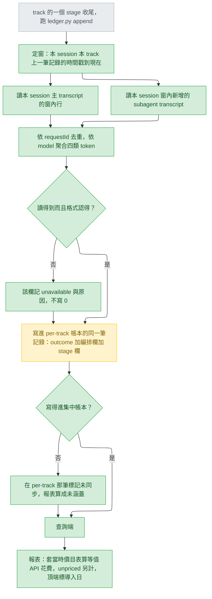
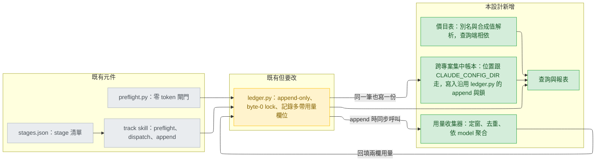

# track usage accounting — high-level design

## Status

approved 2026-08-30

## Use cases / Issues

每一條的「判準」是：不做到這件事，任何人都無法從產出物看出它成功了。

- UC1 — 一次 stage 嘗試結束後，帳本能說出這次用了哪些 model、每個 model 各多少 input / output / cache_creation / cache_read token。判準：帳本裡出現該次嘗試的 per-model 四類 token，四類分開不合併。（AC1）
- UC2 — 同一份來源資料重跑記帳，結果逐字相同。判準：對同一份 transcript 跑兩次記帳，產出的 token 數完全一致，且與人工用 requestId 去重的數字相同。（AC2）
- UC3 — 回答「這條 track 的每個 stage 花多少、整條 track 總計多少」。判準：查詢輸出對 6 個 stage 各給一列與一個總計列，且 stage 用量與編排用量分成兩欄（Decision 1）。
- UC4 — 回答「過去 7 / 30 / 60 天、跨這台機器上所有專案、按 stage 分組的用量」。判準：在兩個以上有 `.claude/track/` 的專案（實測目前有 2 個：`claude-all-in-one`、`day-trading-monarch`，主 session 2026-08-29 實測 M10）跑同一個查詢，兩邊得到同一份跨專案結果。
- UC5 — 回答 GAP-02 原文四問：是哪一個 stage 花的、實際跑了幾個 model、有多少 spend 尚未定價、以及跑了幾次嘗試（含 `failed` / `blocked` 的重試）。判準：一次查詢輸出同時含這四個欄位（`docs/design/2026-08-29-capability-gap-analysis.md:130`）。（AC5）
- UC6 — 金額欄位在報表上明確標示為「等值 API 花費（訂閱制，非實付）」。判準：報表任何出現金額的地方都帶這個標示，不出現無標示的裸金額。（AC4）
- UC7 — 價目表涵蓋不到的 model 在報表上標為 `unpriced`，總計旁邊另外顯示有多少 spend 未定價。判準：塞一個價目表沒有的 model 進去，總計不變、`unpriced` 計數加一，且該筆金額不被當成 0 併入總計。（AC3）
- UC8 — 報表頂端顯示資料起始日；查詢區間早於起始日的部分顯示「無資料」，不顯示 0。判準：導入後第 3 天查 30 天，報表標出起始日並對前 27 天標「無資料」。（AC6，使用者裁決 2）
- UC9 — 集中帳本每一筆都帶得出是哪個專案、哪條 track；per-track 那一份仍然留在該 track 目錄下。判準：刪掉集中帳本後，per-track 那份仍能單獨回答 UC3。（AC7）
- R1 — 記不成帳一律留痕，永遠不寫 0。涵蓋兩種失敗：**讀不到**（來源不存在、格式不認得）→ 該欄記 `unavailable` 與原因；**寫不進集中帳本**（權限不足、鎖不到、位置解不出來）→ 在 per-track 那一筆標記「未同步」，報表把它算成未涵蓋而不是 0。判準：分別破壞來源與集中帳本位置，兩次都在帳本裡看得到痕跡，總計都不因此變動。（AC8）
- R2 — 對既有 track 流程零 token 成本：記帳全部在 script 內完成，不佔用任何模型回合。判準：跑完一個 stage，模型的訊息數與導入前相同。（AC9）
- R3 — 不回填歷史，從導入日起累積。判準：導入當天查詢，結果為空並標出起始日，而不是把既有 transcript 掃進來。（使用者裁決 2）
- R4 — Windows 與 POSIX 都要能執行；任何新增的 `.cmd` 必須純 ASCII，任何文字檔不得帶 UTF-8 BOM。判準：`python scripts/validate.py` 通過（`scripts/validate.py:500-503` 檢查 ASCII、`scripts/validate.py:510-522` 檢查 BOM）。
- R5 — 集中帳本是跨專案共用的單一檔案，會被不同專案、不同 session 同時寫入；**並發安全由既有的 `ledger.py` 負責**，集中帳本沿用它的 append 與 byte-0 lock（`plugins/cai/scripts/ledger.py:136-166`），不另寫第二套鎖。判準：多程序並發寫入後，記錄數等於寫入次數，沒有互相覆蓋。

## Feasibility

在下面任何一個選項被權衡之前先結案。「主 session 2026-08-29 實測」指的是派這份設計的主 session 當天在這台機器上直接執行指令觀察到的結果；它證明的是「今天在這個版本上是這樣」，不證明「未來版本也會是這樣」——後者由 C6、C21 兩列單獨處理，而它們是本設計僅存的兩個未經證實項。

| Id | Capability | Verdict | Evidence |
|---|---|---|---|
| C1 | plugin 可在 `hooks/hooks.json` 註冊 `SubagentStop` / `Stop` / `SessionStart` / `SessionEnd` 等事件 | verified | https://code.claude.com/docs/en/hooks.md 原文「Define plugin hooks in `hooks/hooks.json` ... When a plugin is enabled, its hooks merge with your user and project hooks.」；本 repo 既有寫法在 `plugins/cai/hooks/hooks.json:3-13` |
| C2 | 每個 hook 的輸入都帶 `session_id`、`transcript_path`、`cwd`；subagent 情境另帶 `agent_id`、`agent_type` | verified | https://code.claude.com/docs/en/hooks.md 的 Common input fields 一節，`agent_id` / `agent_type` 標註為 subagent context only |
| C3 | 沒有任何 hook payload 帶 token 或 cost 欄位 | verified | https://code.claude.com/docs/en/hooks.md 全頁 payload 欄位表無 token / cost 欄位，故用量必須另外取得 |
| C4 | `SubagentStop` 的 `transcript_path` 指向 subagent 自己的 transcript 還是主 session 的 | 已無關 — 選定方案不依賴此能力 | 這個問題只在「以 `SubagentStop` 事件觸發」的路線上才需要答案（Decision 2 選項 A）。定案走選項 B，一個 hook 都不註冊，來源路徑由 C19 的 session id 依 C5 的佈局自組，因此它不再是未知數而是無關項。原始狀態：https://code.claude.com/docs/en/hooks.md 只給 common input fields，未給逐事件 schema |
| C5 | transcript 為 JSONL；主 session 的檔與同名目錄下的 subagent 檔並存——`<projects>/<encoded-cwd>/<session-id>.jsonl` 與 `<projects>/<encoded-cwd>/<session-id>/subagents/agent-<id>.jsonl` 同時存在，後者旁有同名 `.meta.json` 帶 `agentType`；`type=assistant` 行帶 `message.usage`，內含 `input_tokens` / `cache_creation_input_tokens` / `cache_read_input_tokens` / `output_tokens` 與 `requestId` | verified | 主 session 2026-08-29 實測（M3 / M4 / M6 / M9，並存關係另由 E4 實測確認）；父層路徑另見 https://code.claude.com/docs/en/sessions.md 原文「Claude Code stores transcripts as JSONL at `~/.claude/projects/<project>/<session-id>.jsonl`」 |
| C6 | 上一列那個格式在 Claude Code 改版後仍成立 | UNVERIFIED | https://code.claude.com/docs/en/sessions.md 原文「The entry format is internal to Claude Code and changes between versions, so scripts that parse these files directly can break on any release.」官方明說會壞；`subagents/` 那層目錄更是全文未記載 |
| C7 | 一次 API 回應會散落在多行、每行各帶一份 usage，不依 `requestId` 去重會膨脹且不報錯 | verified | 主 session 2026-08-29 實測（M2）：某 subagent transcript 的 25 個 `type=assistant` 行只對應 5 個不重複 `requestId`；本 track 另一次量測見 `.claude/track/gap02-usage-ledger/ledger.jsonl:2`（input 2.69x / cache_creation 3.16x / cache_read 2.61x / output 1.05x） |
| C8 | OpenTelemetry 有 `claude_code.token.usage` metric，帶 `type`(input/output/cacheRead/cacheCreation) 與 `model` 屬性 | verified | https://code.claude.com/docs/en/monitoring-usage.md 的 metric 表 |
| C9 | 用 OTel 把用量歸到某一個 cai stage 與某一條 track | infeasible | https://code.claude.com/docs/en/monitoring-usage.md 原文：`agent.name` 為「Built-in/official-marketplace names verbatim; user-defined names replaced with "custom"」、`plugin.name` / `skill.name` 同樣把第三方換成 "third-party"。cai 是第三方 plugin，五個 stage agent 全被打成 custom；該頁也沒有任何 working directory / project 屬性 |
| C10 | `claude -p --output-format json` 會回傳該次執行的 usage 與 cost | verified | https://code.claude.com/docs/en/sessions.md 原文「the result, session ID, usage, and cost of a non-interactive run as structured JSON」——限非互動 `-p` 執行，track 的 stage 跑在互動 session 內，不適用 |
| C11 | hook 被 spawn 出來的程序會拿到 `CLAUDE_PLUGIN_DATA` 環境變數 | verified | https://code.claude.com/docs/en/hooks.md 原文「both export them as the environment variables `CLAUDE_PROJECT_DIR`, `CLAUDE_PLUGIN_ROOT`, and `CLAUDE_PLUGIN_DATA` on the spawned process」 |
| C12 | 非 hook 程序（模型 Bash 工具或使用者手動執行的 script）拿得到 `CLAUDE_PLUGIN_DATA` | verified — 結論為拿不到 | 主 session 2026-08-29 實測（E2）：Bash 工具的執行環境中 `CLAUDE_PLUGIN_DATA`、`CLAUDE_PLUGIN_ROOT`、`CLAUDE_PROJECT_DIR` 三者全部未設定。官方只對 hook 的 spawned process 作保證（同 C11，https://code.claude.com/docs/en/hooks.md）。定案的寫入端與查詢端都不是 hook 程序，因此以這個變數定位集中帳本是確定不可行，不是有風險 |
| C13 | 儲存位置不可寫死：`CLAUDE_CONFIG_DIR` 可把 `~/.claude` 整個搬走，`CLAUDE_CODE_PROJECT_DIR_NAME` 可改 `<project>` 目錄名 | verified | https://code.claude.com/docs/en/sessions.md 的環境變數一節 |
| C14 | transcript 是約 30 天的滾動視窗，因此 60 天回溯在來源端根本不存在 | verified | https://code.claude.com/docs/en/sessions.md 原文「Change the 30-day retention — `cleanupPeriodDays` — `settings.json`」；主 session 2026-08-29 實測（M1）最舊 session 檔為 2026-08-01（28 天），且 user 與 project 兩份 settings.json 都沒設這個值 |
| C15 | 同一台機器上出現的 model 識別字含別名與合成值，價目表必須先解析再查價 | verified | 主 session 2026-08-29 實測（M8）：`claude-opus-5`(5806)、`claude-sonnet-5`(2201)、`claude-haiku-4-5-20251001`(446)、`sonnet`(16)、`haiku`(4)、`<synthetic>`(3)、`opus`(1)；別名會出現在 transcript 是因為 cai 自己的元件就是以別名指派 model 的（`plugins/cai/models.json:26`、`:30`、`:34`） |
| C16 | 既有 ledger 是 append-only JSONL，讀取端寬容（缺欄位不炸、壞行降級為 malformed），顯示端欄位固定，且已解過 Windows 並發追加 | verified | `plugins/cai/scripts/ledger.py:210-237` 讀取、`plugins/cai/scripts/ledger.py:280-296` 顯示、`plugins/cai/scripts/ledger.py:136-166` Windows byte-0 lock、`plugins/cai/scripts/preflight.py:176-186` 壞行只報不擋 |
| C17 | 單筆記錄有 4096 位元組上限，超過時先砍 note、再砍 artifact 路徑，砍不動就拒寫 | verified | `plugins/cai/scripts/ledger.py:49` 的 `MAX_RECORD`、`plugins/cai/scripts/ledger.py:169-207` 的縮減順序——用量欄位併進同一筆記錄會吃掉 note 的預算 |
| C18 | 光靠 `agent_type` 推不出是哪個 stage：`intake` 與 `discover` 共用同一個 agent | verified | `plugins/cai/skills/track/stages.json:3-6` 兩列的 `agent` 都是 `architect` |
| C19 | 非 hook 程序有辦法知道自己在哪個 session：`CLAUDE_CODE_SESSION_ID` 存在於 Bash 工具環境，其值即該 session transcript 的檔名 | verified | 主 session 2026-08-29 實測（E3）：該變數有值，`~/.claude/projects/<encoded-cwd>/<值>.jsonl` 存在，同名目錄下的 `subagents/` 也在，內含各 subagent 的 `.jsonl` 與 `.meta.json`；官方未記載，延續性另見 C21，路徑編碼規則見 https://code.claude.com/docs/en/sessions.md |
| C20 | 巢狀 subagent（`spawnDepth` ≥ 1）是否各自觸發 `SubagentStop` | 已無關 — 選定方案不依賴此能力 | 同 C4：只有事件觸發的路線（Decision 2 選項 A）才需要答案。定案的取數方式是掃描本 session 目錄下窗內的所有 subagent 檔，巢狀與否都在同一棵目錄裡，不靠事件計數。原始狀態：https://code.claude.com/docs/en/hooks.md 未說明巢狀情形 |
| C21 | `CLAUDE_CODE_SESSION_ID` 這個未記載的變數在未來版本仍存在 | UNVERIFIED | https://code.claude.com/docs/en/hooks.md 列出的環境變數為 `CLAUDE_PROJECT_DIR`、`CLAUDE_PLUGIN_ROOT`、`CLAUDE_PLUGIN_DATA`、`CLAUDE_EFFORT`、`CLAUDE_CODE_REMOTE`、`CLAUDE_CODE_BRIDGE_SESSION_ID`，不含它；官方未記載的行為沒有相容性承諾。備援路徑是文件化的：註冊一個 `SessionStart` hook 把 payload 的 `session_id`（C2）落到檔案上，代價是 `hooks.json` 與 `scripts/validate.py:464-472` 都要動 |
| C22 | 集中帳本存絕對路徑不構成新增暴露：Claude Code 自己已在同一棵目錄樹裡以完整絕對路徑當目錄名 | verified | 主 session 2026-08-29 實測（E5）：`~/.claude/projects/` 底下 27 個目錄名編著完整絕對路徑，其中 5 個含使用者名稱（形如 `C--Users-millerlai-projects-...`）；編碼規則見 https://code.claude.com/docs/en/sessions.md 原文「where `<project>` is your working directory path with non-alphanumeric characters replaced by `-`」 |
| C23 | transcript 行的時間戳與帳本記錄的時間戳可以直接比較（同一種表示、同一個時區），但兩端精度不同——帳本是秒，transcript 是毫秒 | verified | 主 session 2026-08-30 實測，同一時刻取三個值：transcript 的 `timestamp` 為 `2026-08-30T05:54:23.898Z`，`ledger._now()`（`plugins/cai/scripts/ledger.py:69-70`）為 `2026-08-30T05:54:25Z`，Python `datetime.now(timezone.utc)` 同樣是 `2026-08-30T05:54:25Z`。兩端都是帶 `Z` 的 ISO 8601 UTC，解析出的時區都是 UTC，都不經過本地時間（本機為 UTC-4，同一刻的 local 是 `01:54:25`），1.1 秒的差是真實經過時間而非時區偏移 |

## High-level design

定案後的機制只有一個進入點：**stage 收尾寫 ledger 的那一刻**。沒有 hook，沒有常駐程序，沒有事件訂閱——`ledger.py append` 本來就會被跑，記帳跟著它一起發生，所以對 track 流程的 token 成本是零（R2）。

六件事在這一層就固定，不留給實作決定：

1. **窗的定義（這是整個機制的地基）。** 一次記帳涵蓋的區間是：**同一個 session、同一條 track 的上一筆帳本記錄的時間戳，到現在**。三個限定詞都是必要的：
   - **同一個 session** — 參考點是 per-session，不是 per-track。每個 session 有自己的一棵 transcript 目錄（C5、C19），所以兩個 session 同時推同一條 track 時，各自的窗只掃各自的檔，結構上不可能重複計算對方的用量。若參考點是 per-track（取「這條 track 的上一筆記錄」，不分誰寫的），兩個 session 的窗會交錯並互相涵蓋，那正是要避免的。
   - **同一條 track** — 同一個 session 在多條 track 之間切換時，各條 track 各自推進自己的參考點。
   - **上一筆記錄的時間戳** — 不是「上一次同一個 stage 的記錄」。用 stage 當參考點會漏掉兩個 stage 之間的用量；用 track 當參考點則每一段用量恰好被記入結束它的那個 stage。

   這要求帳本記錄帶得出是哪個 session 寫的，否則「同一個 session 的上一筆」沒有定義。窗內再依 `requestId` 去重（C7），兩層合起來給出 AC2 的冪等：窗不重疊保證不跨次重複，去重保證窗內不膨脹。

   窗的兩端來自兩個不同的來源，已實測可以直接比對：兩邊都是帶 `Z` 的 UTC ISO 8601，都不經過本地時間（C23）。但**兩端精度不同，這是窗機制已知的不精確處**：帳本的 `ts` 只到秒，transcript 到毫秒，所以以 `(上一筆 ts, 現在]` 切窗時，上一筆那一秒裡時間戳晚於整秒的訊息會落進下一個窗被重複涵蓋——最多約一秒，實務上可能重複計到一次 API call。收斂方式（窗的下界改用毫秒，或在記錄裡另存毫秒精度的窗界）留給 detail design；它不動上面任何一個決定。

   **已知且刻意接受的缺口**：一個 session 在這條 track 上做了事卻從未跑到 `ledger.py append`（中途放棄、直接關掉），那段用量沒有任何一次記帳會宣告它。設計不追它，但也不假裝它不存在——查詢端比對「這個專案目錄下存在的 session」與「帳本裡出現過的 session」，把差集當成未涵蓋的 session 數報出來。少算是可以的，少算而看不出來不行。

2. **兩欄，不是一個數。** stage 欄取窗內新增的 subagent transcript，編排欄取主 session 自己那份 transcript 的窗內行（C5 已實證兩者並存）。分開呈現的理由是偏差可見：編排欄異常膨脹、或某一欄長期為零，在兩欄的比例上看得出來，合成一個總計則看不出來。

3. **取不到數就寫 `unavailable`，永遠不寫 0。** C6 與 C21 是這條鏈上兩個沒有保證的相依，所以「讀不到」是預期中的狀態，不是例外。`unavailable` 這個值 `plugins/cai/scripts/ledger.py:37` 已經存在，語意也吻合（`plugins/cai/scripts/ledger.py:40-44`：不是這次嘗試的錯）。

4. **寫不進集中帳本也要留痕。** 集中帳本是衍生資料（UC9 的判準就是刪掉它 per-track 仍能回答 UC3），所以它少一筆不會有任何機制發現。因此 per-track 那一筆要能表達「這筆沒同步出去」，查詢端把未同步的部分算成未涵蓋而不是 0（R1 的第二種失敗）。

5. **金額是查詢端的事，帳本裡沒有錢。** 帳本只存 token 與 model 識別；報表在查詢當下套價目表算出等值 API 花費。因此 `unpriced` 是**查詢端的分類**，不是記錄上的旗標：同一份帳本在補上價格之後，過去的 `unpriced` 會自動變成有價（UC7）。報表所有金額都掛「等值 API 花費（訂閱制，非實付）」（UC6）。

6. **資料起始日是一個明確寫下的導入日標記，不是「帳本最早一筆的時間」。** 集中帳本第一次建立時記下當天日期，之後不再變動。用最早一筆去推的話，帳本為空時給不出日期，也分不出「還沒裝」與「裝了但一次都沒跑過」——而 UC8 要求的正是後者也要顯示得出來。

主流程：

元件：

元件圖裡有兩件事是刻意畫成這樣的：`CO` 沒有自己的觸發邊，因為它不被事件叫醒，是 `LG` 在 append 當下同步呼叫的；`CL` 的寫入邊從 `LG` 出去而不是從 `CO`，因為集中帳本沿用 `ledger.py` 既有的 append 與 byte-0 lock（`plugins/cai/scripts/ledger.py:136-166`）來滿足 R5，不自帶第二套鎖。

## Architecture decisions

六個選擇都已由使用者裁決。C6 與 C21 兩個未經證實項落在定案路徑上，這是使用者在知情下接受的：對應的緩解是 R1（讀不到就寫 `unavailable`）與 C21 那列寫下的備援路徑。

### Decision 1 — 「一條 track 花了多少」要不要含主 session 編排這條 track 燒掉的 token

追溯到 UC3 的「整條 track 總計多少」：沒有這一題的答案，那個總計沒有定義。以事件為準的記帳只看得到 subagent；主 session 讀 state.md、跑 preflight、寫 ledger、以及在兩個人為 gate 前後與使用者往返的那些回合，不在任何 subagent 裡。

| Option | Rests on | Costs | Fails when |
|---|---|---|---|
| A 只算 stage subagent 的用量 | C2, C5 | 實作最小；但 track 總計會少掉編排開銷，且少多少是未知數（本設計沒有量到這個比例） | 使用者想知道的是「這條 track 真正花了多少」——此時報表系統性偏低，而且看不出偏低 |
| B 主 session 與 subagent 都算，合成一個總計 | C3, C5, C19 | 需要能定位主 session 的 transcript（C19 已證實非 hook 程序也做得到）；但兩種用量混成一個數字後，任一邊的異常都被另一邊稀釋 | 有人要追「為什麼這條 track 特別貴」——合成的數字答不出是編排還是 stage |
| C 兩者都記但分開呈現（stage 用量、編排用量兩欄） | C3, C5, C19 | 成本同 B，另加報表多一個維度；換到的是偏差可見：低估與誤記都能從兩欄的比例上看出來 | 使用者要的是一個數字而不是一張表——多一欄等於多一個要解釋的東西 |

**Chosen:** C — 兩欄分開呈現，因為 UC3 的總計只有在能被拆開檢查時才可信；合成一個數字會讓 C5 那條鏈上任何一邊的取數錯誤永遠不被發現。

### Decision 2 — 用量從哪裡取、由什麼觸發記帳

| Option | Rests on | Costs | Fails when |
|---|---|---|---|
| A `SubagentStop` hook，事件觸發，讀該 subagent 自己的 transcript | C1, C2, C4, C5, C6, C7, C18, C20 | 事件邊界天然對齊一次 subagent 執行，不必比對兩個來源的時間戳；但 stage 判定不能用 `agent_type`（C18 兩個 stage 共用 architect），`transcript_path` 指向何處官方未給 schema（C4），巢狀 subagent 是否觸發也沒有答案（C20），而且事件觸發時 track 還沒決定 outcome，用量與 outcome 會是兩筆要事後對起來的記錄 | 巢狀 subagent 不觸發事件時靜默少算；且它天生看不到主 session 的編排用量，選了它就等於選了 Decision 1 的 A |
| B 記帳併進 `ledger.py append`，以「本 session 本 track 上一筆記錄到現在」為窗 | C3, C5, C6, C7, C16, C17, C19, C21, C23 | stage 不必推論——它就是 `--stage` 的參數值；session 定位由 C19 直接給，**一個 hook 都不必註冊**，`hooks.json` 與 `scripts/validate.py` 都不動；代價是主路徑依賴一個官方未記載的環境變數（C21）、窗的兩端要跨來源比時間戳（C23 已量測可直接比，僅餘秒與毫秒的精度落差），且用量欄位要擠進 4096 位元組的單筆上限（C17） | `CLAUDE_CODE_SESSION_ID` 在某次改版後消失——此時退到 C21 那列寫的備援：註冊 `SessionStart` hook 把 payload 的 `session_id` 落到檔案上 |
| C OpenTelemetry 加本機 collector | C8, C9 | 官方介面、抗改版；但 C9 已判 infeasible——第三方 plugin 的 agent 名一律被換成 custom，且無 project 屬性，UC5「是哪一個 stage 花的」與 UC9「哪個專案」都答不出來；另需常駐一個 collector 程序 | 這個選項在 UC5 與 UC9 成立的前提下就已經出局，只有在需求縮到「這台機器總共花多少」時才回到桌上 |
| D `claude -p --output-format json` | C10 | 官方直接給 usage 與 cost，不必解析 transcript；但只在非互動 `-p` 執行下存在，而 track 的 stage 跑在互動 session 內 | 前提不成立——列在這裡是為了把「官方明明有一個給 usage 的介面，為什麼不用」交代清楚 |

**Chosen:** B — 單一進入點，零 hook、零常駐程序，且 stage 歸屬是查參數而不是推論。E3 的實測把 C19 從未知數變成可用能力，是這個選項勝出的直接原因。C23 已於 2026-08-30 量掉：兩端同為 UTC ISO 8601、可直接比較，只留下秒與毫秒的精度落差要在 detail design 收斂。主路徑上剩下的沒有保證的相依只有 C6 與 C21，而 C21 有文件化的備援可退。

### Decision 3 — per-track 的用量寫在哪

| Option | Rests on | Costs | Fails when |
|---|---|---|---|
| A 用量欄位併進既有帳本記錄，同一筆同時帶 outcome 與用量 | C16, C17 | 一個檔、一把鎖、一份讀取程式，且用量與它所屬的那次嘗試天然綁在一起，不必事後配對；代價是動到已出貨的檔案格式，顯示端欄位要跟著改，而且新欄位會吃掉 note 在 4096 位元組上限裡的預算（C17） | 已出貨的檔案格式再改一次——GAP-01 的結論是「資料格式是最貴的一種後悔」（`docs/design/2026-08-29-capability-gap-analysis.md:120`） |
| B 在 track 目錄下另開一份用量檔 | C16 | 既有帳本一行不動，讀取端零風險；代價是同一個 track 有兩個 append-only 檔，兩邊要各自處理鎖與壞行，且用量與 outcome 分屬兩檔，要靠時間戳配對 | 有人只看既有帳本就以為看到了全部 |

**Chosen:** A — 用量與 outcome 是同一次嘗試的兩面，拆成兩個檔就要重新發明配對規則，而 Decision 2 已經把兩者放在同一個時刻產生。格式改動一次的代價由「只改一次」來限制：這是 GAP-02 唯一一次動這個格式的機會。

### Decision 4 — 跨專案集中帳本放哪

| Option | Rests on | Costs | Fails when |
|---|---|---|---|
| A plugin 的資料目錄（`CLAUDE_PLUGIN_DATA`） | C11, C12 | 已由 E2 淘汰：C12 實測非 hook 程序拿不到這個變數，而 Decision 2 定案後寫入端與查詢端都不是 hook 程序 | 前提不成立——兩端都解不出位置，不是有風險而是不可行 |
| B 使用者設定目錄底下自己的一層（有 `CLAUDE_CONFIG_DIR` 就用它，沒有就用 `~/.claude`） | C13, C22 | 寫入端與查詢端用同一條規則解位置，兩邊一致，且不依賴任何 hook 專屬變數；代價是把檔案放進 Claude Code 自己的設定目錄，那不是 plugin 的地盤 | 使用者搬了 `CLAUDE_CONFIG_DIR` 而舊帳本留在原處——帳本分裂成兩份，兩邊都不完整 |
| C 由使用者明確指定一個路徑，沒設就不做集中記帳（只留 per-track） | C12, C13 | 位置永遠明確，也不會有人被動地在專案外多出一個檔；代價是多一個要設定的東西，沒設就沒有 UC4 | 使用者沒設而以為有——導入後 60 天才發現跨專案報表一直是空的 |

**Chosen:** B — A 已被 E2 的實測排除，C 把 UC4 變成一個要記得開的選項。B 讓集中帳本落在 `~/.claude/projects/` 的同一棵樹裡，這也正是 Decision 6 成立的前提。

### Decision 5 — 金額什麼時候算出來、價目表放哪

| Option | Rests on | Costs | Fails when |
|---|---|---|---|
| A 寫入當下就計價，金額凍進記錄 | C15, C17 | 記錄是當日的誠實快照，事後不會變；代價是價目表更新或修錯之後舊記錄改不動，`unpriced` 永遠是 `unpriced`，而且金額欄還要跟 token 欄一起擠 4096 位元組（C17） | 價目表打錯字或漏一個別名（C15 的 `sonnet`、`haiku`、`opus`、`<synthetic>` 都要處理）——錯誤永久固化在帳本裡 |
| B 記錄只存 token，金額在查詢時依當時的價目表算 | C14, C15 | 補一個價格就能把過去的 `unpriced` 全部救回；帳本欄位少，對 C17 的上限壓力小；報表頂端本來就要標導入日（C14 說明 60 天回溯在來源端不存在，只能靠累積），與此一致；代價是同一份帳本在不同日子查會給出不同金額 | 有人拿兩份不同日期的報表對帳——數字對不起來，而報表沒說是價目表變了 |

**Chosen:** B — 價目表因此是查詢端相依，`unpriced` 是查詢端的分類而非記錄上的旗標。報表必須標出它用的是哪一版價目表，否則「不同日子查給出不同金額」就變成無法解釋的差異。價目表檔案本身放哪、以什麼形式讓使用者維護（需求原文寫的是「自維護價目表」），是可逆的落點決定，留給 detail design。

### Decision 6 — 集中帳本怎麼識別「哪個專案」

追溯到 AC7 與 UC9：集中帳本每一筆都要帶得出是哪個專案。這一題被單獨提出來，是因為它把每個專案的位置資訊寫到專案之外，而集中帳本位在任何專案的 `.gitignore` 管不到的地方（本 repo 的 `.gitignore` 只蓋得住 `.claude/track/`）。

| Option | Rests on | Costs | Fails when |
|---|---|---|---|
| A 存絕對路徑 | C13, C22 | 最直接，報表可讀，查詢端不必維護任何對照；新增暴露為零——C22 實測 Claude Code 自己已在同一棵目錄樹裡用完整絕對路徑當目錄名（27 個，5 個含使用者名稱），集中帳本依 Decision 4 就落在那棵樹裡 | 使用者把整棵 `~/.claude` 樹交出去給別人——但那時洩漏的路徑早已由 Claude Code 自己的目錄名決定，這個選項不是差異來源 |
| B 存路徑的雜湊，另存一份本機對照表把雜湊翻回名字 | C13 | 集中檔不含可讀路徑；代價是多一份對照表，且對照表遺失後歷史資料再也認不出是哪個專案，而它擋不住的暴露（同一棵樹的目錄名）依然存在 | 使用者換機器或重灌——雜湊還在，對照不回去 |
| C 存使用者自己為該專案宣告的短名，未宣告則不寫進集中帳本 | C2, C13 | 名字由使用者決定；代價是每個專案要多做一次宣告，忘了宣告就少一個專案的資料 | 使用者忘記宣告而以為有記——UC4 的跨專案結果缺一塊且看不出來 |

**Chosen:** A — B 與 C 都在為一個不存在的新增暴露付代價：C22 實測顯示同一棵目錄樹裡已經有 27 個編著絕對路徑的目錄名，是 Claude Code 自己建的。多一層雜湊或多一次宣告只會製造「認不回來」與「忘了宣告」兩種新的失敗，換不到任何隱私增益。

## Open questions

六題全數由使用者裁決完畢，答案已寫進上面各 Decision 的 `Chosen:`。留在這裡是為了讓後續文件看得到問過什麼、答案是什麼。

- **Q1（Decision 1）** track 總計含不含主 session 的編排用量？ → **已裁決：C，兩欄分開呈現**，理由是偏差可見。
- **Q2（Decision 2）** 用量由什麼觸發、從哪裡取？ → **已裁決：B，全部併進 `ledger.py append`**，不註冊任何 hook；主 session 用量進編排欄，窗內產生的 subagent transcript 進 stage 欄。
- **Q3（Decision 3）** per-track 用量寫進既有帳本還是另開一份？ → **已裁決：A，併進既有記錄**，同一筆同時帶 outcome 與用量。
- **Q4（Decision 4）** 集中帳本放哪？ → **已裁決：B，跟 `CLAUDE_CONFIG_DIR` 走**（沒設則 `~/.claude`）。選項 A 另由 E2 的實測確定不可行。
- **Q5（Decision 5）** 金額何時算？ → **已裁決：B，查詢時算**；帳本只存 token，價目表是查詢端相依。
- **Q6（Decision 6）** 集中帳本怎麼識別專案？ → **已裁決：A，存絕對路徑**；E5 的實測顯示新增暴露為零。

這六題之外，C23 是設計定案後浮出來的量測項，不是要使用者裁決的選擇，2026-08-30 已量掉：窗的兩端同為 UTC ISO 8601、可直接比較，不需要任何換算。留下來的是精度落差（帳本秒、transcript 毫秒）造成最多約一秒的重複涵蓋，收斂方式由 detail design 決定，不影響上面任何一個裁決。

## Out of scope

- **回填歷史。** 使用者已裁決不回填；C14 也說明來源端只有約 30 天的滾動視窗，60 天回溯在導入前根本不存在。報表以導入日表達這件事（UC8）。
- **追回從未記帳的 session 的用量。** 一個 session 在某條 track 上做了事卻沒跑到 `ledger.py append`，那段用量不會被任何一次記帳宣告。設計只負責把「有幾個 session 從未出現在帳本裡」報出來，不負責把它們的用量補回去。
- **實付金額與訂閱帳單對帳。** 使用者為 Pro/Max 訂閱制，本設計產出的一律是「等值 API 花費」（UC6），不宣稱與任何帳單一致。
- **把 transcript 的訊息內容讀出來或存下來。** 記帳只取 usage 與 model 識別，不取任何對話內容。
- **匯出到外部監控系統。** OTel 這條路由 C9 判為無法歸屬到 stage 與 track，本版不做；若日後需求縮成「這台機器總共花多少」，它才回到桌上。
- **成本上限、預算告警、dry-run 預設。** dry-run 是 GAP-04 的題目（`docs/design/2026-08-29-capability-gap-analysis.md:174`），相依於本項但不在本項內。
- **把 verify 的判定綁上帳本。** GAP-03 要求把評分表版本寫進 ledger（`docs/design/2026-08-29-capability-gap-analysis.md:167`），那是另一種記錄，不在本設計的用量記錄範圍內。
- **記錄 wall-clock duration。** GAP-02 來源提到 tokens、duration、model 三項，本版只做 tokens 與 model；duration 沒有出現在使用者拍板的 9 條 AC 裡。
