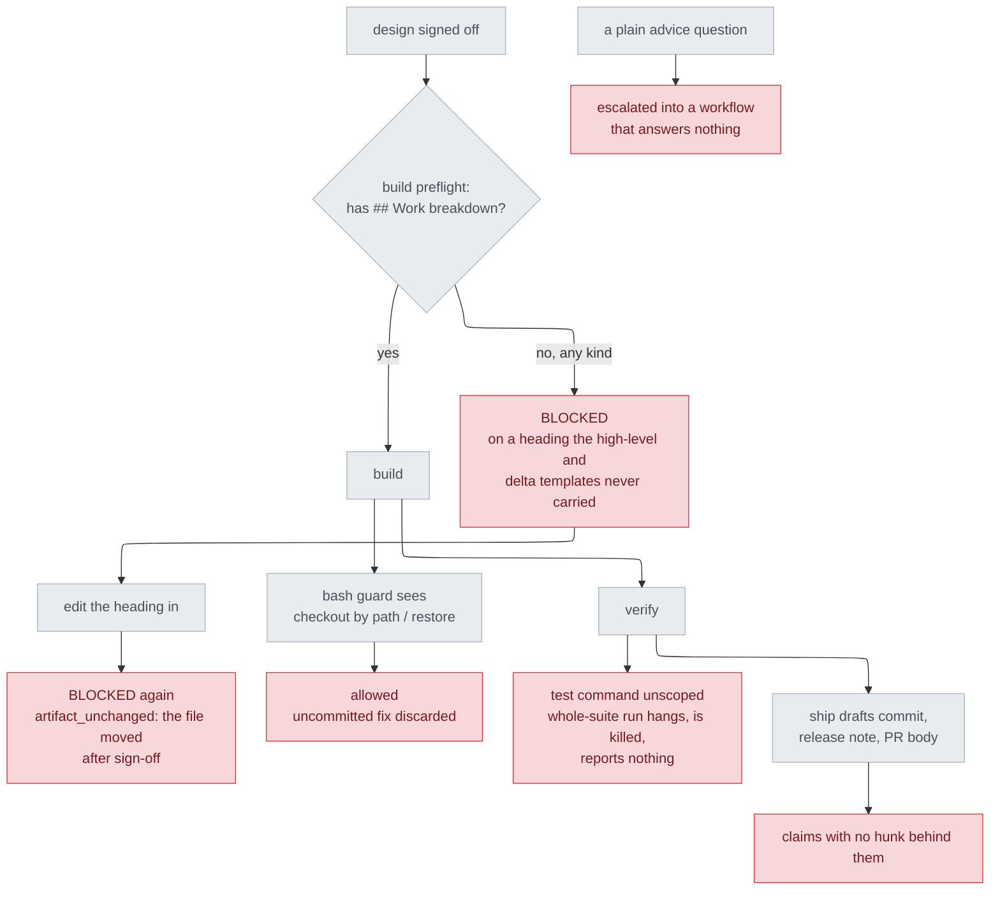
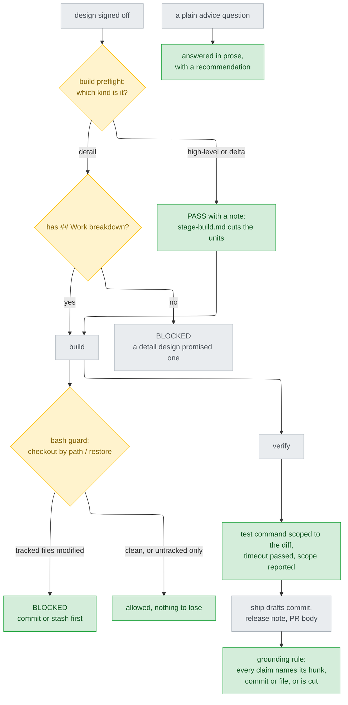

# Gate and rule corrections — delta design

## Scope

Base `origin/main` at `ad235bc`, range `ad235bc..HEAD` — one commit, 13
files, this document among them. Touches `preflight.py`'s `build` gate,
`bash_guard.py`, the `verifier`/`test-runner`/`shipper` agents,
`stage-ship.md`, and two files under `rules/`.

The range is named by base and `HEAD`, never by the head commit's own sha.
This document lives inside that commit, so any sha written here stops
resolving the moment the commit is amended or squashed — and `stage-ship.md`
squashes the branch by design. The base is stable; the head is not.

## Problem

The plugin's checkpoints had drifted out of agreement with the stages behind
them, in both directions, and nothing in the repo recorded either drift.

In one direction a gate refused work it could not damage. `build`'s
preflight demanded a `## Work breakdown` heading of whatever document the
design row named, but only a detail design ever promises a schedule — the
heading is in `design_probe.py`'s `DETAIL_HEADINGS` and no other kind's
list, and neither the high-level nor the delta template carries it. A track
that signed off on either was therefore unbuildable, and the one repair
available, editing the heading in, landed after sign-off and tripped
`artifact_unchanged` on the next run. The stage behind the gate had no such
requirement: `stage-build.md:14` cuts the units itself when no work
breakdown exists, and `goal/SKILL.md` routes the same document to its
whole-document lane. The gate was stricter than the thing it guarded.

In the other direction three failures had no checkpoint at all. The bash
guard covered `reset --hard` and `clean -f` but nothing that reaches the
same files by path, so a breach test or a plain "undo that" could discard
uncommitted work — including a fix that had just been written to be
verified. Nothing constrained the scope of a test command, so the run that
hangs is reachable by default and, once killed, reports nothing. And
`stage-ship.md` produced prose about a diff — commit message, release note,
PR body — with no rule that its claims be traceable to that diff, which is
exactly the shape a plausible but invented sentence survives in.

Two always-on rules were missing for the same reason: an advice question
could be escalated into an interactive workflow that answered nothing, and
nothing forbade putting bare option codes in front of a reader.

## Before / After

## Decisions

| Decision | Why | Evidence |
|---|---|---|
| Narrow the gate to detail designs rather than add `## Work breakdown` to the other two templates | A high-level design deliberately stops before implementation detail, and a delta is written after the change; neither can honestly carry a schedule, so adding the heading would make both templates lie to pass a gate | `plugins/cai/skills/track/references/stage-design.md:115` |
| Keep detail designs blocked, even though `design_probe` already enforces the heading at design time | Existing behaviour for the only kind that ever legitimately reached the check. Loosening it as well would be a change nothing asked for | `plugins/cai/scripts/design_probe.py:48` |
| Gate the discard rules on the tree's state instead of blocking outright, unlike every other rule in `BLOCKED` | The file's own stated position: a guard that blocks ordinary work is a guard that gets switched off, and on a clean tree these two commands discard nothing | `plugins/cai/scripts/bash_guard.py:117` |
| `--untracked-files=no` as the dirty predicate | Neither `git checkout -- <paths>` nor `git restore` can touch an untracked file, so counting one as dirty would block both in every repo carrying build output. Found by self-review after the first version used bare `--porcelain`; the validate case for it was written at the same time | `plugins/cai/scripts/bash_guard.py:145` |
| Put the prose-first rule in `epistemics.md`, not `option-explainer.md` | `option-explainer.md` sits exactly on `validate.py`'s 45-line ceiling, so nothing can be added to it. The rule is also about whether to stop and ask, which is `epistemics.md`'s subject; `option-explainer.md` only governs layout once that is settled | `scripts/validate.py:246` |
| Extend the bare-code ban by rewriting `option-explainer.md`'s existing gloss line rather than adding one | Same ceiling. Rewriting keeps the file at 45 lines and puts the ban where the rule it belongs to already lives | `plugins/cai/rules/option-explainer.md:11` |
| Write ship's grounding rule as a shared section near the top, not a numbered step | Mirrors `stage-verify.md`'s own "The evidence rule", which sits in the same position and which the ship stage had no equivalent of. Two steps reference it rather than repeating it | `plugins/cai/skills/track/references/stage-verify.md:13` |
| Say what the scoped test command must contain instead of shipping a chunked test-runner script | A runner script has to know this project's layout, and the plugin ships to repos it has never seen. `stage-build.md` already decides a per-unit `Verify with` command, so the missing half was a constraint on the agents, not a tool | `plugins/cai/skills/track/references/stage-build.md:72` |

## Impact

| What it touches | The assumption | What breaks if it is wrong |
|---|---|---|
| Any track whose design row names a `-high-level.md` or `-delta.md` document | Those tracks want the whole-document build lane, which is what `stage-build.md` and `goal/SKILL.md` already do for a document with no schedule | A track that genuinely needed a unit-by-unit schedule now reaches `build` without one and gets units cut by judgement instead of read from a table. The stage says which it did, so this is visible rather than silent |
| Every Bash and PowerShell call in a session with the plugin installed | `git status --porcelain --untracked-files=no` answers in well under the guard's 5-second timeout, and only for commands that already matched a discard pattern | A very large repo could add latency to `git checkout`/`git restore` calls specifically. A git that does not answer fails open, so the worst case is the guard not firing, not the session stalling |
| The session's working directory versus where a command actually runs | The guard reads the tree state from the session cwd, the same limitation the branch check already carries | `cd sub && git checkout -- .` is judged against the parent repo. Pre-existing behaviour for the branch rule; the deny message names the directory it used |
| `verifier` and `test-runner` output | A scope can be derived from the diff when none is given | An agent given no scope on a change touching nothing recognisable reports that instead of running, which is a stall rather than a wrong answer |
| Every session that loads `rules/` | `epistemics.md` at 26 lines and `option-explainer.md` at 45 stay under the ceiling `validate.py` enforces | A later addition to either file fails `validate.py` rather than silently growing the always-on budget |

## Limits

Four of the five changes are instructions, not mechanisms: the test-scoping
rule, the ship grounding rule, and both `rules/` additions are prose a model
can ignore, and nothing in the repo detects when it does. Only the two
program-layer changes — the `build` gate and the guard — are enforced, and
they are the two with tests. Making the ship grounding rule mechanical
would mean a claims ledger with executable probes; that was considered and
deliberately left undone, on the grounds that one stage's worth of evidence
should come first.

Also left undone: the `grep.exe` false-negative problem, which belongs in
the per-machine `CLAUDE.md` that `/cai:setup` writes rather than in a rule
shipped to every user, and a cross-track parallel execution layer, which
contradicts `model-selection.md`'s cap of 2–3 parallel subagents and so
needs that decision revisited first rather than being added underneath it.

The guard's discard rules match text, so a `git checkout -- .` written
inside an `echo` is blocked on a dirty tree. That is the same false positive
every other rule in the file already has, and is accepted for the same
reason.
