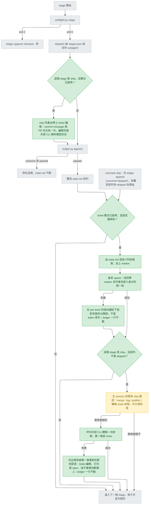
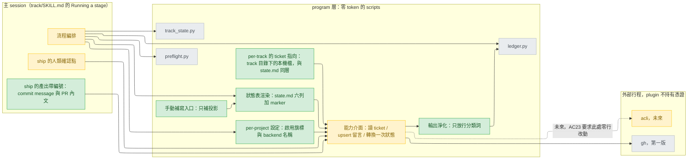

# ticket-integration — high-level design

## Status

approved 2026-08-31

## Use cases / Issues

三個需求（`R1`–`R3`）沿用 intake 產物第 1 節的編號，不重新定義；`UC1`–`UC8`
是本設計要交付的使用情境，每一條都指得回 intake 第 4 節的 AC。

- R1 — 需求要有書面來源：`stage-verify.md:44` 的 conformance lens 明文要拿 the plan, spec, issue 比對，而 `stage-verify.md:47-50` 說沒有書面需求就 say so and review the other two，等於直接放棄這個 lens。成功的判準是 AC19。
- R2 — 團隊看得到進度：`state.md` 與 `ledger.jsonl` 都被 `./.gitignore:11` 排除，是本機私有檔，團隊裡沒有第二個人看得到。成功的判準是 AC10、AC11。
- R3 — 交付物指得回需求：ship 產出的 commit 與 PR 今天不帶 ticket 編號。成功的判準是 AC20。
- UC1 — 未啟用時，六個 stage 的行為與今天逐字相同：無設定檔的環境下，六份 preflight stdout 與改動前逐位元組相同，`validate.py` 與 `pytest` 全綠。判準 AC1–AC4。
- UC2 — 啟用且可達時，ticket 內文成為 intake 的書面需求來源，並在 verify 抵達 conformance lens 的 dispatch prompt。判準 AC19。
- UC3 — 每個 passed 的 stage 與每次 skip 之後，ticket 上「同一則」留言被就地覆寫成六列狀態表（含 skipped 與理由）。判準 AC6、AC10–AC15。
- UC4 — ship 時，由主 session 取得使用者確認後，才對 ticket 發起一次狀態轉換；使用者說不，留言照常更新、轉換不發生。判準 AC16–AC18。
- UC5 — ticket 讀不到、寫不進去、或外部 CLI 根本不在 PATH 上時，track 照常走完，且不消耗任何重試額度。判準 AC5a、AC5b、AC7、AC12。
- UC6 — plugin 全程不持有憑證，外部 CLI 的輸出不會原封落進 append-only 的紀錄。判準 AC8、AC9。
- UC7 — 一條 track 從頭到尾每次回寫都失敗時，使用者有一個明確的手動補寫入口，且該入口不是任何純讀指令。判準：補寫成功後 ticket 上仍恰為一則帶 marker 的留言（AC10 的延伸）。
- UC8 — 設定 per-project 且進版控，A 專案開啟、B 專案關閉互不影響；換第二個 backend 的假實作時，preflight 與 track 流程零行改動。判準 AC21、AC23。

## Feasibility

除註明「主 session 實測」者外，每一列的 Evidence 都是本次撰稿時親自開啟過的
`file:line`。GitHub 這一側的往返能力（C3、C5、C30、C31）在 2026-08-30 於一個拋棄式
issue（`https://github.com/millerlai/claude-all-in-one/issues/47`，測完已關閉）上跑
過完整讀寫往返，草稿當時的兩個 UNVERIFIED 因此關閉。Jira 那四列仍只有 Atlassian 官
方文件、沒有任何一次本機執行，維持 `UNVERIFIED`，第一版不讓任何結論壓在上面。

| Id | Capability | Verdict | Evidence |
|---|---|---|---|
| C1 | 本機有可用且已登入的 `gh`，憑證由 `gh` 自己保管（keyring），plugin 不持有 | verified | 主 session 實測 `gh auth status`：gh 2.91.0、帳號 `millerlai`、token 存於 keyring；`gh` 早已是既有假設而非新相依，見 `plugins/cai/skills/git/SKILL.md:17` |
| C2 | 讀一則 GitHub issue 的欄位（`gh issue view <n> --json <fields>`），因此一個編號能被解析回一則存在的 ticket | verified | 主 session 讀 `gh issue view --help` 並於 https://github.com/millerlai/claude-all-in-one/issues/47 實測；`gh` 已在既有工具面內，`plugins/cai/agents/shipper.md:7` 的 tools 行含 `Bash(gh:*)` |
| C3 | 列出一則 issue 既有留言，並拿到每則的 id、作者與 body | verified | 主 session 於 https://github.com/millerlai/claude-all-in-one/issues/47 實測 `gh issue view <n> --json comments`：每則回傳 `id`、`author.login`、`body`、`url` 四個欄位，實測輸出含 `{"author":"millerlai","id":"IC_kwDOSxA3Cc8AAAABRjw0GQ","marker":true}` |
| C4 | 「編輯登入身分的最後一則留言」與「編輯帶 marker 的那則」是兩件不同的事，`--edit-last` 只做得到前者 | verified | 主 session 讀 `gh issue comment --help`，並在 https://github.com/millerlai/claude-all-in-one/issues/47 貼第二則不帶 marker 的留言後實測：marker find-back 選到 `#issuecomment-5473317913`（我方那則），而 `.comments[-1]` 是 `#issuecomment-5473321675`（後來那則）——兩者不同；同一 issue 可被兩條 track 指到，見 `plugins/cai/scripts/preflight.py:276-277` |
| C5 | 在 GitHub 上依 comment id 就地更新指定的那一則留言 | verified | 主 session 實測 `gh api --method PATCH repos/OWNER/REPO/issues/comments/<numeric id> -f body=...`：回傳 `updated_at: 2026-08-31T03:27:14Z`，更新後 `comments \| length` 仍為 1 且 body 已變更，證實是就地覆寫而非 append，見 https://github.com/millerlai/claude-all-in-one/issues/47 |
| C6 | 關閉一則 GitHub issue（`gh issue close <n>`，可附 `--comment`） | verified | 主 session 讀 `gh issue close --help`；落點是既有的第二個人類 gate，見 `plugins/cai/skills/track/SKILL.md:93-94` |
| C7 | GitHub Issues 只有 open / closed 兩態，因此一條 track 只需要轉換一次 | verified | 主 session 查證；本設計據此只在 ship 轉換一次，落在 `plugins/cai/skills/track/SKILL.md:89-94` 既有 gate 涵蓋範圍內 |
| C8 | Atlassian 有官方 CLI `acli` | UNVERIFIED | 官方文件 https://developer.atlassian.com/cloud/acli/guides/introduction/ ，本機未安裝、未執行 |
| C9 | `acli jira auth login --web` 以瀏覽器 OAuth 登入（另有 `--token`，本設計不採用） | UNVERIFIED | 官方文件 https://developer.atlassian.com/cloud/acli/reference/commands/jira-auth-login/ ，本機未執行 |
| C10 | Jira 可列出留言（`comment list --key <K> --json`）並依 id 更新（`comment update --key <K> --id <id> --body <text>`） | UNVERIFIED | 官方文件 https://developer.atlassian.com/cloud/acli/reference/commands/jira-workitem-comment/ ，本機未執行 |
| C11 | Jira 可轉換狀態（`acli jira workitem transition --key <K> --status "Done"`） | UNVERIFIED | 官方文件 https://developer.atlassian.com/cloud/acli/reference/commands/jira-workitem/ ，本機未執行 |
| C12 | 一次 GitHub 讀取往返約 0.5 秒，而 preflight 目前是毫秒級 | verified | 主 session 三次實測 `gh issue view 46 --json number,title`：494 / 551 / 584 ms，同一條 track 的 `preflight.py design` 為 79 ms；preflight 自述 zero-token 見 `plugins/cai/scripts/preflight.py:2-8` |
| C13 | preflight 已有「報告但永不擋」的既有 probe 形狀，可以照抄 | verified | `plugins/cai/scripts/preflight.py:176-186`（ledger_intact，註解寫 a corrupt ledger is loud and harmless）與 `plugins/cai/scripts/preflight.py:286-307`（track_ignored，Not a gate） |
| C14 | preflight 的 FAIL 會被記成 `blocked`，而 `blocked` 計入重試上限，五次即鎖死該 stage | verified | `plugins/cai/scripts/ledger.py:50` 的 `COUNTS_AS_RETRY` 含 `blocked`；上限與三條解法見 `plugins/cai/scripts/preflight.py:147-173` |
| C15 | ledger 已有「對外寫入失敗但流程照常完成」的既有欄位前例 | verified | `plugins/cai/scripts/ledger.py:265-267`：`synced: false` 加 `sync_error`，長度再由 `plugins/cai/scripts/ledger.py:274-291` 收斂 |
| C16 | ledger 是 append-only，且同一次 append 也寫進跨專案集中總帳 | verified | `plugins/cai/scripts/ledger.py:6` 寫 appended, never edited；集中總帳路徑見 `plugins/cai/scripts/usage_collector.py:52-56` |
| C17 | 只有 passed 路徑會動 `state.md`；skip 會先 append 再覆寫該列為 skipped 加理由 | verified | `plugins/cai/skills/track/SKILL.md:68` 與 `plugins/cai/skills/track/SKILL.md:107-113` |
| C18 | 「恰兩個人類 gate，never more」是一條寫死的絕對句 | verified | `plugins/cai/skills/track/SKILL.md:87-99` |
| C19 | `track/SKILL.md` body 只剩 1 行餘量，且該檔的設計意圖是路由而非實作 | verified | 上限與量法見 `scripts/validate.py:1341-1346`（判定式為 `track_lines <= 120`，故 120 合法），意圖見 `scripts/validate.py:1338-1339` 的註解 routes rather than implements, so it is read start to finish every time；主 session 實測 body 為 119 行 |
| C20 | always-on description 預算只剩 17 字元頭寸 | verified | `scripts/validate.py:215` 的 ceiling 5468 與 `scripts/validate.py:222-225` 的計算，主 session 實測總量 5451；計入範圍是 agents 與 skills 的 frontmatter description，不含 scripts |
| C21 | `.claude/track/` 不進版控，但 `.claude/settings.json` 進版控 | verified | `./.gitignore:11` 與 `./.gitignore:2-4` |
| C22 | plugin script 讀得到專案內的檔案（既有 `--project-dir` 解析慣例） | verified | `plugins/cai/scripts/preflight.py:38-46` 的 `resolve()` 與 `plugins/cai/scripts/preflight.py:200` 以 project_dir 為第一 base 的既有呼叫 |
| C23 | `.claude/settings.json` 是否容忍 cai 自訂鍵而不被改寫 | UNVERIFIED | 全 repo 沒有任何 plugin script 讀它（本次 Grep 對 `plugins/cai` 搜 `settings.json` 無 match），目前內容只有 hooks，見 `.claude/settings.json:2-14` |
| C24 | 同時最多 5 條 active track，因此兩條 track 指向同一 issue 在程式上可能 | verified | `plugins/cai/scripts/preflight.py:276-277` |
| C25 | `/cai:track status` 是純讀指令，不得因此產生外部副作用 | verified | `plugins/cai/scripts/track_state.py:6` 明說 It never writes state.md |
| C26 | ledger 拒寫時兩個檔案都不動，該路徑不可能產生孤兒 | verified | `plugins/cai/scripts/ledger.py:230-231`，拒寫條件見 `plugins/cai/scripts/ledger.py:236-238` |
| C27 | 沒有書面需求時 conformance lens 會被整個放棄 | verified | `plugins/cai/skills/track/references/stage-verify.md:44` 與 `plugins/cai/skills/track/references/stage-verify.md:47-50` |
| C28 | 被 dispatch 的 subagent 沒有互動工具，取得不了使用者授權 | verified | `plugins/cai/agents/shipper.md:7` 的 tools 行只有 Read 與兩個 Bash 前綴；同類不一致見 `plugins/cai/agents/designer.md:8` 的 tools 不含 AskUserQuestion，而同檔 `plugins/cai/agents/designer.md:6-7` 的 description 卻要求 stops for AskUserQuestion |
| C29 | preflight 的回傳通道只有 exit code 與 stdout，承載不了一次問答 | verified | `plugins/cai/scripts/preflight.py:2` 自述 Zero-token stage gate，`plugins/cai/scripts/preflight.py:10` 的 Exit 只有 0/2/1 三種 |
| C30 | 列留言拿到的 id 與更新留言要用的 id 不是同一個：前者是 GraphQL node id（`IC_...`），後者是數字 id，只能從留言 `url` 的 `#issuecomment-<n>` 尾段解析 | verified | 主 session 於 https://github.com/millerlai/claude-all-in-one/issues/47 實測：`--json comments` 回傳 `id: IC_kwDOSxA3Cc8AAAABRjw0GQ`，而 PATCH 成功用的是同一則 `url` 末端的 `5473317913` |
| C31 | 由 Python subprocess（不經 shell）呼叫 `gh api` 時 endpoint 不受路徑改寫影響；Git Bash 下則必須省略 endpoint 開頭的斜線 | verified | 主 session 實測：Git Bash 下 `/repos/...` 被 MSYS 改寫成 `C:/Program Files/Git/repos/...` 而失敗，省略開頭斜線即正常；既有呼叫外部行程的方式不經 shell，見 `plugins/cai/scripts/preflight.py:212-220` 的 `subprocess.run(["git", *args])` |
| C32 | `state.md` 受檢查的是列數而非欄數，且兩個讀者都以位置索引取欄並對過短的列有防護——因此在**尾端**加一欄相容，在中間插一欄會讓既有欄位錯位 | verified | 只數列見 `plugins/cai/scripts/track_state.py:66-73` 與 `plugins/cai/scripts/track_state.py:121-126`；位置索引與長度防護見 `plugins/cai/scripts/track_state.py:82-83` 的 `row[1]`/`row[3]`、`plugins/cai/scripts/preflight.py:89` 的 `row[2]`、`plugins/cai/scripts/preflight.py:314` 的 `row[1]` |

## High-level design

### 一句話的形狀

在既有六個 stage 之外加一層**單向投影**：`state.md` 是真相，ticket 上的一則留言
是它對外的鏡像。鏡像壞掉不影響真相——這條原則同時決定了觸發點（在 `state.md`
被覆寫之後）、失敗處置（記錄但不擋）、與自癒方式（每次都覆寫整張表）。

五個外部互動點，只有這五個：

1. **讀**（intake）：把 ticket 內文取進來，成為 R1 要的書面需求來源。
2. **投影**（每個 passed stage 與每次 skip 之後）：把 `state.md` 的六列渲染成一張
   表，覆寫 ticket 上帶 marker 的那則留言。
3. **引用**（ship）：把 ticket 編號寫進 squash 後的 commit message 與 PR 內文各一
   次，這是 R3／AC20 唯一的實現點。編號**必須先被解析回一則存在的 ticket**（C2）
   才寫得出去：`plugins/cai/skills/track/references/stage-ship.md:11-29` 的 grounding
   rule 規定 ship 寫出的每一個事實主張都得指得回它的來源，一個湊出來的號碼正是那條
   規則要擋的東西。這一點沒有可選項——intake 的 D1 已經把 R3 拍板，因此它不佔一個
   Decision，但它是流程上的一步，不是一句期待。
4. **轉換**（ship，且僅在使用者當面同意之後）：對 ticket 發起一次狀態轉換。
5. **補寫**（使用者手動）：投影從頭到尾沒有成功過時的收尾入口。

四個必須寫進實作的約束，來源都在 Feasibility：

- **讀寫都不得產生 FAIL。** preflight 一個 FAIL 就是一次 `blocked`，而 `blocked`
  計入重試上限（C14），五次網路抖動就能把使用者鎖在自己的 track 外面。
- **投影不得早於 ledger。** ledger 有可能拒寫，而拒寫時兩個檔都不動（C26）；在它成
  功之前對外寫入，就是製造「ticket 有、ledger 沒有」的孤兒。
- **外部 CLI 的輸出不得原封進 ledger。** ledger 是 append-only 且同時寫進跨專案總帳
  （C16），寫錯了回不去。
- **狀態轉換失敗時印出的那則訊息，是使用者唯一會知道這件事的管道，因此它的內容是
  設計要求而不是體貼。** 至少要含三樣：ticket 編號、它仍是 open、以及「這不會被自動
  補上」。理由在 Decision 7——轉換失敗不提供手動補救，也沒有任何後續流程會再提起
  它，所以少印一樣，使用者就少知道一樣。

### 主流程

灰色是今天已經存在的步驟，一步都沒有被移動；綠色是新增；琥珀色是既有的 ship 確認
點，它只多列一個要授權的操作，停等點數目不變（C18）。

四個圖上看得見、但容易在實作時被抹掉的細節：

- **`REC` 與 `RECT` 都不寫 ledger，這是被迫的而不是選擇的。** 本圖初版寫的是「在該
  筆 ledger 記錄裡寫下回寫失敗欄位」，detail design 階段證明那做不到：
  `plugins/cai/scripts/ledger.py:270` 的 `_write_line()` 在 `append()` return 之前
  就把該行寫進磁碟，而本圖的順序是 `L`(append) → `ST` → `REN`/`UP`——投影在那之後
  才發生，那一筆已經定案且 `ledger.py:6` 說 appended, never edited。唯一能讓欄位落
  在同一筆上的辦法是把投影移到 `append()` 之前，而那正好違反下一節第二條約束（投影
  不得早於 ledger，依據 `ledger.py:230-231`）。兩者不能同時成立，所以失敗紀錄落在
  per-track 的指向檔，`ledger.py` 一行不改。
- `UP` 與 `TR` 的失敗都往下走，沒有回頭箭頭——這就是 UC5：外部系統的狀態進不了
  track 的成敗判定。但兩者被接住的方式不同，所以是 `REC` 與 `RECT` 兩個節點而不是
  一個：投影失敗還會被下一次投影補上，轉換失敗不會（見 Decision 7）。把 `TR` 的
  失敗接回 `REC` 會在圖上造出一條經過 `SHIPQ` 的假迴圈，那條路實際上不存在。
- `SHIPQ` 問的是「是 ship **且該列不是 skipped**」。少了後半句，`/cai:track skip
  ship --reason "這條不發布"` 會走到確認點，回頭問使用者要不要關閉 ticket——而他剛
  說了這條不發布。
- `SK` 是既有行為，不是新增的：`SKILL.md:107-113` 規定 skip 先 append 再覆寫該列，
  兩步都在，圖上一併畫出來才與其他路徑同一標準。

`UP` 這個節點在 GitHub 這一側實際上是三步而不是一步：列留言、比對 marker 與作者、
再依 id 就地更新。中間那一步不能省，`--edit-last` 的語意是「我的最後一則」而不是
「帶 marker 的那則」，實測已證實兩者會指向不同的留言（C4）。

### 元件

`CFG` 與 `PTR` 是兩個元件而不是一個，因為它們的作用域不同：「有沒有開、用哪個
backend」對整個專案成立，「指向哪一則 ticket」對一條 track 成立。同時最多 5 條
active track（C24），把指向放進共用的那個檔，兩條 track 就會投影到同一則 ticket 上。

`CITE` 畫在主 session 而不是 program 層：編號要寫進 commit message 與 PR 內文，而
那兩份文字是 ship 產出的散文；`CAP` 在這條邊上只負責一件事——確認那個編號解析得回
一則存在的 ticket（C2）。

`SAN` 夾在 `CAP` 與 `LG` 之間、而不是掛在 `LG` 內部，是刻意的：`ledger.py` 已經是
append-only 紀錄的守門人（C16），把外部字串的判斷責任推進去，等於讓它替一個它不
認識的來源背書。淨化在來源端做，`ledger.py` 收到的就只有封閉集合裡的詞。

`FIX` 指向 `REN` 而不是指向 `CAP`，是為了讓補寫走的是與正常路徑同一條渲染邏輯——
兩條路徑各自渲染，就會有兩種留言格式。它只補投影，不補狀態轉換（Decision 7）。

`CAP` 到 `GH` 這條邊不經過 shell（C31）。這不只是實作偏好：Git Bash 會把 `gh api`
的 endpoint 當成路徑改寫，而既有呼叫外部行程的方式本來就是直接給 argv。

## Architecture decisions

十項全部已裁決：Decision 1、2 於 2026-08-30 由使用者當面拍板，Decision 10 與
Decision 7 的涵蓋範圍於 2026-08-31 拍板（訪談跨過午夜），Decision 3 到 9 使用者採納
撰稿者的推薦。Decision 10 是 plan-review 第一輪指出「ticket 指向的作用域
放錯」之後才從 Decision 5 拆出來的。每個 `**Chosen**` 欄記錄裁決結果與理由；被否決
的選項留在表上，是為了讓「為什麼不是那條」不必在 detail design 重新問一次。

### Decision 1 — 新流程步驟與確認點寫在哪裡

`SKILL.md` 只剩 1 行餘量（C19），而確認點只能落在主 session（C28、C29），主 session
讀的正是 `SKILL.md`。這兩件事直接對撞。

| Option | Rests on | Costs | Fails when |
|---|---|---|---|
| A **(recommended)** 用掉最後 1 行：`SKILL.md` 只加一句指向新的 `references/` 檔（該目錄無行數上限），詳細步驟全部寫在那裡 | C19, C18, C28, C29 | `SKILL.md` 變成 120/120 滿載，下一個要動它的功能沒有餘量；讀者多一次跳轉 | 那一句沒有明確指示由主 session 自己讀那份 reference——若被當成 stage 的 reference 交給 subagent 讀，確認點就又回到沒有互動工具的那一層 |
| B 縮寫既有措辭換出行數，維持 119 行 | C19, C18 | 要動既有規則的措辭 | 壓縮既有句子時損及既有規則的精確度——那是拿一條運作中的規則換一條新規則 |
| C 完全不動 `SKILL.md`，把投影塞進下一個 stage 的 preflight（既有 step 1 已經會呼叫它） | C29, C19, C13 | preflight 從純判定變成有外部副作用；違反它自己的自述 | ship 之後沒有下一個 stage，最後一列永遠投影不出去；且確認無論如何仍需要主 session，這條路根本承載不了 Decision 6 |
| D 調高 `validate.py` 的 120 行上限 | C19, C18 | 推翻一條刻意設下的限制；`SKILL.md` 每次都整份被讀，加長它是對每個 session 課稅 | 上限一旦鬆動就沒有回頭的力道，下一個功能同樣理由再要一次 |

**Chosen:** A，使用者裁決。決定性的理由不是省行數，而是 `scripts/validate.py:1338-1339`
的註解已經寫明這個檔案的設計意圖：`track/SKILL.md routes rather than implements, so
it is read start to finish every time someone reaches for it`。一句指向正是「路由」，
它與這個意圖同向，而 B 的縮寫、D 的放寬都是逆著它走。判定式是 `track_lines <= 120`
（`scripts/validate.py:1346`），因此 119→120 合法。代價已記入 `## Open questions`：
之後任何新增都會撞破。

### Decision 2 — 留言「就地覆寫」的機制

草稿階段這一項卡在兩個未實測能力上。2026-08-30 在拋棄式 issue 上跑完整往返後，C3
（列得出留言的 id、作者、body）與 C5（依數字 id 就地 PATCH，留言數不變）都關閉了，
`--edit-last` 會編錯對象也從推論變成實測（C4）。

| Option | Rests on | Costs | Fails when |
|---|---|---|---|
| A 直接用 `gh issue comment --edit-last --create-if-none` | C4, C1, C17 | 零額外呼叫；但語意是「我的最後一則」，不是「帶 marker 的那則」 | 已實測會發生：貼一則不帶 marker 的留言之後，`--edit-last` 的目標就與我方那則分岔，AC10、AC14、AC15 三條同時破 |
| B **(recommended)** marker find-back：列出留言，比對 marker 加作者，有就依 id 就地更新、沒有就新增 | C3, C5, C30, C31, C26, C24 | 每次投影多一次讀取往返；實作要多做一次 id 轉換，且呼叫 `gh` 不能經過 shell | ticket 平台不提供「列出留言並依 id 更新」這組能力——GitHub 已證實提供，Jira 依文件也提供 |
| C 混合：先 find-back 確認「帶 marker 的那則正好是登入身分的最後一則」，成立才用 `--edit-last`；不成立就當作回寫失敗，等下一次自癒 | C3, C4, C15, C24, C1 | 共用 issue 或使用者插話之後，投影可能長期停滯在舊狀態 | AC15 要求兩條 track 各自有一則留言，本選項在該情境下兩條都寫不進去 |

**Chosen:** B，使用者裁決。它是 GitHub 與 Jira 唯一都成立的機制（Jira 那側是 C10，
仍只有文件），也是 AC13（刪掉本機 track 目錄後仍找得回同一則）唯一的實現方式。實作
必須知道的兩件事，都是這次實測撞出來的：

- **兩個 id 不是同一個東西（C30）。** 列留言拿到的是 GraphQL node id（`IC_...`），
  就地更新要的是數字 id，只能從該則留言 `url` 尾端的 `#issuecomment-<n>` 解析。把
  node id 直接餵給更新端點是這條路上最容易犯的錯。
- **不要經過 shell（C31）。** Git Bash 會把以斜線開頭的 endpoint 當成路徑改寫掉；
  直接給 argv 的呼叫方式不受影響，而那正是這個 repo 既有的做法。任何寫進文件的
  Bash 範例都要省略 endpoint 開頭的斜線，否則照抄的人一定會踩到。

### Decision 3 — ticket 的讀取發生在哪裡，要不要快取

讀一次要 0.5 秒，preflight 現在是 79 毫秒（C12）。

| Option | Rests on | Costs | Fails when |
|---|---|---|---|
| A **(recommended)** 只在 intake 讀一次，內容落進 intake 的產物文件；verify 從產物取用，不再往返 | C2, C12, C27, C14 | intake 之後 ticket 內文若被改動，track 看不到；產物文件變大 | intake 被 skip 掉時沒有產物可讀——這條路徑必須另有 fallback，否則 R1 在最需要它的時候失效 |
| B 每個 stage 的 preflight 都讀一次，做成「報告但永不擋」的 probe | C13, C12, C14 | 六個 stage 各多約 0.5 秒，preflight 整體慢約 7 倍；preflight 從此對網路有相依 | 離線或 ticket 不可達時，每個 stage 都要等一次逾時——最痛的正是最需要它安靜的時候 |
| C intake 與 verify 各讀一次，不快取 | C2, C27, C12 | verify 多一次往返；不可達時 verify 手上沒有需求可比 | verify 執行當下 ticket 不可達，conformance lens 因此被放棄——而 intake 明明成功讀到過 |

**Chosen:** A，使用者採納推薦，**外加一條 fallback**。A 讓 preflight 的延遲預算一個
位元都不動（B 的 7 倍是實測而非估計），而且把「書面需求」變成一份被 ledger 記下
sha256 的產物，比一個隨時可能變動的遠端字串更符合 R1 想要的東西。

fallback 是必要的，因為 `SKILL.md:107-113` 允許 skip 掉任何一個 stage，包含 intake
（需求已在別處談定時很自然就會這麼做），此時沒有產物可讀。兩條路裡選**「verify 自己
讀一次」**而不是「退回今天的行為」：後者等於在 R1 唯一想防的那個情境——沒有書面需求
所以整個 conformance lens 被放棄（C27）——正好把功能關掉。代價是一次 0.5 秒的往返
（C12），而且只發生在「啟用了整合、又 skip 掉 intake」這條路徑上，不影響其他五個
stage，也不進 preflight。這一次仍讀不到時，才退回今天的行為，並照 `stage-verify.md:49-50`
明說沒有書面需求——那是誠實的降級，不是靜默的。

### Decision 4 — Jira 在第一版佔多少位置

D2 已拍板「能力層抽象、第一版只實作 GitHub」。這裡要決定的是**介面形狀要不要現在就
承接 Jira 的已知差異**——而 Jira 那四項能力全部只有文件、沒有實測。

| Option | Rests on | Costs | Fails when |
|---|---|---|---|
| A 介面只定義三個語意能力（讀 ticket、upsert 留言、轉換一次狀態），第一版只實作 GitHub，Jira 僅以本機假實作檢驗介面形狀 | C8, C9, C10, C11, C1, C6 | 多一層抽象與一份假實作；抽象是照著四項未實測的文件畫的 | 文件與 `acli` 實際行為不符，介面切在錯的地方——但屆時要改的是一層薄殼，不是整條流程 |
| B 第一版同時實作 GitHub 與 Jira | C8, C9, C10, C11 | 工期翻倍；四項未實測能力全部同時承重 | 任何一項文件與現實不符，第一版就交不出來 |
| C 不做介面，直接寫死 `gh` | C1, C6 | 最省；但 AC23 直接不成立，第二個 backend 要重寫流程 | 使用者哪天真的要 Jira——這正是 D2 已經否決的情境 |

**Chosen:** A，使用者確認第一版不讓 C8–C11 承重。這條約束要寫死在驗收上：假實作是
純本機的、不呼叫任何外部程式，因此 A 在第一版的可交付性完全不依賴那四項是否為真。
本節刻意不標任何一列為推薦——A 引用了四項未驗證能力，標了就是讓一個沒查過的假設
安靜地變成架構。

### Decision 5 — 設定放在哪裡、哪些東西進得去

D5 已拍板 per-project 且進版控。剩下的是落點，以及**哪些東西真的是 per-project**。

| Option | Rests on | Costs | Fails when |
|---|---|---|---|
| A **(recommended)** repo 內一個 cai 專屬的、進版控的設定檔，內容只有兩樣：是否啟用、backend 名稱 | C21, C22 | 多一個檔案要說明與維護；ticket 指向得另外找地方放（Decision 10） | 使用者期待所有設定集中在一處——多一個檔就是多一個要記得的地方 |
| B 塞進既有的 `.claude/settings.json` | C23, C21, C22 | 零新增檔案；但那是 Claude Code 自己的 schema | 未知鍵不被容忍或被改寫時，設定會安靜地消失——C23 未驗證，這條無法被排除 |
| C 設定檔攜帶憑證或 token 路徑 | C1, C9 | 明確否決：登入由外部 CLI 自管，設定檔沒有任何欄位需要它 | 任何時候——AC8 會直接抓到，且設定檔進版控，等於把憑證推進 git 歷史 |
| D 三樣一起放：是否啟用、backend 名稱、**ticket 指向** | C24, C21, C22 | 表面上最省，只有一個檔要讀 | 開第二條 track 的當下——同時最多 5 條 active track（C24），共用同一個編號會讓兩條 track 投影到同一則 ticket；要避開就得每開一條 track 改檔並 commit，把個人的工作狀態推進團隊的 git 歷史 |

**Chosen:** A，使用者採納推薦，不賭 `.claude/settings.json`。B 的唯一好處是少一個
檔，代價卻是壓在一項未驗證的容忍性上（C23），而失敗模式是「安靜地消失」，是最難察
覺的那種。C 留在表上，是為了讓「設定檔不含憑證」成為寫下來的約束。D 是草稿原本的
形狀，被 plan-review 抓出來：作用域錯了——「有沒有開」是專案的性質，「指向哪一則」
是一條 track 的性質，兩者放同一個檔就是拿專案層的檔案去存 track 層的值。ticket 指向
移到 Decision 10。

### Decision 6 — ship 的狀態轉換要不要與既有確認合併成一次提問

| Option | Rests on | Costs | Fails when |
|---|---|---|---|
| A **(recommended)** 併進既有的 ship 確認，一次提問列出所有將執行的不可逆操作，含關閉 ticket | C6, C7, C18, C28 | 需要讓使用者能分項同意，否則只能全有或全無 | 使用者想 merge 但不想關 ticket，而提問沒有給分項的餘地 |
| B 獨立一次提問 | C18, C28 | 授權粒度最清楚；但實際停等次數變成三次 | AC17 直接不成立——即使文件上仍寫「兩個 gate」，使用者感受到的是第三次打斷 |
| C 第一版不轉換狀態，只更新留言 | C7 | 最省，且完全避開授權問題 | D4 已拍板要主動轉——這個選項等於推翻它 |

**Chosen:** A，使用者採納推薦，且提問必須提供分項同意。C18 是一條寫死的絕對句，B
會讓它在使用者眼中變成假的；A 的唯一代價（粒度）用一個多選的提問就補得回來。

### Decision 7 — 全數失敗時的手動補寫入口，以及它涵蓋到哪裡

自癒**只涵蓋投影**：每次投影都是整張表覆寫，任何一次成功就補齊先前所有遺漏。它不
涵蓋狀態轉換——轉換一條 track 只發生一次，而且發生在 ship，之後沒有下一個 stage 會
再跑一次（C7）。所以缺口有兩個形狀：投影從頭到尾沒有成功過，以及轉換那一次失敗了。

| Option | Rests on | Costs | Fails when |
|---|---|---|---|
| A **(recommended)** 一支獨立的、由使用者具名執行的 script，只補投影，不新增任何會被自動觸發的 description | C20, C25, C19 | 使用者要知道它存在——得靠投影失敗時的訊息把它印出來 | 訊息沒印好，使用者根本不知道有這個入口，缺口等於沒補 |
| B 新增一個 `/cai:track` 子指令 | C19, C20 | 要在只剩 1 行餘量的 `SKILL.md` 裡再擠一個子指令，並與 Decision 1 爭同一行 | 與 Decision 1 的 A 直接搶同一份預算，兩個都要就一定有一個擠不進去 |
| C 掛在 `/cai:track status` | C25 | 零新增介面 | 任何時候——`track_state.py:6` 明說它永不寫入，讓純讀指令產生外部副作用會破壞這個性質 |
| D 同一個入口同時補投影與狀態轉換 | C6, C7, C18, C28 | 補轉換是不可逆外部操作，仍要照 Decision 6 問人，於是這個入口從純投影變成帶授權 | 這個設計裡授權路徑只有一條是刻意的；多一條就多一個地方要保證「確認真的問了人」，而使用者手上的替代方案只是去 ticket 上按一次按鈕 |

**Chosen:** A，使用者採納推薦；D 由使用者裁決否掉——**狀態轉換失敗是盡力而為，不
提供手動補救**。理由是成本不對稱：手動補救那一邊，使用者要做的是在 ticket 上按一次
按鈕；而「要」那一邊，得為此新增第二條不可逆操作的授權路徑，多一個地方要保證確認
真的問了人。C 被 C25 直接判掉；B 與 Decision 1 搶同一行預算，而 Decision 1 的裁決
已經把那一行用掉了，B 現在連空間都不存在。A 完全不進 always-on description 的計入
範圍（C20 的計算只涵蓋 agents 與 skills 的 frontmatter），因此對那 17 字元的頭寸零
消耗。

這個裁決是**有條件的**，條件已升格成 `## High-level design` 的第四條約束：轉換失敗
時印出的那則訊息必須含 ticket 編號、它仍是 open、以及「這不會被自動補上」。

順帶一個 detail design 必須知道的耦合：選項 A 的 `Fails when`（訊息沒印好，使用者
就不知道有這個入口）現在不只影響那個入口。轉換失敗既然不補救，那則訊息就是使用者
唯一會知道的管道，於是**同一個弱點同時決定兩件事**——手動補寫入口的可發現性，以及
一則沒關掉的 ticket 會不會被發現。這些訊息不是輔助輸出，它們是這兩條路的唯一介面，
設計時要照介面的標準對待。

### Decision 8 — 外部 CLI 輸出的淨化規則

| Option | Rests on | Costs | Fails when |
|---|---|---|---|
| A **(recommended)** 白名單：只有我方產生的封閉集合分類詞會被記下，外部 CLI 的 stderr 一律不進任何持久紀錄，只印在主 session 畫面上 | C16, C15, C1 | 失敗原因的細節不會被記下，事後查問題要靠當下的畫面 | 某一類失敗沒有任何分類詞表達得了，白名單就連排錯所需的方向都吃掉了 |
| B 黑名單：把 stderr 收進 ledger，但先用樣式遮蔽疑似憑證的片段，再套既有截斷 | C15, C16 | 遮罩是一份列舉，要持續維護 | 出現沒列舉到的樣式——而 ledger 不可回頭修改（C16），寫進去就永遠在那裡，且已同步到跨專案總帳 |

**Chosen:** A，使用者採納推薦。B 的失敗是不可逆的（C16），A 的失敗只是「少了一行事
後資訊」。AC9 用隨機字串測遮罩，B 會通過那個測試卻仍在未列舉的樣式上失守——一個會
通過測試的錯誤答案，比一個明顯的限制更危險。

白名單能不能成立，取決於類別夠不夠用，所以類別本身屬於這個決策而不是 detail：
**認證失敗／找不到該 ticket／權限不足／網路或 CLI 不可達／其他（不可分類）**。前四
類各自對應一個使用者做得出的下一步（重新登入、改指向、換帳號或請人授權、稍後重
試），最後一類是誠實的兜底——它存在，正是為了讓 AC9 測得出「沒有任何 stderr 原文
落地」，同時不假裝每一種失敗都已經被想過。確切字串與各類的判定方式留給 detail。

**分類詞的落點是 per-track 的指向檔，不是 ledger**——理由見主流程圖下方第一條註記，
`ledger.py` 因此一行不改。C15 在這裡仍被引用，但它的角色是**形狀的前例**（對外寫入
失敗而流程照常完成，`ledger.py:265-267` 的 `synced`/`sync_error`）而不是落點的依據。

主 session 於 2026-08-31 實測了 `gh` 四種失敗的 stderr 字樣，供 detail 寫判定表：
`HTTP 401: Bad credentials`（認證失敗）、`Could not resolve to an issue or pull
request`（找不到該 ticket）、`Could not resolve to a Repository`（repo 不存在）、
`error connecting to <host>`（不可達）。**「權限不足」這一類在 GitHub 的讀取路徑上
測不出來**：對無權限的 repo，GitHub 回的是 `Could not resolve` 而非 403，刻意不洩漏
存在性，所以該類只可能出現在寫入路徑。另外，認證失敗的訊息本身就含 URL
（`https://api.github.com/graphql`），這是「stderr 不得原封落地」不只是理論擔憂的實證。

### Decision 9 — marker 的可見形式

intake 已拍板 marker 在留言 body 內、必須含 feature 名稱，且比對條件是「body 含
marker」**且**「作者是目前登入身分」。剩下的是它長什麼樣。

| Option | Rests on | Costs | Fails when |
|---|---|---|---|
| A **(recommended)** 一行可見的標題行，含 feature 名稱，放在留言最前面 | C24, C21, C4 | 留言頂端多一行可見文字 | 使用者覺得那行醜——但它同時也是人類辨認「這則是誰的」的依據 |
| B 隱藏式標記（依賴 ticket 平台把某種語法渲染成不可見） | C24, C4 | 零可見雜訊 | 平台的渲染行為未經查證，而且兩個 backend 的渲染規則不必然相同；一旦渲染出來就是一段沒人看得懂的雜訊 |

**Chosen:** A，使用者採納推薦。B 需要一項沒人查證過的渲染行為，換來的只是美觀；A 對
兩個 backend 都只需要「body 是我們能控制的純文字」這一個前提。marker 含 feature 名
稱不是選項而是必要條件——兩條 track 指同一 issue 在程式上可能（C24），不含 feature
名就會互相覆寫；實測時 marker 比對也正是靠這一行把我方留言與後來的留言分開（C4）。

### Decision 10 — per-track 的 ticket 指向存在哪裡

Decision 5 把「指向哪一則 ticket」從 per-project 設定檔移出來之後，它需要一個新的
落點。背景兩句：`.claude/track/` 整個被 git 忽略（C21），所以放在那裡的東西換一台
機器就不存在；而 `state.md` 的列數受檢查、欄數不受檢查，尾端加欄相容、中間插欄會
錯位（C32）。

| Option | Rests on | Costs | Fails when |
|---|---|---|---|
| A **(recommended)** track 目錄下一個本機小檔，與 `state.md` 同層 | C21, C24, C22 | 多一個檔；換機器或 `/cai:track done` 之後就沒了 | 使用者換機器繼續同一條 track——指向要重新給一次。AC13 的情境本來就假設使用者會重新指定，所以這是可承受的，但它是真的會發生 |
| B `state.md` 尾端加一欄放 ticket 指向 | C32, C21, C24 | 不新增檔案；但一個 per-track 的值會在六列裡重複六次，且六列可能不一致 | 有人為了美觀把新欄插在中間——`row[1]`/`row[3]` 是位置索引（C32），既有欄位當場錯位。這個錯不會在寫入時報錯，只會讓 status 印出錯的東西 |
| C per-project 設定檔裡一張以 feature 名為 key 的對照表 | C21, C22, C24 | 換機器仍在，AC13 免費成立；但每開一條 track 就要改檔並 commit | 團隊共用這個 repo——每個人的 track 指向都會出現在別人的 diff 裡，而那是個人的工作狀態，不是專案的設定 |

**Chosen:** A，使用者裁決。決定性的依據不是省事，而是 `./.gitignore:8-11` 的註解本
來就替這個位置定了性：`Local working state for whoever is driving a track, not
something to share`。一條 track 指向哪一則 ticket 正是這種東西，放進去與既有判斷同
向；而 C 等於推翻它——它把個人的工作狀態寫進團隊共用、進版控的檔案。B 被判掉的理由
與偏好無關：它是三者中唯一有**安靜失敗模式**的，把新欄插在中間不會在寫入時報錯，
只會讓 `row[1]`/`row[3]` 錯位、讓 status 印出錯的東西（C32）。A 的代價（換機器要重
給一次編號）已被接受，AC13 的測試情境本來就假設使用者會重新指定。

## Open questions

十項架構選擇全部已裁決（2026-08-30 至 08-31），結果記在 `## Architecture decisions` 各小節的
`**Chosen**` 欄。這一節留下五項必須被下一個人看見的東西：兩項是裁決本身帶著的條件
與代價，三項是隨裁決一起接受的遺留代價。每一項都帶著它的答案。

- **per-track 的 ticket 指向存在哪裡（Decision 10）→ 答案：track 目錄下的本機檔，與 `state.md` 同層。** 依據是 `./.gitignore:8-11` 的註解已經把那個目錄定性為 `Local working state ... not something to share`。隨之接受的代價：換一台機器或 `/cai:track done` 之後指向就不在了，使用者要重新給一次編號——AC13 的測試情境本來就是這樣假設的。
- **狀態轉換失敗要不要能手動補救 → 答案：不補救，ticket 狀態是盡力而為。** 依據是成本不對稱：使用者那邊只是去 ticket 上按一次按鈕，而「要」得新增第二條不可逆操作的授權路徑。**這個答案帶一個條件，已寫進 `## High-level design` 的第四條約束**：轉換失敗時那則訊息必須含 ticket 編號、它仍是 open、以及「這不會被自動補上」——沒有任何後續流程會再提起這件事，那則訊息是使用者唯一的管道。
- **`SKILL.md` 行數自此滿載（Decision 1 的代價，已接受）。** 裁決把最後 1 行用掉，body 從 119 變成 120，判定式是 `scripts/validate.py:1346` 的 `track_lines <= 120`，所以現在剛好合法、之後任何新增都會撞破。下一個要動 `SKILL.md` 的功能得先自己決定縮寫既有措辭或提高上限——這一項留給那個功能，不阻擋本設計。
- **Jira 的四項能力仍未實測（C8–C11，已接受）。** Decision 4 的裁決是第一版不讓它們承重：假實作純本機、不呼叫外部程式。真的要做 Jira 時，這四項必須先各跑一次，才輪得到介面形狀的討論。
- **`.claude/settings.json` 是否容忍自訂鍵（C23，已繞開）。** Decision 5 選了獨立設定檔，所以本設計不再需要這個答案；留在這裡是因為它仍未被關閉，未來若有人想把設定併回去，得先補這一次驗證。

## Out of scope

- **Jira 的實作。** 第一版只有 GitHub Issues。C8–C11 全部未實測，任何以它們為前提的工期或介面承諾都不在本設計的保證範圍內。
- **第三個人類 gate，以及把 `SKILL.md:87-99` 改寫成「任何對外部系統的不可逆操作」的措辭（intake §3.1 的選項 iii）。** GitHub 只有兩態（C7），第一版的轉換只發生在 ship，落在既有 gate 內；現在改一條絕對規則卻無人受益是純成本，且 `SKILL.md` 在 Decision 1 之後已無餘量（C19）。推遲到真的要做 Jira 時。
- **第七個 stage。** D6 已拍板維持六個；加一列會讓 `done/` 底下既有 track 的 status 直接失敗。
- **自動對帳。** D7 已拍板：ticket 與 `state.md` 不一致時只顯示，不自動改任何一邊。
- **強制使用者走 SSO。** 架構上能保證的是 plugin 不持有憑證（C1），不是使用者用了哪種登入方式；後者不可斷言，因此刻意不寫成驗收標準（intake §3.5-1）。
- **一條 track 對多則 ticket、或一則 ticket 對多條 track 的合併視圖。** 兩條 track 指同一 issue 只保證彼此不覆寫（各自一則帶自己 feature 名的留言），不提供彙整。
- **把 ticket 編號回填進已經合併的 commit 或已經開好的 PR。** 第三個互動點只在 ship 產出那一次寫入；漏了就是漏了，改寫已推送的歷史不在本設計範圍內。
- **狀態轉換失敗後的自動或手動補救（Decision 7 的 D）。** 裁決是盡力而為；使用者自己去 ticket 上關閉，流程不再提起。
- **實作層的細節**——設定檔名與鍵名、marker 的確切字串、狀態表的欄位順序、ledger 新欄位的名稱、淨化分類詞的確切字串與判定方式、node id 到數字 id 的解析寫在哪個函式、模組切分與函式簽名，全部留給 detail design 的 `## Naming` 與 `## Implementation spec`。
