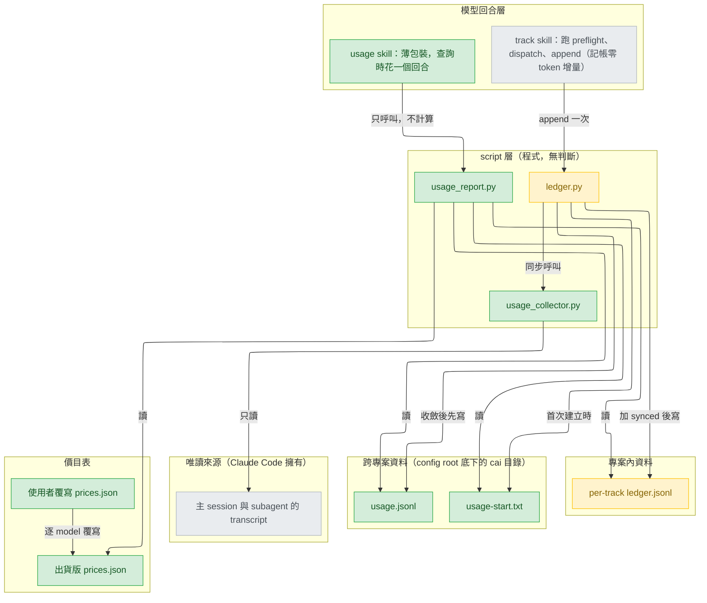
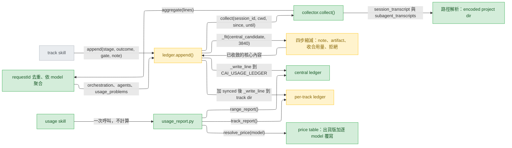
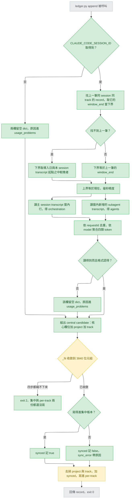
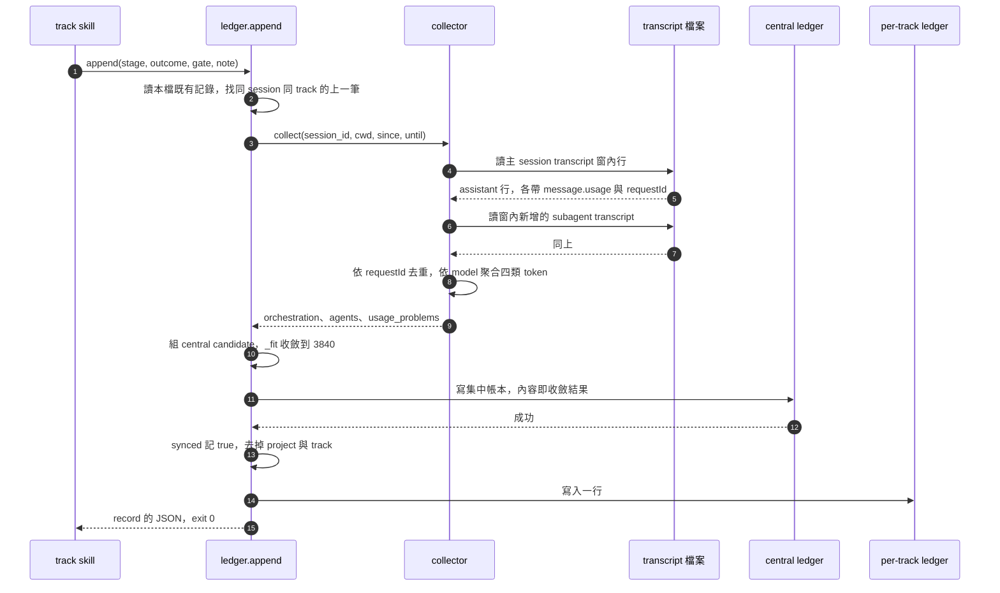
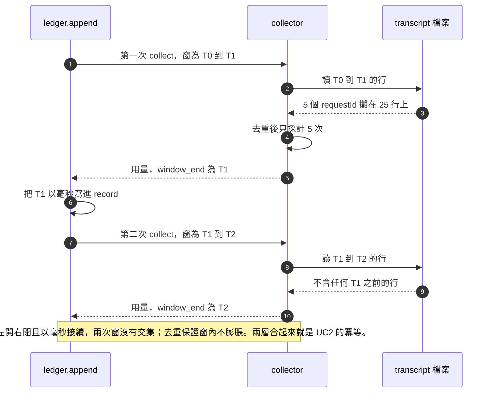
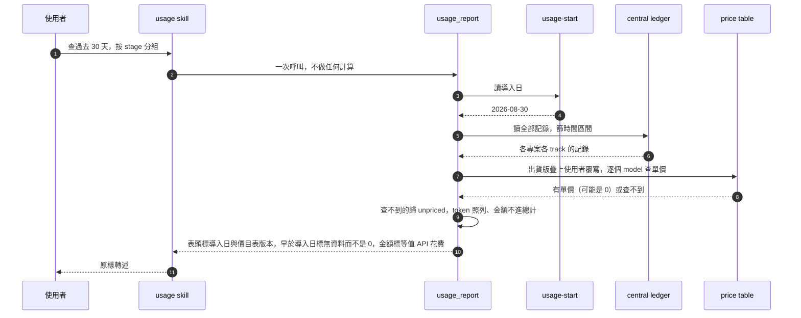
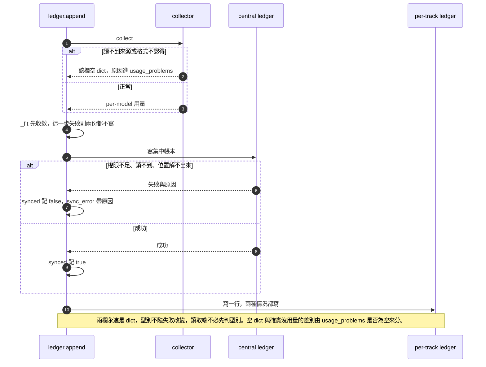

# track usage accounting — detail design

## Reference

High Level Design doc: docs/design/2026-08-29-track-usage-accounting-high-level.md
Status: approved 2026-08-30

### Traceability

| From the high-level design | Satisfied by | Status |
|---|---|---|
| UC1 per-model 四類 token | collector 的 `aggregate()`；record 的 `orchestration` 與 `agents` 兩欄；Sequence — UC1 | covered |
| UC2 重跑逐字相同 | `aggregate()` 的 requestId 去重 + D4 的毫秒窗界（窗不重疊）；Sequence — UC2 | covered |
| UC3 單 track 每 stage 與總計 | report 的 `track_report()`；per-track ledger 為唯一來源 | covered |
| UC4 跨專案 7/30/60 天按 stage 分組 | report 的 `range_report()`；集中帳本；Sequence — UC4 | covered |
| UC5 GAP-02 四問 | `range_report()` 的四個欄位：stage、model 數、未定價金額、嘗試次數（後者由既有 `records()` 數 `plugins/cai/scripts/ledger.py:210`） | covered |
| UC6 金額標示等值 API 花費 | report 的表頭常數；D9 | covered |
| UC7 unpriced 不得當 0 | `resolve_price()` 回 `None` 即 unpriced，與單價 0 是兩種結果（D12）；Sequence — UC4 的最後一步 | covered |
| UC8 資料起始日 | `~/.claude/cai/usage-start.txt`；`range_report()` 的表頭與「無資料」列；D10 | covered |
| UC9 集中帳本帶 project 與 track，per-track 仍自足 | 集中記錄多 `project` 與 `track` 兩個欄位；per-track 記錄不引用集中檔；D6 | covered |
| R1 記不成帳一律留痕 | 讀不到 → 該欄為空 dict、原因進 `usage_problems`；寫不進集中帳本 → `synced` 為 false 加 `sync_error`（D6 的寫入順序讓這個標記寫得出來）；Sequence — R1 | covered |
| R2 零 token 成本 | 記帳全部在 `ledger.py append` 這一次既有呼叫內完成，不新增模型回合、不註冊 hook。`/cai:usage` 是查詢入口不是記帳路徑，見 D13 | covered |
| R3 不回填 | collector 的窗下界永不早於導入日標記；Rollout 的「既有資料」段 | covered |
| R4 Windows 與 POSIX、ASCII、無 BOM | 不新增 `.cmd`；新檔皆為 `.py`、`.json` 與一個 `SKILL.md`；`scripts/validate.py:500-503` 與 `scripts/validate.py:510-522` 仍是閘門 | covered |
| R5 集中帳本並發安全 | 沿用 `ledger._write_line()` 的 byte-0 lock（`plugins/cai/scripts/ledger.py:136-166`），且集中記錄與 per-track 記錄寫的是同一份已收斂內容，兩份都在單次原子寫入的尺寸內（D7）；Verification 的併發測試靠 `CAI_USAGE_LEDGER` 把路徑傳給子程序（D14） | covered |

## Requirement

`plugins/cai/scripts/ledger.py:122-124` 的 record 有七個欄位，全部在講「發生了什麼」，沒有一個在講「花了多少」。因此四個問題目前無解：這次嘗試是哪些 model 花的、花了多少 token、多少換算成錢、以及跨專案跨時間的總量。

本設計在**不新增任何模型回合**的前提下補上前三個答案：`ledger.py append` 這一步 track 每次收尾本來就會跑（`plugins/cai/skills/track/SKILL.md:62-66`），記帳掛在它身上，同時把同一筆寫一份到跨專案的集中帳本。查詢由 `/cai:usage` 這個薄包裝 skill 提供，把 token 換算成「等值 API 花費」。

做完的判準是上面 Traceability 表的 14 列，加上 `## Verification` 表逐條的 Green before。

## Glossary

| Term | Definition | Where it lives |
|---|---|---|
| record | ledger 的一行，一次 stage 嘗試的完整紀錄，本設計為它增加用量欄位 | plugins/cai/scripts/ledger.py:122 |
| window | 一次記帳涵蓋的時間區間，左開右閉，下界是同一 session 同一 track 上一筆 record 的 `window_end`，上界是這次記帳的當下 | concept |
| `window_end` | 寫進 record 的毫秒精度時間點，等於該次記帳窗的上界，供下一次記帳當下界用 | new — plugins/cai/scripts/ledger.py |
| `orchestration` | 用量的第一欄，來自主 session 自己那份 transcript 的窗內行。永遠是 dict | new — plugins/cai/scripts/ledger.py |
| `agents` | 用量的第二欄，來自窗內新增的 subagent transcript。永遠是 dict | new — plugins/cai/scripts/ledger.py |
| `usage_problems` | 兄弟欄位，帶取數失敗的原因清單，每一則指名是哪一欄出的問題。空 list 代表兩欄都讀得乾淨 | new — plugins/cai/scripts/ledger.py |
| collector | 讀 transcript、去重、依 model 聚合的新模組，被 `ledger.append()` 同步呼叫 | new — plugins/cai/scripts/usage_collector.py |
| aggregate | collector 的核心函式：吃 transcript 行，吐 per-model 的四類 token 加總 | new — plugins/cai/scripts/usage_collector.py |
| requestId dedup | 同一個 `requestId` 的多行只採計一次，實測不做會膨脹到 5 倍且不報錯 | docs/design/2026-08-29-track-usage-accounting-high-level.md:38 |
| encoded project dir | `~/.claude/projects/` 底下的目錄名，工作目錄路徑把非英數字元換成 `-` | concept |
| config root | 集中資料的根，`CLAUDE_CONFIG_DIR` 有值就用它，沒有就用 `~/.claude` | new — plugins/cai/scripts/usage_collector.py |
| central ledger | 跨專案的單一 append-only JSONL，每筆是 per-track record 的已收斂內容加上 `project` 與 `track` | new — ~/.claude/cai/usage.jsonl |
| central candidate | 送進 `_fit` 收斂的那份物件：核心欄位加 `project` 加 `track`，是兩份寫入裡較大的一份，所以拿它當收斂對象 | concept |
| `synced` 與 `sync_error` | per-track record 上的一對欄位，記「這一筆有沒有成功寫進集中帳本」與失敗原因，在 `_fit` 之後才加上 | new — plugins/cai/scripts/ledger.py |
| `usage_collapsed` | 標記：這一筆的 per-model 明細被 `_fit` 第三步收合成總和了 | new — plugins/cai/scripts/ledger.py |
| data start date | 集中帳本第一次建立時寫下的日期，之後不變；報表用它區分「無資料」與 0 | new — ~/.claude/cai/usage-start.txt |
| price table | model 識別字到四類 token 單價的對照資料檔，只在查詢端讀 | new — plugins/cai/prices.json |
| price override | 使用者放在 config root 的價目表，逐 model 覆寫出貨版（D12） | new — ~/.claude/cai/prices.json |
| unpriced | 查詢端的分類：這個 model 在價目表裡**查不到**單價，其 token 照列、金額不計入總計。與「單價是 0」是兩件事 | concept |
| equivalent API spend | 報表金額的口徑：token 乘以價目表單價，訂閱制下不等於實付 | concept |
| report | 讀 per-track ledger、集中帳本與價目表，產出三種查詢輸出的新模組 | new — plugins/cai/scripts/usage_report.py |
| usage skill | 查詢入口 `/cai:usage`，薄包裝：只負責叫 script 與轉述輸出，不做任何計算（D13） | new — plugins/cai/skills/usage/SKILL.md |
| `CAI_USAGE_LEDGER` | 環境變數，覆寫集中帳本的檔案路徑；導入日標記取它的同目錄兄弟檔（D14） | new — plugins/cai/scripts/usage_collector.py |
| `_fit` | 把 record 縮到指定位元組數以內的既有函式，本設計為它加一個收合用量的步驟與一個上限參數 | plugins/cai/scripts/ledger.py:169 |
| show | 既有的人可讀輸出，欄寬固定，本設計以續行方式擴充而不動原本那一行 | plugins/cai/scripts/ledger.py:280 |
| streak | 某 stage 自最後一筆 passed 或 skipped 之後的所有紀錄 | plugins/cai/scripts/ledger.py:240 |
| deviation | 實作偏離本設計時要記的格式，沿用既有定義不另發明 | plugins/cai/skills/track/references/stage-build.md:183 |

## Budgets

| What | Number | Where it comes from |
|---|---|---|
| 單筆 record 編碼後硬上限（位元組） | 4096 | `plugins/cai/scripts/ledger.py:49` 的 `MAX_RECORD`，不改 |
| note 寫入前的預切上限（位元組） | 3840 | `plugins/cai/scripts/ledger.py:50` 的 `MAX_NOTE`，不改（理由見 D5） |
| sync marker 的保留額度（位元組） | 256 | 本文件計算：`synced` 加最長 200 位元組的 `sync_error`，取整留餘裕。它在 `_fit` 之後才加進 per-track 記錄，所以必須先扣起來 |
| `_fit` 的收斂目標（位元組） | 3840 | 4096 減 256。**與上面 `MAX_NOTE` 同為 3840 是巧合**：一個是 note 的預切，一個是整筆記錄的收斂目標，兩者無關 |
| `sync_error` 字串上限（位元組） | 200 | 本文件決定。這個字串由本設計自己產生，可截，不像 note 是別人寫的 |
| `project` 與 `track` 兩欄在本 repo 的實際大小（位元組） | 72 | 本文件計算：`project` 欄 43（JSON 轉義後的 `D:\project\claude-all-in-one`）加 `track` 欄 29（`gap02-usage-ledger`）。深層路徑下這個數字會大很多，後果見 D7 |
| `window_end` 與 `session_id` 兩個新欄位（位元組） | 96 | 本文件計算：毫秒 ISO 時間字串加鍵約 46，session 識別加鍵約 50 |
| 一個 track 的 stage 數 | 6 | `plugins/cai/skills/track/stages.json:2` 的列數 |
| 同時活躍的 track 數上限 | 5 | `plugins/cai/skills/track/SKILL.md:36` |
| 同一 stage 的重試上限（預設） | 5 | `plugins/cai/scripts/preflight.py:30` 的 `DEFAULT_MAX_ATTEMPTS` |
| 2026-08-29 觀察到的相異 model 數 | 7 | 主 session 2026-08-29 實測（M8）。**這是某一天的觀察值，不是上限**——Anthropic 每出一個新版就多一個識別字，這個數字只會成長 |
| 一個 model 在 record 裡佔的位元組（單欄，最長 model 名 25 字元加四個六位數 token 欄位） | 105 | 本文件計算：鍵 28 加值物件 76 加分隔逗號 1，算式見下 |
| 一個 model 兩欄佔的位元組（最壞情況） | 294 | 主 session 2026-08-30 實測。以今天最長的 25 字元識別字計算；**識別字長度本身也是觀察值**，若出現更長的識別字，294 會變大、收合門檻會再往下 |
| 兩欄用量的位元組，實測，今天實際的識別字組合（長短混合） | 1588 | 主 session 2026-08-30 對 `ledger._encode()` 實測，7 個 model 兩欄。除以 7 得每個 model 227 位元組，但那是**今天混合長度的平均，不可當最壞情況用** |
| 兩欄用量的位元組，實測，全部用最長識別字（最壞情況） | 2060 | 主 session 2026-08-30 實測。凡是要表達最壞情況的地方都用這個數字 |
| N2a 選定的長鍵，7 個 model 兩欄的位元組 | 2043 | 主 session 2026-08-30 實測，鍵名為 `input_tokens` 等四個來源欄位名 |
| N2a 未選的短鍵，同樣條件的位元組 | 1483 | 主 session 2026-08-30 實測。短鍵的收合門檻是 17 個 model、note 預算約 1916——長鍵的代價就是少 5 個 model 的餘裕，換到的是與來源逐字相同、對帳不需對照層 |
| 用量進來後 note 還剩的位元組（7 個 model、全為最長識別字） | 1356 | 3840 減 256（sync 保留）減 2060（兩欄用量，最壞）減 96（`window_end` 與 `session_id`）減 72（`project` 與 `track`）。**以今天實際的 1588 計算則為 1828**，兩個數字都留著才看得出差距從哪來 |
| 本 repo 既有 15 筆 ledger 記錄中 note 超過 1356 的筆數 | 3 | 主 session 2026-08-30 實測，三筆分別是 1823、1484、1617 位元組。也就是五分之一的既有 note 在新格式下會被截斷——這是 D-B 的決定性證據 |
| `_fit` 收合步驟被觸發所需的相異 model 數 | 12 | 主 session 2026-08-30 對 limit=3840、note 已清空、artifact 已縮成 basename 的 central candidate 實測：10 個 model 得 3308、11 個得 3598、12 個得 3888——12 超過 3840，收合在這裡觸發 |
| 窗重複涵蓋上限，不修正時（毫秒） | 1000 | 帳本 `ts` 為秒精度（`plugins/cai/scripts/ledger.py:70`），transcript 為毫秒精度 |
| 窗重複涵蓋上限，採 D4 之後（毫秒） | 0 | 窗界以毫秒存進 record，下一個窗從同一個點接續 |
| 記帳耗時實測（毫秒） | 36 | 主 session 2026-08-30 實測：掃本 session 的主 transcript 加 4 個 subagent transcript，共 4,340,033 位元組（4.1 MB），去重後 195 個 requestId |
| 本機最大單一 transcript（MB） | 23 | 主 session 2026-08-30 實測。線性外推約 200 毫秒，仍在下面那條警戒線之內 |
| 記帳耗時警戒線（毫秒） | 500 | 實測 36 毫秒的約 14 倍餘裕。**這不是效能目標，是 tripwire**：超過它代表「每次全掃」這個架構已經不對，該改成增量讀取，而不是把這個數字調大 |
| 2026-08-29 觀察到的本專案 28 天 assistant 行數 | 8477 | 主 session 2026-08-29 實測（M8）。**觀察值，不是界**——它每天成長。單一窗必定小於「一個 session 在保留期內的行數」，而那個數字本設計沒有量到 |
| 集中帳本的修剪門檻 | 0 | 不修剪，append-only，與 per-track ledger 同一取捨 |
| 價目表初版必須解析的 model 識別字數 | 7 | 主 session 2026-08-29 實測（M8）的七個值，含三個別名與一個 `<synthetic>`。同樣是觀察值，價目表要能長 |

**105 的算式。** 最長的實測 model 識別字是 `claude-haiku-4-5-20251001`，25 字元；加上引號與冒號是 28 位元組。值物件 `{"input":999999,"output":999999,"cache_creation":999999,"cache_read":999999}` 是 76 位元組。兩者加一個分隔逗號等於 105。這是**單欄**的數字；兩欄合計的實測最壞值是每個 model 294。

**`_fit` 今天不會拒絕任何東西，這是量出來的。** 主 session 2026-08-30 直接對 `ledger._fit()` 餵資料實測，四個結果：今天的形狀（3800 位元組的 note）寫得進去、不需截斷；加上兩欄 7 個 model 的用量後**仍然寫得進去**，走的是第一個縮減步驟「截 note」；兩欄用量的實際大小是 1588 位元組（全用最長識別字則是 2060）；用最大的 note 實際跑 `append()` 成功，沒有 `LedgerError`。

要走到拒絕那一步，得讓**用量自己**吃掉整個預算——對 4096 上限實測約需 17 個相異 model，對本設計 3840 的收斂目標則是 12 個（實測階梯見上表）。所以「記錄會被拒絕、那次嘗試沒有紀錄、`attempts()` 少算」在今天的數字下**不會發生**，那是一個必須誠實劃掉的假設。

**今天真正會發生的是另一件事。** 導入之後，人寫的 note 會比以前**提早 1588 到 2060 位元組**被截斷，因為用量佔走了那段預算。既有 15 筆記錄裡已經有 3 筆會踩到。這是實測到的行為改變，處置見 D5 末段。

## Design decisions

**D1 — collector 是獨立模組，`ledger.py` 匯入它。** `plugins/cai/scripts/ledger.py:14-19` 立下「這個檔不匯入本 repo 任何東西」的規則，理由寫得很清楚：`track_state → preflight → ledger` 已經是一條鏈，任何一條回指的邊都會成環。新模組是這條鏈的葉子，只被 `ledger` 匯入、自己什麼都不匯入，不成環。條件是那段 docstring 要跟著更新，否則下一個讀者會以為慣例被隨手破壞。

**D2 — 用量不能經由 CLI 傳入。** `tests/test_ledger.py:189-195` 把 `--ts`、`--sha256`、`--attempt` 釘成 usage error，對應的原則是「除了 note 以外沒有一個欄位由模型提供」。用量是可重現的計算，若開一個用量旗標，模型就能寫任何數字進帳本，整份帳本立刻失去它存在的理由。所以 `append()` 自己呼叫 collector。

**D3 — 拿不到 session id 就記空 dict 加原因，而不是不記。** `CLAUDE_CODE_SESSION_ID` 是未記載的行為（高階設計 C21）。取不到時 `orchestration` 與 `agents` 都是空 dict、`usage_problems` 帶原因，`append()` 照常寫記錄。這同時讓既有測試維持可預期：測試環境沒有這個變數，所以每筆都是空 dict 加原因，沒有測試需要造 transcript 就能通過。

**D4 — 窗界以毫秒另存 `window_end`，`ts` 一個字元都不動。** 高階設計留下的秒與毫秒落差有三種解法：把 `ts` 改成毫秒、記下已採計的 requestId、另存毫秒窗界。第一種改的是既有欄位的格式，`tests/test_ledger.py:153` 這類固定字串會跟著壞，而且 `ts` 是別人也在讀的欄位；第二種要存不定長度的 id 集合，直接撞 4096 上限。第三種只加一個定長欄位，且讓相鄰兩個窗**完全接續**：下一個窗的下界就是上一個窗的上界，不重不漏。

**D5 — `_fit` 加第三個縮減步驟：收合用量，最後才拒絕；順序維持先砍 note。** 既有的兩步（先砍 note、再簡化 artifact，`plugins/cai/scripts/ledger.py:180-204`）不動，新步驟排在它們之後：把 per-model 明細換成該欄四類 token 的總和，並寫上 `usage_collapsed`。

收合步驟**不是為今天的數字寫的**——Budgets 的實測已經說明今天的形狀根本走不到它。它為的是一件確定會發生的事：**相異 model 數沒有上限**。7 是 2026-08-29 那天的觀察值，每出一個新版就多一個識別字。

**而距離不遠。** 實測的階梯是 10 個 model 得 3308 位元組、11 個得 3598、12 個得 3888——**12 個就超過 3840 的收斂目標**。今天是 7 個。Anthropic 再出三個 model、多兩個別名就到 12。這不是為遙遠未來寫的防禦性程式碼，是**一兩年內就會踩到**的路徑。N2a 選了長鍵（與來源逐字相同）又把這個門檻從短鍵的 17 拉到 12——那是使用者為「對帳不需對照層」付的價，付得清楚。

到那時，用量自己就吃掉整個收斂預算，前兩個步驟全部失效，而那時若沒有第三步，`_fit` 就會回 `None`、`append()` 丟 `LedgerError`（`plugins/cai/scripts/ledger.py:126-128`）、CLI 回 exit 2——一次真實發生的嘗試因此沒有紀錄，`attempts()` 少算，重試上限失效。第三步存在的意義是讓那一天永遠不會到來：收合後的用量只有數十位元組，且收合過的記錄看得出來被收合過，不是 0，也不是靜默（R1）。

**為什麼先砍 note 而不是先收合用量（D-B，使用者 2026-08-30 裁決）。** 這個順序的代價是實測到的：本 repo 既有 15 筆記錄裡有 3 筆的 note 超過 1356 位元組（1823、1484、1617），也就是五分之一的既有 note 在新格式下會被截。使用者知情後仍選這個順序，理由是一個不對稱：**被截的 note 在 `state.md` 的 note 欄與當時的對話裡還有替代來源；被收合的 per-model 明細沒有——它的來源是 transcript，30 天就過期**（高階設計 C14）。截掉可以重建的東西，保住不能重建的東西。

**D6 — 順序是：`_fit` 收斂 → 寫集中 → 定 `synced` → 寫 per-track。** 這個順序由兩個約束夾出來，兩個都不能讓步。

第一個約束來自 R1：「寫不進集中帳本時，在 per-track 那一筆留下未同步標記」。ledger 是 append-only，寫出去的行改不了，所以 `synced` 的值必須在寫 per-track 那一行**之前**就知道——集中寫入因此必須排在 per-track 寫入之前。

第二個約束是尺寸：`_fit` 必須排在**兩次寫入之前**。若 `_fit` 排在集中寫入之後，一旦它回 `None`，集中帳本已經寫進去了而 per-track 沒有——孤兒就不再是罕見的 I/O 意外，而是每一次 `_fit` 拒絕的**必然**產物。把 `_fit` 提前之後，`None` 這條路上兩份都還沒寫，exit 2 之後檔案系統乾乾淨淨。

兩個約束不衝突：`_fit` 在最前面跑完，`synced` 仍然是在集中寫入之後、per-track 寫入之前才決定。剩下的孤兒只有一種來源——集中寫成功之後 per-track 寫入真的失敗（磁碟滿、權限被改），那是真正的 I/O 意外，方向也仍然可接受：per-track 是真相來源（UC9 說刪掉集中檔仍能回答 UC3），衍生資料多一筆比少一筆容易發現。

**D7 — 收斂對象是集中記錄那一份，不是 per-track 那一份。** 集中記錄是 per-track 的內容**再加** `project` 與 `track`，因此它是兩份裡較大的一份。只收斂 per-track 的形狀，等於讓集中記錄在 per-track 剛好卡在上限時必定超過上限——而 `MAX_RECORD` 存在的唯一理由就寫在 `plugins/cai/scripts/ledger.py:45-48`：「A record has to land in one write, and one write is only atomic up to a size the platform decides.」超過就不再是單次原子寫入，直接違反 R5。

所以 `_fit` 收斂的是 central candidate，目標 3840 位元組，也就是 `MAX_RECORD` 減去 sync marker 的保留額度 256。兩份寫入因此都在 4096 之內：集中那份就是收斂結果本身（3840 以內）；per-track 那份是收斂結果**去掉** `project` 與 `track`、**加上** `synced` 與 `sync_error`（最多 256），所以最壞情況是 3840 減 72 加 256 等於 4024。

**4024 這個算式的前提是收斂已經成功。** 未收斂的記錄不適用——主 session 2026-08-30 拿一個未收斂的 15-model 記錄實測得 4930 位元組，那不是反例，那種記錄本來就會先被第三步收合掉。算式描述的是 `_fit` 回傳成功之後的狀態，不是任意一份候選記錄的狀態。

兩份寫的是同一份已收斂的核心內容，所以 note 在兩邊逐字一致，不會出現「集中版被截得比較短」這種對不起來的情況。

**深層專案路徑的後果，方向與直覺相反。** `project` 欄越長，per-track 那份被**減掉**的越多，所以 per-track 反而更小：以 `project` 加 `track` 合計 300 位元組估，per-track 是 3840 減 300 加 256 等於 3796，比本 repo 的 4024 更安全。深層路徑真正的代價在另一邊——它吃掉 central candidate 的收斂預算，**讓收合更早觸發**，也就是 12 這個門檻會往下掉。所以路徑長度影響的是「什麼時候開始只剩總和」，不是「會不會超過 4096」。

集中帳本的並發安全沿用 `ledger._write_line()`：R5 的情境跟 per-track 完全一樣，而那一題已經被解過，連 Windows 上 `O_APPEND` 不原子這件事都被實測過（`plugins/cai/scripts/ledger.py:136-166`，測試在 `tests/test_ledger_concurrent.py:42`）。集中帳本被更多程序寫，只是同一個問題的更大規模，不是另一個問題。

**D8 — `show` 用續行擴充，不動既有那一行。** `plugins/cai/scripts/ledger.py:291-295` 是固定欄寬的單行輸出，把 per-model 明細塞進去會讓每一行變成幾百字元。改法是原本那一行原封不動，在它下面加縮排續行印用量。既有三個測試（`tests/test_ledger.py:229-245`、`tests/test_ledger.py:114-122`、`tests/test_cli_encoding.py:53-63`）都是子字串斷言，續行不會動到它們。

**D9 — 金額只在 report 裡出現，帳本裡沒有錢。** 高階設計 Decision 5 已裁決。實作口徑：report 每一處印金額都連著印口徑字樣，且印出它用的價目表版本（含使用者覆寫了幾筆，見 D12），否則「不同日子查給出不同金額」在使用者眼裡是無法解釋的差異。

**D10 — 導入日是寫下來的，不是推出來的。** 集中帳本第一次建立時同時寫 `~/.claude/cai/usage-start.txt`；報表讀它。用「帳本最早一筆的時間」推導在帳本為空時給不出日期，也分不出「還沒裝」與「裝了沒跑過」——而 UC8 的判準要的正是後者也顯示得出來。

**D11 — 缺欄位一律視為「沒有資料」，永不視為 0。** 既有兩條 track 的 ledger.jsonl 沒有任何用量欄位。`records()` 全程用 `.get()`（`plugins/cai/scripts/ledger.py:230-237`），讀舊記錄不會壞；report 遇到沒有用量欄的記錄，把它算進「未涵蓋」而不是加 0。這條同時服務 R3（不回填）與 UC8。

**D12 — 價目表逐 model 覆寫，不是整份取代；`<synthetic>` 是 priced 且單價為 0。** 出貨版在 `plugins/cai/prices.json`，使用者版在 `~/.claude/cai/prices.json`。合併規則是**以 model 識別字為鍵逐筆覆寫**：使用者檔裡有的識別字用使用者的單價，沒有的沿用出貨版。選這個而不是整份取代，是因為 N4 的理由（「價格變了使用者自己改不必等發版」）只有在使用者能只寫一筆時才成立；整份取代等於逼他每次發版都重抄一份完整表，而抄漏的那幾筆會靜默變成 unpriced。使用者檔不存在、讀不開、或不是物件時，一律當成沒有覆寫並在報表表頭說明，不讓一個壞掉的覆寫檔把整份價目表變成 unpriced。

`<synthetic>` 不需要第三種分類，資料自己回答了這題：主 session 2026-08-30 把所有 `<synthetic>` 記錄撈出來看，它們是 Claude Code 自己產生的通知訊息（內容形如 `Please run /login — API Error: 401`、`You've hit your session limit`），**四類 token 全部是 0**，根本不是 API 呼叫。歸 0 或歸 unpriced 的金額總計相同（0 乘任何單價都是 0），但歸 unpriced 會讓「多少 spend 未定價」混進一個定義上就是零的項目，**反而降低 AC3 的誠實度**。所以出貨版明確給它一列單價 0——它是 priced，不是 unpriced，`resolve_price()` 回一個 0 而不是 `None`。這個區別就是 UC7 的型別落點：`None` 是「不知道」，0 是「知道，而且是零」。

**D13 — `/cai:usage` 是薄包裝，計算全部留在 script 裡。** skill 只負責把使用者的問法轉成一次 script 呼叫、再把 script 印的東西轉述出來；任何加總、去重、查價、換算都不准搬進 skill 的 prose。理由有兩層：一是可測——script 的輸出進得了 pytest，skill 的輸出進不了；二是可重現——同一份帳本查兩次必須逐字相同，而模型當場算的數字做不到這件事，那正是 GAP-03 整節在講的問題（`docs/design/2026-08-29-capability-gap-analysis.md:147`）。

叫一次 `/cai:usage` 會花一個模型回合，這**不牴觸 R2**：R2 管的是「記帳不得佔用模型回合」，而記帳走的是 `ledger.py append`，與這個 skill 無關。查詢是使用者主動發起的動作，本來就在他的預期內。

**D14 — 覆寫用環境變數 `CAI_USAGE_LEDGER`，完整支援而不是測試後門。** 命名對齊既有的 `CAI_TRACK_MAX_ATTEMPTS`（`plugins/cai/scripts/preflight.py:31`）。它必須是真正支援的介面，理由是測試本身逼出來的：`## Verification` 裡 R5 那條要 spawn 8 個子程序寫同一個集中帳本（形狀照 `tests/test_ledger_concurrent.py:47-51`），R1 那條要把路徑指到不可寫的位置——**子程序吃不到 pytest 的 monkeypatch**，路徑只能靠環境變數傳進去。一個「只有測試在用」的旗標和一個「使用者也能用」的旗標在這裡是同一段程式碼，把它標成內部反而是自欺。

它指的是**集中帳本的檔案路徑**；導入日標記取同目錄的兄弟檔，這樣一個變數就把兩個檔一起搬走，不必再開第二個變數。

## Diagrams

### Architecture



### Component



### Flow



### Sequence — UC1



### Sequence — UC2

同一份來源重跑要逐字相同。這張圖畫的是「為什麼第二次不會多算」。



### Sequence — UC4



### Sequence — R1

兩條失敗路徑畫在同一張，因為它們的共通點才是重點：兩種都留痕，兩種都不寫 0。



**捨棄的 sequence 與理由。** 高階設計有 UC1–UC9 與 R1–R5 共 14 條，上限是六張，這裡畫了四張。捨棄的十條分兩類：**已被上面四張涵蓋呼叫順序的**——UC3 與 UC5 的呼叫順序與 UC4 完全相同，只差 report 讀的是 per-track 還是集中檔；UC9 是 UC1 的寫入端，順序已在 UC1 圖裡；UC6 與 UC7 是 UC4 圖最後兩步的內容，已標在該圖上。**根本沒有呼叫順序可畫的**——UC8 是報表表頭的一個欄位；R2 是「沒有新增任何一步」，畫出來會是一張空圖；R3 是窗下界的一個比較；R4 是 CI 檢查；R5 的並發行為在既有的 `tests/test_ledger_concurrent.py:42` 已有可執行的規格，圖不會比它更精確。

## Implementation spec

### usage_collector.py

- **Responsibility** — 給定一個 session 與一段時間窗，回答這段時間內主 session 與其 subagent 各用掉多少 token，依 model 分開。
- **Interface**
  ```
  collect(session_id, cwd, since, until, projects_root=None)
      -> (orchestration, agents, problems)
  session_transcript(projects_root, cwd, session_id) -> str or None
  subagent_transcripts(projects_root, cwd, session_id, since, until) -> list of str
  aggregate(line_iter) -> dict
  encoded_project_dir(cwd) -> str
  config_root() -> str
  central_ledger_path() -> str
  data_start_path() -> str
  session_id_from_env() -> str or None
  ```
  函式與參數名屬模組內部，可自由更名，不影響任何已出貨的資料格式；命名沿用本目錄既有風格（`plugins/cai/scripts/ledger.py:65-88`）。`central_ledger_path()` 讀 `CAI_USAGE_LEDGER`，沒設則回 config root 底下的 `cai/usage.jsonl`；`data_start_path()` 一律回前者的同目錄兄弟檔（D14）。
- **Data**
  - 進：`session_id` 字串；`cwd` 絕對路徑字串；`since` 與 `until` 為毫秒精度的 UTC 時間字串（`since` 可為 `None`，代表「這個 session 的第一次」）；`projects_root` 可選，僅測試會傳。
  - 出：`orchestration` 與 `agents` 皆為 `{model_id: {四個 token 鍵: int}}`，四個鍵是 `input_tokens`、`output_tokens`、`cache_creation_input_tokens`、`cache_read_input_tokens`，與 transcript 的 `message.usage` **逐字相同**（N2a），固定、缺一不可、值為非負整數。**兩者永遠是 dict**，讀不到就是空 dict，型別不隨失敗改變（N2b）；**model 數不設上限**，7 只是 2026-08-29 的觀察值。`problems` 是原因字串的 list，每一則指名是哪一欄出的問題，正常時為空 list。
  - 空 dict 與「讀不到」是兩件事，差別在 `problems` 是否為空：兩者都空代表這段時間確實沒有用量；dict 空而 `problems` 非空代表讀不到、不知道有沒有。
- **Errors** — 任何 OSError、JSON 解析錯、欄位缺失都不往外丟：轉成 `problems` 裡的一個字串，該來源當作沒有資料。目錄不存在、檔案被鎖、`message.usage` 缺欄位、`requestId` 缺席各自有可辨識的字串。這是 R1 的落點。
- **Concurrency** — 只讀，不寫，沒有共享狀態，重跑同一組參數結果相同。Claude Code 可能正在往同一份 transcript 追加，所以讀取要能容忍最後一行不完整（照 `plugins/cai/scripts/ledger.py:222-231` 既有的壞行處理方式：跳過並記進 `problems`，不拋例外）。
- **Observability** — 正常時什麼都不印。失敗時不自己印，把原因交給 `ledger.append()` 寫進記錄——這個模組沒有 stdout。
- **Where it lives** — `plugins/cai/scripts/usage_collector.py`，新檔。
- **What it reuses** — 路徑解析規則來自高階設計 C5；壞行容忍照抄 `plugins/cai/scripts/ledger.py:222-231`；UTF-8 讀取方式同 `plugins/cai/scripts/ledger.py:216-222`。

### ledger.append（既有，修改）

- **Responsibility** — 維持原職責（寫一筆嘗試紀錄），並在寫之前把這次的用量算出來、把同一份已收斂的內容送進集中帳本。
- **Interface**
  ```
  append(track_dir, stage, outcome, artifact=None, gate="auto", note="") -> dict
  ```
  簽名一個字都不變。用量與 session 由函式內部取得，不從參數進來（D2）。
- **Data** — 回傳的 dict 在既有七個鍵（`plugins/cai/scripts/ledger.py:122-124`）之外多七個：`orchestration`、`agents`、`usage_problems`、`window_end`、`session_id`、`synced`、`sync_error`；收合發生時再多一個 `usage_collapsed`。集中帳本那一份是同樣的內容**加** `project` 與 `track`、**減** `synced` 與 `sync_error`。
- **Errors** — 既有的四種 `LedgerError`（未知 outcome、未知 gate、未知 stage、artifact 讀不到）行為不變。新增的失敗全部不丟例外：collector 失敗進 `usage_problems`、集中帳本失敗進 `sync_error`。唯一新增的致命路徑是 `_fit` 四步都縮不下來——那時**兩份都還沒有寫**（D6），exit 2 之後檔案系統維持原狀。
- **Concurrency** — 對 per-track 檔的保證不變（`plugins/cai/scripts/ledger.py:136-166`）。集中帳本寫入用同一個 `_write_line()`，因此同樣安全，且 D7 保證兩份都在單次原子寫入的尺寸內。兩次寫入不是一個交易：集中寫成功之後 per-track 寫入若真的失敗（磁碟滿、權限被改），會留下孤兒；`_fit` 提前之後這是孤兒的唯一來源。
- **Observability** — stdout 仍只印那一行 record JSON（`plugins/cai/scripts/ledger.py:342`）。`_fit` 收合用量時的說明走 stderr，與既有的截斷說明同一條路（`plugins/cai/scripts/ledger.py:129-130`）。
- **Where it lives** — `plugins/cai/scripts/ledger.py`，已存在。
- **What it reuses** — `_write_line()`、`_fit()`、`_encode()`、`_now()` 全部沿用。

### `_fit`（既有，修改）

- **Responsibility** — 把一份記錄縮到指定的位元組數以內，且永遠不因為太大而讓一次真實發生的嘗試沒有紀錄。
- **Interface** — `_fit(record, limit=MAX_RECORD) -> (line_bytes or None, explanation)`。**多一個有預設值的參數**：呼叫端傳 3840，既有呼叫方式不傳則行為與今天相同。
- **Data** — 收斂對象是 central candidate（D7）。多一個縮減步驟排在既有兩步之後：per-model 明細換成該欄四類 token 的總和，並設 `usage_collapsed`。
- **Errors** — 只有第四步（收合後仍超過）才回 `None`。以 Budgets 的實測，今天的形狀連第三步都走不到；第三步在 12 個相異 model 時被觸發，深層專案路徑會讓這個門檻再往下。回 `None` 時呼叫端還沒寫任何一份檔案。
- **Concurrency** — 純函式，無狀態。
- **Observability** — 回傳的 explanation 字串多一種：說明明細被收合。
- **Where it lives** — `plugins/cai/scripts/ledger.py:169`。
- **What it reuses** — 既有的 `_cut()` 與 `TRUNCATED` 標記（`plugins/cai/scripts/ledger.py:51`、`plugins/cai/scripts/ledger.py:78-82`）。

### show（既有，修改）

- **Responsibility** — 讓人直接讀完整帳本，現在包含用量。
- **Interface** — `show(track_dir, stage=None) -> int`，簽名不變。
- **Data** — 既有那一行（`plugins/cai/scripts/ledger.py:291-295`）逐字不變；有用量的記錄在它下面加縮排續行，`orchestration` 與 `agents` 各一段，每個 model 一行。沒有用量欄的舊記錄不印續行；`usage_problems` 非空時印出來。
- **Errors** — 無新增；缺欄位一律當「沒有這一段」而不是 0（D11）。
- **Concurrency** — 只讀。
- **Observability** — 這個函式就是輸出本身。
- **Where it lives** — `plugins/cai/scripts/ledger.py:280`。
- **What it reuses** — 既有的 UTF-8 stdout 重設（`plugins/cai/scripts/ledger.py:315-316`），這是 `tests/test_cli_encoding.py:53` 在守的行為。

### usage_report.py

- **Responsibility** — 把帳本裡的 token 換算成等值 API 花費，並回答單 track、跨專案兩類查詢。
- **Interface**
  ```
  track_report(track_dir, prices) -> str
  range_report(central_path, days, prices) -> str
  load_prices(shipped_path, override_path) -> dict
  resolve_price(model_id, prices) -> dict or None
  data_start_date(path) -> str or None
  ```
- **Data**
  - `track_report`：每個 stage 一列，欄位為 stage、嘗試次數、相異 model 數、`orchestration` token、`agents` token、等值花費、未定價金額；最後一列總計。
  - `range_report`：先按 stage 分組，每組跨全部專案；表頭帶導入日、價目表版本與覆寫筆數、口徑字樣。
  - `load_prices` 逐 model 覆寫（D12），回傳的 dict 另帶版本字串與覆寫筆數供表頭用。
  - `resolve_price` 回 `None` 代表 unpriced，回一個四類單價的 dict（其中可以全是 0，例如 `<synthetic>`）代表 priced——**`None` 與 0 是兩種結果**，這個型別上的區別就是 UC7 的落點。
- **Errors** — 集中帳本不存在則印「尚未有跨專案資料」與導入日，exit 0（沒有資料不是錯誤）。出貨版價目表讀不到則全部 model 皆 unpriced 並在表頭明說；使用者覆寫檔讀不到或不是物件則忽略覆寫、表頭說明，**不讓一個壞掉的覆寫檔把整份表變成 unpriced**（D12）。查詢區間早於導入日則該段標「無資料」。遇到 `usage_collapsed` 的記錄，per-model 那一層答不出來，報表要說這一筆只有總和。
- **Concurrency** — 只讀。可能與 `ledger.append` 的寫入並行，因此讀到最後一行不完整時照 `plugins/cai/scripts/ledger.py:222-231` 的方式跳過並在輸出裡註記。
- **Observability** — 輸出即報表；stdout 需與其他三個 CLI 一樣重設為 UTF-8（`plugins/cai/scripts/ledger.py:315-316`），否則 Windows 上被管線接走時無法解碼，這是 `tests/test_cli_encoding.py:1-11` 記下的教訓。
- **Where it lives** — `plugins/cai/scripts/usage_report.py`，新檔。
- **What it reuses** — `ledger.records()` 讀 per-track（`plugins/cai/scripts/ledger.py:210`）；`ledger.stage_ids()` 取 stage 順序（`plugins/cai/scripts/ledger.py:60`）；collector 的 `central_ledger_path()` 與 `data_start_path()`。

### usage skill

- **Responsibility** — 把使用者的問法轉成一次 script 呼叫，並轉述輸出。不做任何計算（D13）。
- **Interface** — `/cai:usage [track|7|30|60]`；skill body 呼叫 `${CLAUDE_PLUGIN_ROOT}/scripts/usage_report.py`，**必須用這個變數而不是 repo 內路徑**，因為 `scripts/validate.py:531-534` 會擋掉後者（裝在 marketplace cache 的使用者跑不動）。
- **Data** — 進：使用者的自然語言問法。出：script 的 stdout，原樣轉述。
- **Errors** — script 非零退出時把 stderr 原樣轉述，不自行解釋或補算。
- **Concurrency** — 無狀態。
- **Observability** — 就是它轉述的那段輸出。
- **Where it lives** — `plugins/cai/skills/usage/SKILL.md`，新檔。frontmatter 需要 `name` 與 `description`（`scripts/validate.py:124-126`），並在 `plugins/cai/models.json` 的 `assignments` 加一列 `skills/usage/SKILL.md`，否則 `scripts/validate.py:1171-1175` 會判它 unassigned。tier 取 `chore`——它做的正是「執行一個已知指令並轉述輸出」。body **不得出現任何 model 家族名**（`scripts/validate.py:1183-1195` 會擋）。
- **What it reuses** — 其他 skill 的 frontmatter 形狀，例如 `plugins/cai/skills/track/SKILL.md:1-5`。

### price table（資料檔）

- **Responsibility** — 把 model 識別字換成四類 token 的單價，並讓「查不到」與「單價是 0」是兩種可分辨的結果。
- **Interface** — 資料檔，無函式；由 `load_prices()` 讀兩份再逐 model 合併。
- **Data** — 每個條目要能表達四類 token 各自的單價（cache 讀寫與 input、output 單價不同），另有一個版本字串供表頭用。必須涵蓋 2026-08-29 實測的七個識別字：三個完整版本名、三個別名、一個 `<synthetic>`（單價 0，D12）；**而且必須能長**——識別字集合會隨新版增加。別名解析是查表不是前綴比對，`sonnet` 對到哪一個完整版本是資料，不是規則。
- **Errors** — 查不到即 unpriced（`resolve_price` 回 `None`），永不退回 0（UC7）。
- **Concurrency** — 只讀。
- **Observability** — 版本字串與覆寫筆數必須印在報表表頭（D9）。
- **Where it lives** — 出貨版 `plugins/cai/prices.json`（與 `plugins/cai/models.json` 同層，沿用該慣例）；使用者覆寫 `~/.claude/cai/prices.json`。
- **What it reuses** — 檔案形狀參考 `plugins/cai/models.json:24-37` 的「一個 JSON 物件、鍵是識別字、值是設定」，但那是 tier 到別名，不是別名到單價，只能當格式參考。

## Naming

| Name | What it is | Chosen by |
|---|---|---|
| `orchestration` | record 裡主 session 用量那一欄 | the user, 2026-08-30（N1） |
| `agents` | record 裡 subagent 用量那一欄 | the user, 2026-08-30（N1） |
| `input_tokens`、`output_tokens`、`cache_creation_input_tokens`、`cache_read_input_tokens` | 兩欄內部的四個 token 鍵，與 transcript 的 `message.usage` 逐字相同 | the user, 2026-08-30（N2a） |
| 兩欄永遠是 dict，失敗原因另設兄弟欄位 | record 的型別約定 | the user, 2026-08-30（N2b） |
| config root 底下的 `cai` 目錄 | 集中帳本與導入日標記的目錄 | the user, 2026-08-30（N3） |
| `CAI_USAGE_LEDGER` | 覆寫集中帳本路徑的環境變數，完整支援 | the user, 2026-08-30（N6）；風格對齊 `plugins/cai/scripts/preflight.py:31` |
| 出貨版價目表加使用者覆寫 | 價目表的兩層落點 | the user, 2026-08-30（N4） |
| `/cai:usage` | 查詢入口，薄包裝 skill | the user, 2026-08-30（N5） |
| `<synthetic>` 單價 0，屬 priced | 價目表的一列 | 資料本身回答（D12）：四類 token 皆為 0，主 session 2026-08-30 實測 |
| `usage.jsonl`、`usage-start.txt`、`prices.json` | config root 的 `cai` 目錄與 plugin 根目錄底下的檔名 | 使用者把這一層授權為內部細節（2026-08-30）；`prices.json` 沿用 `plugins/cai/models.json` 的同層慣例 |
| `usage_problems`、`window_end`、`session_id`、`synced`、`sync_error`、`usage_collapsed`、`project`、`track` | record 的其餘新欄位名 | the user, 2026-08-30 — 本文件依 N1、N2a、N2b 的詞彙推導後逐一提交確認；採用的理由是它們與 N2b 選定的模式一致：旗標與原因分成兩個欄位、型別穩定（`synced` 恆為 bool、`sync_error` 恆為字串或缺席） |
| `usage_collector.py`、`usage_report.py`、`skills/usage/` | 新檔與新目錄名 | follows the convention at `plugins/cai/scripts/ledger.py:1` 與 `plugins/cai/skills/track/SKILL.md:1` |
| record 的既有七個鍵 | `ts`、`stage`、`outcome`、`artifact`、`sha256`、`gate`、`note` | follows `plugins/cai/scripts/ledger.py:122-124`，本設計不動 |
| collector 與 report 的內部函式名、`_fit` 新增參數名 | 模組內部，改名不影響任何已出貨格式 | follows `plugins/cai/scripts/ledger.py:65-88` 的既有風格 |
| `CAI_TRACK_MAX_ATTEMPTS` | 既有環境變數，本設計不動 | `plugins/cai/scripts/preflight.py:31` |

**為什麼 N1 選 `agents` 而不是 `stage`。** record 裡已經有一個叫 `stage` 的鍵（`plugins/cai/scripts/ledger.py:122`），值是 stage id；同一個 JSON 物件裡不可能有兩個同名鍵。`orchestration` 與 `agents` 依角色命名，兩邊對稱且都不撞名。

## Change points

| Path | Change | Exists today |
|---|---|---|
| `plugins/cai/scripts/ledger.py` | `append()` 呼叫 collector；record 多七到八個欄位；`_fit` 多一個上限參數與第四步；寫入順序改為收斂、寫集中、定 `synced`、寫 per-track；`show` 加續行；模組 docstring 的「不匯入本 repo」那段要改（D1） | yes |
| `plugins/cai/scripts/usage_collector.py` | 新模組，零相依 | no |
| `plugins/cai/scripts/usage_report.py` | 新模組，被 skill 呼叫 | no |
| `plugins/cai/prices.json` | 出貨版價目表，含 `<synthetic>` 單價 0 | no |
| `plugins/cai/skills/usage/SKILL.md` | 新 skill，薄包裝；frontmatter 要 `name` 與 `description`（`scripts/validate.py:124-126`）；body 用 `${CLAUDE_PLUGIN_ROOT}/scripts/...`（`scripts/validate.py:531-534`）；不得出現 model 家族名（`scripts/validate.py:1183-1195`） | no |
| `plugins/cai/models.json` | `assignments` 加一列 `skills/usage/SKILL.md` 對到 `chore`，否則 `scripts/validate.py:1171-1175` 判它 unassigned；之後跑 `python plugins/cai/scripts/gen-models.py` 寫回 frontmatter，`scripts/validate.py:1130-1133` 會檢查有沒有 drift | yes |
| `tests/test_usage_collector.py` | collector 的單元測試，含 fixture transcript | no |
| `tests/test_ledger_usage.py` | record 新欄位、`_fit` 第四步與上限參數、兩份寫入的尺寸、深層路徑、`show` 續行 | no |
| `tests/test_usage_report.py` | 三種查詢輸出、unpriced 與單價 0 的分別、價目表合併、導入日 | no |
| `plugins/cai/skills/track/SKILL.md` | 不動。append 的指令一個字都沒變；若日後想在這裡提 `/cai:usage`，路徑必須寫成 `${CLAUDE_PLUGIN_ROOT}/scripts/...` | yes |
| `scripts/validate.py` | **不動。** `scripts/validate.py:122` 是 `glob.glob` 而不是手寫清單，新 skill 自動被納入；本 repo 也沒有 skill 數量的硬編碼檢查（`scripts/validate.py:462` 的固定數量只針對 `agents/`） | yes |
| `plugins/cai/scripts/gen-commands.py` | **不動，也不必重跑。** 它的唯一輸入是 `skills/refactor/references/catalog-index.md`（`plugins/cai/scripts/gen-commands.py:15`），輸出只有 `refactoring-catalog/`（`plugins/cai/scripts/gen-commands.py:26`），與一般 skill 無關 | yes |
| `plugins/cai/hooks/hooks.json` | 不動。本設計零 hook | yes |
| `.gitignore` | 不動。集中帳本在專案外，per-track 已被 `.gitignore:11` 蓋住 | yes |

**新相依：無。** 本 repo 的 script 全部零外部相依（`plugins/cai/scripts/ledger.py:2` 的「Zero deps」），本設計需要的 JSON 解析、時間處理、路徑處理標準庫都有；唯一會誘人加相依的是時間字串解析，`datetime.fromisoformat` 已足夠。

## Failure modes

| Situation | What happens | What the caller sees |
|---|---|---|
| `CLAUDE_CODE_SESSION_ID` 不存在（改版移除、非 Claude Code 環境、測試） | 不取數，兩欄留空 dict，原因進 `usage_problems`；記錄照寫 | record 照樣寫出，`usage_problems` 說 no session id；exit 0 |
| transcript 目錄或檔案不存在 | 該來源當作沒有資料，原因進 `usage_problems` | 該欄空 dict，原因指名哪個路徑 |
| transcript 格式改了，`message.usage` 認不得（高階設計 C6） | 認不得的行跳過，計數與原因一起回報 | 該欄空 dict，`usage_problems` 說明認不得的行數 |
| transcript 最後一行寫到一半 | 跳過該行，記進 `usage_problems`，其餘照算 | 用量正常，`usage_problems` 註明跳過一行 |
| `requestId` 欄位缺席 | 該行無法去重，不採計並記原因；不猜、不當成新的一次 | 該欄用量偏低且明說有幾行無法去重 |
| note 加用量超過收斂目標（**今天就會發生**，既有 15 筆有 3 筆會踩到） | `_fit` 第一步截 note，用量完整保留（D5 的不對稱理由） | exit 0，stderr 說明 note 被截；note 比導入前提早 1588 到 2060 位元組被截 |
| 相異 model 數成長到 12 個，用量自己吃掉整個收斂預算 | 前兩步失效，第三步把 per-model 明細收合成總和並設 `usage_collapsed` | exit 0，stderr 說明明細被收合；報表對這一筆只給總和 |
| 專案路徑很深，`project` 欄位很長 | 吃掉 central candidate 的收斂預算，**收合比 12 個 model 更早觸發**；per-track 那份因為要減掉 `project` 與 `track`，反而更小 | exit 0；提早只剩總和，但兩份都不會超過 4096 |
| 收合之後仍超過收斂目標 | `_fit` 回 `None`，`append()` 丟 `LedgerError`，**兩份都還沒寫** | exit 2；檔案系統維持原狀，不產生孤兒 |
| 集中帳本所在目錄不可寫、被鎖、位置解不出來 | per-track 照寫，`synced` 記 false、`sync_error` 帶原因 | exit 0；跨專案報表把這一筆算成未涵蓋而不是 0 |
| 集中寫成功之後 per-track 寫入真的失敗（磁碟滿、權限被改） | 集中帳本多一筆 per-track 沒有的孤兒。`_fit` 提前之後這是孤兒的唯一來源 | `ledger.py append` exit 2 報錯，人會看到；報表可由 `project` 加 `track` 加 `ts` 比對出來 |
| 舊 track 的 ledger 沒有用量欄位 | `records()` 用 `.get()` 讀不會壞；report 算成未涵蓋 | 舊記錄照常顯示，用量欄留白不是 0 |
| 出貨版價目表讀不到或解不開 | 全部 model 視為 unpriced | 報表表頭明說價目表讀不到，金額欄空白 |
| 使用者覆寫檔壞掉或不是物件 | 忽略覆寫，只用出貨版（D12） | 表頭說明覆寫被忽略；**不會因此把整份表變成 unpriced** |
| 價目表沒有的新 model（新版上市，價目表還沒更新） | 該 model 歸 unpriced，token 照列 | 未定價金額欄多一筆；補上價格之後重查就有了（D9 的查詢時計價） |
| `<synthetic>` 記錄 | 出貨版給它單價 0，屬 priced | 金額 0，**不進未定價計數**——它的四類 token 本來就是 0，混進 unpriced 會降低 AC3 的誠實度（D12） |
| 查詢區間早於導入日 | 該段標「無資料」 | 不出現 0，不會被誤讀成那段沒花錢 |
| 兩個 session 同時推同一條 track | 各自的窗只掃各自 session 的 transcript，不重疊 | 兩筆記錄各自正確；集中帳本靠 `_write_line` 的鎖不交錯 |

## Rollout

**能不能分批出，最小有用的第一塊是什麼。** 能。第一塊是 collector 加 record 新欄位加 `show` 續行——出到這裡就已經滿足 UC1、UC2、R1 的讀取端與 R2，使用者可以在自己的 track 裡看到用量，而集中帳本與報表都還沒出。第二塊是集中帳本、導入日標記與 `CAI_USAGE_LEDGER`（UC9 與 UC8 的資料端），`_fit` 的上限參數與 D7 的收斂對象也在這一塊落地。第三塊是價目表、`usage_report.py` 與 `/cai:usage`（UC3 到 UC7）。三塊之間的介面在 `## Implementation spec` 已經定死，可以分開合併。

**既有資料怎麼辦：不遷移、不回填。** 這是使用者已裁決的（高階設計 R3）。既有兩條 track 的 `ledger.jsonl` 沒有任何用量欄位，讀取端本來就用 `.get()`（`plugins/cai/scripts/ledger.py:230-237`），舊行讀起來不會壞。舊記錄在報表裡算成「未涵蓋」，不是 0（D11）。集中帳本從第一次寫入當天開始，`usage-start.txt` 記的就是那一天。

**上線瞬間對進行中的呼叫者有什麼影響。** `append()` 的簽名不變，CLI 的旗標不變，所以 `plugins/cai/skills/track/SKILL.md:62-66` 那段指令一個字都不用改，正在跑的 track 不會中斷。可觀察的變化有四個：每次 append 多花時間（實測 36 毫秒，警戒線 500）；**人寫的 note 會比導入前提早 1588 到 2060 位元組被截斷**，既有 15 筆裡有 3 筆會踩到，這是實測到的不是推測（D5）；`show` 的輸出多出續行；多一個 `/cai:usage` 指令。第一次 append 時因為沒有上一筆 `window_end`，窗下界會落在導入日，所以那一次的用量只涵蓋導入日之後——這是不回填的直接後果，不是 bug。

**怎麼退。** 三個層次。程式層：revert 那幾個 commit 即可，`append()` 簽名沒變、CLI 沒變、`_fit` 的新參數有預設值，沒有呼叫端要跟著改；`plugins/cai/models.json` 的那一列要跟著移除，否則 `scripts/validate.py:1146-1148` 會判它 dangling。資料層：已經寫進 per-track ledger 的用量欄位留在那裡，`records()` 對多餘欄位一律照收（`plugins/cai/scripts/ledger.py:226-231`），舊版程式讀新記錄不會壞——這是 append-only JSONL 換來的，不必寫遷移腳本。集中資料層：config root 底下的 `cai` 目錄在專案之外，退版後留著不影響任何專案，要清就刪那一個目錄——這正是 N3 開一層子目錄換到的東西。

## Verification

| Criterion | Level | What it needs | Green before |
|---|---|---|---|
| UC1 per-model 四類 token 分開記 | unit | fixture：一份含兩個 model、四類 token 皆非零的假 transcript；斷言鍵名與 `message.usage` 逐字相同 | unit 1 merges |
| UC2 同一份來源跑兩次逐字相同 | unit | 同一 fixture 跑兩次斷言 dict 完全相等；另造 25 行對 5 個 requestId 的 fixture，斷言只採計 5 次 | unit 1 merges |
| UC2 兩個相鄰窗不重疊 | unit | 造兩筆記錄，第二次的下界等於第一次的 `window_end`，斷言邊界那一毫秒只被算一次 | unit 2 merges |
| UC3 單 track 每 stage 與總計 | integration | 一個造好的 track 目錄，六個 stage 各有記錄 | unit 6 merges |
| UC4 跨專案按 stage 分組 | integration | 造兩個專案的記錄寫進同一個集中帳本，路徑用 `CAI_USAGE_LEDGER` 指定 | unit 6 merges |
| UC5 四問都有欄位 | integration | 同上，另含 failed 與 blocked 記錄以驗嘗試次數 | unit 6 merges |
| UC6 金額必帶口徑字樣 | unit | 斷言輸出中每個金額位置都伴隨口徑字串 | unit 6 merges |
| UC7 unpriced 不進總計，且與單價 0 分得開 | unit | 價目表缺一個 model、另含 `<synthetic>` 單價 0；斷言前者 `resolve_price` 回 `None` 且進未定價計數，後者回 dict、金額 0、**不進**未定價計數 | unit 5 merges |
| UC8 導入日與「無資料」 | unit | 導入日設為今天，查 30 天，斷言前 29 天標無資料 | unit 6 merges |
| UC9 刪掉集中帳本仍能答 UC3 | integration | 刪檔後跑 `track_report` | unit 6 merges |
| R1 讀不到時兩欄仍是 dict | unit | 把 transcript 改成認不得的內容，斷言兩欄**型別仍是 dict**、內容為空、`usage_problems` 非空、沒有任何 0 被寫進去 | unit 1 merges |
| R1 寫不進集中帳本時標未同步 | integration | `CAI_USAGE_LEDGER` 指到不可寫的位置，斷言 exit 0、`synced` 為 false、`sync_error` 非空 | unit 3 merges |
| R2 零 token 成本 | e2e | 人工：跑一次 stage，比對模型訊息數與導入前相同 | unit 7 merges |
| R3 不回填 | unit | 導入日設為今天，造一筆昨天的 transcript 行，斷言不被算進去 | unit 3 merges |
| R4 ASCII 與 BOM、新 skill 的形狀 | e2e | `python scripts/validate.py` exit 0，含 `skills/usage/` 的 frontmatter、plugin-root 路徑、models.json 指派、無 model 家族名 | 每個 unit |
| R5 兩份寫入都在單次原子寫入的尺寸內 | unit | 造最壞情況記錄，斷言集中那份與 per-track 那份**各自**編碼後都不超過 4096 | unit 3 merges |
| R5 集中帳本並發安全 | integration | 照 `tests/test_ledger_concurrent.py:47-51` 的形狀 spawn 8 個子程序各寫 50 筆，路徑靠 `CAI_USAGE_LEDGER` 傳（子程序吃不到 monkeypatch） | unit 3 merges |
| 價目表逐 model 覆寫 | unit | 覆寫檔只寫一個 model 的單價，斷言該 model 用新價、其餘沿用出貨版、表頭印出覆寫筆數 | unit 5 merges |
| 覆寫檔壞掉不得毀掉整份表 | unit | 覆寫檔放非 JSON 與放一個 list，兩種都斷言只用出貨版、表頭說明、沒有任何 model 變成 unpriced | unit 5 merges |
| 記帳耗時在警戒線內 | integration | 造一份約 4 MB 的 transcript，斷言 `collect()` 在 500 毫秒內完成 | unit 1 merges |
| 今天的形狀不會被拒絕（Major-2 的回歸防護） | unit | 7 個 model 兩欄加 3800 位元組 note，斷言 `append()` 成功、走的是截 note 那一步、用量完整保留 | unit 2 merges |
| `_fit` 第四步在 model 數成長時被觸發 | unit | 造 20 個相異 model 的用量（實測門檻 12，取 20 以確保越過），斷言寫得出來、`usage_collapsed` 為真、`attempts()` 有數到 | unit 2 merges |
| 深層專案路徑：收合提早觸發，兩份仍在界內 | unit | 用接近 Windows 路徑上限的 cwd 造記錄，斷言收合**有被觸發**，且兩份各自都不超過 4096 | unit 3 merges |
| `_fit` 回 None 時兩份都沒寫 | unit | 把上限參數調到極小逼出 `None`，斷言集中帳本與 per-track 檔都不存在或行數未增 | unit 3 merges |
| `/cai:usage` 只呼叫不自算（可機械檢查的部分） | unit | 斷言 `skills/usage/SKILL.md` 的 body 含 `${CLAUDE_PLUGIN_ROOT}/scripts/usage_report.py`，且不含 `plugins/cai/scripts/`。「body 裡沒有算術指示」這一半機器判不了，留給 code review | unit 7 merges |
| 既有測試不回歸 | unit | `python -m pytest` 全綠，特別是 `tests/test_ledger.py:216` 的截斷測試與 `tests/test_cli_encoding.py:53` 的 UTF-8 測試 | 每個 unit |

## Work breakdown

| Unit | Depends on | Can run alongside | Done when |
|---|---|---|---|
| 1 `usage_collector.py`：路徑解析、`CAI_USAGE_LEDGER`、窗內取行、requestId 去重、per-model 聚合、problems | 無 | 無，其他單元都等它的回傳型別 | UC1、UC2、R1 讀取端、耗時警戒線四條測試綠；對假 transcript 的輸出可重現 |
| 2 record 新欄位、`_fit` 的上限參數與第四步 | 1 的回傳型別 | 4 | 今天形狀不被拒絕、20 個 model 觸發收合、相鄰窗不重疊三條測試綠；既有 `tests/test_ledger.py` 全綠 |
| 3 集中帳本寫入、D7 的收斂對象、`synced`、導入日標記 | 2 | 4 | R1 寫入端、R3、兩條 R5、深層路徑、`_fit` 回 None 不留孤兒，六條測試綠 |
| 4 `show` 續行 | 2 | 3、5 | 既有三條 show 與編碼測試仍綠，新記錄印得出兩欄用量與 `usage_problems` |
| 5 `prices.json` 出貨版、逐 model 覆寫、別名與 `<synthetic>` 解析 | 使用者提供單價數字 | 1、2、3、4 | UC7、逐 model 覆寫、覆寫檔壞掉三條測試綠；七個實測識別字每一個都有明確歸類 |
| 6 `usage_report.py` 三種查詢 | 3、5 | 7 | UC3 到 UC9 的 integration 測試綠 |
| 7 `/cai:usage` skill、`models.json` 指派、`ledger.py` docstring | 6 | 無 | `python scripts/validate.py` 與 `python -m pytest` 皆 exit 0；skill 的兩條機械斷言綠 |

最先做 unit 1，因為它同時是風險最高且沒有未滿足相依的一個：高階設計兩個未經證實項（C6 的 transcript 格式、C21 的 session 變數）全部落在它身上，去重的正確性也只在它裡面；它若做不出來，後面六個單元的前提都不成立。

實作發現本文件寫錯時，依 `plugins/cai/skills/track/references/stage-build.md:183` 定義的偏離格式記錄，不另發明第二種。

### Upstream blockers

| What | Owned by | Needed before |
|---|---|---|
| 價目表的實際單價數字：四類 token 各自的單價，涵蓋 2026-08-29 實測的七個識別字（`<synthetic>` 已定為 0，其餘六個待填） | 使用者（需求原文為「自維護價目表」） | unit 5 |

只剩這一項，且它不擋任何其他單元：unit 5 可以與 1 到 4 並行開發，用假單價跑測試，真單價到位再填進出貨版 `prices.json`。合併規則已由 D12 定死，不必等使用者再回答。
