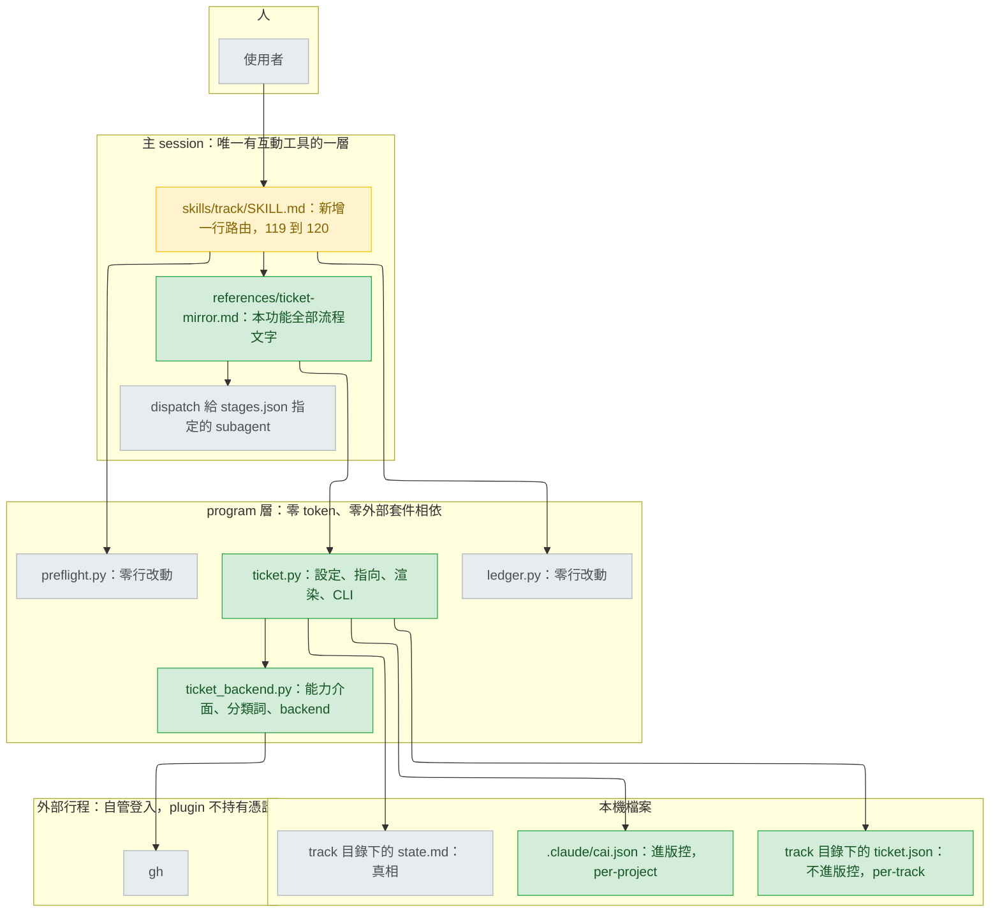
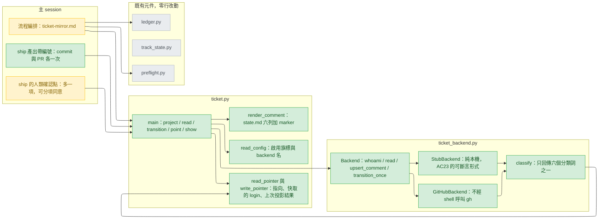
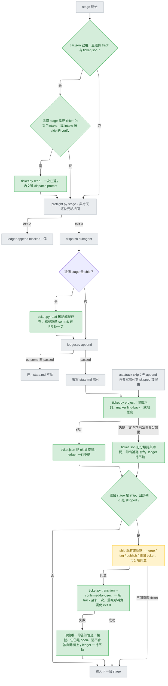
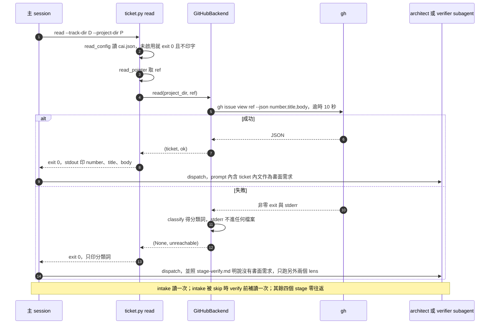
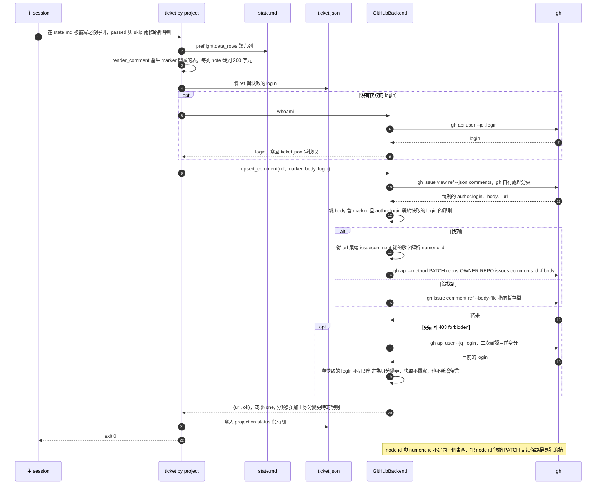
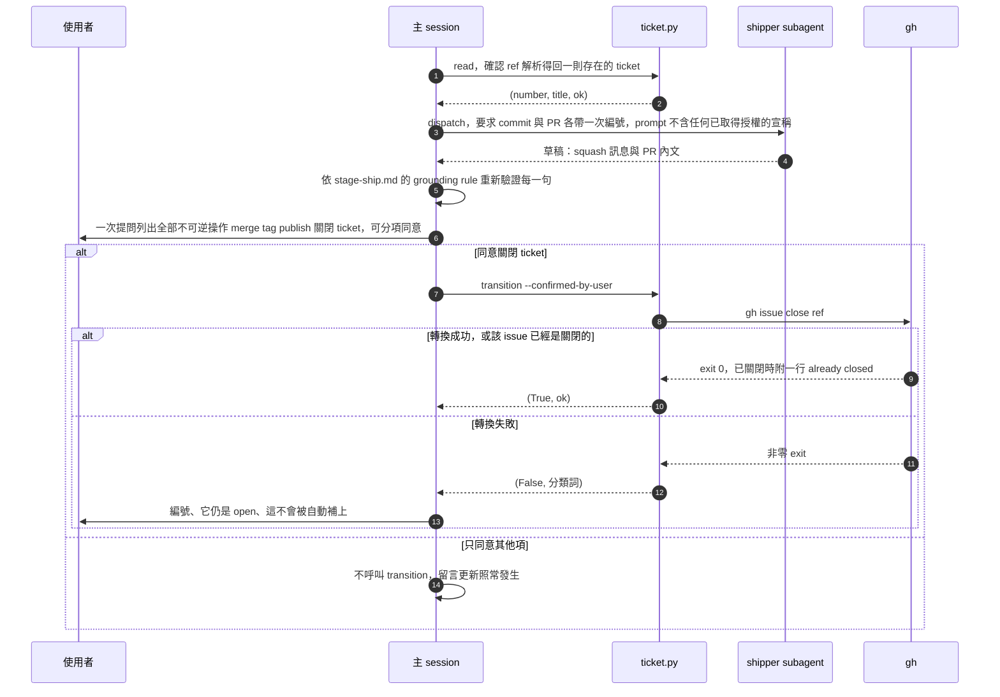
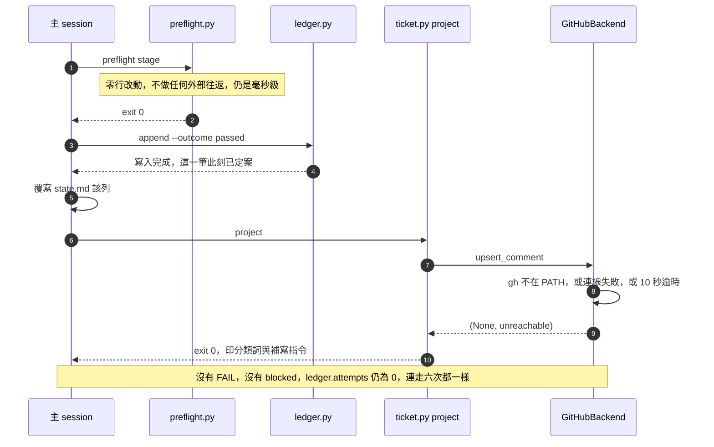
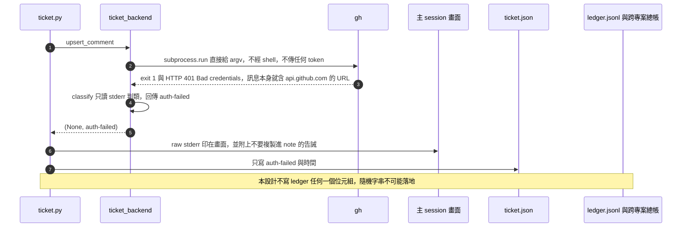
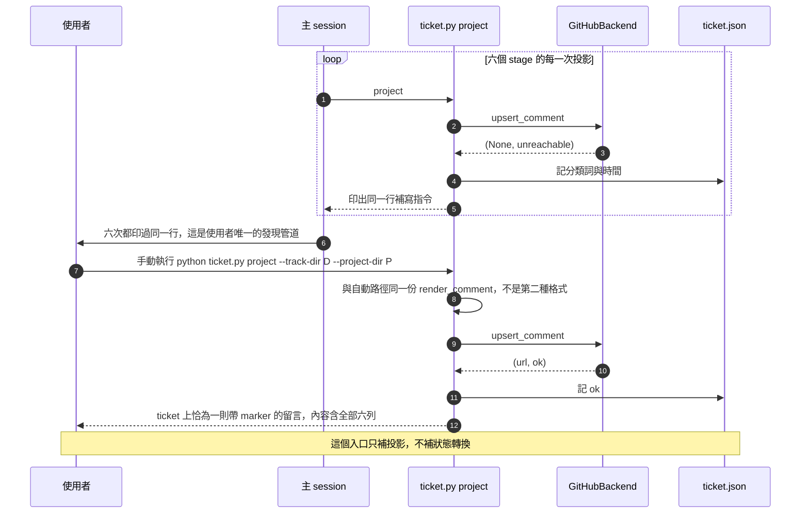

# ticket-integration — detail design

## Reference

High Level Design doc: docs/design/2026-08-30-ticket-integration-high-level.md
Status: approved 2026-08-31

本文件把該 HLD 的十項裁決轉成可實作的規格，十項裁決不重開。撰寫期間發現一處 HLD 照字面
做不到（投影失敗的紀錄要落在 ledger 上），已回報並由使用者授權修正 HLD 本身：現在兩份
文件對這一點一致，見 DD2。**本文件與 HLD 之間沒有未解的衝突，實作層也沒有未裁決項**；
唯一取代上游的是 AC24 的措辭，理由與新措辭寫在 `## Verification`。

### Traceability

| From the high-level design | Satisfied by | Status |
|---|---|---|
| R1 | `ticket.py read` 在 intake 讀一次，內文進 intake 產物；intake 被 skip 時 verify 前補讀一次（DD5） | covered |
| R2 | `ticket.py project` 在每次 `state.md` 被覆寫後，把六列表覆寫到帶 marker 的那則留言（DD3） | covered |
| R3 | ship 前以 `ticket.py read` 確認編號存在，主 session 要求 commit message 與 PR 內文各帶一次（DD7） | covered |
| UC1 | `preflight.py`、`ledger.py`、`agents/*.md`、`stages.json` 零行改動；無設定檔時 `ticket.py` 不做事也不印字（DD1） | covered |
| UC2 | `ticket.py read` 兩條路徑；讀不到就照 `stage-verify.md:49-50` 明說沒有書面需求 | covered |
| UC3 | `render_comment()` 全表覆寫加 marker；`upsert_comment()` 的 marker find-back 三步 | covered |
| UC4 | ship 既有確認點多一個可分項同意的項目，同意才呼叫 `transition --confirmed-by-user` | covered |
| UC5 | `ticket.py` 永遠 exit 0；preflight 零行改動，ticket 不可能造出 `blocked`（DD4） | covered |
| UC6 | `subprocess.run(argv)` 不經 shell、不傳 token；`classify()` 只回六個封閉集合詞；本設計不寫 ledger 一個位元組（DD6） | covered |
| UC7 | 手動補寫就是使用者具名執行同一支 `ticket.py project`；每次失敗都印出可貼上的那行指令 | covered |
| UC8 | `.claude/cai.json` per-project 進版控；`BACKENDS` 註冊表選類別，加 `StubBackend` 對 preflight 與 `skills/track/` 零行改動 | covered |

## Requirement

在既有六個 stage 之外加一層**單向投影**：`state.md` 是真相，ticket 上的一則留言是它對外
的鏡像。鏡像壞掉不影響真相。給個人（GitHub Issues）與團隊（共享 ticket）同一條路徑。
成功的判準是 intake 產物第 4 節的 24 條 AC 全綠（AC24 依 `## Verification` 的新措辭），
且未啟用時六個 stage 的 preflight stdout 與改動前逐位元組相同。

失敗的定義同樣寫死：**這個功能不得成為使用者進不了自己 track 的原因。** 讀不到、寫不進
去、外部 CLI 不在 PATH 上，三者都不改變任何 stage 的成敗，也不消耗任何重試額度。

**第一版不支援跨 repo 的 ticket。** `ticket.json` 的 `ref` 只存 issue 編號，repo 由 `gh`
自己從專案的 git remote 推得——這與 HLD C2 實際量測過的呼叫形狀
（`gh issue view <n> --json number,title`）完全一致，不多猜一個未量測的參數形式。指向另
一個 repo 的 ticket 需要多帶一個 `--repo`，那是第二版的事；本版遇到這種需求時，使用者看
到的是 `ticket-not-found`，不是一個看起來成功卻寫錯地方的投影。

## Glossary

最後一欄是 `file:line` 者，都是本次親自開啟過的行。

| Term | Definition | Where it lives |
|---|---|---|
| projection（投影） | 把 `state.md` 六列渲染成一張表、覆寫 ticket 上那則留言的動作，每次都是整張表覆寫 | new — plugins/cai/scripts/ticket.py |
| mirror comment | ticket 上被投影覆寫的那一則留言，body 第一行是 marker | concept |
| marker | 鏡像留言第一行的可見標記，含 feature 名稱並以中括號界定 | new — plugins/cai/scripts/ticket.py |
| marker find-back | 列留言、挑 body 含 marker 且作者為登入身分的那則、依數字 id 就地更新，三步 | new — plugins/cai/scripts/ticket_backend.py |
| cached login | `ticket.json` 裡記下的登入帳號，是 find-back 的作者過濾條件，也是 403 之後判定身分是否變更的比較基準 | new — .claude/track/ticket-integration/ticket.json |
| node id | `--json comments` 回傳的 GraphQL 識別碼（`IC_...`），不能餵給更新端點 | concept |
| numeric comment id | 留言 `url` 尾端 `#issuecomment-<n>` 的數字，是 PATCH 端點唯一接受的 id | concept |
| capability interface | 只定義四個語意能力（whoami、read、upsert_comment、transition_once）的抽象基底 | new — plugins/cai/scripts/ticket_backend.py |
| backend | 能力介面的具體實作，由設定檔的 `backend` 值選出 | new — plugins/cai/scripts/ticket_backend.py |
| category word（分類詞） | 六個封閉集合字串之一，是外部 CLI 結果唯一被允許離開 backend 的表示 | new — plugins/cai/scripts/ticket_backend.py |
| per-project config | 進版控的 `.claude/cai.json`，只放「有沒有開」與「用哪個 backend」 | new — .claude/cai.json |
| per-track pointer | track 目錄下與 `state.md` 同層的 `ticket.json`，放指向與上次投影結果 | new — .claude/track/ticket-integration/ticket.json |
| state.md | 一條 track 每 stage 一列的表，只有 passing path 與 skip 會覆寫它 | `plugins/cai/skills/track/SKILL.md:68` |
| ledger | 每次 stage 嘗試一列 JSON 的紀錄，appended, never edited | `plugins/cai/scripts/ledger.py:6` |
| COUNTS_AS_RETRY | 計入重試上限的兩個 outcome（`failed`、`blocked`），五次鎖死該 stage | `plugins/cai/scripts/ledger.py:50` |
| central ledger | 跨專案集中總帳，`ledger.append()` 每次同時寫入的第二個檔 | `plugins/cai/scripts/usage_collector.py:52` |
| preflight probe | preflight 印出的一行 PASS/FAIL；本設計一行都不新增 | `plugins/cai/scripts/preflight.py:476` |
| 主 session | 唯一持有互動工具、能取得授權的那一層；subagent 的回報只是草稿 | `plugins/cai/skills/track/references/stage-ship.md:31` |
| 第二個人類 gate | ship 之前對不可逆操作的確認；本設計只在其列表多加一項 | `plugins/cai/skills/track/SKILL.md:89` |
| conformance lens | verify 三個 lens 之一，沒有書面需求時會被整個放棄 | `plugins/cai/skills/track/references/stage-verify.md:44` |
| grounding rule | ship 寫出的每個事實主張都得指得回 diff、commit 或開過的檔 | `plugins/cai/skills/track/references/stage-ship.md:11` |
| always-on budget | agents 與 skills frontmatter description 的總字元上限，本設計消耗 0 | `scripts/validate.py:215` |
| track 目錄不進版控 | `.claude/track/` 整個被 git 忽略，註解已定性為個人工作狀態 | `./.gitignore:11` |
| stages.json | 六個 stage 的 id/agent/reference/auto_invoke，本設計零行改動 | `plugins/cai/skills/track/stages.json:2` |
| 環境變數接縫 | 以環境變數換掉外部相依的既有慣例，子行程也看得到 | `tests/conftest.py:56` |
| synced / sync_error | 對外寫入失敗而流程照常完成的**形狀**前例；本設計引用其形狀，不引用其落點 | `plugins/cai/scripts/ledger.py:265` |

## Budgets

| What | Number | Where it comes from |
|---|---|---|
| 一次 `gh issue view <n> --json number,title` 往返，三次實測最慢 | 584 ms | 主 session 實測 494 / 551 / 584 ms（HLD C12） |
| `preflight.py design` 在這條 track 上 | 79 ms | 主 session 實測（HLD C12） |
| 外部 CLI 單次呼叫的逾時 | 10 s | 使用者裁決 2026-08-31：實測正常 0.5 秒，取 20 倍餘裕 |
| 一次投影的外部往返次數，首次含取登入身分 | 3 first, then 2 | 本設計：`gh api user` 一次（快取）＋列留言＋更新留言。身分變更是罕見情況，只在更新回 403 時才多一次 `whoami`，不對每次投影收稅 |
| 一次投影的延遲，正常路徑的資訊性量測（**不是 gate**） | 1168 ms | 2 × 584 ms。stub 測不出網路延遲，所以它只在 e2e 記錄，不當門檻，見 `## Verification` |
| 一次投影的最壞耗時（兩次都逾時） | 20 s | 2 × 10 s；使用者可感知的上界 |
| 一條 track 啟用後的往返總數上界 | 16 | 6 × 2 投影＋intake 讀 1＋ship 確認 1＋轉換 1＋取身分 1 |
| 未啟用時本設計新增的外部往返 | 0 | 讀不到 `.claude/cai.json` 就直接返回 |
| 鏡像表每列 note 的字元上限，超過即截斷 | 200 chars | 使用者裁決 2026-08-31 |
| 六列鏡像表的 note 總量上界 | 1200 chars | 6 × 200 |
| ticket 留言 body 的平台上限 | 65536 chars | 文件證據、未實測：錯誤訊息為 `body is too long (maximum is 65536 characters)`。以 1200 計仍有約 50 倍餘裕 |
| marker find-back 需要的翻頁邏輯 | 0 | 實測 `gh issue view --json comments` 對 142 則的 issue 回 142 則、107 則的回 107 則，`gh` 自行處理分頁 |
| always-on description 目前用量 | 5451 chars | `scripts/validate.py:222-225` 實測 |
| always-on description 上限 | 5468 chars | `scripts/validate.py:215` |
| 本設計允許消耗的 always-on 頭寸 | 0 chars | 不新增任何 agent／skill 的 frontmatter description |
| `skills/track/SKILL.md` body，加一行之後 | 120 lines | 上限 120，判定式 `track_lines <= 120`，`scripts/validate.py:1346` |
| 同時最多 active track 數 | 5 | `plugins/cai/scripts/preflight.py:276-277` |
| 一個 stage 鎖死前的重試次數 | 5 | `plugins/cai/scripts/preflight.py:147-173`；本設計必須讓它維持 0 |
| ledger `note` 截斷前位元組 | 3840 bytes | `plugins/cai/scripts/ledger.py:56` |
| ledger 單筆硬上限 | 4096 bytes | `plugins/cai/scripts/ledger.py:55` |
| 鏡像留言列數 | 6 | `plugins/cai/skills/track/stages.json:2-15` |
| GitHub Issues 狀態數 | 2 | HLD C7 |
| 一條 track 的狀態轉換次數 | 1 | HLD C7、Decision 6。實測重複呼叫 `gh issue close` 仍 exit 0，故重試安全 |
| 本設計寫進 ledger 的位元組 | 0 bytes | DD2：`ledger.py` 零行改動 |

note 上限 200 字元的理由要與數字一起留著，否則下一個人只會看到一個礙事的截斷：**完整
理由本來就在 `state.md` 與 ledger 裡，鏡像的用途是讓團隊知道進度，不是取代那兩個檔。**
本專案 `state.md` 實際的 note 單列可達一千五百字以上，六列直接串接會把一則留言變成沒有
人會讀的東西。

## Design decisions

- **DD1 — 未啟用的成本是零，靠「不改既有檔案」而不是「改了但走不到」。** `preflight.py`、
  `ledger.py`、`agents/*.md`、`stages.json` 全部零行改動，AC1 因此不必只靠 golden file，
  `git diff --stat plugins/cai/scripts/preflight.py` 為空是更強也更便宜的證據。
- **DD2 — 投影與轉換的失敗紀錄落在 per-track pointer，`ledger.py` 一行不改。已與 HLD
  同步，不是待決事項。** 依據是 append-only 與寫入時機的組合：`plugins/cai/scripts/
  ledger.py:270` 的 `_write_line()` 在 `append()` 的 `return per_track`
  （`plugins/cai/scripts/ledger.py:271`）之前就把該行落盤，而流程順序是 append → 覆寫
  `state.md` → 投影，投影發生時那一筆已經定案，`plugins/cai/scripts/ledger.py:6` 又寫死
  appended, never edited。唯一能讓欄位落在同一筆上的辦法是把投影移到 `append()` 之前，
  那會違反「投影不得早於 ledger」（依據 `plugins/cai/scripts/ledger.py:230-231` 的拒寫不
  產生孤兒）。兩者不能同時成立。HLD 已於 2026-08-31 依此修正：
  `docs/design/2026-08-30-ticket-integration-high-level.md:126`（`REC`）、
  `:134`（`RECT`，轉換失敗同樣在 append 之後，毛病相同）、`:149-156`（不能落在 ledger 的
  理由）、`:405-407`（Decision 8 的落點，並把 C15 降為**形狀**的前例而非落點依據）。因此
  失敗以 `{"status": "<分類詞>", "at": "<UTC>"}` 寫進 `ticket.json`。
- **DD3 — 投影只有一個進入點，自動與手動共用。** `ticket.py project` 就是 HLD 元件圖的
  `FIX`，與正常路徑共用同一份 `render_comment()`，不可能長出第二種留言格式。不新增任何
  skill 或 command，always-on 消耗 0 chars。
- **DD4 — `ticket.py` 所有子指令永遠 exit 0，usage error 才 1，永不回傳 2。** 這是「不得
  產生 FAIL」的具體形狀。本設計不進 preflight，`COUNTS_AS_RETRY`
  （`plugins/cai/scripts/ledger.py:50`）在任何 ticket 失敗下都不可能被觸發。
- **DD5 — ticket 內文由主 session 讀，不由 subagent 讀。** `agents/*.md` 的 `tools:` 行零
  行改動，always-on 零消耗，AC18 對 `plugins/cai/agents/shipper.md:7` 的 `git diff` 為空
  順帶成立。內文以 dispatch prompt 傳給 subagent。
- **DD6 — 分類在來源端做，raw stderr 一個位元組都不進任何檔案。** `classify()` 讀 stderr
  只為判類，回傳永遠是六個詞之一；raw stderr 只印在畫面上（HLD Decision 8 A），並附一行
  「不要把這段複製進 `--note`」的告誡，同一條規則寫進 `references/ticket-mirror.md`。這
  不是理論上的擔憂：`gh` 的認證失敗訊息本身就含 URL（`HTTP 401: Bad credentials
  (https://api.github.com/graphql)`，主 session 2026-08-31 實測）。
- **DD7 — ship 的編號引用先解析、後書寫。** 主 session 先跑 `ticket.py read` 拿到
  `number` 與 `title`，確認編號解析得回一則存在的 ticket，才把「commit message 與 PR 內文
  各帶一次」寫進 dispatch prompt。這是 `plugins/cai/skills/track/references/stage-ship.md:11`
  grounding rule 對一個湊出來的號碼的直接應用。
- **DD8 — 唯一的授權路徑是既有 ship 確認點，且必須可分項同意。** `transition` 缺
  `--confirmed-by-user` 就拒絕並印出原因。旗標不證明使用者同意過；它的作用是讓「授權在
  哪裡取得」在程式碼與紀錄上只有一個位置可指。
- **DD9 — 外部執行檔可由環境變數替換，這是測試唯一的接縫，而且在 Windows 上是唯一可行的
  接縫。** `CAI_TICKET_CLI` 沿用 `CAI_USAGE_LEDGER`
  （`plugins/cai/scripts/usage_collector.py:44`）的既有作法：以環境變數而非 monkeypatch，
  因為子行程只看得到環境（`tests/conftest.py:56-62` 明說這個理由）。值以 `[` 開頭視為
  JSON argv 陣列，否則視為單一執行檔路徑。三件已實測的事，直接決定這個變數的規格：
  1. **路徑必須含副檔名。** 同一支 stub，完整路徑帶 `.cmd` → exit 0；同一路徑去掉副檔名
     → `FileNotFoundError: [WinError 2]`。Windows `CreateProcess` 只替沒有副檔名的名稱補
     `.exe`，所以 `CAI_TICKET_CLI` 收到裸名字會直接失敗。規格要求使用者傳完整路徑，
     `ticket.py` 在值明顯沒有副檔名時多印一行提醒。
  2. **改 PATH 換不掉一支被直接呼叫的 CLI。** Windows 上 `subprocess` 的 `env=` 不影響被
     直接啟動那個行程的執行檔搜尋（搜尋用父行程的 PATH）。這正是本接縫必要而非方便的
     理由。
  3. **AC7 的測法仍然成立**：清空的 PATH 是傳給 `ticket.py` 的，`gh` 是它的孫行程，用的
     是 `ticket.py` 自己已被清空的 `os.environ`。
- **DD10 — 登入身分中途變更以「事後解釋」處理，不做事前檢查（使用者裁決 2026-08-31）。**
  投影一律以 pointer 裡快取的 `login` 過濾與寫入；只有在更新留言回 403 時，backend 才多
  發一次 `whoami` 二次確認，判定是不是換了帳號。理由是成本分布：換帳號是罕見情況，而事前
  檢查要對**每一次**投影加一次 `whoami` 往返（2 → 3），等於為罕見情況對常態收稅；而且新
  身分本來就有權編輯時（例如 repo maintainer），事後解釋讓投影繼續成功，事前檢查會把那種
  情況一併擋掉。三件事無論如何都成立：不新增第二則帶 marker 的留言、投影流程不自動覆寫
  快取的 `login`（覆寫會讓「身分變了」在檔案上消失，偵測就失去依據）、訊息必須明說身分
  不同而不是只丟一個分類詞。

## Diagrams

八個 use case 只畫六張 sequence。**跳過 UC1 與 UC8**，理由都是呼叫順序在 flow 圖上已看得
出來：UC1 就是 flow 圖最左那條「否」分支，外部呼叫為零，畫成 sequence 是一條沒有訊息的
線，而它的驗收是逐位元組比對不是順序；UC8 沒有呼叫順序可畫，它是「哪個檔在哪個作用域」
與「註冊表選出哪個類別」的靜態性質，由 architecture 圖、component 圖與 `## Naming` 承載。

### Architecture



跨越邊界的東西：`SK` 到 `RM` 是一行指示（明說由主 session 自己讀）；`RM` 到 `TK` 是
argv；`TK` 到 `TB` 是 `(project_dir, ref, marker, body, login)`；`TB` 到 `GH` 是 argv，回
來的只有 `(值, 分類詞)`——raw stderr 停在 `TB` 的邊界，只往畫面走，不往任何檔案走。

### Component



`SAN --> PTR` 這條邊是本圖唯一值得停下來看的地方：分類詞流進 per-track 的指向檔，不流進
ledger。HLD 元件圖初版畫的是流進 ledger，2026-08-31 已依 DD2 一併修正
（`docs/design/2026-08-30-ticket-integration-high-level.md:405-407`），兩份文件現在一致。
`SAN` 夾在 `CAP` 與 `PTR` 之間而不是掛在寫檔那一端，是為了讓外部字串的判斷責任留在認識
那個來源的地方。

### Flow



`PRJ` 與 `TR` 的失敗邊都往下走、沒有回頭箭頭——那是 UC5。兩者被接住的方式不同（`FW` 會
被下一次投影自癒，`MSG` 不會），所以是兩個節點。三個節點都寫著「ledger 一行不動」，是為
了讓 DD2 在圖上就看得見，而不是要讀者翻到下一節才知道。

### Sequence — UC2（讀進書面需求，含 intake 被 skip 的 fallback）



### Sequence — UC3（投影：marker find-back 與就地覆寫）



### Sequence — UC4（ship：引用編號、可分項同意、只轉換一次）



### Sequence — UC5（不可達：不擋人、不吃重試額度）



### Sequence — UC6（不持憑證，外部輸出不落地）



### Sequence — UC7（全數失敗後的手動補寫）



## Implementation spec

型別以 `typing` 標註書寫，實作可用註解形式；`ticket.py` 與 `ticket_backend.py` 只 import
標準函式庫，加上 `ticket.py` 對同目錄 `preflight` 的 import（單向：`ticket` → `preflight`
→ `ledger` → `usage_collector`，不成環，符合 `plugins/cai/scripts/ledger.py:15-23` 的規則）。

### read_config — per-project 設定

- **Responsibility**：回答「這個專案有沒有開整合、用哪個 backend」，且永遠不丟例外。
- **Interface**：`def read_config(project_dir: str) -> dict`
- **Data**：in `project_dir`；out `{"enabled": bool, "backend": str, "problem": str | None}`。
  檔不存在 → `{"enabled": False, "backend": "", "problem": None}`。JSON 壞掉或型別不對 →
  `enabled=False` 且 `problem` 是一句我方寫的說明（不含檔案內容）。
- **Errors**：`OSError`、`ValueError` 全部就地吃掉轉成 `problem`。沒有任何路徑會 raise。
- **Concurrency**：純讀，可重入。設定檔被同時編輯只會讀到舊或新的一份，兩者都合法。
- **Observability**：成功不印字；`problem` 非 None 時由呼叫端印一行。**未啟用時一個字都
  不印**——這是 AC1 的一部分。
- **Where it lives**：`plugins/cai/scripts/ticket.py`（新檔）。
- **What it reuses**：路徑解析沿用 `plugins/cai/scripts/preflight.py:38-46` 的 `resolve()`
  慣例；`project_dir` 為第一 base 的既有呼叫見 `plugins/cai/scripts/preflight.py:200`。

### read_pointer / write_pointer — per-track 指向

- **Responsibility**：保存與讀取「這條 track 指向哪一則 ticket、以誰的身分投影過、上一次
  投影的結果」。
- **Interface**：
  `def read_pointer(track_dir: str) -> dict | None`；
  `def write_pointer(track_dir: str, pointer: dict) -> None`
- **Data**：out `{"backend": str, "ref": str, "login": str | None,
  "projection": {"status": str, "at": str} | None}`。`ref` 只存 issue 編號（第一版不支援
  跨 repo，見 `## Requirement`）。`login` 是**首次成功取得身分時寫入的快取**，之後只被
  `ticket.py point` 覆寫，**投影流程永遠不自動覆寫它**——DD10 的偵測完全建立在這一點上：
  自動覆寫會讓「身分變了」在檔案上消失，403 之後的二次確認就沒有比較基準。`status` 是六個
  分類詞之一，`at` 是 `YYYY-MM-DDTHH:MM:SSZ`。檔不存在 → `None`（整合對這條 track 靜默
  失效）。
- **Errors**：讀失敗 → `None`。寫失敗 → 吃掉 `OSError` 並印一行；投影本身的成敗不受影響。
- **Concurrency**：read-modify-write，非原子。兩個 session 同跑一條 track 時可能覆蓋彼此
  的 `projection`，代價僅是少一筆狀態；`state.md` 在同一情境下早已會壞，本設計不新增防護。
  不採用 `plugins/cai/scripts/ledger.py:306-336` 的 Windows 鎖：那是為 append-only 檔設計
  的，此處是整檔覆寫。
- **Observability**：`ticket.py show` 印出目前 ref、快取的 login 與上次投影結果——這是
  DD2 之後「投影失敗留在哪裡」唯一的查詢入口，也是使用者確認身分快取的地方。
- **Where it lives**：`plugins/cai/scripts/ticket.py`；資料檔在
  `.claude/track/<feature>/ticket.json`，與 `state.md` 同層、同樣被 `./.gitignore:11` 忽略。
- **What it reuses**：`./.gitignore:8-11` 對該目錄的定性（HLD Decision 10 的依據）。

### render_comment — 狀態表渲染

- **Responsibility**：把 `state.md` 的六列渲染成一段帶 marker 的留言 body。
- **Interface**：
  `def marker_for(feature: str) -> str`；
  `def render_comment(track_dir: str, feature: str, now: str) -> str | None`
- **Data**：in track 目錄與 feature 名；out 純文字。首行是 marker，接一行「此留言由 cai
  就地覆寫，請勿手動編輯」，再接一張 `| stage | status | note |` 三欄六列表，末行是
  `updated <UTC>`。每列 note 超過 200 字元即截斷並補省略記號。**`artifact` 欄不投影**：
  那是 `docs/` 底下的本機路徑，而 `docs/` 被 `./.gitignore:15` 忽略，對團隊沒有意義。
- **Errors**：`state.md` 不存在或列數不是六 → 回傳 `None`，投影跳過並印一行。不 raise。
- **Concurrency**：純函式，無共享狀態。同一輸入永遠同一輸出（`now` 除外）。
- **Observability**：`ticket.py show --dry-run` 直接把 body 印在畫面上，不做任何外部呼叫。
- **Where it lives**：`plugins/cai/scripts/ticket.py`。
- **What it reuses**：`plugins/cai/scripts/preflight.py:49-65` 的 `data_rows()` 與
  `plugins/cai/scripts/preflight.py:68-81` 的 `state_row()`——表格解析只有一份實作，
  `plugins/cai/scripts/track_state.py:66-73` 已經以同一理由這麼做過。

### Backend — 能力介面與兩個實作

- **Responsibility**：把「讀一則 ticket、就地覆寫一則留言、轉換一次狀態」三件語意能力，
  與「用哪支 CLI、哪些子指令」隔開。
- **Interface**：

  ```python
  CATEGORIES = ("ok", "auth-failed", "ticket-not-found",
                "forbidden", "unreachable", "unclassified")
  TIMEOUT_SECONDS = 10

  class Backend:
      name: str
      def whoami(self, project_dir: str) -> tuple[str | None, str]: ...
      def read(self, project_dir: str, ref: str) -> tuple[dict | None, str]: ...
      def upsert_comment(self, project_dir: str, ref: str, marker: str,
                         body: str, login: str) -> tuple[str | None, str]: ...
      def transition_once(self, project_dir: str, ref: str) -> tuple[bool, str]: ...

  class GitHubBackend(Backend): name = "github"
  class StubBackend(Backend):   name = "local-stub"

  BACKENDS = {"github": GitHubBackend, "local-stub": StubBackend}
  def get(name: str) -> Backend | None: ...
  ```

- **Data**：每個方法回傳 `(值, 分類詞)`，分類詞必在 `CATEGORIES` 內。`read` 的值是
  `{"number": str, "title": str, "body": str}`；`upsert_comment` 的值是留言 url。
  `GitHubBackend` 的四條實際呼叫：`gh api user --jq .login`、
  `gh issue view <ref> --json number,title,body`、`gh issue view <ref> --json comments`、
  更新走 `gh api --method PATCH repos/OWNER/REPO/issues/comments/<numeric id> -f body=...`，
  新增走 **`gh issue comment <ref> --body-file <暫存檔>`**（已實測可新增留言，不需要額外
  旗標；body 走檔案而非 argv，避免六列表格的換行與引號經過命令列）。
- **Errors**：不 raise。`FileNotFoundError`（CLI 不在 PATH）與 `TimeoutExpired`（10 秒）都
  成為 `unreachable`；其餘由 `classify()` 決定。失敗後外部狀態不變（PATCH 是單一請求，沒
  有中途狀態）。
- **身分變更：403 觸發二次確認（DD10）。** `upsert_comment` 的作者過濾一律用 pointer 裡
  快取的 `login`，不做任何事前的身分檢查，所以快取命中時的往返數維持 2。使用者中途
  `gh auth switch` 時有兩種結果，兩種都正確：新身分若有權編輯該留言（例如 repo
  maintainer），更新成功、投影照常；若無權，更新回 403，此時 backend **才**多發一次
  `whoami`，把目前身分與快取的 `login` 比對，不同即判定為身分變更，回
  `(None, "forbidden")` 並附上身分變更的說明。三件事在任何路徑上都成立：不新增第二則帶
  marker 的留言、不覆寫快取的 `login`、訊息明說身分不同而不是只丟一個分類詞。
- **Concurrency**：無實例狀態，可安全重入。`upsert_comment` 是 read-then-write：兩個
  session 同時對同一條 track 首次投影時，可能各建一則留言，AC10 會抓到；此窗口與
  `state.md` 已有的同名窗口相同，本設計記錄而不新增防護（見 `## Failure modes`）。
  `transition_once` **是冪等的**：對已關閉的 issue 再次 `gh issue close` 實測 exit 0，
  訊息為 `! Issue ... is already closed`，因此任何重試都不會產生錯誤狀態。
- **Observability**：每次外部呼叫在畫面上印一行 `backend argv 摘要 → 分類詞`；argv 中不
  含任何憑證，因為憑證由 `gh` 自管（HLD C1）。
- **Where it lives**：`plugins/cai/scripts/ticket_backend.py`（新檔）。
- **What it reuses**：呼叫外部行程的形狀抄 `plugins/cai/scripts/preflight.py:212-220` 的
  `subprocess.run(["git", *args], capture_output=True, text=True, timeout=...)`——**不經
  shell**，因為 Git Bash 會把 `gh api` 開頭是斜線的 endpoint 當路徑改寫（HLD C31）。

### classify — 輸出淨化

- **Responsibility**：把一次外部呼叫的結果壓成六個封閉集合詞之一，讓 raw stderr 沒有任何
  出口進入被保存的檔案。
- **Interface**：`def classify(exc: Exception | None, returncode: int, stderr: str) -> str`
- **Data**：in 例外、exit code、stderr 原文；out `CATEGORIES` 之一。判定順序：
  1. 例外優先：`FileNotFoundError` / `TimeoutExpired` / `OSError` → `unreachable`。
  2. `returncode == 0` → `ok`。
  3. 其後對 stderr 做**不分大小寫的子字串比對**，字樣為主 session 於 2026-08-31 實測所得
     （HLD `docs/design/2026-08-30-ticket-integration-high-level.md:409-415`）：
     `HTTP 401`、`Bad credentials` → `auth-failed`；
     `Could not resolve to an issue or pull request`、`Could not resolve to a Repository`
     → `ticket-not-found`；
     `error connecting to` → `unreachable`；
     `body is too long` → `unclassified`（留言過長，見 `## Failure modes`）；
     其餘 → `unclassified`。
- **`forbidden` 只可能出現在寫入路徑，而且它是身分變更的偵測訊號本身。** GitHub 對無權限
  的 repo 回的是 `Could not resolve` 而非 403，刻意不洩漏存在性（實測，同上引），所以讀取
  路徑上永遠不會出現 403，實作者不要去找那個字樣。該分類詞保留給 PATCH／close 失敗，判定
  依據是 `403` 或 `forbidden` 出現在寫入呼叫的 stderr。**在 DD10 之下，寫入路徑上的 403
  就是觸發 `whoami` 二次確認的訊號**——`upsert_comment` 收到它時第一件事是比對身分，不是
  去查 repo 的權限設定。
- **Errors**：純函式，不失敗。輸入是 `None` 或空字串時回 `unclassified`。
- **Concurrency**：純函式。
- **Observability**：它是唯一決定「什麼被記下來」的地方；raw stderr 由呼叫端印在畫面，
  且必須帶「不要複製進 `--note`」的告誡。認證失敗的訊息本身就含 URL，這條告誡不是形式。
- **Where it lives**：`plugins/cai/scripts/ticket_backend.py`。
- **What it reuses**：形狀上對應 `plugins/cai/scripts/ledger.py:265-267` 的 `sync_error`
  ——差別是那裡存 `OSError` 原文，這裡只存分類詞，落點也不同（DD2）。

### ticket.py main — CLI 與手動補寫入口

- **Responsibility**：把上面四件事接成五個子指令，並保證任何失敗都不改變任何 stage 的成敗。
- **Interface**：

  ```
  ticket.py project    --track-dir DIR [--project-dir DIR]
  ticket.py read       --track-dir DIR [--project-dir DIR]
  ticket.py transition --track-dir DIR [--project-dir DIR] --confirmed-by-user
  ticket.py point      --track-dir DIR --ref REF [--backend NAME]
  ticket.py show       --track-dir DIR [--project-dir DIR] [--dry-run]
  Exit: 0 一律，1 usage error。永遠不回傳 2。
  ```

- **Data**：`project`／`transition` 的 stdout 是一行 `<子指令>: <分類詞>` 加上失敗時的補
  寫指令；`read` 的 stdout 是 ticket 的 number、title、body。`point` 會清掉舊的 `login`
  快取並在下一次投影重新取得——這是使用者換帳號後回到正軌的既定路徑（DD10）。
- **Errors**：`transition` 缺 `--confirmed-by-user` → 印出原因並 exit 0，不呼叫任何外部
  行程。未啟用、無 pointer、`render_comment` 回 `None` → 各印一行（未啟用時不印）並 exit 0。
- **Concurrency**：`project` 完全冪等，重跑任意次數的結果相同（整表覆寫）。`transition`
  對已關閉的 issue 再呼叫實測 exit 0，因此也是冪等、重試安全的。
- **Observability**：投影失敗時印出的那行**就是**手動補寫入口，內容是可直接貼上的完整
  指令（DD3、HLD Decision 7 A 的 `Fails when`）。
- **Where it lives**：`plugins/cai/scripts/ticket.py`。
- **What it reuses**：`ArgParser` 覆寫 `error()` 使 usage 錯誤 exit 1 的作法，抄
  `plugins/cai/scripts/ledger.py:515-521`；Windows 管線 UTF-8 的
  `sys.stdout.reconfigure(encoding="utf-8")` 抄 `plugins/cai/scripts/ledger.py:531-532`。

### preflight.py — 觸點：零行改動

- **Responsibility**（不變）：只回答 `state.md` 與磁碟上的產物已經決定的事。
- **Interface**：不變。
- **Data**：不變。
- **Errors**：不變。
- **Concurrency**：不變。
- **Observability**：不新增任何一行 probe。這是 AC1 最強的保證形式，也讓 AC23 對
  `preflight.py` 的零行改動要求自動成立。
- **Where it lives**：`plugins/cai/scripts/preflight.py`（既有）。
- **What it reuses**：HLD Decision 3 A 已裁決讀取不進 preflight；`plugins/cai/scripts/
  preflight.py:2-8` 的自述（zero-token、只答檔案已決定的事）是不加 probe 的理由，另一個
  理由是 `ticket.py` 需要 `preflight.data_rows()`，反向 import 會成環。

### ledger.py — 觸點：零行改動

- **Responsibility**（不變）：append-only 的嘗試紀錄。
- **Interface**：不變；不新增任何 `--ticket-*` 旗標。
- **Data**：不變。ticket 相關的狀態一律改存 `ticket.json`（DD2，HLD 已同步）。
- **Errors**：不變。
- **Concurrency**：不變。
- **Observability**：本設計寫進 ledger 的位元組數是 0，因此 AC9 在結構上恆真。
- **Where it lives**：`plugins/cai/scripts/ledger.py`（既有）。
- **What it reuses**：`plugins/cai/scripts/ledger.py:6` 的 appended, never edited、
  `plugins/cai/scripts/ledger.py:270` 的 `_write_line()` 與 `:271` 的 `return per_track`，
  共同構成 DD2 的依據。

### 主 session 流程 — SKILL.md 一行加 ticket-mirror.md

- **Responsibility**：在既有六個 stage 的執行序列上，插入讀、投影、引用、轉換四個動作。
- **Interface**：`plugins/cai/skills/track/SKILL.md` 的「Running a stage」步驟 3 之後加
  **恰一行**：大意為「當 `.claude/cai.json` 啟用 ticket 鏡像時，由你——主 session，不是
  subagent——依 `${CLAUDE_PLUGIN_ROOT}/skills/track/references/ticket-mirror.md` 處理這個
  stage：dispatch 之前，以及 `state.md` 被寫入之後（含 `/cai:track skip`）。」
- **Data**：`ticket-mirror.md` 逐 stage 列出：intake 讀一次；intake 被 skip 時 verify 前
  補讀一次；每次 `state.md` 被覆寫後投影；ship 先確認編號再引用；ship 的確認點多列一項且
  可分項同意；以及「畫面上的 stderr 不得複製進 `--note`」。
- **Errors**：`ticket.py` 永遠 exit 0，所以 `plugins/cai/skills/track/SKILL.md:85` 的
  「非零 exit 停止該步驟」永遠不會因為 ticket 觸發。
- **Concurrency**：不變（同一條 track 同時被兩個 session 跑本來就未定義）。
- **Observability**：`references/ticket-mirror.md` 沒有 frontmatter description，因此
  always-on 預算消耗 0 chars（計入範圍見 `scripts/validate.py:216-221`）。
- **Where it lives**：`plugins/cai/skills/track/SKILL.md`（既有，+1 行）與
  `plugins/cai/skills/track/references/ticket-mirror.md`（新檔）。
- **What it reuses**：`plugins/cai/skills/track/SKILL.md:89-99` 的兩個人類 gate 一字不改；
  `plugins/cai/skills/track/references/stage-ship.md:7` 的不可逆操作清單加入「關閉 ticket」。

## Naming

| Name | What it is | Chosen by |
|---|---|---|
| `.claude/cai.json` | per-project、進版控的設定檔 | the user, 2026-08-31；落點依 `./.gitignore:2-4` 所示 `.claude/settings.json` 進版控 |
| `ticket` | `.claude/cai.json` 內承載本功能設定的頂層鍵 | the user, 2026-08-31 |
| `enabled` | 布林，預設不存在即 false | the user, 2026-08-31 |
| `backend` | 字串，backend 註冊名 | the user, 2026-08-31 |
| `github` | 第一版 backend 的註冊名 | the user, 2026-08-31 |
| `local-stub` | 純本機假實作的註冊名，AC23 的可斷言形式 | the user, 2026-08-31 |
| `ticket.json` | per-track 指向檔，與 `state.md` 同層 | the user, 2026-08-31；位置依 `./.gitignore:8-11` |
| `ref` / `login` / `projection` / `status` / `at` | `ticket.json` 的鍵 | the user, 2026-08-31 |
| `[cai track: <feature>]` | 鏡像留言首行的 marker。中括號界定是必要的：沒有界定字元時 `cai track: ticket` 會是 `cai track: ticket-integration` 的子字串，兩條 track 會互相命中 | the user, 2026-08-31；含 feature 名是 HLD Decision 9 的必要條件 |
| `plugins/cai/scripts/ticket.py` | 設定、指向、渲染與 CLI | the user, 2026-08-31；follows `plugins/cai/scripts/preflight.py:1` 的 scripts 慣例 |
| `plugins/cai/scripts/ticket_backend.py` | 能力介面、分類詞、兩個 backend | the user, 2026-08-31 |
| `plugins/cai/skills/track/references/ticket-mirror.md` | 主 session 的流程文字 | the user, 2026-08-31；目錄依 `plugins/cai/skills/track/stages.json:4` 的 references 慣例 |
| `project` / `read` / `transition` / `point` / `show` | 五個子指令 | the user, 2026-08-31 |
| `--confirmed-by-user` | `transition` 的必要旗標 | the user, 2026-08-31 |
| `--dry-run` | `show` 的旗標，只渲染不外呼 | the user, 2026-08-31 |
| `CAI_TICKET_CLI` | 覆蓋外部執行檔的環境變數，測試接縫 | the user, 2026-08-31；形狀 follows `plugins/cai/scripts/usage_collector.py:44` |
| `ok` / `auth-failed` / `ticket-not-found` / `forbidden` / `unreachable` / `unclassified` | 六個分類詞 | the user, 2026-08-31；五類語意由 HLD Decision 8 裁決 |
| `TIMEOUT_SECONDS` | `ticket_backend.py` 的模組常數，值為 10 | the user, 2026-08-31 |
| `tests/test_ticket_config.py` / `test_ticket_render.py` / `test_ticket_backend.py` / `test_ticket_project.py` | 測試模組 | the user, 2026-08-31；follows `tests/test_preflight_ledger.py:1` 的命名 |
| `tests/fake_gh.py` | 可設定成永遠失敗的假 CLI，由 `CAI_TICKET_CLI` 指向 | the user, 2026-08-31 |

## Change points

新增相依：**無**。`gh` 不是新相依，見 `plugins/cai/skills/git/SKILL.md:17` 與
`plugins/cai/agents/shipper.md:7` 的 `Bash(gh:*)`；Python 側只用標準函式庫（AC22）。

| Path | Change | Exists today |
|---|---|---|
| `plugins/cai/scripts/ticket.py` | 新增：設定、指向、渲染、五個子指令 | no |
| `plugins/cai/scripts/ticket_backend.py` | 新增：能力介面、`classify`、`GitHubBackend`、`StubBackend` | no |
| `plugins/cai/skills/track/references/ticket-mirror.md` | 新增：本功能全部流程文字 | no |
| `plugins/cai/skills/track/SKILL.md` | +1 行（119→120），位置在步驟 3 之後 | yes |
| `plugins/cai/skills/track/references/stage-ship.md` | 第 7 行的不可逆操作清單加入「關閉 ticket」 | yes |
| `.claude/cai.json` | 新增（本 repo 自用；沒有這個檔功能就是關的） | no |
| `tests/test_ticket_*.py`、`tests/fake_gh.py` | 新增 | no |
| `plugins/cai/scripts/preflight.py` | **零行改動**（DD1） | yes |
| `plugins/cai/scripts/ledger.py` | **零行改動**（DD2） | yes |
| `plugins/cai/scripts/track_state.py` | 零行改動 | yes |
| `plugins/cai/agents/*.md` | 零行改動，保住 5451 的 always-on 用量 | yes |
| `plugins/cai/skills/track/stages.json` | 零行改動，維持六個 stage | yes |
| `scripts/validate.py` | 零行改動即可通過；`SKILL.md` 的 120 行檢查已存在於 `scripts/validate.py:1346` | yes |

## Failure modes

| Situation | What happens | What the caller sees |
|---|---|---|
| 沒有 `.claude/cai.json` | `ticket.py` 立即返回，零外部呼叫、零輸出 | 與今天逐位元組相同（AC1） |
| `.claude/cai.json` JSON 壞掉 | 視為未啟用 | 一行「設定檔讀不出來，整合維持關閉」，stage 照常 |
| 啟用了但這條 track 沒有 `ticket.json` | 投影跳過 | 一行「這條 track 尚未指定 ticket，執行 `ticket.py point --ref <n>`」 |
| **登入身分中途變更（`gh auth switch`），pointer 有舊帳號的 `login` 快取** | 投影照常以快取的 `login` 過濾與寫入，往返仍是 2 次。新身分若有權編輯該留言（例如 repo maintainer），更新成功、投影不受影響；若無權，更新回 403，backend 才多發一次 `whoami` 二次確認並判定為身分變更。快取不被覆寫，也絕不新增第二則帶 marker 的留言（DD10） | 有權時使用者什麼都不必做；無權時一行「登入身分與這條 track 建立時不同（快取 `<舊>`，目前 `<新>`），投影未寫入；確認要用新身分後重跑 `ticket.py point --ref <n>`」 |
| 換帳號之後才第一次 `ticket.py point`（沒有快取可比對） | 作者過濾用新身分，找不到舊帳號建的那則，於是新增一則。**這是 intake §3.3「marker ＋ 作者」兩條件規則的固有結果，本版已知並接受，不補救** | issue 上出現第二則帶 marker 留言；使用者自行刪掉舊的那則即可，流程不再提起 |
| `gh` 不在 PATH | `FileNotFoundError` → `unreachable` | exit 0，畫面一行分類詞加補寫指令；`attempts()` 仍 0（AC7） |
| 網路不通，或單次呼叫超過 10 秒 | `TimeoutExpired` → `unreachable` | 同上；下一次投影會補齊整張表（AC6）。最壞一次投影耗 20 秒 |
| 認證過期 | `HTTP 401: Bad credentials` → `auth-failed` | 畫面提示重新登入。**該訊息本身含 `https://api.github.com/graphql`**——這正是 stderr 不得原封落地的實證，落檔的只有分類詞（AC9） |
| ticket 編號不存在，或指向的 repo 不存在 | 兩者 GitHub 都回 `Could not resolve` → `ticket-not-found` | 畫面提示改指向。第一版不支援跨 repo（見 `## Requirement`），指錯 repo 也走這條 |
| 對無權限的 repo 讀取 | GitHub 回 `Could not resolve` 而非 403，刻意不洩漏存在性 → `ticket-not-found` | 使用者看到的是「找不到」。`forbidden` 只會出現在寫入路徑 |
| 別人貼了含相同 marker 的留言 | 作者不符，find-back 略過該則 | 我方那則被更新，別人那則 id 與 body 不變（AC14） |
| 兩條 track 指同一 issue | marker 含各自 feature 名，互不命中 | issue 上兩則帶 marker 的留言，內容互不污染（AC15） |
| 同一條 track 被兩個 session 同時首次投影 | 兩者都沒找到 marker，各建一則 | issue 上出現兩則帶 marker 留言，AC10 會抓到。**本設計不防護**：同一窗口對 `state.md` 已經是未定義行為 |
| 刪掉整個 track 目錄後再跑 | 沒有 pointer，投影跳過；`ticket.py point` 重新指定後，find-back 靠 marker 找回原留言 | 不出現第二則（AC13），前提是登入身分未變 |
| `render_comment` 讀到的列數不是六 | 投影跳過 | 一行說明；`state.md` 與 ledger 都不受影響 |
| 留言 body 超過平台上限 | 200 字元的每列截斷讓六列約 1200 字元，離 65536 有約 50 倍餘裕，正常不會發生；真的發生時 `body is too long` → `unclassified` | 畫面分類詞加補寫指令。**若未來取消截斷，65536 就是會撞到的那面牆** |
| ship 時該 issue 已經是關閉的 | `gh issue close` 實測 exit 0，訊息 `! Issue ... is already closed` | 視為成功。**轉換因此是冪等的、重試安全**——重跑 ship、或使用者已先手動關閉，都不會產生錯誤狀態 |
| 狀態轉換失敗 | 不重試、不補救，ledger 一行不動 | 印出編號、它仍是 open、這不會被自動補上（HLD 第四條約束） |
| 使用者把畫面上的 stderr 貼進 `--note` | ledger 會留下外部原文 | 由 `ticket-mirror.md` 的明文規則防守；這是 DD6 唯一的殘餘風險 |

## Rollout

**能不能分批出？能，而且第一塊完全不碰網路。** 最小可用的第一塊是 Unit 1＋Unit 2：能力
介面、`classify`、`StubBackend`、設定、指向、渲染，以及 `ticket.py project` 走 `local-stub`
——此時整條鏡像路徑可以在完全離線的機器上跑通並被測試覆蓋，AC22 與 AC23 在這一步就綠。
`GitHubBackend` 是第二塊，`read`／`transition`／ship 引用是第三、四塊。

**既有資料怎麼辦？沒有 migration，也沒有 backfill。** 本設計不新增、不改寫任何既有檔案
格式：`state.md` 欄數不動（避開 HLD C32 的錯位風險）、`ledger.jsonl` 欄位不動（DD2）、
`stages.json` 六列不動，因此 `.claude/track/done/` 底下兩條已歸檔 track 的
`track_state.py status` 仍 exit 0（AC2）。既有 track 沒有 `ticket.json`，整合對它們靜默
失效直到使用者執行一次 `ticket.py point`。

**進行中的 track 會壞什麼？不會。** 功能預設關閉，關閉時六個 stage 逐字相同（AC1）。一條
track 跑到一半才打開設定，從下一個 passed 的 stage 起開始投影；因為每次都是整張表覆寫，
第一次投影就把先前所有 stage 一併補上（AC6 的自癒是這個性質的同一件事）。反過來，跑到一
半關掉設定，下一次投影不發生，ticket 上停留在最後一次成功的內容——**不會自動清理**，這是
刻意的：刪掉別人看得到的紀錄比留下一份過期的更糟。

**怎麼回退？** 三層，由輕到重。(1) 把 `.claude/cai.json` 的 `enabled` 改成 false，或刪掉
該檔——下一個 stage 起行為與今天完全相同，不需要重啟任何東西。(2) 刪掉一條 track 的
`ticket.json`——只停掉那一條。(3) 完整回退：revert 兩個被改的既有檔（`SKILL.md` 的一行、
`stage-ship.md` 的一行），刪掉兩支新 script 與新 reference。因為 `preflight.py`、
`ledger.py`、`stages.json`、`agents/*.md` 一行都沒改，這個 revert 不可能影響既有 track。
ticket 上已經寫下的留言與已經關閉的 issue 都不會被復原——外部世界不在 revert 的範圍內，
這一點必須在 release note 裡寫出來。

## Verification

Level 一律指：unit＝`python -m pytest` 內以 stub 執行、不碰網路；integration＝以
`CAI_TICKET_CLI` 指向 `tests/fake_gh.py` 跑完整 `ticket.py` 行程，**同樣不碰網路**；
e2e＝對真實 GitHub issue 手動跑一次。凡是門檻牽涉真實網路延遲的，只能放在 e2e，而且是
資訊性量測不是 gate——這是 stub 測不出來的東西。三列的措辭取代 intake 產物第 4 節的原文，
取代理由寫在該列內：AC5b（DD2）、AC11（`artifact` 欄不投影）、AC24（HLD Decision 1 晚於
intake 且由使用者當面拍板）。

`CAI_TICKET_CLI` 要傳**含副檔名的完整路徑**（實測：去掉副檔名即 `WinError 2`）；AC7 清空
PATH 的測法仍然成立，因為清空的是 `ticket.py` 自己的環境，`gh` 是它的孫行程。

| Criterion | Level | What it needs | Green before |
|---|---|---|---|
| AC1 未啟用時 preflight 輸出逐字不變 | integration | 先確認 `git diff --stat plugins/cai/scripts/preflight.py` 為空；再以 `tests/test_preflight_ledger.py:21-28` 那種**凍結 fixture track**（不是活的 track，否則 ledger 會變動）存六份 golden stdout，在無 `.claude/cai.json` 的環境重跑，`git diff --no-index` 六次無輸出 | Unit 4 merges |
| AC2 既有 track 不被破壞 | integration | `.claude/track/done/` 兩條 track 的 `track_state.py status` 仍 exit 0；`git diff` on `stages.json` 為空 | Unit 4 |
| AC3 always-on 預算完全不動 | unit | `python scripts/validate.py` 印出的用量仍是 5451 | Unit 4 |
| AC4 全綠 | integration | `python scripts/validate.py` exit 0 且 0 FAIL；`python -m pytest` 全綠 | Unit 6 |
| AC5a 讀不到不吃重試上限 | integration | `CAI_TICKET_CLI` 指向永遠 exit 1 的 `tests/fake_gh.py`，同一 stage 連走 6 次：`ledger.attempts()` 為 0、ledger 內無 `blocked`/`failed`、六個 preflight 全 exit 0 | Unit 3 |
| AC5b 寫不進去不吃重試上限，且不製造矛盾（**取代原文**：原文要求該筆 ledger 記錄帶回寫失敗欄位，DD2 證明 append-only 加寫入時機使其不可能，HLD 已同步修正） | integration | 讀成功、寫入 stub 永遠失敗，跑完一個 passed 的 stage：`state.md` 該列 done、ledger 該筆 `passed`、`attempts()` 為 0、**ledger 那一筆不含任何 ticket 欄位**，且 `ticket.json` 的 `projection.status` 為該分類詞、`at` 為該次時間 | Unit 3 |
| AC6 自癒可觀測 | e2e | stub 失敗跑 intake/discover/design 三個 stage，恢復成功後跑 build：留言恰一則、含四列當下狀態、無第二則帶 marker 留言 | Unit 3 |
| AC7 CLI 缺席等同不可達 | integration | 子行程環境的 `PATH` 清空且不設 `CAI_TICKET_CLI`：AC5a 與 AC5b 的斷言全部仍成立 | Unit 3 |
| AC8 plugin 不持有憑證 | integration | 跑完一條 track 後，對 `ledger.jsonl`、`usage_collector.central_ledger_path()`、`.claude/cai.json`、`ticket.json`、`state.md` grep `token`/`password`/`Authorization`/`Bearer`/`api_key` 不分大小寫皆無；設定檔另對 `git show HEAD:.claude/cai.json` 跑同一組 | Unit 6 |
| AC9 外部 stderr 不原封落地 | integration | stub 在 stderr 印 `Bearer sk-test-<亂數>`：該亂數不出現在 ledger 或總帳任何一行（本設計不寫 ledger，故為結構性保證）；並斷言 `ticket.json` 的 `projection.status` 在 `CATEGORIES` 內。另加一個真實字樣測試：`HTTP 401: Bad credentials (https://api.github.com/graphql)` 進去，落檔只有 `auth-failed`，URL 不出現在任何檔 | Unit 1 |
| AC10 恆一則，就地覆寫 | e2e | 跑完六個 stage 後，該 issue 上帶 marker 且作者為登入身分的留言恰 1 則 | Unit 3 |
| AC11 內容等於 state.md（**取代原文**：原文說「對應欄位逐列相同」，本設計不投影 `artifact` 欄，理由是 `docs/` 被 `./.gitignore:15` 忽略、本機路徑對團隊無意義） | unit | 以固定六列 `state.md` fixture 比對 `render_comment()` 的 stage／status／note 三欄逐列相同、且不含任何 artifact 路徑；其中一列須為 `skipped` 且斷言 `--reason` 的理由出現在留言中；另一列 note 超過 200 字元，斷言被截斷且帶省略記號 | Unit 2 |
| AC12 非 passed 不觸發外部寫入 | integration | 讓一個 stage 走 `failed` 與 `blocked` 各一次：`state.md` 不變，stub 記錄到的寫入呼叫次數為 0 | Unit 3 |
| AC13 標記不依賴本機狀態 | e2e | 跑三個 stage 後刪掉整個 track 目錄並重建、重新 `ticket.py point`，跑第四個 stage：仍編輯到原本那則，不出現第二則。登入身分須與前三次相同，否則落入 `## Failure modes` 已接受的那條限制 | Unit 3 |
| AC14 不覆寫別人的留言 | e2e | 另一帳號在同一 issue 貼一則含相同 marker 的留言，再跑一個 stage：該則 id 與 body 均未變 | Unit 3 |
| AC15 兩條 track 指同一 issue | e2e | 兩條 active track 指同一 issue，各跑一個 stage：2 則帶 marker 留言，各含自己的 feature 名，內容互不污染 | Unit 3 |
| AC16 轉換前必問，未答不動 | integration | ship 確認點回答「否」：stub 的轉換呼叫次數 0，而留言更新仍發生；回答「是」後恰 1 次。另斷言 `transition` 缺 `--confirmed-by-user` 時外部呼叫次數為 0 | Unit 5 |
| AC17 沒有第三個 gate | integration | `git diff plugins/cai/skills/track/SKILL.md` 恰 1 行新增、0 行刪除，且抽出的「## Human gates」整段前後逐位元組相同；跑完一條 track 的人類停等點恰 2 個 | Unit 5 |
| AC18 確認由主 session 發起 | integration | dispatch 給 shipper 的 prompt 與 shipper 回報中均不含已取得授權的宣稱；`git diff` on `plugins/cai/agents/shipper.md` 為空 | Unit 5 |
| AC19 conformance lens 真的收到需求 | integration | 啟用且可達時，對 verify 的 dispatch prompt 斷言含 ticket 內文；關閉且無書面需求時，斷言 prompt 明說沒有書面需求且只跑另外兩個 lens | Unit 4 |
| AC20 ship 的引用指得回去 | e2e | 啟用時 squash 後的 commit message 與 PR 內文各含一次編號，且 `ticket.py read` 對該編號回傳 `ok` | Unit 5 |
| AC21 per-project 且進版控 | integration | `.claude/cai.json` 出現在 `git ls-files`；A 專案開啟、B 專案關閉，同一 shell 下兩邊 `preflight.py` 輸出互不影響，且對 B 的外部呼叫次數為 0 | Unit 2 |
| AC22 zero deps | unit | 對兩支新 script 的 `import` 斷言只有標準函式庫加同目錄 `preflight`；全套測試在無 `gh` 的機器上可執行 | Unit 2 |
| AC23 抽象在能力層 | unit | 加入 `StubBackend` 的那一筆 commit，`git diff --stat` 對 `plugins/cai/scripts/preflight.py` 與 `plugins/cai/skills/track/` 皆 0 行；並斷言 `Backend` 只暴露四個方法 | Unit 2 |
| AC24 新規則文字不進 SKILL.md（**取代原文**：原文要求「行數未增加」，與已核准的 HLD Decision 1「用掉最後 1 行」相反；Decision 1 由使用者當面拍板且晚於 intake，判定其勝出） | unit | 新增規則文字位於 `references/` 底下；`SKILL.md` body 至多增加 1 行（Decision 1 的指向句），行數不超過 120，且 `scripts/validate.py:1346` 的 `track_lines <= 120` 仍通過 | Unit 4 |
| 投影的呼叫成本不退化（**這一列才是 gate**） | integration | 以 stub 斷言兩件 stub 測得到的事：單次呼叫傳入的 timeout 參數為 10；一次投影的外部往返次數為 2（快取命中、無 403 的常態路徑） | Unit 3 |
| 投影延遲的資訊性量測（**不是 gate**） | e2e | 對真實 issue 跑一次投影並記錄耗時，與 1168 ms（2 × 584 ms 實測）比對後寫進報告。慢機器或慢網路不使測試失敗 | Unit 3 |
| 身分變更以 403 觸發二次確認（DD10） | integration | 兩個案例。無權：pointer 的 `login` 設為另一帳號、stub 對更新回 403 → 斷言 backend 多發一次 `whoami`、分類詞為 `forbidden`、輸出含「登入身分與這條 track 建立時不同」、`ticket.json` 的 `login` 未被覆寫、帶 marker 的留言數量沒有增加。有權：stub 對更新回成功 → 斷言投影成功、往返仍為 2、不發 `whoami` | Unit 3 |
| 六個分類詞封閉 | unit | 對 `classify()` 的每一條分支各一個測試（含四個實測字樣、`body is too long`、以及 `unclassified` 兜底），斷言回傳值恆在 `CATEGORIES` 內；`forbidden` 的測試建在寫入路徑，不在讀取路徑 | Unit 1 |

## Work breakdown

單元切在 `## Implementation spec` 的介面上：`Backend` 的四個方法簽名一旦定下，Unit 1 與
Unit 2 就能同時開工。實作發現本文件錯了，照
`plugins/cai/skills/track/references/stage-build.md:183-196` 的 Deviations 格式記錄，不要
靜默改範圍。

| Unit | Depends on | Can run alongside | Done when |
|---|---|---|---|
| 1 `ticket_backend.py`：`Backend`、`classify`、`run`（timeout 10 秒）、`GitHubBackend`（最高風險：兩個 id、不經 shell、作者過濾） | nothing（介面已在本文件定死） | 2 | 對拋棄式 issue 連跑兩次只留一則留言且 body 已更新；`classify` 每分支各一測試；AC9 綠 |
| 2 `ticket.py` 本機半邊：`read_config`、`read_pointer`/`write_pointer`、`render_comment`（200 字元截斷）、`marker_for`、`StubBackend` | nothing | 1 | AC11、AC21、AC22、AC23 綠；全程不碰網路 |
| 3 `ticket.py project` 接線、失敗訊息、pointer 狀態寫入、403 觸發的身分二次確認（DD10） | 1, 2 | 4 | AC5a、AC5b、AC6、AC7、AC10、AC12、AC13、AC14、AC15 綠，加上「投影的呼叫成本不退化」與「身分變更以 403 觸發二次確認」兩列 | 
| 4 `ticket.py read`、`ticket-mirror.md` 的 intake/verify 段、`SKILL.md` 的那一行 | 2 | 3 | AC1、AC2、AC3、AC19、AC24 綠 |
| 5 `ticket.py transition`、`--confirmed-by-user`、ship 引用文字、`stage-ship.md` 一行 | 1, 4 | nothing | AC16、AC17、AC18、AC20 綠 |
| 6 收尾：`.claude/cai.json` 範例與說明、測試補齊 | 1, 2, 3, 4, 5 | nothing | AC4、AC8 綠；`validate.py` 與 `pytest` 全綠 |

### Upstream blockers

| What | Owned by | Needed before |
|---|---|---|
| 一個可寫的拋棄式 GitHub issue。**驗證用的 #47 已於 2026-08-30 關閉**，unit 1 開始時要重開它或另建一個，並確認本機 `gh` 已登入 | 使用者 | unit 1 |
| Jira 的 C8–C11 四項能力全部未實測 | 使用者，真的要做 Jira 時 | 不阻擋 unit 1–6；HLD Decision 4 已裁決第一版不讓它們承重 |
