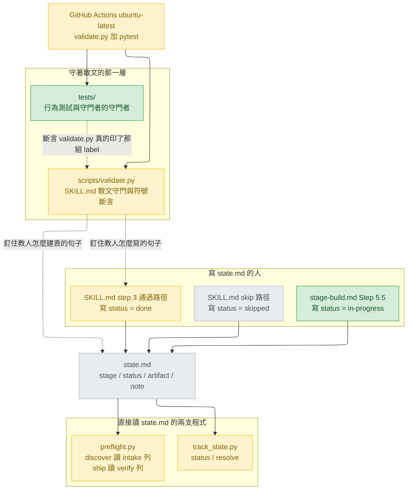
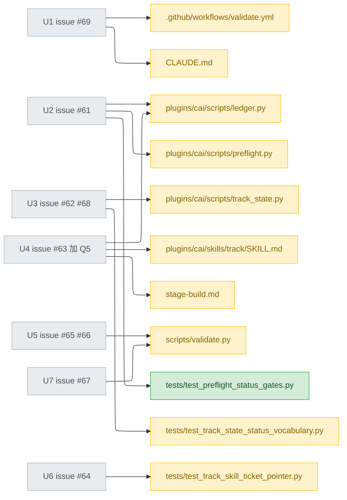
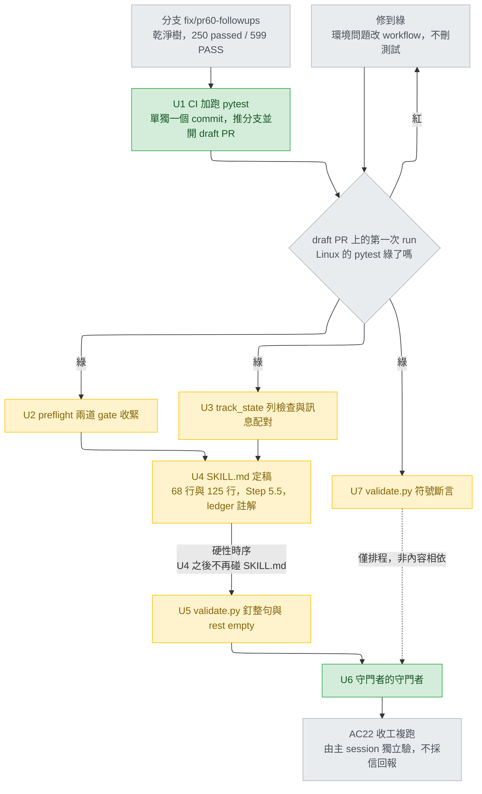
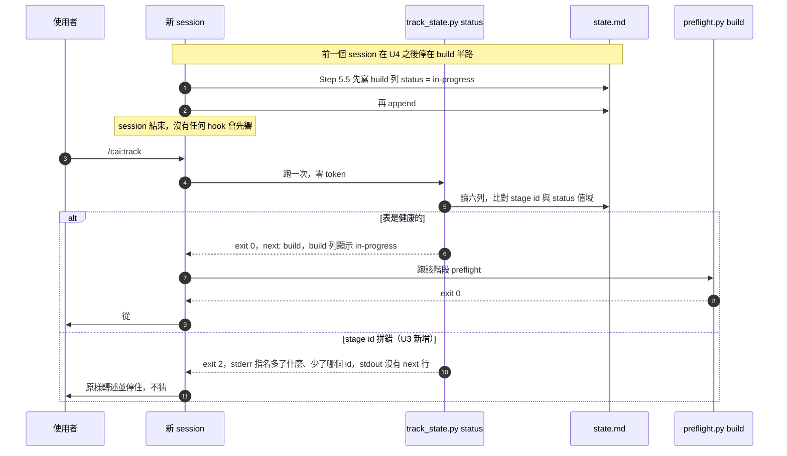
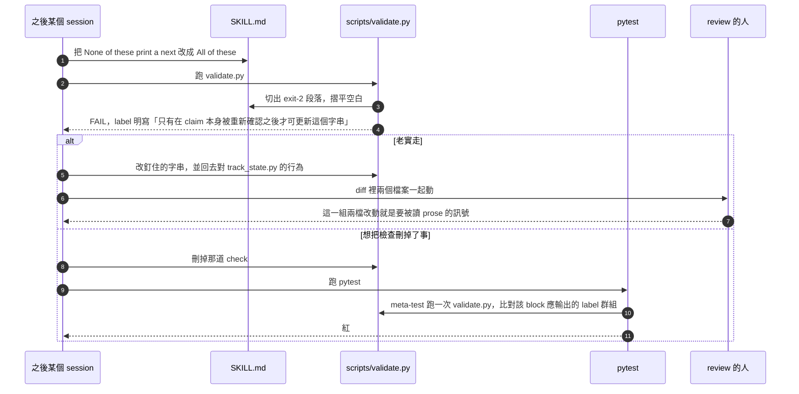

# pr60-followups — detail design

## Reference

High Level Design doc: docs/design/2026-08-27-cai-sdlc-restructure-high-level.md
Status: approved 2026-08-27

Gate 檢查（`stage-design.md` Detail 步驟 0）逐條在該檔本體上對過，不採信轉述：
`## Status` 第 5 行讀作 `approved 2026-08-27`；`## Open questions` 在該檔 376–384
行，開頭第 378 行言明「五項都在 2026-08-27 得到答案，逐條記錄」，其下五條各自帶著
答案；`## Use cases / Issues`（該檔 7–21 行）編號 UC1–UC7 與 R1–R4，共十一項。三項
皆通過。

本軌道修的是那份高階設計已核准、且已出貨的軌道機制上的九個缺口，所以參照它，而不是
另寫一份只為過 gate 的高階設計——與前一條軌道
（`docs/design/2026-09-06-track-status-vocabulary-detail.md:13`）同一個理由，措辭
沿用該檔。本文件的上游輸入是同軌道的 intake：
`docs/design/2026-09-06-pr60-followups-intake.md`（229 行，五項裁決、AC1–AC25、
七個工作單元、風險表）。

**模式與理由**：Detail，且**不做 option-weighing**。`stage-design.md` 的「When to
skip this stage entirely」第二條說「決定已經做完、只是要寫下來」是 dictation，要寫
文件但略去本階段存在的選項權衡。本軌道的五個開放決定已於 2026-09-06 全數由使用者
拍板（intake 第 24–30 行），故本文件不擺可行性投票、不擺選項表、不製造沒有人在做的
選擇。`## Design decisions` 記錄的是**既有決定的出處與代價**，加上 intake 明文交給
design 決的兩項實作細節，不是本階段新做的取捨。

### Traceability

高階設計的十一個 id 中，本軌道直接強化的是 UC1、UC6 與 R3；UC4 與 R4 不是被強化，而
是被本軌道自己的預算與排程守住，故同列 `covered`；其餘六項由已出貨的重整滿足，本軌道
只需不使其退化，列為 `unaffected`。「不受影響」一律寫出理由，不留空格。

| From the high-level design | Satisfied by | Status |
|---|---|---|
| UC1 — 新 session 只靠檔案就能接手 | U3 讓拼錯的 stage id 不再讓 `track_state.py status` 靜默 exit 0（`plugins/cai/scripts/track_state.py:138`）；U4 給 `in-progress` 寫入者，讓「停在半路」第一次能被檔案表達（`plugins/cai/skills/track/references/stage-build.md:206`） | covered |
| UC2 — 六階段各有唯一負責元件 | 不受影響：不動 `stages.json`、不新增或刪除任何 stage | unaffected |
| UC3 — 使用者知道該叫哪一個 | 不受影響：不新增、不改名任何 command 或 skill | unaffected |
| UC4 — always-on context 預算只降不升 | U4 只改 `SKILL.md` body 與無 frontmatter 的 `stage-build.md`，不動任何 `description:`；AC23 要求 `tests/test_track_skill_ticket_pointer.py:150` 的 `== 5427` 保持綠。**UC4 的成功判準是「低於 4,673」，今天是 5,427，尚未達成**——那是既有狀態，本軌道既不該也不能修它，只保證不把它推高 | not regressed |
| UC5 — cai 自足 | 不受影響：不引入任何執行期相依；U1 只在 CI 安裝 `pytest`，那是開發期工具，不進 plugin | unaffected |
| UC6 — 該用程式判斷的地方不花模型的錢 | 直接強化：U2 把兩道 gate 的謂詞從「非空」收成「屬於兩個值」（`plugins/cai/scripts/preflight.py:315`、`:417`）；U5、U7 把「這句散文還在不在」變成零 token 的字串比對 | covered |
| UC7 — 模型換代時改動集中一處 | 不受影響：不碰 `models.json`、不碰任何 frontmatter | unaffected |
| R1 — 72 個 alias 與 14 個主線元件 | 不受影響：不新增、不刪除任何元件目錄 | unaffected |
| R2 — 不得與既有元件搶觸發 | 不受影響：不新增任何會被模型自動觸發的元件 | unaffected |
| R3 — `python scripts/validate.py` 全綠 | AC22：收工時 exit 0、0 個 `FAIL`、`PASS` 不低於 599；U1 之後每個 PR 由 CI 在 Linux 上重跑一次 | covered |
| R4 — 遷移過程中 repo 隨時可用 | 七個單元各自是一個可用狀態；唯一硬性時序是 U4 早於 U5，其餘相依只是排程（`## Work breakdown`） | covered |

## Requirement

**問題**：`state.md` 這一份檔案有兩支程式直接讀它——`plugins/cai/scripts/track_state.py`
與 `plugins/cai/scripts/preflight.py`——兩者對同一格用不同的嚴格度；而「教人怎麼寫這
一格」的那幾句散文由第三支 `scripts/validate.py` 守著。三層執法強度不一致，而最外面那
一層自己沒人檢查。issue #46 的失敗形狀（所有自動檢查全綠、軌道靜默停住）因此還能
從至少四道門重新進來：非空但非法的 status 通過兩道 preflight gate（issue #61）、拼
錯的 stage id 對每一個讀者都隱形（issue #62）、`in-progress` 是合法值卻沒有寫入者
（issue #63）、守著散文的四道檢查自己可以被一次編輯刪掉（issue #64）。第五道是這些
保證裡的 `pytest` 那一半只在 Windows 上驗證過——`validate.py` 早已由既有 CI 在 Linux
上跑過八次全綠（`.github/workflows/validate.yml:14`，intake:64），缺的只有 `pytest`
（issue #69）。

**對誰**：跑 `/cai:track` 的人，以及照 `plugins/cai/skills/track/SKILL.md:80-82` 與
`plugins/cai/skills/track/references/stage-build.md:206` 寫 `state.md` 的模型。

**怎麼知道好了**：`state.md` 的三個可寫欄位（`stage` id、`status` 值、`SKILL.md` 裡
教人建表的那幾句散文）任一被寫成非法值、被拼錯、或被改寫成語義相反，在 push 之前一
定有紅燈；守著這件事的檢查本身被刪掉時，也一定有紅燈；而 Linux 由 CI 每個 PR 自動
覆蓋 `validate.py` 與 `pytest`。

驗收條件是 intake 交下的 AC1–AC25（`docs/design/2026-09-06-pr60-followups-intake.md:74`
起），逐條對應到單元與層級的表在 `## Verification`。本文件不改寫、不增刪任何一條。

## Glossary

| Term | Definition | Where it lives |
|---|---|---|
| `state.md` | 一條軌道的六列狀態表，每列一個 stage，欄位為 stage/status/artifact/note | plugins/cai/skills/track/SKILL.md:41 |
| status 值域 | `state.md` 的 status 格合法的四個值，空白也是其中之一 | plugins/cai/scripts/ledger.py:81 |
| `in-progress` | status 值域裡表示「這一階段已開始、尚未收工」的值 | plugins/cai/scripts/ledger.py:81 |
| `COUNTS_AS_FINISHED` | 本設計新增的常數，`("done", "skipped")`，兩道 preflight gate 放行的值 | new — plugins/cai/scripts/ledger.py |
| `ledger.OUTCOMES` | 附件帳本自己的五個結果詞，與 status 值域是兩套字彙 | plugins/cai/scripts/ledger.py:45 |
| `state_row()` | 依 stage id 在 `state.md` 表中找列；找不到回 `None` | plugins/cai/scripts/preflight.py:68 |
| `data_rows()` | 「什麼算一列」的唯一定義，表頭與分隔線在此被丟掉 | plugins/cai/scripts/preflight.py:49 |
| `intake_status` | `preflight discover` 的檢查名，讀 intake 列的 status | plugins/cai/scripts/preflight.py:316 |
| `verify_status` | `preflight ship` 的檢查名，讀 verify 列的 status | plugins/cai/scripts/preflight.py:417 |
| `bad_statuses()` | 回報 status 落在值域外的列 | plugins/cai/scripts/track_state.py:75 |
| `table_row_count()` | `state.md` 表實際有幾列，與 `stages.json` 比對 | plugins/cai/scripts/track_state.py:66 |
| 散文守門（anchored prose check） | 先切出 `SKILL.md` 的某一段，再在該段裡找一個字串 | scripts/validate.py:1429 |
| 釘整句（whole-sentence pin） | 把整句正規化空白後逐字比對，而不是找片段 | new — scripts/validate.py |
| 空白正規化（flatten） | 把換行與連續空格摺成單一空格後再比對 | new — scripts/validate.py |
| `TRACK_SKILL_MAX` | `SKILL.md` body 的行數天花板 | scripts/validate.py:1412 |
| `check()` label | `validate.py` 每道檢查印出的那一行字，`PASS`/`FAIL` 之後的全部 | scripts/validate.py:18 |
| 守門者的守門者（meta-test） | 斷言 `validate.py` 確實印出某一組 label 的測試 | new — tests/test_track_skill_ticket_pointer.py |
| 符號斷言（symbol assertion） | 斷言某個 docstring 點名的符號仍存在於原始碼裡 | new — scripts/validate.py |
| 突變測試（mutation） | 手動把程式或散文改壞、確認有紅燈、再還原 | concept |
| Step 5.5 | `stage-build.md` 裡「還沒做完就停下」的程序 | plugins/cai/skills/track/references/stage-build.md:206 |
| `## Handoff` | Step 5.5 append 進 `state.md` 的交接區塊 | plugins/cai/skills/track/references/stage-build.md:218 |
| always-on description budget | 所有元件 frontmatter description 的字元總和 | tests/test_track_skill_ticket_pointer.py:132 |
| `_run_validate()` | 測試裡共用的一次真實 `validate.py` 執行，模組層快取 | tests/test_track_skill_ticket_pointer.py:41 |
| `temp_repo()` | `validate.py` 建立拋棄式 git repo 的 helper，內含 git identity | scripts/validate.py:558 |

## Budgets

| What | Number | Where it comes from |
|---|---|---|
| `SKILL.md` body 行數（等式，不是上限） | 122 | tests/test_track_skill_ticket_pointer.py:107，配合 scripts/validate.py:1412 的天花板 |
| always-on description budget | 5427 | tests/test_track_skill_ticket_pointer.py:150 |
| `validate.py` 收工時的 `FAIL` 行數 | 0 | 主 session 2026-09-06 在 `fix/pr60-followups` 乾淨樹上實測 |
| `validate.py` 收工時的 `PASS` 行數下限 | 599 | 同上（基準線即 599） |
| `pytest` 收工時的 passed 數下限 | 250 | 同上（基準線 `250 passed in 44.58s`） |
| 一次 `python scripts/validate.py` 的牆鐘時間 | 29.6 | 本階段實測（2026-09-06，Windows，`Measure-Command`，29.5555773 秒） |
| `tests/test_track_skill_ticket_pointer.py` 單檔耗時 | 29.6 | 本階段實測（`6 passed in 29.55s`）——該檔成本**就是**一次 `validate.py` 執行 |
| 全套 `pytest` 基準耗時 | 44.58 | 主 session 實測 |
| 兩道 preflight gate 放行的 status 值個數 | 2 | 使用者裁決 Q2（`done`、`skipped`） |
| status 值域大小 | 4 | plugins/cai/scripts/ledger.py:81 |
| 工作單元數 | 7 | docs/design/2026-09-06-pr60-followups-intake.md:170 |
| 本軌道必須實跑的突變次數 | 7 | AC12、AC13 兩次、AC16 兩次、AC17、AC18 |
| `SKILL.md` 建表段被釘住的字串數 | 3 | 表頭、分隔線（scripts/validate.py:1461）＋ 本設計新增的 `rest empty` 子句 |
| CI job 數 | 1 | .github/workflows/validate.yml:7（不加 macOS matrix，使用者裁決 Q4） |
| CI 的 Python 版本 | 3.12 | .github/workflows/validate.yml:13 |
| `SKILL.md` 行寬上限 | 0 | 全檔無任何寬度檢查；第 3、87、88 行今天是 280/278/292 **位元組**（主 session 實測；以字元計略少，差在 em dash）且全綠，故「0」= 沒有這個約束 |
| plan-review 輪數上限 | 3 | stage-design.md Detail 步驟 8 |

## Design decisions

前五項是**既有決定的出處與代價**，不是本階段的取捨；後三項是 intake 明文交給 design
決、或本階段為了讓單元可執行而必須定下的實作細節。

**D1（來源：使用者 2026-09-06，Q1）— `in-progress` 給它寫入者，補完設計。**
出處：`docs/design/2026-09-06-pr60-followups-intake.md:26`。代價：`SKILL.md:68`
今天寫著「Only the passing path touches `state.md`; the rest append and stop.」，
這句在 Step 5.5 開始寫 status 格之後就是假的——issue #63 自己點名了這個衝突。所以
D1 一定連帶改寫 `SKILL.md:68`，而 `SKILL.md` 有 122 行等式，於是這是一換一的單行
改寫（AC9）。

**D2（來源：使用者 2026-09-06，Q2）— 兩道 gate 只放行 `done` 與 `skipped`。**
出處：intake:27。代價：`in-progress` 從此擋在 `discover` 與 `ship` 前面——這正是
Q5 想要的方向。**不可照抄 issue #61 的字面建議** `status in ledger.STATUSES`：
`plugins/cai/scripts/ledger.py:81` 的第一個元素是空字串，照抄會讓兩道 gate 比今天
**更鬆**（今天 `bool(status)` 至少擋得住空白）。

**D3（來源：使用者 2026-09-06，Q3）— #67 符號斷言、#65 步驟 2、#65 步驟 1 三項全
做。** 出處：intake:28。步驟 1（釘整句）在 intake 與主 session 都被建議不做，理由是
122 行等式逼著重排、而釘整句會讓每次合法重排都紅；使用者在看過這個代價後仍選它。
**因此誤報是本設計的預期行為，不是缺陷**：`SKILL.md` 與 `scripts/validate.py` 在
diff 裡同時出現，正是使用者買這個機制想看到的訊號（intake:34）。本文件不得以「太容
易誤報」為由改弱它，後續階段亦同。

**D4（來源：使用者 2026-09-06，Q4）— 平台覆蓋加進既有 workflow，不加 macOS
matrix。** 出處：intake:29。代價：macOS 仍然零覆蓋，這一點必須寫進文件（AC21），
而不是留給讀者猜。

**D5（來源：使用者 2026-09-06，Q5）— `/cai:track done` 也拒絕 `in-progress`。**
出處：intake:30。代價：改動落在 `SKILL.md:125-126`，必須關進 U4，不得留到 U5 釘字
串之後（AC25）。

**D6（本階段裁決，intake:196-203 明文交下）— 釘整句採「先正規化空白再比對」。**
兩種寫法都滿足 D3、都能讓 `None`→`All` 與插入 `never` 轉紅；差別只在誤報率。選正規
化版本，理由三條，全部可查：
(a) 語義反轉必然改動詞，正規化摺掉的只有換行與連續空格，**強度完全相同**；
(b) `SKILL.md` 的 122 行等式（`tests/test_track_skill_ticket_pointer.py:107`）逼著
每次加行都得在別處減一行，而最便宜的補償就是重排段落——逐字含換行比對會把這種合法
重排也判紅，付的是與機制無關的帳；
(c) 該檔**沒有任何行寬檢查**，第 3、87、88 行今天分別是 280、278、292 **位元組**（主
session 實測；以字元計略少，差在 em dash）且是綠的，所以重排在這個 repo 是合法且會發
生的動作，不是假想。
被放過的唯一情形是純粹改換行位置——那正是我們想放過的。

**D7（本階段裁決）— #66 用「延長既有的形狀檢查迴圈」，不用釘整段。**
issue #66 自己建議的修法就是把子句加進 `scripts/validate.py:1461` 那個 tuple，一個
註解涵蓋三段。釘整段會把 `:1461-1463` 兩道既有檢查吃掉，屬於改寫沒壞的東西
（`coding.md`「Surgical changes」）。AC12 只要求「至少一行 FAIL」，延長迴圈即滿足。

**D8（本階段裁決，plan-review 之後改判）— U6 的 meta-test 直接加進既有的
`tests/test_track_skill_ticket_pointer.py`，重用它現成的 `_run_validate()`，不另開新
檔、不動 `tests/conftest.py`。成本是零秒、一個檔。**
證據：`tests/test_track_skill_ticket_pointer.py:42-48` 這段註解是這個 repo 自己寫下
的立場——「每個測試各跑一次把套件從 13 秒拉到 90 秒；那麼慢的套件在時間壓力下就沒人
跑了，它守的 checkpoint 就變成裝飾」。本階段實測：一次 `validate.py` 是 29.6 秒，而
該測試檔單獨跑是 29.55 秒——**該檔的成本就是那一次執行**。新檔若自帶快取，全套從
44.58 秒變成約 74 秒（+66%），且 U1 之後每個 PR 的 CI 都付這筆。
**本文件初稿曾裁決把那次執行搬進 `tests/conftest.py` 的 session fixture**——同樣是零
秒，但要動 `conftest.py` 並改既有檔三個測試的簽名。plan-review 指出初稿只比較了三種
「開新檔」的寫法，漏掉最便宜的第四種：**直接加進那個已經在跑 `validate.py` 的檔**。
`coding.md` 的「Surgical changes」說不要改沒壞的東西，而 intake:178 本來就把 U6 的檔案
列為「`tests/`（新檔或既有檔）」——既有檔一直是被允許的。改判從之。
代價寫明：`test_track_skill_ticket_pointer.py` 從此裝兩個主題，所以 U6 要一併把該檔的
模組 docstring 擴寫，否則檔名與內容對不上。另一種同樣零秒的寫法是新檔 `from
test_track_skill_ticket_pointer import _run_validate`，但測試模組互相 import 會綁死
pytest 的 import mode，不寫進設計。

## Diagrams

模板要求的四種都在（architecture、component、flow、sequence），共**五個 mermaid 區塊：
三張 flowchart 加兩張 sequence**。Sequence 畫兩張：UC1（本軌道直接修的破口，也是 `in-progress` 第一
次有意義的場景）與 UC6（釘整句的「兩檔同時改動」訊號，D3 買的就是它）。**其餘九個
id 不畫 sequence**，理由一致：UC2、UC3、UC5、UC7、R1、R2 在 traceability 表裡是
`unaffected`，沒有本軌道造成的呼叫序可畫；UC4 與 R3 是收工時的數字檢查，不是一段流
程；R4 是排程性質，已由 Flow 圖表達。

### Architecture



### Component



### Flow



### Sequence — UC1

一個沒有任何對話記憶的新 session，接手一條停在 `build` 半路的軌道。今天這條路走不
通：沒有任何程式或指示寫得出 `in-progress`，所以「停在半路」在檔案裡表達不出來。



### Sequence — UC6

D3 買的訊號：把一句 claim 改成語義相反時，`SKILL.md` 與 `scripts/validate.py` 一定
一起出現在 diff 裡。



## Implementation spec

十個區塊，依單元分組（七個單元，其中 U1、U2、U3 各自把主體與它的測試或文件拆成兩個
區塊）。每一個都標明它重用什麼、住在哪裡。

### U1 — CI workflow 加跑 pytest

- **Responsibility** — 讓每個 PR 在 Linux 上自動跑一次 `validate.py` 與一次
  `pytest`。
- **Interface** — 不是程式介面，是 workflow 步驟。在
  `.github/workflows/validate.yml` 既有的 `validate` job 內、`- run: python
  scripts/validate.py`（該檔 :14）之前插入安裝步驟，之後插入測試步驟：

  ```yaml
        - run: python -m pip install --disable-pip-version-check pytest
        - run: python scripts/validate.py
        - run: python -m pytest
  ```
- **Data** — 無輸入輸出資料；`pytest` 的 rootdir 是 repo 根，`tests/conftest.py:17-20`
  負責把 `plugins/cai/scripts` 放上 `sys.path`。
- **Errors** — 任一步驟非零即整個 job 紅。AC20 明訂：**本 PR 至少一次 CI 綠燈就是這
  一條的證據；紅燈是必須修到綠的門檻，不是可略過的資訊。**
- **Concurrency** — 同一個 job 內三個步驟循序執行，沒有平行。不加 matrix（D4）。
- **Observability** — GitHub Actions 的 job log；`validate.py` 印 `PASS`/`FAIL` 行，
  `pytest` 印摘要行。
- **Where it lives** — `.github/workflows/validate.yml`，存在（14 行）。
- **What it reuses** — `.github/workflows/validate.yml:10-13` 既有的
  `actions/checkout@v4` 與 `actions/setup-python@v5`（Python 3.12）；不改它們。

### U1b — 平台覆蓋現況寫進文件

- **Responsibility** — 讓讀 repo 的人不必猜哪個平台被覆蓋（AC21）。
- **Interface** — 在 `CLAUDE.md` 的「Before pushing」段落裡加一段散文，明寫三句：
  Linux 由 CI 每個 PR 自動覆蓋 `validate.py` 與 `pytest`；Windows 為開發者手動；
  macOS 無覆蓋。
- **Data** — 無。
- **Errors** — 無執行期錯誤。
- **Concurrency** — 無。
- **Observability** — 無。
- **Where it lives** — `CLAUDE.md`，存在。
- **What it reuses** — 不觸發 `scripts/validate.py:267` 的 `@`-import 比對：該檢查
  只用 `^@plugins/cai/rules/([\w-]+)\.md$` 抓行，散文不在其列。

### U2 — preflight 兩道 gate 的謂詞

- **Responsibility** — 讓 `discover` 與 `ship` 只在前一階段真的收工（`done`）或明白
  跳過（`skipped`）時放行。
- **Interface** — 新常數與兩處改寫：

  ```python
  # plugins/cai/scripts/ledger.py，緊接 STATUSES 之後
  # The two values that mean a stage is not coming back. preflight's discover
  # and ship gates read exactly these -- not STATUSES, whose first element is
  # the empty string, so membership of it would let a blank cell through and
  # be looser than the bool(status) it replaces (#61).
  COUNTS_AS_FINISHED = ("done", "skipped")
  ```

  ```python
  # plugins/cai/scripts/preflight.py:314-316，discover()
  status = row[1] if len(row) > 1 else ""
  ok = status in ledger.COUNTS_AS_FINISHED
  return [(ok, "intake_status (intake row's status is %s)" % (status or "empty"))]
  ```

  ```python
  # plugins/cai/scripts/preflight.py:416-417，ship()
  status = row[1] if len(row) > 1 else ""
  status_check = (status in ledger.COUNTS_AS_FINISHED,
                  "verify_status (verify row's status is %s)" % (status or "empty"))
  ```
- **Data** — 輸入是 `state_row()` 回來的 cell list；輸出是 `(bool, str)` 這個
  preflight 全檔通用的檢查 tuple。
- **Errors** — `state_row()` 回 `None` 的路徑不變（`preflight.py:312-313`、`:414-415`
  仍回 `state_md (...)`）。**只有 `discover()` 的訊息要改**：`:316` 今天是
  `% (status if ok else "empty")`，不改的話 `passed` 會被印成 `is empty`，把一個非空
  的非法值講成空的，而這正是 issue #61 抱怨的那種誤導；改成 `% (status or "empty")`。
  `ship()` 的 `:417` 本來就已經是 `% (status or "empty")`，一個字都不必動。
- **Concurrency** — 純函式，無共享狀態，重跑同樣輸入得同樣結果。
- **Observability** — `PASS intake_status (...)` / `FAIL intake_status (...)`，名稱
  一字不改，所以 `scripts/validate.py:1050`、`:1058-1059`、`:1173`、`:1181-1182`
  四道既有檢查逐字不變地通過（AC4）。
- **Where it lives** — `plugins/cai/scripts/preflight.py` 與
  `plugins/cai/scripts/ledger.py`，皆存在。
- **What it reuses** — `plugins/cai/scripts/preflight.py:27-28` 已經 import
  `ledger`，所以新常數不新增任何 import 邊；`ledger.py:74-77` 已明文說值域住在
  `ledger.py` 是刻意的。

### U2b — U2 的新測試檔

- **Responsibility** — 用行為證明兩道 gate 的新值域，AC1–AC3。
- **Interface** — 新檔 `tests/test_preflight_status_gates.py`，以 `subprocess` 跑
  `preflight.py`，形狀比照 `tests/test_preflight_build_gate.py:43-46`。**十個案例，
  `discover` 與 `ship` 各五種輸入**（`passed`／`in-progress`／`done`／`skipped`／
  空白）：`discover` 對 `passed`、`in-progress` 各 exit 2 且 stdout 含
  `FAIL intake_status`；對 `done`、`skipped` exit 0；對空白 exit 2。`ship` 對同樣五
  種輸入，斷言的是 stdout 裡 `PASS verify_status` / `FAIL verify_status` 那一行，
  **不是退出碼**——`ship` 另有 `clean_tree` 與 `not_main_branch` 兩道檢查也決定退出
  碼，而用純 fixture 目錄（非 git repo）時那兩道必定 FAIL
  （`plugins/cai/scripts/preflight.py:419-421`）。
- **Data** — fixture 是一份六列 `state.md`，寫法比照
  `tests/test_preflight_build_gate.py:28-33`。
- **Errors** — 測試自身無錯誤路徑。
- **Concurrency** — 每個測試用自己的 `tmp_path`。
- **Observability** — pytest 的失敗輸出帶 `done.stdout`。
- **Where it lives** — `tests/test_preflight_status_gates.py`，**新檔**。
- **What it reuses** — `tests/conftest.py:17-20` 的 `sys.path` 設定；
  `tests/test_preflight_build_gate.py:23-46` 的 fixture 與 runner 形狀。
- **為何另開檔而不加進既有檔** — `tests/test_track_state_status_vocabulary.py` 是
  U3 的改動面，兩個單元可並行，撞在同一個檔就不能了（intake:186）。

### U3 — track_state 的 stage id 檢查

- **Responsibility** — 讓一個拼錯的 stage id 變成 exit 2，而不是讓那一階段永遠顯示
  為「未開始」。
- **Interface** —

  ```python
  # plugins/cai/scripts/track_state.py，取代 :66-72 的 table_row_count()
  def table_stage_ids(state_path):
      """The stage id in each of state.md's table rows, in file order. The
      definition of "a row" lives in preflight.data_rows() and only there."""
      with open(state_path, encoding="utf-8") as fh:
          return [cells[0] for cells in preflight.data_rows(fh.read())]
  ```

  ```python
  # plugins/cai/scripts/track_state.py，status()，取代 :137-141
  actual = table_stage_ids(state_path)
  if len(actual) != len(order):
      print("state.md has %d stage row(s), stages.json has %d"
            % (len(actual), len(order)), file=sys.stderr)
      return 2
  unexpected = [sid for sid in actual if sid not in order]
  missing = [sid for sid in order if sid not in actual]
  if unexpected or missing:
      print("state.md stage ids disagree with stages.json: unexpected %s; "
            "missing %s" % (", ".join(unexpected) or "none",
                            ", ".join(missing) or "none"), file=sys.stderr)
      return 2
  ```
- **Data** — 輸入是 `state.md` 路徑與 `stages.json` 的 id 順序；輸出是 exit code 加
  stderr 一行。
- **Errors** — 列數不符時**仍優先**印既有訊息（AC7）：新檢查排在既有比對之後，所以
  `scripts/validate.py:1536` 的 `short-track` fixture 行為逐字不變。id 不符時在印
  任何 stdout **之前**就 return 2，所以 stdout 不含 `next:`（AC5）。
- **Concurrency** — 純讀，無寫入，無共享狀態。
- **Observability** — stderr 一行，同時點名多了什麼與少了哪個 id。六個 id 全對時新
  程式碼一個字都不印，所以 stdout 與改動前逐字相同（AC6）。
- **Where it lives** — `plugins/cai/scripts/track_state.py`，存在（193 行）。
- **What it reuses** — `plugins/cai/scripts/preflight.py:49` 的 `data_rows()`——
  「什麼算一列」只有一個定義，`track_state.py:66-70` 的既有註解已經說明為什麼不能有
  第二種意見。
- **`SKILL.md` 不必跟著改** — `SKILL.md:27-29` 的 exit-2 段落寫的是「a `state.md`
  that is missing, disagrees with `stages.json`, or holds an unknown `status`」；
  「disagrees with `stages.json`」在改動前指列數、改動後同時指 id，句子仍然為真。
  這一點必須在 U5 釘住那一段之前確認過，本設計已確認。

### U3b — 錯誤訊息的斷言改為比對配對

- **Responsibility** — 讓 `track_state.py:148` 的格式字串參數對調會被那個名字寫著它
  在測的測試抓到（AC17）。
- **Interface** — 改寫
  `tests/test_track_state_status_vocabulary.py:55-63` 的
  `test_the_message_names_the_stage_the_value_and_the_four_legal_ones`，把逐項
  membership 換成整句比對，形狀沿用同檔 `:77-79` 已經在用的寫法：

  ```python
  legal = "(empty), in-progress, done, skipped"
  assert ("unknown status for intake: passed (expected one of %s)" % legal
          in done.stderr)
  ```
- **Data** — 無改變。
- **Errors** — 無。
- **Concurrency** — 無。
- **Observability** — pytest 失敗輸出。
- **Where it lives** — `tests/test_track_state_status_vocabulary.py`，存在（82 行）。
- **What it reuses** — 同檔 `:66-82` 的整句比對寫法。
- **範圍** — issue #68 提到「三個測試」比它們的名字弱，但 AC17 只點名這一個，另外兩
  個（`:36` 斷言 exit 0 與 `next: build`、`:44` 斷言 stdout 沒有 `next:`）斷言的是
  退出碼與某字串的**不存在**，沒有「配對」可比。**只改 AC17 點名的那一個**，不順手
  擴大。

### U4 — `in-progress` 的寫入者與兩處 `SKILL.md` 改寫

- **Responsibility** — 讓四個 status 值在出貨檔案裡都有出處，且每一個都有人寫。
- **Interface** — 四處，全部是散文或註解，落在三個檔案上：

  1. `plugins/cai/skills/track/references/stage-build.md`，Step 5.5（該檔 :206
     起），加在 `:223` 的程式碼區塊收尾**之後**、`:225` 的 `In flight: none` 那段
     **之前**。**不可加在範例之前**：`:214-215` 那句以冒號結尾並直接帶出 `:217` 的
     程式碼區塊，中間插進散文會讓那個冒號指向新段落而不是範例。新段明文要求：中途
     停止時，除了
     append `## Handoff`，同時把**這一階段自己在 `state.md` 的列**的 `status` 格寫成
     `in-progress`、`note` 格寫成 `unit <N> of <total>`（比照這個 repo 既有的 fixture
     慣例 `unit 3 of 5`，`scripts/validate.py:1495`）。該檔沒有任何行數或內容測試（主 session
     以 `grep -rn "stage-build" tests/ scripts/validate.py` 確認，只得
     `scripts/validate.py:1285` 的註解與 `:1324` 的檔名 regex），所以加行免費。
  2. `plugins/cai/skills/track/SKILL.md:68`，**一行換一行**。該行現行
     內容為「Only the passing path touches state.md; the rest append and stop.」，
     含前導三個空格共 70 字元（主 session 2026-09-06 實測）。**新句逐字如下**，前導
     三個空格照留，仍是單一行，長度不受限（見 `## Budgets` 的行寬列）：

     ```text
        Only the passing path overwrites a row from here; the rest append and stop. The one other writer anywhere is `stage-build.md`'s Step 5.5, which sets that stage's own `status` to `in-progress` when a run stops before its units are finished.
     ```

     這裡給逐字內容而不是語意描述，因為兩個 only 各自在做事：第一個限定 step 3 這條
     路徑，第二個限定全域只有一個例外。掉了任何一個，讀者就會以為還可能有沒被寫下來
     的寫入者——那正是 D1 要關掉的那道縫。這一行不是 U5 釘住的兩句之一，也沒有任何測
     試守得住它，只有 review 守得住。
  3. `plugins/cai/skills/track/SKILL.md:125-126`，**兩行換兩行，但只換其中一句**。
     `:125` 的前半是上一句的結尾——delete `.claude/track/current`.——必須原封不動留
     著；要改的只有從 `Refuse if` 起、到 `:126` 的 `report which ones.` 為止那一句。
     改成拒絕「空白**或** `in-progress`」並回報是哪一種（AC25），替換後兩行仍是兩行。
     **整段替換 `:125-126` 會靜默刪掉「刪 `current`」這條出貨指示，而 122 行等式與
     `validate.py:1418` 都不會紅**——沒有任何自動檢查抓得到，只有 review 抓得到。
  4. `plugins/cai/scripts/ledger.py:72-81` 的 `STATUSES` 註解，補上四個值各自的寫入
     者：`done` 與 `skipped` 由 `SKILL.md` 的 Running a stage 步驟 3 寫，
     `in-progress` 由 `stage-build.md` 的 Step 5.5 寫，空白是還沒有人走到的列
     （AC11）。
- **Data** — 無程式資料流改變。
- **Errors** — 唯一的失敗模式是行數：`SKILL.md` body 必須仍讀作 122
  （`tests/test_track_skill_ticket_pointer.py:107` 是等式，不是上限）。兩處改寫都
  是等行數替換，所以不動用任何補償重排。
- **Concurrency** — 無。
- **Observability** — `scripts/validate.py:1418` 印出實際行數；
  `tests/test_track_skill_ticket_pointer.py:80-91` 交叉比對該數字。
- **Where it lives** — 三個檔案皆存在。
- **What it reuses** — Step 5.5 已經在教人寫 `state.md`（`stage-build.md:215`
  「append to `state.md`」），本次只是把它從「append 一段」擴成「同時覆寫一格」。
- **U4 之後本軌道不再碰 `SKILL.md`** — 這是本軌道唯一的硬性時序，理由見
  `## Work breakdown`。

### U5 — 釘整句、失敗訊息帶指示、寫下慣例

- **Responsibility** — 讓 `SKILL.md` 裡兩句斷言行為的散文被改成語義相反時，
  `validate.py` 紅；並讓看到那個紅燈的人知道該去重新確認什麼。
- **Interface** — 一個 helper 加四處改動，全部在
  `scripts/validate.py` 的 `if os.path.isfile(TRACK_SKILL):` block 內（該檔
  :1414-1477）：

  ```python
  def flattened(text):
      """One-line form of a Markdown paragraph: newlines and runs of spaces
      folded to a single space. Pinning the flattened form is what lets a
      legitimate rewrap through -- and SKILL.md's 122-line equality forces
      rewraps -- while a reversed claim still fails, because a reversal
      always changes a word (#65)."""
      return " ".join(text.split())
  ```

  1. 取代 `:1429-1430` 的片段比對。`PASSED_MARKER` 與 `passed_bullet` 的切法
     （:1425、:1427-1428）不動，改成把整段摺平後與一個釘住的常數**相等**比對：

     ```python
     # PASSED_CLAUSE must equal flattened(passed_bullet) on the U4-final tree.
     # That is NOT the whole of SKILL.md:80-82: validate.py:1427 splits on
     # PASSED_MARKER and keeps only what follows it, so the leading
     # `   - **It passed**` is not part of the value; it starts at "→ `passed`".
     # Derive it mechanically once U4 has landed -- print flattened(passed_bullet)
     # and paste exactly what it printed. A value retyped from the line numbers
     # makes this check FAIL on a correct tree.
     PASSED_CLAUSE = <the string that printing flattened(passed_bullet) produced>
     check("plugins/cai/skills/track/SKILL.md's passing-path bullet is pinned "
           "word for word -- this claim is about what the model writes into "
           "state.md, no test can hold it and only review can; update this "
           "pinned string only after re-confirming the claim itself",
           flattened(passed_bullet) == PASSED_CLAUSE)
     ```

  2. 取代 `:1476-1477` 的片段比對，同樣改為摺平後相等，label 指向**它自己的**真相
     來源：

     ```python
     # EXIT_CLAUSE must equal flattened(exit_para) on the U4-final tree. Same
     # trap: validate.py:1473-1474 splits on EXIT_MARKER, so the value does not
     # contain "Exit 2 from either"; it starts at " means stop and report".
     # Derive it by printing flattened(exit_para); never retype it by eye.
     EXIT_CLAUSE = <the string that printing flattened(exit_para) produced>
     check("plugins/cai/skills/track/SKILL.md's exit-2 paragraph is pinned "
           "word for word -- update this pinned string only after re-confirming "
           "the claim against track_state.py's exit-2 paths and "
           "tests/test_track_state_status_vocabulary.py:51",
           flattened(exit_para) == EXIT_CLAUSE)
     ```

  3. `:1461` 的 tuple 延長一個元素（D7、AC12）。字面值是建表句的後半子句，逐字取自
     `SKILL.md:42`：從 one row naming each 起、到該行結尾的 rest empty. 為止，含中間
     stages.json 的反引號。該迴圈於是共釘三個字串、印三行 label——U6 的
     `SHAPE_FRAGMENT` 計數 `== 3` 依賴的就是這三行。

  4. 該 block 內加一段註解寫下慣例（AC15）：claim 若是關於程式碼，先加行為測試、散文
     守門只負責證明句子還在（`:1476` 是這一型，行為由
     `tests/test_track_state_status_vocabulary.py:51` 守）；claim 若是關於模型該寫什
     麼，全部重量落在釘住的字串上（`:1429` 是這一型），該段散文的任何改動一律當行為
     變更審。
- **Data** — 輸入是 `SKILL.md` 全文；輸出是 `PASS`/`FAIL` 行。
- **Errors** — **合法重排不會紅**（摺平的用意）；**任何加字、減字、換字都會紅**，包
  括作者自己的合法改寫。後者是預期行為（D3），修法是同時更新釘住的常數，於是
  `SKILL.md` 與 `scripts/validate.py` 一起出現在 diff 裡。
- **Concurrency** — 無。
- **Observability** — 兩道 check 的 label 就是失敗當下讀者唯一保證會看到的地方，指示
  必須寫在 label 裡而不是註解裡（AC14；`scripts/validate.py:18-22` 只印 label）。
- **Where it lives** — `scripts/validate.py`，存在。
- **What it reuses** — `:1425-1428` 與 `:1473-1475` 既有的段落切法，一個字不改——本
  單元只換「切出來之後怎麼比」。

### U7 — 符號斷言

- **Responsibility** — 讓 `ledger.py` docstring 點名的兩個符號被改名時有紅燈。
- **Interface** — 在 `scripts/validate.py` 的 `TRACK_STATE` 常數（:1484）附近加：

  ```python
  # ledger.py's docstring names two symbols it deliberately copies from
  # track_state.py rather than importing, and names them instead of citing
  # lines because the lines had drifted twice (plugins/cai/scripts/ledger.py:20-25).
  # A rename leaves that paragraph pointing at nothing.
  # Anchored to the start of a line rather than a bare substring: the text
  # `def stage_ids` also occurs in any comment that mentions it, so a rename
  # that left one comment behind would keep a substring test green.
  track_state_text = read_text(TRACK_STATE)
  for symbol in ("def stage_ids", "class ArgParser"):
      check(f"track_state.py still defines {symbol}, which "
            f"{PLUGIN}/scripts/ledger.py's docstring names as copied from it",
            re.search(rf"^{symbol}\b", track_state_text, re.M) is not None)
  ```
- **Data** — 輸入是 `track_state.py` 全文；輸出兩行 `PASS`/`FAIL`。
- **Errors** — 改名會連帶弄壞 `track_state.py` 自己（`stage_ids()` 在 `:136` 被自己
  呼叫），所以 AC16 的驗收條件是「至少一行 FAIL 且**點名這個符號檢查**」，不是「恰
  好一行」。兩個符號各一道 check，所以 FAIL 行自己說得出是哪一個。
- **Concurrency** — 無。
- **Observability** — 兩行 label，各自帶符號名。
- **Where it lives** — `scripts/validate.py`，存在。
- **What it reuses** — `scripts/validate.py:25-31` 的 `read_text()`；`TRACK_STATE`
  常數（:1484）本身。

### U6 — 守門者的守門者

- **Responsibility** — 讓「刪掉 U5 或 D7 新增／改寫的任一道 check」轉紅（AC18），而
  「一次合理的 label 措辭調整」不轉紅（AC19）。
- **Interface** — **一個檔案**：`tests/test_track_skill_ticket_pointer.py`。在該檔尾端
  加下面這段，重用它現成的 `_run_validate()`（該檔 `:41`），不新增任何一次執行：

     ```python
     # --- the guards over SKILL.md's prose are themselves guarded (#64) ------

     # One short, stable fragment per guard in validate.py's TRACK_SKILL block.
     # Fragments rather than whole labels: a reasonable rewording of a label
     # must not turn this red, but deleting a guard must.
     GUARD_FRAGMENTS = ("passing-path bullet", "--outcome line",
                        "exit-2 paragraph")
     SHAPE_FRAGMENT = "shows state.md's table shape"

     def test_every_prose_guard_in_the_track_skill_block_still_runs():
         out = _run_validate().stdout
         for fragment in GUARD_FRAGMENTS:
             assert fragment in out, fragment
         # The three table-shape guards share one label shape, so a fragment
         # test alone still passes with one of them deleted. Count instead.
         shapes = [l for l in out.splitlines() if SHAPE_FRAGMENT in l]
         assert len(shapes) == 3
     ```

  同時把該檔的模組 docstring 擴寫成兩個主題——「`SKILL.md` 為 ticket mirroring 加的那
  一行」與「守著 `SKILL.md` 散文的那組 check」——否則檔名與內容對不上（D8 的代價）。
  `tests/conftest.py` 一個字都不動，既有三個測試的簽名也一個字都不動。
- **Data** — 輸入是一次 `validate.py` 執行的 stdout；輸出是 pass/fail。
- **Errors** — 建表段的三個釘住字串共用同一個 label 形狀，所以**只比對片段會漏**——
  刪掉三個之中的一個，另外兩個仍印出同一個片段。因此那一項改用行數 `== 3`。這個 3
  是預算，不是硬編的完整字串，和這個 repo 既有的 `== 122`、`== 5427` 同一型。
- **Concurrency** — 沿用 `_run_validate()` 既有的模組層快取，整個模組共用那一次執行；沒有平行寫入。
- **Observability** — pytest 失敗訊息帶著漏掉的 fragment。
- **Where it lives** — `tests/test_track_skill_ticket_pointer.py`（存在，162 行），
  本單元唯一動到的檔。
- **What it reuses** — 同檔 `:41-53` 的 `_run_validate()` 與它的模組層快取，原地重用，
  不搬家也不重寫；`:44` 的註解已經說明了為什麼只跑一次。
- **範圍** — 斷言 `TRACK_SKILL` block 的 label 群組，含 `--outcome line` 那一道。
  **`--outcome line` 不是 U5／D7 動到的**，但守它不是加戲：issue #64 的標題就是
  「Deleting the three new prose guards in validate.py turns nothing red」，它內文列的
  三道正是 `--outcome`（`:1446`）、兩個表格形狀（`:1462`）與 exit-2（`:1476`）。守這
  三道就是 #64 的需求本身。**不涵蓋 U7 的兩道符號斷言**：
  AC18 的字面是「U5 或 D7 新增／改寫的任一個 check」，U7 不在其內；而 issue #67 自己
  警告不要讓這種檢查長成一套「註解正確性框架」。該測試的 docstring 要寫明只守這一個
  block、不推廣的理由（intake 風險表第三列）。

## Naming

本軌道不建立任何出現在使用者可見輸出、`state.md`、或 `SKILL.md` 散文裡的**新名字**：
`in-progress` 早在 `plugins/cai/scripts/ledger.py:81` 就是合法值，兩道 preflight
gate 的檢查名 `intake_status`／`verify_status` 一字不改（AC4 要求如此）。下表全部是
內部名，各自沿用本 repo 已經看得見的慣例。

| Name | What it is | Chosen by |
|---|---|---|
| `COUNTS_AS_FINISHED` | `ledger.py` 常數，兩道 preflight gate 放行的兩個 status 值 | 沿用同檔 `COUNTS_AS_RETRY` 的「這個集合被當作什麼」命名形狀，plugins/cai/scripts/ledger.py:52 |
| `table_stage_ids` | `track_state.py` 函式，回傳表中各列的 stage id | 沿用同檔被它取代的 `table_row_count`，plugins/cai/scripts/track_state.py:66 |
| `flattened` | `validate.py` helper，把段落摺成一行 | 沿用同檔 helper 不加底線前綴的慣例，scripts/validate.py:25 的 `read_text` |
| `tests/test_preflight_status_gates.py` | U2 的新測試檔 | 沿用 `test_<被測主題>.py`，tests/test_preflight_build_gate.py:1 |
| `GUARD_FRAGMENTS` / `SHAPE_FRAGMENT` | U6 測試檔的模組常數 | 沿用測試檔以大寫模組常數持有 fixture 資料的作法，tests/test_track_state_status_vocabulary.py:14 |
| `test_every_prose_guard_in_the_track_skill_block_still_runs` | U6 的測試函式名 | 沿用「整句敘述它在斷言什麼」的長函式名，tests/test_track_state_status_vocabulary.py:66 |
| validate.py 新增／改寫的 check label | `PASS`/`FAIL` 之後那一行字 | 沿用 `<檔案> <該做到什麼> (<被釘的值或說明>)` 形狀，scripts/validate.py:1429、:1446、:1462、:1476 |

## Change points

| Path | Change | Exists today |
|---|---|---|
| `.github/workflows/validate.yml` | 同一個 job 內加兩個步驟：安裝 `pytest`、跑 `python -m pytest` | yes |
| `CLAUDE.md` | 「Before pushing」段加平台覆蓋現況三句（AC21） | yes |
| `plugins/cai/scripts/ledger.py` | 加 `COUNTS_AS_FINISHED`（U2）；改寫 `STATUSES` 的註解點名四個值的寫入者（U4） | yes |
| `plugins/cai/scripts/preflight.py` | `discover()` 與 `ship()` 的 status 謂詞與訊息（兩處） | yes |
| `plugins/cai/scripts/track_state.py` | `table_row_count()` 換成 `table_stage_ids()`；`status()` 加 id 比對 | yes |
| `plugins/cai/skills/track/SKILL.md` | `:68` 一行換一行；`:125-126` 兩行換兩行。**只在 U4 動，之後不再碰** | yes |
| `plugins/cai/skills/track/references/stage-build.md` | Step 5.5 加寫 `status` = `in-progress` 的指示 | yes |
| `scripts/validate.py` | 兩道散文守門改為釘整句、label 帶指示；建表段釘住 `rest empty`；加慣例註解；加兩道符號斷言 | yes |
| `tests/test_track_state_status_vocabulary.py` | 一個測試改為整句比對 | yes |
| `tests/test_preflight_status_gates.py` | 新增 | no |
| `tests/test_track_skill_ticket_pointer.py` | 尾端加一個 meta-test，重用該檔既有的 `_run_validate()`；模組 docstring 擴寫成兩個主題 | yes |
| `docs/design/2026-09-06-pr60-followups-detail.md` | 本文件，需 `git add -f`（`.gitignore:15` 忽略 `docs/`） | yes |

**新相依**：`pytest`，只在 CI 安裝，**不釘版本**——`CLAUDE.md` 的「Before pushing」
本來就寫著 `pip install pytest` 且全 repo 沒有任何版本釘法，CI 照抄那句是與既有指示
一致的最小動作。代價寫在 `## Failure modes`。plugin 本身的執行期相依維持為零
（`plugins/cai/scripts/ledger.py:2` 的 "Zero deps"）。

**與 intake 的三處差異，明寫**（第三處在 `## Work breakdown` 的「U5 與 U7 不可並行」
小節，因為它是排程差異而不是檔案差異）：
1. intake:173 把 U2 的檔案列為「`preflight.py` ＋新測試檔」，本設計讓 U2 也在
   `ledger.py` 加一個常數。理由：前一條軌道的 AC3 已定「合法值域只定義一次、別處不得
   有第二份字面清單」，把 `("done", "skipped")` 寫進 `preflight.py` 會製造第二份。
   U2 早於 U4，兩者都動 `ledger.py` 但區塊相鄰不重疊，且本來就是循序。
2. intake:178 把 U6 的檔案列為「`tests/`（新檔或既有檔）」，本設計選新檔**加上**
   `conftest.py` 與既有檔的機械改動。理由與量測見 D8。

## Failure modes

| Situation | What happens | What the caller sees |
|---|---|---|
| CI 第一次在 Linux 跑 `pytest` 就紅 | U1 是單獨一個 commit，樹與 `main` 只差一個 workflow 檔，紅燈歸因面最小 | GitHub Actions job log；紅燈的原因不可能是本軌道其他改動 |
| 紅燈是 CI 環境問題而非程式缺陷 | 修 workflow，**不刪測試**（intake 風險表第一列） | job log |
| `pytest` 未釘版本，未來某個新版改變行為 | CI 在與本 repo 無關的原因下轉紅 | job log；修法是在該步驟釘一個版本，是一行改動 |
| 一條在飛的軌道，`verify` 列是 `in-progress` | U2 之後 `preflight ship` 擋下它 | `FAIL verify_status (verify row's status is in-progress)`；出路是把該階段做完寫 `done`，或 `/cai:track skip verify` |
| 一條在飛的軌道，任一列是 `in-progress` 就想收工 | U4 之後 `/cai:track done` 拒絕 | 「哪些列是空白、哪些列是 `in-progress`」的清單（AC25） |
| `state.md` 有一列 stage id 拼錯 | `track_state.py status` exit 2，stdout 不印 `next:` | `state.md stage ids disagree with stages.json: unexpected desgin; missing design` |
| `state.md` 列數就不對 | 既有訊息優先，新檢查不搶先（AC7） | `state.md has 5 stage row(s), stages.json has 6` |
| 有人合法重排 `SKILL.md` 被釘住的段落 | 摺平後仍相等，**不紅**（D6） | 無 |
| 有人把被釘住的句子改成語義相反 | `validate.py` FAIL，label 說要先重新確認 claim 才能改字串 | 兩個檔案一起出現在 diff 裡——這是 D3 買的訊號，不是缺陷 |
| 有人把 `SKILL.md` 加一行、在別段減一行來守 122 | 若減的那一段正是被釘住的三段之一，`validate.py` 紅 | 同上；這是預期成本 |
| 有人刪掉 U5 或 D7 的任一道 check | `validate.py` 仍 exit 0，但 U6 的 meta-test 紅 | pytest 失敗訊息帶漏掉的 fragment |
| 有人把 `track_state.py` 的 `stage_ids` 改名 | `validate.py` 至少兩類紅（符號斷言＋連帶壞掉的既有檢查） | 符號斷言那一行點名該符號（AC16） |
| 有人改掉 `ledger.py` docstring、拿掉那兩個符號名 | 符號斷言仍綠，但它守的前提沒了 | 無紅燈——**已知極限**，見「刻意不做」 |
| 突變測試忘了還原 | 工作樹髒，`preflight ship` 的 `clean_tree` 擋下 | `FAIL clean_tree (working tree has uncommitted changes)` |
| 本文件沒有 `git add -f` | PR 裡看不到設計文件 | 無紅燈——`.gitignore:15` 靜默忽略；列為 ship 的檢核項 |

## Rollout

**能不能分批出？** 能，七個單元每一個自己就是一個可用狀態（R4）。最小可用的第一片是
**U1**：它只加一個 workflow 檔的兩個步驟。`pytest` 從未在 POSIX 上跑過，此刻是最便宜
的發現時機（intake:180-182）。`.github/workflows/validate.yml:2-5` 的觸發條件是 `push`
到 `main` 加 `pull_request`，而 `fix/pr60-followups` 兩者都不是，所以在這條分支上 push
**不會觸發任何 workflow**。**U1 的收尾因此有三步，順序固定**：(1) commit workflow 檔
與 `CLAUDE.md`；(2) push `fix/pr60-followups`；(3) **開一個 draft PR**。GATE1 讀的就是
那個 draft PR 上的第一次 run。`ship` 階段之後把這個 draft **轉正**，不另開第二個 PR。

**這一步的授權範圍要寫清楚**：使用者 2026-09-06 是為了「拿到 Linux 的第一次結果」這個
**單一目的**授權開 draft PR。那不是 merge、tag 或 publish 的授權——`SKILL.md` 的第二道
human gate（ship 的不可逆操作之前要人確認）原封不動仍然成立。

**既有資料怎麼辦——遷移或回填？** 沒有回填。`state.md` 的檔案格式一個字都不變，值域
（四個值）一個都不增不減。**但有一件行為變更會影響已經存在的軌道**：U2 之後，
`intake` 或 `verify` 列是 `in-progress` 的在飛軌道會被 `discover`／`ship` 的 gate 擋
下；U4 之後，任一列是 `in-progress` 的軌道會被 `/cai:track done` 拒絕。兩者都是使用
者裁決 Q2 與 Q5 直接要的方向，出路是把那一階段做完或明白 skip，不需要改任何檔案格式。
今天實際上不會有這種軌道——`in-progress` 目前沒有任何寫入者（issue #63），所以受影響
的只有本軌道之後才產生的軌道。

**落地當下會弄壞誰？** 三件，全部在 repo 內。(a) 有紅燈；(b) 在 D8 改判之後已經不算破壞，留著是因為它仍有一件必須一起做的事；(c) **沒有**紅燈——那正是它值得寫在這裡的原因：
(a) U4 動 `SKILL.md` 而 U5 已經釘住其中一段——所以 U4 必須早於 U5（見
`## Work breakdown`）；
(b) U6 只在 `tests/test_track_skill_ticket_pointer.py` 尾端加一個 meta-test，不動
`conftest.py`、不動既有測試的簽名，所以沒有「改到一半樹是壞的」那個中間狀態；要一併
做的只有把該檔的模組 docstring 擴寫成兩個主題（D8 改判後的代價）；
(c) `.claude/settings.json` 註冊的 `PostToolUse` hook 只在 **Edit 或 Write** 碰到
`plugins/cai/` 或 `.claude-plugin/` 時跑 `scripts/validate.py`。**經 Bash 寫的檔案不
會觸發**，所以任何用重導向、腳本或 `git apply` 改過這兩個目錄的動作，都要手動補跑
`python scripts/validate.py`（`CLAUDE.md`「Before pushing」）。

**回退是什麼？** `git revert` 該單元的 commit，沒有任何持久化狀態要清。七個單元一
commit 一單元（`stage-build.md` Step 3 第 5 點），所以回退粒度就是單元粒度。唯一需要
按順序回退的是 U4 與 U5：U5 釘的是 U4 定稿的句子，先退 U4 會讓 U5 的釘子紅。

**文件進不進 PR：** `.gitignore:15` 忽略整個 `docs/`，所以本文件與 intake 都要
`git add -f docs/design/2026-09-06-pr60-followups-detail.md` 才會進 PR。前兩條軌道都
踩過這一顆（intake 風險表第五列）。列為 ship 階段的檢核項。

**PR 內文**（AC24）必須點名九張 issue 各自如何關閉，並寫明兩項刻意不做：
(a) `preflight` 對拼錯 id 仍回 `state_md (cannot read state.md ...)` 這個誤導性措辭；
(b) issue #65 自己列為 not-recommended 的三種做法（反轉黑名單、從 schema 生散文、語義
斷言）皆不採用。

### 刻意不做

- **不加 macOS matrix**（D4／使用者裁決 Q4）。
- **不給 `validate.yml` 加 `workflow_dispatch`**。「不開 PR、手動觸發一次就好」這條路
  在這裡行不通，已查證：GitHub 官方文件
  （https://docs.github.com/en/actions/reference/workflows-and-actions/events-that-trigger-workflows）
  寫著「This event will only trigger a workflow run if the workflow file exists on
  the default branch.」而 U1 是在 feature branch 上加這個 trigger，合進 `main` 之前根
  本叫不到。記在這裡，下一個讀者就不必重查一次。
- **不改 `MANUAL.md:137,144` 的措辭**——D2 的直接後果是程式追上文件已宣稱的行為，
  文件本來就是對的（AC4 把「不必改」本身當成語義對齊的證據）。
- **不改 `preflight` 對拼錯 id 的誤導性訊息**。surgical，不順手擴大。
- **不採用 issue #65 自列的三種 not-recommended 做法**。
- **不加「`ledger.py` docstring 仍點名那兩個符號」這第三道斷言**。它會補上
  `## Failure modes` 裡「有人改掉 `ledger.py` docstring」那一列的已知極限，但 issue
  #67 明白警告這種檢查不該長成一套
  註解正確性框架，而 AC16 的字面只要求 `track_state.py` 那一側。留成已知極限，寫在
  該 block 的註解裡。
- **不改 `tests/test_track_state_status_vocabulary.py` 另外兩個測試**（U3b 的範圍
  說明）。
- **本軌道未設 ticket pointer**——九張 issue 沒有單一代表號（intake:229）。

## Verification

AC1–AC25 逐條。「Green before」是那一條必須在哪個單元合併之前是綠的。七次刻意突變
另外標注。

**突變紀律（本 repo 學過一次的帳）**：任何刻意改壞之前**先 commit**；還原一律用
Edit 把改動改回去，**不要用 `git checkout`**——它還原的是「到 HEAD」，不是「撤銷剛
才那一筆」，在一棵還有其他未提交改動的樹上會一起抹掉。突變之後確認 `git diff` 為空
再繼續（intake 風險表第四列）。

| Criterion | Level | What it needs | Green before |
|---|---|---|---|
| AC1 `intake` 列為 `passed`／`in-progress` 時 `preflight discover` exit 2 且含 `FAIL intake_status` | integration | `tests/test_preflight_status_gates.py` 的六列 fixture | U2 合併 |
| AC2 同 gate 對 `done`/`skipped` exit 0，對空白仍 exit 2 | integration | 同上 | U2 合併 |
| AC3 `ship` 的 `verify_status` 對 `passed`/`in-progress` FAIL、對 `done`/`skipped` PASS、對空白 FAIL | integration | 同上 | U2 合併 |
| AC4 `scripts/validate.py:1050`、`:1058`、`:1173`、`:1181` 逐字不變地通過；`MANUAL.md:137`、`:144` 不需改動 | end-to-end | 一次完整 `validate.py` 執行 | U2 合併 |
| AC5 拼成 `desgin` 後 `track_state.py status` exit 2、stderr 同時指名多的與少的、stdout 無 `next:` | integration | 一份拼錯的 `state.md` fixture | U3 合併 |
| AC6 六個 id 全對時 stdout 與改動前逐字相同 | integration | 改動前後各一次輸出比對 | U3 合併 |
| AC7 列數不符時仍先印既有訊息；`validate.py:1536` 的 `short-track` 行為逐字不變 | end-to-end | 一次完整 `validate.py` 執行 | U3 合併 |
| AC8 `stage-build.md` Step 5.5 明文要求同時寫 `status` = `in-progress` | 人工複核 | 讀該檔 | U4 合併 |
| AC9 `SKILL.md:68` 改寫後仍為單一行、body 仍 122 | end-to-end | `validate.py:1418` 與 `tests/test_track_skill_ticket_pointer.py:107` | U4 合併 |
| AC10 含 `in-progress` 列的軌道仍 exit 0 且列為 `next:`；`tests/test_track_state_gate.py:50` 保持綠 | unit | 既有測試 | **U3 合併**——唯一會弄壞它的是 U3 改寫 `status()`；U4 一行都不碰 `track_state.py`，U4 合併時再複跑一次 |
| AC11 `ledger.py:81` 的註解點名 `in-progress` 的寫入者是 Step 5.5 | 人工複核 | 讀該檔 | U4 合併 |
| AC12 **突變 1**：`SKILL.md:42` 的 `rest empty` 改成別的字 → `validate.py` 至少一行 `FAIL` | end-to-end（突變） | 先 commit；改字；跑；讀輸出；Edit 還原；`git diff` 為空 | U5 合併 |
| AC13 **突變 2**：`SKILL.md:29` 的 `None` 改成 `All` → `FAIL` | end-to-end（突變） | 同上 | U5 合併 |
| AC13 **突變 3**：`SKILL.md:80-82` 在 `overwrite` 前插入 `never` → `FAIL` | end-to-end（突變） | 同上 | U5 合併 |
| AC14 兩道 check 的 label 各自帶「重新確認 claim 之後才可更新字串」的指示，且指向各自正確的真相來源 | end-to-end | 讀 `validate.py` 的**實際輸出文字**，不讀原始碼 | U5 合併 |
| AC15 該 block 內有註解寫下慣例（程式類 claim 先加行為測試；模型類 claim 全靠釘字串） | 人工複核 | 讀 `validate.py` | U5 合併 |
| AC16 **突變 4／5**：`track_state.py:32` 的 `def stage_ids` 改名、`:163` 的 `class ArgParser` 改名，各自讓 `validate.py` 至少一行 FAIL 且點名該符號檢查 | end-to-end（突變兩次） | 先 commit；改名；跑；讀輸出；Edit 還原；`git diff` 為空 | U7 合併 |
| AC17 **突變 6**：`track_state.py:148-149`（格式字串在 `:148`，兩個參數在 `:149`）的 `sid` 與 `value` 對調 → `test_the_message_names_the_stage_the_value_and_the_four_legal_ones` 轉紅 | unit（突變） | 同上，還原後跑一次確認綠 | U3 合併 |
| AC18 **突變 7**：刪掉該 block 內 #65／#66 新增或改寫的任一道 check（保留 `:1418` 天花板）→ `pytest` 至少一個測試轉紅 | integration（突變） | 先 commit；刪；跑 pytest；讀輸出；Edit 還原 | U6 合併 |
| AC19 該 meta-test 斷言的是 label **群組**（三個 fragment ＋ 建表段行數 3），不逐一硬編完整字串 | 人工複核 | 讀新測試檔 | U6 合併 |
| AC20 `.github/workflows/validate.yml` 同一 job 內依序跑 `validate.py` 與 `pytest`，含安裝步驟；**本 PR 至少一次 CI 綠燈** | end-to-end | 一次真實 GitHub Actions 執行 | U1 合併（綠燈本身在 PR 開出後） |
| AC21 `CLAUDE.md` 或 `MANUAL.md` 寫明 Linux／Windows／macOS 三者的覆蓋現況 | 人工複核 | 讀該檔 | U1 合併 |
| AC22 收工：`validate.py` exit 0、0 個 `FAIL`、`PASS` ≥ 599；`pytest` ≥ 250 passed；`SKILL.md` body 讀作 122；工作樹乾淨 | end-to-end | **由主 session 獨立複跑**，不採信 implementer 回報。本設計淨增三道 check（D7 的 tuple 2→3 加一、U7 加二；U5 是二換二），所以收工預期是 **602**；`≥ 599` 是 intake 原文不改，但數到 599–601 就要回頭問是哪一道沒進去 | 收工 |
| AC23 `tests/test_track_skill_ticket_pointer.py:150` 的 `== 5427` 保持綠 | unit | 既有測試 | 收工 |
| AC24 PR 內文點名九張 issue 各自如何關閉，並寫明兩項刻意不做 | 人工複核 | 讀 PR 內文 | ship |
| AC25 `SKILL.md:125` 改為拒絕空白**或** `in-progress`，body 仍 122，改動關進 U4 | end-to-end | `validate.py:1418` 加人工複核 | U4 合併 |

## Work breakdown

單元切在 `## Implementation spec` 已經切開的介面上。順序按「沒有未滿足相依之中最有風
險的先做」：U1 排第一，因為 `pytest` 從未在 POSIX 上跑過，而此刻樹與 `main` 只差一個
workflow 檔，是最便宜的發現時機。

| Unit | Depends on | Can run alongside | Done when |
|---|---|---|---|
| U1 — issue #69：CI 加跑 `pytest`、平台覆蓋寫進 `CLAUDE.md`、推分支並開 draft PR | nothing。**必須第一個** | nothing | AC21 綠、workflow 檔就位、draft PR 已開，且**該 PR 的第一次 run 綠**——那次綠燈就是 AC20 的證據 |
| U2 — issue #61：兩道 gate 收緊為 `("done","skipped")`，新測試檔 | U1 | U3 | AC1–AC4 綠 |
| U3 — issue #62、#68：`track_state` 的 id 比對與訊息配對斷言 | U1 | U2 | AC5–AC7、AC17 綠（含突變 6） |
| U4 — issue #63 加 Q5：Step 5.5 寫入者、`SKILL.md:68` 與 `:125`、`ledger` 註解 | U2、U3 | nothing | AC8–AC11、AC25 綠，且 `SKILL.md` 定稿 |
| U7 — issue #67：兩道符號斷言 | U1 | U2、U3、U4。**不含 U5**，見下 | AC16 綠（含突變 4、5） |
| U5 — issue #65、#66：釘整句、label 帶指示、慣例註解、`rest empty` | **嚴格在 U4 之後** | nothing，見下 | AC12–AC15 綠（含突變 1、2、3） |
| U6 — issue #64：在既有測試檔尾端加 meta-test | **嚴格在 U5 之後**（U7 之後亦可，但不必要） | nothing | AC18、AC19 綠（含突變 7） |

### U4 必須在 U5 之前——本軌道唯一的硬性時序

`#65` 步驟 1 把 `SKILL.md` 的整段釘進 `scripts/validate.py`；`#63` 與 Q5 要改寫
`SKILL.md:68` 與 `:125-126`。兩者表面不衝突（`:68`、`:125` 不是被釘的那三段），但透過
122 行等式間接相連：任何一處改動只要多出或少掉一行，
`tests/test_track_skill_ticket_pointer.py:107` 立刻紅，而最近的補償候選正是
`:80-82` 的 passing-path bullet——**那正是 U5 要釘住的段落之一**。

順序反了會付兩次帳：先釘、再改 `SKILL.md`、把自己的釘子弄紅、再回頭改釘子。
`scripts/validate.py` 於是在 diff 裡出現兩次，而「兩檔同時改動」正是使用者買這個機制
想看到的訊號，不該被自己製造的噪音稀釋。

**先 U4 定稿 `SKILL.md`（含 Q5 的 `:125-126`），U5 再從定稿逐字取字串。U4 之後本軌道
不再碰 `SKILL.md`。**

### U2 與 U3 可並行

兩者改不同檔案的不同函式：U2 碰 `preflight.py:315` 與 `:417` 兩個謂詞加
`ledger.py` 一個新常數，U3 碰 `track_state.py` 的表格檢查與一個測試。
`track_state.py:28` import `preflight`，但只用 `state_row`、`data_rows`、
`active_tracks` 三個符號（`:52`、`:58`、`:72`、`:81`、`:89`、`:119`），三者都不在 U2 的改動
面上。測試檔也不相撞：U2 另開 `tests/test_preflight_status_gates.py`，U3 改
`tests/test_track_state_status_vocabulary.py`。

### U5 與 U7 不可並行——與 intake 的第三處差異

intake:177 寫的是「U7 與 U5 不同區段可並行」。本設計不採用，並在此明寫：兩個單元都
擁有 `scripts/validate.py`，而 `stage-build.md:96-100` 的 ownership map 規則說「一個
路徑落在兩個單元底下，就不是對映問題，而是兩個不能並行的單元」。U7 因此排在 U2／U3／
U4 旁邊，或單獨接在 U5 之後。U7 與 U6 之間的邊只是排程，不是內容相依——U6 不斷言 U7
的 label。

### 偏差怎麼記

實作發現本文件寫錯時，照 `stage-build.md` Step 5（該檔 :191-204）的格式記錄，不另發明
第二種：單元編號、設計說了什麼、實際建了什麼、為什麼、對後續單元的成本。

### Upstream blockers

| What | Owned by | Needed before |
|---|---|---|
| **這條分支上要有一個 draft PR，CI 才會跑** | 已裁決（使用者 2026-09-06）：U1 落地後立刻開 | GATE1 能有答案之前——開 draft PR 是 U1 收工的一部分 |
| GitHub Actions 必須真的在這個 PR 上跑一次並綠燈 | GitHub（本 repo 之外的執行環境） | AC20 能宣告完成之前 |
| `pytest` 在 GitHub 的 `ubuntu-latest` 上可安裝 | GitHub 執行環境與 PyPI | U1 |

**第一列的由來與裁決**：`.github/workflows/validate.yml:2-5` 的觸發條件是 `push` 到
`main` 加 `pull_request`，而 `fix/pr60-followups` 兩者都不是——所以 U1 commit 完之後
**不會有任何 workflow 執行**。**使用者 2026-09-06 裁決：U1 落地後立刻推分支並開一個
draft PR**，GATE1 讀那個 PR 上的第一次 run，`ship` 之後把它轉正而不另開第二個 PR。
intake:180-182 的「最便宜的發現時機」要的正是這個。被否決的是「不開 PR、AC20 的綠燈
留到 ship」：那會讓 `pytest` 在 Linux 上若是紅的，等到七個單元全做完、整包 diff 都在
的時候才發現，intake 那句「紅燈的原因不可能是本軌道的其他改動」就不再成立。第三條路
`workflow_dispatch` 已查證並否決，見 `## Rollout` 的「刻意不做」。

**UNVERIFIED — `pull_request` 那次 run 會不會用到 PR head 上「改過的」`validate.yml`。**
同 repo 的 PR 慣例上從 merge ref 建，所以**應該**會用改過的版本；但這個 repo 拿不出證
據：`validate` workflow 歷史上跑過的 8 次，沒有一次動到 workflow 檔本身。**這條若猜錯，
站不住的是**：draft PR 的第一次 run 會用 `main` 上那份還沒有 `pytest` 步驟的舊
workflow，於是 AC20 無法由這個 draft PR 滿足，時程只能退回上面被否決的那條——綠燈留到
`ship`。第一次 run 出來就知道，不必再猜；在那之前不得把 AC20 當成已排定會過。
