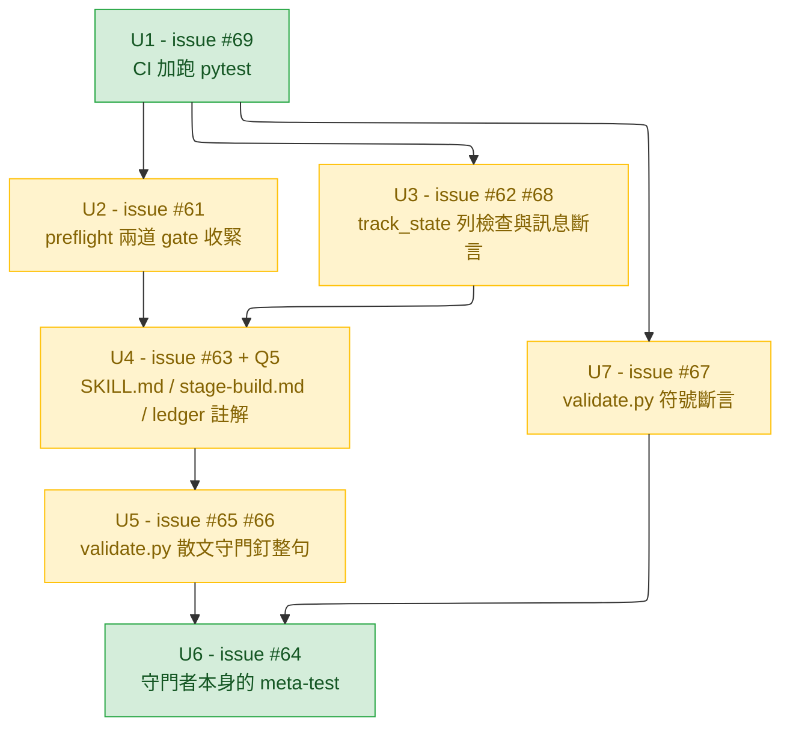

# intake — pr60-followups

- 軌道：`pr60-followups`，分支 `fix/pr60-followups`（自 `main` 的 95f2a6a 切出）
- 日期：2026-09-06
- 來源：`https://github.com/millerlai/claude-all-in-one/issues` 的九張 open issue #61–#69，全部由 PR #60 的 review 產出
- 階段：intake（`architect` 執行，兩輪；決策由主 session 經 `AskUserQuestion` 上呈使用者）

---

## 1. 問題陳述

九張 issue 的共同根因是**同一件事的三層執法強度不一致**：`state.md` 的內容（`stage` id、`status` 值、以及 `SKILL.md` 裡教人怎麼寫它的散文）有三組讀者——`plugins/cai/scripts/track_state.py`、`plugins/cai/scripts/preflight.py`、`scripts/validate.py`——各自用不同嚴格度檢查，而檢查本身又沒人檢查。結果是 issue #46 的失敗形狀可以從至少四道不同的門重新進來，每一次都是「所有自動檢查全綠、軌道靜默停住」。

**可驗收的目標**：完成本軌道後，`state.md` 的三個可寫欄位（`stage` id、`status` 值、`SKILL.md` 教人建表的那幾句散文）任一被寫成非法值、被拼錯、或被改寫成語義相反，**在 push 之前一定有紅燈**；而守著這件事的檢查本身被刪掉時，也一定有紅燈。第四層——這些保證只在 Windows 上驗證過——由 CI 補上 Linux 的自動覆蓋。

九張全部納入，零延後。

---

## 2. 已裁決的決定

五題，皆由使用者 2026-09-06 經 `AskUserQuestion` 拍板。問題與答案逐字記錄，因為後續階段會依它們判斷是否偏離。

| # | 問題 | 裁決 |
|---|---|---|
| Q1 | issue #63：`ledger.STATUSES` 裡的 `in-progress` 是合法值但沒有任何出貨檔案解釋它、也沒有任何程式寫出它。要怎麼處置？ | **給它寫入者，補完設計** |
| Q2 | issue #61：preflight 兩道 gate（`discover` 讀 `intake` 列、`ship` 讀 `verify` 列）目前任何非空字串都放行，與 `track_state` 兩套標準。謂詞要收哪些值？ | **只放行 `done` 與 `skipped`** |
| Q3 | issue #65 與 #67：這兩類檢查都是本 repo 從未有過的慣例。要做哪些？（可複選） | **A + B + C 全做**（#67 符號斷言、#65 步驟 2 改失敗訊息、#65 步驟 1 釘整句） |
| Q4 | issue #69：Linux 對 `validate.py` 已有 CI 自動覆蓋且跑過 8 次全綠，缺的只有 `pytest`。平台覆蓋要怎麼關？ | **加進既有 workflow**，不加 macOS matrix |
| Q5 | #63 給 `in-progress` 寫入者之後，`/cai:track done` 目前只拒絕「空白」的列，會放行停在中途的半成品軌道。要怎麼處理？ | **收緊：也拒絕 `in-progress`** |

### Q3 的 C 是知情下的選擇

主 session 與 intake 都建議不做 #65 步驟 1，理由是 `SKILL.md` 的 122 行等式**逼著**人重排，而釘整句會讓每次合法重排都紅。使用者在看過這個代價後仍選它。**因此誤報是預期行為，不是故障**：`SKILL.md` 與 `scripts/validate.py` 在 diff 裡同時出現，正是使用者買這個機制想看到的訊號。後續階段不得以「太容易誤報」為由回頭改掉它。

---

## 3. 主 session 實測的證據

以下全部由主 session 在 `fix/pr60-followups`（工作區乾淨）上實跑，非採信 subagent 回報。`architect` 只有 Read/Grep/Glob，無 Bash。

### 基準線

- `python -m pytest -q` → `250 passed in 44.58s`，exit 0
- `python scripts/validate.py` → exit 0，599 個 `PASS`，0 個 `FAIL`
- `plugins/cai/skills/track/SKILL.md` body 讀作 122 行

### 三項推翻 intake 第一輪判斷的發現

1. **`SKILL.md:68` 沒有被 `scripts/validate.py` 錨定**。grep `passing path` / `append and stop` / `` touches `state.md` `` 於 `scripts/validate.py` 零命中，唯一命中是 `SKILL.md:68` 自己。
2. **`SKILL.md:68` 是單一行、70 字元**，淨零改寫是一換一，不是前一條軌道的三換三。
3. **`plugins/cai/skills/track/references/stage-build.md` 沒有任何行數或內容測試**（`grep -rn "stage-build" tests/ scripts/validate.py` 只得 `validate.py:1285` 的註解與 `:1324` 的檔名 regex）。加行免費。

**後果**：intake 第一輪主張「#63 選 Q1 的答案後體量與其餘八張相當，應拆成兩條軌道」，經上述三項證據**不成立，已撤回**。本軌道一條走完九張。

### 第四項：`SKILL.md` 沒有行寬限制

`scripts/validate.py` 對該檔只有行數檢查（`:1418`，`track_lines <= TRACK_SKILL_MAX` 且 `TRACK_SKILL_MAX = 122`），配合 `tests/test_track_skill_ticket_pointer.py:107` 的等式 `== 122`。**全檔沒有任何 `len(line)` 之類的寬度檢查**，而 `SKILL.md` 第 3、87、88 行今天分別是 280、278、292 字元且是綠的。

**後果**：intake 列為最大風險的「`SKILL.md:68` 的新句塞不進 70–76 字元」**不是真的約束**——那是該檔的排版習慣，不是被檢查的東西。一行換一行時新句長度不受限。Q5 的 `:125` 改動同理。此風險已從風險表移除。

### #69 的前提確為過時

`.github/workflows/validate.yml` 存在，`runs-on: ubuntu-latest`，`on: [push to main, pull_request]`，唯一的 `run` 是 `python scripts/validate.py`。`gh run list` 顯示 `validate` workflow 實際跑過 8 次，`"conclusion":"success"` 全數綠燈，涵蓋 `main` 與 `fix/track-doc-followups`、`fix/track-status-vocabulary` 等分支。

所以 #69 內文「this repo has no CI today」在今天的樹上是錯的：**Linux 對 `validate.py` 的覆蓋是已證實的，缺的只有 `pytest`**。`tests/conftest.py:30` 的註解本來就寫著該環境變數「is set inside Claude Code and unset in CI」——測試套件當初就預期會在 CI 上跑，只是那一步從未被加進 workflow。

### 逐項複驗屬實（與 intake 回報一致）

`ledger.py:81` `STATUSES = ("", "in-progress", "done", "skipped")`（第一個元素是空字串，故 issue #61 字面建議的 `status in ledger.STATUSES` 會**放寬**閘門，不可照抄）；`preflight.py:315` `ok = bool(status)`；`preflight.py:417` `status_check = (bool(status), ...)`；`docs/design/2026-08-27-cai-sdlc-restructure-detail.md:470` 的範例表格確有 `| build | in-progress | — | 單元 3 of 5 |` 且緊接 `## 交接` 段；`MANUAL.md:137,144` 措辭為「before `intake` finished」「before `verify` finished」；`/cai:track done` 無程式實作，純為 `SKILL.md:124-126` 的散文。

---

## 4. 驗收條件

每條均為「跑什麼、看到什麼」。

### issue #61 — preflight 兩道 gate 收緊為 `("done", "skipped")`

- **AC1** — `intake` 列 status 為 `passed` 或 `in-progress` 時，`preflight.py discover` 退出碼 2，stdout 含 `FAIL intake_status`。
- **AC2** — 同一道 gate 對 `done` 與 `skipped` 退出碼 0；對空白仍退出碼 2（與今天相同）。
- **AC3** — `verify` 列為 `passed` 或 `in-progress` 時 `preflight.py ship` 的 `verify_status` 為 FAIL；為 `done`/`skipped` 時為 PASS；為空白時仍 FAIL。
- **AC4** — `scripts/validate.py` 既有四處相關 check（`:1050`、`:1058`、`:1173`、`:1181`）逐字不變地通過，且 `MANUAL.md:137`、`:144` 不需任何措辭改動。「不必改」本身即語義對齊的證據。

### issue #62 — 拼錯的 stage id 不再隱形

- **AC5** — 把某軌道 `state.md` 的 `design` 拼成 `desgin` 後跑 `track_state.py status`：退出碼 2、stderr 指名該列（既指出多了什麼、也指出少了哪個 id）、stdout 不含 `next:` 行。
- **AC6** — 六個 id 全部正確時，`track_state.py status` 的 stdout 與改動前**逐字相同**（含 `next:` 行、`skipped:` 區塊、`other active tracks:` 行）。
- **AC7** — 列數與 `stages.json` 不符時，仍優先印既有的 `state.md has N stage row(s), stages.json has 6`，新檢查不搶先；`validate.py:1536` 的 `short-track` fixture 行為逐字不變。

### issue #63 — `in-progress` 補完設計（給它寫入者）

- **AC8** — `stage-build.md` 的 Step 5.5 明文要求：中途停止時，除 append `## Handoff` 外，同時把該階段 `state.md` 列的 `status` 格寫成 `in-progress`。
- **AC9** — `SKILL.md:68` 改寫成一句與 `stage-build.md` Step 5.5 相容的準確敘述，**仍為單一行**，且 `SKILL.md` body 仍為 122 行（`tests/test_track_skill_ticket_pointer.py:107` 綠、`validate.py:1418` 綠）。新句長度不受限（見 §3 第四項）。
- **AC10** — 含 `in-progress` 列的軌道，`track_state.py status` 仍退出碼 0 且把該列列為 `next:`；`tests/test_track_state_gate.py:50` 的 `assert "next: build" in ...` 保持綠（既有行為零迴歸）。
- **AC11** — `ledger.py:81` 的 `STATUSES` 註解點名 `in-progress` 的寫入者是 `stage-build.md` 的 Step 5.5，使四個值在出貨檔案裡都有出處。

### Q5 — `/cai:track done` 一併收緊

- **AC25** — `SKILL.md:125` 改為拒絕「空白**或** `in-progress`」的列，且 `SKILL.md` body 仍為 122 行。改動關進 U4，**不得留到 U5 釘字串之後**。

### issue #66 — `rest empty` 加守門

- **AC12** — 把 `SKILL.md:42` 的 `rest empty` 改成任何其他字（例：`status prefilled with todo`），`python scripts/validate.py` 出現至少一行 `FAIL`。

### issue #65 — 釘整句（步驟 1）＋失敗訊息帶指示（步驟 2）＋寫下慣例（步驟 3）

- **AC13（步驟 1）** — 把 `SKILL.md:29` 的 `` None of these print a `next:`. `` 改成 `` All of these print a `next:`. ``，`validate.py` FAIL。把 `SKILL.md:80-82` 的 passing-path clause 改成否定式（例如在 `overwrite` 前插入 `never`），`validate.py` FAIL。**兩次都要實跑取得輸出。**
- **AC14（步驟 2）** — 上述兩個 check 的 label 各自含「此字串只有在 claim 本身被重新確認之後才可更新」的指示，且指向**各自正確的真相來源**：exit-2 那一個指向 `track_state.py` 的行為與 `tests/test_track_state_status_vocabulary.py:51`；passing-path bullet 那一個明寫「這句 claim 是關於模型該寫什麼、沒有任何測試守得住、只能靠 review」。以 `validate.py` 的實際輸出文字驗，不以原始碼驗。
- **AC15（步驟 3）** — `validate.py` 該 block 內有一段註解寫明這個慣例：claim 若是關於程式碼，先加行為測試、散文守門只負責證明句子還在；claim 若是關於模型該寫什麼，全部重量落在釘住的字串上，該段散文的改動一律當行為變更審。

### issue #67 — 斷言 docstring 點名的兩個符號還在

- **AC16** — 把 `track_state.py:32` 的 `def stage_ids` 改名後，`validate.py` 至少一行 FAIL，且該行明白點名這個符號檢查（不是只有連帶紅掉的其他檢查）。`class ArgParser`（`:163`）同理。改名會連帶弄壞 `track_state.py` 自己，故驗收條件是「至少一行且點名」，不是「恰好一行」。

### issue #68 — 錯誤訊息的斷言改為比對配對

- **AC17** — 把 `track_state.py:148` 格式字串的 `sid` 與 `value` 兩個參數對調後，`test_the_message_names_the_stage_the_value_and_the_four_legal_ones` 轉紅。

### issue #64 — 守門者本身有人守

- **AC18** — 刪掉 `validate.py` 該 block 內 #65 或 #66 新增／改寫的**任一個** check（保留 `:1418` 的天花板檢查），`python -m pytest` 至少一個測試轉紅。以實際突變取得真實輸出，不以推論。
- **AC19** — 該新測試斷言的是這個 block 應輸出的 label **群組**，不是逐一硬編每個檢查的完整字串，使未來一次合理的 label 措辭調整不會無故轉紅。

### issue #69 — 平台覆蓋

- **AC20** — `.github/workflows/validate.yml` 在同一個 job 內依序跑 `python scripts/validate.py` 與 `python -m pytest`（含安裝 `pytest` 的步驟）。**本 PR 至少一次 CI 綠燈即為此條的證據**；紅燈則是必須修到綠的門檻，不是可略過的資訊。
- **AC21** — `CLAUDE.md` 或 `MANUAL.md` 寫明覆蓋現況：Linux 由 CI 每個 PR 自動覆蓋 `validate.py` 與 `pytest`；Windows 為開發者手動；macOS 無覆蓋。

### 全域

- **AC22** — `python scripts/validate.py` exit 0、0 個 `FAIL`、`PASS` 行數不低於 599；`python -m pytest` 不低於 250 passed；`SKILL.md` body 讀作 122；工作樹乾淨。全部由主 session 獨立複跑，不採信 implementer 回報。
- **AC23** — `tests/test_track_skill_ticket_pointer.py:150` 的 always-on description budget（`== 5427`）保持綠。本軌道只改 `SKILL.md` body 與無 frontmatter 的 `stage-build.md`，不應動到這個數字；它轉紅代表有人動了 frontmatter description。
- **AC24** — PR 內文點名九張 issue 各自如何關閉，並寫明兩項**刻意不做**：(a) `preflight` 對拼錯 id 仍回 `state_md (cannot read state.md ...)` 這個誤導性措辭；(b) #65 自己列為 not-recommended 的三種做法（反轉黑名單、從 schema 生散文、語義斷言）皆不採用。

---

## 5. 工作單元與相依

| 單元 | issue | 動到的檔案 | 相依 |
|---|---|---|---|
| **U1** | #69 | `.github/workflows/validate.yml`、`CLAUDE.md` 或 `MANUAL.md` | 無。**必須第一個** |
| **U2** | #61 | `plugins/cai/scripts/preflight.py` ＋新測試檔 | U1 之後 |
| **U3** | #62、#68 | `plugins/cai/scripts/track_state.py`、`tests/test_track_state_status_vocabulary.py` | U1 之後；**與 U2 可並行** |
| **U4** | #63、Q5 | `plugins/cai/skills/track/references/stage-build.md`、`plugins/cai/skills/track/SKILL.md`、`plugins/cai/scripts/ledger.py` 註解 | U2/U3 之後；**必須在 U5 之前** |
| **U5** | #65、#66 | `scripts/validate.py`（`:1429`、`:1461`、`:1476` 一帶） | **嚴格在 U4 之後** |
| **U7** | #67 | `scripts/validate.py`（`:1484` 一帶） | 與 U5 不同區段可並行；若其 label 要被 U6 斷言則須在 U6 之前 |
| **U6** | #64 | `tests/`（新檔或既有檔） | **嚴格在 U5 與 U7 之後** |

### U1 必須第一個

`pytest` 從未在 POSIX 上跑過。若它在 Linux 上是紅的，此刻是**最便宜的發現時機**——工作樹與 `main` 只差一個 workflow 檔，紅燈的原因不可能是本軌道的其他改動。U1 落地後，U2–U7 每一次 push 都自動拿到 Linux 驗證。

### U2 與 U3 可並行

兩者改不同檔案的不同函式：U2 只碰 `preflight.py:315` 與 `:417` 兩個謂詞，U3 只碰 `track_state.py` 的表格檢查與訊息格式。`track_state.py` 匯入 `preflight`（`:28`）但只用 `state_row`、`data_rows`、`active_tracks`，三者都不在 U2 的改動面上。唯一交會點是 `tests/test_track_state_status_vocabulary.py`——U2 的新測試應另開檔，避免與 U3 的 #68 改寫撞在同一個檔。

### U4 必須在 U5 之前 — 本軌道唯一的硬性時序

`#65` 步驟 1 把 `SKILL.md` 的整句釘進 `validate.py`；`#63` 與 Q5 要改寫 `SKILL.md:68` 與 `:125`。兩者表面不衝突（`:68`、`:125` 不是被釘的那兩句），但透過 122 行等式間接相連：任何一處改動只要多出或少掉一行，等式立刻紅，而最近的補償候選正是 `:80-82` 的 passing-path bullet——**那正是 U5 要釘住的三行**。

順序反了會付兩次帳：先釘、再改 `SKILL.md`、把自己的釘子弄紅、再回頭改釘子。`validate.py` 會在 diff 裡出現兩次，而「兩檔同時改動」正是使用者買這個機制想看到的訊號，不該被自己製造的噪音稀釋。

**先 U4 定稿 `SKILL.md`（含 Q5 的 `:125`），U5 再從定稿取字串。U4 之後本軌道不再碰 `SKILL.md`。**

### 交給 design 決的實作細節

使用者裁決的是「釘整句」。比對方式有兩種寫法，兩者都滿足裁決、都能讓 `None`→`All` 與插入 `never` 轉紅：

- **逐字含換行與縮排比對** — 合法重排也紅。這是 issue 原文描述的形狀。
- **先把該段落的空白正規化（換行與連續空格摺成單一空格）再逐字比對** — 語義反轉照樣紅（反轉必然改動詞），合法重排不紅。

兩者對「意義反轉變成看得見的兩檔改動」這個機制的強度**完全相同**，差別只在誤報率。intake 建議正規化版本，但這是 design 的決定，不回頭問使用者。

---

## 6. 風險

| 風險 | 為什麼是真的 | 因應 |
|---|---|---|
| **第一次 CI 跑 `pytest` 紅** | 27 個測試檔有 16 個用 `subprocess`；`test_ledger_concurrent.py` 會 spawn 多個 process 驗 append 原子性，`ledger.py` 的 Windows 分支在 Linux 上走另一條路且從未被跑過；`test_ticket_close_out.py:105` 讀 `HEAD` 的 committed 內容而 `actions/checkout@v4` 預設 `fetch-depth: 1`；`test_track_skill_ticket_pointer.py` 每跑一次就整跑一次 `validate.py`，本機已 44.58s | U1 獨立成一個 commit 先推，讓紅燈歸因面最小。紅了修到綠——這正是 #69 要買的資訊。若是 CI 環境問題（fetch-depth、git identity）而非程式缺陷，修 workflow 而不是刪測試 |
| **U5 落地後本軌道自己還要動 `SKILL.md`** | 只要有後續單元改到 `SKILL.md`，就得同時改釘字串——使用者接受的成本，但混在同一條軌道會讓 review 難分辨哪次兩檔改動是訊號、哪次是自找的 | 所有 `SKILL.md` 改動（含 Q5）全部關進 U4 |
| **#64 的 meta-test 成為新的脆弱點** | 本 repo 第一個「檢查某個檢查存在」的測試；未來一次合理的 label 措辭調整會無故紅 | AC19 已約束成群組斷言而非逐字硬編；並在該測試 docstring 寫明為何只守這個 block、不推廣 |
| **#67 的突變會連帶弄壞 `track_state.py`** | `stage_ids()` 在 `:136` 被自己呼叫，改掉 `def` 那一行會讓多個既有檢查一起紅 | AC16 已寫成「至少一行 FAIL 且點名該符號檢查」。突變後務必還原並確認 `git diff` 為空——**破壞測試前先 commit，還原用 Edit 而非 `git checkout`** |
| **`docs/` 被 `.gitignore:15` 忽略** | 本文件與後續設計文件不 `git add -f` 就不會進 PR，前兩條軌道都踩過 | ship 階段的檢核項 |
| **突變測試的次數** | 本軌道要求的實際突變共七次（AC12、AC13 兩次、AC16 兩次、AC17、AC18），每次都要跑一輪 `validate.py` 或 `pytest`（44s） | 排進 build 的時間估算。這些是驗收證據，不是加分項 |

`SKILL.md` 新句塞不下的風險已移除，理由見 §3 第四項。

---

## 7. 刻意不做

- **不拆成兩條軌道**。intake 第一輪的主張經 §3 三項證據推翻。
- **不改 `MANUAL.md:137,144` 的措辭**。Q2 選 `("done","skipped")` 的直接後果——程式追上文件已宣稱的行為。
- **不加 macOS matrix**（Q4）。
- **不改 `preflight` 對拼錯 id 的誤導性訊息**（`state_md (cannot read state.md ...)`）。surgical，不順手擴大。
- **不採用 #65 自列的三種 not-recommended 做法**：反轉黑名單、從 schema 生散文、語義斷言。
- **本軌道未設 ticket pointer**。九張 issue 沒有單一代表號，指向其中任一張都會讓 `ticket.py project` 的進度留言落在錯的地方。`ticket.py read` 依規格印一行並 exit 0，intake 改由對話中的請求出發。
