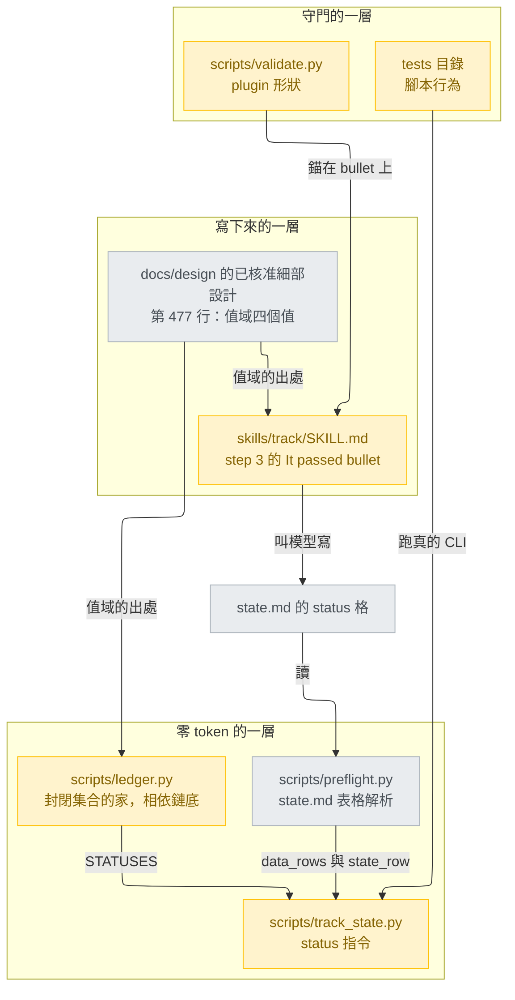
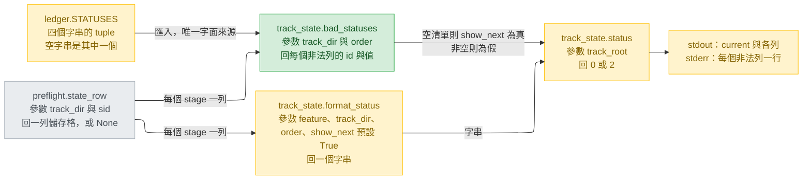
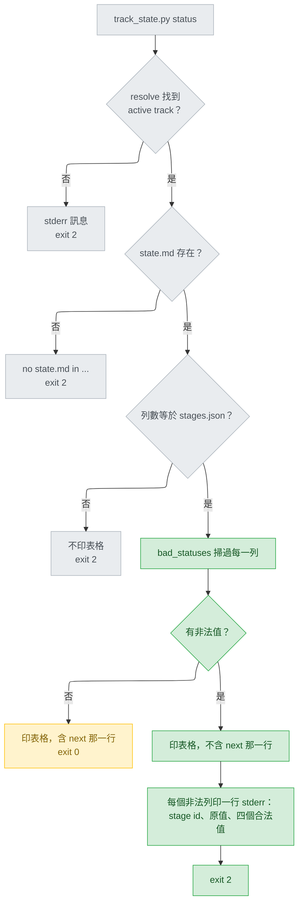
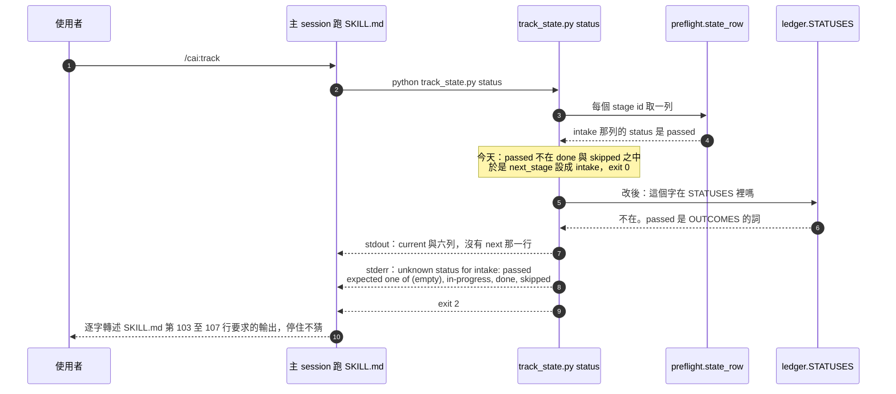

# track status vocabulary — detail design

## Reference

High Level Design doc: docs/design/2026-08-27-cai-sdlc-restructure-high-level.md
Status: approved 2026-08-27

Gate 檢查（stage-design.md Detail 步驟 0）逐條對過該檔本體：`## Status` 第 5
行讀作 `approved 2026-08-27`；`## Open questions` 五條每一條都帶著它得到的答案
（該檔 378-384 行，開頭即言明「五項都在 2026-08-27 得到答案，逐條記錄」）；
`## Use cases / Issues`（該檔 7-21 行）為 UC1–UC7、R1–R4 共十一項編號。三項皆通過。

本次修的是那份高階設計已核准、且已出貨的軌道機制上的一個缺口，所以參照的是它，
而不是另寫一份只為過 gate 的高階設計。值域本身不由本文件決定：
`docs/design/2026-08-27-cai-sdlc-restructure-detail.md:477` 已寫死
「`status` 的值域只有四個：空白（未開始）、`in-progress`、`done`、`skipped`」，
同檔 `:565` 的 Naming 表再述一次並給出命名理由。

**模式與理由**：Detail。stage-design.md「When to skip this stage entirely」第二條
說「決定已經做完、只是要寫下來」屬於 dictation，要寫文件但略去本階段存在的
option-weighing——本次正是如此：使用者 2026-09-06 已在 A／C／D 三案中拍板 D，
值域由上述已核准設計定死，issue #46 的第三案（`passed` 當 `done` 的別名）已被否決。
因此本文件不擺選項、不做可行性投票，只把已定的決定寫成 build 可逐單元執行的規格。
`## Design decisions` 記錄的是既有決定的出處與代價，不是本階段新做的取捨。

### Traceability

高階設計的十一個 id 中，本次直接修的是 UC1 與 R3；其餘九項由已出貨的重整滿足，
本次不得使其退化。「不受影響」的理由一律寫出，不留空格。

| From the high-level design | Satisfied by | Status |
|---|---|---|
| UC1 — 新 session 只靠檔案就能接手，且能說出跳過了什麼 | 本次修的就是它的破口：非法 status 讓 `track_state.py status` 仍 exit 0 並把該階段列為 `next`（`plugins/cai/scripts/track_state.py:96`、`:99`）。Unit 1 讓它 exit 2 並抑制 `next:` | covered |
| UC2 — 六階段各有唯一負責元件 | 不受影響：本次不動 `stages.json`、不動任何 stage reference | unaffected |
| UC3 — 使用者知道該叫哪一個 | 不受影響：不新增、不改名任何 command 或 skill | unaffected |
| UC4 — always-on context 預算只降不升 | SKILL.md 只改正文三行、不動 frontmatter description，而預算只計 description（`tests/test_track_skill_ticket_pointer.py:133`）；`test_always_on_budget_is_unchanged_at_5427` 仍須綠 | covered |
| UC5 — cai 自足 | 不受影響：不引入任何外部相依，`ledger.py` 仍零 deps（`plugins/cai/scripts/ledger.py:2`） | unaffected |
| UC6 — 該用程式判斷的地方不花模型的錢 | 直接強化：本次把「這格的字是不是合法」從無人判斷變成零 token 的程式判斷（Unit 1） | covered |
| UC7 — 模型換代時改動集中一處 | 不受影響：不碰 `models.json`、不碰任何 frontmatter | unaffected |
| R1 — 72 個 refactoring alias 與 14 個主線元件 | 不受影響：不新增、不刪除任何元件目錄 | unaffected |
| R2 — 不得與既有元件搶觸發 | 不受影響：不新增任何會被模型自動觸發的元件 | unaffected |
| R3 — `python scripts/validate.py` 全綠 | AC5：`TRACK_SKILL_MAX` 維持 122（`scripts/validate.py:1411`），新增檢查後 validate.py 仍 exit 0 零 FAIL；Unit 3 實跑 | covered |
| R4 — 遷移過程中 repo 隨時可用 | Unit 1 與 Unit 2 各自獨立可用、互不相依，任一單獨落地都不會讓樹壞掉 | covered |

## Requirement

`state.md` 的 `status` 欄有一組值域，但**沒有任何出貨檔案把它寫下來**——
`plugins/cai/skills/track/SKILL.md:40-41` 只說「one row per `stages.json` stage,
all empty」，`:80-82` 的通過路徑只說「overwrite that stage's row in `state.md`
(status, artifact, note)」，沒說 status 要填什麼。整個 repo 搜 `in-progress`，
出貨檔案裡一次都沒有作為值域出現（只在 `scripts/validate.py:1436` 與
`tests/test_track_state_gate.py:11` 的 fixture 資料列裡）；
`references/ticket-mirror.md` 整份不含 `status` 這個字。

同時每個讀者都把不認得的值當「未完成」：`plugins/cai/scripts/track_state.py:96`
是 `if next_stage is None and status not in ("done", "skipped")`。於是把 ledger 的
詞 `passed`（`plugins/cai/scripts/ledger.py:43` 的 `OUTCOMES` 成員）寫進 `status`
格，`track_state.py status` 會 exit 0、正常印出那一列、還把它列為 `next`——
該階段靜默停住。已在 `main` 重現（主 session，2026-09-06；design 階段的
plan-review 亦獨立重現一次）。

**對誰**：跑 `/cai:track` 的人，以及照 `SKILL.md:80-82` 寫那一格的模型。
**怎麼知道好了**：把 `passed` 填進任一 status 格，`track_state.py status`
以 exit 2 拒絕、指名是哪一列、原樣印出那個字、列出四個合法值，且輸出裡沒有
`next:` 行；而 `SKILL.md` 的通過路徑那一句自己就寫著要填 `done`。

### Acceptance criteria

intake 交下的六條，verify 將照這六條驗收。

- **AC1** — 非法值不再靜默停住（`plugins/cai/scripts/track_state.py`）。任一 stage
  列的 status 落在 {空白, `in-progress`, `done`, `skipped`} 之外時：exit 2；stderr
  指名 stage id、原樣印出該值、列出四個合法值；stdout 仍印 `current:` 與各列，
  但輸出**不得**含 `next: <stage>` 行。
- **AC2** — 詞寫在寫的人會讀到的地方（`plugins/cai/skills/track/SKILL.md` 加
  `scripts/validate.py`）。step 3 的 **It passed** bullet 必須說明 `status` 格填
  `done`，並由一個新的 `validate.py` 檢查守住，形狀比照 `scripts/validate.py:1392-1394`。
- **AC3** — 合法值域只定義一次（`plugins/cai/scripts/ledger.py`），`track_state.py`
  由它推導，別處不得有第二份字面清單（fixture 資料列不算）。`preflight.py` 與
  `ticket.py` 不改。
- **AC4** — 零退化，既有輸出逐字不變。
- **AC5** — 預算：`TRACK_SKILL_MAX` 維持 122，SKILL.md 正文改後仍是 122 行。
- **AC6** — 新檢查自身有測試覆蓋，並實際做兩次 mutation 且記錄。

## Glossary

| Term | Definition | Where it lives |
|---|---|---|
| `status` 格 | `state.md` stage 表格第二欄，說一個階段走到哪；讀者一律取索引 1 | plugins/cai/scripts/track_state.py:82 |
| status 值域 | 該欄唯一合法的四個值：空白、`in-progress`、`done`、`skipped` | docs/design/2026-08-27-cai-sdlc-restructure-detail.md:477 |
| `STATUSES` | 上述值域在程式裡的唯一字面定義，空字串是其中一個成員 | new — plugins/cai/scripts/ledger.py |
| `OUTCOMES` | ledger 的 `outcome` 欄值域，與 status 值域是**兩套不同的詞**，本 bug 的成因 | plugins/cai/scripts/ledger.py:43 |
| `NO_ARTIFACT` | ledger.py 裡既有的 `state.md` 儲存格常數，`STATUSES` 的落點依據 | plugins/cai/scripts/ledger.py:67 |
| `data_rows()` | 「什麼算一列」的唯一定義，回傳去空白後的儲存格清單 | plugins/cai/scripts/preflight.py:49 |
| `state_row()` | 取某一 stage 在 `state.md` 的那一列，找不到回 None | plugins/cai/scripts/preflight.py:68 |
| `format_status()` | 把整張表算成 `track_state.py status` 要印的字串，含 `next:` 行 | plugins/cai/scripts/track_state.py:75 |
| `bad_statuses()` | 新函式：回傳每一個值域外的 stage id 與值，全合法時是空清單 | new — plugins/cai/scripts/track_state.py |
| `show_next` | 新的關鍵字參數，決定 `format_status()` 要不要附上 `next:` 行 | new — plugins/cai/scripts/track_state.py |
| It passed bullet | SKILL.md step 3 裡唯一會寫 `state.md` 的那一條，AC2 的錨點 | plugins/cai/skills/track/SKILL.md:80 |
| `TRACK_SKILL_MAX` | SKILL.md 正文行數上限，調高它是一個決定而非形式 | scripts/validate.py:1411 |
| 正文行數 | 去掉 frontmatter 之後的行數，兩處用同一個公式算 | tests/test_track_skill_ticket_pointer.py:34 |

## Budgets

| What | Number | Where it comes from |
|---|---|---|
| status 值域的合法值個數 | 4 | docs/design/2026-08-27-cai-sdlc-restructure-detail.md:477 |
| 非法值時 `track_state.py status` 的 exit code | 2 | AC1；`plugins/cai/scripts/track_state.py:10-11` 已把 2 定義為「state.md 與 stages.json 不合」這一類 |
| SKILL.md 正文行數，改後必須**恰好**等於 | 122 | `scripts/validate.py:1411` 是上限 122；`tests/test_track_skill_ticket_pointer.py:107` 是等式，斷言正好 122 |
| It passed bullet 可佔的行數 | 3 | 上一列的等式逼出來的：淨零改寫，不是「等長或更短」 |
| `track_state.py` docstring 的 Exit 段可佔的行數 | 2 | 保持不變；見 D8，改多會讓 `ledger.py:21` 的行號引用更歪 |
| 改寫後 bullet 最寬一行的字元數 | 77 | 本文件實測（字元數，非位元組數）；原 bullet 三行為 75／72／74 字元 |
| `state.md` 真實檔案數，改後仍須 exit 0 | 4 | `.claude/track/` 下 glob 實查：三個 `done/` 封存軌道加一個進行中的 |
| `validate.py` 的 `TRACK_STATE_CASES` 既有案例數，不得少 | 4 | scripts/validate.py:1486 |
| 必須實作並記錄的 mutation 次數 | 2 | AC6 |
| 本次會被改到的檔案數 | 5 | 見 `## Change points` |
| always-on description 預算，不得移動 | 5427 | tests/test_track_skill_ticket_pointer.py:150 |

## Design decisions

**D1 — 值域常數落在 `ledger.py`，不是 `preflight.py`。** intake 的落點，本文件維持並
寫下理由。`ledger.py` 已是這個 repo 收「封閉集合」的地方（`OUTCOMES`
`plugins/cai/scripts/ledger.py:43`、`GATES` `:44`），也已收了一個 `state.md` 的儲存格
常數（`NO_ARTIFACT` `:67-68`），而且它是相依鏈的底：`plugins/cai/scripts/preflight.py:23-26`
逐字寫著「ledger.py imports nothing back, which is what keeps the
track_state -> preflight -> ledger chain from closing into a cycle」，
`preflight.py:28` 與 `track_state.py:29` 都已 import 它，所以放這裡不會生出新的邊。

反面理由據實記下，這是 `preflight.py` 仍是合理落點的原因：解析 `state.md` 表格的
知識全在 `preflight.py`（`data_rows` `:49`、`state_row` `:68`），而 `ledger.py`
除了 `NO_ARTIFACT` 之外對那張表一無所知；`STATUSES` 會是 `ledger.py` 第一個
**自己不使用**的常數。取 `ledger.py` 的決定性理由是相依方向：值域要被
`track_state.py` 用，未來也可能被 `ticket.py` 用（`plugins/cai/scripts/ticket.py:31`
就是那句 `import preflight`，`:143` 是它呼叫 `data_rows()` 的地方），
放在鏈底的人人都拿得到，放在中層則會逼後來的人選邊。
兩處都不會生成循環，所以這一條是可逆的：搬家是一次 `git mv` 級的改動，成本是
改兩個 import。

**D2 — 空字串是 `STATUSES` 的成員，不是特例。** 已核准設計
`docs/design/2026-08-27-cai-sdlc-restructure-detail.md:477` 說的是「值域只有四個：
空白（未開始）、…」——空白是四個之一。把它放進 tuple，成員判斷就是一個
`in`，不必在兩個地方各記一次「空白也算合法」。錯誤訊息裡把它顯示成 `(empty)`，
用 `", ".join(s or "(empty)" for s in ledger.STATUSES)` 一個運算式解決，不加 helper。

**D3 — 檢查放在 `status()`，不放在 `format_status()`。** `format_status()` 有兩個
呼叫者：`plugins/cai/scripts/track_state.py:128` 與
`tests/test_track_state_gate.py:26`，後者直接拿它的**回傳字串**斷言
（`:39`、`:42`、`:49`、`:50`）。AC4 要求那個檔案不得被修改就保持綠，所以
`format_status()` 必須繼續回傳字串、且預設仍帶 `next:` 行。exit code 是 `status()`
的事，判斷因此也留在 `status()`。`format_status()` 只多一個有預設值的關鍵字參數
`show_next=True`，三個位置引數的既有呼叫完全不動。

**D4 — 列數檢查仍排在值域檢查之前。** `plugins/cai/scripts/track_state.py:122-126`
在列數與 `stages.json` 不合時就 exit 2 且**不印表格**。理由是那時候印出來的表不可信。
值域這一條不同：表是好的，只有一格的字不對，所以它印表。順序不能倒過來——列數
不對時去逐 stage 找 status，找到的會是一堆 None。

**D5 — 抑制 `next:`，而不是只改 exit code。** exit 2 但輸出仍寫著 `next: intake`，
是半個修法：`plugins/cai/skills/track/SKILL.md:103-107` 要求把輸出**逐字轉述**，
於是負責處理的人讀到的還是「下一步是 intake」。全 repo 只有兩個消費者讀
`next:`——`scripts/validate.py:1488`（合法軌道，exit 0，不受影響）與
`tests/test_track_state_gate.py:50`（全合法列，不受影響）——所以抑制它不破壞任何
既有契約。

**D6 — AC1 的行為測試進 `tests/`，AC2 的內容檢查進 `scripts/validate.py`。**
`CLAUDE.md:57-59` 明訂分工：「validate.py checks the plugin's shape and the guard,
tests/ checks what the scripts do」。腳本行為屬於後者，SKILL.md 的內容屬於
plugin 的形狀。`validate.py:1486-1499` 的 `TRACK_STATE_CASES` 是可以加第五個
案例的地方，但那會與 `tests/` 的新案重複同一件事，且 AC6 指定新案在 `tests/`。

**D7 — `validate.py` 的斷言錨在 bullet 上，不是整檔搜字。** `SKILL.md:8`
（保留 feature 名）與 `:33`（Reject `current` and `done` as feature names.）
今天就含 `done`，`:38` 有 `done/`、`:122` 有 `## /cai:track done`。所以
「檔案裡有 done」今天就會過、什麼也守不住。

錨點取 `**It passed**` 這個標記，只在它到下一個空行之間找
`` `status` = `done` ``。三件事讓這個錨點站得住，都已實查：
`**It passed**` 這串字在**整個 `plugins/cai/` 底下只出現一次**，就是
`SKILL.md:80`；`` `status` `` 在 SKILL.md 只出現在 `:21`（子指令名）與
`:113`（`` `status` = `skipped` ``），所以 `` `status` = `done` `` 改寫後全檔唯一；
`SKILL.md:83` 是空行，bullet 到下一個空行的切法落在正確的位置。片語完整落在改寫後
的同一行內，之後任何重新折行都不會把它切斷。

**D8 — 只改 docstring 的那一句，且維持兩行；不修 `ledger.py:21` 已經歪掉的行號。**
`track_state.py:10-11` 的 Exit 說明要擴一句（見 `status()` 的規格），但必須仍是
兩行。理由：`plugins/cai/scripts/ledger.py:21` 的註解寫著「stage_ids() and ArgParser
below are still copied from track_state.py:31-33 and :133-138」，而今天
`stage_ids()` 實際在 `track_state.py:32-34`、`ArgParser` 在 `:141-147`——**這兩個
引用今天就已經歪了**（分別歪 1 行與 8 行）。docstring 多一行會讓它們再歪一行。

本次**不修**那個註解：它在改動之前就是錯的，`coding.md` 的 surgical-changes
規則說不要順手改沒壞在本次改動上的東西，AC3 也只授權 `ledger.py` 加一個常數。
但 `bad_statuses()` 插在 `:72` 與 `:75` 之間，本來就會把 `ArgParser` 往下推約十行，
使 `:133-138` 更不準。**這一點記在這裡而不是默默放過**，列為候選 follow-up，
由使用者決定要不要單獨開一張票把那個註解改成不帶行號的寫法。

同理，`track_state.py:142-143` 的註解說 exit 2「reserves for "no active track"」，
改後 2 又多了一個意思。**不動它**：那句話真正在說的是「usage 錯誤拿 1 不拿 2」，
這一點完全沒變，而權威敘述在 docstring，本次已同步。

## Diagrams

### Architecture

三層：把值域寫下來的一層、零 token 讀它的一層、守住前兩層不漂的一層。



### Component

每個元件與鄰居的契約。綠色是新的，黃色是既有但本次會改，灰色是完全不動。



### Flow

`track_state.py status` 從頭到尾，含新分支。前三個判斷完全不動。



### Sequence — UC1

新 session 只靠檔案接手一條 status 格被寫錯的軌道。第 5 步是今天的行為（bug），
第 6 步起是改後的行為。



## Implementation spec

**讀本節的程式碼區塊前先看這一條**：底下每個 fenced block 都嵌在一個 bullet
底下，所以它顯示出來的每一行都比檔案裡實際該有的縮排**多兩欄**。每一段都另外
明寫了寫回檔案時的實際欄位，以那個數字為準；原文一律從檔案本身取，不要重打。

### `ledger.STATUSES`

- **Responsibility** — 把 `state.md` `status` 欄的合法值域在程式裡定義一次。
- **Interface** — 模組層常數，無函式。寫回檔案時 `#` 與 `STATUSES` 都頂格（第 0 欄）。

  ```python
  # state.md's `status` column, the whole of it -- blank included, because a
  # row that has not started is a legal state and not a missing one
  # (docs/design/2026-08-27-cai-sdlc-restructure-detail.md:477). It sits here
  # rather than beside the table parser in preflight.py for the same reason
  # NO_ARTIFACT does: this file is the bottom of the import chain
  # (preflight.py:23-26), so every reader can have it without a new edge.
  # Not OUTCOMES above: that is the ledger's own vocabulary, and writing one
  # of its words into this column is exactly the bug this constant exists to
  # catch.
  STATUSES = ("", "in-progress", "done", "skipped")
  ```

- **Data** — 四個字串的 tuple，順序即錯誤訊息的列出順序。
- **Errors** — 無。常數不會失敗。
- **Concurrency** — 不可變模組常數，無共享狀態。
- **Observability** — 只透過使用它的人現身；本身不輸出。
- **Where it lives** — `plugins/cai/scripts/ledger.py`，緊接現有的 `NO_ARTIFACT`
  （`:67-68`）之後、`RAW_KEEP`（`:70-71`）之前。檔案已存在。
- **What it reuses** — 形狀照 `plugins/cai/scripts/ledger.py:43` 的 `OUTCOMES` 與
  `:44` 的 `GATES`：複數大寫名詞、tuple、上方帶一段說明為何是這幾個。

### `track_state.bad_statuses`

- **Responsibility** — 說出哪些 stage 列的 status 落在值域外，以及那個字是什麼。
- **Interface** — 寫回檔案時 `def` 頂格。

  ```python
  def bad_statuses(track_dir, order):
      """(stage id, the offending value) for every row whose status is outside
      ledger.STATUSES, in stages.json order. An empty list means the table is
      written in the vocabulary state.md actually has."""
      out = []
      for sid in order:
          row = preflight.state_row(track_dir, sid)
          status = row[1] if row and len(row) > 1 else ""
          if status not in ledger.STATUSES:
              out.append((sid, status))
      return out
  ```

- **Data** — 進：`track_dir` 路徑字串、`order` stage id 清單（來自
  `stage_ids()`，`plugins/cai/scripts/track_state.py:32-34`，順序即
  `stages.json` 的 intake、discover、design、build、verify、ship）。
  出：兩元素 tuple 的清單，全合法時是空清單。
- **Errors** — 不自行拋錯。找不到那一列時 `state_row()` 回 `None`
  （`plugins/cai/scripts/preflight.py:81`），此處視同空字串，也就是合法——
  「這一列不存在」是列數檢查（`track_state.py:122-126`）的事，不是這裡的。
  取 `row[1]` 的守衛與 `format_status()` 現行的 `:82` 逐字一致。
- **Concurrency** — 純讀，無狀態；重跑結果相同。
- **Observability** — 自身不印；呼叫者負責輸出。
- **Where it lives** — `plugins/cai/scripts/track_state.py`，放在
  `table_row_count()`（`:66-72`）與 `format_status()`（`:75`）之間。檔案已存在。
- **What it reuses** — `preflight.state_row()`（`plugins/cai/scripts/preflight.py:68`）
  與 `ledger.STATUSES`。命名照 `plugins/cai/scripts/ledger.py:459` 的
  `malformed_lines()`：複數名詞、回傳「找到的問題」、沒問題就是空清單。

### `track_state.format_status`（改）

- **Responsibility** — 不變：把整張表算成要印的字串。多一件事：可以不附 `next:` 行。
- **Interface** — `def format_status(feature, track_dir, order, show_next=True)`。
  唯一的實體改動是 `:99` 那一行改成有條件地執行（檔案裡 `lines.append("")`
  在第 4 欄，`if show_next:` 同樣第 4 欄，其下第 8 欄）：

  ```python
      lines.append("")
      if show_next:
          lines.append("next: %s"
                       % (next_stage or "none -- every stage is done or skipped"))
  ```

  `next_stage` 的計算（`:96`）保持原樣，不因 `show_next` 而跳過——它同時決定
  迴圈的短路，改它會動到別的行為。
- **Data** — 進多一個布林值；出仍是字串。
- **Errors** — 不變。
- **Concurrency** — 不變：純讀。
- **Observability** — `show_next=False` 時輸出少一行 `next:`；`current:`、各 stage
  列、`skipped:` 區塊、`other active tracks:` 全部照舊。
- **Where it lives** — `plugins/cai/scripts/track_state.py:75-106`，既有函式擴充。
- **What it reuses** — 帶預設值的布林關鍵字參數，形狀照
  `plugins/cai/scripts/design_probe.py:141` 的 `filled(body, short_ok=False)`。
  預設 `True` 是為了讓 `tests/test_track_state_gate.py:26` 的三個位置引數呼叫
  行為分毫不變。

### `track_state.status`（改）

- **Responsibility** — 不變：決定 exit code 並輸出。多一條判斷。
- **Interface** — 簽章不變：`def status(track_root)`。`plugins/cai/scripts/track_state.py:128`
  的 `print(format_status(...))` 之前插入判斷，之後插入 stderr 與回傳
  （函式本體第 4 欄起）：

  ```python
      bad = bad_statuses(track_dir, order)
      print(format_status(feature, track_dir, order, show_next=not bad))
      if bad:
          legal = ", ".join(s or "(empty)" for s in ledger.STATUSES)
          for sid, value in bad:
              print("unknown status for %s: %s (expected one of %s)"
                    % (sid, value, legal), file=sys.stderr)
          return 2
      return 0
  ```

- **Data** — 進：`track_root`。出：`0` 或 `2`。
- **Errors** — 新增一條 exit 2 路徑。exit code 不新增：
  `plugins/cai/scripts/track_state.py:10-11` 的 docstring 已把 2 定義為
  「no active track (or a state.md that disagrees with stages.json)」，
  一個非法的 status 是同一類的不合。那兩行的**確切取代文字**（仍是兩行，見 D8。
  寫回檔案時 `Exit:` 頂格在第 0 欄，第二行 8 個前導空格，共 76 字元）：

  ```
  Exit:   0 an active track exists, 2 no active track (or a state.md that
          disagrees with stages.json or the status vocabulary), 1 usage error.
  ```

  `main()` 的 `--help` 只取 `__doc__.splitlines()[0]`（`:160`），所以這段擴寫
  不改任何說明輸出，也沒有任何測試斷言 `track_state.__doc__`（全 `tests/` 只有
  `test_ledger.py:251` 斷言 `ledger.__doc__`，本次不動 `ledger.py` 的 docstring）。
- **Concurrency** — 不變。
- **Observability** — 正常時輸出逐位元組不變（`bad` 為空則 `show_next=True`，
  無 stderr，回 0）。非法時 stdout 少一行 `next:`，stderr 每個非法列一行。
  訊息形狀照 `plugins/cai/scripts/ledger.py:183-184` 既有的
  `"unknown outcome: %s (expected one of %s)"`——這個 repo 對「一個字落在封閉集合
  外」已經有一句慣用語，不另發明第二句。
- **Where it lives** — `plugins/cai/scripts/track_state.py:109-129`，既有函式擴充。
- **What it reuses** — `bad_statuses()`、`format_status()`、`ledger.STATUSES`；
  `sys` 已在 `:16` 匯入，`ledger` 已在 `:29` 匯入，不新增 import。

### SKILL.md 的 It passed bullet（改）

- **Responsibility** — 告訴寫那一格的模型，通過路徑要在 `status` 填 `done`。
- **Interface** — 散文。**要被取代的原文**（`plugins/cai/skills/track/SKILL.md:80-82`，
  三行）：

  ```
     - **It passed** → `passed` **first**, and only once `ledger.py` exits 0,
       overwrite that stage's row in `state.md` (status, artifact, note) —
       never append a row; the row count must stay equal to `stages.json`'s.
  ```

  **取代成**（同樣三行，第一行完全不動）：

  ```
     - **It passed** → `passed` **first**, and only once `ledger.py` exits 0,
       overwrite that stage's `state.md` row: `status` = `done`, plus artifact
       and note — never append a row; the row count must equal `stages.json`'s.
  ```

  **實際欄位以這裡為準**：寫回檔案時第一行前面是 **3 個空格**、第二三行前面是
  **5 個空格**，與原檔一致；上面兩塊各自比它多兩欄（本節開頭那條通則）。
  兩塊之間只有兩處差異，第一行完全相同：第二行把「row in state.md，後面用括號
  列出三個欄名」改寫成「state.md row 冒號，status 等於 done，再加 artifact 與
  note」；第三行把 must stay equal to 縮短成 must equal。第二處省下的八個字元，
  正好是第一處多出來的空間——這就是淨零改寫塞得進同樣三行的原因。
- **Data** — 行寬（字元數）：新第二行 76、新第三行 77，第一行 75 不動；
  原三行為 75／72／74。行數 3 換 3，正文總行數維持 122。
- **Errors** — 若 Edit 比對不到原文，原因只會是空白或破折號被複製錯：該段用的是
  ASCII 單引號（全檔無彎引號，已 grep 查證：零命中）、U+2192 arrow 與 U+2014
  em dash。從檔案本身取原文，勿重打。
- **Concurrency** — 不適用：這是一次文字編輯，非執行期元件。
- **Observability** — `scripts/validate.py` 印出的行數那一行必須仍讀作
  `... is within its 122-line ceiling (122)`。
- **Where it lives** — `plugins/cai/skills/track/SKILL.md`，既有檔案。
- **What it reuses** — `` `status` = `done` `` 的寫法照
  `plugins/cai/skills/track/SKILL.md:113` 既有的 `` `status` = `skipped` ``，
  這是本檔自己指稱一個儲存格值的既有寫法。

### `validate.py` 的新檢查

- **Responsibility** — 讓上面那句話不能被悄悄刪掉。
- **Interface** — 沿用 `scripts/validate.py:18` 的 `check(label, cond)`。寫回檔案時
  整段在 `if os.path.isfile(TRACK_SKILL):` 區塊內，也就是第 4 欄起：

  ```python
  # SKILL.md:8 and :33 already say `done` -- the reserved feature name and the
  # archive directory -- so "the file contains `done`" passes today and guards
  # nothing. Anchor on the passing-path bullet instead: keep only that bullet,
  # and look for the cell spelled the way :113 already spells `skipped`.
  PASSED_MARKER = "**It passed**"
  STATUS_DONE = "`status` = `done`"
  passed_bullet = (track_text.split(PASSED_MARKER, 1)[1].split("\n\n", 1)[0]
                   if PASSED_MARKER in track_text else "")
  check(f"{TRACK_SKILL}'s passing-path bullet spells the status cell "
        f"({STATUS_DONE})", STATUS_DONE in passed_bullet)
  ```

- **Data** — 無輸入輸出；讀的是 `track_text`，即 `scripts/validate.py:1414` 已經
  讀進來的同一份內容，不再開一次檔。切 `"\n\n"` 而不是 `"\r\n\r\n"` 是對的：
  `read_text()`（`scripts/validate.py:30-31`）用文字模式開檔且未指定 `newline`，
  所以 CRLF 會被 universal newlines 轉成 `\n`，在 Windows 上也一樣。
- **Errors** — 任一不過即整體 exit 非 0（`check` 設 `FAIL = 1`，`scripts/validate.py:19-22`）。
  `PASSED_MARKER` 不存在時 `passed_bullet` 為空字串，於是 FAIL，這正確：標記被改名
  等同於這條保證消失。**不能**寫成不帶守衛的 `split(...)[-1]`——找不到分隔符時
  `split` 回整份文字，檢查就會在別處找到片語而通過。
- **Concurrency** — 單執行緒腳本，不適用。
- **Observability** — 一行 PASS 或 FAIL，標籤把要找的片語印出來，所以壞掉時不必翻原始碼。
- **Where it lives** — `scripts/validate.py`，放進 `:1413` 的
  `if os.path.isfile(TRACK_SKILL):` 區塊內、行數檢查（`:1417-1418`）之後。
  放在 `isfile` 守衛裡不會造成「檔案不在就靜默跳過」：`:1394` 已經用
  `read_text()` 無守衛地讀同一個檔，而 `read_text` 對不存在的檔會直接拋例外
  （`:30-31`），所以執行到 `:1413` 時該檔必然存在。
- **What it reuses** — `check()`（`scripts/validate.py:18`）、`track_text`（`:1414`）；
  形狀照 AC2 指定的 `:1392-1394`：一個常數、一個 `in`、一句說明標籤。
  常數命名照 `:1390` 的 `PENDING_Q`。

### `tests/test_track_state_status_vocabulary.py`（新）

- **Responsibility** — 用真的 CLI 證明 AC1 的兩半：合法值行為不變、非法值 exit 2 且無 `next:`。
- **Interface** — pytest 函式，形狀照 `tests/test_cli_encoding.py:26-40` 的
  `make_track()` 與 `run()`（建一個 `current` 指向 `billing` 的臨時軌道，
  用 `subprocess` 跑腳本），三個測試：

  ```python
  def test_a_legal_table_still_exits_0_and_names_the_next_stage(tmp_path): ...
  def test_an_illegal_status_exits_2_and_prints_no_next_line(tmp_path): ...
  def test_the_message_names_the_stage_the_value_and_the_four_legal_ones(tmp_path): ...
  ```

- **Data** — fixture 六列，全部合法者一份，另一份把 `intake` 那列改成 `passed`
  （issue #46 的真實輸入，不是任意亂碼）。斷言：exit 0 與 2；
  `"next:" not in stdout`（不是 `"next: intake" not in`——後者會放過
  `next: discover`）；`current:` 仍在 stdout；`intake`、`passed`、
  `in-progress`、`done`、`skipped`、`(empty)` 都在 stderr。
- **Errors** — 不適用。
- **Concurrency** — 每個測試用自己的 `tmp_path`，可平行。
- **Observability** — pytest 的輸出即是。
- **Where it lives** — `tests/test_track_state_status_vocabulary.py`，新檔。
- **What it reuses** — `tests/conftest.py:17-20` 已把
  `plugins/cai/scripts` 放上 `sys.path`；`tests/test_cli_encoding.py:37-40` 的
  `run()` 形狀（用 `sys.executable` 跑腳本、`capture_output=True`）。
  這裡以 `text=True, encoding="utf-8"` 解碼即可——`test_cli_encoding.py` 刻意讀
  raw bytes 是因為它測的就是編碼，本檔測的是行為，不需要那個約束。

## Naming

| Name | What it is | Chosen by |
|---|---|---|
| `STATUSES` | `ledger.py` 裡 status 值域的常數 | follows `OUTCOMES` and `GATES` at plugins/cai/scripts/ledger.py:43-44 — 兩者各以自己那一欄的欄名命名；state.md 那一欄叫 `status`，見 docs/design/2026-08-27-cai-sdlc-restructure-detail.md:465 的表頭與 plugins/cai/skills/track/SKILL.md:113 |
| `bad_statuses` | `track_state.py` 裡回傳值域外儲存格的函式 | follows `malformed_lines` at plugins/cai/scripts/ledger.py:459 |
| `show_next` | `format_status()` 的布林關鍵字參數 | follows `short_ok` at plugins/cai/scripts/design_probe.py:141 |
| `PASSED_MARKER` | `validate.py` 裡錨點字串的常數名 | follows `PENDING_Q` at scripts/validate.py:1390 |
| `STATUS_DONE` | `validate.py` 裡被找的片語的常數名 | follows `PENDING_Q` at scripts/validate.py:1390 |
| `unknown status for <stage>: <value> (expected one of <list>)` | 非法值的 stderr 句型 | follows `unknown outcome: %s (expected one of %s)` at plugins/cai/scripts/ledger.py:183-184 |
| `(empty)` | 錯誤訊息裡空字串成員的顯示形式 | 本文件 D2；同類做法見 plugins/cai/scripts/ledger.py:509，空的 artifact 以 `NO_ARTIFACT` 顯示 |
| `tests/test_track_state_status_vocabulary.py` | 新測試檔名 | follows tests/test_track_state_gate.py — `test_<腳本>_<主題>.py` |

沒有新的檔案（測試檔除外）、目錄、config key、環境變數、CLI flag 或 exit code。
`STATUSES` 的四個值本身不是本次命名的東西，是
`docs/design/2026-08-27-cai-sdlc-restructure-detail.md:565` 已核准的名字。

## Change points

| Path | Change | Exists today |
|---|---|---|
| `plugins/cai/scripts/ledger.py` | 加一個常數 `STATUSES` 與其說明，緊接 `NO_ARTIFACT`（`:67-68`）之後 | yes |
| `plugins/cai/scripts/track_state.py` | 新增 `bad_statuses()`；`format_status()` 加 `show_next` 參數；`status()` 加判斷、stderr 與 exit 2；docstring 的 Exit 說明擴一句、仍兩行 | yes |
| `plugins/cai/skills/track/SKILL.md` | `:80-82` 三行整段換掉，行數不變 | yes |
| `scripts/validate.py` | 在 `:1413` 的區塊內加一個 `check()` 與兩個常數 | yes |
| `tests/test_track_state_status_vocabulary.py` | 新檔，三個測試 | no |

不改：`plugins/cai/scripts/preflight.py`（`discover` 的 `:310-316` 與 `ship` 的
`:412-417` 都只檢查非空，收緊成集合成員判斷會改變誰被擋下——今天 `in-progress`
會過——而使用者核准的是文件加 `track_state` 驗證，不是動 gate）；
`plugins/cai/scripts/ticket.py`（`:153-157` 是鏡像不是把關，拒絕鏡像一個錯字會擋掉
ticket 更新，同時把錯字對能修它的人藏起來）；`plugins/cai/scripts/ledger.py:21`
與 `plugins/cai/scripts/track_state.py:142-143` 兩處註解（理由見 D8）。

沒有新的外部相依。三個腳本仍是零 deps（`plugins/cai/scripts/ledger.py:2`、
`plugins/cai/scripts/track_state.py:2`、`plugins/cai/scripts/preflight.py:2`）。

## Failure modes

| Situation | What happens | What the caller sees |
|---|---|---|
| status 格寫成 `passed`（issue #46 的原案） | `bad_statuses()` 回一個元素，表格照印但不含 `next:` | exit 2；stderr `unknown status for intake: passed (expected one of (empty), in-progress, done, skipped)` |
| 多列同時非法 | 每一列各印一行 stderr，順序照 `stages.json` | exit 2；一次看到全部，不必修一個跑一次 |
| status 格是空白 | 合法（D2），與今天完全相同 | exit 0，該列成為 `next:` |
| 列數與 `stages.json` 不符 | 值域檢查根本沒跑到——列數檢查先 return 2 且不印表（D4） | 與今天逐字相同：`state.md has N stage row(s), stages.json has 6` |
| 表格列數對，但某個 stage id 拼錯 | `state_row()` 回 `None`，視同空白，不報。這是既有行為（`format_status()` `:82` 同樣處理），本次不擴大範圍 | exit 0，那一列印成空白狀態。已知缺口，見 `## Rollout` 的 follow-up |
| 某個 `skipped` 列的 note 散文裡剛好含有 `next: build` 這串字 | 該字串會出現在 stdout 的 `skipped:` 區塊裡 | 病態輸入；AC1 保證的是不再產生 `next:` **行**，不是禁止散文引用它。測試斷言用 `"next:" not in stdout` 對乾淨 fixture 成立 |
| `**It passed**` 這個標記被改名 | `passed_bullet` 為空字串，`validate.py` FAIL | `FAIL ... passing-path bullet spells the status cell` |
| 有人把 `` `status` = `done` `` 從 bullet 刪掉但留在別處 | 錨點只看 bullet 到下一個空行之間，仍 FAIL | 同上 |
| SKILL.md 改寫意外多出一行 | `scripts/validate.py:1417` 的天花板檢查與 `tests/test_track_skill_ticket_pointer.py:107` 的等式**同時**紅 | `FAIL ... 122-line ceiling (123)` 加一個 pytest 失敗 |
| SKILL.md 改寫意外少一行 | 天花板檢查會過（121 小於 122），但等式測試紅 | 只有 pytest 會抓到——所以那個測試是本次的第二道網，不是裝飾 |

## Rollout

**能不能分批出？** 能，兩個獨立單元。Unit 1（程式驗證）與 Unit 2（文件加守門）
互不相依：Unit 1 讓錯誤不再靜默，Unit 2 讓錯誤更不容易發生。任一單獨落地都是
可用狀態（R4）。最小有用的第一片是 Unit 1——它把已經存在的軌道從「靜默停住」
變成「大聲拒絕」。

**既有資料怎麼辦？** 不需要遷移或回填。實查 `.claude/track/` 下四個真實
`state.md`：三個 `done/` 封存軌道（`option-explainer-with-eli5`、
`gap02-usage-ledger`、`ticket-integration`）六列全是 `done` 或 `skipped`，
進行中的 `track-status-vocabulary` 是 `done`、`skipped`、四個空白——
全部落在值域內，改後仍 exit 0。（`status` 指令實際只讀 `current` 指到的那一條；
封存的三條由 `preflight.active_tracks` `:248-257` 排除。）

**在途的呼叫者會壞掉什麼？** 一種情形會從 exit 0 變成 exit 2：某人手動把非法字
寫進 status 格的軌道。那正是本次要的行為。附帶代價：`SKILL.md:35` 說 resume 時
「skip straight to the next unfinished stage `track_state.py status` names」，
沒有 `next:` 行時模型無處可跳——正確結果是停下來轉述，但 SKILL.md 沒有明寫這句。
不在本次補：AC5 不授權調高 `TRACK_SKILL_MAX`，補這句要花行數。列為 follow-up
issue，與 intake 已認定的另外兩個（`state.md` 表格 schema 從未出貨、
`SKILL.md:64` 的 `--outcome` 列漏了 `skipped`）以及 D8 的 `ledger.py:21` 行號
同批，理由相同：都撞同一個行數預算或都屬於本次授權範圍之外。

**回滾？** revert 那一個 commit，沒有任何持久化狀態被寫過——本次改的三個檔全是
純讀路徑加一個常數，`state.md` 一個字都沒被動過。

**兩件關於本文件自己的操作事項**，寫在這裡因為它們影響 build 與 ship：
`.gitignore:15` 忽略整個 `docs/`（註解寫明「Tracked docs stay tracked; new ones
need an explicit `git add -f`」），所以本文件目前是 untracked，`git status` 看不到
它，也不會進 PR，除非有人 `git add -f`。另外
`plugins/cai/scripts/preflight.py:189-209` 的 `artifact_unchanged` 會拿本檔的
SHA-256 與 ledger 裡 design 那筆 `passed` 記錄比對，所以**本文件一旦被記進
ledger 就不能再編輯**，否則 build 的 preflight 會以
`artifact_unchanged (... changed since sign-off)` 擋下。

## Verification

| Criterion | Level | What it needs | Green before |
|---|---|---|---|
| AC1 上半：非法值 exit 2、stderr 指名 stage id 與原值與四個合法值 | unit（真跑 CLI 的 subprocess） | `tmp_path` 建的臨時軌道，`intake` 列填 `passed` | unit 1 merges |
| AC1 下半：輸出不含 `next:` 行，但 `current:` 與各列仍在 | unit | 同上 fixture，斷言 `"next:" not in stdout` 且 `"current:" in stdout` | unit 1 merges |
| AC1 對照組：合法表格行為與今天逐字相同 | unit | 六列全合法的 fixture，斷言 exit 0 且 `next:` 仍在 | unit 1 merges |
| AC3：值域只有一份字面定義 | 人工加 grep | 全 repo 搜 `in-progress`，命中只允許出現在 fixture 資料列與散文 | unit 1 merges |
| AC4：`validate.py` 四個 `TRACK_STATE_CASES` 退出碼與字串不變 | integration | `python scripts/validate.py` 實跑，讀 `:1486-1499` 那四對 PASS 行 | unit 1 merges |
| AC4：`tests/test_track_state_gate.py` 與 `tests/test_cli_encoding.py` 未經修改仍綠 | integration | `python -m pytest`，並確認這兩個檔在 diff 中沒有出現 | unit 1 merges |
| AC4：四個真實 `state.md` 仍 exit 0 | integration | 對進行中軌道實跑 `track_state.py status --track-root .claude/track` | unit 1 merges |
| AC2：bullet 說出 `status` 填 `done`，且由 `validate.py` 守住 | integration | `python scripts/validate.py` 印出新的那一行 PASS | unit 2 merges |
| AC5：正文恰好 122 行、`TRACK_SKILL_MAX` 仍是 122 | integration | `validate.py` 的 `(122)` 那一行，加 `tests/test_track_skill_ticket_pointer.py` 的 `test_skill_md_body_is_122_lines` | unit 2 merges |
| AC6 mutation 1：拿掉 `status()` 裡的檢查，新測試必須轉紅 | mutation | **先 commit**，改壞、跑 pytest、記錄輸出、`git checkout` 還原 | unit 3 merges |
| AC6 mutation 2：從 bullet 刪掉那個片語，`validate.py` 必須 FAIL | mutation | 同上；同時 `tests/test_track_skill_ticket_pointer.py:73` 的 `test_validate_exits_0_with_zero_fail_lines` 也會轉紅，兩個一起記 | unit 3 merges |
| 全域 gate | integration | `python scripts/validate.py` exit 0 零 FAIL；`python -m pytest` 全綠 | ship |

## Work breakdown

| Unit | Depends on | Can run alongside | Done when |
|---|---|---|---|
| 1 — `ledger.STATUSES` 加 `track_state` 的 `bad_statuses()`、`show_next`、`status()` 判斷、docstring 兩行改寫，加新測試檔 | nothing | unit 2 | 新測試三個全綠；`python -m pytest` 全綠且 `tests/test_track_state_gate.py` 與 `tests/test_cli_encoding.py` 未被修改；`python scripts/validate.py` exit 0；對進行中軌道實跑 `track_state.py status` 仍 exit 0 |
| 2 — SKILL.md `:80-82` 換成本文件的取代文字，加 `scripts/validate.py` 的錨點檢查 | nothing | unit 1 | `validate.py` 新增那一行讀作 PASS，行數那一行讀作 `(122)`，整體 exit 0 零 FAIL；`pytest tests/test_track_skill_ticket_pointer.py` 全綠 |
| 3 — 兩次 mutation 與記錄 | unit 1 與 unit 2，**且已 commit** | 無 | 兩次改壞各自轉紅、輸出貼進報告、`git checkout` 還原後 `validate.py` 與 `pytest` 回到全綠 |

單元切在 Implementation spec 已經切開的介面上：Unit 1 只碰 `plugins/cai/scripts/`
與 `tests/`，Unit 2 只碰 `plugins/cai/skills/track/SKILL.md` 與 `scripts/validate.py`，
沒有共同檔案，所以兩者可同時進行。Unit 1 排第一是因為它風險最高且無未滿足相依：
它動的是有兩個既有呼叫者的函式簽章（`plugins/cai/scripts/track_state.py:128`、
`tests/test_track_state_gate.py:26`），而 AC4 要求其中一個不得被修改。

**先 commit 再 mutate**：Unit 3 的兩次改壞都必須在 unit 1、2 已進版控之後才做。
`git checkout` 還原的是「到 HEAD」，不是「撤銷剛才那筆」——未 commit 就改壞，
還原會把整個單元一起丟掉。

**實作期偏離**：照 `stage-build.md:191-200` 的 Step 5 格式記錄（`- Unit N — design
said X, built Y.` 加 `Why:` 加 `Cost:`），不另發明第二套。

**環境限制**：本機的 Bash 工具會把非 ASCII 的命令列引數弄成亂碼（主 session
2026-09-06 實測），而 `plugins/cai/scripts/ledger.py` 的 `--note` 沒有
`--note-file` 選項（`:536-541` 的參數清單）。本次三個單元都不需要用 argv 傳
非 ASCII：測試資料寫在 Python 檔裡，SKILL.md 用 Edit 工具改。若 build 途中真的
需要（例如替本軌道寫 ledger note），改走 UTF-8 檔案而非 argv。

### Upstream blockers

| What | Owned by | Needed before |
|---|---|---|
| 無外部相依：本次改動全部落在本 repo 內，不需要任何外部端點、佇列或憑證 | 無 | 無 |
| 設計簽核，`plugins/cai/skills/track/SKILL.md:93-94` 的兩道人工閘門之一 | 使用者 | unit 1 |
