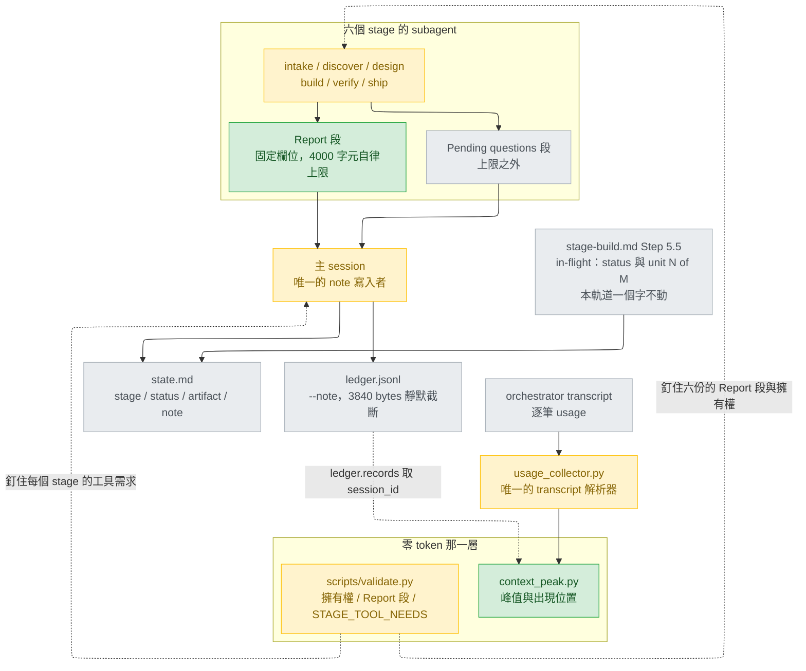
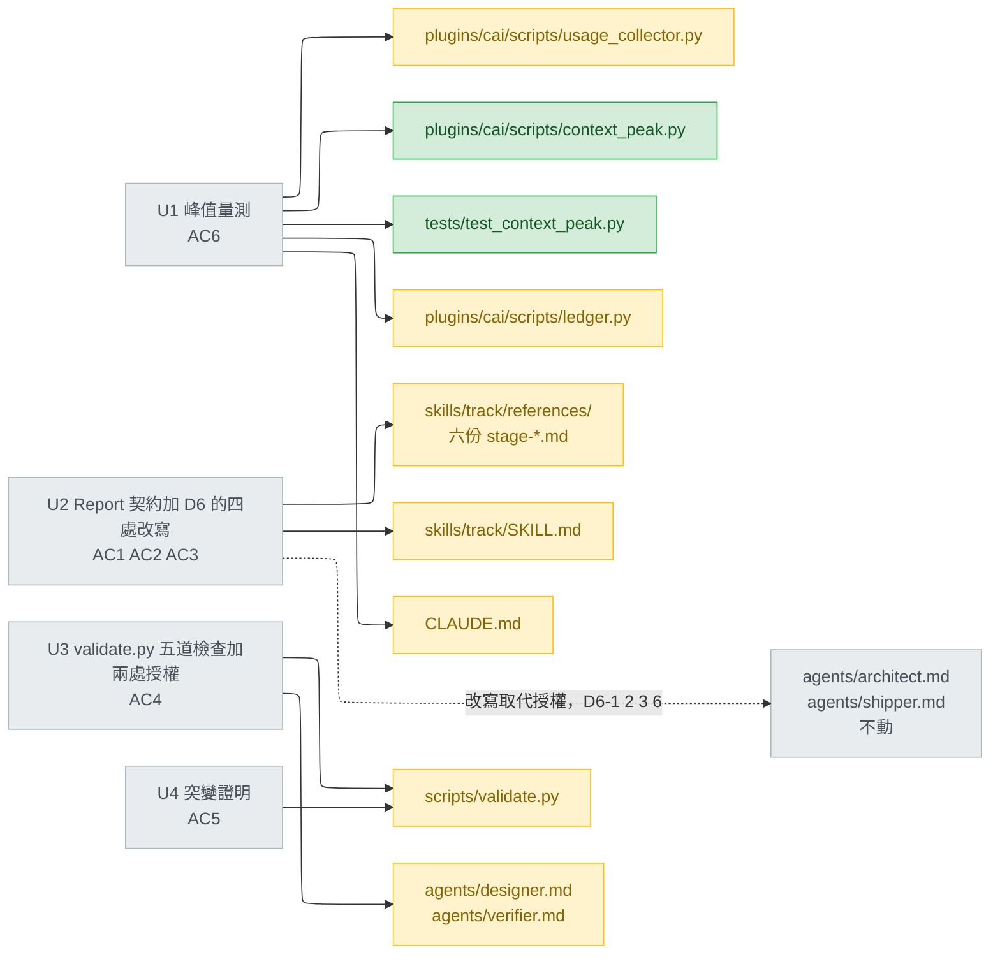
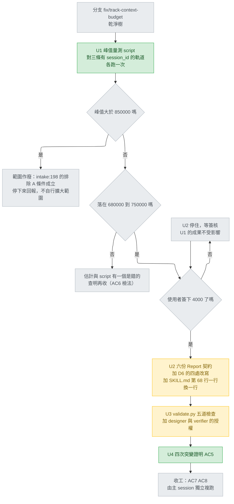
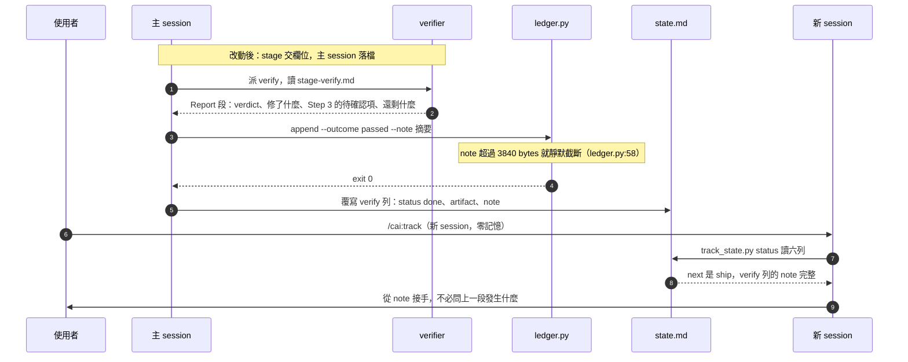
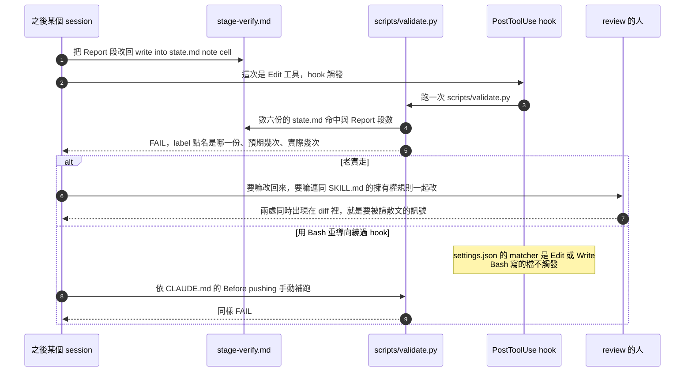

# track-context-budget — detail design

## Reference

High Level Design doc: docs/design/2026-08-27-cai-sdlc-restructure-high-level.md
Status: approved 2026-08-27

**上面那行 `Status:` 說的是那份高階設計，不是本文件。** 本文件自己的簽核狀態不寫在
內文，理由見下方關於 `artifact_unchanged` 的段落。

Gate 檢查（`stage-design.md` Detail 步驟 0，該檔 `:126-129`）逐條在該檔本體上對過，
不採信轉述：`## Status` 第 5 行讀作 `approved 2026-08-27`；`## Open questions` 在
該檔 376 行起，五條各自帶著答案；`## Use cases / Issues`（該檔 7–21 行）編號
UC1–UC7 與 R1–R4，共十一項。三項皆通過。

參照那份已核准的高階設計、而不另寫一份只為過 gate 的高階設計，做法與
`docs/design/2026-09-06-pr60-followups-detail.md:14-17` 同一個理由：本軌道修的是
那份設計已核准且已出貨的軌道機制上的缺口，不是新系統。

**一處與模板的刻意偏離，明寫在此以免讀者以為是筆誤：**
`stage-design.md:132-135` 要求 detail 文件的 `<topic>` 與高階設計相同，那會是
`cai-sdlc-restructure`。本檔用的是軌道名 `track-context-budget`——沿用
`docs/design/2026-09-06-pr60-followups-detail.md` 與
`docs/design/2026-09-06-track-status-vocabulary-detail.md` 兩個先例：當一條軌道
重用既有的已核准高階設計時，detail 檔跟軌道走而不是跟高階設計走，否則同一個
`<topic>` 會被四條不同的軌道爭用。`preflight.py:107-114` 的 `artifact_kind`
只認 `-detail.md` 後綴，不看 `<topic>`，所以這個偏離不觸發任何檢查。

**本文件刻意不含 `## Status` 一節。** detail 模板沒有這一節
（`design_probe.py:45-48` 的 `DETAIL_HEADINGS` 十三個標題裡沒有它），
`stage-design.md:107` 說「Do not add or rename headings」，三份先例
（`2026-09-06-pr60-followups-detail.md`、`2026-08-30-track-usage-accounting-detail.md`、
`2026-09-06-track-status-vocabulary-detail.md`）也都沒有。初稿曾加了一節，
plan-review 指出那會踩到一個實際的閘門：`preflight.py:189-209` 的
`artifact_unchanged` 拿 ledger 在 design 那列記下的 SHA-256 比對現檔，
**若簽核之後才把 `draft` 改成 `approved`，雜湊就變了，往後每一次
`preflight.py build` 都會 exit 2 說 "changed since sign-off"**。因此簽核狀態的
唯一真相是 ledger 的 design 列（`--gate human`），不是文件內文；AC3-c 的日期
也從那裡取。

本文件的上游輸入是同軌道的 intake：
`docs/design/2026-09-07-track-context-budget-intake.md`（241 行，AC1–AC8、
§3 的變更表、§4 的明確排除、§5 的兩項使用者裁決）。

**模式與理由**：Detail，且**不做 option-weighing**。`stage-design.md:228-230` 的
「決定已經做完、只是要寫下來」是 dictation：範圍（E + C + 峰值量測）與 `note` 擁有者
兩題已由使用者 2026-09-07 拍板（intake:204-214），本文件不擺可行性投票、不擺選項表。
`## Design decisions` 記的是既有決定的出處與代價，加上 intake 明文交給 design 決的
兩個未定數（intake:167-178）。其中第二個未定數在 design round 1 查出新證據後升級為
架構層，依 `references/pending-questions.md` 原樣上交；**使用者已於 2026-09-07 裁決
判準——嚴格讀法：`STAGE_TOOL_NEEDS` 斷言的是該 stage 的 agent 自己的 `tools:`，
「派得出一個有該工具的 subagent」不算數——並指示六個缺口逐一判「授予工具」或
「改寫 reference」**。見 D6 的 D6-0 到 D6-6，以及 `## Work breakdown` 的 U2、U3。
第一個未定數（`## Report` 上限 4000）**仍是提案，尚未簽核**。

### Traceability

高階設計的十一個 id 中，本軌道直接強化的是 UC1 與 UC6；UC5、R3、R4 由本軌道自己的
預算與排程守住，同列 `covered`；其餘六項由已出貨的重整滿足，本軌道只需不使其退化。
「不受影響」一律寫出理由，不留空格。

| From the high-level design | Satisfied by | Status |
|---|---|---|
| UC1 — 新 session 只靠檔案就能接手 | `note` 格從此只有一個宣告的擁有者（AC1）：六份 Closing 改成「在 `## Report` 交出這些欄位」，主 session 落檔。今天六份 reference 一致叫 stage 自己寫（`stage-intake.md:59`、`stage-discover.md:146`、`stage-design.md:249`、`stage-build.md:263`、`stage-verify.md:106`、`stage-ship.md:152`），而其中四個 stage 的 agent 沒有 `Write`（`architect.md:7` 跑 intake 與 discover、`verifier.md:7`、`shipper.md:7`），指示與能力對不上時那一格就漏寫或寫錯序——`.claude/track/done/pr60-followups/state.md:12` 記著實害 | covered |
| UC2 — 六階段各有唯一負責元件 | 不受影響：不動 `stages.json`（該檔 16 行、六列不增不減），不新增或刪除任何 stage | unaffected |
| UC3 — 使用者知道該叫哪一個 | 不受影響：新增檔是 `plugins/cai/scripts/` 下的一支 script，不是 skill 也不是 command，沒有 description 進 listing（D11 記錄了為什麼不加 wrapper skill） | unaffected |
| UC4 — always-on context 預算只降不升 | 本軌道不動任何 `description:`。唯一改到的 frontmatter 欄位是 `designer.md` 與 `verifier.md` 的 `tools:`（D6-4、D6-5），而 `scripts/validate.py:219-221` 的量測只加總 `frontmatter_description()`，它在下一個頂層 key 就停（該檔 `:62-71`），所以動 `tools:` 不可能推動那個數字。**UC4 的成功判準是「低於 4,673」，今天是 5,427，尚未達成**——既有狀態，本軌道不修也不推高，靠 `tests/test_track_skill_ticket_pointer.py:163` 的等式守住 | not regressed |
| UC5 — cai 自足 | AC7：新增 script 只 import 標準庫與同 plugin 的兩個既有模組（`usage_collector`、`ledger`），**不新增任何第三方相依**，執行期相依維持為零（`plugins/cai/scripts/ledger.py:2` 的 "Zero deps"）。D15 說明為什麼「只用標準庫」這句 AC 字面必須讀成「不新增第三方相依」 | covered |
| UC6 — 該用程式判斷的地方不花模型的錢 | 直接強化，兩處：(a) `scripts/validate.py` 新增四道零 token 檢查，把「六份 Closing 有沒有偷偷改回去寫 `state.md`」「六份有沒有 `## Report` 契約」「`STAGE_TOOL_NEEDS` 有沒有漏 stage」「峰值 script 有沒有長出第二套 transcript parser」從人工複核變成字串比對（AC1、AC3、AC4、AC6-d）；(b) 新增的峰值量測 script 把「還剩多少餘裕」從模型的區間估計變成可重複的數字（AC6） | covered |
| UC7 — 模型換代時改動集中一處 | 不受影響：不碰 `plugins/cai/models.json`，不碰任何 frontmatter 的 `model:` 欄位 | unaffected |
| R1 — 72 個 alias 與 14 個主線元件 | 不受影響：不新增、不刪除任何 `plugins/cai/skills/` 底下的目錄。這是 D11 選擇不加 wrapper skill 的主要理由——`scripts/validate.py:162-166` 記著今天已是 16 個、目標 14 | unaffected |
| R2 — 不得與既有元件搶觸發 | 不受影響：不新增任何會被模型自動觸發的元件 | unaffected |
| R3 — `python scripts/validate.py` 全綠 | AC7：收工時 exit 0、0 個 `FAIL`；CI 每個 PR 在 Linux 上重跑一次（`.github/workflows/validate.yml`） | covered |
| R4 — 遷移過程中 repo 隨時可用 | 四個單元各自是一個可用狀態；相依關係全部是內容相依而非半套狀態，見 `## Work breakdown` | covered |

## Requirement

**問題**。`/cai:track` 的六個 stage 全在同一個 main session 內跑完，三條完成軌道的
`ledger.jsonl` 各只有一個 `session_id`（本階段複驗：`pr60-followups`
`2162ccb5-…`、`ticket-integration` `962f8ff6-…`、`track-status-vocabulary`
`a990d2d9-…`；另兩條較早的軌道整份是 `null`，那是 usage 記錄尚未落地之前的）。
主 session 的 context 單調累積，沒有任何 stage 邊界會回收，而
`stage-build.md:219-221` 已把「為什麼不能自動回收」寫死：`SessionStart`、
`SessionEnd`、`UserPromptSubmit`、`Stop`、`StopFailure`、`PreToolUse`、
`PostToolUse` 沒有一個會在預算用盡前示警。

問題的形狀因此不是「即將爆掉」，而是三件可以現在就修好的事（intake:82-83）：

1. **`note` 格有兩個宣告的擁有者。** 六份 reference 的 Closing 一致要求 stage 自己寫
   （六處 `file:line` 見 Traceability 的 UC1 列），而 `SKILL.md:80-82` 把同一格指派給
   主 session。六個 agent 中有四個做不到那個動作：`architect.md:7` 是
   `Read, Grep, Glob`（跑 intake 與 discover）、`verifier.md:7`、`shipper.md:7` 皆無
   `Write`。（D6-5 之後 `verifier` 會取得 `Write`，但那是為了 `stage-verify.md:82-86`
   的「先寫失敗測試再修」，不是為了寫 `note` 格——擁有權由 D2 決定，不由工具決定。）
2. **例外條款的描述比實際窄。** `SKILL.md:68` 只說 Step 5.5 寫 `status`，而
   `stage-build.md:236-239` 實際還寫 `note` = `unit <N> of <total>`、`:226` 還 append
   `## Handoff`。
3. **stage report 沒有任何格式或大小契約。** `^## Report` 在
   `plugins/cai/skills/track/` 全樹零命中（本階段複驗；全 plugin 唯一命中是
   `plugins/cai/skills/refactor/references/procedure-auto.md:64`，另一個 skill 的）。
   對照之下 ledger 的 note 早有程式層上限（`ledger.py:58`）。

**對誰**。跑 `/cai:track` 的人；六個被派去跑 stage 的 subagent；以及一個沒有任何
對話記憶、只靠 `.claude/track/<feature>/state.md` 接手的新 session。

**怎麼知道好了**。驗收條件是 intake 交下的 AC1–AC8
（`docs/design/2026-09-07-track-context-budget-intake.md:87-151`），逐條對應到單元與
層級的表在 `## Verification`。本文件不改寫、不增刪任何一條。

**本軌道不承諾視窗變小**（intake:82）。承諾的是：擁有權矛盾修掉、report 有一個
寫下來的上限、「還剩多少餘裕」變成零 token 可重複的數字。

## Glossary

| Term | Definition | Where it lives |
|---|---|---|
| `state.md` | 一條軌道的六列狀態表，欄位為 stage/status/artifact/note | plugins/cai/skills/track/SKILL.md:41 |
| `note` 格 | `state.md` 表的第四欄，一段散文，冷啟動的 session 靠它知道上一階段發生什麼 | plugins/cai/skills/track/references/stage-intake.md:61 |
| `## Report`（本設計新增的） | stage 的 subagent 交回給主 session 的那一段，欄位固定、有字元上限 | new — plugins/cai/skills/track/references/stage-intake.md |
| `## Step 3 — Report`（既有，另一件事） | `stage-verify.md` 裡 verify 自己那份審查報告的四個小節，不是交給主 session 的那一段；D12 處理這個撞名 | plugins/cai/skills/track/references/stage-verify.md:67 |
| `## Closing` | 六份 reference 今天的最後一節，內容就是交接指示；本設計把這個標題換成 `## Report` | plugins/cai/skills/track/references/stage-design.md:247 |
| Step 5.5 | `stage-build.md` 裡「還沒做完就停下」的程序，本軌道一個字不動 | plugins/cai/skills/track/references/stage-build.md:217 |
| `## Handoff` | Step 5.5 append 進 `state.md` 的交接區塊。它在該檔是**圍籬內**的一行 `## `，任何按 `^## ` 切段的程式都會把它誤讀成標題 | plugins/cai/skills/track/references/stage-build.md:229 |
| in-flight note | `unit <N> of <total>`，Step 5.5 在半路寫的 note，擁有者是 build stage | plugins/cai/skills/track/references/stage-build.md:237 |
| 終局 note | 某階段 `passed` 之後寫進 `note` 格的那一段，擁有者是主 session | plugins/cai/skills/track/SKILL.md:80 |
| `STAGE_TOOL_NEEDS` | `validate.py` 的表：每個 stage 的 agent 必須被授予什麼工具 | scripts/validate.py:1275 |
| `STAGE_ORDER` | 六個 stage id 的正規順序，**定義在 `STAGE_TOOL_NEEDS` 之後** | scripts/validate.py:1309 |
| 六份 reference 的 glob 迴圈 | `validate.py` 既有的迴圈，第二行就 `continue` 掉不含 `AskUserQuestion` 的檔 | scripts/validate.py:1438 |
| `agent_tools_line()` | 從一份 agent 檔的 frontmatter 取出 `tools:` 那一行 | scripts/validate.py:34 |
| `frontmatter_description()` | always-on 預算的量測基準，只取 `description:`，在下一個頂層 key 停 | scripts/validate.py:62 |
| `check()` label | `validate.py` 每道檢查印出的那一行字，`PASS`/`FAIL` 之後的全部 | scripts/validate.py:18 |
| `TRACK_SKILL_MAX` | `track/SKILL.md` body 的行數天花板，今天 122 | scripts/validate.py:1454 |
| `MAX_NOTE` | ledger 的 `--note` 位元組上限，3840；超過就靜默截斷 | plugins/cai/scripts/ledger.py:58 |
| `REPORT_MAX` | 本設計新增的常數，`## Report` 段的字元上限，六份必須寫同一個數字 | new — scripts/validate.py |
| `STATE_MD_MENTIONS` | 本設計新增的常數，六份 reference 中允許提到 `state.md` 的次數；不在表內的檔期望值是 0 | new — scripts/validate.py |
| `RETIRED_IMPERATIVES` | 本設計新增的常數，逐檔列出 D6 從 reference 移除的祈使句；再出現就 FAIL。「改寫」關掉的缺口靠它釘住，等同「授予」關掉的缺口靠 `STAGE_TOOL_NEEDS` 釘住 | new — scripts/validate.py |
| 嚴格讀法 | 使用者 2026-09-07 對 D6 的裁決：reference 的祈使句點名工具 T 時，要求的是該 stage 的 agent 自己的 `tools:` 有 T；派得出一個有 T 的 subagent **不算數** | concept |
| `artifact_unchanged` | build 的 preflight 檢查，拿 ledger 記的 SHA-256 比對設計文件現檔 | plugins/cai/scripts/preflight.py:189 |
| `ledger.records()` | 讀一條軌道的 `ledger.jsonl`，逐列回 dict，壞行變成 malformed placeholder 而不拋 | plugins/cai/scripts/ledger.py:417 |
| orchestrator session | 主 session 自己的 transcript，`<session_id>.jsonl`；subagent 另存 `subagents/` 子目錄 | plugins/cai/scripts/usage_collector.py:81 |
| subagent transcript | `<session_id>/subagents/agent-*.jsonl`，本設計的量測**不讀** | plugins/cai/scripts/usage_collector.py:90 |
| requestId 去重 | 同一個 API 回應會落在多列 transcript，各帶一份 usage；不去重曾把實測灌水 5 倍 | plugins/cai/scripts/usage_collector.py:246 |
| `usage_records()` | 本設計新增：唯一的 **transcript** 解析器，產出去重後的每筆請求 | new — plugins/cai/scripts/usage_collector.py |
| `read_window()` | 今天叫 `_read_window()`；本設計改為公開名，兩個呼叫點都在 `collect()` 內 | plugins/cai/scripts/usage_collector.py:184 |
| `_aggregate_with_problems()` | 逐 model 累加五個 token 欄位；本設計改為 `usage_records()` 的消費者 | plugins/cai/scripts/usage_collector.py:222 |
| `_valid_usage()` | 只驗三個扁平鍵，**不驗** `cache_creation_input_tokens` | plugins/cai/scripts/usage_collector.py:143 |
| `_resolve_ephemeral()` | 把 cache_creation 拆成 1h/5m 兩個 TTL 桶；拆不開時回一個 problem | plugins/cai/scripts/usage_collector.py:156 |
| `cache_creation_total()` | 本設計新增：一次請求的 cache 寫入**總量**（不分 TTL），兩種 schema 都答得出來 | new — plugins/cai/scripts/usage_collector.py |
| `usage.iterations` | 真實 transcript 的 `message.usage` 底下一個陣列，逐項重複同一組 token 欄位；**加總它會重複計算**，全 repo 今天無人提及它 | concept |
| occupancy（佔用） | 本設計的量詞：input_tokens 加 cache_read_input_tokens 加 cache 寫入總量，一次請求必須常駐的量 | new — plugins/cai/scripts/context_peak.py |
| 峰值（peak） | 一個 orchestrator session 全程 occupancy 的最大值，以及它第一次出現的位置 | new — plugins/cai/scripts/context_peak.py |
| assistant-record ordinal | 峰值「位置」的第三個欄位：該筆在**去重後的 assistant 記錄**裡排第幾。**不是檔案行號**，見 D13 | new — plugins/cai/scripts/context_peak.py |
| 突變測試 | 手動把程式或散文改壞、確認有紅燈、再還原；動手前先 commit | concept |
| always-on description budget | 所有元件 frontmatter description 的字元總和，今天 5427 | tests/test_track_skill_ticket_pointer.py:163 |

## Budgets

30 列 `note` 的統計量由本階段 2026-09-07 實測五條完成軌道（每條六列）算出。
**中位數取的是統計學定義**（30 筆取第 15、16 名的平均），**p90 取 nearest-rank**
（第 27 名）——初稿誤用了「排序後取第 16 名」與「索引 `int(n*0.9)`」兩個近似值，
得出 721 與 1564，plan-review 指出後重算。最大值與合計不受影響。

| What | Number | Where it comes from |
|---|---|---|
| `## Report` 段的字元上限（本設計提案，待簽核） | 4000 | 本階段裁決 D5，使用者於 design 人工閘門簽核（plugins/cai/skills/track/SKILL.md:93） |
| 已完成軌道 `note` 格的最大字元數 | 1941 | 本階段實測，.claude/track/done/pr60-followups/state.md:12 的 verify 列 |
| 同上 30 列的中位數 | 718 | 同上實測（第 15、16 名為 715 與 721） |
| 同上 30 列的 p90（nearest-rank，第 27 名） | 1368 | 同上 |
| 同上 30 列的合計 | 22843 | 同上 |
| 同上 30 列的最小值 | 64 | 同上（gap02-usage-ledger 的 discover 列） |
| ledger `--note` 的位元組上限 | 3840 | plugins/cai/scripts/ledger.py:58 |
| 一條軌道六份 report 都寫滿上限的合計字元 | 24000 | 4000 乘 6，本設計推算 |
| 主 session 峰值（區間估計，AC6 收斂前） | 750000 | docs/design/2026-09-07-track-context-budget-intake.md:30 |
| 會讓「排除 A」作廢的峰值門檻 | 850000 | docs/design/2026-09-07-track-context-budget-intake.md:198 |
| 本次量測的分母（context window） | 1000000 | docs/design/2026-09-07-track-context-budget-intake.md:23 的欄位標題與 :30 |
| ticket-integration transcript 的 assistant usage 物件數 | 760 | 本階段實測 |
| 其中同時帶 flat 與 nested cache_creation 的筆數 | 760 | 同上：flat only 0、nested only 0、兩者皆無 0（D9 的依據） |
| 本專案最大的一份 transcript（bytes） | 23737656 | 本階段實測，使用者本機 projects 目錄下 53 份中最大者 |
| 讀最大那份 transcript 的峰值常駐記憶體（MB，量級估計） | 100 | `read_window()` 是 `fh.read()` 加 `decode()` 加 `splitlines()` 加一份保留清單（`usage_collector.py:190-218`），同一份內容同時存在三到四份 |
| `collect()` 既有的效能護欄（秒 / 約 4MB） | 0.5 | tests/test_usage_collector.py:267 |
| `tests/test_usage_collector.py` 現有測試數 | 16 | 本階段實測，全部必須不改一行地保持綠 |
| `tests/test_context_peak.py` 的測試數 | 9 | 本設計 U1c 逐一列名 |
| `track/SKILL.md` 總行數 | 126 | 本階段實測 |
| `track/SKILL.md` body 行數（等式，不是上限） | 122 | tests/test_track_skill_ticket_pointer.py:120 |
| `track/SKILL.md` 第 68 行今天的字元數 | 242 | 本階段實測；該檔全無行寬檢查 |
| `usage_collector.py` 總行數 | 308 | 本階段實測 |
| `scripts/validate.py` 總行數 | 1748 | 本階段實測 |
| always-on description budget（等式） | 5427 | tests/test_track_skill_ticket_pointer.py:163 |
| always-on 的 ratchet 天花板 | 5468 | scripts/validate.py:215 |
| `## Report` 模板的總行數（三個欄位時） | 18 | 本設計 U2a 的模板逐行數得：標題 1、內部空行 3、散文 11、欄位 3 |
| 扣掉被取代的 `## Closing` 之後的最大淨增行數 | 14 | `stage-discover.md` 的 Closing 只有 4 行（`:144-147`），18 減 4；其餘五份的 Closing 是 5 到 7 行，淨增 11 到 13 |
| `state.md` 在六份 reference 中允許的命中次數 | 3 | AC1，全部在 stage-build.md（:96、:226、:236）。今天是 build 4、其餘各 1，本階段逐檔實測 |
| 工作單元數 | 4 | 本文件 `## Work breakdown` |
| D6 查出的未受檢缺口數 | 6 | 本文件 D6 的缺口表 |
| 其中以「授予工具」關閉的 | 2 | D6-4、D6-5 |
| 其中以「改寫 reference」關閉的 | 4 | D6-1、D6-2、D6-3、D6-6 |
| D6 之後 `STAGE_TOOL_NEEDS` 的 entry 總數 | 16 | intake 2、discover 2、design 4、build 2、verify 4、ship 2；其中 6 個是今天已有的 |
| U3 新增的 check 道數 | 5 | AC1、AC3、AC4-a、AC4-c、AC6-d |
| 刻意突變次數 | 4 | AC5，見 `## Verification` |
| 新增第三方相依 | 0 | AC7，見 D15 |
| plan-review 輪數上限 | 3 | plugins/cai/skills/track/references/stage-design.md:166 |

## Design decisions

D1–D3 是既有決定的出處與代價；D4、D5、D7–D16 是 intake 明文交給 design 決、或為了
讓單元可執行而必須定下的實作細節；D6 是 design round 1 上交、使用者 2026-09-07 裁決
判準（D6-0）之後，本階段依該判準逐缺口作出的六項決定（D6-1 到 D6-6）。

**D1（來源：使用者 2026-09-07，Q1）— 範圍是 E + C + 峰值量測。**
出處：intake:206。A（一個 stage 一個 session）、D（主 session 降為純排程器）出局，
B（縮短 `state.md` 的 note）維持現狀不列為變更項。代價與理由 intake:184-194 已寫：
A 會第一次真的行使從未被行使過的跨 session resume 承諾；D 會刪掉
`.claude/track/done/pr60-followups/state.md:13` 記錄的唯一防線（主 session 拿 diff
重推、抓出 ship 報告六處與 diff 不符的宣稱）；B 的六列 note 本階段實測五條軌道合計
22,843 字元，佔實測峰值不到 1%，拿 context 當理由砍它是替使用者做一個他沒要求的
需求決策。**本設計不得以任何形式把這三項加回來。**

**D2（來源：使用者 2026-09-07，Q2）— `note` 格的擁有者是主 session，六份一律改。**
出處：intake:207-209。擁有權規則寫成兩句，不是一句：**`passed` 之後的終局 note 歸
主 session；in-flight 的 `unit N of M` 歸 build stage**（intake:211-214）。
代價：`stage-build.md:217-243` 的 Step 5.5 一個字不動（AC2 明訂 `:236-238` 的 diff
必須為空），而 `SKILL.md:68` 今天把那個例外描述成只寫 `status`，所以 D2 一定連帶
改寫 `SKILL.md:68`——而 `track/SKILL.md` body 有 122 行的等式
（`tests/test_track_skill_ticket_pointer.py:120`），於是這是一換一的**單行**改寫。
可行性已查證：該行今天 242 字元，全檔沒有任何行寬檢查，所以「新句塞不下」不是真的
約束。

**D3（來源：intake:107-114，AC3）— `## Report` 契約沿用 `ledger.py:54-58` 的形式。**
一個數字、一句為什麼、裁決日期。代價要用實數算，不用約數：模板本身 18 行（三個
欄位時），扣掉被它取代的 `## Closing`（四到七行）之後**淨增 11 到 14 行**。這筆帳
要老實算，因為本軌道的主題就是 context 預算，而它自己在六份 reference 上加行。
可接受的理由是**每個 stage 只讀自己那一份**（`SKILL.md:52-56` 指示 agent 讀該 stage
的 `reference` 欄位所指的那一個檔），所以單次執行的增量是十幾行、約 150 token，
而它換掉的是一段沒有上限、實測可以寫到近 2,000 字元且還在成長的 report。

**D4（本階段裁決）— `## Closing` 標題直接換成 `## Report`，不是兩節並存。**
六份今天的 `## Closing` 內容**就是**交接指示（六處全文見 Traceability 的 UC1 列），
留著它再加一節 `## Report` 會讓兩節互相重述。三項查證，全部做過：

(a) 沒有任何程式釘住這個標題：`scripts/validate.py` 與 `tests/` 全樹搜 `Closing`
只得 `tests/test_track_skill_ticket_pointer.py:128` 一處，那是散文裡的英文動詞
（"Closing a ticket…"），與這個標題無關。

(b) 六份的 `## Closing` **全部是各自檔案的最後一節**（`stage-intake.md:57`、
`stage-discover.md:144`、`stage-design.md:247`、`stage-build.md:261`、
`stage-verify.md:104`、`stage-ship.md:150`，本階段逐檔列標題確認），所以改動一律
落在檔尾，推不動任何既有行號。

(c) `scripts/validate.py:1379-1401` 的 `build_step()` 以 `\n## ` 為切段界，
`## Step 6` 的下界今天是 `\n## Closing`、改後是 `\n## Report`——切出來的內容
一字不差，兩道釘住 Step 1 與 Step 6.1 的檢查因此逐字不變地通過。

**唯一一處指向這六份檔的行號引用是
`plugins/cai/skills/track/references/ticket-mirror.md:31` 的 `stage-verify.md:47-50`。
它沒有任何自動檢查在守。** `tests/test_ticket_mirror_reference.py:59` 斷言的是
`"stage-verify.md:47-50" in text`，而該檔的 `text` 讀的是 **`ticket-mirror.md`**
——它從頭到尾沒有打開 `stage-verify.md`，整份 `tests/` 也沒有任何一支測試讀那個檔。
所以「47–50 行被推走」不會有任何紅燈；唯一的緩解是本設計把改動全部限制在
`stage-verify.md:104` 之後，加上收工時人工 `git diff` 確認。**這一點初稿寫錯了，
把那個測試當成紅燈來源，plan-review 實測推翻。**

**D5（本階段裁決，intake:169 明文交下，使用者於 design 閘門簽核）— `## Report` 段
的字元上限提案為 4000。**

理由三條，全部可查：

(a) **量到的上界。** 已完成軌道寫過的最大一格 `note` 是 1,941 字元
（`.claude/track/done/pr60-followups/state.md:12` 的 verify 列，本階段實測五條軌道
30 列：中位數 718、p90 1,368、合計 22,843）。report 是 note 的超集——它還要帶
note 不收的東西（`plan-review` 的完整回覆、每一項偏離、artifact 落在哪裡）。
4000 約是實測最壞值的兩倍。

(b) **它擋的是什麼，以及它擋不住什麼。** 目標是一份把設計文件或 diff 整段貼進來的
report，那種量級是 10,000–40,000 字元。AC3 本身已規定「證據去該 stage 本來就會
產出的 artifact，不進 report」（intake:110），所以有明確的出路。
**但要說清楚：這個上限沒有任何執行期強制。** U3 的檢查驗的是「六份 reference 裡
寫著這個數字」，不是任何一份實際 report 的長度；讀 report 的是主 session，而
`SKILL.md` 沒有、也放不下（122 行等式）一句「數字元、超過就退回」。
唯一真正有牙齒的是 `ledger.py:58` 的 `MAX_NOTE = 3840` **位元組**，而它發生在最後
寫 ledger 那一刻、而且是靜默截斷。**所以 4000 是寫給讀 reference 的模型的自律宣告，
不是收件規則。** 要不要給它牙齒是一個範圍決定，本階段不代決，已在報告中上呈。

(c) **它的總成本。** 六份都寫滿是 24,000 字元、約 6K token，佔本階段估計峰值
（0.68–0.75M）不到 1%。

**上限的計數範圍要寫明，這是規則的一部分：** 上限只算 `## Report` 這一段。一份
report 若以 `## Pending questions` 收尾（`SKILL.md:88`），那一段**在上限之外**——
`references/pending-questions.md:30-34` 要求該段的 Background 是「what the run
found, cited file:line, **not a summary**」，把它算進上限會逼 stage 少解釋一個它
正在上交的決定，方向剛好相反。

單位是**字元**不是位元組，與 `ledger.py:57-58` 不同，理由不同：ledger 用位元組是
因為一筆記錄要落在一次原子寫入內（該檔 `:54-56`），是機械限制；`## Report` 沒有
原子寫入的限制，它擋的是 context 視窗，而視窗是按 token 算的，中日文一個字元約
一個 token 卻是三個 UTF-8 位元組。

**這個數字不是本階段能自己定案的**：intake:113-114 明寫「數字本身由 design 提、
使用者簽」，簽核點是 `SKILL.md:93-94` 的 design 人工閘門。四千這個數字在使用者
簽核前不得寫進六份 reference。

**D6-0（使用者裁決，2026-09-07）— 嚴格讀法：`STAGE_TOOL_NEEDS` 斷言的是該 stage 的
agent 自己的 `tools:`，委派不算數。**

design round 1 把這題原樣上交：reference 的祈使句點名工具 T 時，是要求該 stage 的
agent 自己有 T，還是「它派得出一個有 T 的 subagent」就算數。使用者裁決為**嚴格讀法**，
並指示六個缺口各自判「授予工具」或「改寫 reference」。

**裁決的理由是 round 1 的一項直接觀察，它排除了寬鬆讀法：`Agent` 是能力放大工具，
不是能力等價物。** round 1 那個 session 本身就是一個被派出的 `designer` subagent，
`designer.md:8` 授予它 `Agent`，它可派的型別清單含 `cai:implementer`
（`plugins/cai/agents/implementer.md:6` = `Read, Edit, Write, Grep, Glob, Bash,
Agent`），七次派工全部成功。若委派算數，任何拿到 `Agent` 的 agent 就等於同時拿到
`Write` 與 `Bash`，整張 `STAGE_TOOL_NEEDS` 除了 `Agent` 那一列以外全部退化成恆真
——那不是一張有牙齒的表。第二個佐證在檔案裡：`verifier.md:18-20` 逐字寫著
「a type list inside the parentheses is ignored in a subagent definition, so
`Agent(reviewer)` would restrict nothing」，所以委派的**對象無法被收窄**，寬鬆讀法
沒有一個安全的版本。

嚴格讀法也正是這張表**今天已經在用**的讀法：`scripts/validate.py:1271-1272` 的表頭
註解逐字寫著「checked against its `tools:` frontmatter rather than its name」，而
`:1276-1282` 的 `design` entry 同時要求 `Write` 與 `Agent`，理由寫的是
「designer.md's own body says to」——對的是 agent 檔，不是委派鏈。本裁決因此不是新
規則，是把既有規則寫明、並套到六個尚未受檢的缺口上。

**六個缺口。** round 1 實際讀過六份 reference 與六個 agent 檔，查出 intake:170-178
把題框窄了——沒被檢查的缺口不是一個，而是六個：

| # | 哪個 stage | reference 的祈使句 | 它的 agent 少什麼 | 判定 |
|---|---|---|---|---|
| 1 | intake | `stage-intake.md:14-17`「Dispatch `explorer` (read-only) to map the area the request touches」 | `architect.md:7` 無 `Agent` | **改寫**（D6-1） |
| 2 | discover | `stage-discover.md:44`「Dispatch `explorer` first (read-only) to map the area」 | `architect.md:7` 無 `Agent` | **改寫**（D6-2） |
| 3 | discover | `stage-discover.md:19` 與 `:103-105`「**One self-contained HTML file** … Write it to the session scratchpad」 | `architect.md:7` 無 `Write` | **改寫**（D6-3） |
| 4 | design | `stage-design.md:110` `mmdc -i …`、`:113`/`:163`/`:204` 跑 `design_probe.py`、`designer.md:33`「Validate every diagram by rendering it」 | `designer.md:8` 無 `Bash` | **授予**（D6-4） |
| 5 | verify | `stage-verify.md:82-86`「Fix `Blocker` and `Major` only … write the failing test first … then fix it」 | `verifier.md:7` 無 `Write`、無 `Edit` | **授予**（D6-5） |
| 6 | ship | `stage-ship.md:131-132`「Put it wherever this project keeps release notes — a `CHANGELOG.md` entry if one exists」 | `shipper.md:7` = `Read, Bash(git:*), Bash(gh:*)`，無 `Write` | **改寫**（D6-6） |

另有一處今天滿足但未受檢：`stage-build.md:48-50` 要求跑 `design_probe.py`，
`implementer.md:6` 有 `Bash` 所以綠，但 `STAGE_TOOL_NEEDS["build"]` 沒有檢查它
（`validate.py:1418-1420` 對沒有 entry 的 stage 直接 `continue`，所以「沒 entry」
讀起來跟「檢查過了」一模一樣）。一併補。

**判準：哪一邊會弄壞一個既有的、寫下來的契約。** 授予工具弄壞的是 agent 檔宣告的
能力範圍；改寫 reference 弄壞的是該 stage 原本承諾做得到的事。逐缺口如下。

**D6-1 / D6-2（改寫）— `stage-intake.md:14-17` 與 `stage-discover.md:44` 不再點名
`explorer`。**

兩個 stage 的 agent 都是 `architect`（`stages.json:3-6`），而 `architect.md:7` =
`Read, Grep, Glob`。

**授予 `Agent` 會廢掉一個寫在三個地方的契約**：`architect.md:12`「You are a senior
architect. Read-only.」、`plan-review/SKILL.md:170`「Dispatch `architect` (read-only,
the think tier …)」、`stage-design.md:99-100`「Escalate to `architect` (think tier,
read-only)」。依 D6-0，拿到 `Agent` 就派得出 `implementer`、因此能寫任何檔，三句話
同時變成假的——而且是在 track 以外的每一次呼叫都變成假的：`architect.md:3-6` 的
description 是一段與軌道無關的通用敘述，模型在任何情境都可能自動叫用它。

**intake 傾向的 (i) 建立在一個已被推翻的前提上。** intake:172-174 寫著「它仍是唯讀
角色，`explorer` 也唯讀，`architect.md:12` 的 "Read-only" 不因此失效」。round 1 的
七次實測派工，加上 `verifier.md:18-20` 那句「括號裡的型別清單會被忽略」，兩者合起來
證明那句話是假的。intake:178 明文把這個子決策交給 design（「design 決定並記錄理由」），
本裁決據此不採 (i)。

**也不採 intake 的 (ii)。** intake:175-177 把改寫想成「改由主 session 在派 architect
前先派 explorer」，並正確地指出那會把探索成本原封不動搬進主 session 的視窗。
**本設計採的是第三條 intake 沒有列出的路：不換人派，而是讓 stage 的 agent 用它已經
有的 `Read`/`Grep`/`Glob` 自己看。** 讀進去的內容落在 `architect` 這個 subagent 自己
的視窗，不落在主 session——主 session 看到的只有那份 `## Report`（4000 字元上限，
D5）。intake 對 (ii) 的反對意見因此不適用於這條路。

逐字改寫（兩處都只動那一個祈使句，段落其餘部分不動）：

- `stage-intake.md:14-17`「Before asking anything, look. Dispatch `explorer`
  (read-only) to map the area the request touches — related code, existing
  conventions, anything that already half-solves this.」
  → 「Before asking anything, look. Map the area the request touches yourself, with
  `Read`/`Grep`/`Glob` — related code, existing conventions, anything that already
  half-solves this. Not a dispatched scout: this stage's agent is read-only and has
  no `Agent` (`architect.md:7`), and keeping it that way is the trade this makes.」
- `stage-discover.md:44`「Dispatch `explorer` first (read-only) to map the area, then
  report:」
  → 「Map the area yourself first, with `Read`/`Grep`/`Glob` — this stage's agent is
  read-only and has no `Agent` (`architect.md:7`) — then report:」

兩處都把**為什麼不派**寫進句子裡，否則下一個編輯者會把它加回來。散文之外還有一道
紅燈：U3 的第四道 check（`RETIRED_IMPERATIVES`）逐檔釘住這幾句被移除的祈使句。

**代價，明寫**：探索改由 think tier 執行。`explorer` 是 chore tier
（`models.json:40`），`architect` 是 think tier（`models.json:55`），所以同樣的
grep 現在跑在較貴的模型上。這是本裁決付的價；換到的是三句 "read-only" 仍然為真。
`model-selection.md` 的「把免費那層做大」講的是**零 token 的 program 層**，不是
chore 對 think——這裡沒有任何程式層能代替「讀懂這塊碼」。

**這造成一個刻意的不對稱，寫在這裡以免被人「修好」**：`design` 仍然派 `explorer`
（`stage-design.md:50-51`），因為 `designer.md:8` 本來就有 `Agent`，而 `designer.md`
從未宣稱唯讀（`:13`「Read-write」）。不對稱的來源是兩個 agent 的契約不同，不是兩份
reference 不一致。

**D6-3（改寫）— `stage-discover.md:103-105` 的 move E：被派出來跑的 discover 不寫
那個 HTML 檔。**

move E 要求「**One self-contained HTML file** with fake data. Write it to the session
scratchpad or a directory the user names」。`architect` 沒有 `Write`，而依 D6-1 的
同一個理由不授予它——`Write` 是直接授予，比 `Agent` 更明確地違反那個契約。

三條可能的改寫，取第三條：

(a) **主 session 依 stage 交回的散文自己寫那個 HTML——不採。** 一份四個方向的 mock
遠超過 `## Report` 的 4000 字元，等於把 mock 全文灌進主 session 的視窗，那正是
intake:175-177 反對 (ii) 的那個理由。

(b) **讓 move E 在軌道內完全不可用——不採**，它砍掉一個既有能力，而使用者沒有要求
砍它。

(c) **把 move E 拆成「命名方向」與「把方向做成看得見的東西」兩件事——採用。** 被派
出來跑的 discover stage 交出 N 個方向與每個方向的特徵（那是散文，放得進 `## Report`），
HTML 檔由**有 `Write` 的那一方**寫：主 session 派 `implementer`（`implementer.md:6`
有 `Write`），或使用者直接用 `/cai:discover` 單獨跑這個 stage，此時執行者就是主
session 自己。該檔開頭已經寫著這件事：`stage-discover.md:3-5`「This file is read two
ways: by the subagent the track dispatches to run this stage, and by `/cai:discover`
when someone runs the stage standing alone」。move E 的檔案寫入是**唯一一處兩個讀者
能力不同的地方**，改寫把它寫明，而不是讓它在軌道裡靜默失敗。

逐字：`stage-discover.md:103-105` 那個 bullet 改成——「**One self-contained HTML
file** with fake data, in the session scratchpad or a directory the user names —
never into the app, never committed. Standing alone you build it. Dispatched inside a
track you do not: this stage's agent is read-only (`architect.md:7`). Name the
directions and what is distinctive about each in your `## Report`, and say the file is
still to be built — whoever holds `Write` builds it from that.」

**殘餘風險，不掩飾**：這是六個判定裡最勉強的一個。它把一次派工變成兩次，而且「從
方向描述做出 mock」這一步的品質取決於描述寫得多好。若日後實際跑起來發現這條路不
成立，正確的下一步是**回頭問使用者**要不要為 move E 另立一個有 `Write` 的 agent，
而不是默默給 `architect` `Write`。

**D6-4（授予）— `designer.md:8` 加上收窄的 `Bash`。**

`stage-design.md` 四處祈使句要求執行外部指令：`:110`（`mmdc -i <the document> -o
<scratchpad>/check.md`）、`:113`（`design_probe.py --kind hld`）、`:163`
（`--kind detail`）、`:204`（`--kind delta`），而 `designer.md:33` 自己也寫著
「Validate every diagram by rendering it before handing off」。`designer.md:8` =
`Read, Write, Grep, Glob, Agent`，沒有 `Bash`。

**改寫的版本長什麼樣，以及為什麼不採。** 改寫只有一種寫法：「派一個 chore-tier
subagent 去跑，把原始輸出帶回來」——而那已經被實地做過，design round 1 與 round 2
的 `design_probe.py` 與 `mmdc` 都是這樣跑的（見 `## Rollout` 的程序偏離第 2 項）。
它會動，但它把一道**零 token 的 program 層檢查換成一次模型派工**。
`stage-design.md:214-216` 自己給的理由正好相反：「The probe is free and answers only
what has one answer — run it before spending any reading on `plan-review`'s
findings」。`model-selection.md` 也把 `design_probe.py` 逐字列在 program 層。改寫
等於把它移出免費層，而本軌道的 UC6 正是「該用程式判斷的地方不花模型的錢」。

**授予的形狀是收窄的，不是裸 `Bash`**，沿用本 plugin 既有的寫法（`explorer.md:6`
的 `Bash(git log:*)`、`verifier.md:7` 的十個 `Bash(...)`、`shipper.md:7` 的
`Bash(git:*)`）：

```yaml
tools: Read, Write, Grep, Glob, Agent, Bash(python:*), Bash(py:*), Bash(python3:*), Bash(mmdc:*)
```

三種 python 拼法是因為 `CLAUDE.md:41-43` 記著這個 repo 為此準備了
polyglot launcher：Windows 上是 `py`/`python`，其他平台是 `python3`/`python`。
`mmdc` 逐字取自 `stage-design.md:110`。

`designer.md` 本體加一句寫明為什麼收窄，形狀比照 `verifier.md:18-20` 對 `Agent` 的
說明：「`Bash` is scoped to the probe and the renderer `stage-design.md` names. The
document and its diagrams are still the only things you write; a shell is not a
licence to touch the code the design describes.」

**這道收窄的實際強度是 UNVERIFIED**，兩層都要說清楚：`Bash(python:*)` 允許
`python -c`，所以它擋不住一個決心要寫檔的執行者；而「subagent 定義裡的 `Bash(...)`
括號是否真的被平台執行」本階段取不到官方逐字原句，`verifier.md:18-20` 只證明了
`Agent(...)` 的括號**不**被執行。若括號同樣不被執行，`designer` 實際拿到的是完整
`Bash`。**這條若猜錯，站不住的是「收窄」這個宣稱，不是「授予」這個決定**——授予的
理由（把 probe 留在免費層）與括號是否生效無關。同列於 `## Work breakdown` 末的
UNVERIFIED 段。

**D6-5（授予）— `verifier.md:7` 加 `Write` 與 `Edit`。**

`stage-verify.md:82-86` 要求：「Fix `Blocker` and `Major` only. For anything that
looks like a bug: write the failing test first, **run it and read the output showing
it fail**, then fix it」。`verifier.md:7` 既無 `Write` 也無 `Edit`。

**這是 shipped plugin 裡一個活的自相矛盾，而且是四對一。** 四處說它會修：
`verifier.md:5-6` 的 description（「fixes only Blocker/Major, test-first」）、
`verifier.md:15-16` 的本體（「Reconciling what comes back, running the tests, and
fixing is your half」）、`verifier.md:24-26`（每一項發現都要帶「the smallest fix that
makes it correct」）、以及 `stage-verify.md:82-86` 那個祈使句本身。只有 `tools:`
那一行說它不能。**本設計改的是那一行**——少數的那一個是缺陷。

反方向（改寫 `stage-verify.md`，讓 verify 只報不修）要同時改上述四處，而且會把
`verifier` 與 `reviewer` 這兩個角色壓成同一個：`reviewer.md:4-5` 的 description 逐字
是「Read-only; does not fix anything」，兩者的分工正是「reviewer 讀、verifier 修」。
把 verifier 也變成唯讀，等於刪掉一個使用者從未要求刪掉的能力。

**兩個都要，不是一個**：`Write` 開新的失敗測試檔，`Edit` 改它底下那段既有程式。

**D6-6（改寫）— `stage-ship.md:131-132` 的 release note 一律走 PR body；有
`CHANGELOG.md` 的專案由主 session 落檔。**

今天的句子是「Put it wherever this project keeps release notes — a `CHANGELOG.md`
entry if one exists, otherwise the PR description」。`shipper.md:7` =
`Read, Bash(git:*), Bash(gh:*)`，沒有 `Write`。本 repo 今天沒有 `CHANGELOG.md`
（本階段對整個 repo 以 glob 確認，零命中），所以走的是 `gh` 那一支——**缺口潛伏，
但不是不存在**：這個 plugin 會出貨給別的專案，那些專案有 `CHANGELOG.md` 的那一天，
ship stage 會撞上一個它做不到的指示。潛伏的缺口仍然是缺口，所以現在關掉。

**不授予 `Write`，理由是這是六個缺口裡最糟的一次擴權。** `shipper` 是那個執行
`git push --force-with-lease`（`shipper.md:21`）、並且站在兩道人工閘門之一上
（`shipper.md:22-23`）的 agent，它整份本體（`:11-30`）就是一串「不准做 X」的護欄。
在最不可逆的那一步之前給它一個能寫任何檔的工具，與那份護欄的整個用意相反。而且
`Write` 本來就是錯的工具：`CHANGELOG.md` 的條目是**插在最前面**，那是 `Edit` 的
形狀，`Write` 會整檔覆蓋。

**改寫的形狀與 D2 是同一個**：stage 交欄位，主 session 落檔。逐字：「Put it in the
PR description — you have `gh`, and that is where it always lands. If this project
also keeps a `CHANGELOG.md`, do not write it: hand the same paragraph up in your
`## Report`, naming the file, and the main session writes the entry. Files this stage
does not already own are not yours to write.」

`STAGE_TOOL_NEEDS["ship"]` 因此加一項 `a gh command`——今天就綠（`shipper.md:7` 有
`Bash(gh:*)`），但改寫之後 release note 一定走 `gh`，所以那個能力從「順便有」變成
「被要求」。

**六個判定合起來動到的檔**：agent 兩個（`designer.md`、`verifier.md`），reference
三個（`stage-intake.md`、`stage-discover.md`、`stage-ship.md`）。
**`architect.md` 與 `shipper.md` 一個字不動**，intake:165 那句「可能改 agent 授權：
`architect.md:7`（僅在下述子決策選 (i) 時）」因此解為「不改」。

**改寫關掉的缺口需要自己的釘子——這是本輪相對 round 1 多出來的那一道 check。**
授予關掉的缺口由 `STAGE_TOOL_NEEDS` 釘著：把 `Write` 從 `verifier.md:7` 拿掉，
`validate.py:1422-1424` 立刻 FAIL 並點名 stage 與工具。改寫關掉的缺口沒有任何東西
釘著：把「Dispatch `explorer`」貼回 `stage-intake.md`，每一道檢查照樣綠，而 reference
又一次要求了它的 runner 沒有的工具——正是這整塊機制要抓的缺陷。因此 U3 多一道
`RETIRED_IMPERATIVES`，逐檔釘住這四句被移除的祈使句，並由 AC5 的第四次突變證明它
真的在守。

**這道 check 不是超出 AC 的加碼，也不需要改寫 intake 的 AC 原文**，兩件事各有依據。
(a) 使用者 2026-09-07 選的那個選項，其文字本身就把「檢查有牙齒」列為選它的理由；
一個沒有釘子的改寫沒有牙齒，所以釘子是那個裁決的一部分，不是本階段自行加的功能。
(b) AC5 的原文（intake:127-130）要求「`validate.py` 必須 FAIL 並在訊息中點名該
stage 與該工具」，而它舉的例子逐字是「把 `Write` 要求塞回某份 architect 跑的
reference」——**那正是改寫側的突變**。所以 AC5 本來就涵蓋這一側；本設計要做的不是
改 AC，而是讓 `RETIRED_IMPERATIVES` 的訊息真的帶得出 stage 與工具（見 U3 落點 3 的
逐字程式）。本文件因此仍然**一條 AC 都不改寫、不增刪**（見 `## Requirement`）。

**D7（本階段裁決）— 峰值量測不寫第二套 transcript parser：把 `usage_collector.py`
既有的「讀檔加 requestId 去重」抽成公開的產生器，讓既有的加總函式與新的峰值 script
同時消費它。**

AC6 明訂重用**讀取與去重兩者**（intake:137-139），而 `usage_collector.py:9-13`
記著不去重曾把一次真實量測灌水 5 倍。今天那段解析與去重埋在
`_aggregate_with_problems()`（`usage_collector.py:222-270`）裡，讀檔埋在
`_read_window()`（`:184`）裡，兩者都沒有對外接縫，所以「重用」在程式上只有兩條路：
抽出並公開，或在新 script 裡複製一份迴圈——後者就是 AC6 禁止的第二套 parser。

**改名是被既有的已核准設計明文允許的**：
`docs/design/2026-08-30-track-usage-accounting-detail.md:419` 寫著
「函式與參數名屬模組內部，可自由更名，不影響任何已出貨的資料格式」。同一份設計
`:406-418` 列出的對外介面是 `collect()`、`aggregate()` 等八個名字，`_read_window`
與 `_aggregate_with_problems` 都不在其中，且本階段複驗 repo 內**沒有任何外部
呼叫者**，所以把前者提升為公開是**擴充**而不是違反。

**代價：`seen.add()` 的位置改變，可觀察差異有兩種，兩種都要寫下來並各配一個測試。**
今天 `seen.add(request_id)` 在 `usage_collector.py:263`，位置在 `_valid_usage()` 與
`_resolve_ephemeral()` 兩道拒絕之後；抽出之後去重發生在**產出時**，也就是在
`_resolve_ephemeral()` 的拒絕之前（`_valid_usage()` 仍在產生器內、仍在 `seen.add`
之前，見 D14）。於是：

1. **`problems` 的則數**：同一個 requestId 落在多列、且該筆 cache_creation 拆不開
   TTL 桶時，今天會收到重複的同一句話，改動後只收到一句。
2. **`collect()` 的總數**（初稿漏寫，plan-review 找出）：同一個 requestId 落在兩列、
   **第一列拆不開而第二列拆得開**時，今天第一列被拒且不進 `seen`、第二列被算進
   `orchestration`；改動後第一列產出即進 `seen`、消費者拒絕它、第二列被當重複跳過
   ——**這筆請求整個從總數消失**。模組 docstring `:9-11` 只說「一個 API 回應會落在
   多列，各帶一份 usage」，沒有斷言那幾份內容相同，所以不能用「不可能發生」關掉。

**兩者在真實資料上都從未發生過**：`usage_collector.py:160-164` 記著 9,013 筆實測
全部可拆；本階段對 ticket-integration 的 transcript 另測 760 筆 usage 物件，
760 筆都同時帶 flat 與 nested 兩種 shape，零筆拆不開。既有測試
`tests/test_usage_collector.py:224-241` 用的是單列，兩種情形都抓不到。
**因此 U1a 的「`collect()` 與 `aggregate()` 逐位元組不變」要限縮為
「除上述兩種具名情形外不變」**，並由 U1c 的測試 (7)(8) 各釘一次。

**D8（本階段裁決）— 峰值只讀 orchestrator 自己的 transcript，不讀 `subagents/`。**
量的是「這條軌道要塞進去的那個視窗」，而 subagent 的視窗是它自己的
（`usage_collector.py:86-90` 已經把兩者分在不同目錄）。intake:19-21 的分段 grep 也
是這樣做的，AC6 的「落在 0.68–0.75M 區間內」這條檢法只有在量同一個母體時才有意義。

**D9（本階段裁決，初稿曾寫錯，已依實測改正）— cache 寫入量透過重用
`_resolve_ephemeral()` 取得，不直接讀 flat 欄位，也絕不加總 `usage.iterations`。**

初稿寫的是「occupancy 直接讀 `message.usage.cache_creation_input_tokens`」。那是
**錯的寫法**，理由與證據：

(a) `usage_collector.py:143-153` 的 `_valid_usage()` 只驗
`input_tokens` / `output_tokens` / `cache_read_input_tokens` 三個鍵，
**不驗** `cache_creation_input_tokens`；而 `_resolve_ephemeral()` 在 `:176-177`
明確處理該鍵不存在的情形。所以那個鍵在型別層完全沒有保證。

(b) `tests/test_usage_collector.py:19-28` 的 fixture **完全不產生**那個 flat 欄位
（該處 docstring `:21-24` 明說真實 transcript 用的是 nested shape）。照初稿寫，
`sum(usage[k] for k in OCCUPANCY_KEYS)` 在第一個測試就 KeyError；寫成
`.get(k, 0)` 則針對既有 fixture 的測試會讀到 0 而看似通過，實際上把每一筆的 cache
寫入全部漏掉——而低估峰值正好會讓 intake:198 的「> 0.85M 作廢條件」永遠不觸發。

(c) 真實資料兩種都有。本階段對 `962f8ff6-…jsonl`（ticket-integration，4,271,842
bytes）逐列統計：760 筆 assistant usage 物件，**760 筆同時帶 flat 與 nested**，
flat only 0、nested only 0、兩者皆無 0。這也正是 `usage_collector.py:161` 那句
「measured lossless（ephemeral_1h + ephemeral_5m == cache_creation_input_tokens,
every time）across 9,013 real usage objects」得以被量到的前提。

(d) 所以正確做法是**重用既有那個已經懂兩種 schema 的函式**：
`_resolve_ephemeral()`（`usage_collector.py:156-181`）三個分支已經涵蓋全部情形
——nested 可解析回 `(h1, m5, None)`；nested 壞掉但 flat 大於 0 回
`(None, None, problem)`，此時 flat 本身可用；兩者皆無回 `(0, 0, None)`。
新增一個公開的 `cache_creation_total()` 包住它（見 U1a 的介面），於是「懂 schema」
這件事仍然只有一個地方，且缺鍵不會 KeyError 也不會靜默低估。

(e) **`usage.iterations` 不得加總。** 本階段實測發現真實 `message.usage` 底下還有
一個 `iterations` 陣列，逐項重複同一組 `input_tokens` / `cache_read_input_tokens` /
`cache_creation` 欄位。全 repo 今天沒有任何檔案提到它（本階段 grep 確認），
`usage_collector` 之所以不受影響是因為它只讀具名的頂層鍵。峰值量測必須維持同樣
紀律：**只讀頂層 `message.usage`**，否則一筆請求會被算兩次以上。

**峰值不含 `output_tokens`**：那是產出的、不是常駐的；它會在下一次請求裡以
`input_tokens` 的一部分回來。這與 intake:136 給的公式一致。實測樣本可以看出這個
量詞的形狀：某一筆是 `input_tokens` 2、`cache_read_input_tokens` 28,782、
cache 寫入 35,416，occupancy 64,200——**漏掉 cache 寫入會低估一半以上**。

**D10（本階段裁決）— 單元順序把峰值量測排第一。**
它是唯一能作廢本軌道範圍的東西：intake:198-200 寫著「量到峰值 > 0.85M」會讓「排除
A」作廢，「主 session 佔用的六成以上來自 subagent report 回填」會讓 AC3 從「加一節」
升級成「硬性截斷加拒收超長 report」。**這兩個條件只有第一個是 AC6 的 script 量得到
的**：逐筆 usage 只說一次請求常駐了多少，說不出那些 token 是誰放進去的，所以第二個
條件在本軌道內無法驗證，本設計把它記為 UNVERIFIED 而不假裝它會被檢查。

**D11（本階段裁決，保守選項，已在報告中上呈）— 不為 `context_peak.py` 加
wrapper skill；它是給人手動跑的 script，位置寫進 `CLAUDE.md`。**
本 repo 讓 script 可被 `/cai:` 叫到的既有做法是加一個薄 skill——
`plugins/cai/skills/usage/SKILL.md` 包住 `usage_report.py` 就是這個形狀，且它帶
`disable-model-invocation: true`（該檔 `:5`），所以不佔 always-on 預算。
**不採用的理由是元件數而不是預算**：R1 的目標是 14 個主線元件，而
`scripts/validate.py:162-166` 記著今天已經是 16 個、兩個各有留下的理由；本軌道再加
第 17 個，是在一個已經超標的數字上再加一，而 intake:164 的變更表只寫了「新增峰值
量測 script」，沒有 skill。保守選項是不加。**這是一個範圍決定而不是技術決定**，
所以它被明白寫在這裡並在報告中上呈，排在 D6 之後；使用者要的話，補一個 skill 是
獨立的一小塊工作，且屆時 skill body 必須用
`${CLAUDE_PLUGIN_ROOT}/scripts/context_peak.py` 而不是 repo 內路徑
（`scripts/validate.py:156-160` 會擋掉不存在的路徑，`:531-534` 會擋掉 repo 內路徑）。

**D12（本階段裁決）— 六份的 `## Report` 必須與各檔既有的「report」用語區分開，
而且模板本身不得出現 `state.md` 這五個字。**

(a) **撞名。** 六份 reference 裡今天已經有三處在講別的 report（本階段 grep，全部
命中）：`stage-verify.md:67` 的 `## Step 3 — Report`、`stage-build.md:257` Step 6 的
「3. **Report.**」、`stage-ship.md:118` 的「Report the new single commit…」。
每一份的 `## Report` 開頭第一句因此先說明它是**交給主 session 的那一段**，與該檔
既有的 report 不是同一件事。錨點也要用整行相等 `^## Report$` 而不是前綴比對，
否則 `## Step 3 — Report` 會被誤數。

(b) **`stage-verify.md` 有一個必須改的字**：它今天的 Closing 要求交出「what
**section 3** raised and how it was answered」，而 `section 3` 指的是
`## Step 3 — Report` 的第 3 項（`stage-verify.md:72-77` 的 Requirement decisions to
confirm）。一旦新節也叫 Report，`section 3` 就有兩個可能的所指。改成明寫
「what Step 3's **Requirement decisions to confirm** raised and how it was
answered」。**這不違反 AC1 的「一項不減」**——欄位還是那一個，只是把它的所指寫死。

(c) **模板不得出現 `state.md`。** 初稿的模板寫著「writes them into `state.md`'s
`note` cell」，而 U3 的 AC1 檢查要求六份中只有 `stage-build.md` 可以提到
`state.md`、且恰好三次。本階段逐檔實測今天的命中數是 `stage-build.md` 4
（`:96`、`:226`、`:236`、`:263`）、其餘五份各 1（各自的 Closing）；拿掉 Closing
那一處後基線正好是 3 / 0 / 0 / 0 / 0 / 0。**模板若把 `state.md` 塞回去，U3 上線
當下六份全部 FAIL**，同時違反 intake:97-98 的 AC1 檢法原文「六個 Closing 段內零
命中」。所以模板改為不提檔名，見 U2a 的逐字內容。

(d) **`stage-build.md` 的 `## Report` 要多一句**：它是 Step 6 第 3 點那份報告交給主
session 的摘要，而 in-flight 的那一列仍由 Step 5.5 自己寫（同樣不寫出檔名）。
Step 5.5 本體（`:217-243`）與 Step 6（`:245-259`）都一個字不動。

**D13（本階段裁決）— 峰值的「出現位置」是時間戳加 requestId 加 assistant-record
ordinal，明白標示 ordinal 不是檔案行號。**
AC6 要求印出「峰值與出現位置」（intake:136）。`read_window()` 回的是**純字串
list**（`usage_collector.py:197-218`，真實檔案行號在 `:198` 的 `enumerate` 內用完
就丟），而 transcript 每份都混有 user / tool 列，所以 `usage_records()` 能給的
`number` 只是「保留下來的 assistant 行的序號」，不是檔案行號。印一個看起來像
檔案行號、實際對不上任何一行的數字，比不印更糟。
**時間戳與 requestId 兩者都能直接在檔案裡 grep 到，所以「位置」這個要求由它們滿足**，
ordinal 只是排序參考。**時間戳因此必須由產生器一併交出**——plan-review 指出初稿的
四元組裡沒有它，而要在下游再拿就得把原始行 `json.loads` 第二次，那正是 AC6 禁止的
事。見 D16。
*若之後真的要檔案行號*，作法是把 `read_window()` 的回傳改成 `(number, text)` 二元組
並更新 `collect()` 的兩個呼叫點與 `_aggregate_with_problems()`（順帶修好今天
`problems` 訊息裡同樣不準的行號）——那超出本單元「原地抽出」的承諾，已在報告中上呈
為一個可選的範圍決定，不在本設計內。

**D14（本階段裁決）— `usage_records()` 的驗證與 `seen.add()` 的先後要釘死在
docstring 裡。**
今天 `usage_collector.py:242-263` 的順序是：requestId 存在 → 不在 `seen` →
`_valid_usage()` → `_resolve_ephemeral()` → `seen.add()`。抽出後產生器保留前三步
（`_valid_usage()` 仍在 `seen.add()` **之前**），只有 `_resolve_ephemeral()` 留在
消費者那一側。**這一點必須寫進 docstring**：若實作者把 `seen.add()` 移到驗證之前，
一列壞掉的 usage 會讓同 requestId 的後續正確列被當重複丟掉，`collect()` 的輸出
再變一次，而既有 16 個測試抓不到（唯一直接呼叫 `aggregate()` 的
`tests/test_usage_collector.py:272-279` 只餵兩列格式良好的資料）。
同理，`_aggregate_with_problems():230-233` 今天對空行與非 `str` 項的處理
（`text.strip() if isinstance(text, str)`、空值跳過、**不記 problem**）要原封搬進
產生器，並在 docstring 寫明「靜默跳過，不記 problem」。

**D15（本階段裁決，plan-review round 2 找出的矛盾）— `session_ids()` 重用
`ledger.records()`，而 AC6-d 的「不得有第二套 parser」只約束 **transcript** 解析。**

round 2 指出初稿有一個自相矛盾：U3 原本打算用「`context_peak.py` 的原始碼裡不得
出現 `json.loads` 或 `open(`」這條字串檢查來守 AC6-d，但 `session_ids()` 必須讀該
軌道的 `ledger.jsonl`，而 `usage_collector` 沒有任何 ledger reader
（該檔的公開函式是 `config_root`/`central_ledger_path`/`data_start_path`/
`session_id_from_env`/`encoded_project_dir`/`session_transcript`/
`subagent_transcripts`/`aggregate`/`collect`，`:48-308`）。於是兩條路都撞牆：
自己 `open()` 加 `json.loads()` 會被那道 check 判 FAIL、連帶 AC7-a 失守；
而 `import ledger` 又抵觸 AC7-c 字面的「只用標準庫」。

**裁決：`import ledger`，用 `ledger.records(track_dir)`（`ledger.py:417-444`）。**
三個理由：

(a) **那個 reader 已經存在，而且比手寫的好。** `ledger.records()` 對壞行不拋、
變成 malformed placeholder（該檔 `:436-438`），對缺檔回空 list 不當錯誤
（`:425-426`）。手寫一份就是在一個「不要有兩個 reader」的軌道裡再造一個 reader，
方向剛好相反。

(b) **AC7-c 的字面必須讀成「不新增第三方相依」。** intake:144-147 那條 AC 的標題是
「不新增執行期相依」，內文才寫「新增檔案的 import 只用標準庫」。字面讀法立刻自相
矛盾——AC6 本身就**要求** import `usage_collector`，那也不是標準庫。所以那句的意思
是「不要 pip 裝東西」，不是「不准 import 同 plugin 的兄弟模組」。`## Budgets` 的
那一列因此改寫成「新增第三方相依 = 0」。

(c) **不成環。** `context_peak` → `ledger` → `usage_collector`，而
`context_peak` 沒有任何人 import，是這條鏈上的新葉子。`ledger.py:15-25` 那段
關於環的註解講的是「有邊指回 ledger 或 preflight」，本設計沒有這種邊。

**AC6-d 的檢查因此要窄化成 transcript 專屬**：不再禁止 `json.loads`／`open(`
（那會連合法的 ledger 讀取一起禁掉），改成正反兩面各一：**必須**出現
`usage_collector.usage_records(` 與 `usage_collector.read_window(`；**不得**出現
`"requestId"` 與 `"message"` 這兩個 transcript 專屬的欄位字面。理由是 AC6 要防的是
「第二套 **transcript** parser」（intake:137-139 的原文講的是 transcript 讀取與
requestId 去重），`ledger.jsonl` 是另一個檔、另一種格式，本來就不在那個禁令內。
**這道 check 是鈍器**：註解或 docstring 裡出現同一個字串就會誤觸；註記在檢查旁邊，
誤觸時改的是那句註解而不是拿掉檢查。

**D16（本階段裁決，plan-review round 2 找出）— `usage_records()` 產出五元組，
含時間戳。**
初稿的契約是 `(number, request_id, model, usage)`，而 D13 要求輸出時間戳。時間戳在
`read_window()` 裡解析完就丟（`usage_collector.py:207-212` 只拿它做視窗判斷），
下游要拿只能把原始行再 `json.loads` 一次——那是 AC6-d 禁止的第二次解析。
**改成 `(number, request_id, model, usage, timestamp)`**：`timestamp` 就是
`row.get("timestamp")`，產生器裡本來就已經 `json.loads` 過那一行，取它零成本。
連帶要改的只有 `_aggregate_with_problems()` 那一行 unpack（見 U1a 的逐字程式）。

## Diagrams

模板要求的四種都在（architecture、component、flow、sequence），共**五個 mermaid
區塊：三張 flowchart 加兩張 sequence**。五個區塊都以 `mmdc` 對**本文件本身**實際
渲染過（本階段，exit 0，`Found 5 mermaid charts`）。Sequence 畫兩張：
UC1（`note` 擁有權單一化之後，冷啟動 session 的實際接手路徑）與
UC6（零 token 檢查如何擋下一次悄悄改回去的編輯）。**其餘九個 id 不畫 sequence**：
UC2、UC3、UC5、UC7、R1、R2 在 traceability 表裡是 `unaffected` 或只是一條收工檢查，
沒有本軌道造成的呼叫序可畫；UC4 與 R3 是收工時的數字檢查；R4 是排程性質，已由
Flow 圖表達。

圖中的節點標籤一律不帶 `#`——Mermaid 把 `#` 當作數字實體語法的開頭，所以
`## Report` 在標籤裡寫成「Report 段」。這是渲染上的規避，不是名字改了。

### Architecture



### Component



### Flow



### Sequence — UC1

一個沒有任何對話記憶的新 session，接手一條停在 `verify` 之後的軌道。今天這條路的
破口在第一段：跑 verify 的 `verifier` 沒有 `Write`（`verifier.md:7`），卻被
`stage-verify.md:106` 要求自己寫 `note` 格，實害已記錄在
`.claude/track/done/pr60-followups/state.md:12`（寫序顛倒、須由主 session 重寫）。
D6-5 之後 `verifier` 會有 `Write`，**這張圖不因此改變**：那個授予是為了
`stage-verify.md:82-86` 的「先寫失敗測試再修」，而 `note` 格的擁有者由 D2 決定，
不由誰握有什麼工具決定。

圖中**沒有**「report 超過上限就退回」這條分支，因為那條路今天不存在也不會被本軌道
建出來——4000 是寫給 stage 自律的宣告，主 session 端沒有任何機械執行點（D5(b)）。
畫一條沒有人被指示去走的路，就是把設計裡不存在的保證畫成存在。



### Sequence — UC6

零 token 那一層買到的東西：日後某次編輯把某份 Closing 改回「自己寫 `state.md`」，
或把 `## Report` 段的上限數字悄悄改掉，在 push 之前一定紅。



## Implementation spec

八個區塊，依單元分組。每一個都標明它重用什麼、住在哪裡。

### U1a — `usage_collector.py` 抽出唯一的 transcript 解析器

- **Responsibility** — 讓「讀一份 transcript、依 requestId 去重、產出每筆請求的
  usage」在整個 repo 只有一份實作。
- **Interface** — 一次改名、兩個新函式，全部在
  `plugins/cai/scripts/usage_collector.py`：

  ```python
  def read_window(path, since_ms, until_ms, problems):
      """Raw JSON-line strings from `path` whose top-level `timestamp` falls
      in (since_ms, until_ms] -- window is left-open, right-closed. Either
      bound may be None, meaning unbounded on that side; context_peak.py
      passes None for both, because a peak is over the whole session and not
      over a window. Renamed from `_read_window` -- public because a second
      module now calls it, which the usage-accounting design explicitly
      allows (2026-08-30-track-usage-accounting-detail.md:419).

      The body changes in exactly one place: `:216` becomes
      `if until_ms is not None and ts_ms > until_ms:`, matching the guard
      `since_ms` already has at `:214`. `collect()` never passes None for
      `until_ms` (`:288-291` returns early when it cannot be parsed), so the
      16 tests in tests/test_usage_collector.py are untouched by this."""
  ```

  ```python
  def usage_records(line_iter, source, problems):
      """Yield (number, request_id, model, usage, timestamp) for every
      assistant line in `line_iter` whose requestId is new and whose
      message.usage passes _valid_usage(). `usage` is the raw top-level
      dict, not a projection: _aggregate_with_problems() wants the TTL split
      out of it and context_peak.py wants the total, and neither may read
      the transcript a second time to get its own.

      `timestamp` is the line's own top-level `timestamp`, carried out
      because read_window() consumed and discarded it (`:207-212`) and
      context_peak needs it to say where a peak occurred. Re-parsing the
      line downstream to recover it would be the second parse this function
      exists to prevent (D16).

      `number` is the position among the lines this generator was given --
      an assistant-record ordinal, NOT a line number in the transcript file,
      because read_window() already dropped the file's own numbering (D13).

      Order is load-bearing and must not be rearranged (D14): requestId
      present -> not already in `seen` -> _valid_usage() -> record the id ->
      yield. The id is recorded only when the record is yielded, so a line
      with malformed usage never poisons a later, correct line carrying the
      same requestId.

      Top-level fields only. A real message.usage also carries an
      `iterations` list whose entries repeat the same token fields; nothing
      in this repo reads it and nothing should start -- summing it counts
      one request several times.

      Blank entries and non-str items are skipped silently and are NOT
      recorded in `problems`, which is what _aggregate_with_problems() does
      today (`:230-233`). Every other anomaly (bad JSON, missing requestId,
      missing or malformed message.model / message.usage) is skipped and
      named in `problems`, tagged with `source` and `number`.

      This is the single transcript parser. Not deduping inflated a real
      measurement 5x (this module's docstring), and two parsers are two
      places for that to come back. Reading ledger.jsonl is a different
      file and a different format -- ledger.records() owns that (D15)."""
  ```

  ```python
  def cache_creation_total(usage):
      """int: how many cache-write tokens one request created, whichever
      schema the line carries -- the nested cache_creation buckets when they
      resolve, else the flat cache_creation_input_tokens the old schema
      used, else 0. Built on _resolve_ephemeral() so that understanding the
      two shapes stays in one place.

      Note that _valid_usage() (`:143-153`) does NOT validate
      cache_creation_input_tokens, so nothing upstream guarantees that key
      exists -- which is why this returns 0 rather than raising, and why
      callers must not index the key directly (D9).

      A caller that must *price* the write needs the TTL split and calls
      _resolve_ephemeral() directly, because the two TTLs bill at different
      rates. A caller that only needs the *size* -- context_peak's
      occupancy -- calls this, and must not lose the biggest writes to a
      split that could not be made."""
      h1, m5, problem = _resolve_ephemeral(usage)
      if problem is None:
          return h1 + m5
      return int(usage.get("cache_creation_input_tokens") or 0)
  ```

  `_aggregate_with_problems()` 隨之縮成一個消費者，逐字如下（其餘一行不動）：

  ```python
  def _aggregate_with_problems(line_iter, source, problems):
      totals = {}
      for number, _request_id, model, usage, _timestamp in usage_records(
              line_iter, source, problems):
          ephemeral_1h, ephemeral_5m, ephemeral_problem = _resolve_ephemeral(usage)
          if ephemeral_problem:
              problems.append("%s in %s line %d" % (ephemeral_problem, source, number))
              continue
          bucket = totals.setdefault(model, {key: 0 for key in TOKEN_KEYS})
          bucket["input_tokens"] += usage["input_tokens"]
          bucket["output_tokens"] += usage["output_tokens"]
          bucket["cache_read_input_tokens"] += usage["cache_read_input_tokens"]
          bucket["ephemeral_1h_input_tokens"] += ephemeral_1h
          bucket["ephemeral_5m_input_tokens"] += ephemeral_5m
      return totals
  ```
- **同時要修一句已經錯了的 docstring** — `usage_collector.py:19-20` 現在寫著
  「It imports nothing from this repo, on purpose, matching ledger.py:15-19: it is
  a leaf, **only ledger.py imports it**」。最後一句**今天就已經是假的**：
  `plugins/cai/scripts/usage_report.py:22-23` 同時 import `ledger` 與
  `usage_collector`。本單元再加第三個 importer，所以這句一定要一起改成點名三個
  importer。前半句（這個模組自己不 import 本 repo 任何東西，因此不成環）仍然為真，
  且必須維持為真——`context_peak.py` 單向 import 它，不回指。`ledger.py:18-19`
  也有同一句話，一併修。
- **Data** — 輸入是 raw JSON 行字串的 iterable；輸出是
  `(int, str, str, dict, str)` 五元組的產生器。`problems` 是呼叫端傳入、被就地
  append 的 `list[str]`，與今天相同。
- **Errors** — 不拋。所有異常路徑都是「跳過該列並在 `problems` 記一句」（空行與
  非 `str` 項除外，見上方 docstring），沿用 `usage_collector.py:184-189` 已經寫下的
  立場（Claude Code 可能還在寫這個檔）。**兩項行為變更，見 D7**，各由 U1c 的
  測試 (7)(8) 釘住。
- **Concurrency** — 純函式加一個區域 `seen` 集合，無模組層狀態；同樣的輸入永遠得到
  同樣的輸出。`collect()` 的可重入性已被
  `tests/test_usage_collector.py:116-128` 斷言。
- **Observability** — `problems` 清單；`collect()` 把它寫進 ledger 記錄的
  `usage_problems` 欄位（`plugins/cai/scripts/ledger.py:249`）。
- **Where it lives** — `plugins/cai/scripts/usage_collector.py`，存在（308 行）。
- **What it reuses** — 就是把既有的 `usage_collector.py:228-263` 原地抽出，不重寫；
  `cache_creation_total()` 包住既有的 `_resolve_ephemeral()`（`:156-181`），不重新
  實作 schema 判斷。兩個對外契約 `collect()`（`:279`）與 `aggregate()`（`:273`）的
  輸出**除 D7 具名的兩種情形外**必須逐位元組不變——
  `tests/test_usage_collector.py` 的 16 個測試全部只經由這兩者，不改一行。
- **爆炸半徑，精確到 import 邊** — 本階段實測，**`tests/` 以外**（也就是產品呼叫鏈
  上）import `ledger` 或 `usage_collector` 的檔案有五個：
  `ledger.py:39`（import `usage_collector`）、
  `preflight.py:28`、`track_state.py:29`、`usage_report.py:22-23`（兩者都 import）、
  **`scripts/validate.py:888`（import `ledger`）**。`tests/` 底下另有十六個檔
  import 它們（本階段實測），那些是測試面：它們會因為本單元而重跑，但不構成新的
  呼叫邊，所以不列進這個半徑。最後一個產品檔是要注意的：
  `usage_collector` 若有 import 期錯誤，會連 `validate.py` 一起打掉——而
  `validate.py` 正是 AC7-a 自己。真正走到被改路徑的呼叫只有一個：
  `ledger.py:242` 的 `usage_collector.collect(...)`；`usage_report.py` 只用
  `TOKEN_KEYS`、`config_root()`、`central_ledger_path()`，完全不碰。
  `_read_window` 與 `_aggregate_with_problems` 在 repo 內**沒有任何外部呼叫者**
  （本階段複驗），所以改名安全。本單元新增的邊只有一條：
  `context_peak` → {`usage_collector`, `ledger`}，且沒有人 import `context_peak`。

### U1b — `context_peak.py`

- **Responsibility** — 給一個 track dir 或一個 session id，印出該 orchestrator
  session 全程單次請求佔用的峰值與它第一次出現的位置。
- **Interface** — 新檔 `plugins/cai/scripts/context_peak.py`，介面如下：

  ```python
  #!/usr/bin/env python3
  """Peak per-request context occupancy for one orchestrator session.

  Imports only the standard library plus two sibling modules in this same
  directory (usage_collector for the transcript, ledger for the track's own
  ledger.jsonl). No third-party dependency (D15).

  Usage:  context_peak.py --track-dir DIR  [--project-dir DIR] [--window N]
          context_peak.py --session-id ID  [--project-dir DIR] [--window N]
  Exit:   0 at least one peak was printed, 2 nothing measurable, 1 usage error.
  """

  DEFAULT_WINDOW = 1000000


  def occupancy(usage):
      """int: what one request had to have resident -- input_tokens plus
      cache_read_input_tokens plus usage_collector.cache_creation_total().
      Not output_tokens: those are produced, not resident, and come back as
      part of the next request's input_tokens.

      The first two keys are guaranteed present and non-negative by
      _valid_usage(), which usage_records() already applied; the third is
      not a validated key and cache_creation_total() answers 0 for it
      rather than raising (D9).

      Reads the top-level fields only. message.usage also carries an
      `iterations` list repeating the same fields; summing it would count
      one request several times."""


  def peak(records):
      """(tokens, record) for the largest occupancy() among `records`, or
      (0, None) when there are none. `records` is what
      usage_collector.usage_records() yields, so `record` is the
      (number, request_id, model, usage, timestamp) five-tuple and carries
      everything format_line() needs. Ties go to the first, so the position
      reported is where the ceiling was first reached."""


  def session_ids(track_dir):
      """[str]: distinct non-null `session_id` values in a track's
      ledger.jsonl, in first-appearance order.

      Delegates the reading to ledger.records(track_dir)
      (plugins/cai/scripts/ledger.py:417) rather than opening the file:
      that function already treats a missing file as zero records and a bad
      line as a malformed placeholder instead of raising, and writing a
      second reader for the same file is the defect this track exists to
      remove (D15). Malformed placeholders carry no session_id and drop out
      naturally.

      A track recorded before usage tracking landed has only nulls and
      yields [] -- reported by main(), never raised on."""


  def measure(session_id, project_dir, projects_root=None):
      """(tokens, record, problems) for one session's own transcript.
      Orchestrator only: subagent transcripts live in a sibling
      `subagents/` directory and are a different window (D8).

      `record` is None, and `problems` carries a named reason, in both of
      the two ways this can come up empty: no transcript file for that
      session on this machine, and a transcript that exists but holds no
      usable record (empty file, no assistant lines, or every line rejected).
      Neither may be reported as a peak of 0 -- zero would claim the session
      used nothing, which is not a fact this can assert
      (usage_collector.py:14-17)."""


  def format_line(session_id, tokens, record, window):
      """One line: the session id, the peak, its percentage of `window`, and
      the position -- the record's timestamp, its requestId, and its
      assistant-record ordinal. Never called with record=None; main() routes
      that case to stderr (D13 explains why the ordinal is not a file line
      number)."""


  def main(argv=None):
      """Exactly one of --track-dir / --session-id, else exit 1.
      --project-dir defaults to os.getcwd(); it is required because the
      per-track ledger.jsonl does not carry the project path -- ledger.py
      deletes it from the per-track copy (`:286-288`) and keeps it only in
      the central ledger.

      Prints one line per session that yielded a peak; every `problems`
      entry goes to stderr. Exit 0 if at least one session printed a peak,
      2 if none did -- a track with one measurable and one unmeasurable
      session is a 0 with a stderr note, not a failure."""
  ```
- **Data** — 輸入：一個目錄路徑或一個 session id 字串，加上一個專案目錄。輸出：
  stdout 每個 session 一行，形如
  `2162ccb5-… peak 712904 tokens (71.3% of 1000000) at 2026-09-06T14:22:31.114Z req_011CT… (assistant record 4182)`；
  stderr 是 `problems` 逐行。
- **Errors** — 四種：參數矛盾（兩個都給或都不給）→ exit 1；track dir 沒有
  `ledger.jsonl`、或整份都是 `null` session_id → exit 2；所有 session 都量不到
  （無 transcript，或 transcript 在但無可用記錄）→ exit 2，stderr 逐一說明是哪一種；
  量得到但 `problems` 非空 → 仍 exit 0 並照印，因為印出來的峰值是真的，只是可能偏低。
  **不得把量不到印成 0。**
- **Concurrency** — 純讀，不寫任何檔，無共享狀態。可與軌道同時跑：讀 transcript 時
  容忍最後一行不完整的邏輯在 `usage_collector.read_window()` 裡，讀 ledger 時對應的
  容忍在 `ledger.records()` 裡（`ledger.py:436-438`）。
- **Observability** — stdout 的那一行本身就是輸出；`--window` 讓分母可換。
- **Where it lives** — `plugins/cai/scripts/context_peak.py`，**新檔**。與
  `usage_collector.py`、`ledger.py` 同目錄，因為它只 import 這兩個。
- **What it reuses** — `usage_collector.usage_records()`、`read_window()`、
  `cache_creation_total()`（三者皆 U1a 新增或改名）、
  `session_transcript()`（該檔 `:81`）、`encoded_project_dir()`（`:71`）、
  `config_root()`（`:48`）；以及 `ledger.records()`（`ledger.py:417`）。
  argparse 的 usage 區塊形狀比照 `plugins/cai/scripts/ledger.py:27-30`。
- **效能與記憶體** — 最大的一份 transcript 是 23,737,656 bytes（本階段實測）。
  既有效能護欄是約 4MB 在 0.5 秒內（`tests/test_usage_collector.py:246-267`），
  線性外推約 3 秒。**記憶體要老實說**：`read_window()` 是 `fh.read()` →`decode()`
  →`splitlines()` →再建一份保留清單（`usage_collector.py:190-218`），而
  `context_peak` 兩個邊界都是 `None`、沒有任何一列被時間濾掉，所以幾乎整份檔同時
  存在三到四份，峰值常駐約 100 MB 量級。**也因為 `read_window()` 回的是已實體化的
  list，把 `usage_records()` 做成產生器在記憶體上買不到東西**——它是為了「一份
  解析器」而不是為了串流。本設計不宣稱串流。這是一支手動跑的診斷工具，不在任何
  熱路徑上，可接受。

### U1c — `tests/test_context_peak.py`

- **Responsibility** — 用行為證明 AC6，以及 D7、D9、D14、D16 的行為決定。
- **Interface** — 新檔，形狀比照 `tests/test_usage_collector.py:42-58` 的
  `_assistant_line()` / `_write_session()`。沿用該檔
  `:1-6` 的慣例：**每個測試的 docstring 點名它站的是 `## Verification` 哪一列**。
  **九個測試**：
  1. 三筆不同 occupancy 的請求，`peak()` 回最大的那一筆；平手回第一筆（AC6-c）。
  2. 同一個 requestId 落在兩列，只算一次（AC6-c）。
  3. **只有 nested `cache_creation`、沒有 flat 欄位**時 cache 寫入仍被算進峰值
     ——初稿寫錯、實測才發現的那一筆（AC6-e）。
  4. **只有 flat 欄位、nested 缺席**時同樣被算進峰值（AC6-e）。
  5. `message.usage` 帶 `iterations` 陣列時峰值**不變**，證明沒有重複計算（AC6-e）。
  6. `read_window(path, None, None, [])` 直接呼叫不拋例外，回得出整份的行
     （AC6-c；這是初稿 `until_ms` 沒有 None 守衛時會 `TypeError` 的那條路）。
  7. D7 情形一：同一個拆不開 TTL 的 requestId 落在兩列，`collect()` 的 `problems`
     只收到一句（AC6-f）。
  8. D7 情形二：同一個 requestId 兩列、第一列拆不開第二列拆得開，斷言
     `collect()` 的總數是改動後的值，並在 docstring 寫明這與改動前不同、為什麼可以
     接受（AC6-f）。
  9. **D16**：`format_line()` 印出的時間戳與 requestId 逐字等於 fixture 裡那一列的
     值——證明時間戳真的從產生器一路帶到輸出，沒有第二次 `json.loads`（AC6-c）。
  另外兩個邊界由 `main()` 層的測試涵蓋（可與上列合併於同檔）：只有 `null`
  session_id 的 ledger → `session_ids()` 回 `[]`、`main()` exit 2；空 transcript 檔
  → exit 2 且 stderr 有具名理由、**stdout 沒有 `peak 0`**（AC6-a）。
- **Data** — fixture 是 `tmp_path` 下自建的 `projects/<encoded>/<sid>.jsonl` 與一份
  自建的 `ledger.jsonl`，沿用 `tests/test_usage_collector.py:51-58` 的
  `_write_session()` 用法。
  **不讀任何真實 transcript**：那是使用者的本機資料。這一點有既有機制撐著——
  `tests/conftest.py:23-39` 的 `_no_live_session` 與 `:42-62` 的
  `_isolated_central_ledger` 都是 autouse fixture，正是為了「Keeps the suite off
  the developer's real transcripts」。
- **Errors** — 測試自身無錯誤路徑。
- **Concurrency** — 每個測試用自己的 `tmp_path`。
- **Observability** — pytest 輸出。
- **Where it lives** — `tests/test_context_peak.py`，**新檔**。
- **What it reuses** — `tests/conftest.py:17-20` 的 `sys.path` 設定。
- **為何另開檔** — `tests/test_usage_collector.py` 是 U1a 的改動面之一，兩者在同一個
  單元內循序進行、不撞；另開檔的理由是主題：那個檔的 docstring（`:1-2`）寫的是
  aggregation，峰值是第二個主題。

### U1d — `CLAUDE.md` 一句話寫下這支工具怎麼跑

- **Responsibility** — D11 選擇不加 wrapper skill，所以「這支 script 存在、怎麼叫」
  必須有一個地方寫著，否則它是一支沒人找得到的工具。
- **Interface** — `CLAUDE.md` 的「Before pushing」段之後加一小段散文，兩句：
  `python plugins/cai/scripts/context_peak.py --track-dir .claude/track/<feature>`
  印出該軌道主 session 的峰值佔用；它只讀本機 transcript、不寫任何檔。
- **Data / Errors / Concurrency / Observability** — 無，這是文件。
- **Where it lives** — `CLAUDE.md`，存在。
- **What it reuses** — 形狀比照該檔既有那段講 `python scripts/validate.py` 與
  `python -m pytest` 的散文。不觸發 `scripts/validate.py:267` 的 `@`-import 比對
  （該檢查只抓 `^@plugins/cai/rules/([\w-]+)\.md$` 這種行）。

### U2a — 六份 reference 的 `## Report` 契約

- **Responsibility** — 讓「stage 交什麼、交多長」寫在每個 stage 自己會讀的那份檔
  裡，且不再有任何一份叫 stage 自己寫那個狀態檔。
- **Interface** — 六個檔各一處，另加 D6 判定的四處改寫（本節末）：把最後一節的
  `## Closing` 標題換成 `## Report`，
  內文換成下列模板（D4、D12）。`<stage>` 與欄位清單逐檔不同，其餘逐字相同。
  **模板刻意不出現 `state.md` 這五個字**（D12(c)）：

  ```markdown
  ## Report

  This is what you hand back to the main session -- not the report this
  file's own steps describe. Put these fields in a `## Report` section. The
  main session, not you, is the only writer of the track's state table and
  of the ledger's `--note`; you write no track file at all.

  - <field 1>
  - <field 2>
  - <field 3>

  Evidence goes in the artifact this stage already produces, never pasted
  in here. 4000 characters is the ceiling for this section: the largest
  note any finished track has written is 1941 characters, measured across
  30 rows in five tracks, and a report carries those fields plus what never
  reaches that cell. The number is the user's call, <YYYY-MM-DD>. A
  `## Pending questions` section (`references/pending-questions.md`) sits
  outside the ceiling -- a decision handed up has to carry its evidence.
  ```

  **18 行**（標題 1、內部空行 3、散文 11、欄位 3；欄位數逐檔是 3 或 4，所以實際是
  18 到 19 行，加上 intake 與 build 各自的附加句約 20 行）。扣掉被取代的
  `## Closing`（四到七行），**淨增 11 到 14 行**——`## Budgets` 的兩列分別記這兩個
  數字。

  `<YYYY-MM-DD>` 是**使用者在 design 人工閘門簽核的那一天**，取自該軌道
  `ledger.jsonl` 中 design 那列 `--gate human` 記錄的 `ts` 的日期——不是文件內文，
  理由見 `## Reference` 關於 `artifact_unchanged` 的那一段。

  六份的欄位清單逐字沿用今天 Closing 的內容，**一項不減**（AC1）：

  | 檔 | 欄位 |
  |---|---|
  | `stage-intake.md`（今 `:57-63`） | the problem statement that was agreed / which questions were skipped and why / any deviation from this procedure。**加留今天的最後一句**：a track resuming in a fresh session with no memory of this conversation reads that cell, not this file, to find out what happened |
  | `stage-discover.md`（今 `:144-147`） | which move ran / what it found / any deviation from this procedure |
  | `stage-design.md`（今 `:247-251`） | which mode ran / where the document landed / what `plan-review` returned / any deviation from this procedure |
  | `stage-build.md`（今 `:261-265`） | what was built / which units ran in parallel / every deviation / anything skipped |
  | `stage-verify.md`（今 `:104-108`） | the verdict / what was fixed / **what Step 3's "Requirement decisions to confirm" raised and how it was answered**（今天寫的是「what section 3 raised」，見 D12(b)）/ what remains unfixed and why |
  | `stage-ship.md`（今 `:150-154`） | the final commit hash / whether the merge/tag/publish step ran or is still waiting on the person / where the release note landed |
- **Data** — 無程式資料流。
- **Errors** — 兩個失敗模式。(1) 位置：`## Report` 的改動落在各檔末尾——六份的
  `## Closing` 都已確認是各自的最後一節（D4(b)）。**但 D6 的改寫是檔案中段的**，
  `stage-intake.md:14-17`、`stage-discover.md:44` 與 `:103-105`、`stage-ship.md:131-132`
  四處都會推動各自檔案後面的行號。本階段對整個版控樹搜過 `stage-*.md:<數字>` 這種
  引用，**唯一一處是 `ticket-mirror.md:31` 的 `stage-verify.md:47-50`**（另一處是
  `tests/test_ticket_mirror_reference.py:59`，斷言的是同一個字串出現在
  `ticket-mirror.md` 裡）。`stage-verify.md` 在本設計中**沒有任何中段改寫**——D6-5
  是授予工具不是改散文，D12(b) 的消歧義落在 `:107` 的 Closing 內——所以那四處行號
  推動推不到它。這件事沒有自動紅燈（D4 末段），收工時仍要人工 `git diff` 確認。
  (2) 欄位漏抄：`## Report` 一旦落地就把原文覆蓋掉，掉一個欄位之後沒有原文可回頭對
  ——所以 `## Verification` 有一列人工複核，Green before **U2 合併**，要求在覆蓋
  **之前**先逐項對過。
- **Concurrency** — 六個檔互不相干，但與 U3 有內容相依（U3 釘住這裡寫下的字）。
- **Observability** — `scripts/validate.py` 的四道新 check（U3）。
- **Where it lives** — `plugins/cai/skills/track/references/` 下六個檔，皆存在
  （行數依序 63 / 147 / 251 / 265 / 108 / 154，本階段實測）。
- **What it reuses** — `plugins/cai/skills/refactor/references/procedure-auto.md:64`
  是全 plugin 唯一一個既有的 `## Report` 段，形狀（一個標題底下直接給內容）沿用它。
  上限句的形式沿用 `plugins/cai/scripts/ledger.py:54-58`：一個數字、一句為什麼、
  裁決日期。
- **`stage-build.md` 的額外一句** — 該檔的 `## Report` 要多一句指回 Step 5.5：
  in-flight 的那一列仍由該步驟自己寫，這一節說的是收工那一次。**那一句同樣不得寫出
  `state.md` 這五個字**，否則 `STATE_MD_MENTIONS` 的 3 變成 4。
- **D6 判定的四處中段改寫** — 逐字內容已在 D6-1、D6-2、D6-3、D6-6 給出，此處只列
  落點與它們各自的釘子：

  | 落點 | 改成什麼 | 釘住它的 |
  |---|---|---|
  | `stage-intake.md:14-17` | 不再有「Dispatch `explorer`」，改為用自己的 `Read`/`Grep`/`Glob` 看，並寫出為什麼 | `RETIRED_IMPERATIVES["stage-intake.md"]` |
  | `stage-discover.md:44` | 同上 | `RETIRED_IMPERATIVES["stage-discover.md"]` |
  | `stage-discover.md:103-105` | move E 的 HTML 檔由有 `Write` 的那一方寫；stage 只交方向 | 同上 |
  | `stage-ship.md:131-132` | release note 一律進 PR description；有 `CHANGELOG.md` 時交給主 session 落檔 | `RETIRED_IMPERATIVES["stage-ship.md"]` |

  這四處**與 `## Report` 的末節改寫同一個單元（U2）**，理由是 ownership：
  `stage-build.md:107-111` 的規則是一個檔一次只有一個單元在改，而 U2 本來就要改這
  三個檔的末節。把中段改寫另立一個單元會讓兩個單元同時持有同一批檔。

### U2b — `SKILL.md` 第 68 行一行換一行

- **Responsibility** — 讓例外條款的描述與 `stage-build.md:236-239` 實際指示的三件事
  一致（AC2），並在同一行寫下「其餘每一格 note 都是主 session 從 `## Report` 落檔的」。
- **Interface** — `plugins/cai/skills/track/SKILL.md:68`，**一行換一行**，前導三個
  空格照留。新句逐字如下：

  ```text
     Only the passing path overwrites a row from here; the rest append and stop. The one other writer anywhere is `stage-build.md`'s Step 5.5, which — when a run stops before its units are finished — sets that stage's own `status` to `in-progress`, sets its `note` to `unit <N> of <total>`, and appends a `## Handoff` block. Every other `note` cell is yours, written from the fields the stage handed up under `## Report`.
  ```

  給逐字內容而不是語意描述，因為三件事必須同時出現：`status`、`note`、
  `## Handoff`。AC2 的檢法是「`SKILL.md:68` 必須同時出現 `status` 與 `note` 兩字」，
  少任何一個就不成立。
- **Data** — 無。
- **Errors** — 唯一的失敗模式是行數：body 必須仍讀作 122
  （`tests/test_track_skill_ticket_pointer.py:120` 是等式，
  `scripts/validate.py:1454` 是同一個數字的天花板）。一換一，不動用任何補償重排。
  新句約 400 字元，比今天的 242 長，但該檔全無行寬檢查（本階段實測，且
  `docs/design/2026-09-06-pr60-followups-detail.md:120` 已為同一件事查證過）。
- **Concurrency** — 無。
- **Observability** — `scripts/validate.py:1460` 印出實際行數。
- **Where it lives** — `plugins/cai/skills/track/SKILL.md`，存在（126 行、body 122）。
- **What it reuses** — 沿用該檔 `:87-88` 已有的「you — the main session, not a
  subagent」語氣。
- **不碰被釘住的三段** — `:80-82` 的 passing-path bullet（`validate.py:1484` 的
  marker 是 `**It passed**`，切的是 `:80` 起那一段，與 `:68` 不同段）、`:27-29` 的
  exit-2 段（`:1554` 的 `EXIT_CLAUSE`）、`:40-42` 的建表段（`:1534-1537`）本軌道
  全不動，所以那三道釘不必重新推導。

### U3 — `scripts/validate.py` 的五道新檢查，加 `designer` 與 `verifier` 的授權

- **Responsibility** — 讓 AC1、AC3、AC4-a、AC4-c、AC6-d 各自從「有人記得複核」變成
  零 token 的字串比對，並讓 D6-4、D6-5 兩處授予與釘住它們的 entry 落在同一個 commit
  裡——先加 entry 後加工具會讓中間那個狀態 FAIL。
- **Interface** — `scripts/validate.py`，三段程式碼、共四道 check。**落點是本設計
  最容易寫錯的地方，兩處都已實測**：

  1. **擁有權（AC1）與 `## Report` 契約（AC3）— 放在既有 glob 迴圈裡，但必須在
     那行 `continue` 之前。** 真實程式：

     ```python
     1438  for ref in sorted(glob.glob(f"{PLUGIN}/skills/track/references/stage-*.md")):
     1439      ref_text = read_text(ref)
     1440      if "AskUserQuestion" not in ref_text:
     1441          continue
     ```

     **兩道新檢查插在 `:1439` 與 `:1440` 之間。** 本階段實測 `AskUserQuestion` 的
     命中數是 `stage-build.md` 2、`stage-design.md` 9、**其餘四份全是 0**——把新
     檢查放進 `:1441` 之後，`stage-intake.md`、`stage-discover.md`、
     `stage-verify.md`、`stage-ship.md` 四份會被靜默跳過，而那四份正是「agent 沒有
     `Write` 卻被叫去寫狀態檔」的四份，也正是 AC5 突變 (a) 要改壞的那兩份所在。
     放錯地方的話突變會得到 PASS，而讀輸出的人會以為檢查有效。

     ```python
     # The note cell has one declared owner: the main session (SKILL.md:80-82).
     # Every reference used to tell its own runner to write that cell, and four
     # of the six agents have no Write -- the instruction and the capability
     # disagreed, and nothing failed when they did. Three mentions survive, all
     # in stage-build.md: :96 (prose about .gitignore), :226 and :236 (Step 5.5,
     # which owns the in-flight `unit N of M` and is deliberately untouched).
     # A file absent from this dict is expected to mention it zero times -- the
     # check reads STATE_MD_MENTIONS.get(basename, 0), so silence here means 0,
     # not "unchecked".
     # Counted as occurrences of the string, not as lines containing it -- the
     # two agree today (4 before this change, 3 after) and would diverge only
     # if someone put two mentions on one line.
     # A count rather than "zero everywhere else" so that adding a fourth write
     # to Step 5.5 is also a decision someone has to make out loud.
     STATE_MD_MENTIONS = {"stage-build.md": 3}
     ```

     `## Report` 段的檢查：每份恰好一個 **`^## Report$`（整行相等）**——不能用前綴
     比對，`stage-verify.md:67` 已經有一個 `## Step 3 — Report`。段落定義是
     **從該行到檔尾**，不是「到下一個 `^## `」——`stage-build.md:229` 有一行
     `## Handoff` 位在程式碼圍籬內，按標題切段會被它騙；六份的 `## Report` 都是
     最後一節（D4(b)），所以「到檔尾」才是真的。段內要配到 `REPORT_MAX` 這個整數
     與一個 `\d{4}-\d{2}-\d{2}` 日期，**數字比對要用詞界**
     （`re.search(r"\b%d\b" % REPORT_MAX, section)`），否則把 4000 改成 40000
     也會通過。

     ```python
     # One number, six files. Six copies of a ceiling drift the moment one is
     # edited, so validate.py holds the value and each file has to agree with
     # it. The date beside it is the sign-off, in the shape ledger.py:54-58
     # established for MAX_NOTE -- a number nobody can name the owner of is a
     # number the next reader changes without asking.
     REPORT_MAX = 4000
     ```

  2. **`STAGE_TOOL_NEEDS` 完整（AC4）— 放在 `STAGE_ORDER` 定義之後，不是
     `STAGE_TOOL_NEEDS` 之後。** 本階段實測：`STAGE_TOOL_NEEDS` 起於 `:1275`、
     收於 `:1304`，而 **`STAGE_ORDER` 定義在 `:1309`**。`validate.py` 是直線腳本，
     在 `:1305` 讀 `STAGE_ORDER` 會 `NameError` 並當場中止，`:1309` 之後的所有檢查
     一道都不跑。**落點是 `:1309` 的下一行。**

     ```python
     missing_stages = sorted(set(STAGE_ORDER) - set(STAGE_TOOL_NEEDS))
     check("STAGE_TOOL_NEEDS covers every stage id (%s)"
           % (", ".join(missing_stages) or "all six"),
           set(STAGE_TOOL_NEEDS) == set(STAGE_ORDER))
     ```

     `STAGE_TOOL_NEEDS` 依 D6 補成六個 key。兩個能力型的判斷式抽成模組層 helper，
     放在 `agent_tools_line()`（`:34`）旁邊，因為 `design` 與 `build` 都要用：

     ```python
     def _grants_python(tools):
         """True when `tools` can run a python interpreter: bare `Bash`, or a
         scoped grant naming py/python/python3. CLAUDE.md:41-43 records that
         this repo needs `py`/`python` on Windows and `python3`/`python`
         elsewhere, so all three spellings count.

         The trailing colon is load-bearing, not decoration. Without it,
         `\\bBash\\((?:py|python|python3)\\b` also matches
         `Bash(python -m pytest:*)` -- the boundary is satisfied by the
         space -- and verifier.md:7 carries exactly that grant, so an agent
         that can run pytest and nothing else would answer True for "can run
         design_probe.py". Every scoped grant this plugin ships is
         `<command>:*` (explorer.md:6, verifier.md:7, shipper.md:7), so
         requiring the colon costs nothing real.

         Syntax only: this reads the `tools:` line, so it cannot know whether
         any of those three names resolves to a binary on the machine the
         stage runs on. See the matching row in `## Failure modes`."""
         return re.search(r"\bBash\b(?!\()|\bBash\((?:py|python|python3):",
                          tools) is not None


     def _grants_mermaid(tools):
         """True when `tools` can run the renderer stage-design.md:110 names.
         Same colon rule, and the same syntax-only limit, as above."""
         return re.search(r"\bBash\b(?!\()|\bBash\(mmdc:", tools) is not None
     ```

     六個 key 的內容如下。既有的**六個** entry 一字不動（`design` 的 `Write` 與
     `Agent`、`build` 的 `Agent`、`verify` 的 `a test command` 與 `Agent`、`ship` 的
     `a git command`，`validate.py:1277`/`:1282`/`:1290`/`:1293`/`:1301`/`:1303`），
     其餘十個為新增：

     ```python
     STAGE_TOOL_NEEDS = {
         # intake and discover both run on `architect` (stages.json:3-6), which
         # stays read-only: D6-1/2/3 rewrote the three imperatives out rather
         # than grant it `Agent` or `Write`. `Agent` reaches `implementer`, so
         # it is a `Write` grant wearing another name -- and it cannot be
         # narrowed, because the type list in the parentheses is ignored in a
         # subagent definition (verifier.md:18-20). Three separate files say
         # this agent is read-only: architect.md:12, plan-review/SKILL.md:170,
         # stage-design.md:99-100. RETIRED_IMPERATIVES below is what keeps the
         # rewrite from quietly coming back.
         "intake": [
             ("Read", lambda tools: re.search(r"\bRead\b", tools) is not None),
             ("a search tool",
              lambda tools: re.search(r"\bGrep\b|\bGlob\b", tools) is not None),
         ],
         "discover": [
             ("Read", lambda tools: re.search(r"\bRead\b", tools) is not None),
             ("a search tool",
              lambda tools: re.search(r"\bGrep\b|\bGlob\b", tools) is not None),
         ],
         "design": [
             ("Write", lambda tools: re.search(r"\bWrite\b", tools) is not None),
             ("Agent", lambda tools: re.search(r"\bAgent\b", tools) is not None),
             # stage-design.md:113/:163/:204 run design_probe.py and :110 runs
             # mmdc; designer.md:33 says to render before handing off. Routing
             # those through a dispatched runner instead would move a zero-token
             # check onto a model turn -- the opposite of the reason :214-216
             # gives for the probe existing at all (D6-4).
             ("a python interpreter", _grants_python),
             ("a mermaid renderer", _grants_mermaid),
         ],
         "build": [
             ("Agent", lambda tools: re.search(r"\bAgent\b", tools) is not None),
             # stage-build.md:48-50 runs design_probe.py before reading the
             # design. implementer.md:6 already satisfies this; the entry was
             # simply missing, and a stage with no entry reads exactly like a
             # stage that passed (:1418-1420 continues past it).
             ("a python interpreter", _grants_python),
         ],
         "verify": [
             ("a test command", ...),   # unchanged
             ("Agent", ...),            # unchanged
             # stage-verify.md:82-86 tells this stage to write the failing test
             # first and then fix. So do verifier.md's own description (:5-6),
             # its body (:15-16), and its finding format (:24-26). Four
             # statements say it fixes; only the tools line said it could not,
             # so D6-5 corrects the tools line. Write opens the new test file,
             # Edit changes the code under it -- both, not one.
             ("Write", lambda tools: re.search(r"\bWrite\b", tools) is not None),
             ("Edit", lambda tools: re.search(r"\bEdit\b", tools) is not None),
         ],
         "ship": [
             ("a git command", ...),    # unchanged
             # D6-6 rewrote stage-ship.md:131-132 so the release note always
             # goes to the PR description; `gh` is how it gets there. Granting
             # `Write` instead would hand a general file writer to the agent
             # that runs `git push --force-with-lease` (shipper.md:21) and sits
             # on one of the two human gates (:22-23).
             ("a gh command",
              lambda tools: re.search(r"\bgh\b", tools) is not None),
         ],
     }
     ```

     **連帶的兩處授予，同一個 commit**：`designer.md:8` 改為
     `Read, Write, Grep, Glob, Agent, Bash(python:*), Bash(py:*), Bash(python3:*), Bash(mmdc:*)`
     並在本體加一句說明；`verifier.md:7` 在既有清單末尾加 `, Write, Edit`。
     **那四個 `Bash(...)` 的冒號不是排版**——`_grants_python` 與 `_grants_mermaid`
     比對的正是那個冒號（見上方 docstring），寫成 `Bash(python)` 會讓 U3 自己的
     check FAIL。
     **`architect.md` 與 `shipper.md` 一個字不動。** 三者的逐字理由見 D6-4、D6-5、
     D6-6。兩個授予都不動 `description:`，所以 always-on 預算不變
     （`validate.py:219-221` 只加總 `frontmatter_description()`，該函式在下一個頂層
     key 就停，`:62-71`；而四個 agent 檔的 `description:` 都排在 `tools:` 之前）。

  3. **改寫沒有被偷偷還原（AC4-c）— `RETIRED_IMPERATIVES`，放在既有 glob 迴圈裡，
     與落點 1 同一段，同樣在那行 `continue` 之前。**

     ```python
     # A gap D6 closed by granting the tool is pinned by STAGE_TOOL_NEEDS
     # above: take Write back off verifier.md and :1422-1424 goes red, naming
     # the stage and the tool. A gap it closed by rewording the reference has
     # nothing holding it closed -- paste "Dispatch `explorer`" back into
     # stage-intake.md and every check still passes, with the reference once
     # more asking for a tool its runner does not have. That is the defect
     # this whole block exists to catch, so the four retired imperatives are
     # named here, per file.
     #
     # Each row carries the stage and the tool the imperative would again
     # demand, not just the phrase. AC5 requires the FAIL line to name the
     # stage and the tool, and intake:128 chose this exact mutation as its
     # worked example ("putting the `Write` requirement back into a reference
     # architect runs"), so a message naming only the file would not satisfy
     # the criterion it exists to satisfy.
     #
     # Keyed by file on purpose: stage-design.md keeps its own
     # "dispatch `explorer`" (:50-51) and must not be caught by this, because
     # designer.md:8 does have `Agent` and has never claimed to be read-only.
     #
     # Blunt in one direction, and say so rather than let a reader assume
     # otherwise: this catches the sentence coming back, not the instruction
     # coming back. "Have `explorer` scout the area first" reintroduces
     # exactly the mismatch D6-1 removed and trips nothing here. No string
     # check closes that; what narrows it is that the rewrite puts the reason
     # in the reference's own prose, so an editor reads "this stage's agent
     # is read-only and has no `Agent`" before rewording the sentence.
     RETIRED_IMPERATIVES = {
         "stage-intake.md": [("Dispatch `explorer`", "intake", "Agent")],
         "stage-discover.md": [("Dispatch `explorer`", "discover", "Agent"),
                               ("Write it to the session", "discover", "Write")],
         "stage-ship.md": [("entry if one exists", "ship", "Write")],
     }
     ```

     檢查本身：

     ```python
     back = ["%s would again need %s: %r" % (stage, tool, phrase)
             for phrase, stage, tool
             in RETIRED_IMPERATIVES.get(os.path.basename(ref), [])
             if phrase in ref_text]
     check("%s does not re-add an imperative D6 retired (%s)"
           % (os.path.basename(ref), "; ".join(back) or "none back"), not back)
     ```

     六份都會印出一行；不在表裡的三份印 `none back` 並通過。比對的是**子字串**而不是
     整句，因為改寫只承諾拿掉那個祈使句，沒有承諾週邊一個字不改；子字串短到足以在
     被貼回來時命中，長到不會誤命中別的散文。**本階段已對 `references/` 全樹實測這
     三個字串**：合計四處命中——`stage-intake.md:14`、`stage-discover.md:44`、
     `stage-discover.md:103`、`stage-ship.md:132`——各自落在它自己那一份，
     `stage-design.md`、`stage-build.md`、`stage-verify.md` 零命中。
     `stage-design.md:50-51` 的 dispatch 之所以不被誤捕，是因為它的 `d` 是小寫而
     比對字串是 `Dispatch`。**那是實測出來的，不是設計出來的**，所以
     `## Verification` 仍要求改寫後再數一次確認全部歸零。

  4. **峰值 script 沒有長出第二套 transcript parser（AC6-d）。** 兩面各一條字串
     比對，針對 `context_peak.py` 的原始碼：**必須**出現
     `usage_collector.usage_records(` 與 `usage_collector.read_window(`；
     **不得**出現 `"requestId"` 與 `"message"` 這兩個 transcript 專屬的欄位字面。

     ```python
     # AC6 forbids a second *transcript* parser, not a second file read:
     # context_peak legitimately reads the track's ledger.jsonl, and it does
     # that through ledger.records() rather than by hand (D15). So this does
     # not ban json.loads or open() -- an earlier draft did, and that made
     # session_ids() impossible to write at all. It bans the two field names
     # only a transcript has.
     #
     # This is a blunt instrument: the same strings appearing in a comment or
     # docstring will trip it. When that happens the fix is to reword the
     # comment, not to delete the check.
     ```
- **Data** — 輸入是六份 reference 的檔案內容、`STAGE_TOOL_NEEDS` 這個 dict、
  四個 agent 檔的 `tools:` 行、以及 `context_peak.py` 的原始碼；輸出是 `check()` 的
  `PASS`/`FAIL` 行。
- **Errors** — `check()` 不拋，只把全域 `FAIL` 設為 1，收尾由 `:1748` 的
  `sys.exit(FAIL)` 決定退出碼（該檔 `:18-22`）。
- **Concurrency** — `validate.py` 是單執行緒的直線腳本，無並行——這正是落點 2 那個
  `NameError` 會致命的原因。
- **Observability** — 每道 check 一行 label；label 必須點名**是哪一份檔、預期什麼、
  實際什麼**，否則六份共用一句訊息時看不出該去改哪一個。
- **Where it lives** — `scripts/validate.py`，存在（1748 行）。
- **What it reuses** — `:1438` 既有的 `stage-*.md` glob 迴圈（同一個迴圈，插在
  `continue` 之前，不另開第二個 glob）；`:34` 的 `agent_tools_line()`；`:1309` 的
  `STAGE_ORDER`；`:18` 的 `check()`。套用點 `:1409-1424` 不必改——
  `STAGE_TOOL_NEEDS.get(row["id"])` 本來就是按 stage id 查表。
- **`PostToolUse` hook 不是保證** — `.claude/settings.json:5` 的 matcher 逐字是
  `"Edit|Write"`，經 Bash 改的檔不觸發，所以這幾道檢查的最後一道防線仍是
  `CLAUDE.md` 要求的手動補跑與 CI。

### U4 — 突變證明（AC5）

- **Responsibility** — 證明 U3 的檢查真的在守，而不是印了幾行 `PASS` 就算。
- **Interface** — 不是程式介面，是一段固定程序，逐次記錄真實輸出：
  **先 commit** → 改壞 → 跑 `python scripts/validate.py` → 讀輸出 → 用 Edit 還原
  → `git diff` 為空 → 再跑一次確認 exit 0。四次突變：

  (a) 把 `stage-intake.md` 或 `stage-discover.md` 的 `## Report` 段改回
  「write into `state.md`'s `note` cell」——AC1 那道必須 FAIL 且點名該檔。
  **這兩份正是不含 `AskUserQuestion` 的檔，所以這一次突變同時證明 U3 的落點 1 沒放錯。**

  (b) 把某一份的上限數字從 4000 改成 **`4500`**（刻意不用 `40000`：那是 `4000` 的
  超字串，只有詞界比對抓得到，而突變要驗的是檢查本身而不是 regex 的細節；
  `40000` 那個案例由 U3 的詞界寫法直接排除，另記在 `## Failure modes`）
  ——AC3 那道必須 FAIL 且點名該檔。

  (c) **改的是 agent 那一側，不是 `STAGE_TOOL_NEEDS` 那一側**：把
  `plugins/cai/agents/designer.md:8` 的 `Write` 拿掉，跑，`validate.py:1422-1423`
  既有的 label 會印出 `stage design's agent (designer) is granted Write` 的 FAIL——
  **它本來就同時帶著 stage 名與工具名**，正是 AC5 字面要求的「訊息中點名該 stage
  與該工具」（intake:129-130）。
  **初稿寫的是「把 `STAGE_TOOL_NEEDS` 某一項工具需求拿掉」，那不會 FAIL**：
  `:1418-1424` 是 `for label, predicate in needs:` 逐項發 check，拿掉一個 tuple
  等於那道 check 不再被印出，`validate.py` 照樣 exit 0。plan-review 實測指出，
  已改正。

  (d) **把「Dispatch `explorer`」這句話貼回 `stage-intake.md`**——`RETIRED_IMPERATIVES`
  那道必須 FAIL 且點名該檔與被貼回的字串。這一次突變證的是**改寫關掉的缺口也有牙齒**：
  (c) 證的是「授予」那一邊（`STAGE_TOOL_NEEDS` 對 agent 檔），(d) 證的是「改寫」那一邊
  （`RETIRED_IMPERATIVES` 對 reference）。D6 六個缺口用了兩種關法，兩種都要有一次
  突變，否則其中一半的證明是空的。
- **Data** — 無。
- **Errors** — 唯一的風險是忘了還原。`git checkout` **不可用**：它還原的是「到
  HEAD」而不是「撤銷剛才那一筆」，在一棵還有其他未提交改動的樹上會一起抹掉
  （這個 repo 已經學過一次，`docs/design/2026-09-06-pr60-followups-detail.md:932-935`）。
- **Concurrency** — 一次一個突變，不併行。
- **Observability** — 每次突變的真實輸出逐字記進
  `.claude/track/track-context-budget/implementation-notes.md`。
- **Where it lives** — 不新增檔案；改的是六份 reference 與一份 agent 檔
  （`designer.md`），改完即還原。**四次突變都不改 `scripts/validate.py` 本身**——
  改被檢查的那一側才是在驗檢查，改檢查那一側只是在驗自己剛寫的 if。
- **What it reuses** — 突變紀律逐條沿用
  `docs/design/2026-09-06-pr60-followups-detail.md:932-935`；突變 (c) 重用
  `validate.py:1422-1424` 既有的 label 格式，不新增訊息。

## Naming

本軌道建立的名字全部是內部名，沒有一個出現在使用者可見輸出、`state.md` 或
`stages.json` 裡。`## Report` 是唯一會被讀 reference 的模型看見的名字，而它由
intake 的 AC3 直接指定，不是本階段發明的。

| Name | What it is | Chosen by |
|---|---|---|
| `## Report` | 六份 reference 的最後一節，也是 stage 交回的那一段的標題 | intake 的 AC3 直接指定，docs/design/2026-09-07-track-context-budget-intake.md:107；且 SKILL.md:88 已經用「A report ending in `## Pending questions`」稱呼同一個東西 |
| `plugins/cai/scripts/context_peak.py` | 峰值量測 script 的檔名 | 沿用同目錄「主題加它是什麼」的 snake_case 檔名慣例，plugins/cai/scripts/usage_collector.py:1；兩個字都拼全，不縮寫 |
| `usage_records` | `usage_collector.py` 新增的產生器，產出去重後的每筆請求 | 沿用同檔以名詞複數指稱「一串什麼」的用詞，plugins/cai/scripts/usage_collector.py:40 的 `TOKEN_KEYS` |
| `read_window` | `_read_window` 改為公開後的名字 | 就是把既有名字去掉底線前綴，plugins/cai/scripts/usage_collector.py:184；同檔 `aggregate()`（:273）與 `_aggregate_with_problems()`（:222）就是同一個 private/public 成對慣例，且改名經 docs/design/2026-08-30-track-usage-accounting-detail.md:419 明文允許 |
| `cache_creation_total` | 一次請求的 cache 寫入總量，兩種 schema 都答得出來 | 沿用同檔 `_resolve_ephemeral` 的「動詞加它產出什麼」形狀，plugins/cai/scripts/usage_collector.py:156 |
| `occupancy` | `context_peak.py` 的函式，一次請求必須常駐的 token 量 | 本階段命名，量詞本身沿用 intake:136 已在用的三個欄位加總；一般英文詞，非本專案自創縮寫 |
| `peak` / `measure` / `session_ids` / `format_line` | `context_peak.py` 的其餘四個函式 | 沿用同目錄動詞或名詞的樸素命名，plugins/cai/scripts/usage_collector.py:48-90 的 `config_root` / `session_transcript` / `subagent_transcripts` |
| `REPORT_MAX` | `validate.py` 的常數，`## Report` 段的字元上限 | 沿用同檔 `TRACK_SKILL_MAX` 的「主體加 MAX」形狀，scripts/validate.py:1454 |
| `STATE_MD_MENTIONS` | `validate.py` 的常數，六份 reference 中允許提到 `state.md` 的次數 | 沿用同檔以大寫 dict 常數持有「允許的形狀」的作法，scripts/validate.py:1275 的 `STAGE_TOOL_NEEDS` |
| `RETIRED_IMPERATIVES` | `validate.py` 的常數，逐檔列出 D6 移除的祈使句 | 同上形狀；名字取「retired」而不是「banned」或「forbidden」，因為那些句子在被改寫之前是對的，是判定讓它們退休，不是它們一直是錯的 |
| `_grants_python` / `_grants_mermaid` | `validate.py` 的兩個模組層判斷式 | 沿用同檔既有的小寫底線私有函式形狀，scripts/validate.py:34 的 `agent_tools_line`、:62 的 `frontmatter_description` |
| `DEFAULT_WINDOW` | `context_peak.py` 的模組常數，分母預設值 | 沿用 plugins/cai/scripts/ledger.py:57 的 `MAX_RECORD` 這種「大寫常數持有一個數字」的形狀 |
| `--track-dir` / `--session-id` / `--project-dir` / `--window` | `context_peak.py` 的四個 CLI 旗標 | `--track-dir` 逐字沿用 plugins/cai/scripts/ledger.py:27。`--project-dir` 逐字沿用 plugins/cai/scripts/preflight.py:461 與 design_probe.py:339——**不在 `ledger.py` 裡**，初稿誤引，本階段複驗改正。`--session-id` 與 `--window` **都是新的**：本階段對全 repo grep，`--session-id` 今天零命中，命名沿用 usage_collector.py:81 已在用的 session id 概念。四個一律拼全不縮寫 |
| assistant-record ordinal | 峰值輸出裡第三個位置欄位的名稱 | 本階段命名（D13）；刻意不叫 line number，因為它不是 |

**沒有新的環境變數、沒有新的設定鍵、沒有新的 `state.md` 欄位、沒有新的 status 值、
沒有新的 ledger outcome、沒有新的 skill 或 command 名稱（D11）。**

## Change points

| Path | Change | Exists today |
|---|---|---|
| `plugins/cai/scripts/usage_collector.py` | `_read_window` 改名為 `read_window` 並在 `:216` 加 `until_ms is not None` 守衛；新增 `usage_records()`（五元組，含時間戳）與 `cache_creation_total()`；`_aggregate_with_problems()` 縮成消費者；修正 `:19-20` 那句已經錯了的 importer docstring | yes |
| `plugins/cai/scripts/ledger.py` | 只改 `:18-19` 那句同樣過期的「only ledger.py imports it」；`records()` 一個字不動 | yes |
| `plugins/cai/scripts/context_peak.py` | 新增。import 標準庫加 `usage_collector` 與 `ledger` 兩個同目錄模組（D15） | no |
| `tests/test_context_peak.py` | 新增 | no |
| `CLAUDE.md` | 一段散文寫下 `context_peak.py` 怎麼跑（D11 不加 wrapper skill 的配套） | yes |
| `plugins/cai/skills/track/references/stage-intake.md` | 末節 `## Closing` 換成 `## Report`，欄位加上限；另 `:14-17` 依 D6-1 改寫 | yes |
| `plugins/cai/skills/track/references/stage-discover.md` | 同上；另 `:44` 依 D6-2、`:103-105` 依 D6-3 改寫 | yes |
| `plugins/cai/skills/track/references/stage-design.md` | 同上。**`:50-51` 的「dispatch `explorer`」不動**（D6-1 末段） | yes |
| `plugins/cai/skills/track/references/stage-build.md` | 同上，另加一句指回 Step 5.5（不得寫出 `state.md`）；`:217-243` 與 `:245-259` 一個字不動 | yes |
| `plugins/cai/skills/track/references/stage-verify.md` | 同上，另把「what section 3 raised」改寫為明確所指（D12(b)）；改動全在 `:104` 之後 | yes |
| `plugins/cai/skills/track/references/stage-ship.md` | 同上；另 `:131-132` 依 D6-6 改寫 | yes |
| `plugins/cai/skills/track/SKILL.md` | 第 68 行一行換一行 | yes |
| `scripts/validate.py` | 五道新 check（AC1、AC3、AC4-a、AC4-c、AC6-d），加 `REPORT_MAX`、`STATE_MD_MENTIONS`、`RETIRED_IMPERATIVES` 三個常數、`_grants_python`/`_grants_mermaid` 兩個 helper，與 `STAGE_TOOL_NEEDS` 的兩個新 key 加四個既有 key 的新 entry | yes |
| `plugins/cai/agents/designer.md` | `tools:` 加 `Bash(python:*), Bash(py:*), Bash(python3:*), Bash(mmdc:*)`，本體加一句說明為何收窄（D6-4） | yes |
| `plugins/cai/agents/verifier.md` | `tools:` 末尾加 `, Write, Edit`（D6-5）。本體不動——`:15-16` 已經寫著 fixing is your half | yes |
| `plugins/cai/agents/architect.md` | **不動**（D6-1、D6-2、D6-3 選了改寫）。列在此處是因為 intake:165 預期它會改，而它沒有 | yes |
| `plugins/cai/agents/shipper.md` | **不動**（D6-6 選了改寫） | yes |
| `.claude/track/track-context-budget/implementation-notes.md` | build 期間的偏離與突變輸出 | no |
| `docs/design/2026-09-07-track-context-budget-detail.md` | 本文件，需 `git add -f`（`.gitignore:15` 忽略 `docs/`） | yes |

**新第三方相依：無。** `context_peak.py` 只 import 標準庫（`argparse`、`json`、
`os`、`sys`）與同目錄的 `usage_collector`、`ledger`；`usage_collector` 本身不
import 本 repo 的任何東西（該檔 `:19-20`，其前半句仍為真）。新增的 import 邊只有
`context_peak` → {`usage_collector`, `ledger`} 一條方向，沒有人 import
`context_peak`，所以不動 `plugins/cai/scripts/ledger.py:15-25` 記著的那條依賴鏈、
也不成環（D15(c)）。

**`.claude/track/done/` 底下一個位元組都不動**（AC8）——那是本軌道唯一的量測母體。

## Failure modes

| Situation | What happens | What the caller sees |
|---|---|---|
| U1 量到峰值大於 850000 | 「排除 A」的作廢條件成立（intake:198）。**停下來回報，不自行擴大範圍**——A 是使用者裁決排除的，重新納入也是使用者的決定 | 本軌道暫停，一個帶實測數字的問題上交 |
| U1 量到的峰值落在 680000–750000 之外 | AC6 的檢法明訂：估計與 script 有一個是錯的，查明再收（intake:141-142）。**兩邊本來就不同口徑**：intake:19-21 的估計是 grep `cache_read_input_tokens` 得 681,493 再加計 cache_creation，**不含 `input_tokens`**；`occupancy()` 是三者相加。差額通常只有幾千 token，落在 70,000 寬的區間內 | script 的輸出與 intake 第 1 節的估計並列，差在哪一欄 |
| 「主 session 六成以上來自 report 回填」這條作廢條件 | **量不到**。逐筆 usage 只說一次請求常駐多少，說不出那些 token 是誰放進去的 | 本設計記為 UNVERIFIED，不假裝它會被檢查 |
| **某個 stage 交回超過 4000 字元的 report** | **沒有任何紅燈。** 上限只寫在六份 reference 的散文裡，主 session 沒有被指示去數字元也沒有被指示退回（D5(b)）。主 session 照收，寫 ledger 那一刻由 `ledger.py:58` 的 `MAX_NOTE = 3840` **位元組**靜默截斷 | 無。ledger 的 note 尾端會是 `…[truncated]`（`ledger.py:59`），這是今天就有的行為 |
| occupancy 只讀 flat `cache_creation_input_tokens`（初稿的寫法） | 對既有 fixture 是 KeyError，或用 `.get(k, 0)` 時真實資料每筆漏掉整個 cache 寫入 | **已在 D9 改正**；U1c 的測試 (3)(4) 兩面各釘一次 |
| 有人「順手」加總 `message.usage.iterations` | 一筆請求被算兩次以上，峰值虛高 | U1c 的測試 (5) 直接釘住；`usage_records()` 的 docstring 也寫了 |
| `read_window()` 少了 `until_ms is not None` 守衛 | `context_peak` 第一列就 `TypeError`，U1 完全跑不起來 | U1c 的測試 (6) 直接呼叫 `read_window(path, None, None, [])` 釘住 |
| `usage_records()` 沒把時間戳交出來 | `format_line()` 只能把原始行再 `json.loads` 一次才拿得到——那正是 AC6-d 那道 check 要擋的第二次解析，於是兩條 AC 互相打架 | **已在 D16 改正**（五元組）；U1c 的測試 (9) 釘住時間戳一路帶到輸出 |
| 有人把 `seen.add()` 移到驗證之前 | 一列壞掉的 usage 讓同 requestId 的後續正確列被當重複丟掉，`collect()` 輸出再變 | 既有 16 個測試抓不到——只有 `usage_records()` 的 docstring（D14）擋著，這是**已知極限** |
| AC6-d 的 check 寫成「不得出現 `json.loads` 或 `open(`」（初稿的寫法） | `session_ids()` 根本寫不出來：讀 `ledger.jsonl` 一定要其中之一，於是 AC6-d 與 AC7-a 不可能同時綠 | **已在 D15 改正**：改成禁 transcript 專屬欄位名，並改用 `ledger.records()` |
| AC6-d 的 check 被註解或 docstring 裡的同一個字串誤觸 | FAIL，但程式其實沒問題 | 這道 check 是鈍器，已在它旁邊註明：誤觸時改那句註解，不要拿掉檢查 |
| 一條軌道的 `ledger.jsonl` 整份是 `null` session_id | `session_ids()` 回 `[]`，`main()` exit 2 並說明「這條軌道早於 usage 記錄落地」 | 實例：`.claude/track/done/gap02-usage-ledger/` 與 `option-explainer-with-eli5/`（本階段實測） |
| `ledger.jsonl` 有壞行 | `ledger.records()` 把它變成 malformed placeholder 而不拋（`ledger.py:436-438`），該列沒有 `session_id`、自然被略過 | 無；這是重用既有 reader 換到的韌性 |
| session id 有，但這台機器上沒有那份 transcript | `measure()` 回 `(0, None, [一句理由])`，該 session 不印 peak 行 | stderr 印出找過的路徑；**不印 0** |
| **transcript 檔在，但零筆可用記錄**（空檔／無 assistant 列／全部缺 requestId） | 同上：`record is None`，走 stderr 不走 stdout | stderr 一句具名理由；**stdout 不得出現 `peak 0 tokens`** |
| transcript 有幾列在 script 讀的當下正被 append 到一半 | 該列進 `problems`，其餘照算，仍 exit 0 | stderr 多一句 `unparseable line N in <path>`；峰值可能偏低而不是偏高 |
| 一筆請求的 cache_creation 拆不開 TTL 桶 | **峰值照算**（`cache_creation_total()` 的 fallback 分支）；同一筆在 `collect()` 那一側仍被丟掉 | 兩支程式對同一筆有不同判定，這是刻意的，兩邊的 docstring 都寫著為什麼 |
| 某次編輯把某份 Closing 改回寫 `state.md` | AC1 那道 check FAIL，點名該檔 | 一行 `FAIL`；若那次編輯走的是 Edit/Write，`PostToolUse` hook 立刻報 |
| 某次編輯經 Bash 重導向改檔 | hook 不觸發（`.claude/settings.json:5` 的 matcher 是 `"Edit|Write"`），`validate.py` 要手動補跑 | 無即時紅燈——**已知極限**，CI 是最後一道 |
| 六份的上限數字被改成不一致，或被改成 `40000` | `REPORT_MAX` 是單一真相，且比對用詞界，所以 `40000` 也 FAIL | `FAIL` 點名是哪一份 |
| 新檢查放進 glob 迴圈的 `continue` **之後** | 六份中的四份被靜默跳過，突變 (a) 得到 PASS | 無紅燈——這正是 U3 落點 1 寫明實測命中數的原因 |
| 第三道 check 放在 `:1304` 之後 | `NameError: STAGE_ORDER`，`validate.py` 當場中止，`:1309` 之後所有檢查都不跑 | 整支腳本 traceback——這正是 U3 落點 2 寫明實測行號的原因 |
| 有人在 `stage-build.md` Step 5.5 加第四處 `state.md` 寫入 | `STATE_MD_MENTIONS` 的計數從 3 變 4，FAIL | 這是刻意的：多一個寫入者是要有人明講的決定 |
| `## Report` 模板不慎寫進 `state.md` 五個字 | U3 上線當下六份全部 FAIL | 這是 D12(c) 存在的理由；`FAIL` 點名預期 0 實際 1 |
| `SKILL.md` 第 68 行改寫後全檔行數不是 122 | `tests/test_track_skill_ticket_pointer.py:120` 紅、`validate.py:1460` 印出實際值 | pytest 失敗訊息帶實際行數 |
| U2 的改動不小心推動了 `stage-verify.md` 的 47–50 行 | **無紅燈。** `tests/test_ticket_mirror_reference.py:59` 只斷言該字串出現在 `ticket-mirror.md`，從不打開 `stage-verify.md`；整份 `tests/` 沒有任何測試讀那個檔 | 無——緩解只有兩項：改動全在 `:104` 之後，加收工時人工 `git diff` |
| U1a 的抽出讓 `collect()` 或 `aggregate()` 的輸出變了（D7 兩種具名情形以外） | `tests/test_usage_collector.py` 的 16 個測試中至少一個紅 | pytest 失敗訊息 |
| U1a 的抽出讓 4MB / 0.5 秒的護欄超時 | `tests/test_usage_collector.py:246-267` 紅 | pytest 失敗訊息帶實際秒數 |
| `usage_collector` 有 import 期錯誤 | 連 `scripts/validate.py` 一起打掉——它在 `:888` `import ledger`，而 `ledger.py:39` import `usage_collector` | `validate.py` traceback，AC7-a 直接失守 |
| 有人把「Dispatch `explorer`」貼回 `stage-intake.md` 或 `stage-discover.md`，或把 move E 的「Write it to the session」貼回去 | `RETIRED_IMPERATIVES` 那道 FAIL 並點名該檔與該字串 | 一行 `FAIL`；AC5 的第四次突變就是這件事的證明 |
| `STAGE_TOOL_NEEDS` 的新 entry 先落地、`designer.md`/`verifier.md` 的授予後落地 | 中間那個 commit 的 `validate.py` FAIL | **不得發生**：U3 明訂兩者同一個 commit |
| `_grants_python`／`_grants_mermaid` 綠，但那台機器上根本沒有 `python`/`py`/`python3` 或 `mmdc` 這支執行檔 | `validate.py` PASS，而 `stage-design.md:110`/`:113`/`:163`/`:204` 在執行期 command not found | **已知極限**：這兩個判斷式驗的是 `tools:` 那一行的**授權文字**，不是機器上有沒有那支程式，靜態檢查驗不到後者。`CLAUDE.md:61-63` 已記明 Linux 由 CI 每個 PR 跑、Windows 只靠開發者手動跑、macOS 無涵蓋 |
| `Bash(python:*)` 的括號在 subagent 定義裡不被平台執行 | `designer` 實際拿到完整 `Bash` | **UNVERIFIED**，見 `## Work breakdown` 末。站不住的是「收窄」這個宣稱，不是 D6-4 的授予決定；緩解只有 `designer.md` 本體那句散文 |
| 軌道內的 discover 選了 move E | 依 D6-3，stage 交出方向、不寫 HTML；檔案由主 session 派 `implementer` 或使用者單獨跑 `/cai:discover` 時寫 | 多一次派工。**這是六個判定裡最勉強的一個**，若實跑不成立要回頭問，不得默默給 `architect` `Write` |
| 某個專案有 `CHANGELOG.md`，ship 跑到 D6-6 那一步 | shipper 把 release note 放進 PR description，並在 `## Report` 交出同一段與檔名，由主 session 落檔 | 主 session 多寫一個檔；`shipper` 仍然沒有 `Write` |
| 突變測試忘了還原 | 工作樹髒，`preflight ship` 的 `clean_tree` 擋下 | `FAIL clean_tree` |
| 本文件沒有 `git add -f` | PR 裡看不到設計文件 | 無紅燈——`.gitignore:15` 靜默忽略；列為 ship 的檢核項 |

## Rollout

**能不能分批出？** 能，四個單元每一個自己就是一個可用狀態（R4）。**最小可用的第一
片是 U1**——它只新增一支 script 加一個測試檔，加上 `usage_collector.py` 一次幾乎
不改變對外契約的抽出。它排第一不是因為最小，是因為它是唯一能作廢本軌道範圍的東西
（D10）：先量，再決定要不要照原計畫做 U2–U4。

**既有資料怎麼辦——遷移或回填？** 沒有回填。`state.md` 的檔案格式一個字都不變，
status 值域一個都不增不減，`ledger.jsonl` 的欄位不變。`.claude/track/done/` 底下
一個位元組都不動（AC8）。

**落地當下會弄壞誰？** 三件，全部在 repo 內：

(a) **在飛的軌道**：本軌道落地時若有一條軌道跑到一半，它的下一個 stage 會讀到新的
`## Report` 契約而不是舊的 `## Closing`。這不會壞掉任何東西——兩者要求交出的欄位
一字不差（AC1「一項不減」，唯一的文字改動是 D12(b) 的消歧義），差別只在誰落檔，
而落檔的一直都是主 session（`SKILL.md:80-82`）。已經寫進 `state.md` 的舊 note
不受影響。

(b) **agent 的授權面**：D6 的六個判定裡有兩個是授予，兩個都會外溢到 track 以外的
每一次呼叫。`designer` 從此能跑 python 與 `mmdc`（D6-4——**實際上限不只這兩支**，
`Bash(python:*)` 也允許 `python -c`，見 D6-4 末段與 `## Work breakdown` 末的
UNVERIFIED 段）；`verifier` 從此能 `Write`/`Edit`（D6-5），包括它在 `/cai:verify`
單獨跑的時候。另外四個判定選了改寫，
所以 **`architect` 與 `shipper` 的授權面一個位元都沒動**——那正是選改寫換到的東西：
`architect.md:12`、`plan-review/SKILL.md:170`、`stage-design.md:99-100` 三處
"read-only" 仍然為真，`shipper` 在 `git push --force-with-lease` 之前仍然寫不了檔。

(c) **`usage_collector.py` 在 `ledger.py` 的呼叫鏈上**，而 `scripts/validate.py:888`
也在那條鏈的下游。U1a 動它，所以每一次 `/cai:track` 的 ledger 寫入、以及每一次
`validate.py` 執行都會走到新程式。緩解是契約幾乎不變加既有測試：`collect()` 與
`aggregate()` 的輸出除 D7 兩種具名情形外必須逐位元組相同，
`tests/test_usage_collector.py` 的 16 個測試不改一行地全綠。

**回退是什麼？** `git revert` 該單元的 commit，沒有任何持久化狀態要清。一 commit
一單元，所以回退粒度就是單元粒度。唯一需要按順序回退的是 U2 與 U3：U3 釘的是 U2
寫下的字，先退 U2 會讓 U3 的檢查紅。

**文件進不進 PR：** `.gitignore:15` 忽略整個 `docs/`，所以本文件與 intake 都要
`git add -f` 才會進 PR。前三條軌道都踩過這一顆。列為 ship 階段的檢核項。

### 本階段自身的程序偏離（三項，逐項與本軌道要修的東西同源）

1. **Step 1 的 `explorer` 未派、由本階段自行完成探索**——每一處都附 `file:line`，
   凡引用的檔都自己開過。理由與 intake 第 1 項偏離同源；另有一個實務理由，
   `explorer.md:6` 的 `Bash` 只到 `git log` 與 `git grep`，本階段需要的量測它跑不了。
2. **`design_probe.py`、`mmdc` 與所有量測都由改派的 subagent 執行並回報原始輸出**
   ——`designer.md:8` = `Read, Write, Grep, Glob, Agent`，**沒有 `Bash`**，而
   `stage-design.md:110`、`:113`、`:163`、`:204` 與 `designer.md:33` 五處都要求執行
   外部指令。這正是 D6-4 的缺口，本階段是撞上它才發現的，round 2 又付了一次同樣的
   成本。同一個缺口也讓本文件的每次修訂只能靠一個有 `Edit` 的 subagent 逐段套用
   （`designer` 沒有 `Edit`）。**D6-4 的授予就是為了讓下一份設計不必再付這筆帳**
   ——它不是抽象的整潔，它是本階段兩輪都實際付過的錢。
3. **Closing 的「write into `state.md`'s `note` cell」未執行**——依使用者
   2026-09-07 的 Q2 裁決，那一格歸主 session；本階段把欄位交在報告裡。這一項不是
   偏離程序，而是**依新裁決執行**，記在這裡是為了讓讀者不誤以為漏做。

### 刻意不做

- **不加回 A（一個 stage 一個 session）、D（主 session 降為純排程器）、
  B（縮短 `state.md` 的 note）**——使用者 2026-09-07 裁決排除（intake:184-194、
  :206）。除非 U1 量到峰值大於 850000，那時是回頭問，不是自行納入。
- **不給 4000 這個上限加執行期強制**（D5(b)）。intake:198-200 把「硬性截斷加拒收」
  綁在一個作廢條件上，而 D10 已證明那個條件量不到；要不要現在就給它牙齒是範圍
  決定，已上呈，本階段不代決。
- **不動 `stage-build.md:217-243`（Step 5.5）與 `:245-259`（Step 6）。**
- **不動 `state.md` 的格式、值域、欄位。**
- **不改 `plugins/cai/scripts/ledger.py` 的 `MAX_NOTE`**——3840 是使用者
  2026-08-29 的裁決（該檔 `:54-56`），與本軌道的 `## Report` 上限是兩個不同的東西。
- **不改 `ledger.records()`**——U1b 只呼叫它，一個字不動。
- **不把 `read_window()` 的回傳改成 `(number, text)`**（D13）。那能給出真的檔案
  行號並順帶修好今天 `problems` 訊息裡不準的行號，但會動到 `collect()` 兩個呼叫點
  與 `_aggregate_with_problems()`，超出「原地抽出」的承諾。已上呈為可選範圍決定。
- **不讓 `context_peak.py` 讀 subagent transcript**（D8）。
- **不在 `usage_collector.py` 增加合併 cache_creation 的累加欄位**——該檔
  `:31-39` 已寫明為什麼不保留它；`cache_creation_total()` 是一個計算函式，不是
  第六個 `TOKEN_KEYS` 欄位，`collect()` 的輸出形狀一個鍵都不變。
- **不把任何真實 transcript 複製進 repo 或測試 fixture。**
- **不加 wrapper skill**（D11），也**不改 `usage/SKILL.md`**。
- **不在軌道收工時自動量一次峰值。** `context_peak.py` 是一支要人自己想起來去跑的
  診斷工具；把它接進 ship 或 ledger 超出 AC6 的字面（「一支 script」），已上呈。
- **不新增第三道人工閘門**——`SKILL.md:89-101` 仍是恰好兩道。D6 走的是
  `references/pending-questions.md`（round 1 上交、2026-09-07 答覆），而那不是閘門
  （該檔 `:61-66`）。剩下的 4000 簽核走的是既有的 design 人工閘門，也不是新增的
  第三道。
- **不給 `shipper` `Write`，也不給 `architect` `Agent` 或 `Write`**——D6-1、D6-2、
  D6-3、D6-6 都選了改寫 reference。四個判定各自的理由見 D6；共同的那一個是
  `architect.md:12`、`plan-review/SKILL.md:170`、`stage-design.md:99-100` 三處寫下來
  的 "read-only"，以及 `shipper.md:11-30` 那整串護欄。
- **不動 `stage-verify.md` 與 `stage-design.md` 的中段散文**——D6-4 與 D6-5 選了授予
  工具，所以那兩份 reference 的祈使句一個字不改。`stage-verify.md:47-50` 也因此不會
  被推動（`ticket-mirror.md:31` 唯一那處行號引用指的就是它）。

## Verification

AC1–AC8 逐條。「Green before」是那一條必須在哪個單元合併之前是綠的。四次刻意突變
另外標注。四個單元每一個都至少被一列的「Green before」點到：U1 七列、U2 九列、
U3 八列、U4 四列，加上三列收工才驗的。

**突變紀律**：任何刻意改壞之前**先 commit**；還原一律用 Edit，**不要用
`git checkout`**——它還原的是「到 HEAD」，不是「撤銷剛才那一筆」。突變之後確認
`git diff` 為空再繼續。

| Criterion | Level | What it needs | Green before |
|---|---|---|---|
| AC6-a `context_peak.py --track-dir` 對 `pr60-followups`、`ticket-integration`、`track-status-vocabulary` 三條各印得出一個峰值與位置；只有 `null` session_id 的軌道、以及空 transcript，都 exit 2 並在 stderr 具名，stdout 不出現 `peak 0` | end-to-end | 三個 track dir 的 `ledger.jsonl` 與使用者本機 projects 目錄下對應的 transcript（唯讀，AC8）。**一次性、CI 跑不到**：指令與實測輸出要逐字記進 `implementation-notes.md` | **U1 合併** |
| AC6-b `ticket-integration` 的峰值落在 680000 到 750000 之間；落在區間外就查明再收。判讀時要記得兩邊不同口徑（見 `## Failure modes` 第二列） | end-to-end | 同上，加 intake 第 1 節的估計作為對照。**一次性、CI 跑不到** | **U1 合併** |
| AC6-c 峰值計算是 input_tokens 加 cache_read_input_tokens 加 cache 寫入總量；同一個 requestId 只算一次；平手回第一筆；`read_window(path, None, None, [])` 不拋；時間戳與 requestId 一路帶到輸出 | unit | `tests/test_context_peak.py` 測試 (1)(2)(6)(9) | **U1 合併** |
| AC6-d 重用而非第二套 transcript parser：`context_peak.py` 出現 `usage_collector.usage_records(` 與 `usage_collector.read_window(`，且不出現 `"requestId"`／`"message"` 兩個 transcript 專屬欄位名 | end-to-end | U3 的第四道 check（**程式檢查，不是人工複核**）；讀 `ledger.jsonl` 走 `ledger.records()` 不受此限（D15） | **U3 合併**（程式碼本身在 U1 就位） |
| AC6-e cache 寫入在三種 shape 下都被算進峰值（只有 nested／只有 flat／帶 `iterations` 時不重複計算） | unit | `tests/test_context_peak.py` 測試 (3)(4)(5) | **U1 合併** |
| AC6-f D7 的兩項行為變更各被釘住：`problems` 只收一句；同 requestId 一列拆不開一列拆得開時 `collect()` 的總數是改動後的值 | unit | `tests/test_context_peak.py` 測試 (7)(8) | **U1 合併** |
| AC6-g `collect()` 與 `aggregate()` 的輸出除 D7 兩種具名情形外不變：`tests/test_usage_collector.py` 16 個測試全綠，特別是 `:116` 重跑逐字相同、`:131` 25 列去重成 5、`:156` 不可解析仍是空 dict 加原因、`:224` 拆不開時 flag 不猜、`:246` 4MB / 0.5 秒、`:272` `aggregate()` 直呼 | unit | 既有測試，不改一行 | **U1 合併** |
| AC7-c 新增檔不引入任何第三方相依：import 只有標準庫與同目錄的 `usage_collector`、`ledger`（D15）；`usage_collector.py:19-20` 與 `ledger.py:18-19` 的 importer 敘述都已改正 | 人工複核 | 讀三個檔的 import 區塊與 docstring | **U1 合併** |
| **AC1-a（覆蓋前先對）U2a 的六份欄位清單逐項對得上今天的 Closing**：`stage-intake.md:57-63`、`stage-discover.md:144-147`、`stage-design.md:247-251`、`stage-build.md:261-265`、`stage-verify.md:104-108`、`stage-ship.md:150-154`，一項不減 | 人工複核 | 六份改動**前**的原文；改完就沒有原文可對了 | **U2 合併** |
| AC2-a `SKILL.md` 第 68 行同時出現 `status` 與 `note` 兩字，且點名 `## Handoff` | end-to-end | `validate.py` 一次執行加人工複核 | **U2 合併** |
| AC2-b `stage-build.md:236-238` 的 diff 為空 | end-to-end | `git diff -- plugins/cai/skills/track/references/stage-build.md` 逐段確認 | **U2 合併** |
| AC2-c `SKILL.md` body 仍讀作 122 | unit | `tests/test_track_skill_ticket_pointer.py:120` | **U2 合併** |
| AC3-c 上限數字是使用者在 design 人工閘門簽下的那一個，日期取自該軌道 ledger 中 design 那列 `--gate human` 的 `ts` | 人工複核 | `python plugins/cai/scripts/ledger.py show --track-dir …` | **U2 合併** |
| **`stage-verify.md` 的 47–50 行未被推動** | 人工複核 | `git diff` 該檔——**沒有任何測試守這件事**（D4 末段）。`stage-verify.md` 在本設計中沒有任何中段改寫（D6-5 是授予工具），所以推動它的唯一途徑是誤改 | **U2 合併** |
| **D6 的四處改寫就位**：`stage-intake.md:14-17`、`stage-discover.md:44`、`stage-discover.md:103-105`、`stage-ship.md:131-132` 各自讀作 D6-1/2/3/6 給的逐字內容，且各自帶著「為什麼不派/不寫」的那個從句 | 人工複核 | `git diff` 那三個檔 | **U2 合併** |
| **`plugins/cai/agents/architect.md` 與 `shipper.md` 的 diff 為空** | 人工複核 | `git diff -- plugins/cai/agents/architect.md plugins/cai/agents/shipper.md`。這是選改寫而不是選授予的可觀察後果，也是 intake:165 的預期被推翻的地方 | **U2 合併** |
| **`RETIRED_IMPERATIVES` 的三個子字串改寫後在六份中全部歸零** | 人工複核 | 改寫前的基線本階段已量：四處命中，`stage-intake.md:14`、`stage-discover.md:44`、`stage-discover.md:103`、`stage-ship.md:132`。U2 收工時再數一次，期望值 0，數字記進 `implementation-notes.md` | **U2 合併** |
| AC1-b 六份 reference 的末節不再出現 `write into state.md's note cell`；`state.md` 在六份中的命中只剩 `stage-build.md` 的三處（其餘五份各 0） | end-to-end | `validate.py` 的新 check 一次執行 | **U3 合併**（散文本身在 U2 就位） |
| AC3-a 六個檔各數 `^## Report$`（整行相等）出現次數等於 1，且 `stage-verify.md:67` 的 `## Step 3 — Report` 不被誤數 | end-to-end | `validate.py` 的新 check | **U3 合併** |
| AC3-b 每個 `## Report` 段（該行到檔尾）內配到 `REPORT_MAX` 這個數字（**詞界比對**）與一個 `\d{4}-\d{2}-\d{2}` 日期，六份同一個數字 | end-to-end | 同上 | **U3 合併** |
| AC4-a `set(STAGE_TOOL_NEEDS) == set(STAGE_ORDER)`，且該 check 放在 `:1309` 之後（放在 `:1304` 之後會 `NameError` 中止全腳本） | end-to-end | `validate.py` 的新 check | **U3 合併** |
| AC4-b 六個 entry 各自涵蓋該 stage reference 改寫後仍然要求的工具：intake/discover 各 `Read` 加一個搜尋工具、design 加 `a python interpreter` 與 `a mermaid renderer`、build 加 `a python interpreter`、verify 加 `Write` 與 `Edit`、ship 加 `a gh command`；`python scripts/validate.py` exit 0 | end-to-end | `validate.py` 一次執行；16 道 `stage <id>'s agent (<name>) is granted <label>` 全 PASS | **U3 合併** |
| AC4-c `RETIRED_IMPERATIVES` 對六份各印一行，三份報 `none back`、三份實際比對後也 `none back`；FAIL 時的訊息形如「intake would again need Agent: 'Dispatch explorer'」，**同時帶 stage 與工具**（AC5 字面要求，intake:129-130） | end-to-end | `validate.py` 的新 check | **U3 合併** |
| **兩處授予與釘它們的 entry 在同一個 commit**：`designer.md:8` 含四個 `Bash(...)`、`verifier.md:7` 含 `Write` 與 `Edit` | 人工複核 | `git show --stat` 該 commit 同時含 `scripts/validate.py` 與兩個 agent 檔 | **U3 合併** |
| AC5 突變 1：把 `stage-intake.md` 或 `stage-discover.md` 的 `## Report` 段改回寫 `state.md` → `validate.py` FAIL 且點名該檔。**同時證明新檢查沒有被 `AskUserQuestion` 的 `continue` 跳過** | end-to-end（突變） | 先 commit；改；跑；讀輸出；Edit 還原；`git diff` 為空 | **U4 合併** |
| AC5 突變 2：把某一份的上限數字從 4000 改成 4500 → FAIL 且點名該檔 | end-to-end（突變） | 同上 | **U4 合併** |
| AC5 突變 3（證「授予」那一邊）：把 `plugins/cai/agents/designer.md:8` 的 `Write` 拿掉 → FAIL，且該行 label 同時出現 stage 名（design）與工具名（Write） | end-to-end（突變） | 同上；讀的是輸出文字不是退出碼 | **U4 合併** |
| AC5 突變 4（證「改寫」那一邊）：把「Dispatch `explorer`」貼回 `stage-intake.md` → `RETIRED_IMPERATIVES` 那道 FAIL，且訊息**同時點名 stage（intake）與工具（Agent）**，符合 AC5 字面（intake:129-130） | end-to-end（突變） | 同上；讀的是輸出文字不是退出碼 | **U4 合併** |
| AC7-a `python scripts/validate.py` exit 0、0 個 `FAIL` | end-to-end | 由主 session 獨立複跑，不採信回報 | 收工 |
| AC7-b `python -m pytest` 全綠，且通過數不低於本軌道開工前的基準 | end-to-end | 開工第一件事先取基準線並記進 `implementation-notes.md` | 收工 |
| AC8 `git diff --stat -- .claude/track/done/` 為空 | end-to-end | 一次 git 指令 | 收工 |

## Work breakdown

單元切在 `## Implementation spec` 已經切開的介面上。順序按「沒有未滿足相依之中最有
風險的先做」：U1 排第一，因為它是唯一能作廢本軌道範圍的東西（D10），而它與其餘三個
單元沒有任何檔案重疊，最壞情況下白做的也只有它自己。

**四個單元全部循序，沒有任何一對可以並行**，理由逐對寫在下方——這不是保守，是
`stage-build.md:107-111` 的 ownership 規則加上內容相依的直接結果。

`Verify with` 一欄是 `stage-build.md:80-84` 要求「現在就定下、不是實作時才想」的
那個實際指令，全部是本 repo 已經在用的（`CLAUDE.md` 的 Before pushing）。

| Unit | Depends on | Can run alongside | Verify with | Done when |
|---|---|---|---|---|
| U1 — 峰值量測：`usage_collector.py` 抽出 `usage_records()`（五元組）、`cache_creation_total()` 與 `read_window()`、新增 `context_peak.py`、新增 `tests/test_context_peak.py`、`CLAUDE.md` 加一段 | nothing。**必須第一個** | nothing（理由見下） | `python -m pytest tests/test_context_peak.py tests/test_usage_collector.py tests/test_ledger_usage.py` 加 `python scripts/validate.py` | AC6-a 到 AC6-g（AC6-d 除外，它在 U3）與 AC7-c 全綠，且 `ticket-integration` 的峰值落在 680000–750000；落在區間外先查明，落在 850000 以上停下來回報 |
| U2 — `## Report` 契約與 D6 的四處改寫：六份 reference 的末節換成 `## Report`；`stage-intake.md:14-17`、`stage-discover.md:44`、`stage-discover.md:103-105`、`stage-ship.md:131-132` 依 D6-1/2/3/6 改寫；`SKILL.md` 第 68 行一行換一行 | U1（它的數字決定 AC3 是「加一節」還是升級成硬性截斷，intake:198-200）；**使用者在 design 閘門簽下 4000 這個數字**（D5）。D6 的四處改寫本身不等這個簽核，但與末節同檔同單元，一起走 | nothing | `python -m pytest tests/test_track_skill_ticket_pointer.py tests/test_ticket_mirror_reference.py` | AC1-a、AC2-a 到 AC2-c、AC3-c 綠，六份散文與四處改寫就位，`architect.md`/`shipper.md` 的 diff 為空，`stage-verify.md:47-50` 經人工 `git diff` 確認未動，`RETIRED_IMPERATIVES` 三個子字串的改寫前後命中數已記錄 |
| U3 — `scripts/validate.py` 五道新檢查、`STAGE_TOOL_NEEDS` 補成六個 key、兩個 helper；同一個 commit 內 `designer.md:8` 加收窄的 `Bash`、`verifier.md:7` 加 `Write` 與 `Edit`（D6-4、D6-5） | U2（U3 釘的是 U2 寫下的字，也釘 U2 移除的字——`RETIRED_IMPERATIVES` 在改寫落地前會 FAIL） | nothing | `python scripts/validate.py` | AC1-b、AC3-a、AC3-b、AC4-a、AC4-b、AC4-c、AC6-d 綠，16 道 `granted` check 全 PASS，`validate.py` exit 0 |
| U4 — 四次突變證明 | U3（沒有檢查就沒有東西可突變） | nothing | `python scripts/validate.py`（每次突變前後各一次） | AC5 四次突變各自取得真實輸出並逐字記進 `implementation-notes.md`，四次還原後 `git diff` 為空 |

### 為什麼沒有任何一對可以並行

- **U1 與 U2** — 檔案不重疊（`scripts/` 對 `references/`），但 U1 的量測結果決定
  U2 的內容：intake:198-200 明訂峰值大於 850000 會作廢本軌道的範圍假設。先做 U2
  再量，等於賭那件事不會發生。
- **U2 與 U3** — U3 的檢查逐字釘住 U2 寫下的散文與數字。順序反了會付兩次帳：
  先釘、再改散文、把自己的釘子弄紅、再回頭改釘子，於是 `scripts/validate.py` 在
  diff 裡出現兩次，而「兩檔同時改動」正是這個機制想留下的訊號，不該被自己製造的
  噪音稀釋（同一個理由見
  `docs/design/2026-09-06-pr60-followups-detail.md:982-995`）。
- **U3 與 U4** — U4 突變的就是 U3 加的東西。
- **U1 與 U3/U4** — 只是排程，不是內容相依；但 U2 排在 U3 之前而 U2 被 4000 的簽核
  擋著，所以實際上沒有可並行的空檔。

### 若 4000 遲遲沒有簽核

D6 已於 2026-09-07 裁決（D6-0 到 D6-6），所以 U3 不再有上游未決事項。剩下的唯一
閘門是 `## Report` 上限 4000 的簽核，它擋的是 U2，連帶擋 U3、U4。

**U1 自己就是一個可用且可出貨的狀態**：峰值 script 可跑、既有 16 個測試全綠、
`usage_collector.py` 與 `ledger.py` 兩句過期的 docstring 已修（AC6 全部除 AC6-d、
加 AC7-c）。**兩條路，由使用者選**：先出 U1 的 PR、U2–U4 留作後續；或整條等齊再出。
本設計不預設哪一條——這一段存在只是為了讓那個選擇是被看見的，而不是在簽核拖住時
默默變成第一條。

### 偏差怎麼記

實作發現本文件寫錯時，照 `stage-build.md` Step 5（該檔 `:202-215`）的格式記錄，
不另發明第二種：單元編號、設計說了什麼、實際建了什麼、為什麼、對後續單元的成本。
落點是 `.claude/track/track-context-budget/implementation-notes.md`
（`stage-build.md:95-101` 指定的位置），不是設計文件本身——`stage-build.md:86-89`
與 `:249-252` 都明訂不得改設計文件，且改動它會讓 `preflight.py:189-209` 的
`artifact_unchanged` 用 SHA-256 擋下 build 重跑。

### Upstream blockers

| What | Owned by | Needed before |
|---|---|---|
| **`## Report` 上限 4000 的簽核** | 使用者，在 `SKILL.md:93-94` 的 design 人工閘門 | **U2** 開始之前。intake:113-114 明訂數字由 design 提、使用者簽，本階段不代定。**這是本設計唯一剩下的上游閘門** |
| **四項已上呈、但不阻擋任何單元的範圍決定**：4000 要不要有執行期牙齒（D5(b)）；`context_peak.py` 要不要 wrapper skill（D11）；峰值的「位置」要不要真的檔案行號（D13）；`--window` 與輸出裡的百分比要不要留（AC6 只要求峰值與位置，這是本階段多給的） | 使用者（本階段一律取保守選項並在報告中上呈，排在 4000 的簽核之後） | 不阻擋。四者若要做或要拿掉，都是既有單元之後的獨立小塊 |
| 三條完成軌道的 orchestrator transcript 仍在使用者本機的 projects 目錄下 | 這台機器的本機檔案，不在版控內 | **U1**。本階段已確認該目錄存在且有 53 份 transcript，其中 `962f8ff6-…jsonl`（ticket-integration）4,271,842 bytes、760 筆 assistant usage 物件。那是使用者的本機資料：只讀不複製、不進 repo、不外傳 |

**UNVERIFIED — 「Agent tool 一定把 subagent 的最終訊息回填進 parent 的 context」。**
這是平台行為，無法從本 repo 驗證，沿用 intake:234-235 的前提。本階段試著取官方文件
原句，取回的是經模型處理過的摘要而非逐字原文，**因此不採信、不引用**。
**這條若猜錯，站不住的是**：`## Report` 上限這件事的整個動機——若 subagent 的最終
訊息不進主 session 的視窗，那 report 多長都不影響 context 預算，AC3 就只剩「六份
格式一致」這個較弱的理由（那個理由本身仍然成立：六份今天沒有任何共同格式，且
`^## Report` 在該目錄零命中）。上限數字本身不會因此改變，改變的是它值不值得。

**UNVERIFIED — 「主 session 佔用的六成以上來自 subagent report 回填」這條作廢條件
無法由 AC6 的 script 驗證。** 逐筆 usage 只說一次請求常駐了多少，說不出那些 token
是誰放進去的。**這條若要真的驗**，需要的是逐則訊息的來源歸因，那不在本軌道範圍內，
也不是 intake 交下的任何一條 AC 要求的東西。記在這裡，下一個讀者就不必重新發現一次。

**UNVERIFIED — subagent 定義的 `tools:` 裡，`Bash(...)` 括號內的限縮是否真的被平台
執行。** repo 內唯一相關的一手陳述是 `verifier.md:18-20`：`Agent(...)` 的括號**不**
被執行。它沒有說 `Bash(...)` 也是如此，而本階段取不到官方逐字原句。
**這條若猜錯，站不住的是 D6-4 的「收窄」這個宣稱**——`designer` 實際拿到的會是完整
`Bash`——**但站得住的是 D6-4 的授予決定本身**：授予的理由是把 `design_probe.py` 留在
零 token 的 program 層（`stage-design.md:214-216`、`model-selection.md`），與括號是否
生效無關。另需記得 `Bash(python:*)` 即使生效也允許 `python -c`，所以這道限縮在任何
情況下都是「寫下意圖」而不是「圍起沙箱」；真正擋著的是 `designer.md:13-15` 與新增的
那一句散文。

**UNVERIFIED — 平台對 subagent 巢狀派工是否設有深度上限。** 這**不再**影響 D6——
使用者裁決的嚴格讀法讓委派不能滿足任何一項工具需求，所以巢狀深度不進入判定。它仍
影響 design 與 verify 兩個 stage 實際派得出幾層 subagent。本階段實測本 session 這一
層可以派出 subagent 且多次成功，但那只證明第一層可以。官方文件未能取得逐字原句。
