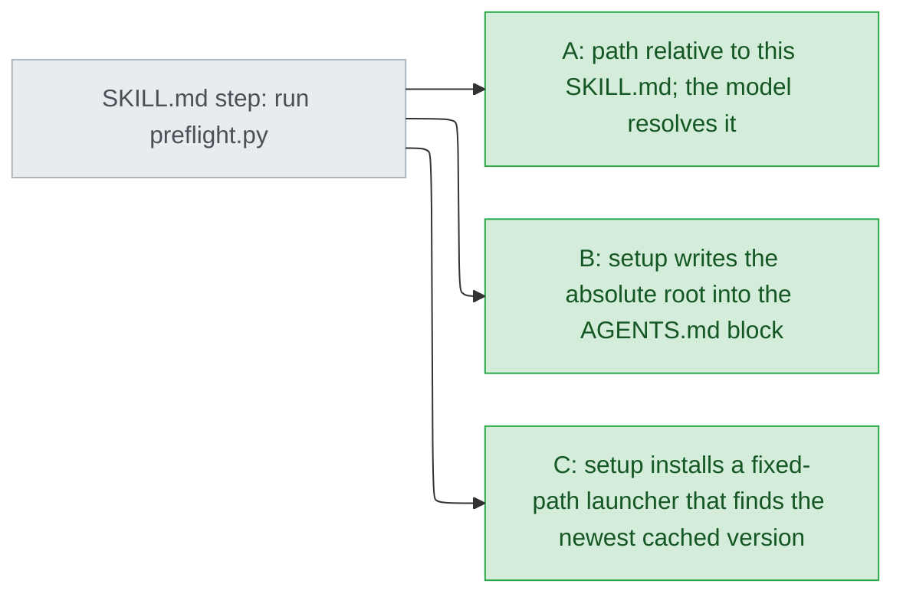
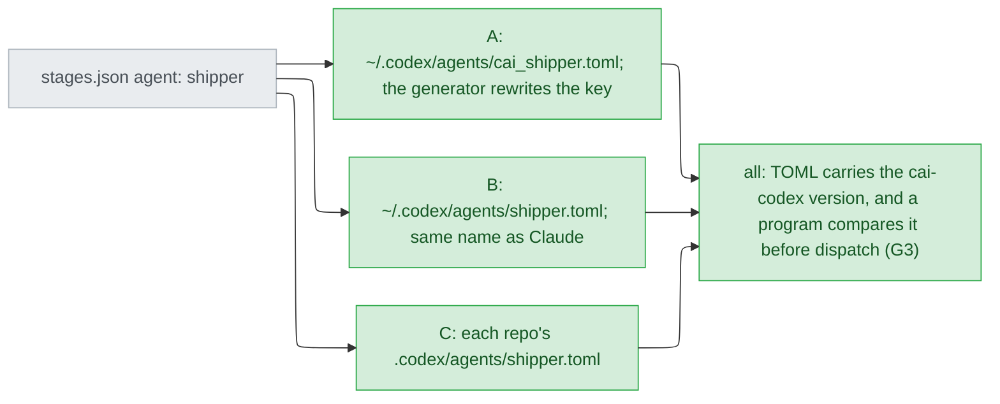
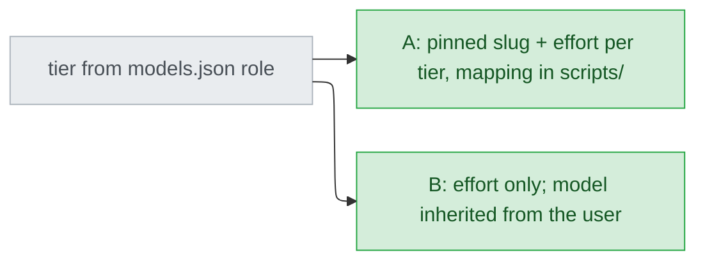
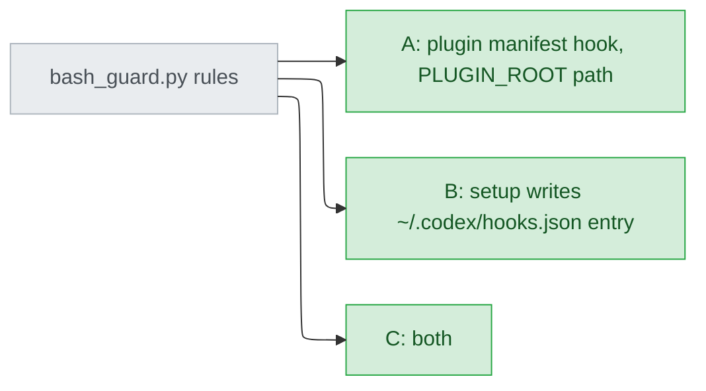
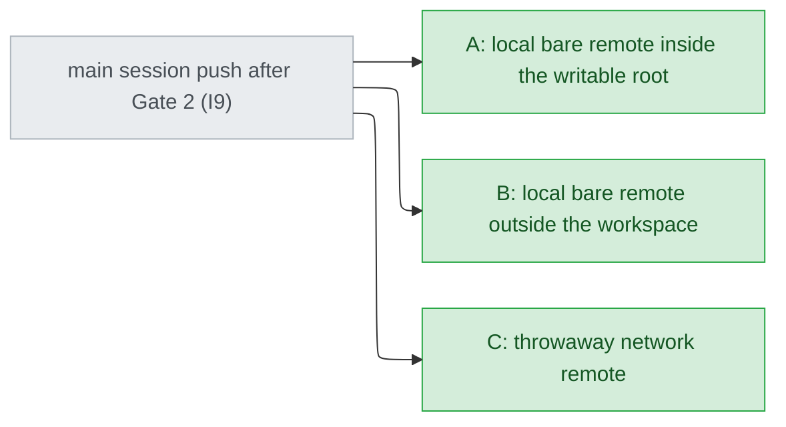

# codex-support — decisions

## Reference

- Stance: `docs/design/2026-09-18-codex-support-stance.md` — status: approved 2026-09-18
- Evidence base:
  - `.claude/track/codex-support/discover/experiments.md` (E1–E8, codex-cli 0.155.0, Windows 11)
  - `discover/blindspot.md`, whose E6 correction overrides experiments.md
- Settled answers from 2026-09-18 that this document does not re-ask:
  - in-repo
  - full parity
  - B′
  - experiments run on the real `~/.codex`
  - the hook and the menu are deferred to verify
  - ship's irreversible steps run in the main session after Gate 2 (stance I9)
- Tier 1 dependency order:
  - D1 goes first because its answer changes the options of two others: D4 option B needs D1's path mechanism, and D2's version check can live in D1 option C's launcher.
  - D2, D3 and D5 do not constrain one another.
  - After D1 was answered, D4 was re-tiered. Its options and tier were unchanged.
- All five Tier 1 entries were answered on 2026-09-18. D5 went against the recommendation, and C12 therefore stays unverified through ship (see D5).

## Feasibility

"Doc" means it is documented but was not observed in a Codex run.

| Id | Capability | Verdict | Evidence |
|---|---|---|---|
| C1 | `.agents/plugins/marketplace.json` lists a plugin whose `source` is a string. It takes precedence over `.claude-plugin/`, and the object form of `source` is silently dropped. | verified | experiments.md:12; `raw/e2-diag-codex-strsource-list.txt`, `raw/e2-diag-codex-list.txt` |
| C2 | Bare `$name` invokes a plugin skill. | verified | experiments.md:13; `raw/e3-exec-dollar-form.jsonl` |
| C3 | `agents/openai.yaml` `policy.allow_implicit_invocation: false` suppresses implicit firing. Tested on one skill only. | verified | experiments.md:14; `raw/e4-exec-implicit.jsonl`, `raw/e4-exec-implicit-true.jsonl` |
| C4 | A user-level `~/.codex/agents/*.toml` can be dispatched by name, and its `model` override is applied (`gpt-5.5`). | verified | experiments.md:15; `raw/e5-subagent-rollout.jsonl` |
| C5 | A plugin-shipped `agents/*.toml` can be dispatched. | infeasible | experiments.md:15; `raw/e5-plugin-agent-parent-rollout.jsonl` |
| C6 | A subagent's `sandbox_mode` / `tools:` is enforced. It inherits `workspace-write` with no network. | infeasible | experiments.md:15; https://learn.chatgpt.com/docs/agent-configuration/subagents "Codex respects inherited sandbox policies and approval requirements from the parent agent." |
| C7 | `${CLAUDE_PLUGIN_ROOT}` (or `${PLUGIN_ROOT}`) is substituted in a skill body. | infeasible | experiments.md:13; `raw/e3-exec-dollar-form.jsonl:7` |
| C8 | The model reads a skill's `SKILL.md` by its absolute cache path, which includes the version directory. | verified | `raw/e3-exec-dollar-form.jsonl:5`; `raw/e1-plugin-add.txt:2` |
| C9 | A trusted hook fires, and exit 2 blocks. The payload shape is unknown. `plugin_hooks` shows `removed` in `codex features list`. | UNVERIFIED | experiments.md:16; https://learn.chatgpt.com/docs/hooks "Use `/hooks` in the CLI to inspect, review, and trust hook definitions."; the same page says a plugin's hook paths "are resolved relative to the plugin root" and documents `PLUGIN_ROOT`. The user deferred this to verify. |
| C10 | `request_user_input` works in `codex exec`. | infeasible | experiments.md:18; `raw/e8-exec-enabled.jsonl` |
| C11 | `request_user_input` renders as a menu in the TUI with `--enable default_mode_request_user_input`, and has a free-text slot. | UNVERIFIED | experiments.md:18. The user deferred this to verify. |
| C12 | The main session's `git push` raises a Codex approval prompt when network is off. | UNVERIFIED | https://learn.chatgpt.com/docs/agent-approvals-security "By default, network access remains disabled"; no run observed it. **It will not be verified before ship (D5=A):** a local-path push needs no network. The stance's fallback can therefore fire only after release. |
| C13 | A subagent can spawn its own subagent. | UNVERIFIED | Not found at https://learn.chatgpt.com/docs/agent-configuration/subagents (doc fetch 2026-09-18); E5 tested one level only |
| C14 | `project_doc_max_bytes` also caps the global `~/.codex/AGENTS.md`, and what happens past the cap. | UNVERIFIED | https://learn.chatgpt.com/docs/config-file/config-reference "the maximum bytes read from `AGENTS.md` when building project instructions". The default and the global-file behaviour were not found. |
| C15 | `CODEX_HOME` relocates all state, auth included. | verified | https://learn.chatgpt.com/docs/config-file/environment-variables "sets the root for Codex state, including config, auth, logs, sessions, skills, and standalone package metadata" |
| C16 | The ledger still writes a record when there is no Claude session id; usage is left empty and the reason recorded. | verified | `plugins/cai/scripts/ledger.py:236-240` |
| C17 | The plugin cache is keyed by version directory. | verified | `raw/e1-plugin-add.txt:2` |
| C18 | Windows PowerShell 5.1 has no `&&`. | verified | https://learn.microsoft.com/en-us/powershell/module/microsoft.powershell.core/about/about_pipeline_chain_operators "Beginning in PowerShell 7, PowerShell implements the `&&` and `||` operators"; the Codex shell is `WindowsPowerShell\v1.0` (`raw/e3-exec-dollar-form.jsonl:5`) |
| C19 | Model slugs visible to this account: `gpt-5.6-luna` ("Fast and affordable"), `gpt-5.6-terra` ("Balanced"), `gpt-5.5` ("previous-generation"). Whether other accounts see the same list is unknown. | UNVERIFIED | `~/.codex/models_cache.json:178` (`gpt-5.6-luna`). The file was fetched 2026-09-18 and carries a per-account `identity` field. |
| C20 | codex-cli updates itself between runs. | verified | blindspot.md:4 (0.149.1 to 0.155.0 on 2026-09-18) |

## Ruled out

| Option | Invariant it violates | Evidence |
|---|---|---|
| Add Codex tier or model columns to `plugins/cai/models.json` | I1 | `plugins/cai/models.json` sits under `plugins/cai/` |
| Leave `${CLAUDE_PLUGIN_ROOT}` in the output and hope Codex substitutes it | I6 | C7 |
| Enable network for subagents so the shipper pushes itself | I9 | stance I9; C6 |
| Gates that work only with a menu | I7 (a typed answer must also count) | C10, C11 |
| Copy `approval-gates.md:21` ("`AskUserQuestion` adds that entry itself") unchanged | I4 | `plugins/cai/skills/track/references/approval-gates.md:21` |
| Make the push prompt the only protection, without Gate 2 | I9 | C12 |
| Tie cai-codex's version to cai's version (lockstep) | I1: a Codex-only fix would need an edit to `plugins/cai/.claude-plugin/plugin.json` | `plugins/cai/.claude-plugin/plugin.json:3` |

## Requirement gaps

| # | The behavioural assumption | Veto condition, or verification path | Deletes |
|---|---|---|---|
| G1 | The user keeps Codex's sandbox and approval prompts on (stance, Sacrifices). | Veto: before Gate 2, the Codex ship stage says the push prompt may be absent. C12 itself stays untested through ship (D5=A), so this statement is the only warning a user gets. Verification path: a user's first real network push, after release. | Any ship text that presents the prompt as guaranteed |
| G2 | The user trusts the guard with `/hooks` after setup (C9). | Veto: setup ends by listing the guard as "inactive until trusted", and the Codex README's mapping row says the same. | Any setup or README that calls the guard active once installed |
| G3 | The user re-runs setup after every plugin update, so the installed agents match (C17). | Veto: a program detects the mismatch between the agents' version and the plugin's version before a stage dispatches. | Any D2 variant that only documents "re-run setup" |

## Tier 1

### D1 — How does generated text find the plugin's scripts, now that `${CLAUDE_PLUGIN_ROOT}` is not substituted?

| Option | Rests on | What it costs | Fails when |
|---|---|---|---|
| A — The generator rewrites each root to a path relative to the skill's own `SKILL.md`, and adds one sentence: resolve it from the path you read. | C7, C8 | Generator rules only; nothing is installed. | The model resolves the path against the repo's working directory. That happens silently, on one of 209 sites. |
| B — Setup writes the installed plugin root into the AGENTS.md block, and skills refer to it by name. | C8, C17 | Setup writes one line. | A plugin update moves the root to a new version directory (C17) and setup is not re-run, so the path goes stale. |
| C — Setup installs a small launcher at a fixed user path. The launcher picks the newest cached cai-codex version and runs the named script. | C17 | A hand-written script outside the generator. It must parse the cache layout. | Codex changes its cache layout. |

- **Blast radius:** 97 generated files and every program gate (`plugins/cai/skills/track/SKILL.md:49,63`).
- **Found out when:** AC4's end-to-end run in the TUI. A silent misresolution may only appear in real use, after release.
- **Undo cost:** regenerate. B and C also leave files in users' home directories.
- **Decided:** C, a launcher at a fixed path — chosen by the user via menu ("C 啟動器 (Recommended)"), 2026-09-18. The D2 version check and the D4 hook command both use this launcher's fixed path.

### D2 — Where are the Codex agents installed, and what are they called?

| Option | Rests on | What it costs | Fails when |
|---|---|---|---|
| A — Personal `~/.codex/agents/`, with names prefixed `cai_`. The generator rewrites the `stages.json` `agent` column and every dispatch sentence. | C4, C5 | One more rewrite rule. The names differ from Claude's. | A dispatch sentence the generator misses. `--check` can assert that zero unprefixed names remain. |
| B — Personal `~/.codex/agents/`, keeping Claude's names. | C4, C5 | No rewrite. | The user already has a personal agent of the same name. Which one wins is UNVERIFIED; verify can install a same-named agent and see. |
| C — Project-scoped `.codex/agents/` in each repo, keeping Claude's names. | C5; the doc at https://learn.chatgpt.com/docs/agent-configuration/subagents says: "`~/.codex/agents/` (personal) or `.codex/agents/` (project-scoped)" | Setup runs once per repo and writes into the user's repo, so the files show up in `git status`. | Dispatch from a project-scoped agent was never observed (E5 tested personal only). |

- **Blast radius:** the user's `~/.codex/agents/` or every repo they use, plus every stage's dispatch.
- **Found out when:** a name clash surfaces only on a user's machine, after release.
- **Undo cost:** renaming or relocating published agents means users must re-install and re-learn the names.
- **Decided:** A, personal `~/.codex/agents/` with a `cai_` prefix — chosen by the user via menu ("A 加 cai_ 前綴 (Recommended)"), 2026-09-18. The prefix applies to agents only; skill names stay as they are (D7).

### D3 — Which Codex model and reasoning effort does each tier (chore, build, think) run on?

| Option | Rests on | What it costs | Fails when |
|---|---|---|---|
| A — Pin a slug and an effort per tier: chore `gpt-5.6-luna`/low, build `gpt-5.6-terra`/medium, think `gpt-5.6-terra`/high. No listed model is described as stronger than terra (C19). | C4, C19, C20 | A mapping table under `scripts/` (Ours), and re-tiering as models change. | A slug is retired or hidden for this account (C19 is per-account; C20 means the client moves on). Dispatch then breaks for users. |
| B — Set only `model_reasoning_effort` per tier and leave `model` out. | C4 | Nothing to maintain. | Leaving `model` out does not inherit it (UNVERIFIED). Or the user's default is expensive, so cheap tiers are no cheaper. |

- **Blast radius:** every agent TOML, and the cost of every dispatch.
- **Found out when:** A's failure shows only for users whose model list differs, after release. B's cost failure shows on a bill.
- **Undo cost:** regenerate and re-run setup.
- **Decided:** A, pinned slugs — chosen by the user via menu ("A 寫死模型 (Recommended)"), 2026-09-18. The mapping is chore `gpt-5.6-luna`/low, build `gpt-5.6-terra`/medium, think `gpt-5.6-terra`/high. The table lives under `scripts/`, because `models.json` is ruled out by I1.

### D4 — Where is the bash guard hook declared on Codex?

| Option | Rests on | What it costs | Fails when |
|---|---|---|---|
| A — In the plugin's manifest, using `PLUGIN_ROOT`. | C9 | Generated; nothing is written to the user's home. | `plugin_hooks` really is removed in this build (experiments.md:16), so the guard never runs. |
| B — Setup writes an entry into the user-level `~/.codex/hooks.json`. | C9, plus D1's path | A hand-written write into the user's config. It needs an absolute script path (see D1). | The path goes stale after an update. |
| C — Both. | C9 | Both costs, and the guard may fire twice. | Neither declaration can be trusted. |

- **Blast radius:** who is allowed to force-push or `rm -rf`, which is high by default. It also touches the user's config.
- **Link to D1:** B uses the same path mechanism D1 picks. A uses `PLUGIN_ROOT`, which applies only to hooks.
- **Found out when:** verify's TUI run (deferred there by the user).
- **Undo cost:** B and C leave config in users' homes.
- **Decided:** B, setup writes the hook into `~/.codex/hooks.json`, and its command runs the guard through the D1 launcher — chosen by the user via menu ("B setup 寫入 (Recommended)"), 2026-09-18. It was asked after D1. The main session judged that D1=C did not change D4's options or tier.

### D5 — Which remote does AC4's end-to-end run push to?

| Option | Rests on | What it costs | Fails when |
|---|---|---|---|
| A — A local bare remote inside the session's writable root. | C6 | No credentials, and nothing leaves the machine. | It never tests C12: a push to a local path needs no network, so no prompt is expected. The stance's key assumption stays untested after verify. |
| B — A local bare remote outside the workspace. | C6, C12 | No credentials. | Whether a write outside the workspace raises a prompt is an inference (blindspot.md:26, :57). Even if it does, it is a different prompt from the network one I9 relies on. |
| C — A throwaway network remote, such as a private repo created for the run and deleted afterwards. | C12 | Needs the user's `gh` or git credentials in the run, a real remote-side effect, and clean-up afterwards. | The credential setup fails inside the sandbox. |

- **Blast radius:** AC4, the primary acceptance criterion (intake.md:20), and whether the stance's C12 assumption is ever checked.
- **Found out when:** verify. With A, C12 is never found out before release.
- **Undo cost:** low for the test itself. Credentials are high by default.
- **Decided:** A, a local bare remote inside the writable root — chosen by the user via menu ("A 工作區內本機"), 2026-09-18. **This was not the recommended option (C was).** The consequences are carried as follows:
  - C12 will not be verified before ship.
  - The stance's fallback ("if verify shows push goes through without a prompt, return to stance, option 2") cannot fire during verify. It can only fire after release, on a Codex user's first real network push.
  - The Codex README's mapping table must list the push-approval row as "documented, not tested".
  - Verify has to check that this row is present.

## Tier 2

### D6 — Which marketplace form?

Use `.agents/plugins/marketplace.json` with a string `source`, and have `validate.py` check that the source is a string. The object form is dropped silently (C1, experiments.md:12). **Found out when:** the next `validate.py` run.

### D7 — What are the skills invoked as?

Keep Claude's skill names, so skills are invoked as `$track`. AC3's rewrite names `$track` (blindspot.md:34), and the bare form works (C2, experiments.md:13). **Found out when:** AC3's install check.

### D8 — How are the 72 catalog skills kept from firing implicitly?

The generator adds `agents/openai.yaml` with `allow_implicit_invocation: false` to each of the 72. None has one today (stance UC1), and C3 shows the flag works (experiments.md:14). **Found out when:** `--check` counts 72 files, and AC3 runs.

### D9 — How do `build` and `verify` dispatch reviewers and helpers?

The main session dispatches them, and `verifier` only reconciles the results; the same goes for `build`. One-level dispatch is the only kind observed (C4, experiments.md:15). Nesting (`plugins/cai/agents/verifier.md:7`, `implementer.md:6`) is not documented anywhere fetched and is untested (see the Feasibility row on nested spawn). Being wrong here costs extra main-session context and one override to delete. **Found out when:** AC4, or when verify proves nesting works.

### D10 — How do gates ask on Codex?

Ask with the menu tool when it is present; otherwise ask with numbered options answered in text. Either way, the main session writes `gate: human` (`approval-gates.md:53-55`, stance I7). `raw/e8-exec-enabled.jsonl` shows menus are impossible in exec mode. **Found out when:** AC4 in the TUI.

### D11 — What goes into `~/.codex/AGENTS.md`, and how is a size cap caught?

All 8 rules go into one marked block, with their Claude-only sentences overridden (I4; intake.md:24, AC8). Together they are 15,392 bytes (`wc -c plugins/cai/rules/*.md`). Nothing is cut in advance, because the cap is unknown. Verify has the model quote the last rule's final sentence from the installed block, so silent truncation is caught before release. **Found out when:** verify's AC8 check.

### D12 — What happens to usage accounting in the Codex ledger?

It is accepted as degraded: usage stays empty and the reason is recorded, while the record is still written (C16, `plugins/cai/scripts/ledger.py:236-240`). A Codex usage collector is out of scope (stance, Out of scope). **Found out when:** AC4's `ledger.jsonl`.

### D13 — What is cai-codex's version policy?

cai-codex has its own version. `--check` fails if the generated output changes while the version stays the same, because the cache is keyed by version (C17, `raw/e1-plugin-add.txt:2`), so an unbumped change never reaches an install. Lockstep with cai is under Ruled out. **Found out when:** the next `validate.py` run.

### D14 — How are verify's Codex runs isolated?

Use the real `~/.codex` with backup, restore and `changes.log`, the same method discover used (experiments.md:20-31). `CODEX_HOME` would relocate auth too (C15), which means copying credentials. **Found out when:** the restore diff after verify.

## Tier 3

| Decision | Chose | Instead of | Found out when |
|---|---|---|---|
| D15 Override list format | A data file of (target, exact anchor sentence, replacement) entries, read by `gen-codex.py` | Overrides hard-coded in Python | The next `--check` run |
| D16 Bash-only commands (C18) | Rewrite each into a form that parses in both PowerShell 5.1 and bash, plus a `--check` rule that fails on `&&` in generated skills | Separate text per shell | The next `--check` run |
| D17 `sandbox_mode` in agent TOMLs (C6) | Keep the declared value, noted in the TOML as unenforced | Omit it | The next `--check` run |
| D18 Hand-written Codex files: the setup skill and the D1 launcher. Setup writes the D2 agents, the D4 `hooks.json` entry, and the D11 block. | Listed by path in `gen-codex.py`; `--check` requires they exist and does not regenerate them | A separate hand-written directory | The next `--check` run |
| D19 What setup prints about rule size (C14) | The total bytes, plus a note that the cap is unverified | Printing nothing | The next setup test |
| D20 What the generated build and verify text says about nesting (C13) | One line: nested dispatch is untested on Codex, so this procedure does not use it (D9) | Saying nothing | The next `--check` run |
