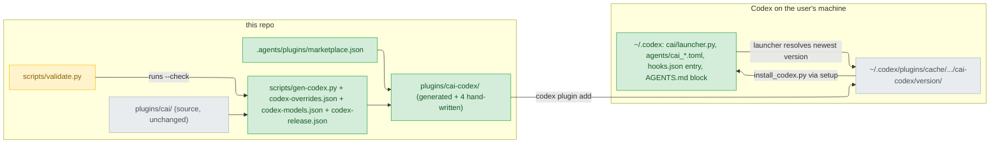
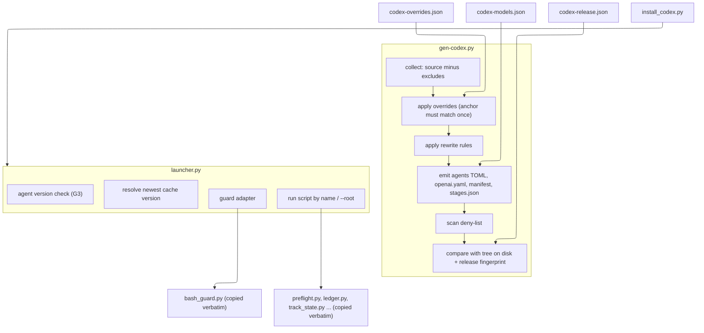
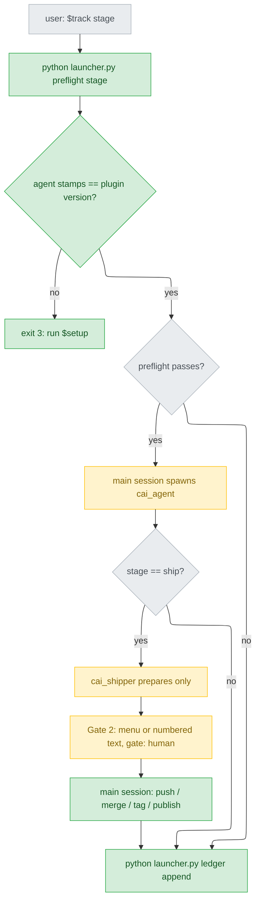
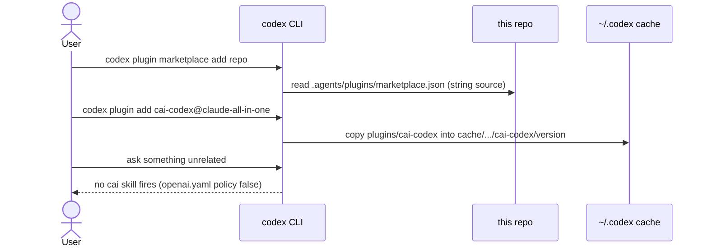
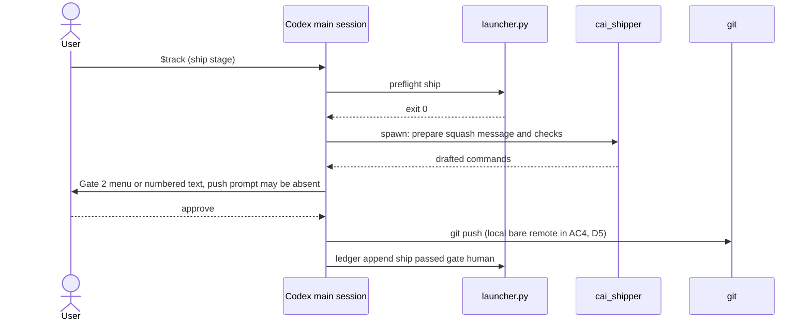
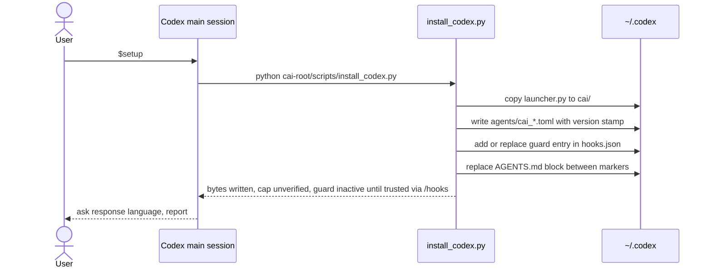
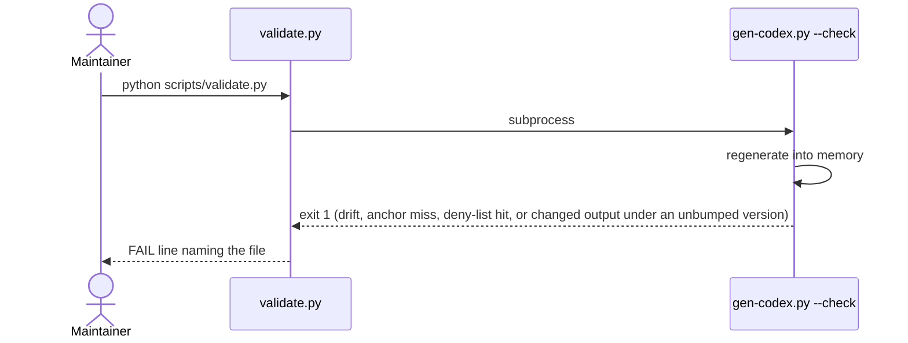
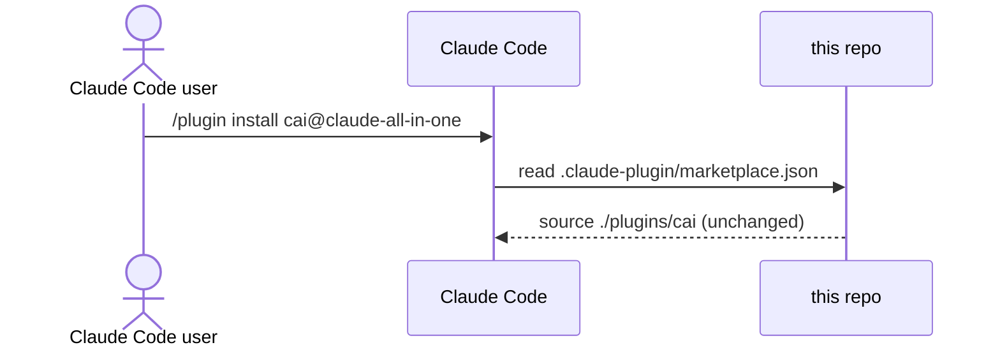

# codex-support — detail design

## Reference

Stance doc: docs/design/2026-09-18-codex-support-stance.md
Decisions doc: docs/design/2026-09-18-codex-support-decisions.md
Status: approved 2026-09-18. On 2026-09-18 the stance's Sacrifices bullet 3 was reworded after D5; it gets re-signed at Gate 1.

These inputs are fixed:
- stance invariants I1–I9;
- decisions D1–D20, including the Tier 1 answers D1=C, D2=A, D3=A, D4=B and D5=A;
- requirement gaps G1–G3.

This document implements them and re-opens none of them.

Some choices are defaults that still need the user's answer. Each of those carries a `[Qn default]` marker, `n` being its entry under `## Pending questions` in the stage report. An answer replaces exactly the text inside that marker and nothing else.

Evidence paths:
- `E<n>` means row n of `.claude/track/codex-support/discover/experiments.md` (E1 = line 11 … E8 = line 18).
- `raw/` means `.claude/track/codex-support/discover/raw/`.

### Traceability

| From the high-level design | Satisfied by | Status |
|---|---|---|
| UC1 install | U3 (manifest, D6 marketplace, D8 `openai.yaml` ×81) and U6 (marketplace file added last); AC3 run in verify | covered |
| UC2 six stages end to end in the TUI | U1–U5; AC4 in verify with a local bare remote (D5=A) | covered. C12 is not exercised (D5) |
| UC3 Codex setup | U5 (`install_codex.py`, AGENTS.md block, agents, hooks.json) | covered |
| UC4 maintainer drift | U1 (`--check`: drift, anchor miss, deny-list), U3 (release fingerprint), `validate.py` wiring | covered |
| UC5 Claude users see no change | Every unit writes outside `plugins/cai/`. `test_gen_codex.py` asserts `git diff main -- plugins/cai/` is empty | covered |
| R1 `${CLAUDE_PLUGIN_ROOT}` stays literal | U1 rewrite rules plus the launcher (D1=C); deny-list count must be 0 (I6) | covered |
| R2 bash-only syntax in PowerShell 5.1 | U2 overrides for 8 lines in 4 files (D16); a fenced-block deny-list | covered |
| R3 Claude-only claims copied over | U2 overrides; a `--check` deny-list of Claude-only tokens (I4) | covered |
| R4 ship's irreversible steps unguarded | U2 overrides move them to the main session (I9); U4 guard adapter plus U5 hooks.json (D4) | covered. Guard firing is UNVERIFIED (C9) |
| R5 no network in a subagent | Same override as R4: pushes run in the main session (I9) | covered |

## Requirement

A Codex CLI user installs `cai-codex` from this repo, runs `$setup` once, and can then run `$track` through all six stages in the interactive TUI. That includes the two human gates and the `preflight.py`/`ledger.py` program gates. `plugins/cai/` and Claude Code's behaviour stay byte-identical (I1).

We know it worked when:
- AC1, AC2, AC5, AC7 and AC8 pass under `validate.py` and `pytest`;
- AC3 and AC4 pass in verify's manual TUI run;
- the Codex README's mapping table (AC6) marks every row "verified", "documented, not tested" or "degraded", and the push-approval row reads "documented, not tested" (D5).

## Glossary

| Term | Definition | Where it lives |
|---|---|---|
| source tree | The Claude plugin that every Codex file is derived from. | .claude-plugin/marketplace.json:11 |
| generator | The maintainer script that turns the source tree into the Codex tree and checks it. | new — scripts/gen-codex.py |
| Codex tree | The Codex plugin: generated files plus the listed hand-written files. | new — plugins/cai-codex/ |
| override | One entry that replaces an exact source sentence or paragraph (the anchor) in one file with Codex text. | new — scripts/codex-overrides.json |
| anchor | The exact source text an override must find, once, in its target file; if it is not found, `--check` fails. | concept |
| rewrite rule | A mechanical token substitution applied to every generated text file after the overrides, e.g. `/cai:x` becomes `$x`. | new — scripts/gen-codex.py |
| deny-list | Tokens that must not appear in generated output, e.g. `${CLAUDE_PLUGIN_ROOT}` or `AskUserQuestion`; a hit fails `--check`. | new — scripts/gen-codex.py |
| hand-written list | Paths inside the Codex tree that the generator never writes, only checks for existence. | new — scripts/gen-codex.py |
| tier table | The Codex model and reasoning effort for each role (D3). | new — scripts/codex-models.json |
| role | A component's tier name (chore/build/think), read from the source's assignments. | plugins/cai/models.json:1 |
| release record | The cai-codex version plus a fingerprint of the generated output (D13). | new — scripts/codex-release.json |
| fingerprint | The SHA-256 over the sorted (relative path, bytes) pairs of every generated file, the manifest excluded. | concept |
| launcher | The fixed-path script that every generated command goes through (D1=C). It resolves the newest cached Codex tree, runs a named script there, checks agent versions (G3) and adapts guard payloads. | new — plugins/cai-codex/scripts/launcher.py |
| installer | The script `$setup` runs. It installs the launcher, the agents, the hook entry and the AGENTS.md block. | new — plugins/cai-codex/scripts/install_codex.py |
| cai root | The absolute directory of the newest cached Codex tree, printed by `launcher.py --root`. | concept |
| agent TOML | The Codex agent definition generated from a source agent `.md`, named `cai_<name>` (D2=A). | new — plugins/cai-codex/agents/ |
| version stamp | The first-line comment `# cai-codex-version: <v>` in every agent TOML. | concept |
| guard | The existing pre-tool-use command checker. | plugins/cai/scripts/bash_guard.py:171 |
| guard adapter | The launcher mode that normalizes a Codex hook payload into the shape the guard reads (`tool_input.command` as a string, `tool_name`). | new — plugins/cai-codex/scripts/launcher.py |
| stages table | Which agent runs each stage; the Codex copy carries the prefixed names. | plugins/cai/skills/track/stages.json:13 |
| AGENTS.md block | The marked region of `~/.codex/AGENTS.md` holding the Codex rules (D11). | concept |
| Codex README | The user-facing install guide and mapping table (AC6). | new — plugins/cai-codex/README.md |
| Codex marketplace | The native marketplace file naming `./plugins/cai-codex` with a string `source` (D6). | new — .agents/plugins/marketplace.json |

## Budgets

| What | Number | Where it comes from |
|---|---|---|
| Files in the source tree | 195 | `find plugins/cai -type f \| wc -l`, 2026-09-18 |
| Lines carrying `${CLAUDE_PLUGIN_ROOT}` (files) | 209 (97) | grep, 2026-09-18; blindspot.md:16 |
| …of which are `python ${CLAUDE_PLUGIN_ROOT}/scripts/*.py` invocations | 17 | grep, 2026-09-18 |
| Lines naming `AskUserQuestion` (files), each needing an override or a rewrite | 33 (13) | grep, 2026-09-18 |
| Lines naming `/cai:` (files) | 55 (28) | grep, 2026-09-18 |
| Bash-only command lines (files) needing D16 overrides | 8 (4) | grep: `skills/quiz/SKILL.md:21-22`, `refactor/references/selection.md:22,25,28`, `procedure-scan.md:19`, `stage-ship.md:69,112` |
| Agent TOMLs generated | 10 | `ls plugins/cai/agents` |
| `agents/openai.yaml` files with the implicit-invocation policy off | 81 | 72 catalog + 9 skills declaring `disable-model-invocation: true` (grep, 2026-09-18) |
| Rules bytes placed in the AGENTS.md block | 15392 | `wc -c plugins/cai/rules/*.md` |
| Model tiers in the tier table | 3 | D3 |
| New subprocess calls added to `validate.py` | 1 | mirrors `scripts/validate.py:1414` |
| Deny-list hits allowed in generated output | 0 | I4, I6 |

## Design decisions

Every row is a consequence of a decision already made. None is a new trade.

- **Generation order.**
  - Order: collect, then anchored overrides, then rewrite rules, then emit (agent TOMLs, `openai.yaml`, manifest, `stages.json`), then the deny-list scan over everything emitted, then the comparison with disk and with the release fingerprint.
  - Overrides run first because their anchors are source text (I3). Rewrites run second so that an override's replacement text is also rewritten.
  - Serves: I2, I3, I4.
- **Everything is generated except four listed files.** The four hand-written files are the Codex setup skill, `launcher.py`, `install_codex.py` and `README.md` (D18). Serves: I2.
- **Excluded from the Codex tree.**
  - Out of scope in the stance:
    - `skills/usage/`, `skills/setup/` (replaced by the hand-written one), `evals/` and `prices.json`;
    - `scripts/{statusline,install_statusline,usage_report,context_peak}.py`.
  - Maintainer-only generators: `scripts/gen-{models,commands}.py`.
  - `hooks/`, because D4=B means setup writes the hook.
  - Serves: stance Out of scope.
- **`${CLAUDE_PLUGIN_ROOT}` rewrites (D1=C).**
  - `python ${CLAUDE_PLUGIN_ROOT}/scripts/<x>.py` becomes `python "$HOME/.codex/cai/launcher.py" <x>` [Q1 approved 2026-09-18].
  - Any other `${CLAUDE_PLUGIN_ROOT}/<path>` becomes `<cai-root>/<path>`, and each affected file gets one preamble line saying `<cai-root>` is what `python "$HOME/.codex/cai/launcher.py" --root` prints.
  - `$HOME` expands inside double quotes in both PowerShell and POSIX shells.
  - Python is on PATH as `python` in Codex's PowerShell on this machine (E7, experiments.md:17). On other machines this is UNVERIFIED; if it is wrong, every program gate fails loudly with "not found".
  - Serves: I6, R1.
- **Agents (D2=A, D3=A, D17).**
  - Each `agents/<n>.md` becomes `agents/cai_<n>.toml` with:
    - `name`, `description`;
    - `model` and `model_reasoning_effort` from the tier table, by the source's role;
    - `sandbox_mode` from the source's declared intent, commented as unenforced;
    - `developer_instructions` = the rewritten body, prefixed by a line listing the source `tools:` as "allowed, not enforced by Codex".
  - The fields `name`, `description`, `model`, `sandbox_mode` and `developer_instructions` are what the E5 probe agent used and Codex accepted (E5, experiments.md:15).
  - `model_reasoning_effort` as an agent-TOML key is UNVERIFIED (the doc fetch found no field list). If it is wrong, the effort is ignored or the agent fails to load; AC4 catches either.
  - The version stamp is a comment, so no unknown key is introduced.
  - In `stages.json` and in every dispatch sentence, agent names get the `cai_` prefix. The deny-list rejects unprefixed agent names in dispatch position.
  - Serves: D2, D3, I5.
- **Implicit invocation.** Every skill whose source frontmatter says `disable-model-invocation: true` gets `agents/openai.yaml` with `policy.allow_implicit_invocation: false`. That is 72 catalog skills (D8) plus 9 skills; the source flag means the same thing C3 tests. The generated `SKILL.md` frontmatter keeps only `name` and `description`, the subset the E3/E4 probes used. Serves: D8, AC3.
- **Ship (I9, G1).**
  - Overrides in `stage-ship.md`, `shipper.md` and `track/SKILL.md` make the shipper prepare only.
  - The main session runs push, merge, tag, publish and ticket-close after Gate 2 (`plugins/cai/skills/track/references/stage-ship.md:7-8`).
  - Before Gate 2, the main session states that Codex's push-approval prompt may be absent.
  - Serves: I9, G1, R4, R5.
- **Verify and build dispatch (D9).** Overrides make the main session dispatch the four reviewers, and any helpers of `build`. `cai_verifier` reconciles; it does not spawn. Serves: D9, D20.
- **Gates (D10, I7).** Overrides replace every "`AskUserQuestion` …" instruction with: use `request_user_input` if the tool is present, otherwise numbered options answered in text; either way the main session writes `gate: human`. Serves: I7, I8.
- **Rules (D11, I4).** Rule sentences that are true only on Claude get overrides. Their text goes into the AGENTS.md block.
  - Known sites: `model-selection.md:26,30-32`, `workflow.md:27`, `option-explainer.md:54` (blindspot.md:24).
  - The deny-list finds the rest.
- **Version (D13).**
  - `plugins/cai-codex/.codex-plugin/plugin.json` carries the version from the release record [Q1 approved 2026-09-18: start at `0.1.0`]. `.codex-plugin/plugin.json` with `version` is the manifest shape Codex installed under a version directory in E3 (`raw/e3-exec-dollar-form.jsonl:5`).
  - `plugins/cai/` is never bumped by this work (I1).
- **Test isolation (D14).** Verify uses the real `~/.codex` with backup, restore and `changes.log`.
- **`CODEX_HOME` and the launcher's fixed path.**
  - The launcher and the installer read `CODEX_HOME` (default `~/.codex`) to find the plugin cache, the agents directory, `hooks.json` and `AGENTS.md`.
  - The launcher itself is always installed at `$HOME/.codex/cai/launcher.py`, even when `CODEX_HOME` points elsewhere. Generated text must name one path that expands in both PowerShell and POSIX shells, and it cannot rely on an optional variable being set (D1=C rests on the path being fixed).
  - The `hooks.json` entry stays consistent because the installer writes the launcher's absolute path into it.

## Diagrams

### Architecture

Look at the two arrows between the cache and `~/.codex`. Setup copies from the cache into fixed paths once. After that, every command goes the other way, from the fixed launcher back into whatever version is newest in the cache. That round trip is what makes plugin updates work without re-running setup for the launcher itself.

### Component

What to look at: the source scripts, shown grey, are copied byte for byte. Everything Codex-specific at run time sits in two new files, the launcher and the installer. At build time it sits in the generator's six steps.

### Flow

Two branches are new:
- the version check that runs before preflight (G3);
- the ship branch, where the irreversible steps leave the subagent and run in the main session after Gate 2 (I9).

### Sequence — UC1

The native marketplace file wins over `.claude-plugin/` (E2), so Codex never sees the untranslated Claude tree (E1).

### Sequence — UC2

The push arrow comes from the main session, not from the subagent. In AC4 the remote is a local path, so no network prompt is expected there (D5).

### Sequence — UC3

Each write replaces cai's own region or files, so a second run leaves the same state (AC8).

### Sequence — UC4

There are four distinct reasons for exit 1, and each prints its own `DRIFT` / `ANCHOR` / `DENY` / `UNRELEASED` prefix.

### Sequence — UC5

Nothing Codex-related is on this path. `.agents/` and `plugins/cai-codex/` are never read by Claude Code, whose marketplace names only `./plugins/cai` (.claude-plugin/marketplace.json:11).

## Implementation spec

### gen-codex.py

- **Responsibility:** produce the Codex tree from the source tree, or check that it is current.
- **Interface:**
  - `python scripts/gen-codex.py [--check] [--source DIR] [--out DIR] [--release X.Y.Z]`.
  - The defaults are `--source plugins/cai --out plugins/cai-codex`.
  - Exit codes: 0 means ok; 1 means drift, anchor miss, deny-list hit or unreleased change; 2 means bad arguments or an unreadable input file.
  - Internal pure functions, for tests:
    - `collect(source: Path) -> dict[str, bytes]`
    - `apply_overrides(files: dict[str, str], overrides: list[Override]) -> dict[str, str]`, which raises `AnchorError`
    - `rewrite(files: dict[str, str]) -> dict[str, str]`
    - `emit(files, tiers: dict, version: str) -> dict[str, bytes]`
    - `deny_hits(files) -> list[tuple[str, int, str]]`
    - `fingerprint(files) -> str`
- **Data:**
  - `codex-overrides.json`: `{"overrides": [{"target": "skills/track/references/approval-gates.md", "anchor": ["line", "..."], "replacement": ["line", "..."], "why": "I4: ..."}]}`. The target is relative to the source root. The anchor and replacement are lists of lines, joined with `\n`. The anchor must occur exactly once in the target.
  - `codex-models.json`: `{"roles": {"chore": {"model": "gpt-5.6-luna", "effort": "low"}, "build": {"model": "gpt-5.6-terra", "effort": "medium"}, "think": {"model": "gpt-5.6-terra", "effort": "high"}}}`. Roles are read from the source's `models.json` assignments; the tier table only maps role to Codex values.
  - `codex-release.json`: `{"version": "0.1.0", "fingerprint": "sha256:<hex>"}`.
- **Errors:**
  - An anchor found 0 or more than once prints `ANCHOR <target>: found N` and exits 1.
  - A `target` that does not exist in the source prints `ANCHOR <target>: missing file` and exits 1. It is treated as drift, because a renamed source file is the likely cause.
  - A deny-list hit prints `DENY <path>:<line>: <token>` and exits 1.
  - `--check` with an on-disk mismatch prints `DRIFT <path>` and exits 1.
  - If the fingerprint differs from the release record, it prints `UNRELEASED: output changed, run --release <greater version>` and exits 1.
  - `--release` with a version not greater than the recorded one exits 2.
  - Write mode writes every file and then deletes generated files that are no longer produced. Hand-written paths are never touched. A crash mid-write leaves a tree that `--check` reports as drift, and re-running write mode repairs it.
- **Deny-list:**
  - Anywhere in the file: `${CLAUDE_PLUGIN_ROOT}`, `AskUserQuestion`, `/cai:`, `subagent_type`, `CLAUDE_CODE_`, `~/.claude/`, `CLAUDE.md`. The `CLAUDE.md` token applies only to rules and agents; a skill may still mention the user's project file.
  - Inside fenced code blocks only: `&&`, `$(date`, `2>/dev/null`, `${VAR:-`.
  - Unprefixed agent names in dispatch position.
  - The exact list is a constant with one comment per entry citing the invariant it enforces.
- **Concurrency:** single writer. Two concurrent write runs could interleave; this is a maintainer tool and nothing runs it concurrently. It is not safe to run while pytest runs, because tests call it on temp dirs only; `--out` defaults to the real tree.
- **Observability:** one line per finding with a fixed prefix, then a summary line `N file(s) generated, M finding(s)`. This mirrors gen-models.py's output shape (plugins/cai/scripts/gen-models.py:114-121).
- **Where it lives:** `scripts/gen-codex.py`, new. It is Ours, because it assumes this repo's layout (CLAUDE.md, "Who a file is for").
- **What it reuses:**
  - The shape of the argparse `--check` flow in gen-models.py (plugins/cai/scripts/gen-models.py:85-125).
  - The frontmatter split in gen-models.py (plugins/cai/scripts/gen-models.py:46-53), reimplemented rather than imported, because that file sits under `plugins/cai/` and importing it is harmless but couples the two.

### launcher.py

- **Responsibility:** from a fixed path, run the right version of a cai-codex script.
- **Interface:**
  - `python "$HOME/.codex/cai/launcher.py" <script-name> [args...]` runs `<cai-root>/scripts/<script-name>.py` with the args, passes the exit code through, and is run from the user's cwd.
  - `python ... --root` prints the cai root.
  - `python ... guard` reads a Codex hook payload on stdin and pipes an adapted payload to `bash_guard.py`, returning its exit code.
  - Before any `<script-name>` run, `preflight` included, it checks agent version stamps.
  - Exit codes: 3 means agent version mismatch; 4 means no cached cai-codex found; otherwise the child's code.
- **Data:**
  - The cache root is `$CODEX_HOME` or `~/.codex`, then `/plugins/cache/*/cai-codex/<version>/`. The version is picked as the highest by numeric (major, minor, patch). The layout `cache/<marketplace>/<plugin>/<version>` was observed in E1 (`raw/e1-plugin-add.txt:2`).
  - Stamps are read from `$CODEX_HOME/agents/cai_*.toml`, first line only.
  - Adapter input is the Codex payload, UNVERIFIED (C9):
    - `tool_input.command` may be a string or an argv list. For a list whose first element is a shell executable followed by `-Command` or `-c`, the adapter takes the next element; otherwise it joins the list with spaces.
    - `tool_name` is set to `Bash` on POSIX and `PowerShell` on Windows, so `bash_guard.py:184` picks the right rule set.
    - Other fields pass through.
- **Errors:**
  - An unparsable payload makes the guard mode exit 0, matching bash_guard's fail-open (plugins/cai/scripts/bash_guard.py:174-175).
  - A mismatch prints `cai-codex agents are version A, plugin is version B: run $setup` to stderr and exits 3.
  - A missing cache prints `cai-codex is not installed` and exits 4.
- **Concurrency:** stateless. It reads the cache and the agents directory only, so it is safe to run twice or in parallel.
- **Observability:** silent on success; one stderr line per failure; `--root` output is the path only.
- **Where it lives:** `plugins/cai-codex/scripts/launcher.py`, new and hand-written. The installed copy is `$HOME/.codex/cai/launcher.py` [Q1 approved 2026-09-18].
- **What it reuses:**
  - The highest-version rule `/cai:setup` already uses (plugins/cai/skills/setup/SKILL.md:16-17).
  - bash_guard.py, unmodified, as a child process.

### install_codex.py

- **Responsibility:** make a user's `~/.codex` match the installed cai-codex version.
- **Interface:** `python <cai-root>/scripts/install_codex.py` with no arguments. The setup skill resolves `<cai-root>` once from its own `SKILL.md` path (C8), because the launcher does not exist yet. Exit codes: 0 means ok; 1 means a write failed, with the failing path printed.
- **Data (writes, in order):**
  1. `$HOME/.codex/cai/launcher.py`, copied from its own tree.
  2. `$CODEX_HOME/agents/cai_*.toml`, copied from `<cai-root>/agents/`; `cai_*.toml` files no longer shipped are removed.
  3. `$CODEX_HOME/hooks.json`. The installer adds, or replaces, the one PreToolUse entry whose command contains `.codex/cai/launcher.py`. That entry's command is `"<sys.executable>" "<abs home>/.codex/cai/launcher.py" guard`, with absolute paths computed at install time, so no variable expansion happens at hook time. Other entries are preserved byte for byte. The hooks.json schema is UNVERIFIED (C9); it copies the shape of the E6 probe, and verify captures the real one.
  4. `$CODEX_HOME/AGENTS.md`. The installer replaces the region between `<!-- cai-codex:begin -->` and `<!-- cai-codex:end -->` [Q1 approved 2026-09-18], or appends it if absent, with the generated rules. Text outside the markers is untouched.
  - Output: `rules: <n> bytes (Codex's AGENTS.md cap is unverified)` (D19), `guard: installed, inactive until you trust it with /hooks` (G2), and one line per file written.
- **Errors:**
  - Each step writes to a temp file and then does `os.replace`, so a failure leaves the previous file intact.
  - An invalid JSON `hooks.json` makes the installer stop before step 3 and print the parse error; it never overwrites a file it cannot read.
  - A begin marker without an end marker stops before step 4.
- **Concurrency:** idempotent. Two runs give the same end state. Two simultaneous runs could interleave step 3; this is not guarded, because setup is interactive and single.
- **Observability:** one line per write, plus the three status lines above.
- **Where it lives:** `plugins/cai-codex/scripts/install_codex.py`, new and hand-written.
- **What it reuses:**
  - The naming and single-purpose shape of `install_statusline.py` (plugins/cai/scripts/install_statusline.py:1).
  - The "copy wholesale, updates propagate" behaviour of `/cai:setup` step 2 (plugins/cai/skills/setup/SKILL.md:25-31).

### Codex setup skill

- **Responsibility:** tell the Codex agent how to run the installer and finish setup.
- **Interface:**
  - `$setup`, with `openai.yaml` policy false.
  - Step 1: resolve `<cai-root>` as two directories up from this `SKILL.md`.
  - Step 2: run the installer.
  - Step 3: ask the response language with a menu or numbered text, and edit the language line inside the AGENTS.md block. This mirrors plugins/cai/skills/setup/SKILL.md:38-50.
  - Step 4: tell the user to run `/hooks` and trust the cai guard.
  - Step 5: report.
- **Data:** none of its own.
- **Errors:** a non-zero installer exit means stop and quote its output.
- **Concurrency:** n/a.
- **Observability:** the installer's lines, quoted.
- **Where it lives:** `plugins/cai-codex/skills/setup/SKILL.md`, new and hand-written.
- **What it reuses:** the step structure of `/cai:setup` (step headings at plugins/cai/skills/setup/SKILL.md:11,25,38,206). Its steps 4–7 have no Codex counterpart: CLAUDE.md bootstrap, the guard self-test, which is replaced by the trust notice (G2), and the status line, which is out of scope.

### Codex README and marketplace

- **Responsibility:** tell Codex users what they get, and list the mapping.
- **Interface:** a Markdown mapping table with columns `Claude Code behaviour | Codex counterpart | Status | Evidence`, where Status is one of `verified`, `documented, not tested`, `degraded`. It must contain these rows:
  - the push-approval row, as `documented, not tested` (D5);
  - the guard row, as `documented, not tested`, "inactive until trusted" (G2);
  - the `tools:`/sandbox row, as `degraded` (E5);
  - the usage row, as `degraded` (D12).
- **Data:** `.agents/plugins/marketplace.json` = `{"name": "claude-all-in-one", "plugins": [{"name": "cai-codex", "source": "./plugins/cai-codex", ...}]}`. The name follows `.claude-plugin/marketplace.json:2`.
- **Errors:** `validate.py` fails if `source` is not a string (D6).
- **Concurrency:** n/a.
- **Observability:** n/a.
- **Where it lives:** `plugins/cai-codex/README.md` (hand-written) and `.agents/plugins/marketplace.json`, both new.
- **What it reuses:** the table in intake.md:26-34 as the row list.

### validate.py wiring

- **Responsibility:** run the generator's check, and cover the Codex payload in the guard cases.
- **Interface:**
  - `check("plugins/cai-codex matches gen-codex.py", rc == 0)` after `subprocess.run([sys.executable, "scripts/gen-codex.py", "--check"])`, placed beside the gen-models block (scripts/validate.py:1405-1418).
  - `check(".agents/plugins/marketplace.json sources are strings", ...)`.
  - New `CASES` entries: `git push --force origin main` in a Codex-shaped payload, run through `launcher.py guard`, expecting 2 (AC5). The payload shape follows the documented form and is marked UNVERIFIED in a comment.
- **Errors:** as the existing checks.
- **Concurrency:** n/a.
- **Observability:** PASS/FAIL lines.
- **Where it lives:** `scripts/validate.py`, which exists.
- **What it reuses:** `check()` (scripts/validate.py:18) and `run_hook()` (scripts/validate.py:2185).

## Naming

| Name | What it is | Chosen by |
|---|---|---|
| `scripts/gen-codex.py` | generator | the user, 2026-09-18 (intake approach B′) |
| `plugins/cai-codex/` | Codex tree | the user, 2026-09-18 (intake approach B′) |
| `.agents/plugins/marketplace.json` | Codex marketplace | the user, 2026-09-18 (intake approach B′); path required by Codex (E2) |
| `cai-codex` | plugin name in the Codex marketplace and manifest | follows the directory name, as `cai` follows `plugins/cai` at .claude-plugin/marketplace.json:9,11 |
| `claude-all-in-one` | Codex marketplace name | follows .claude-plugin/marketplace.json:2 |
| `scripts/codex-overrides.json` | override list | follows the JSON data-file convention of plugins/cai/models.json:1 and the hyphenated `scripts/` names (`scripts/run-validate-hook.cmd`) |
| `scripts/codex-models.json` | tier table | same convention as above |
| `scripts/codex-release.json` | release record | same convention as above |
| `cai_<agent>` (e.g. `cai_shipper`) | agent names and TOML files | the user, 2026-09-18 (D2=A) |
| `$setup`, `$track`, … | skill invocations | D7 (Tier 2, 2026-09-18) |
| `plugins/cai-codex/scripts/install_codex.py` | installer | follows `install_statusline.py` at plugins/cai/scripts/install_statusline.py:1 |
| `$HOME/.codex/cai/` | install directory for the launcher | follows the `<config dir>/cai/` convention at plugins/cai/scripts/usage_collector.py:56 |
| `launcher.py` (in `plugins/cai-codex/scripts/` and `$HOME/.codex/cai/`) | launcher file name | [Q1 approved 2026-09-18] |
| `<!-- cai-codex:begin -->` / `<!-- cai-codex:end -->` | AGENTS.md markers | [Q1 approved 2026-09-18] |
| `# cai-codex-version: <v>` | version stamp line | [Q1 approved 2026-09-18] |
| `0.1.0` | first cai-codex version | [Q1 approved 2026-09-18] |
| `<cai-root>` | placeholder used in generated prose for the cai root | [Q1 approved 2026-09-18] |
| `DRIFT` / `ANCHOR` / `DENY` / `UNRELEASED` | `--check` finding prefixes | follows `DRIFT` at plugins/cai/scripts/gen-models.py:116 |
| exit 3 / exit 4 | launcher: version mismatch / not installed | [Q1 approved 2026-09-18] |

## Change points

| Path | Change | Exists today |
|---|---|---|
| scripts/gen-codex.py | new generator | no |
| scripts/codex-overrides.json | new override list | no |
| scripts/codex-models.json | new tier table | no |
| scripts/codex-release.json | new release record | no |
| plugins/cai-codex/** | new generated tree plus 4 hand-written files | no |
| .agents/plugins/marketplace.json | new; added in the last unit | no |
| scripts/validate.py | one `--check` call, a string-source check, Codex guard `CASES` | yes |
| tests/test_gen_codex.py | new | no |
| tests/test_codex_launcher.py | new | no |
| tests/test_codex_install.py | new | no |
| CLAUDE.md | "Who a file is for" names `plugins/cai-codex/` as a second shipped tree [Q2 approved 2026-09-18: edit] | yes |
| plugins/cai/** | none (I1) | yes |

No new dependency: the standard library only, the same as every existing script.

## Failure modes

| Situation | What happens | What the caller sees |
|---|---|---|
| A source sentence under an override is edited | Anchor found 0 times | `validate.py` FAIL; `ANCHOR <target>: found 0` |
| A new Claude-only token appears in the source | Deny-list hit | FAIL; `DENY <path>:<line>: <token>` |
| The generator output changed but the version did not | Fingerprint mismatch | FAIL; `UNRELEASED ...` |
| The plugin was updated and setup was not re-run | Version stamps differ | Every stage refuses with exit 3: "run $setup" (G3) |
| `python` is not on PATH in the user's Codex shell | Every generated command fails | "python not found" at the first preflight. UNVERIFIED off this machine (E7 verified here) |
| The Codex hook payload is not the documented shape | The adapter passes an empty command; the guard allows it | Nothing. The guard is silently inactive, and the README row already says "documented, not tested"; verify captures the real payload (C9) |
| The user never trusts the hook | The guard never runs | The setup report says so (G2) |
| The cap on the global `AGENTS.md` truncates the block | The last rules are unseen | Verify's quote-the-last-sentence check fails (D11) |
| `model_reasoning_effort` is not a valid agent key | The agent fails to load, or the effort is ignored | A dispatch error in AC4; fix in the generator |
| A slug is unavailable for an account | Dispatch error | An error naming the model (D3 accepted) |
| A push from the main session raises no prompt | Force push held only by Gate 2 and the guard | Nothing before release; README row "documented, not tested" (D5) |
| `hooks.json` is corrupt | The installer stops before touching it | The parse error and path |

## Rollout

- **Pieces.** It ships as one PR built in units U1–U6. Nothing is installable until U6 adds `.agents/plugins/marketplace.json`, so a partial merge exposes no half-working plugin to Codex users. The smallest useful piece is U1–U3: a generated tree that `validate.py` checks.
- **Existing data.** Nothing is migrated. Claude users' installs, `~/.claude/` and ledgers are untouched (I1). Existing `.claude/track/` directories are read by the Codex copy of the same scripts unchanged (plugins/cai/scripts/track_state.py:21).
- **In-flight callers.** Claude Code sessions see no change. Before this lands, Codex users who added this repo got the untranslated tree (E1). After it lands, a re-add picks the native file (E2).
- **Rollback.** Revert the PR; nothing in the repo was migrated. A Codex user who installed rolls back with `codex plugin remove cai-codex@claude-all-in-one` and by deleting the files the installer wrote:
  - `~/.codex/cai/`
  - `~/.codex/agents/cai_*.toml`
  - the cai entry in `hooks.json`
  - the marked `AGENTS.md` block

  The README lists these. No uninstall code is added (nothing asked for it).
- **Versioning.**
  - cai-codex follows its own version in `scripts/codex-release.json` (D13), starting at [Q1 approved 2026-09-18: `0.1.0`], and is bumped whenever the generated output changes.
  - `plugins/cai/`'s version is not bumped by this PR, because nothing under it changes (I1).

## Verification

| Criterion | Level | What it needs | Green before |
|---|---|---|---|
| UC4/AC1: clean tree `--check` exits 0 | unit | real repo tree; pytest `tests/test_gen_codex.py` | U1 merges |
| UC4/AC1: edited anchor makes `--check` exit 1 | unit | temp copy of the source with one anchor sentence altered, `--source/--out` temp dirs | U1 merges |
| R1/I6: zero `${CLAUDE_PLUGIN_ROOT}` in output | unit | generated temp tree | U1 merges |
| R3/I4: zero deny-list hits | unit | generated temp tree | U2 merges |
| R2/D16: the 8 bash-only lines rewritten, none left in fenced blocks | unit | generated temp tree | U2 merges |
| I9/G1: ship override text present, and shipper text says prepare only | unit | string asserts on the generated `stage-ship.md` and `shipper.md` | U2 merges |
| D2/D3/D17: 10 `cai_*.toml`, tier table applied, stamp on line 1; `stages.json` agents prefixed | unit | generated temp tree | U3 merges |
| D8: 81 `openai.yaml` with policy false | unit | generated temp tree | U3 merges |
| D13: changed output with an unchanged version exits 1; `--release` refuses a lower version | unit | temp release record | U3 merges |
| UC5/AC2: `git diff main -- plugins/cai/` empty | integration | git in CI | every unit |
| Launcher resolves the highest version; `--root`; exit 3 on stamp mismatch; exit 4 with no cache | unit | fake `CODEX_HOME` with `0.1.0` and `0.2.0` dirs; `tests/test_codex_launcher.py` | U4 merges |
| AC5: guard adapter, string / argv-list / missing command; Windows payload uses PowerShell rules | unit + `validate.py` CASES | synthetic payloads (documented shape, UNVERIFIED) | U4 merges |
| UC3/AC8: installer twice gives one AGENTS.md block, agents copied, other hooks.json entries preserved, output prints bytes and "inactive until trusted" | unit | fake home dir; `tests/test_codex_install.py` | U5 merges |
| D6: marketplace `source` is a string | `validate.py` | repo file | U6 merges |
| AC6: every README row carries a Status. Assert each mandated row's exact Status: push approval = `documented, not tested`; guard = `documented, not tested` with "inactive until trusted"; `tools:`/sandbox = `degraded`; usage = `degraded` | unit | string asserts on `README.md` | U6 merges |
| AC7: `validate.py` and `pytest` green (the known Windows failure excepted) | integration | full suite | every unit |
| UC1/AC3: install, skills visible, no implicit firing | end-to-end, manual | real `~/.codex` with backup, restore, `changes.log` (D14) | verify stage |
| UC2/AC4: six stages `done`, six `passed`, design and ship `gate: human`, bare remote receives the push | end-to-end, manual in the TUI | fixture repo plus a local bare remote inside the writable root (D5=A); setup run; guard trusted | verify stage |
| C9/C11/C13/C14 observations: payload captured, menu seen, AGENTS.md last sentence quoted | end-to-end, manual | same run | verify stage; if any is wrong, return to design |

## Work breakdown

Each unit leaves `validate.py` and `pytest` green (workflow.md, checkpointed units). Deviations are logged in the format `stage-build.md` defines. Run pytest with nothing else editing the tree: pytest mutates real files.

| Unit | Depends on | Can run alongside | Done when |
|---|---|---|---|
| U1 Generator core: collect/exclude, override engine with the anchor rule, the deny-list step shipped with only the two tokens U1's rewrites clear (`${CLAUDE_PLUGIN_ROOT}`, `/cai:`) so `validate.py` stays green, `${CLAUDE_PLUGIN_ROOT}` and `/cai:` rewrites, `--check` (DRIFT/ANCHOR), `--source/--out`, the first override (`approval-gates.md:21`), `validate.py` wiring, first generated tree | nothing | — | the U1 rows in Verification are green |
| U2 Every override: `AskUserQuestion` sites, ship main-session (I9, G1), verify/build flattening (D9, D20), gates (D10), rules sentences (D11), bash-only lines (D16); the rest of the deny-list tokens added in the same unit as the overrides that clear them | U1 | U3 | the U2 rows are green, with 0 deny hits |
| U3 Emitters: agent TOMLs from `codex-models.json`, `stages.json` prefix, `openai.yaml` ×81, `.codex-plugin/plugin.json`, release record plus UNRELEASED check | U1 | U2 | the U3 rows are green |
| U4 Launcher: resolution, run, `--root`, stamp check, guard adapter; `validate.py` Codex CASES | U1 (hand-written list) | U2, U3 | the U4 rows are green |
| U5 Installer and Codex setup skill | U3, U4 | — | the U5 rows are green |
| U6 README mapping table, `.agents/plugins/marketplace.json`, CLAUDE.md edit [Q2] | U2–U5 | — | the U6 rows are green; the Codex tree is installable |

U1 comes first because the override format and the anchor rule are the parts most likely to change once real overrides are written. A wrong format found in U2 costs a rewrite of U1 only.

### Upstream blockers

| What | Owned by | Needed before |
|---|---|---|
| codex-cli installed and logged in on the verify machine | the user | the verify stage (AC3, AC4) |
| `python` on PATH inside Codex's shell (verified on this machine, E7) | the user | the verify stage |
| A person present at the TUI to answer both gates | the user | AC4 |
