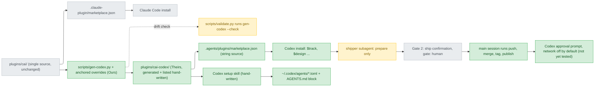

# codex-support — stance

Inputs: `.claude/track/codex-support/intake.md` (approved 2026-09-18, approach B′), `discover/experiments.md` (E1–E8, codex-cli 0.155.0, Windows 11), `discover/blindspot.md` (its E6 correction overrides experiments.md). "Documented, not tested" below means the user deferred the check to verify (menu answer 2026-09-18); if verify shows it wrong, the work returns to design.

## Status

approved 2026-09-18

## Optimises for

Procedure parity at the lowest hand-written cost. On Codex, the track's six stages run the same procedure from one generated source. The one guarantee kept beyond prose is that ship's irreversible git/gh steps sit behind the platform's own approval prompt: they run in the main session after Gate 2, where network is off by default (https://learn.chatgpt.com/docs/agent-approvals-security: "By default, network access remains disabled"). That this raises a prompt on push is documented, not tested; see Sacrifices. The user chose this on 2026-09-18 ("主對話執行 (Recommended)").

## Sacrifices

- **Dispatch by agent field, for ship.** Ship's irreversible steps (push, merge, tag, publish, ticket close) are not run by the `stages.json` `agent` (`shipper`). This departs from intake.md:11, which says work is dispatched by the `agent` field. The shipper only prepares.
- **Enforced per-agent limits.** On Codex, `tools:` allowlists and `sandbox_mode` are degradations that are written down, not enforced (E5). Read-only agents are read-only by instruction only.
- **Assumption, not tested before release: a push raises an approval prompt.** Verify pushes to a local remote inside the workspace (decisions D5=A), which needs no network, so this is not tested before ship, and the Codex README marks it "documented, not tested". If the first real network push after release goes through without a prompt, the only thing left blocking a force push is Gate 2 plus a guard hook that has not been tested. The stance then returns here, and rejected option 2 is the fallback.
- **Assumption, not yet tested: the user keeps Codex's sandbox and approval prompts on.** A session with either turned off loses the platform prompt, and ship's steps are held back only by Gate 2 and instructions. Which modes and flags turn them off was not checked (UNVERIFIED).
- **Main-session context.** The main session spends its own context running ship's final commands, instead of handing them to a subagent.

## Invariants

**This system's** (from decisions already made: in-repo, full parity, B′):

- I1 — `plugins/cai/` is not changed by this work: `git diff main -- plugins/cai/` is empty (intake.md:18, AC2). Any exception is recorded and approved separately.
- I2 — One source. Every file under `plugins/cai-codex/` is either produced from `plugins/cai/` by `scripts/gen-codex.py`, or is on an explicit list of hand-written files that `--check` knows about. `--check` exits 0 on a clean tree and 1 on drift (intake.md:17, AC1), and is wired into `validate.py` like `gen-models.py --check` (`scripts/validate.py:1414`).
- I3 — Every override is anchored to the exact source sentence it replaces. If that sentence changes in `plugins/cai/`, `--check` fails; it is never silently re-applied (intake.md:38).
- I4 — No generated sentence claims a Codex behaviour that is neither verified nor marked "documented, not tested" or "degraded". A Claude-only claim may not be carried over word for word, e.g. "`AskUserQuestion` adds that entry itself" (`plugins/cai/skills/track/references/approval-gates.md:21`), or "the Task tool" (`plugins/cai/rules/model-selection.md:26`). Pure word-swapping was rejected for this reason (intake.md:37).
- I5 — Every Claude Code behaviour in the mapping table gets either a Codex counterpart that was tested, or a degradation that is written down and accepted. Both cite a discover artefact (intake.md:11, AC6).
- I6 — The generated output contains zero literal `${CLAUDE_PLUGIN_ROOT}`. Codex does not substitute it (E3, `raw/e3-exec-dollar-form.jsonl`), and without the substitution `preflight.py` and `ledger.py` cannot be found (`plugins/cai/skills/track/SKILL.md:49,63`).
- I7 — There are still exactly two human gates, design and ship. Each is recorded in the ledger as `gate: human` whether the answer came from a menu or from typed text. `preflight.py build` refuses to start without that record (`approval-gates.md:53-55`).
- I8 — Subagents never ask the person anything. They hand their questions up to the main session (`plugins/cai/skills/track/references/pending-questions.md:8-16,22-26`). This holds whether or not Codex menus work (blindspot.md, landmine 6).
- I9 — On Codex, no subagent runs an irreversible git/gh operation. That means push, and ship's own irreversible list: merging, tagging, publishing and closing the linked ticket (`plugins/cai/skills/track/references/stage-ship.md:7-8`; the push is its own confirmed step, `:104-107,126`). The main session runs these, and only after Gate 2 records `gate: human`.

**Cross-project** (referenced, not restated):

- The Theirs/Ours split in the repo `CLAUDE.md` ("Who a file is for"). The generator and the override list are Ours. `plugins/cai-codex/` is Theirs, so it may not assume this repo's layout.
- The user's rule files, `plugins/cai/rules/*.md` as imported by `CLAUDE.md`. That includes "never commit or push unless I explicitly ask" (`workflow.md`).
- Platform limits observed on codex-cli 0.155.0:
  - E2: a native marketplace file takes precedence, and only a string `source` is read.
  - E5: a plugin cannot ship an agent that can be dispatched. A spawned subagent ignores its `sandbox_mode` and runs with `workspace-write` and no network. This matches https://learn.chatgpt.com/docs/agent-configuration/subagents: "Codex respects inherited sandbox policies and approval requirements from the parent agent."
  - E8: `request_user_input` is never available in `codex exec`.
- What the test environment can observe:
  - Gate menus can only be seen in the interactive Codex TUI (E8).
  - CI runs only `validate.py` and `pytest`, on Linux (`CLAUDE.md`, "Platform coverage").
- The file hygiene rules in `CLAUDE.md` also apply to generated output: no UTF-8 BOM, and `.cmd` files pure ASCII.

## Rejected stances

- **Option 1: faithful translation, gaps recorded.** The Codex version would hold only generated files plus the setup skill. If the hook does not fire, only written instructions would stand between the agent and a force push. It also leaves R5 (no network in a subagent) unsolved. The user chose option 3 over it (2026-09-18), and it breaks I9.
- **Option 2: hand-written Codex-only enforcement.** Setup would install a `~/.codex/rules/` file derived from `bash_guard.py`, plus a sync check. That means more hand-written code, more ways for the two sides to drift, and writes to the user's home directory. It would also rest on an unverified claim: https://learn.chatgpt.com/docs/agent-configuration/rules does not say these rules apply to commands the agent runs. It goes against "lowest hand-written cost", and it is kept as the fallback if the prompt assumption fails.
- **Pure word-swap generator (B).** It would move Claude-only platform claims into Codex text unchecked (intake.md:37). That breaks I4.
- **Make `plugins/cai/` platform-neutral (A).** It means editing roughly 50–60 files, the provenance ledger and the eval graders, and it is hard to reverse (intake.md:39). It breaks I1, and the user approved B′ over it.
- **Point Codex at today's Claude tree.** Codex accepts the legacy marketplace file and copies the tree as-is (E1). But agents, hooks and `${CLAUDE_PLUGIN_ROOT}` stay untranslated (E1, E3), so no program gate can run. That breaks I6.
- **A hand-maintained Codex fork.** Nothing would catch drift from `plugins/cai/`. That breaks I2, and it goes against the user's in-repo, generator-based choice.

## Use cases / Issues

- UC1 — Install. A Codex user adds this repo's marketplace. `$track`, `$design` and the other skills can be invoked (E3), and the 72 catalog skills do not fire implicitly. Codex honoured `allow_implicit_invocation: false` for one probe skill (E4). None of the 72 has an `agents/openai.yaml` yet, so the generator must add one. Works when: AC3 passes.
- UC2 — Run all six stages end to end in the interactive TUI. `track_state.py status` shows six rows `done`, the ledger shows six `passed` with design and ship as `gate: human`, and the bare remote receives the merge. Works when: AC4 passes.
- UC3 — Codex setup. The rules land in one marked block in `~/.codex/AGENTS.md` and the agent TOMLs in `~/.codex/agents/` (E5). Running it twice leaves one block. Works when: AC8 passes.
- UC4 — Maintainer drift. An edit to `plugins/cai/` fails `validate.py` until the output is regenerated, and an edited override anchor makes `--check` exit 1. Works when: AC1 passes.
- UC5 — Claude Code users see no change. Works when: AC2 passes.
- R1 — `${CLAUDE_PLUGIN_ROOT}` stays literal on Codex (E3), so the preflight and ledger gates never run (`SKILL.md:49,63`).
- R2 — Bash-only syntax fails in Windows PowerShell 5.1: `&&` at `stage-ship.md:69`, and `$(date ...)` in the backup-branch line at `stage-ship.md:112`.
- R3 — Claude-only claims would be copied into Codex skills and into every user's `AGENTS.md` (blindspot.md, landmine 7).
- R4 — Ship's irreversible operations are currently held back by the `tools:` allowlist (`plugins/cai/agents/shipper.md:7`) and by the bash guard's force-push rule (`plugins/cai/scripts/bash_guard.py:54`). On Codex the allowlist is not enforced (E5), and whether a trusted hook fires is documented, not tested. What replaces them: I9, plus the platform's approval prompt (not yet tested).
- R5 — Inside a subagent the network is off (E5 `network_access:false`), so the shipper's `git push` and `gh` cannot reach the remote.

## Overview

How to read the diagram:

- The grey Claude path is untouched (I1). Everything Codex-side is new and descends from the same source (I2).
- The bottom chain is the chosen trade. The shipper's role is narrowed. Irreversible steps move to the main session after Gate 2 (I9), and the platform prompt that stops them is not yet tested.

## Out of scope

- The statusline, the usage report, `context_peak` and the evals. `skills/track/` refers to none of the four, and each reads Claude-only data or needs `claude plugin eval` (intake.md:11).
- Left to Decisions, not to this stance:
  - which OpenAI model each tier maps to
  - the format of the override list
  - agent naming and how names map to `stages.json`
  - how the cai-codex version number is set and bumped
  - how each shell-specific command gets rewritten
  - how `usage` and `sync` are handled in the ledger
  - Whether `build` and `verify` depend on nested dispatch. `implementer` and `verifier` spawn agents themselves (`plugins/cai/agents/implementer.md:6`, `verifier.md:7`), and a subagent spawning a subagent is not tested on Codex (blindspot.md, landmine 2). Decisions either marks it "documented, not tested" or designs around it.
  - How the rules fit in `AGENTS.md`. The rules are 15,392 bytes, and whether a size cap applies to the global file is UNVERIFIED (blindspot.md, landmine 7). If a cap does apply, AC8 fails until the rules are cut or split.
  - How to isolate a test run: `CODEX_HOME`, or backup, restore and `changes.log`. This is UNVERIFIED (intake.md:19, blindspot.md AC3).
- `docs/` is git-ignored. This file needs `git add -f` at ship.
