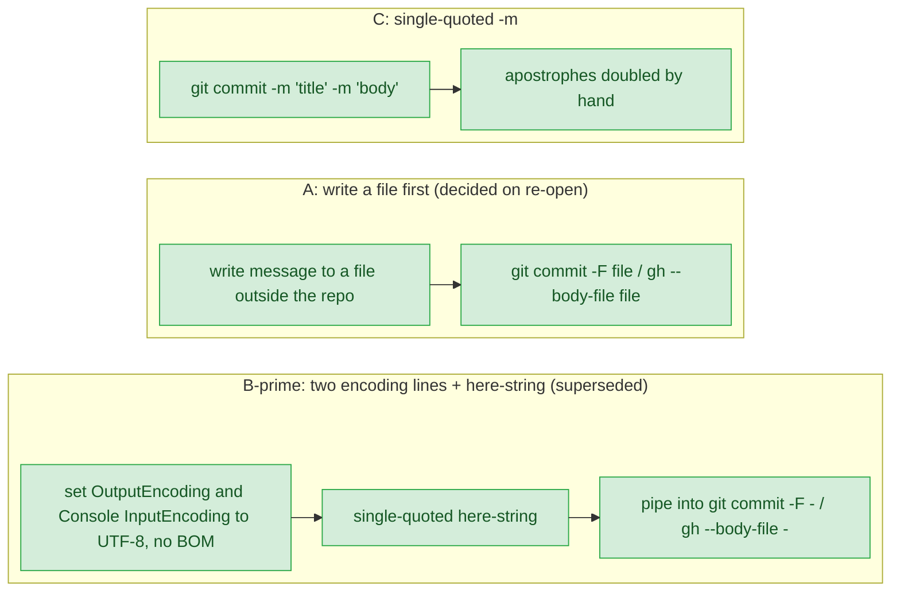
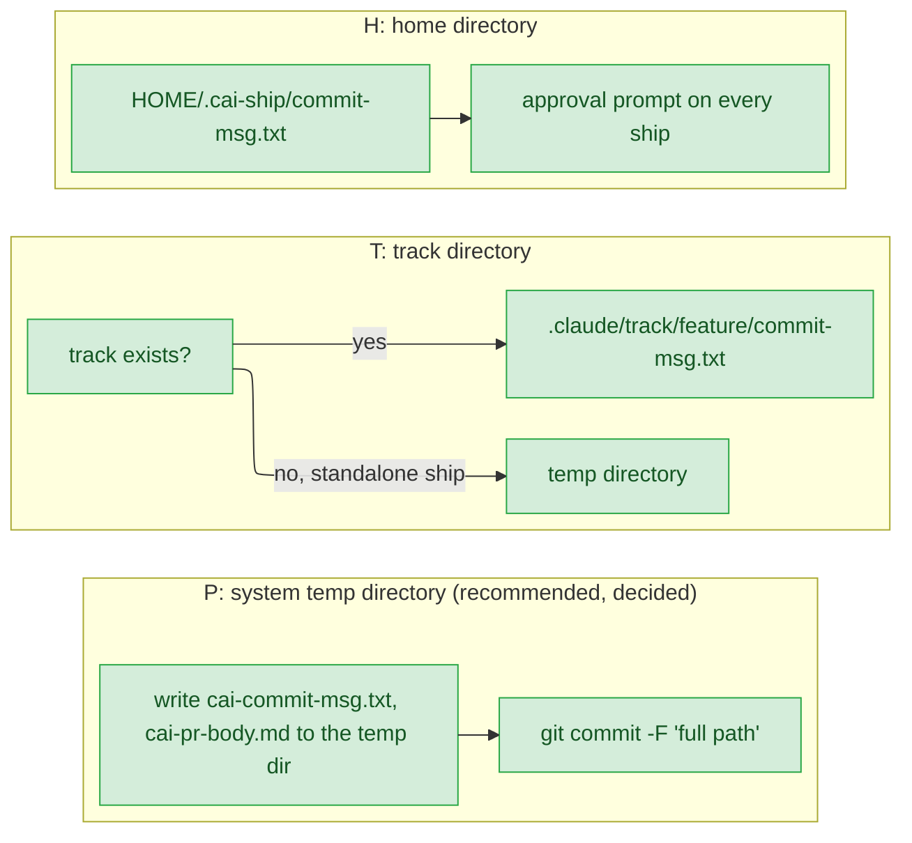

# guard-shell-expansion — decisions

## Reference

- Stance: `docs/design/2026-09-21-guard-shell-expansion-stance.md` — status: approved 2026-09-21. It was first approved 2026-09-21, re-opened the same day to add R3, and re-approved by the person with R3 and the widened I8.

## Feasibility

| Id | Capability | Verdict | Evidence |
|---|---|---|---|
| C1 | Bash leaves the body of a heredoc with a quoted delimiter unexpanded | verified | https://pubs.opengroup.org/onlinepubs/9799919799/utilities/V3_chap02.html 2.7.4: "If any part of word is quoted … the here-document lines shall not be expanded." |
| C2 | An unquoted heredoc body gets command substitution, and a backslash there acts as it does inside double quotes | verified | https://pubs.opengroup.org/onlinepubs/9799919799/utilities/V3_chap02.html 2.7.4: "All lines of the here-document shall be expanded … for parameter expansion, command substitution, and arithmetic expansion"; "Any <backslash> characters in the input shall behave as the <backslash> inside double-quotes." |
| C3 | A heredoc body starts after the opener line, so the rest of that line is code | verified | https://pubs.opengroup.org/onlinepubs/9799919799/utilities/V3_chap02.html 2.7.4: "The here-document shall be treated as a single word that begins after the next NEWLINE token." |
| C4 | Inside double quotes, `` ` `` and `$` keep their special meaning | verified | https://www.gnu.org/software/bash/manual/bash.html#Double-Quotes: "preserves the literal value of all characters within the quotes, with the exception of '$', '`', '\'" |
| C5 | A backslash is a quoting mechanism, so `<<\EOF` counts as a quoted delimiter | verified | https://pubs.opengroup.org/onlinepubs/9799919799/utilities/V3_chap02.html 2.2: "The various quoting mechanisms are the escape character, single-quotes, double-quotes, and dollar-single-quotes."; 2.2.1: "A <backslash> that is not quoted shall preserve the literal value of the following character" |
| C6 | With two heredocs on one line, their bodies are read in the order of the operators | verified | https://pubs.opengroup.org/onlinepubs/9799919799/utilities/V3_chap02.html 2.7.4: "the here-document associated with the first operator shall be supplied first by the application and shall be read first by the shell." |
| C7 | `git commit -F -` and `gh pr create --body-file -` read the message from stdin | verified | https://git-scm.com/docs/git-commit: "Use - to read the message from the standard input."; https://cli.github.com/manual/gh_pr_create: "use "-" to read from standard input" |
| C8 | The guard can tell a Bash call from a PowerShell one, on both hosts | verified | plugins/cai/scripts/bash_guard.py:184; the Codex launcher rewrites `tool_name` first (plugins/cai-codex/scripts/launcher.py:151, read and confirmed in blindspot.md:7) |
| C9 | A shipper tool rule `Bash(git:*)` or `Bash(gh:*)` still admits a git command fed by a multi-line heredoc | UNVERIFIED | https://code.claude.com/docs/en/permissions: "The recognized command separators are … and newlines. A rule must match each subcommand independently." Whether heredoc body lines count as subcommands is not stated; verify tests it live (blindspot.md:28) |
| C10 | Codex on Windows runs these commands in PowerShell 5.1, which cannot parse a heredoc | verified | scripts/gen-codex.py:139-141 ("bash syntax PowerShell 5.1 does not parse"); blindspot.md:24 |
| C11 | A PowerShell 5.1 single-quoted here-string is literal, and PowerShell pipes it to a native program in ASCII unless `$OutputEncoding` is set | verified | https://learn.microsoft.com/en-us/powershell/module/microsoft.powershell.core/about/about_quoting_rules?view=powershell-5.1: "In single-quoted here-strings, variables are interpreted literally"; about_preference_variables (5.1): `$OutputEncoding` "Determines the character encoding method that PowerShell uses when piping data into native applications", default "ASCIIEncoding object" |
| C12 | The Codex shipper can write a file before it commits | UNVERIFIED | plugins/cai-codex/agents/cai_shipper.toml:6 declares `workspace-write`, marked "declared intent, unenforced by Codex" |
| C13 | PowerShell 5.1 passes a single-quoted argument containing `"` to a native program intact | UNVERIFIED | https://learn.microsoft.com/en-us/powershell/module/microsoft.powershell.core/about/about_parsing?view=powershell-7.4 says only "PowerShell 7.3 changed the way the command line is parsed for native commands" |
| C14 | In PowerShell 5.1, setting both `$OutputEncoding` and `[Console]::InputEncoding` to `[System.Text.UTF8Encoding]::new($false)` makes a piped here-string arrive as UTF-8 with no BOM, and passes backticks, quotes and apostrophes literally | verified | Executed by main session 2026-09-21 (PowerShell 5.1.26100.9444, git 2.39.2.windows.1), in a clean `powershell.exe -NoProfile -File` host and in Claude Code's PowerShell tool host; recorded at .claude/track/improvement-from-insight/options-D1.md:3-10. The clean host defaults to US-ASCII (a `—` arrives as `?`), and the tool host adds a BOM unless both encodings are set |
| C15 | Codex's own PowerShell host honours `[Console]::InputEncoding` the same way | UNVERIFIED | Only the two hosts in C14 were run (.claude/track/improvement-from-insight/options-D1.md:10); verify tests it live |
| C16 | git keeps a leading BOM in a message read with `-F -` | verified | Executed by main session 2026-09-21: `git commit -F -` fed `EF BB BF` + text stored the BOM as the subject's first bytes (.claude/track/improvement-from-insight/options-D1.md:7) |
| C17 | Generated Codex text must parse in both PowerShell 5.1 and bash, because Codex also runs on POSIX hosts, where the guard is fed `Bash` | verified | docs/design/2026-09-18-codex-support-decisions.md:272 (D16: "a form that parses in both PowerShell 5.1 and bash", instead of "Separate text per shell"); docs/design/2026-09-18-codex-support-detail.md:393; plugins/cai-codex/scripts/launcher.py:144 |
| C18 | Codex's file-writing tool can write under the git directory | infeasible | https://learn.chatgpt.com/docs/agent-approvals-security (developers.openai.com/codex/agent-approvals-security redirects there): "`<writable_root>/.git` is protected as read-only whether it appears as a directory or file."; "If `<writable_root>/.git` is a pointer file (`gitdir: ...`), the resolved Git directory path is also protected as read-only."; "Protection is recursive, so everything under those paths is read-only." Corroborated by https://github.com/openai/codex/issues/15505 |
| C22 | Under workspace-write, Codex may write in the system temp directory without approval | verified | https://learn.chatgpt.com/docs/agent-approvals-security: "The workspace includes the current directory and temporary directories like `/tmp`." |
| C23 | On Windows, Codex treats `%TEMP%` as one of those writable temp directories | UNVERIFIED | https://learn.chatgpt.com/docs/agent-approvals-security names only `/tmp`; verify tests it live on Windows |
| C24 | Writing in the home directory needs an approval on every ship | verified | https://learn.chatgpt.com/docs/agent-approvals-security: "Codex requires approval to edit outside the workspace or to access network." |
| C19 | git keeps an in-progress commit message in the git directory itself | verified | https://git-scm.com/docs/git-commit, FILES, `$GIT_DIR/COMMIT_EDITMSG`: "This file contains the commit message of a commit in progress." |
| C20 | One command prints the git directory's absolute path, the same in both shells | verified | https://git-scm.com/docs/git-rev-parse: `--absolute-git-dir` "Like --git-dir, but its output is always the canonicalized absolute path." |
| C21 | A standalone Codex `$ship` has no track directory | verified | plugins/cai-codex/skills/ship/SKILL.md:15-18 ("There is no track underneath this command") |

## Ruled out

| Option | Invariant it violates | Evidence |
|---|---|---|
| Run the backtick check for the PowerShell tool too | Stance I3: Bash only | docs/design/2026-09-21-guard-shell-expansion-stance.md:33 |
| Make the existing BLOCKED rules quote-aware, so `echo "git push --force"` goes through | Stance I8: existing rules keep matching quoted text | docs/design/2026-09-21-guard-shell-expansion-stance.md:38 |
| Match an unquoted heredoc body as code in full, not just its substitutions | Stance I1 together with AC4: `cat > notes.md <<EOF\ngit commit -m x rewrites nothing\nEOF` must exit 0 on MAIN | .claude/track/improvement-from-insight/intake.md:31 |

## Requirement gaps

| # | The behavioural assumption | Veto condition, or verification path | Deletes |
|---|---|---|---|
| 1 | People keep the guard switched on after it wrongly blocks a harmless backtick under T-b (the fear at plugins/cai/scripts/bash_guard.py:117-118, :181-183) | Veto (stance I4): every deny names a rewrite that exits 0 when retried unchanged apart from that rewrite, and a CASES entry proves it for each deny reason. Verification path: after release, the person reports whether T-b blocks were annoying enough to switch to T-a, a one-line change (.claude/track/improvement-from-insight/options-stance-T.md:21, :42) | Any deny text that offers no rewrite, or one that the same check would block again |

## Tier 1

### D1 — Which PowerShell-runnable form replaces the heredoc at stage-ship.md:114 and :138 in the Codex copy?

| Option | Rests on | What it costs | Fails when |
|---|---|---|---|
| B′ — `$OutputEncoding = [System.Text.UTF8Encoding]::new($false)` and `[Console]::InputEncoding = [System.Text.UTF8Encoding]::new($false)`, then `@'…'@ \| git commit -F -` (and `\| gh pr create --body-file -`) (recommended in the first round, superseded) | C7, C10, C11, C14, C15, C16 | Two encoding lines every time; a body line that is exactly `'@` ends the string early | Either line is dropped: on a clean host a non-ASCII character becomes `?`, on a BOM-adding host the BOM lands in the subject (C14, C16), silently. Or Codex's host ignores `[Console]::InputEncoding` (C15) |
| A — write the message to a file with the agent's file-writing tool, then `-F <file>` / `--body-file <file>` (decided on re-open) | C7, C10, C12, C17 | Has to name a temp location; one extra step per ship | The Codex runner cannot write files, or the file lands inside the worktree and gets staged |
| C — `git commit -m '<title>' -m '<body>'`, `gh pr create --body '<body>'` | C10, C13 | Every apostrophe written as `''` | A `'` is left single (syntax error), or 5.1 mangles an embedded `"` |

- **Blast radius:** the Codex copy of stage-ship.md, via two overrides in scripts/codex-overrides.json; the Claude side is untouched.
- **Found out when:** a Codex user on Windows ships after release. Linux CI never runs PowerShell (CLAUDE.md, "Platform coverage").
- **Undo cost:** edit the override, regenerate, and publish a new cai-codex release, after which Codex users re-run `$setup` (blindspot.md:31).
- **Decided:** A — "A：寫檔再 -F <檔案> (Recommended)", chosen by the person by menu on re-open, 2026-09-21 (options file .claude/track/improvement-from-insight/options-D1.md, rewritten for the re-open). It supersedes the earlier answer below.
- **Superseded answer:** B′ — both encoding lines, then the here-string piped to `-F -` / `--body-file -`. Chosen by the person by menu (menu label "B′：兩行編碼 + here-string (Recommended)", options file .claude/track/improvement-from-insight/options-D1.md), 2026-09-21.
- **Re-opened 2026-09-21, after the answer:** B′ is PowerShell-only. In bash, `$OutputEncoding = …` and `@'…'@` do not parse, so on a POSIX Codex host the ship step fails. That conflicts with C17, the Codex design's own D16, which none of the three options was checked against when they were drafted. The `Decided:` line above is the person's and is left as written. The conflict was handed up; the person's re-open answer is the `Decided:` line above.
- **After the answer:** A brings back the second decision it carried, where the message file goes. It is D13 below. D10 is unchanged: the same form applies at :138. C15 and C16 no longer bear on the Codex text. C12 (who can write the file) and the file writer's BOM move to verify.

### D13 — Where does the Codex copy write the commit-message and PR-body files that D1's option A reads?

| Option | Rests on | What it costs | Fails when |
|---|---|---|---|
| P — the system temp directory: `cai-commit-msg.txt` and `cai-pr-body.md`, passed as `-F '<full path>'` / `--body-file '<full path>'` (recommended) | C17, C21, C22, C23 | Nothing left in the repo; two concurrent ships would overwrite each other's files | Codex on Windows does not count `%TEMP%` as writable (C23) |
| T — `.claude/track/<feature>/`, with the temp directory when there is no track | C21, C22 | Two locations and two branches of text; the file shows in `git status` in a repo that does not ignore `.claude/` | The file is swept into a commit by `git add -A` |
| H — `$HOME/.cai-ship/` | C24 | Two approval prompts on every ship | The person declines a prompt, and the ship step fails |

`<git dir>` was dropped before the question was put. git keeps its own in-progress message there (C19), and one command prints its path in both shells (C20), but C18 makes it infeasible: `.git` is read-only under Codex's sandbox.

- **Blast radius:** the Codex copy of stage-ship.md, at :114 and :138. The Claude side writes no file.
- **Found out when:** a Codex user ships after release. Verify can test Windows `%TEMP%` live.
- **Undo cost:** edit the two overrides, regenerate, and publish a new cai-codex release.
- **Decided:** P — "系統暫存目錄 (Recommended)", chosen by the person by menu, 2026-09-21 (options file .claude/track/improvement-from-insight/options-D13.md, rewritten after the Codex security page was fetched).
- **After the answer:** nothing else depended on D13. C23 moves to verify. The Tier 3 row on the PR title is re-costed against `gh pr create`'s flags below.

## Tier 2

### D2 — Which scope, and how are Bash-expanding backticks blocked? (was D2 and D3)

Chose scope A, the two halves of the guard fix plus the install rule with the eval moved out, and approach A: block every backtick Bash would execute and hand back a rewrite. The person picked both by menu (.claude/track/improvement-from-insight/intake.md:7-8). C4 confirms double quotes still expand backticks, and C8 keeps the check to Bash. **Found out when:** validate.py CASES, and the diff at verify.

### D4 — What else goes into this change: R2, and the wider AC6? (was D4 and D5)

Chose both. R2 is fixed (the body starts after the opener line's newline, per C3), and AC6 widens to stage-ship.md:138, git/SKILL.md:13 and a Codex override for :114. The person picked both by menu (.claude/track/improvement-from-insight/discover/blindspot.md:38-39). The two stdin forms rest on C7. **Found out when:** validate.py CASES, and verify's grep of the shipped tree.

### D12 — The quoted-opener bypass (R3): fix it now, or record it as a known gap?

Chose to fix it now: an opener is recognised only where the scan is outside quotes. This was the person's pick by menu, **not the recommended option** (.claude/track/improvement-from-insight/options-bypass3.md:17-24). The main session executed the bypass first, so it is confirmed (docs/design/2026-09-21-guard-shell-expansion-stance.md:61). **Found out when:** validate.py CASES.

### D6 — Which design path?

Chose Plan 1: stance, then decisions, then detail, with R1 and R2 signed inside the stance, because the person picked it by menu (docs/design/2026-09-21-guard-shell-expansion-stance.md:62). **Found out when:** Gate 1.

### D7 — Which way does the scan err on a shape it does not model?

Chose T-b: block with a rewrite, because the person picked it by menu (docs/design/2026-09-21-guard-shell-expansion-stance.md:16). **Found out when:** validate.py CASES (stance UC7).

### D8 — Do the existing rules keep matching quoted text?

Chose yes (stance I8), confirmed when the stance was approved, and widened for R3 so the one scan also reads quote state to find openers; re-confirmed at stance re-approval (docs/design/2026-09-21-guard-shell-expansion-stance.md:38). **Found out when:** validate.py CASES; the rules already search the whole stripped text (plugins/cai/scripts/bash_guard.py:190-191).

### D9 — How is an unquoted heredoc body matched?

Chose to scan it in heredoc mode, where only a backslash escapes and quotes are literal (C2). Only its `$(…)` and backtick segments go on to the rules. Matching the whole body is ruled out by AC4 (.claude/track/improvement-from-insight/intake.md:31). **Found out when:** validate.py CASES.

### D10 — Does the Codex copy of stage-ship.md:138 need an override too?

Chose yes. D4 (the wider AC6) turns :138 into a heredoc, and C10 means PowerShell 5.1 cannot run it. The fenced-block check at scripts/gen-codex.py:143-147 does not look for `<<`, so nothing else would catch it. **Found out when:** a Codex user on Windows ships, so after release.

### D11 — How is `<<\EOF` treated?

Chose to treat it as a quoted delimiter and strip its body, per C5 and C1. Today the guard blocks it by mistake (.claude/track/improvement-from-insight/discover/blindspot.md:15). **Found out when:** validate.py CASES.

## Tier 3

| Decision | Chose | Instead of | Found out when |
|---|---|---|---|
| Where the backtick check runs | Its verdict comes from the same scan that builds `code` (R3 needs quote state to find openers), and is applied after the BLOCKED + shell rules loop and before DISCARD/COMMIT (blindspot.md:23) | A `BASH_ONLY` regex, which cannot hold quote state (plugins/cai/scripts/bash_guard.py:93-95) | validate.py |
| The deny advice text | A new constant (AC5), with `REWRITE` unchanged | Rewording `REWRITE`, which is also the here-string advice (plugins/cai/scripts/bash_guard.py:21-26) | validate.py |
| What counts as an unmodelled shape | Outside quotes: `#` at the start of a word, or `$'`. Inside `"…"`: a quote inside `$(…)`. A `<<` whose delimiter the pattern rejects | Any `#` anywhere, which would also block `"#1"` | validate.py CASES |
| Delimiter characters | Keep `\w+`, plus the backslash form (D11); anything else falls to T-b | Widening to any non-blank run, which risks reading an arithmetic `<<` as a heredoc | validate.py CASES |
| Two heredocs on one line | Consume the bodies in operator order (C6) | Treating the line as an unmodelled shape | validate.py CASES |
| A rule-provenance entry for the install rule | Add one, whose Failure cites stance UC6 (docs/design/2026-09-21-guard-shell-expansion-stance.md:68). provenance.py checks only `Cited by` and whether the `Rule` text appears in that section (plugins/cai/scripts/provenance.py:228-259), so the Failure field resolving is not a CI requirement | No entry; the ledger admits a rule born from a real failure (docs/rule-provenance.md:3-7) | validate.py, which runs provenance.py |
| Codex guard test payloads | List form (blindspot.md:30) | String form, which the host OS decides (scripts/validate.py:923-926) | CI |
| Version numbers | cai 1.28.0, cai-codex 0.1.1 applied last with `--release`; the release note tells Codex users to re-run `$setup` (blindspot.md:31-32, :67-68) | cai 1.27.1, a patch bump for a new blocking rule | validate.py DRIFT/UNRELEASED |
| When the heredoc commit's permission match (C9) is settled | Live at verify; if it fails, :114 goes back to design rather than being fixed on the spot | A fallback picked now, before anyone knows it is needed | verify |
| Codex PR title quoting (D1 option A) | A single-quoted `--title '<title>'`, with the Codex text asking for a title without an apostrophe, because bash and PowerShell escape one differently (options-D1.md:13). `gh pr create` has no title-from-file flag: only `--title <string>`, "Title for the pull request", and the `--fill` family (https://cli.github.com/manual/gh_pr_create) | `--fill-first` ("Use first commit info for title and body"), which after the squash would take the title from the one commit. How it combines with `--body-file` is not stated on the manual page (it documents only `--title`/`--body` overriding `--fill`), so it would rest on an unverified behaviour | verify, Codex ship on one host |
