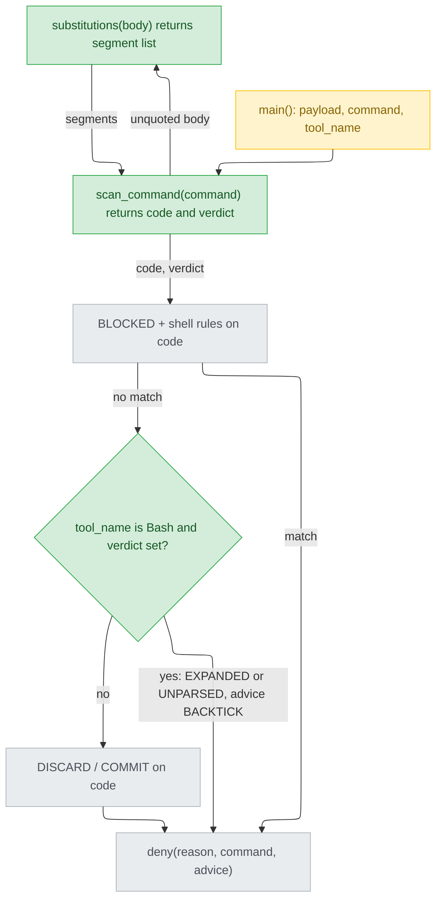
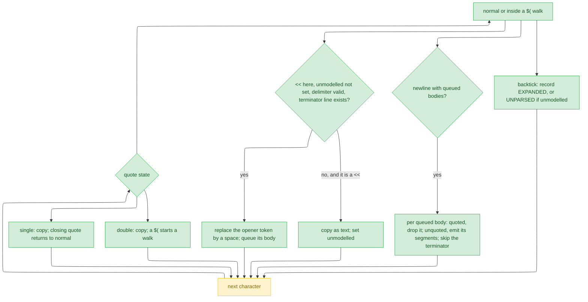
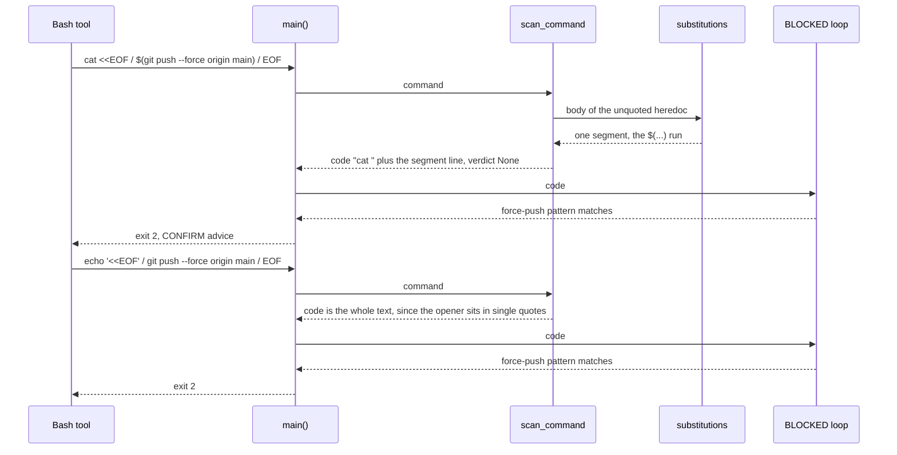
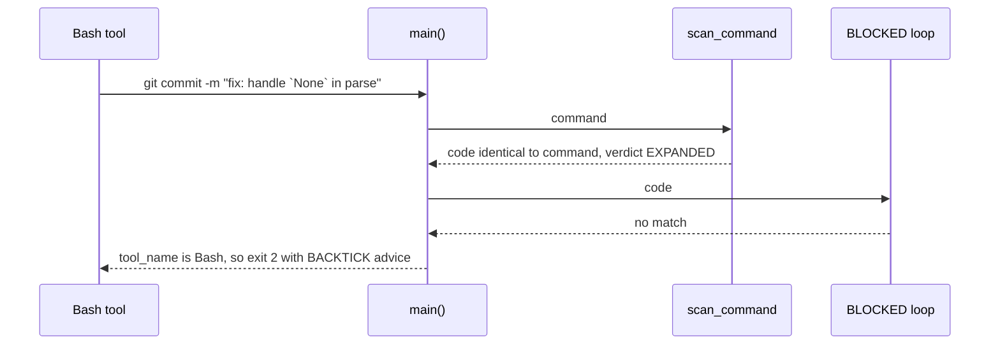

# guard-shell-expansion — detail design

## Reference

Stance doc: docs/design/2026-09-21-guard-shell-expansion-stance.md
Decisions doc: docs/design/2026-09-21-guard-shell-expansion-decisions.md
Status: stance approved 2026-09-21, re-approved the same day with R3 and the widened I8. Every Tier 1 entry carries a `Decided:` line: D1 is A (a message file), D13 is P (the system temp directory).

### Traceability

| From the stance | Satisfied by | Status |
|---|---|---|
| R1 | `scan_command` emits an unquoted body's `$(…)` and backtick segments into `code` (`substitutions`); CASES 1-4 | covered |
| R2 | `scan_command` starts a body only at the first newline after the opener, so the rest of the opener line is copied into `code`; CASES 5-6 | covered |
| R3 | `scan_command` recognises an opener only in the `normal` state or inside a `$(` walk, never inside quotes and never after an unmodelled shape; CASES 35-38 | covered |
| UC1 | `scan_command`'s verdict `EXPANDED`, advice `BACKTICK`; CASES 7-8 | covered |
| UC2 | The single-quote and backslash states, the Bash-only use of the verdict, and quoted bodies dropped; CASES 9-13 | covered |
| UC3 | A backtick in an unquoted body's segment gives `EXPANDED`; a quoted body is dropped; CASES 14-15 | covered |
| UC4 | The `$(…)` segment line lets `COMMIT` match (bash_guard.py:111); a body with no segment emits nothing; CASES 3-4 | covered |
| UC5 | stage-ship.md:114 and :138, git/SKILL.md:13 and :17, README.md:188 (U4); Codex overrides in form A, files in the system temp directory (U6); CASES 26-28 | covered |
| UC6 | The workflow.md line and the rule-provenance entry (U5) | covered |
| UC7 | The `unmodelled` flag and the verdict `UNPARSED`; CASES 20-23 | covered |

## Requirement

This is for everyone who runs cai's Bash guard, on Claude Code or on Codex.

- A destructive command in a part of a heredoc that Bash executes is blocked. So is one hidden behind a quoted `<<WORD` that only looks like an opener. This is README.md:188's promise.
- A backtick that Bash would run as a command is blocked, with a rewrite, before it silently changes a commit message or PR body (stance, `## Optimises for`).

It worked when three things hold:

- every CASES row in `## Verification` passes;
- every existing CASES verdict is unchanged (stance I1);
- the live checks at verify come back as the table says.

## Glossary

| Term | Definition | Where it lives |
|---|---|---|
| bash guard | The PreToolUse hook script that exits 2 to block a command | plugins/cai/scripts/bash_guard.py:1 |
| hook launcher | The polyglot `.cmd` that hooks.json runs to reach the guard | plugins/cai/hooks/run-guard.cmd:1 |
| `HEREDOC` (today) | The one pattern that removes every heredoc, from the operator to the terminator, ignoring quotes | plugins/cai/scripts/bash_guard.py:119 |
| `code` | The command text after heredoc processing, which every rule matches against; the user still sees the original | plugins/cai/scripts/bash_guard.py:188 |
| `BLOCKED` | Destructive-command patterns applied to every tool | plugins/cai/scripts/bash_guard.py:52 |
| shell rules | `BASH_ONLY` or `NON_BASH`, picked by `tool_name` | plugins/cai/scripts/bash_guard.py:184 |
| `DISCARD` | Patterns that block only on a dirty tree | plugins/cai/scripts/bash_guard.py:74 |
| `COMMIT` | The protected-branch commit pattern, anchored on a command boundary, `$(` or a backtick | plugins/cai/scripts/bash_guard.py:111 |
| `deny` | Writes reason, command and advice to stderr and returns 2 | plugins/cai/scripts/bash_guard.py:162 |
| `REWRITE` | The here-string advice; left unchanged | plugins/cai/scripts/bash_guard.py:21 |
| heredoc opener | `<<` or `<<-`, optional blanks, a delimiter word, seen by the scan outside quotes | concept |
| quoted delimiter | A delimiter written `'W'`, `"W"` or `\W`; the body is literal (decisions C1, C5) | concept |
| unquoted body | A body whose delimiter is a bare word; Bash expands it (decisions C2) | concept |
| substitution segment | A `$(…)` run with its parentheses balanced, or a backtick pair, taken from an unquoted body | concept |
| quote state | Which of `normal`, `single` or `double` the scan is in at a character | concept |
| `$(` walk | The scan's pass through a `$(…)` that sits inside double quotes, which Bash reads in a fresh quoting context | concept |
| unmodelled shape | Syntax the scan does not parse. After one, any backtick blocks and no opener is recognised (stance T-b) | concept |
| verdict | What `scan_command` returns besides `code`: `EXPANDED`, `UNPARSED` or None | concept |
| `scan_command` | The one left-to-right scan that builds `code` and the verdict | new — plugins/cai/scripts/bash_guard.py |
| `substitutions` | Extracts the substitution segments of one unquoted body | new — plugins/cai/scripts/bash_guard.py |
| `HEREDOC_OPEN` | The opener pattern, matched at a position | new — plugins/cai/scripts/bash_guard.py |
| `BACKTICK` | The advice attached to both backtick verdicts | new — plugins/cai/scripts/bash_guard.py |
| `EXPANDED`, `UNPARSED` | The two backtick deny reasons | new — plugins/cai/scripts/bash_guard.py |
| message file | A file in the system temp directory holding a commit message (`cai-commit-msg.txt`) or PR body (`cai-pr-body.md`), written on Codex with the agent's file tool (decisions D1, D13) | concept |
| `CASES` | validate.py's guard table of (tool_name, command, expected exit, cwd) | scripts/validate.py:792 |
| fixtures WORK / MAIN | Temp repos on a work branch and on `main` | scripts/validate.py:784 |
| `CODEX_GUARD_CASES` | Guard cases run through the Codex launcher | scripts/validate.py:923 |
| override | A (target, anchor lines, replacement lines, why) entry; the anchor has to occur exactly once | scripts/gen-codex.py:231 |
| release record | The cai-codex version and fingerprint written by `--release` | scripts/codex-release.json:1 |
| `_tool_name` | How the Codex launcher decides Bash or PowerShell | plugins/cai-codex/scripts/launcher.py:134 |
| provenance ledger | The rule-to-failure ledger that provenance.py checks | docs/rule-provenance.md:1 |

## Budgets

| What | Number | Where it comes from |
|---|---|---|
| New subprocess calls per guard run | 0 | stance I7; both new functions are pure string code |
| git subprocess calls per guard run, at most | 1 | plugins/cai/scripts/bash_guard.py:200-202, unchanged |
| git call timeout, seconds | 5 | plugins/cai/scripts/bash_guard.py:125, unchanged |
| Passes `scan_command` makes over the command | 1 | this design. The terminator search reads ahead line by line, but each character is emitted or skipped once |
| Lines in rules/workflow.md after U5, against the ceiling | 42 of 59 | 40 today (blindspot.md:34) plus 2; scripts/validate.py:364 |
| New CASES rows | 38 | `## Verification`, CASES 1-38 |
| New CODEX_GUARD_CASES rows | 3 | `## Verification`, codex 1-3 |
| Message files per Codex ship | 2 | D1 option A: one commit message, one PR body |
| cai version after U7 | 1.28.0 | decisions Tier 3; plugins/cai/.claude-plugin/plugin.json:3 today reads 1.27.0 |
| cai-codex version after U7 | 0.1.1 | decisions Tier 3; scripts/codex-release.json:2 today reads 0.1.0 |

## Design decisions

- **The person's choices** (decisions `## Tier 2`):
  - D2: scope A and approach A.
  - D4: R2 and the wider AC6.
  - D6: Plan 1.
  - D7: T-b.
  - D8: I8, widened for R3.
  - D12: fix R3 now. This was not the recommended option.
- **The rest of Tier 2:**
  - D9: an unquoted body contributes only its segments.
  - D10: the Codex copy gets overrides at both :114 and :138.
  - D11: `<<\EOF` is a quoted delimiter.
- **Tier 1:**
  - D1 is A: a message file written with the agent's file tool, then `-F <file>`, the same text in both shells (C17).
  - D13 is P: the system temp directory, which Codex's sandbox lets it write (C22). `.git` is read-only there (C18).
- **Tier 3** fixes:
  - where the verdict is applied;
  - the advice constant;
  - the unmodelled-shape rule;
  - the delimiter characters;
  - the order of two heredocs;
  - the provenance entry;
  - list-form Codex payloads;
  - the versions;
  - quoting the Codex PR title.
- **R3 merges two passes into one.** An opener can only be judged once the quote state at that point is known, so heredoc stripping and the backtick check run in the same left-to-right scan. The verdict is still applied only after the rule loop, and only for Bash.
- **Direction under uncertainty is always towards more text and more blocks:**
  - An opener with no terminator line stays as text.
  - So does an opener with an unrecognised delimiter, or one found after an unmodelled shape. In both cases the scan also sets `unmodelled`.
  - The rules then see more text, never less.

## Diagrams

### Architecture

```mermaid
---
config:
  flowchart:
    defaultRenderer: "elk"
---
flowchart LR
    subgraph claude["Claude Code install"]
        BT["Bash / PowerShell tool call"] --> HK["hooks.json PreToolUse"] --> RG["run-guard.cmd"] --> G1["plugins/cai/scripts/bash_guard.py"]
    end
    subgraph codex["Codex install"]
        CX["Codex shell call"] --> LA["launcher.py guard: sets tool_name"] --> G2["plugins/cai-codex/scripts/bash_guard.py"]
        SH2["Codex stage-ship.md: write message file, then -F file"]
    end
    subgraph repo["this repo, maintainer side"]
        SRC["plugins/cai/ sources"] --> GEN["scripts/gen-codex.py + codex-overrides.json"] --> OUT["plugins/cai-codex/"]
        VAL["scripts/validate.py CASES"] -.-> G1
        VAL -.-> LA
    end
    G1 --> SRC
    OUT --> G2
    OUT --> SH2
    classDef added fill:#d4edda,stroke:#28a745,color:#155724
    classDef modified fill:#fff3cd,stroke:#ffc107,color:#856404
    classDef existing fill:#e9ecef,stroke:#adb5bd,color:#495057
    class G1,G2,GEN,VAL,OUT modified
    class SH2 added
    class BT,HK,RG,CX,LA,SRC existing
```

Look at the two amber guard boxes. They are one file: the Codex copy is generated from the Claude one, so the scan reaches Codex only through `gen-codex.py`. The green box is the only place the two installs diverge in text. It comes from an override, not from an edit under `plugins/cai-codex/`.

### Component

Look at the single arrow out of `scan_command`. It carries both `code` and the verdict, computed together because R3 needs the quote state to decide what an opener is. The verdict waits until the rule loop has had its turn.

### Flow

Look at `OP`, the only place an opener is accepted. It is reached only from the `normal` state or a `$(` walk. That is R3's fix: the `SQ` and `DQ` branches copy a `<<` as plain text. `BODY` running only at a newline is R2's fix.

### Sequence — R1 and R3

Look at the two returns from `scan_command`. For R1 the segment is what reaches the loop. For R3 nothing was stripped at all. Today both return exit 0. R2 takes R1's path without the `substitutions` call.

### Sequence — UC1 and UC7

Look at the order: the verdict is known from the scan, but it is used only after nothing destructive has matched. A command that is both destructive and has a backtick gets the destructive reason. UC7 takes the same path, with the verdict `UNPARSED`.

Sequences skipped, and why: UC2, UC3, UC4 and UC6 have no call order beyond the two above. UC2 is a verdict of None. UC3 is R1's path with a backtick segment. UC4 is R1's path ending at `COMMIT`. UC6 is a text edit. UC5 is text edits plus overrides.

## Implementation spec

### scan_command

- **Responsibility:** read the command once, left to right, and return `code` together with the backtick verdict.
- **Interface:** `def scan_command(command):` takes a str and returns a `(str, str or None)` tuple. No annotations, matching the file's helpers (bash_guard.py:122, :130, :145).
- **Data:** scanner state:
  - an index;
  - the quote state (`normal`, `single`, `double`);
  - a `$(` walk depth, 0 when not walking;
  - the `unmodelled` flag;
  - a queue of pending bodies (delimiter, quoted);
  - the output pieces;
  - the first verdict found. Scanning continues after a verdict, so `code` is always complete.
- **Opener pattern:** `HEREDOC_OPEN = re.compile(r"(?<!<)<<(?!<)(-?)[ \t]*(?:'(\w+)'|\"(\w+)\"|\\(\w+)|(\w+))")`, used with `.match(command, i)`. Groups 2-4 are the quoted forms (single, double, backslash), group 5 is bare. `<<<` never matches.
- **In `normal`, or inside a `$(` walk:**
  - **backslash:** copy it and the next character; skip.
  - **`'`:** in `normal`, enter `single`. Inside a walk, set `unmodelled`.
  - **`"`:** in `normal`, enter `double`. Inside a walk, set `unmodelled`.
  - **`$'` (normal only):** set `unmodelled`.
  - **`#`:** sets `unmodelled` when it is the first character, or follows a space, tab, newline or one of `;&|()<>`.
  - **`<<`:** it is an opener when all of these hold:
    - `unmodelled` is not set;
    - `HEREDOC_OPEN` matches here;
    - a terminator exists. The terminator is the first line, after the current line (or after the previous queued body's terminator), whose `.strip()` equals the delimiter. That is the leniency of bash_guard.py:119, in the order of decisions C6.

    An opener's token is replaced by one space in the output, and its body is queued. The quotes inside the token do not count as quote characters. Any other `<<` is copied as text and sets `unmodelled`.
  - **newline with queued bodies:** copy the newline, then take each queued body in order. A quoted body is dropped. An unquoted one emits `substitutions(body)`, one segment per line. If a segment contains a backtick, record `UNPARSED` when `unmodelled` is set, else `EXPANDED`. Then skip the terminator line and its newline.
  - **backtick:** record `UNPARSED` if `unmodelled` is set, else `EXPANDED`.
  - **inside a walk:** `(` increases the depth and `)` decreases it. At 0 the scan returns to `double`.
- **In `single`:** `'` returns to `normal`. A backtick records `UNPARSED` only if `unmodelled` is set. Nothing else is special (decisions C4; POSIX 2.2.2).
- **In `double`:**
  - A backslash copies it and the next character.
  - `"` returns to `normal`.
  - `$(` starts a walk at depth 1.
  - A backtick records a verdict as in `normal`.
  - `<<` is plain text and sets nothing.
- **Everything not skipped is copied**, so `code` equals the command minus opener tokens, bodies and terminator lines, plus the emitted segments.
- **Errors:** raises nothing. Every index access is bounded, and an unterminated quote or walk simply ends the scan in that state.
- **Concurrency:** pure. Safe to run any number of times.
- **Observability:** none of its own. The verdict is what `deny` prints.
- **Where it lives:** plugins/cai/scripts/bash_guard.py, new. It replaces `HEREDOC` (:114-119), which becomes unused and is removed. The comment keeps the "data, not commands" reason, restricted to quoted bodies.
- **What it reuses:** the terminator leniency of bash_guard.py:119. It is deliberately not a `BASH_ONLY` regex (bash_guard.py:93-95), which cannot carry quote state.

### substitutions

- **Responsibility:** list the substitution segments of one unquoted heredoc body.
- **Interface:** `def substitutions(body):` takes a str and returns a list of str.
- **Data:** one left-to-right pass.
  - A backslash followed by `$`, a backtick, a backslash or a newline skips that character (decisions C2). Any other backslash is literal.
  - `$(` starts a segment that runs to the `)` that brings the parenthesis depth back to 0.
  - A backtick starts a segment that runs to the next backtick not preceded by a backslash.
  - An unterminated segment runs to the end of the body.
  - Quotes are literal.
- **Errors:** none.
- **Concurrency:** pure.
- **Observability:** none.
- **Where it lives:** plugins/cai/scripts/bash_guard.py, new.
- **What it reuses:** nothing.

### main() wiring and advice

- **Responsibility:** call the scan and apply its verdict in the right place.
- **Interface:** `def main() -> int:`, unchanged (bash_guard.py:171).
- **Data:**
  - :188 becomes `code, verdict = scan_command(command)`.
  - Directly after the loop at :190-192, add `if verdict and payload.get("tool_name") == "Bash":` then `return deny(verdict, command, BACKTICK)`.
  - `EXPANDED = "a backtick Bash would run as a command"`.
  - `UNPARSED = "a backtick after shell syntax this guard does not parse ($'...', a # comment, a quote inside \"$(...)\", or an unusual heredoc delimiter)"`.
  - `BACKTICK = ("Bash runs the text between backticks as a command and pastes in its output. For literal text use single quotes ('fix `x`'), pass a file (git commit -F <file>, gh pr create --body-file <file>), or feed it through a heredoc with a quoted delimiter (<<'EOF'). To substitute a command's output on purpose, write $(command).")`.
  - The module docstring (:2-6) gains a third bullet: "block a backtick Bash would run as a command, which rewrites a commit message or PR body without an error."
- **Errors:** as today.
- **Concurrency:** unchanged.
- **Observability:** stderr through `deny` (bash_guard.py:162-168).
- **Where it lives:** plugins/cai/scripts/bash_guard.py.
- **What it reuses:** `deny` at :162; the `tool_name` test at :184.

### Shipped text (Claude side)

- **Responsibility:** make every shipped command the new check would see pass it.
- **Interface:** file text.
- **Data:**
  - **stage-ship.md:114.** `git commit -m "<title>" -m "<body>"` becomes five lines in the same fence: `git commit -F - <<'EOF'`, `<title>`, an empty line, `<body>`, `EOF`. Line :112 stays byte-identical, because it is an override anchor (scripts/codex-overrides.json:169).
  - **stage-ship.md:138-139.** After "that is where it always lands.", insert: "Pass the body on stdin behind a quoted delimiter, so Bash leaves any backtick in it alone:". Then a fenced `bash` block of three lines: `gh pr create --title '<title>' --body-file - <<'EOF'`, `<release note>`, `EOF`. The paragraph resumes at "If this project also keeps a `CHANGELOG.md`".
  - **git/SKILL.md:13.** Becomes: "Write multi-line messages to a file and pass `git commit -F <file>`, or, in Bash, feed them on stdin behind a quoted delimiter (`git commit -F - <<'EOF'`); otherwise use repeated single-line `-m` flags in single quotes. Double quotes run anything between backticks as a command, and a message containing an apostrophe goes through `-F` instead. Never `@'...'@` — that is PowerShell here-string syntax, and in the Bash tool it leaves literal `@` characters in the message."
  - **git/SKILL.md:17.** "(a heredoc also works, but only in Bash)" becomes "(a heredoc also works, but only in Bash and only behind a quoted delimiter, `--body-file - <<'EOF'`, since an unquoted one runs any backtick in the body)".
  - **README.md:188.** After "…stray `@` characters in your commit messages.", insert: "In Bash it also blocks a backtick that Bash would run as a command, in double quotes or an unquoted heredoc, where it silently rewrites a commit message, and it reads the parts of a heredoc that Bash executes, so a force push inside one, or behind a quoted `<<EOF` that only looks like one, is still caught."
  - **GUIDE.md.** Insert after :151: "- The guard's one scan tracks only single quotes, double quotes, backslashes and heredoc delimiters. It does not parse `$'…'`, `#` comments, quotes inside `"$(…)"`, or an unusual heredoc delimiter such as `<<'A-B'`. After one of those it blocks any backtick and stops recognising heredocs, rather than guess. The rewrites in its advice always pass: single quotes, `-F <file>`, `<<'EOF'`, or `$(…)`."
- **Errors:** an edited anchor line makes gen-codex exit 1 with `ANCHOR` (scripts/gen-codex.py:641-643).
- **Concurrency:** n/a (text).
- **Observability:** CASES 26-28 run the exact new command shapes.
- **Where it lives:** plugins/cai/skills/track/references/stage-ship.md, plugins/cai/skills/git/SKILL.md, README.md, GUIDE.md.
- **What it reuses:** the `-F <file>` preference already at git/SKILL.md:13.

### Install rule and ledger entry

- **Responsibility:** ship C2 and record where it came from.
- **Interface:** file text.
- **Data:**
  - **workflow.md.** After :20 insert two lines: "- Never install packages or otherwise change the environment (`pip install`," then "  `npm i -g`) without asking first — least of all on a dirty working tree."
  - **docs/rule-provenance.md.** Append the entry `## workflow-ask-before-environment-changes — no installs or environment changes without asking`, with:
    - Date: 2026-09-21
    - Failure: the person's Claude Code Insights report of 2026-09-21 (a local usage report, not in this repo) records them interrupting an unrequested `pip install mypy` on a dirty tree; stance UC6 carries it
    - Rule: the same sentence on one line
    - Cited by: plugins/cai/rules/workflow.md § Workflow
- **Errors:** provenance.py fails if the Rule text is not inside the cited section after whitespace and backtick folding (plugins/cai/scripts/provenance.py:89-99, :253-257).
- **Concurrency:** n/a.
- **Observability:** validate.py's provenance lines.
- **Where it lives:** plugins/cai/rules/workflow.md (Theirs) and docs/rule-provenance.md (Ours).
- **What it reuses:** the entry shape at docs/rule-provenance.md:30-35.

### Codex overrides (form A, files in the system temp directory)

- **Responsibility:** give the Codex copy a form of :114 and :138 that parses in both PowerShell 5.1 and bash (decisions C17).
- **Interface:** two new entries in scripts/codex-overrides.json, shaped as at :156-175.
- **Data:**
  - **:114.** The anchor is the five lines `git commit -F - <<'EOF'`, `<title>`, an empty line, `<body>`, `EOF`. The replacement is two lines inside the fence. Both shells accept a `#` comment:
    - `# Write the message (title, a blank line, the body) to cai-commit-msg.txt in the system temp directory with your file-writing tool, not the shell.`
    - `git commit -F '<full path of cai-commit-msg.txt>'`
  - **:138.** The anchor runs from "Pass the body on stdin behind a quoted delimiter, so Bash leaves any backtick in it alone:" through the fenced `EOF` line. The replacement is:
    - "Write the release note to cai-pr-body.md in the system temp directory with your file-writing tool, not the shell, then pass the file:"
    - a fenced `bash` block holding `gh pr create --title '<title>' --body-file '<full path of cai-pr-body.md>'   # keep the title free of apostrophes: bash and PowerShell escape one differently`
  - Why these two lines hold:
    - The paths are single-quoted. A single-quoted string with no `'` inside parses the same in both shells, which keeps D16 (decisions C17).
    - `gh pr create` has no title-from-file flag (https://cli.github.com/manual/gh_pr_create). So the title stays an argument, and decisions Tier 3 keeps it apostrophe-free rather than resting on an unverified `--fill-first` with `--body-file`.
  - Each anchor has to occur exactly once (scripts/gen-codex.py:240-242). The two `EOF` lines are told apart by each anchor's first line.
  - No fenced deny token appears (scripts/gen-codex.py:143-148).
- **Errors:** `ANCHOR` or `DENY` stops generation.
- **Concurrency:** two ships at once on one machine would overwrite each other's files. That is accepted in decisions D13.
- **Observability:** `gen-codex.py --check` prints DRIFT or UNRELEASED.
- **Where it lives:** scripts/codex-overrides.json (Ours).
- **What it reuses:** the D16 override style at scripts/codex-overrides.json:156-175.

### Regenerate and release

- **Responsibility:** make both installs pick up the change.
- **Interface:** `python scripts/gen-codex.py`, then `python scripts/gen-codex.py --release 0.1.1`.
- **Data:**
  - plugins/cai/.claude-plugin/plugin.json:3 becomes `"version": "1.28.0"`. That file is excluded from generation (scripts/gen-codex.py:52), so the order against `--release` does not change the fingerprint. It still goes before `--release`, so the release is last.
  - `--release` writes scripts/codex-release.json (scripts/gen-codex.py:695-702).
- **Errors:** `--release` refuses a version already published on the base (scripts/gen-codex.py:688-691).
- **Concurrency:** do not run pytest while regenerating. pytest rewrites real files.
- **Observability:** "released 0.1.1" on stdout.
- **Where it lives:** scripts/, plugins/cai-codex/.
- **What it reuses:** the whole gen-codex pipeline.

## Naming

| Name | What it is | Chosen by |
|---|---|---|
| `scan_command`, `substitutions` | New functions | follows the file's lower_snake helper names at plugins/cai/scripts/bash_guard.py:122, :130, :145 |
| `HEREDOC_OPEN` | New pattern constant | follows the pattern constants at plugins/cai/scripts/bash_guard.py:44, :111 |
| `BACKTICK`, `EXPANDED`, `UNPARSED` | Advice and reason constants | follows the one-word advice constants at plugins/cai/scripts/bash_guard.py:16, :21, :28 |
| `workflow-ask-before-environment-changes` | Ledger entry id | follows `<rule file>-<slug>` at docs/rule-provenance.md:19, :30 |
| `cai-commit-msg.txt`, `cai-pr-body.md` | Codex message files in the system temp directory | the person, 2026-09-21, via D13's options file .claude/track/improvement-from-insight/options-D13.md:19 |
| 1.28.0 / 0.1.1 | Versions | decisions `## Tier 3`, after blindspot.md:67 |

## Change points

| Path | Change | Exists today |
|---|---|---|
| plugins/cai/scripts/bash_guard.py | Docstring, `HEREDOC` replaced, two functions, five constants including `HEREDOC_OPEN`, `main` wiring | yes |
| scripts/validate.py | 38 CASES rows, 3 CODEX_GUARD_CASES rows | yes |
| plugins/cai/skills/track/references/stage-ship.md | :114 and :138-139 | yes |
| plugins/cai/skills/git/SKILL.md | :13, :17 | yes |
| plugins/cai/rules/workflow.md | 2 lines after :20 | yes |
| README.md, GUIDE.md | :188; a bullet after :151 | yes |
| docs/rule-provenance.md | One entry | yes |
| scripts/codex-overrides.json | Two entries | yes |
| plugins/cai-codex/** | Regenerated, never hand-edited | yes |
| scripts/codex-release.json, plugins/cai/.claude-plugin/plugin.json | Versions | yes |

No new dependency.

## Failure modes

| Situation | What happens | What the caller sees |
|---|---|---|
| Opener with no terminator line | Copied as text, `unmodelled` set; the rules match the body as code | Possibly a block that matching less text would have avoided, with that rule's advice |
| Delimiter outside `\w+` (`<<'A-B'`) | Copied as text, `unmodelled` set | `UNPARSED` if a backtick follows; the body is matched as code |
| A real heredoc after a `#` comment or `$'…'` | Not recognised (`unmodelled` is set), so its body is matched as code | A possible false block from a destructive rule that the text happens to match; stance I8 and T-b accept this |
| A harmless backtick after an unmodelled shape | `UNPARSED` (T-b) | Exit 2 once, and the rewrite passes |
| The shipper's `Bash(git:*)` does not admit the heredoc-fed commit (decisions C9) | The Claude shipper cannot run the :114 step | Found at verify; :114 goes back to design (decisions Tier 3) |
| On Codex, the agent that must write the message file cannot, `%TEMP%` is not writable on Windows, or the writer adds a BOM | The commit fails, or the subject starts with an invisible BOM (git keeps it, decisions C16) | Found at verify (C12, C23); if it fails, D13 goes to option T (options-D13.md:51) |
| A Codex PR title containing an apostrophe | A syntax error in one of the two shells | A failed `gh pr create`; the Codex text says to keep the title free of apostrophes |
| A stale install | The old guard until `/plugin update`, or `$setup` for Codex (launcher.py:204-210 exits 3 on a stamp mismatch) | The old verdicts |

## Rollout

- **Pieces:** one PR. U1-U5 can land before U6. But a release without U6 ships Codex text that PowerShell 5.1 cannot parse at :114 and :138, so U6 and U7 gate the merge.
- **Data:** none. No stored state changes. Each Codex ship leaves two small files in the system temp directory, which the next ship overwrites.
- **In flight:** sessions keep the cached 1.27.0 guard until the plugin updates, because the cache is keyed by version. Codex users re-run `$setup` after 0.1.1, and the release note says so.
- **Rollback:** revert the squash commit, then ship 1.28.1 / 0.1.2 through the same `--release` path.

## Verification

All CASES rows are `(tool, command, expected, cwd)` in scripts/validate.py, at unit level; the rows marked live run at verify.

| Criterion | Level | What it needs | Green before |
|---|---|---|---|
| R1: CASES 1 `("Bash", "cat <<EOF\n$(git push --force origin main)\nEOF", 2, WORK)`, 2 ``("Bash", "cat <<EOF\n`git push --force origin main`\nEOF", 2, WORK)`` | unit | WORK fixture | U1 merges |
| UC4: CASES 3 `("Bash", "cat <<EOF\n$(git commit -m x)\nEOF", 2, MAIN)`, 4 `("Bash", "cat > notes.md <<EOF\ngit commit -m x rewrites nothing\nEOF", 0, MAIN)` | unit | MAIN fixture | U1 merges |
| R2: CASES 5 `("Bash", "cat <<'EOF' && git push --force origin main\nx\nEOF", 2, WORK)`, 6 `("Bash", "cat <<EOF && git push --force origin main\nx\nEOF", 2, WORK)` | unit | WORK | U1 merges |
| R3: CASES 35 `("Bash", "echo '<<EOF'\ngit push --force origin main\nEOF", 2, WORK)`, 36 `("Bash", 'echo "<<EOF"\ngit push --force origin main\nEOF', 2, WORK)`, 37 `("Bash", "ls # <<EOF\ngit push --force origin main\nEOF", 2, WORK)`, 38 `("Bash", "echo '<<EOF'", 0, WORK)` | unit | WORK | U1 merges |
| UC1: CASES 7 `("Bash", 'git commit -m "fix: handle `None` in parse"', 2, WORK)`, 8 `("Bash", 'gh pr create --title x --body "uses `foo()` now"', 2, WORK)` | unit | WORK | U2 merges |
| UC2: CASES 9 ``("Bash", "git commit -m 'fix: `None`'", 0, WORK)``, 10 ``("Bash", 'git commit -m "fix: \\`None\\`"', 0, WORK)``, i.e. the command text is ``git commit -m "fix: \`None\`"``, 11 ``("PowerShell", 'git commit -m "fix `None`"', 0, WORK)``, 12 `git branch "backup/${B}-$(date +%s)"`, 13 `git commit -m "$(cat <<'EOF'\nfix `x`\nEOF\n)"` (an opener inside a `$(` walk); all 0, WORK | unit | WORK | U2 merges |
| UC3: CASES 14 `cat > f <<EOF\nuse `x`\nEOF` gives 2; 15 ``cat > f <<'EOF'\nuse `x`\nEOF`` gives 0 | unit | WORK | U2 merges |
| D11: CASES 16 `cat <<\EOF\n$(git push --force origin main)\nEOF` gives 0 | unit | WORK | U1 merges |
| C6: CASES 17 `cat <<'A' > a\nx\nA\ncat <<'B' > b\ngit push --force origin main\nB` (0), 18 `cat <<A <<'B'\n$(git push --force origin main)\nA\nplain\nB` (2), 19 `cat <<'A' <<B\nplain\nA\n$(git push --force origin main)\nB` (2) | unit | WORK | U1 merges |
| UC7: CASES 20 `ls # don't\necho 'it`s'`, 21 `echo $'it\'s `x`'`, 22 `echo "$(printf '%s' `date`)"`, 23 `cat <<'A-B'\nuse `x`\nA-B`; all 2, WORK | unit | WORK | U2 merges |
| Detection negatives: CASES 24 `echo "#1" 'a`b'` (0), 25 `echo a#b 'x`y'` (0), 29 `echo $'a\tb'` (0), 30 `cat <<< 'x'` (0), 31 ``cat <<< "`x`"`` (2) | unit | WORK | U2 merges |
| Over-block safety: CASES 32 `cat <<EOF\n$(git push --force origin main` unterminated, 2 | unit | WORK | U1 merges |
| UC5: CASES 26 `git commit -F - <<'EOF'\nfix: handle `None`\n\nbody `x`\nEOF` (0, WORK), 27 the same string as 26 (2, MAIN), 28 `gh pr create --title 'fix: x' --body-file - <<'EOF'\nuses `foo()` now\nEOF` (0, WORK) | unit | WORK, MAIN | U4 merges |
| The advice passes on retry (requirement gap 1): CASES 33 `git commit -F notes.txt` (0, WORK), 34 `echo "$(date)"` (0, WORK), plus CASES 9, 13 and 15 | unit | WORK | U2 merges |
| I1: every existing CASES row still passes | unit | validate.py | U1 and U2 merge |
| Codex guard: codex 1 `["bash","-c",'git commit -m "fix `None`"']` gives 2; codex 2 `["powershell.exe","-Command",'git commit -m "fix `None`"']` gives 0; codex 3 `["bash","-c","cat <<EOF\n$(git push --force origin main)\nEOF"]` gives 2; all with cwd WORK | integration | the launcher, after gen-codex | U7 |
| UC5, Codex half: the generated plugins/cai-codex/skills/track/references/stage-ship.md holds no `<<` inside a fence, and shows `-F <file>` at both sites | unit | a grep after gen-codex | U6 |
| UC6: the provenance entry passes and workflow.md is within 59 lines | unit | validate.py | U5 merges |
| Whole-repo gate: `python scripts/validate.py` exits 0; `python -m pytest` is green apart from the known Windows template-guard failure; `gen-codex.py --check` prints no DRIFT/UNRELEASED | integration | a clean tree | U7 |
| Live: `gh pr create --body-file -` reads the body from stdin (decisions C7 is documented, not yet run) | end-to-end | a scratch repo on GitHub | verify |
| Live: the shipper's `Bash(git:*)` / `Bash(gh:*)` admits a heredoc-fed `git commit -F - <<'EOF'` (decisions C9) | end-to-end | a dispatched shipper on a scratch branch | verify |
| Live, Codex: which agent can write the message file. The shipper makes the squash commit (scripts/codex-overrides.json:313-321), so it writes the commit message. Who runs `gh pr create` on Codex is not stated: the overrides move push, merge, tag and publish to the main session (scripts/codex-overrides.json:331-337), while the Codex stage-ship.md still says the shipper has gh (plugins/cai-codex/skills/track/references/stage-ship.md:142). Whoever it is has to be able to write to D13's location (C12, C18) | end-to-end | Codex on Windows and on a POSIX host | verify |
| Live, Codex: the file-writing tool writes UTF-8 without a BOM, checked with the same byte dump the main session used for B′ (C16) | end-to-end | Codex on one host | verify |
| Live, Codex on Windows: `%TEMP%` counts as a writable temp directory under workspace-write, so both files are written with no approval prompt (decisions C23) | end-to-end | Codex on Windows | verify |
| Live: the Codex payload shape the launcher assumes, string or argv list (blindspot.md:9's C9) | end-to-end | Codex on Windows and on a POSIX host | verify |

## Work breakdown

Deviations during build follow `plugins/cai/skills/track/references/stage-build.md` Step 5.

| Unit | Depends on | Can run alongside | Done when |
|---|---|---|---|
| U1 `scan_command`'s heredoc half (openers, bodies, segments, R3's quote gating) + `substitutions`, replacing `HEREDOC`; the verdict is always None for now | nothing | U5 | CASES 1-6, 16-19, 32 and 35-38 pass, and every existing row still passes |
| U2 `scan_command`'s verdict (the backtick and unmodelled rules), the constants, the `main` wiring, the docstring | U1 (same function) | U5 | CASES 7-15, 20-25, 29-31, 33-34 pass, and U1's rows still pass |
| U3 README.md:188 and the GUIDE.md bullet | U2 | U4, U5 | text as in `## Implementation spec` |
| U4 stage-ship.md:114 and :138, git/SKILL.md:13 and :17 | U2 | U3, U5 | CASES 26-28 pass; `gen-codex.py --check` reports no ANCHOR for :112 |
| U5 workflow.md line + provenance entry | nothing | U1-U4 | validate.py's provenance and line-ceiling checks pass |
| U6 Codex overrides for :114 and :138 in form A, files in the system temp directory | U4 | nothing | gen-codex generates with 0 DENY, and the UC5 Codex-half row passes |
| U7 `gen-codex.py`, the CODEX_GUARD_CASES rows, cai 1.28.0, then `gen-codex.py --release 0.1.1` last, then validate.py, then pytest | U1-U6 | nothing | the whole-repo gate row in `## Verification` is green |

### Upstream blockers

| What | Owned by | Needed before |
|---|---|---|
| Gate 1: the person signs the stance and the answered Tier 1 entries | the person | unit U1 |
