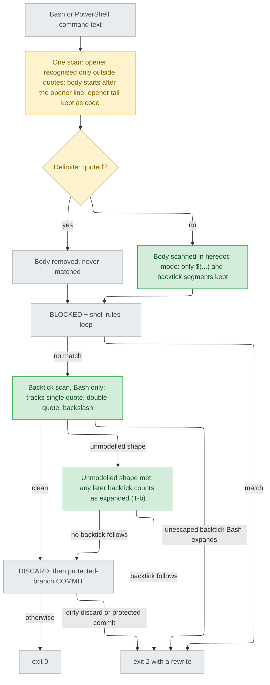

# guard-shell-expansion — stance

## Status

approved 2026-09-21

## Optimises for

The Bash guard judges a command by what Bash will execute, not by how its text
looks. A destructive command in a part of a heredoc that Bash executes (the
rest of the opener line, or a `$(…)` or backtick segment of an unquoted body) is
blocked the same as when it is typed bare (README.md:188), and a quoted `<<WORD`
that only looks like an opener hides nothing (R3). A backtick that Bash
would run as a command is blocked before it silently rewrites a commit message
or PR body (intake.md:14). When the scan cannot tell, it blocks with a rewrite
rather than letting a silent rewrite through (trade T-b, chosen 2026-09-21,
options-stance-T.md:15).

## Sacrifices

- A deliberate backtick substitution in Bash (``echo "`date`"``) is blocked, and has to be rewritten as `$(date)` (options-intake.md:15, :23).
- A backtick meant literally in an unquoted heredoc body is blocked, and the delimiter has to be quoted (intake.md:30).
- The guard's text-only purity goes. One left-to-right scan now tracks `'`, `"` and `\`, recognises a heredoc opener only outside quotes, and judges backticks, one step past "reads text, not intent" (GUIDE.md:145-151), though still short of parsing shell grammar (options-bypass3.md:19-23).
- The guard takes on a third job beyond the two its docstring names (bash_guard.py:2-6): stopping argument text Bash would rewrite, which destroys no work.
- Some harmless commands are blocked because of trade T-b. Once the scan meets a shape it does not model, it blocks any backtick after that shape, even one Bash would not expand. The shapes are `$'…'`, a `#` comment, quotes inside `$(…)` inside `"…"` (blindspot.md:20), and a quoted delimiter the pattern does not recognise, such as `<<'A-B'` (blindspot.md:15). The command has to be rewritten once. This is the kind of false block that bash_guard.py:181-183 warns gets a guard switched off.

## Invariants

**This system's:**

- I1: Every verdict in validate.py's `CASES` holds unchanged, including the heredoc cases at validate.py:881-885 (intake.md:31). No existing case contains a backtick or an unquoted `<<` (Grep over scripts/validate.py: 0 matches).
- I2: The body of a heredoc whose delimiter is quoted is never matched. POSIX 2.7.4: "If any part of word is quoted … the here-document lines shall not be expanded" (https://pubs.opengroup.org/onlinepubs/9799919799/utilities/V3_chap02.html).
- I3: The backtick check runs only when `tool_name` is `Bash`. PowerShell and unknown tools never see it (bash_guard.py:181-184, intake.md:29).
- I4: Every deny carries a rewrite that goes through, not just a refusal (README.md:188 "Hands the command back with the fix"). The rewrites offered are single quotes, a file, or `$(...)` (options-stance-T.md:15-20).
- I5: Malformed input and git that cannot answer still fail open (bash_guard.py:175, :134-142, :154-157).
- I6: `git commit -m "$(cat <<'EOF' … EOF)"` goes through. Approach A was accepted on this condition (intake.md:38).
- I7: Pure stdlib, and at most one git subprocess per call (bash_guard.py:8, :200-202).
- I8: The existing rules keep matching text wherever it sits, quoted or not (bash_guard.py:190-191). Only the one scan reads quote state, to find heredoc openers and to judge backticks (blindspot.md:52-54; widened for R3, options-bypass3.md:19).

**Cross-project:**

- Shipped text says only what a user's session can act on (CLAUDE.md:65). A rules line that contains `CLAUDE.md` or `~/.claude/` fails generation (scripts/gen-codex.py:126, :137).
- `plugins/cai-codex/` changes only through `scripts/gen-codex.py` (CLAUDE.md:30).
- `plugins/cai/rules/workflow.md` stays within `RULES_LINE_CEILING` (scripts/validate.py:364).
- A hook sees the command, not the conversation (GUIDE.md:136-139). So C2 stays prose and never becomes a guard check.

## Rejected stances

- Guard only message-bearing commands (`git commit -m`, `gh … --body`). This misses the heredoc-rename incident and leaves a command list to maintain (options-intake.md:28-35). Rejected at intake (intake.md:8).
- Documentation only, no new check. The incident happened with written advice already in place (options-intake.md:37-44). Rejected at intake (intake.md:8).
- Keep treating every heredoc body as data (bash_guard.py:114-118). POSIX 2.7.4 expands an unquoted body "for parameter expansion, command substitution, and arithmetic expansion", which is exactly what R1 walks through.
- Fix the bypasses and leave backticks alone (options-scope.md:39-46). Rejected at scope (intake.md:7).
- T-a, stop scanning and allow at an unmodelled shape. This produces no false blocks, but a real backtick after such a shape silently rewrites the message, which is the incident this change exists to stop (options-stance-T.md:24-31). Rejected 2026-09-21.
- Record the quoted-opener bypass (R3) as a known gap in GUIDE.md instead of fixing it (options-bypass3.md:8-15). Rejected 2026-09-21: the person wants no known heredoc bypass left after this ship (options-bypass3.md:24).
- T-c, teach the scan comments, `$'…'` and nested quoting. This turns the guard into a partial shell parser, crosses GUIDE.md:150-151, and needs teaching again for every new shape (options-stance-T.md:33-40). Rejected 2026-09-21.

## Use cases / Issues

- R1: an unquoted heredoc body is stripped even though Bash runs its `$(…)` and backticks (bash_guard.py:119, :188). Executed: `cat <<EOF\n$(git push --force origin main)\nEOF` exits 0 where README.md:188 promises 2; the backtick form also exits 0 (intake.md:13). Done when both exit 2 in WORK (AC4).
- R2: `HEREDOC` starts stripping right after the delimiter (bash_guard.py:119), but POSIX 2.7.4 says the body "begins after the next NEWLINE token", so the rest of the opener line is code. Executed: `cat <<'EOF' && git push --force origin main\nx\nEOF` exits 0, quoted and unquoted alike (blindspot.md:14). Done when both exit 2.
- R3: the opener is recognised without regard to quote state (bash_guard.py:119 has no quote tracking), so a quoted `<<WORD` hides the lines up to a later `WORD` line, which Bash runs. Executed by the main session 2026-09-21: `echo '<<EOF'\ngit push --force origin main\nEOF` exits 0; the same lines without the quoted `<<EOF` exit 2 (options-bypass3.md:1). Done when it exits 2 in WORK.
- R1, R2 and R3 share one root cause: bash_guard.py:114-118 assumes everything the pattern removes is data. Their root cause is signed here as part of this stance, not in a separate diagnosis: Plan 1, chosen 2026-09-21. That is a deviation from stage-design.md's Diagnosis entrance.
- UC1: a backtick inside double quotes is blocked in Bash, with a rewrite (AC1, AC5; intake.md:28, :32). In Bash, double quotes keep `` ` `` special ("with the exception of '$', '`', '\'", https://www.gnu.org/software/bash/manual/bash.html#Double-Quotes).
- UC2: the literal-backtick forms still go through: single quotes, `` \` ``, PowerShell, `"$(date)"`, and the quoted heredoc inside `$(…)` (AC2, intake.md:29).
- UC3: a backtick in an unquoted heredoc body is blocked. The same body under `<<'EOF'` goes through (AC3, intake.md:30).
- UC4: a heredoc substitution that commits on MAIN is blocked, while a body that merely mentions `git commit` goes through (AC4, intake.md:31).
- UC5: the shipped instructions and docs match the new check: stage-ship.md:114 and :138, git/SKILL.md:13 and :17, the Codex form of :114, and README.md:188's list of what is blocked (AC6, intake.md:33; blindspot.md:39).
- UC6: workflow.md gains the rule "no installs or environment changes without asking" (AC7, intake.md:34).
- UC7: a backtick after an unmodelled shape is blocked, with the rewrite from I4. Done when `ls # don't` followed by a line with a backtick exits 2 (trade T-b, options-stance-T.md:15).

## Overview

Look at the amber heredoc pass. It is where R1, R2 and R3 are fixed: an unquoted
body now reaches the rule loop through its extracted segments, and a quoted
`<<WORD` is no opener at all. Then look at the
green `TRADE` node, which is trade T-b. Past an unmodelled shape, a backtick
goes to exit 2 and never to the allow path.

## Out of scope

- C3, an eval for the "answer advice questions in prose" rule. Moved out at scope (intake.md:7).
- The PowerShell-side rules, and the shape of the Codex payload (C9, blindspot.md:9). Git Bash under Codex on Windows is still judged as PowerShell (blindspot.md:9).
- Held for the Decisions round and not settled here: a Codex override for the new stage-ship.md:138 heredoc, how `<<\EOF` is treated, and a docs/rule-provenance.md entry for C2.
- `$(…)` inside double quotes stays allowed (stage-ship.md:112). Approach A blocks backticks only.
