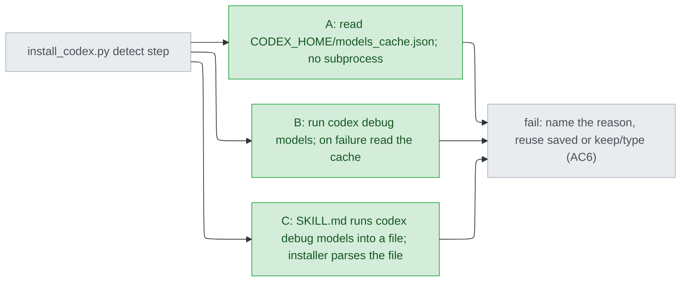
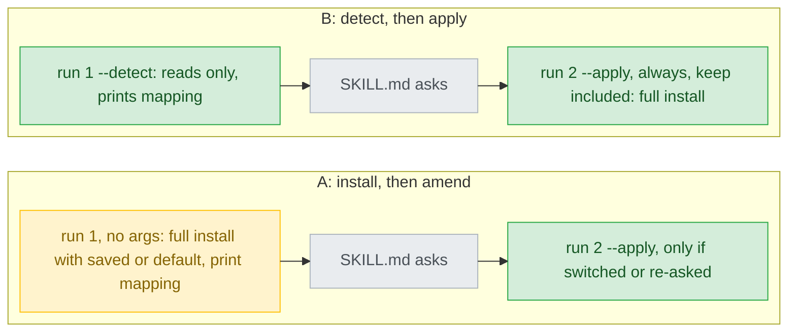
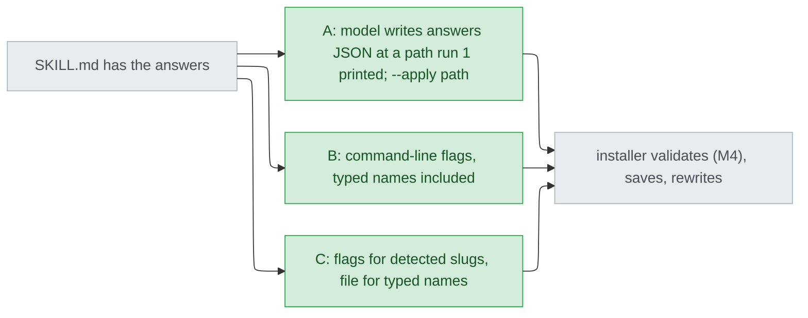

# codex-model-fallback — decisions

## Reference

- Stance: `docs/design/2026-09-22-codex-model-fallback-stance.md` — status: approved 2026-09-22
- Intake: `.claude/track/codex-model-fallback/intake.md` (approved; AC1-AC9, "Open for design" a-e)
- Parent: `docs/design/2026-09-18-codex-support-decisions.md` (its C-ids are not reused here; "parent C15" means that file's row).
- Settled before this document, not re-asked:
  - the trade: rules live in `install_codex.py`, `SKILL.md` only asks (stance M5, M6)
  - the between-setups gap goes in the README and setup's report (stance, Out of scope)
  - M3 is an invariant mapped to no AC (approved knowingly)
- Left to Detail's `## Naming`: the file names of the saved choice and of D3's answers file, and the installer's flag names. The saved choice's directory follows G2.
- Tier 1 dependency order: D1 first. Its option C gives `SKILL.md` a file hand-off to the installer, which changes what D3's options cost. D2 and D3 do not constrain each other.
- Evidence moved after the stance was approved. Running `codex debug models` on 2026-09-22 rewrote `C:/Users/millerlai/.codex/models_cache.json` (`fetched_at` is now `2026-09-22T08:13:21.014621200Z`, 232290 bytes). The stance's F2 line numbers come from the 2026-09-19 fetch and no longer match. This document cites the cache and the debug output by command and JSON key path instead of by line number.

## Feasibility

"Observed" means read on 2026-09-22 with `python -c "json.load(...)"` on the file named, codex-cli 0.155.1, `CODEX_HOME` unset. `<sp>` is this session's scratchpad.

| Id | Capability | Verdict | Evidence |
|---|---|---|---|
| C1 | The cache's shape. Top-level keys are `fetched_at`, `etag`, `client_version`, `identity` and `models`. Each model has `slug`, a `visibility` of `list` or `hide`, and `supported_reasoning_levels[].effort`. Listed: `gpt-5.6-sol`, `gpt-6-astra`, `gpt-5.6-terra`, `gpt-5.6-luna` and `gpt-5.5`. Hidden: `gpt-reserve` and `codex-auto-review`. | verified | observed at key paths `models[].slug`, `models[].visibility` and `models[].supported_reasoning_levels[].effort`. Line numbers are from the 2026-09-22 fetch and move on every refresh: `C:/Users/millerlai/.codex/models_cache.json:2` (`fetched_at`); `:8`, `:106`, `:325`, `:420` and `:511` (listed slugs); `:234` and `:261` (`gpt-reserve`, `hide`); `:591` and `:618` (`codex-auto-review`, `hide`). The stance's F2 line numbers are from the 2026-09-19 fetch. |
| C2 | `models_cache.json` is a documented interface. | UNVERIFIED | not found at https://learn.chatgpt.com/docs/config-file/environment-variables, config-basic or config-reference (stance F1, 2026-09-22); also not found at config-advanced or https://learn.chatgpt.com/docs/models (this run) |
| C3 | The cache lives under `$CODEX_HOME` when that variable is set. | UNVERIFIED | inferred only from https://learn.chatgpt.com/docs/config-file/environment-variables "Sets the root for Codex state, including config, auth, logs, sessions, skills, and standalone package metadata." |
| C4 | Codex refreshes the cache on its own often enough that it is current when `$setup` runs. | UNVERIFIED | The 2026-09-19 fetch was still in place on 2026-09-22 and was replaced only by the debug run, and `models_cache.json:2` now carries that run's time (observed by the main session). No refresh policy was found in the docs. |
| C5 | `codex debug models` is documented, and it prints `{"models": [...]}` with the cache's own per-model keys. | verified | https://learn.chatgpt.com/docs/developer-commands?surface=cli "Print the raw model catalog Codex sees, including an option to inspect only the bundled catalog."; observed `<sp>/codex-debug-models.json:1` (single-line JSON): its top-level keys are `models` only, and its slugs are the cache's slugs |
| C6 | Without `--bundled`, the command refreshes from the network and rewrites the user's cache. | verified | https://learn.chatgpt.com/docs/developer-commands?surface=cli "Use `--bundled` when you want to inspect only the catalog bundled with the current binary, without refreshing from the remote models endpoint."; the rewrite of `fetched_at` was observed (Reference) |
| C7 | The bundled catalog differs from the account's refreshed one. | verified | observed `<sp>/codex-debug-models-bundled.json:1` `models[].slug`: it adds `gpt-5.4`, `gpt-daybreak-blue-latest` and `gpt-daybreak-red-latest`, and lacks `gpt-reserve` |
| C8 | `install_codex.py`, run from `$setup` inside Codex, can start `codex` as a subprocess and reach the network. Also unknown: what the command prints when it is offline. | UNVERIFIED | never run. `SKILL.md:18-20` runs the installer outside the sandbox, but whether that grants network was not observed. How a `codex` npm shim resolves from Python on Windows was not checked. |
| C9 | The refreshed list is filtered per account or policy, so it omits models the account cannot use. | UNVERIFIED | only one account was seen, and the stance records this as an assumption (`docs/design/2026-09-22-codex-model-fallback-stance.md:19`). It affects every D1 option equally. |
| C10 | A user's `model_catalog_json` setting replaces the catalog Codex loads. Unknown: whether the cache file reflects that setting. | UNVERIFIED | https://learn.chatgpt.com/docs/config-file/config-reference "Optional path to a JSON model catalog loaded on startup." (fetched 2026-09-22); how it relates to `models_cache.json` is not documented |
| C11 | The launcher is written under the real home and never under `$CODEX_HOME`. Agents are written under `$CODEX_HOME`. | verified | `plugins/cai-codex/scripts/install_codex.py:83`, `:98`, `:290-291`, `:305` |
| C12 | A role's installed agents can be found without `scripts/codex-models.json`, by mapping each `agents/<x>.md` role in `<cai-root>/models.json` to `cai_<x>.toml`. | verified | `plugins/cai-codex/models.json:39-60`; `scripts/gen-codex.py:422` (`name = "cai_{short}"`) |
| C13 | In every shipped TOML, `model` and `model_reasoning_effort` are lines 4 and 5, each a basic string. Line 1 carries the stamp that the launcher reads. | verified | `scripts/gen-codex.py:421-425`; `plugins/cai-codex/agents/cai_explorer.toml:1-5`; `plugins/cai-codex/scripts/launcher.py:29`, `:95-100` |
| C14 | The generator's TOML string escapes only `\` and `"`. | verified | `scripts/gen-codex.py:406-407` |
| C15 | A double-quoted PowerShell or `sh` string expands `$(...)`, so a value placed in one can run as code. | verified | `plugins/cai-codex/scripts/install_codex.py:129-151`; `tests/test_codex_install.py:399`, `:416` exercise it through real shells |
| C16 | `SKILL.md` has the model compose the installer's command line, and on Windows that line is a PowerShell string. | verified | `plugins/cai-codex/skills/setup/SKILL.md:31-41`; the Codex shell is PowerShell 5.1 (parent C18, `docs/design/2026-09-18-codex-support-decisions.md:45`) |
| C17 | The model's file-edit tool can write a file under `$CODEX_HOME` during `$setup`. | UNVERIFIED | `SKILL.md:57-69` already requires such an edit (the language line); no recorded run shows it succeeding |
| C18 | Tests fake `HOME`, `USERPROFILE` and `CODEX_HOME` and run the installer CLI as a subprocess with no arguments. | verified | `tests/test_codex_install.py:44-57`, `:225`, `:251`, `:285`, `:300` |
| C19 | CI is Linux with only `pytest` installed. There is no `codex` binary. | verified | `.github/workflows/validate.yml:8`, `:16`, `:18` |
| C20 | Precedent: the installer refuses to overwrite a file it cannot parse, and exits 1 naming the file. | verified | `install_codex.py:52-53`, `:216-223`, `:316-318` |
| C21 | Every slug seen in either catalog fits `[a-z0-9.-]`. | verified | observed `models[].slug` in the cache (`models_cache.json:8`, `:591` in the 2026-09-22 fetch) and in `<sp>/codex-debug-models-bundled.json:1` |
| C22 | Effort names are `low`, `medium`, `high`, `xhigh`, `max` and `ultra`, listed low to high. Luna and `gpt-reserve` stop at `max`, and `gpt-5.5` stops at `xhigh`. | verified | observed `models[].supported_reasoning_levels[].effort` in the cache (`models_cache.json:12`, `:424` and `:515` in the 2026-09-22 fetch) and in both snapshots |
| C23 | The launcher refuses every stage with exit 3 when an installed agent's stamp is not the plugin's version. | verified | `launcher.py:16-19`, `:82-103` |
| C24 | PowerShell's `>` writes a BOM by default here. | verified | `CLAUDE.md:145-146` |

## Ruled out

| Option | Invariant it violates | Evidence |
|---|---|---|
| `SKILL.md` parses the catalog and builds each role's list of offered slugs | M6: the offered set is a rule about what may be written | stance `:31` |
| `SKILL.md` writes the saved-choice file itself | M6 and the rejected stance "Prose owns the choice" | stance `:31`, `:42` |
| The installer asks keep/switch on its own stdin | M5 | stance `:30`, `:43` |
| Any rewrite that re-emits the whole TOML, or touches line 1 | M3; also C13, whose stamp line the launcher reads | stance `:28`; C13 |
| Saving the choice under `<cai-root>`, or in `hooks.json` or `AGENTS.md` | M7 | stance `:32`; C11 |

## Requirement gaps

| # | The behavioural assumption | Veto condition, or verification path | Deletes |
|---|---|---|---|
| G1 | When a successful detection lacks a role's shipped default, the user reads the mapping, notices, and answers "switch". Keep is still the default answer (AC1), so a user who presses Enter keeps a slug the account may not have. That is R1, unfixed. | Veto: "when a successful detection does not list the slug in effect for a role, setup marks that role on its own line of the mapping and repeats it in the report". A stronger form the person may choose instead: "for such a role, keep is not the default answer". That form reopens AC1. **Chosen:** the first veto; keep stays the default — the person answered "A. 保留預設，醒目標出 (Recommended)" on 2026-09-22 (`.claude/track/codex-model-fallback/options-G1.md`). | A mapping that prints the slug in effect with no availability mark |
| G2 | Each user runs a single `$CODEX_HOME`, so it does not matter whether the saved choice is shared across homes. The opposite assumption, that a user expects one choice to follow them across homes, is just as unevidenced. C11 already puts agents (and C3 presumably the cache) under `$CODEX_HOME` and the launcher under the real home. | Veto: "a saved choice applies only to the `$CODEX_HOME` whose agents it rewrites and whose detection validated it". With `CODEX_HOME` unset, both locations are `~/.codex/...`, so only multi-home users see a difference. Verification path otherwise: the person says whether a shared choice is wanted. **Chosen:** the veto; the saved choice lives under `$CODEX_HOME`, replacing intake c's "beside the launcher" — the person answered "A. 每個 CODEX_HOME 各一份 (Recommended)" on 2026-09-22 (`.claude/track/codex-model-fallback/options-G2.md`). | Intake c's default, "beside the launcher" (shared by every home), unless the person picks a shared scope |

## Tier 1

### D1 — Which source does the installer read to detect the account's models?

| Option | Rests on | What it costs | Fails when |
|---|---|---|---|
| A — The installer reads `$CODEX_HOME/models_cache.json` and nothing else. (recommended) | C1, C2, C3, C4, C9, C10, C18, C19 | One file read. Tests put a fake cache in a temporary `CODEX_HOME`, and CI can run them. The source is an undocumented file. | Codex moves or reshapes the file, which falls into AC6's failure path and is reported. Or the cache is days old (C4), so the offered list trails the account. Or `model_catalog_json` is not reflected in it (C10). |
| B — The installer runs `codex debug models` as a subprocess and falls back to A when that fails. | C5, C6, C7, C8, C9, C19 | Two code paths. CI tests need a fake `codex` on `PATH` (C19). Every `$setup` rewrites the user's cache and needs network (C6). | The subprocess cannot run or cannot reach the network inside Codex (C8), which quietly lands on A every time. Or, offline, the command prints the bundled list, which offers slugs the account never had (C7; that offline output is UNVERIFIED). |
| C — `SKILL.md` runs `codex debug models`, redirects the output to a file, and passes the path. The installer parses it. | C5, C6, C8, C16, C24 | One command in prose. It is not a rule about what gets written, so M6 still holds. The installer must decode the UTF-16 or BOM output PowerShell writes (C24). A path for the file is needed. | The model skips or mistypes the command, so there is no file and AC6 applies. Or it has the same network and subprocess unknowns as B (C8), with the failure now in untested prose. |

- **Blast radius:** the installer, `SKILL.md` step 2 under B and C, the AC9 README row, and the tests.
- **Found out when:** after release, on an account whose catalog differs (C9) or after a Codex update that moves the cache. The failure path stays loud (AC6), never a wrong write (M1).
- **Undo cost:** change the installer and the README row, then `--release`. No user data has to migrate.
- **Decided:** A — the person answered "A. 只讀快取檔 (Recommended)" on 2026-09-22 (`.claude/track/codex-model-fallback/options-D1.md`).

### D2 — Does the first installer run write anything before the user has answered?

| Option | Rests on | What it costs | Fails when |
|---|---|---|---|
| A — Install, then amend. A run with no arguments does today's full install: it applies the saved choice (or the shipped defaults) and prints the mapping and the detection result. A second `--apply` run happens only when the user switched or a role was re-asked (AC4, AC6). (recommended) | C18, C23 | Keep needs one run. The existing CLI tests (C18) stay valid with no saved file. A role AC4 re-asks carries its stale saved slug, which the user did choose (M1 holds), until the apply run. | The user abandons after run 1. The install is still consistent, and only the re-asked role keeps its stale slug, as it had before setup. |
| B — Detect, then apply. `--detect` reads and writes nothing. `--apply` always follows, keep included, and does the full install. | C18, C23 | Two runs on every setup. The CLI contract with no arguments changes, so the four CLI tests (C18) are rewritten. | Run 2 never happens, because the user abandons or the model skips it. After a plugin update the agents keep the old stamp, and every stage exits 3 (C23) until setup is finished. That is loud, but it blocks all work. |

- **Blast radius:** `SKILL.md` step 2, the installer's CLI, and the existing CLI tests. That is more than one component.
- **Found out when:** the next test run for the mechanics. What an abandoned setup leaves behind shows up only after release.
- **Undo cost:** both files ship together, so change them and run `--release`. No user data is involved.
- **Decided:** A — the person answered "A. 先裝好，要換再改 (Recommended)" on 2026-09-22 (`.claude/track/codex-model-fallback/options-D2.md`).

### D3 — How do `SKILL.md`'s answers reach the installer?

| Option | Rests on | What it costs | Fails when |
|---|---|---|---|
| A — An answers file. The model writes a small JSON file with its file-edit tool, at the path run 1 printed. `--apply <path>` validates it, saves the choice, and deletes the file. (recommended) | C15, C16, C17 | One JSON format to specify and test. It is a write outside the workspace, the same kind step 3 already needs (C17). | The edit tool cannot write there (C17), so apply never starts; that is loud. A malformed file exits 1 and names the problem (C20 precedent). |
| B — Command-line flags, for example `--apply --role chore=<slug>`, with typed names included. | C15, C16 | No file. But a typed name (AC6, AC7) sits in a shell line that the model composes (C16) before M4 can check it. | A typed name contains `$(...)` or a quote and the model double-quotes it (C15). The code runs on the user's machine before any check, which falls under "who is allowed to do what". |
| C — Flags carry detected slugs, which run 1 has already validated. A file carries typed names only. | C15, C16, C17, C21 | Two channels and two test sets. | Typed names fail the same ways as A. Detected slugs are safe only while the charset check (D7) runs before the slug is printed. |

- **Blast radius:** `SKILL.md`, the installer, and what can run on the user's machine (high by default).
- **Found out when:** a security review, or never until someone exploits it. That is after release.
- **Undo cost:** change both files and run `--release`. No user data is involved.
- **Decided:** A — the person answered "A. 一律用答案檔 (Recommended)" on 2026-09-22 (`.claude/track/codex-model-fallback/options-D3.md`). Narrowed during Detail: `--apply` takes no path and reads the fixed answers file — the person answered "A. 不帶路徑 (Recommended)" on 2026-09-22 (`.claude/track/codex-model-fallback/options-detail-P2.md`).

## Tier 2

### D4 — What does the installer's detect step decide, and what is left to `SKILL.md`?

The installer decides everything that decides a write, and `SKILL.md` only shows it and asks. It computes each role's offered slugs, the slug in effect and the default marks, the AC4 re-ask set and its default answer, and the AC6 failure reason. This follows stance M6 (`docs/design/2026-09-22-codex-model-fallback-stance.md:31`) and uses C12 to name each role's agents. **Found out when:** the next test run.

### D5 — Are `visibility: hide` models offered?

No. A saved slug that has become hidden is re-asked like a missing one (AC4). The grounds are intake item b's default (`.claude/track/codex-model-fallback/intake.md:109`) and AC2's "only slugs from a successful detection" (`intake.md:69-70`); C1 shows that `visibility` is set per model. **Found out when:** a user reports a model they wanted but could not pick, after release.

### D6 — Does picking cai's default for a role save it?

No. Picking the default removes that role's saved entry, so the role follows future cai defaults. A saved slug that differs from a re-tiered default is shown next to that default. The grounds are AC2's "a role left at its default stays byte-identical" (`intake.md:71-72`), intake d (`intake.md:113-114`) and M2 (stance `:27`). **Found out when:** the first cai re-tier after release.

### D7 — Which character set may a slug have before it is written?

`^[a-z0-9][a-z0-9.-]{0,63}$`, applied to every slug before a write, detected ones included, because the catalog is only a file on disk. Every observed slug fits (C21), and the generator's escaping would not stop a newline or a quote pair from injecting a key (C14, `scripts/gen-codex.py:406-407`). **Found out when:** the next test run, with injection cases for a quote, a newline and `$(`.

### D8 — How is AC5's effort fallback ordered, and what happens when no lower level exists?

Levels rank in a fixed order, `low` < `medium` < `high` < `xhigh` < `max` < `ultra` (C22). The installer uses the highest supported level at or below the role's own. When none is lower, it uses the lowest supported level. When the list is missing or the name was typed, the role's own level stays (`intake.md:80-83`). **Found out when:** the next test run for the rule. Whether this is the right rule shows up only on a bill, after release.

### D9 — Does M3 get its own test?

Yes, because stance M6 lists M1-M4 as needing `tests/test_codex_install.py` cases (stance `:31`). A rewritten TOML may differ from the shipped one only on lines 4-5, and line 1 must be unchanged so that the launcher's stamp check still passes (C13, C23, `plugins/cai-codex/scripts/launcher.py:97-100`). **Found out when:** the next test run.

### D10 — What format does the saved choice use, and what happens when it is unreadable?

JSON with a format-version key and a role→slug map, read with the `json` module the installer already imports (`install_codex.py:40`). When the file is unparsable the installer exits 1, names the file and never overwrites it, the same way it treats `hooks.json` (C20). The version key is there because a saved file accumulates on users' machines. **Found out when:** the next test run. A later format change would need a migration.

## Tier 3

| Decision | Chose | Instead of | Found out when |
|---|---|---|---|
| D11 How the two lines are rewritten | Replace exactly the lines anchored `^model = ` and `^model_reasoning_effort = `, and fail if either is not found exactly once (C13) | Parsing and re-emitting the TOML, which the stdlib cannot write and M3 rules out | The next test run |
| D12 How a role's agents are found | `<cai-root>/models.json` `assignments` mapped with the `cai_` prefix (C12) | Grouping the shipped TOMLs by their model and effort lines, which would break once two roles share both | The next test run |
| D13 A saved role that no longer exists in `models.json` | Ignored, with one line naming it (intake d) | Exit 1 | The next test run |
| D14 AC6's "lists no slugs" | Counted after hidden models are filtered out (D5), so a catalog of only hidden models is a failure | Counted before filtering | The next test run |
| D15 Is effort stored in the saved choice? | No. Effort follows the role (AC5) | Storing a per-role effort, which no AC asks for | The next test run |
