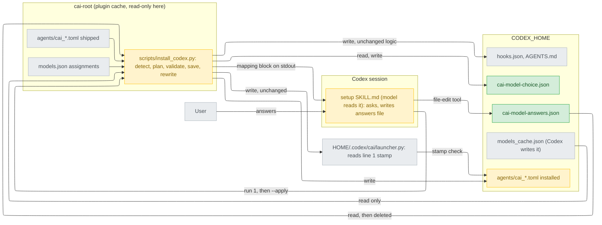
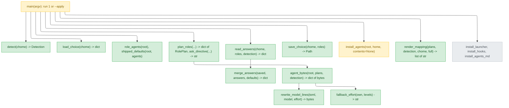
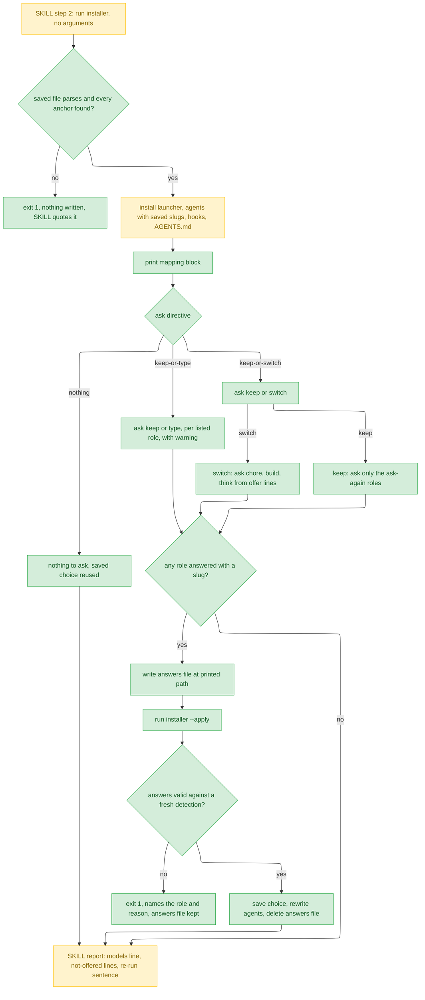
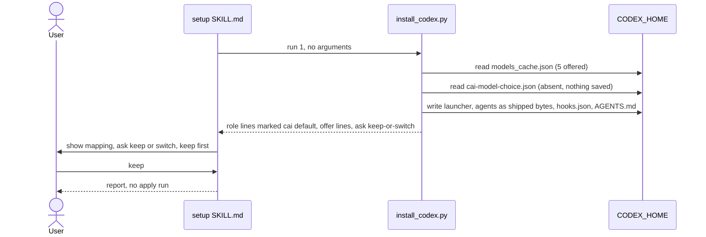
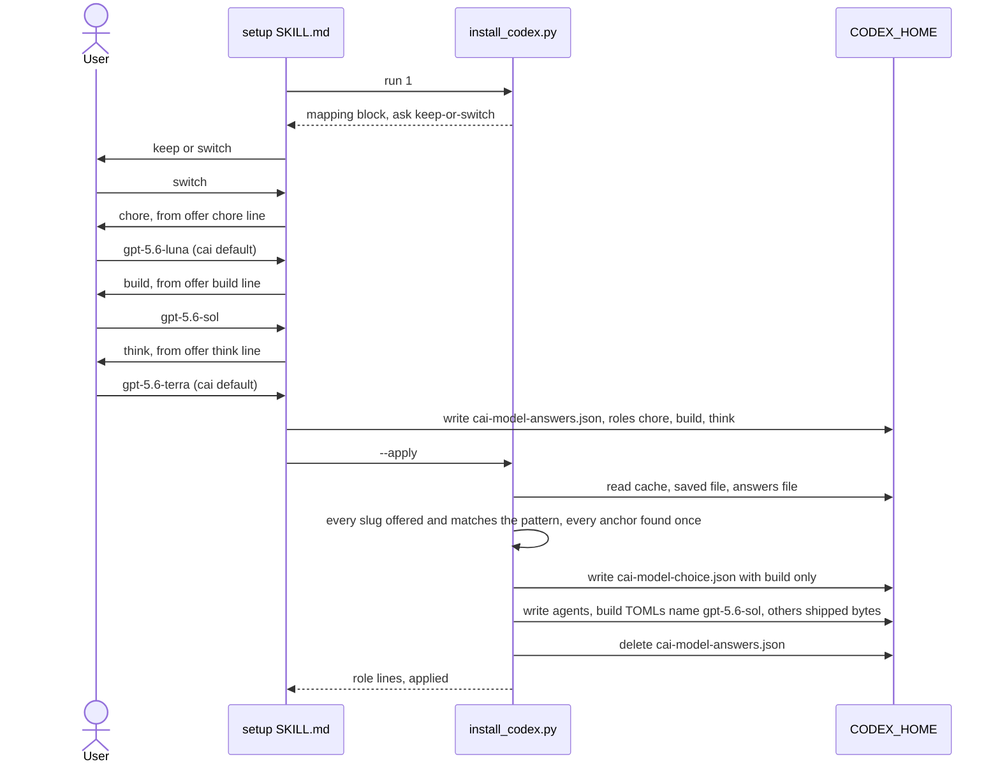
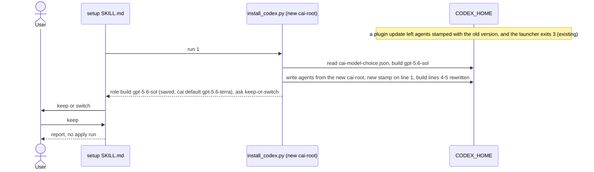
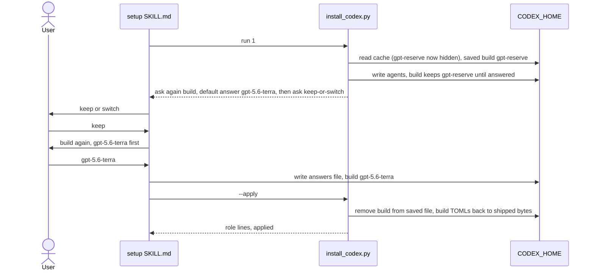
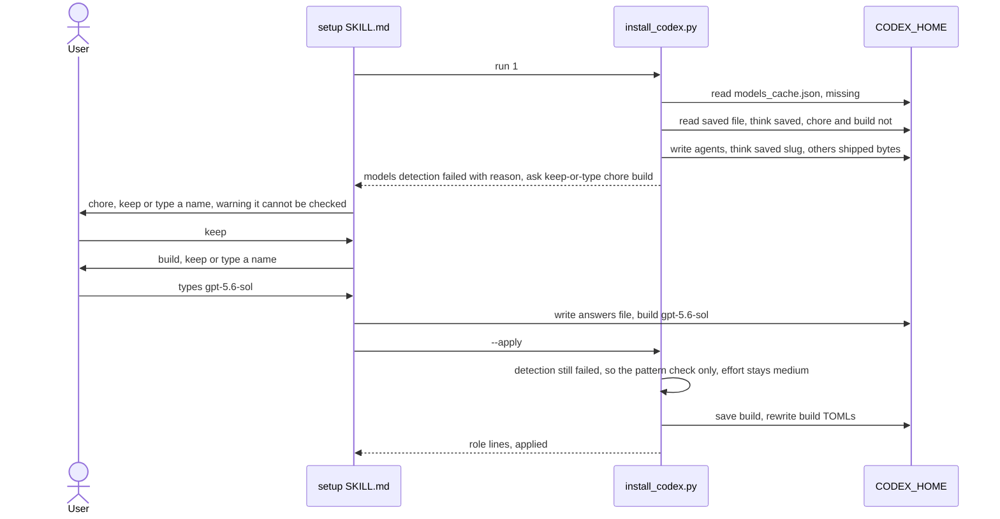

# codex-model-fallback — detail design

## Reference

Stance doc: docs/design/2026-09-22-codex-model-fallback-stance.md
Decisions doc: docs/design/2026-09-22-codex-model-fallback-decisions.md
Status: approved 2026-09-22

- Gate checked in the files on 2026-09-22: the stance's `## Status` reads `approved 2026-09-22` (`docs/design/2026-09-22-codex-model-fallback-stance.md:7`) and its `## Use cases / Issues` numbers UC1-UC5 and R1-R2 (`:49-55`). Every decisions `## Tier 1` entry has a `Decided:` line: D1 (`docs/design/2026-09-22-codex-model-fallback-decisions.md:96`), D2 (`:132`), D3 (`:164`). G1 and G2 each carry a `**Chosen:**` note (`:61`, `:62`).
- Intake: `.claude/track/codex-model-fallback/intake.md`. AC1-AC9 are at `:66-93`.
- Decisions this document builds on, and does not re-open: D1=A, the installer reads `$CODEX_HOME/models_cache.json` and nothing else. D2=A, a run with no arguments installs everything and a second run happens only when an answer changes something. D3=A, answers travel in a JSON file. G1 keeps keep as the default and adds a mark. G2 puts the saved choice under `$CODEX_HOME`. D4-D15 stand as written.
- **Marked "chosen by the person 2026-09-22 (P1-P4)"** means a question this round handed up; the person answered each one as proposed (`.claude/track/codex-model-fallback/options-detail-P1.md` … `-P4.md`).

### Traceability

| From the high-level design | Satisfied by | Status |
|---|---|---|
| UC1 | Run 1 with no saved choice writes shipped bytes (`install_agents` with `contents` absent for unsaved roles), prints the mapping block and `ask: keep-or-switch`. Keep means no apply run. Tested by `test_cli_keep_with_nothing_saved_leaves_agents_byte_identical`. | covered |
| UC2 | `offer <role>:` lines hold only detected, listed slugs that pass the charset check, marked `in effect` and `cai default`. The apply run rewrites that role's TOMLs, and a role left at its default stays byte-identical (D6). | covered |
| UC3 | The saved choice lives in `$CODEX_HOME/cai-model-choice.json` (G2, M7), and run 1 applies it before printing. Tested against a copied `<cai-root>` with a new stamp. | covered |
| UC4 | `RolePlan.reask` and the `ask again <role>:` line. The default answer is the first entry of the `offer` order. | covered |
| UC5 | `Detection.reason` holds one of three reasons. `ask: nothing` means every role is saved; `ask: keep-or-type <roles>` means some are not. A typed name is checked only against the charset (AC7). | covered |
| R1 | Switching a role replaces the pinned slug in every TOML on that role. The G1 `not offered` line flags an unsaved role whose default is missing. | covered |
| R2 | The README gains a detection row with status `unverified` and a description of the saved-choice file (AC9). | covered |

## Requirement

On Codex, each cai role (chore, build, think) is pinned to one model slug in every shipped `agents/cai_*.toml` (`plugins/cai-codex/agents/cai_explorer.toml:4-5`). An account that cannot use a pinned slug cannot dispatch any agent on that role (R1). `$setup` must show each role's model and effort, ask keep or switch, and offer only slugs the account's model list shows. It saves the per-role choice where a plugin update cannot erase it and applies it on every later `$setup`. Every rule that decides what gets written sits in `install_codex.py`, with a `tests/test_codex_install.py` case (stance M6, `docs/design/2026-09-22-codex-model-fallback-stance.md:31`).

This is done when AC1-AC9 (`intake.md:66-93`) each have a passing test at the level `## Verification` names, and a live Codex `$setup` run shows the mapping and asks. No CI can check that live run (`.github/workflows/validate.yml:8`, `:16-18`).

## Glossary

| Term | Definition | Where it lives |
|---|---|---|
| role | One of `chore`, `build`, `think`: the key an agent is assigned under. | plugins/cai-codex/models.json:24 |
| role's agents | The `cai_<x>.toml` names whose source `agents/<x>.md` is assigned to that role in `<cai-root>/models.json`. | plugins/cai-codex/models.json:39 |
| cai default | For a role, the `model =` and `model_reasoning_effort =` values on lines 4-5 of the role's shipped TOMLs, as the generator writes them. | scripts/gen-codex.py:424 |
| role's own effort | The cai default's effort for that role. It is the starting point of the effort fallback. | plugins/cai-codex/agents/cai_explorer.toml:5 |
| `<cai-root>` | The installed cai-codex tree the installer runs from: the grandparent of its own file. | plugins/cai-codex/scripts/install_codex.py:46 |
| `$CODEX_HOME` | The `CODEX_HOME` environment variable if set, else `~/.codex`. | plugins/cai-codex/scripts/install_codex.py:60 |
| detection | One read of `$CODEX_HOME/models_cache.json`, which gives the offered slugs, their effort lists, and either success or a reason for failure. | new — plugins/cai-codex/scripts/install_codex.py (`detect`) |
| offered slug | A catalog slug whose `visibility` is `list` and which matches the slug pattern (D5, D7). | new — plugins/cai-codex/scripts/install_codex.py (`Detection.offered`) |
| slug pattern | `^[a-z0-9][a-z0-9.-]{0,63}$`. Every slug is matched against it before it is written or saved (D7, M4). | new — plugins/cai-codex/scripts/install_codex.py (`SLUG_RE`) |
| saved choice | The role → slug map in the saved-choice file. A role with no entry follows the cai default. | new — plugins/cai-codex/scripts/install_codex.py (`load_choice`) |
| saved-choice file | `$CODEX_HOME/cai-model-choice.json` (chosen by the person 2026-09-22 — P1). | new — `$CODEX_HOME/cai-model-choice.json` |
| answers file | `$CODEX_HOME/cai-model-answers.json` (chosen by the person 2026-09-22 — P1). `SKILL.md` writes it and the apply run consumes it. | new — `$CODEX_HOME/cai-model-answers.json` |
| slug in effect | For a role: its saved slug if one exists, else its cai default. | concept |
| re-ask | A role whose saved slug is not offered by a successful detection (AC4, D5). | new — plugins/cai-codex/scripts/install_codex.py (`RolePlan.reask`) |
| G1 mark | The `not offered <role>:` line printed for an unsaved role whose cai default is not offered by a successful detection. | new — plugins/cai-codex/scripts/install_codex.py (`render_mapping`) |
| offer order | A role's offered slugs in this order: the slug in effect if offered, then the cai default if offered, then the rest in catalog order. | new — plugins/cai-codex/scripts/install_codex.py (`RolePlan.offer`) |
| effort fallback | The rule that picks the effort written beside a chosen slug (D8, AC5). | new — plugins/cai-codex/scripts/install_codex.py (`fallback_effort`) |
| header region | The bytes of a TOML before its first line starting `developer_instructions = `. Lines 1-6 in every shipped TOML. | scripts/gen-codex.py:421 |
| stamp line | Line 1, `# cai-codex-version: <v>`, which the launcher compares with the plugin version. | plugins/cai-codex/scripts/launcher.py:29 |
| mapping block | The lines run 1 prints after its existing output: `models:`, `role`, `offer`, `ask again`, `not offered`, `ask:`, `answers file:`. | new — plugins/cai-codex/scripts/install_codex.py (`render_mapping`) |
| ask directive | The single `ask: ...` line, which tells `SKILL.md` which questions to ask. | new — plugins/cai-codex/scripts/install_codex.py (`ask_directive`) |
| run 1 | `install_codex.py` with no arguments: today's full install, the saved choice applied, the mapping block printed. | plugins/cai-codex/scripts/install_codex.py:288 |
| apply run | `install_codex.py --apply`: it validates the answers file, saves the choice, and rewrites the agents. | new — plugins/cai-codex/scripts/install_codex.py (`apply_answers`) |
| format version | The integer `format` key in both JSON files. It is `1` in this design (D10). | new — plugins/cai-codex/scripts/install_codex.py (`FORMAT`) |

## Budgets

| What | Number | Where it comes from |
|---|---|---|
| Roles | 3 | `plugins/cai-codex/models.json:24-36` |
| Installed agent TOMLs, total (chore / build / think) | 10 (3 / 5 / 2) | `plugins/cai-codex/models.json:40-58`; directory listing of `plugins/cai-codex/agents/`, 2026-09-22 |
| Catalog models, and how many are offered today | 7 models, 5 offered | decisions C1, `docs/design/2026-09-22-codex-model-fallback-decisions.md:22` |
| Cache file size, read whole with `json.loads` | 232290 bytes | `os.path.getsize` on `C:/Users/millerlai/.codex/models_cache.json`, 2026-09-22 |
| Installer runs per `$setup` that exit 0 | at most 2 (retries across interpreters, `SKILL.md:43-46`, not counted) | D2, `decisions.md:126` |
| Subprocesses or network calls made by the installer | 0 | D1, `decisions.md:89` |
| Lines that may differ between a rewritten TOML and the shipped one | at most 2 | M3, `stance.md:28` |
| Header-region lines searched for the two anchors | 6 | `scripts/gen-codex.py:421-427` |
| Maximum slug length | 64 characters | D7, `decisions.md:182` |
| Effort levels ranked | 6 | C22, `decisions.md:43` |
| Format version of both JSON files | 1 | D10, `decisions.md:194` |
| Questions a keep answer costs, with no re-ask | 1 | AC1, `intake.md:66-67` |
| Questions a switch answer costs | 4 (1 + 3 roles) | AC2, `intake.md:69` |
| Options per role question today | 5 | the offered count above. UNVERIFIED: whether Codex's `request_user_input` renders 5 options. If it does not, `SKILL.md` falls back to numbered text, as step 3 already does (`plugins/cai-codex/skills/setup/SKILL.md:50-55`). |

## Design decisions

1. **Detection reads the cache file and nothing else** (D1=A; serves AC2, AC6). `detect` opens `codex_home() / "models_cache.json"` (`install_codex.py:60-62`). It never runs `codex`, so CI's Linux job with no `codex` binary exercises it through a fake file (C19, `decisions.md:40`). Whether the file follows `CODEX_HOME` is UNVERIFIED (C3, `decisions.md:24`). If it does not, detection reports `missing` under a custom home, and AC6's path applies. That is loud, never a wrong write (M1).
2. **Run 1 installs everything and applies the saved choice** (D2=A; serves AC1, AC3). The four existing steps keep their order (`install_codex.py:293-334`). Step 2 now writes rewritten bytes for saved roles. The mapping block prints last, after `guard:` (`:338`), so every line an existing test looks for is still printed (`tests/test_codex_install.py:247-248`).
3. **The apply run takes no path; it reads the fixed answers file** (narrows D3=A's `--apply <path>`, chosen by the person 2026-09-22 — P2; serves AC7 and "who is allowed to do what"). Two reasons. A path typed into a PowerShell line is the C15/C16 exposure D3 exists to avoid (`decisions.md:36-37`). And the apply run deletes the file it read, so accepting any path would let a mistyped argument delete an arbitrary file.
4. **Validate everything before writing anything; then write the saved file, then the agents, then delete the answers file** (serves M1 and "partial `--apply`"). An apply that fails partway leaves a saved file that the next run 1 converges every agent to. The answers file survives a failure, so re-running `--apply` repeats the same writes. The Implementation spec's apply diagram shows the order.
5. **Nothing is written before the saved file parses** (D10; C20 precedent `install_codex.py:216-223`, `:316-318`). Run 1 loads the saved choice and computes every agent's bytes before step 1 writes the launcher. That is stricter than `hooks.json`'s handling, which fails after the launcher and agents are already written (`:294-318`), because a bad saved file would otherwise decide what the agents get.
6. **Keep/switch comes first; re-asked roles after** (serves AC1 and AC4 together; low cost, only `SKILL.md`). On keep, `SKILL.md` asks only the `ask again` roles. On switch it asks all three roles (AC2), and a re-asked role's first option is its AC4 default answer, because the stale slug is not offered and the offer order puts the cai default, or else the first detected slug, first.
7. **The G1 mark is its own line, repeated verbatim in setup's report** (G1 veto, `decisions.md:61`). The sample is under the mapping-printer component. It is printed only for an unsaved role, because a saved role missing from detection already gets its `ask again` line.
8. **The rewrite is anchored in the header region and keeps line endings** (M3, D11; serves AC2). The two patterns run only on the bytes before `developer_instructions = `, so a line inside the instructions that happens to start with `model = ` cannot be matched (`scripts/gen-codex.py:427`). The line terminator is preserved, so a TOML that some checkout gave CRLF keeps CRLF. Whether Codex's plugin cache stores LF or CRLF is UNVERIFIED, and this decision makes that irrelevant.
9. **Defaults come from the shipped TOMLs, never from `scripts/codex-models.json`** (cross-project invariant, `stance.md:37`). A role's default is read from the first of its agents in sorted order. Every TOML on a role carries the same pair, because the generator writes one tier per role (`scripts/gen-codex.py:417`, `:424-425`).
10. **Only `visibility == "list"` is offered** (D5, `decisions.md:174`). A model with no `visibility` key is not offered. That is the strict reading, and it never offers something hidden.
11. **Unknown effort names are ignored when ranking** (D8). A `supported_reasoning_levels` entry outside the six names is dropped. If nothing is left, the list counts as missing, so the role's own effort is kept (`intake.md:80-83`).
12. **The README gets a fourth status value, `unverified`** (AC9 says "UNVERIFIED today", `intake.md:92-93`; chosen by the person 2026-09-22 — P3). Today's legend allows three values (`plugins/cai-codex/README.md:70-73`) and a test enforces them (`tests/test_codex_readme.py:15`, `:47-53`). No existing value fits: the cache is not documented (C2), so it is not "documented, not tested".
13. **A leftover answers file is removed at the start of run 1** (serves M1). An abandoned setup can leave one behind. Removing it keeps a later `--apply` from applying answers the user gave in an earlier session.
14. **Released as 0.2.0** (AC8; chosen by the person 2026-09-22 — P4). `main` publishes 0.1.1 (`scripts/codex-release.json:2`), and `--release` refuses a version at or below it (`scripts/gen-codex.py:584-591`). This change adds a CLI flag and a user-facing question, which is why the proposal is a minor bump rather than 0.1.2.

## Diagrams

### Architecture



What to look at: the two green files are both inside `CODEX_HOME`, and both are separate from the four files the installer writes wholesale. That placement is M7 plus G2. The only arrow from `SKILL.md` into a file points at the answers file. Every other write comes from `install_codex.py` (M6).

### Component



What to look at: every green box except `save_choice` is a pure function, taking values and returning values. So the rules M1-M4, AC4 and AC5 are unit-testable without a file system. Only `main`, `save_choice` and `install_agents` write. `install_agents` is amber because it gains one optional parameter and keeps its existing two-argument call (`tests/test_codex_install.py:90`).

### Flow



What to look at: the four-way branch at `ask directive` is computed by the installer, not by `SKILL.md`. The prose only follows the line it was handed (D4). `Q` is the reason D2=A keeps a plain keep to one run. It asks only whether a slug was given, never whether the slug differs, so the comparison stays in the installer. The two red-path exits, `X` and `R`, both leave a consistent install behind.

### Sequence — UC1



What to look at: nothing is written after the user answers. With nothing saved, "keep" is a single installer run whose agent bytes equal the shipped ones (AC1, M2).

### Sequence — UC2



What to look at: choosing the cai default for chore and think saves nothing for them (D6). Only `build` lands in the saved file, and only build's five TOMLs differ from the shipped ones.

### Sequence — UC3



What to look at: the saved choice is applied by run 1 itself, so keep after an update needs no apply run. And line 1 now carries the new stamp, so the launcher stops exiting 3 (M3, `plugins/cai-codex/scripts/launcher.py:204-210`).

### Sequence — UC4



What to look at: between run 1 and the apply run, the build TOMLs still name the stale slug the user once chose (D2=A, M1 holds). Answering with the cai default removes the saved entry, so the TOMLs go back to byte-identical.

### Sequence — UC5



What to look at: think is never asked, because a saved choice is reused without asking when detection fails (AC6). The typed name is checked only against the pattern, never against a list, and its effort is the role's own (AC5, AC7).

## Implementation spec

Shared constraints for every block below. Standard library only. `from __future__ import annotations` goes at the top, so the builtin-generic hints below are never evaluated on an older Python 3. The minimum Python version a user's `$setup` runs is UNVERIFIED (`plugins/cai-codex/README.md:10-14` says only "Python 3"). Records use `typing.NamedTuple`, as `scripts/gen-codex.py:35` does. Every file write goes through `_atomic_write_bytes` (`install_codex.py:65-75`). New module constants:

```python
SLUG_RE = re.compile(r"^[a-z0-9][a-z0-9.-]{0,63}$")
EFFORT_ORDER = ("low", "medium", "high", "xhigh", "max", "ultra")
MODELS_CACHE_NAME = "models_cache.json"
CHOICE_NAME = "cai-model-choice.json"      # chosen by the person 2026-09-22 (P1)
ANSWERS_NAME = "cai-model-answers.json"    # chosen by the person 2026-09-22 (P1)
FORMAT = 1
```

### Detection — `detect`

- **Responsibility:** turn `$CODEX_HOME/models_cache.json` into the offered slugs and their effort lists, or a failure reason.
- **Interface:**
  ```python
  class Detection(NamedTuple):
      ok: bool
      reason: str                       # "" when ok
      source: Path
      offered: tuple[str, ...]          # catalog order
      levels: dict[str, tuple[str, ...]]  # offered slug -> known efforts, catalog order
      total: int                        # catalog entries with a str slug
      ignored: int                      # listed slugs dropped by SLUG_RE
      fetched_at: str | None
  def detect(chome: Path) -> Detection
  ```
- **Data in:** the cache as C1 describes it (`decisions.md:22`): a top-level object with `models`, a list of objects each with `slug` (str), `visibility` (str), and `supported_reasoning_levels` (a list of objects with `effort`, a str). `fetched_at` is an optional str.
- **Errors:** never raises for cache content. `reason` is exactly one of three strings. `"<path> is missing"` when the file does not exist. `"<path> cannot be parsed: <why>"` for `OSError`, `UnicodeDecodeError` or `json.JSONDecodeError`, for a top level that is not an object, for `models` that is not a list, or for an entry that is not an object. `"<path> lists no offered models"` when `offered` is empty after filtering (D14). An entry whose `slug` is not a str is skipped, not fatal. It is counted in neither `total` nor `offered`.
- **Concurrency:** read-only. Codex may rewrite the file at any moment. `json.loads` of a whole read is then either the old or the new content, or a parse failure, which counts as a failure reason. The apply run re-detects rather than trusting run 1's result (decision 4).
- **Observability:** none by itself. `render_mapping` prints its result.
- **Where it lives:** `plugins/cai-codex/scripts/install_codex.py`, new function. The file exists today.
- **What it reuses:** `codex_home()` (`install_codex.py:60-62`); `json` (`:40`).

### Saved choice — `load_choice`, `save_choice`

- **Responsibility:** read and write the role → slug map that survives plugin updates.
- **Interface:**
  ```python
  class ChoiceParseError(Exception): ...   # file exists but is not a valid saved choice
  def load_choice(chome: Path) -> dict[str, str]      # {} when the file is absent
  def save_choice(chome: Path, roles: dict[str, str]) -> Path
  ```
- **Data:** `$CODEX_HOME/cai-model-choice.json`, UTF-8, no BOM, LF. It is written as `json.dumps(obj, indent=2, sort_keys=True) + "\n"`, the same way `install_hooks` writes (`install_codex.py:236-237`). Sample, one role saved:
  ```json
  {
    "format": 1,
    "roles": {
      "build": "gpt-5.6-sol"
    }
  }
  ```
  `save_choice` with an empty map writes `"roles": {}`. It never deletes the file.
- **Errors:** `load_choice` raises `ChoiceParseError(f"{path}: {why}")` for any of these: unreadable or undecodable, invalid JSON, top level not an object, `format` not the integer `1`, `roles` not an object, a value not a str, or a value failing `SLUG_RE`. The caller exits 1 with `invalid saved model choice, not overwritten: <message>` before any write (decision 5). `save_choice` lets `OSError` propagate.
- **Concurrency:** single writer per `$CODEX_HOME` is assumed. Two concurrent `$setup` runs on one home end with whichever apply run wrote last. Each write is atomic (`os.replace`), so the file is never torn. There is no lock, because no requirement names concurrent setups.
- **Observability:** the apply run prints `saved <path>`.
- **Where it lives:** `install_codex.py`, new.
- **What it reuses:** `_atomic_write_bytes` (`install_codex.py:65-75`); the refuse-to-overwrite precedent of `HooksParseError` (`:52-53`, `:216-223`).

### Role map — `role_agents`, `shipped_defaults`

- **Responsibility:** name each role's installed agents, and read each role's cai default from the shipped TOMLs.
- **Interface:**
  ```python
  def role_agents(root: Path) -> dict[str, list[str]]
      # {"chore": ["cai_explorer.toml", "cai_shipper.toml", "cai_test-runner.toml"], ...}
  def shipped_defaults(root: Path, agents: dict[str, list[str]]) -> dict[str, tuple[str, str]]
      # {"chore": ("gpt-5.6-luna", "low"), ...}
  ```
- **Data:** `role_agents` reads `root/models.json`. Its role order is the key order of `roles` (`plugins/cai-codex/models.json:24-36`). Each `assignments` key of the form `agents/<x>.md` maps to `cai_<x>.toml` (`:39-60`, C12), and only files that exist under `root/agents/` are kept, in sorted order. Keys under `skills/` are ignored. `shipped_defaults` reads the first sorted TOML of each role and extracts the two values with the same header-region patterns `rewrite_model_lines` uses.
- **Errors:** a missing or unparsable `root/models.json` raises. The caller exits 1 with `cannot read <path>: <why>`. That cannot happen in a generated tree (`scripts/gen-codex.py:435-440`), but it is cheap to report. An anchor miss raises `AnchorError`, below.
- **Concurrency:** reads the plugin cache only.
- **Observability:** none.
- **Where it lives:** `install_codex.py`, new.
- **What it reuses:** the `assignments` → `cai_` naming of `scripts/gen-codex.py:422`, `:476-480`. Nothing from `scripts/codex-models.json`, which is not shipped (`stance.md:37`).

### Planner — `plan_roles`, `ask_directive`

- **Responsibility:** decide, per role, the slug in effect, whether it is re-asked, whether it gets the G1 mark, and its offer order, and decide which questions `SKILL.md` asks.
- **Interface:**
  ```python
  class RolePlan(NamedTuple):
      role: str
      agents: tuple[str, ...]
      default_model: str
      default_effort: str
      in_effect: str          # saved slug, else default_model
      saved: bool
      effort: str             # fallback_effort(default_effort, levels.get(in_effect))
      reask: bool             # detection.ok and saved and in_effect not in offered
      unlisted_default: bool  # detection.ok and not saved and default_model not in offered
      offer: tuple[str, ...]  # () when not detection.ok
  def plan_roles(agents: dict[str, list[str]], defaults: dict[str, tuple[str, str]],
                 detection: Detection, saved: dict[str, str]) -> dict[str, RolePlan]
  def ask_directive(plans: dict[str, RolePlan], detection: Detection) -> str
  ```
- **Data:** `offer` = `[in_effect]` if offered, then `default_model` if offered and different, then the remaining offered slugs in catalog order. So `offer[0]` is AC4's default answer for a re-asked role (`intake.md:76-79`). A saved role name that is not in `agents` is dropped from the plan. `main` prints one `ignored saved role <name>: cai-codex has no such role` line for it (D13). `ask_directive` returns exactly one of these strings: `"ask: keep-or-switch"` when `detection.ok`; `"ask: keep-or-type <r1> <r2> ..."` when detection failed, listing the unsaved roles in role order; `"ask: nothing"` when detection failed and every role is saved.
- **Errors:** none. Pure.
- **Concurrency:** pure.
- **Observability:** through `render_mapping`.
- **Where it lives:** `install_codex.py`, new.
- **What it reuses:** `fallback_effort`, below.

### Line rewriter — `rewrite_model_lines`, `fallback_effort`

- **Responsibility:** produce a TOML whose only differences from the shipped one are the `model =` and `model_reasoning_effort =` values.
- **Interface:**
  ```python
  class AnchorError(Exception): ...   # an anchor missing or repeated in the header region
  def rewrite_model_lines(toml: bytes, model: str, effort: str) -> bytes
  def fallback_effort(own: str, levels: tuple[str, ...] | None) -> str
  ```
- **Data:** `rewrite_model_lines` splits `toml` at the first match of `rb"^developer_instructions = "` (multiline). If that line is absent, the whole file is the header. In the header it finds `rb'^model = "[^"\r\n]*"(?=\r?$)'` and `rb'^model_reasoning_effort = "[^"\r\n]*"(?=\r?$)'` (multiline), and each must match exactly once. It replaces each match with `model = "<model>"` or `model_reasoning_effort = "<effort>"`. Any `\r` stays outside the replaced span, so line endings survive. Before writing, `model` must match `SLUG_RE` and `effort` must be in `EFFORT_ORDER`; neither contains `"` or `\`, so no escaping is needed (C14, `decisions.md:35`). Line 1 is never inside a match. `fallback_effort` works on `known = [l for l in levels if l in EFFORT_ORDER]`. It returns `own` if `levels` is None or `known` is empty (a typed name or an unlisted slug), else `own` if `own in known`, else the highest-ranked entry of `known` that ranks below `own`, else the lowest-ranked entry of `known` (D8).
- **Errors:** `AnchorError(f"{name}: {which} found {n} times")`. `ValueError` for a model or effort that fails its check. That cannot happen from validated inputs, but it is kept so M4 does not rest on callers alone. The caller exits 1 with `cannot rewrite <path>: <message>` before any write.
- **Concurrency:** pure.
- **Observability:** none.
- **Where it lives:** `install_codex.py`, new.
- **What it reuses:** the line shape of `scripts/gen-codex.py:424-425`. It does not import `_toml_string` (`:406-407`), because `gen-codex.py` is Ours and not shipped.

### Agent bytes and `install_agents`

- **Responsibility:** compute every installed TOML's bytes, then write them.
- **Interface:**
  ```python
  def agent_bytes(root: Path, plans: dict[str, RolePlan]) -> dict[str, bytes]
      # every shipped cai_*.toml name -> bytes; unsaved roles' files are the shipped bytes
  def install_agents(root: Path, home: Path, contents: dict[str, bytes] | None = None)
      # unchanged return: (written paths, removed paths)
  ```
- **Data:** a saved role's files become `rewrite_model_lines(shipped, plan.in_effect, plan.effort)`. Every other file is `p.read_bytes()`, unchanged. In `install_agents`, `contents=None` keeps today's behaviour exactly (`install_codex.py:93-114`). With a map, it writes `contents[p.name]` in place of `p.read_bytes()`, and removes stale files as today.
- **Errors:** `AnchorError` from `agent_bytes` happens before any write. `OSError` during writing propagates as today (`:304-308`).
- **Concurrency:** idempotent. The same inputs give the same bytes.
- **Observability:** `wrote <path>` and `removed <path>` per file, as today (`:309-312`).
- **Where it lives:** `install_codex.py`. `agent_bytes` is new; `install_agents` is modified.
- **What it reuses:** `install_agents` itself.

### Mapping printer — `render_mapping`

- **Responsibility:** print the roles and the questions in a form both a person and `SKILL.md` can read line by line.
- **Interface:**
  ```python
  def render_mapping(plans: dict[str, RolePlan], detection: Detection, chome: Path,
                     full: bool) -> list[str]   # full=True for run 1, False for the apply run
  ```
- **Data:** the lines, in this order (the prefixes are chosen by the person 2026-09-22 — P1):
  1. `models: detected <len(offered)> of <total> from <source> (fetched <fetched_at>)`, or `models: detection failed: <reason>`. The `(fetched ...)` part is omitted when `fetched_at` is None.
  2. `models: ignored <n> slug(s) outside [a-z0-9.-]`, only when `ignored > 0`.
  3. One line per role: `role <role>: <in_effect> / <effort> (<tag>) -- <agent names without .toml, comma-separated>`. `<tag>` is `cai default`, or `saved; cai default <default_model>`.
  4. When `full` and `detection.ok`, one line per role: `offer <role>: <slug>[ (<marks>)], ...`, in offer order. `<marks>` is `in effect`, `cai default`, or `in effect, cai default`.
  5. One line per re-asked role: `ask again <role>: saved <in_effect> is not offered by this detection; default answer <offer[0]>`.
  6. One line per G1 role: `not offered <role>: <in_effect> is in effect but this detection does not list it`.
  7. When `full`: `ask_directive(...)`, then `answers file: <chome / ANSWERS_NAME>`.
  8. When not `full`: `applied: <n> role(s) saved`.

  Sample: run 1 against the real 2026-09-22 cache, build saved as `gpt-reserve` (now hidden), everything else default. The paths are elided.
  ```
  models: detected 5 of 7 from ...\.codex\models_cache.json (fetched 2026-09-22T08:13:21.014621200Z)
  role chore: gpt-5.6-luna / low (cai default) -- cai_explorer, cai_shipper, cai_test-runner
  role build: gpt-reserve / medium (saved; cai default gpt-5.6-terra) -- cai_implementer, cai_refactoring-detector, cai_reviewer, cai_security-reviewer, cai_verifier
  role think: gpt-5.6-terra / high (cai default) -- cai_architect, cai_designer
  offer chore: gpt-5.6-luna (in effect, cai default), gpt-5.6-sol, gpt-6-astra, gpt-5.6-terra, gpt-5.5
  offer build: gpt-5.6-terra (cai default), gpt-5.6-sol, gpt-6-astra, gpt-5.6-luna, gpt-5.5
  offer think: gpt-5.6-terra (in effect, cai default), gpt-5.6-sol, gpt-6-astra, gpt-5.6-luna, gpt-5.5
  ask again build: saved gpt-reserve is not offered by this detection; default answer gpt-5.6-terra
  ask: keep-or-switch
  answers file: ...\.codex\cai-model-answers.json
  ```
  A G1 line, for an account whose cache lacks terra and with nothing saved: `not offered think: gpt-5.6-terra is in effect but this detection does not list it`.
- **Errors:** none. Every slug printed has passed `SLUG_RE`, or came from the shipped TOML or the validated saved file, so no printed line can carry a newline or a quote (D7).
- **Concurrency:** pure.
- **Observability:** this is the observability, and `SKILL.md` quotes it in the report.
- **Where it lives:** `install_codex.py`, new.
- **What it reuses:** the `<verb> <path>` line style of `main` (`install_codex.py:298-338`).

### Answers reader — `read_answers`, `merge_answers`

- **Responsibility:** validate what `SKILL.md` wrote, and fold it into the saved choice.
- **Interface:**
  ```python
  class AnswersError(Exception): ...
  def read_answers(chome: Path, roles: tuple[str, ...], detection: Detection) -> dict[str, str]
  def merge_answers(saved: dict[str, str], answers: dict[str, str],
                    defaults: dict[str, tuple[str, str]]) -> dict[str, str]
  ```
- **Data in:** `$CODEX_HOME/cai-model-answers.json`. Same shape as the saved file, listing only the roles the user answered:
  ```json
  {"format": 1, "roles": {"build": "gpt-5.6-sol"}}
  ```
  `merge_answers` starts from `saved`, then for each answered role: if the slug equals that role's `default_model`, the entry is removed (D6); otherwise the entry is set.
- **Errors:** `AnswersError` carries a message the caller prints after `answers not applied: `, and the process exits 1. The file is kept and nothing is written. The messages, one per failing check: `<path> is missing`; `<path> cannot be parsed: <why>` (invalid JSON, not an object, `format` not `1`, `roles` not an object); `unknown role <repr(name)>`; `rejected <role>: <repr(value)> is not a model name (allowed: ^[a-z0-9][a-z0-9.-]{0,63}$)` (AC7; `repr` so that a newline prints as `\n`); `rejected <role>: <slug> is not offered by this detection; re-run $setup`, when `detection.ok` and the slug is not offered. Checks run in the order listed, so a slug reaches the offered check only after passing the pattern, and every printed slug is pattern-clean. When detection failed, a slug that matches the pattern is accepted as typed (AC6).
- **Concurrency:** if the cache changed between run 1 and the apply run, a slug the user picked may now be rejected. That is the last message above, and it is intended (M1).
- **Observability:** the `AnswersError` line on failure; `removed <path>` once the file is deleted on success.
- **Where it lives:** `install_codex.py`, new.
- **What it reuses:** `SLUG_RE`; `json` (`:40`).

### Entry point — `main`, `apply_answers`

- **Responsibility:** run the install run or the apply run, in an order where a failure leaves a state the next run converges from.
- **Interface:**
  ```python
  def main(argv: list[str] | None = None) -> int   # argparse; "--apply" store_true
  def apply_answers(root: Path, chome: Path) -> int
  ```
  An unknown argument exits 2 through argparse. The existing docstring's exit-code line (`install_codex.py:29-30`) gains `2 bad arguments`.
- **Run 1 order:** (a) `detect`, `load_choice`, `role_agents`, `shipped_defaults`, `plan_roles`, `agent_bytes`. Any error here exits 1 before anything is written. (b) If an answers file exists, delete it and print `removed stale <path>` (decision 13). (c) The existing steps 1-4 (`:293-334`), with `install_agents(root, chome, contents)`. (d) The existing `rules:` and `guard:` lines. (e) The `ignored saved role` lines, then `render_mapping(..., full=True)`.
- **Apply order:**

  ```mermaid
  ---
  config:
    flowchart:
      defaultRenderer: "elk"
  ---
  flowchart LR
    V["validate: detect, load_choice, read_answers, merge, agent_bytes"]:::added
    E1["exit 1, nothing written"]:::added
    S1["write cai-model-choice.json"]:::added
    S2["write every cai_*.toml"]:::added
    E2["exit 1: re-run $setup to finish, answers file kept"]:::added
    S3["delete cai-model-answers.json"]:::added
    P["print role lines, applied"]:::added
    V -- "any error" --> E1
    V -- "ok" --> S1
    S1 -- "OSError" --> E2
    S1 --> S2
    S2 -- "OSError" --> E2
    S2 --> S3 --> P
    classDef added fill:#d4edda,stroke:#28a745,color:#155724
  ```

  What to look at: the saved file is written before any agent. So after a failure at `S2`, the saved file holds the user's new choice. The next run 1, or a repeat of `--apply` since the answers file was kept, rewrites every agent from it. A failure deleting the answers file at `S3` is reported (`could not remove <path>: <why>`) but the exit code is still 0, because run 1 removes a leftover answers file anyway (decision 13).
- **Errors:** `write failed: <path>: <why>` followed by `re-run $setup to finish`, exit 1. `apply_answers` does not touch the launcher, `hooks.json` or `AGENTS.md`, so setup step 3's language edit (`plugins/cai-codex/skills/setup/SKILL.md:57-69`) is never overwritten.
- **Concurrency:** re-running `--apply` after any failure is safe. Every write is a full-file atomic replace computed from the same inputs. A Codex dispatch that starts while the apply run is writing agents may see some of a role's TOMLs already switched and others not. Each file is whole, and the next dispatch sees them all, so there is no lock.
- **Observability:** `saved <path>`, the `wrote <path>` lines, `removed <path>`, the role and `not offered` lines, and `applied: <n> role(s) saved`.
- **Where it lives:** `install_codex.py`. `main` is modified; `apply_answers` is new.
- **What it reuses:** `main`'s per-step `try/except OSError` shape (`:293-334`).

### `skills/setup/SKILL.md` — step 2 and step 5

- **Responsibility:** ask exactly what the ask directive says, and hand the answers to the installer. It holds no rule about what gets written (M5, M6).
- **Interface (the behaviours the prose must carry):**
  1. Step 2 runs the installer exactly as today (`SKILL.md:16-46`), then reads the mapping block from its output.
  2. It shows the `role` lines to the user as the current mapping. Every `ask again` and `not offered` line is shown on its own line.
  3. It follows the `ask:` line. For `keep-or-switch`: one question, keep (first, the default) or switch. On switch, one question per role in the order chore, build, think, whose options are that role's `offer` line in order, first option first. On keep, one question per `ask again` role, options from its `offer` line. For `keep-or-type <roles>`: one question per listed role, keep (first, the default) or type a model name, with the sentence "setup cannot check a typed name against your account". For `nothing`: no question, and the report says the saved choice was reused and why.
  4. Menus follow the rule step 3 already states: use a menu tool if one is available, else numbered text (`SKILL.md:50-55`).
  5. If no role was answered with a slug (every answer was keep, or nothing was asked), it runs nothing more. It does not compare answers with the slug in effect; whether an answer changes anything is the installer's call (`merge_answers`). Otherwise it writes the answers file at the path on the `answers file:` line, with the file-edit tool, as `{"format": 1, "roles": {<role>: <slug>, ...}}`, with one entry for every role asked a question this run and answered with a slug; a role answered "keep" gets no entry. It then runs the installer again with `--apply` placed right after the script path, and on Windows inside the pipeline, before `2>&1` (`SKILL.md:38`), using the interpreter that just succeeded. A non-zero exit from `--apply` is quoted to the user and not retried with another interpreter, because the answers, not the interpreter, are what failed.
  6. Step 5, the report, adds: the `models:` line; every `not offered` line, verbatim (G1); which roles were saved; and this sentence (chosen by the person 2026-09-22 — P1): "If a cai agent later fails to start with a model error, re-run `$setup` and switch that role."
- **Errors:** the installer's own messages are quoted. The prose never decides whether a slug is acceptable.
- **Concurrency:** not applicable, because one Codex session runs one `$setup`.
- **Observability:** the report.
- **Where it lives:** `plugins/cai-codex/skills/setup/SKILL.md`, which exists. It is hand-written (`scripts/gen-codex.py:80`).
- **What it reuses:** step 2's interpreter loop and Windows pipeline (`SKILL.md:22-46`); step 3's menu rule (`:50-55`).

### `README.md` — AC9

- **Responsibility:** tell users what detection rests on and where their choice is saved.
- **Changes (all chosen by the person 2026-09-22 — P1, P3):**
  - The status legend (`plugins/cai-codex/README.md:70-73`) gains: "`unverified` (what cai relies on here is neither described in Codex's documentation nor guaranteed to stay as observed; it may change with a Codex update)".
  - A new mapping row after the per-agent model pin row (`:78`):
    `| Choosing a model per role (chore/build/think) | `$setup` reads the model list Codex keeps for your account in `$CODEX_HOME/models_cache.json`, offers only the models it lists, and saves your per-role choice in `$CODEX_HOME/cai-model-choice.json`, which every later `$setup` re-applies | unverified | observed with codex-cli 0.155.1 on Windows 11, 2026-09-22: the file lists each model's slug, whether it is shown or hidden, and its supported reasoning efforts. It is not described in Codex's documentation, so a Codex update may move or reshape it; setup then says it could not read the list and offers to keep the current models or type a name, rather than guessing. Whether the list leaves out models a restricted account cannot use was not checked. |`
  - A Usage paragraph after "After every plugin update" (`:52-54`): "**Choosing models.** `$setup` shows which model each cai role runs on and asks whether to keep or switch, offering only models your account's model list shows. It checks that list only while it runs: if a cai agent later fails to start with a model error, re-run `$setup` and switch that role."
  - An Uninstall bullet (`:103-111`): "- `$CODEX_HOME/cai-model-choice.json` — your saved per-role model choice."
- **Where it lives:** `plugins/cai-codex/README.md`, which exists and is hand-written (`scripts/gen-codex.py:82`).
- **What it reuses:** the row format and evidence voice of `:78`.

## Naming

| Name | What it is | Chosen by |
|---|---|---|
| `$CODEX_HOME/cai-model-choice.json` | the saved-choice file | directory: the person, 2026-09-22 (G2, `decisions.md:62`); file name: chosen by the person 2026-09-22 (P1) |
| `$CODEX_HOME/cai-model-answers.json` | the answers file | directory follows G2; file name: chosen by the person 2026-09-22 (P1) |
| `--apply` (takes no value) | the apply run's flag | flag name follows D2/D3's own wording (`decisions.md:110`, `:157`); dropping the path argument is chosen by the person 2026-09-22 (P2) |
| `format` (integer, value `1`), `roles` (object) | the two top-level keys of both JSON files | chosen by the person 2026-09-22 (P1); D10 asks for "a format-version key and a role→slug map" (`decisions.md:194`) |
| `models:`, `role <r>:`, `offer <r>:`, `ask again <r>:`, `not offered <r>:`, `ask: keep-or-switch`, `ask: keep-or-type <roles>`, `ask: nothing`, `answers file:`, `applied:` | mapping-block line prefixes and ask-directive values | chosen by the person 2026-09-22 (P1) |
| `in effect`, `cai default`, `saved; cai default <slug>` | marks and tags inside mapping lines | `in effect` and "cai's default" follow AC2's wording (`intake.md:70-71`); exact spelling chosen by the person 2026-09-22 (P1) |
| `unverified` | the fourth README status value | AC9's "UNVERIFIED today" (`intake.md:92-93`); spelling in lower case follows the existing values (`plugins/cai-codex/README.md:70-73`); adding it is chosen by the person 2026-09-22 (P3) |
| `0.2.0` | the cai-codex release version | must be greater than `main`'s 0.1.1 (`scripts/codex-release.json:2`, `scripts/gen-codex.py:584-591`); the value is chosen by the person 2026-09-22 (P4) |
| `SLUG_RE`, `EFFORT_ORDER`, `MODELS_CACHE_NAME`, `CHOICE_NAME`, `ANSWERS_NAME`, `FORMAT` | module constants | follows the upper-case constant style of `install_codex.py:46-49` |
| `Detection`, `RolePlan`, `ChoiceParseError`, `AnswersError`, `AnchorError` | records and exceptions | follows `HooksParseError`/`MarkerError` (`install_codex.py:52-57`) and `NamedTuple` use in `scripts/gen-codex.py:35` |
| `detect`, `load_choice`, `save_choice`, `role_agents`, `shipped_defaults`, `plan_roles`, `ask_directive`, `rewrite_model_lines`, `fallback_effort`, `agent_bytes`, `render_mapping`, `read_answers`, `merge_answers`, `apply_answers` | new functions | follows the `install_<thing>` verb-first snake_case style of `install_codex.py:82`, `:93`, `:216` |
| test function names in `## Verification` | new pytest cases | builder's, following `test_<unit>_<behaviour>` in `tests/test_codex_install.py:65`, `:80`, `:225` |

## Change points

| Path | Change | Exists today |
|---|---|---|
| `plugins/cai-codex/scripts/install_codex.py` | New constants, records and functions as above; `install_agents` gains `contents`; `main` gains argparse, `--apply`, pre-write validation and the mapping block; docstring updated (usage, step 2, exit codes). Hand-written (`scripts/gen-codex.py:79`). | yes |
| `plugins/cai-codex/skills/setup/SKILL.md` | Step 2 gains the mapping, the questions and the apply run; step 5 gains the models line, the G1 lines, and the re-run sentence. Hand-written (`scripts/gen-codex.py:80`). | yes |
| `plugins/cai-codex/README.md` | Legend value, mapping row, Usage paragraph, Uninstall bullet. Hand-written (`scripts/gen-codex.py:82`). | yes |
| `tests/test_codex_install.py` | New unit and CLI cases (`## Verification`); a fake-cache helper beside `fake_env` (`:44-53`). | yes |
| `tests/test_codex_readme.py` | `STATUSES` gains `"unverified"` (`:15`). The launcher-path check narrows from `"$CODEX_HOME/cai"` to `"$CODEX_HOME/cai/"` (`:127`), because `$CODEX_HOME/cai-model-choice.json` contains the shorter string while the test means the launcher directory (docstring `:123-124`). One new test pins the detection row's status. | yes |
| `scripts/codex-release.json`, `plugins/cai-codex/agents/cai_*.toml` (line 1), `plugins/cai-codex/.codex-plugin/plugin.json` | Rewritten by `python scripts/gen-codex.py --release 0.2.0` (`scripts/gen-codex.py:647-651`, `:695-702`). | yes |
| `plugins/cai/`, `scripts/gen-codex.py`, `plugins/cai-codex/scripts/launcher.py` | unchanged (AC8, stance cross-project I1) | yes |

No new dependency: `re`, `json`, `argparse`, `typing` and `pathlib` are all in the standard library.

## Failure modes

| Situation | What happens | What the caller sees |
|---|---|---|
| Cache file missing (including a custom `CODEX_HOME` the cache does not follow, C3) | detection fails; saved roles reused; unsaved roles offered keep or type | `models: detection failed: <path> is missing`, then `ask: keep-or-type ...` or `ask: nothing` |
| Cache unparsable or reshaped by a Codex update (C2) | same as missing | `models: detection failed: <path> cannot be parsed: <why>` |
| Cache lists only hidden models | same as missing (D14) | `... lists no offered models` |
| A catalog slug outside the pattern | dropped from `offered` | `models: ignored 1 slug(s) outside [a-z0-9.-]` |
| Saved file unparsable, wrong format, or a bad slug | exit 1 before any write; file kept | `invalid saved model choice, not overwritten: <path>: <why>`; `SKILL.md` quotes it and stops (`SKILL.md:43-46`) |
| Saved role that no longer exists | ignored | `ignored saved role <name>: cai-codex has no such role` |
| Saved slug no longer offered | applied until answered; role re-asked | `ask again <role>: ...` |
| Unsaved role whose default is not offered | installed as shipped; marked | `not offered <role>: ...`, repeated in setup's report |
| Anchor missing or repeated in a shipped TOML | exit 1 before any write | `cannot rewrite <path>: model found 0 times` |
| Answers file missing when `--apply` runs (file-edit tool could not write there, C17) | exit 1, nothing written | `answers not applied: <path> is missing` |
| Answers file malformed, unknown role, bad or unoffered slug | exit 1, nothing written, file kept | `answers not applied: rejected build: 'x"y' is not a model name (...)` |
| Cache refreshed between run 1 and the apply run, so an answered slug disappears | exit 1, nothing written | `answers not applied: rejected build: gpt-x is not offered by this detection; re-run $setup` |
| Write fails after the saved file, while agents are being written | saved file already holds the new choice; some agents rewritten | `write failed: <path>: <why>` then `re-run $setup to finish`, exit 1 |
| Answers file cannot be deleted after success | choice applied; file left for run 1 to remove | `could not remove <path>: <why>`, exit 0 |
| An account can use fewer models than the cache lists (C9) | offered anyway; the user finds out at dispatch | the README row says this was not checked; the report's re-run sentence says what to do |
| User abandons after run 1 | install consistent; a re-asked role keeps its stale saved slug | nothing further; next `$setup` asks again |

## Rollout

- **In pieces?** The build lands in units (`## Work breakdown`), but ships as one release. `SKILL.md` and the installer must agree on the mapping grammar and `--apply`, and both reach users together in one plugin version. There is no flag: a user with nothing saved, pressing keep, gets exactly today's agents (M2).
- **Existing data:** none to migrate. Before this change there is no saved-choice file, so every existing install is in the "nothing saved" state. The format version (`1`) exists so that a later format change has something to branch on (D10).
- **In flight:** users on 0.1.1 who update get the existing exit-3 refusal until they re-run `$setup` (`plugins/cai-codex/scripts/launcher.py:204-210`, `README.md:52-54`). That run is the new one. A user who downgrades to 0.1.1 gets the old installer, which never reads the saved file: agents go back to shipped bytes and the file is left unused. That is harmless and listed under Uninstall.
- **Release step (AC8):** the last unit runs `python scripts/gen-codex.py --release 0.2.0` (0.2.0 proposed, P4), then `python scripts/gen-codex.py --check` (exit 0), `python scripts/validate.py` (no `FAIL`), and `python -m pytest`. Before recording the release, `git ls-files --eol plugins/cai-codex` must show no `w/crlf`. The fingerprint hashes the on-disk bytes of the hand-written files (`scripts/gen-codex.py:662-669`), and this machine checks out CRLF for any extension `.gitattributes` does not pin. This change adds no new extension: `.py`, `.md`, `.json` and `.toml` are pinned at `.gitattributes:5-10`.
- **Rollback:** revert the commit and release a greater version, say 0.2.1, because `--release` refuses anything at or below the published one (`scripts/gen-codex.py:584-591`). Saved-choice files already on users' machines stay behind, ignored by the old installer. Nothing else was written outside the four files the installer already owns.

## Verification

Seams: every unit-level test calls functions directly on synthetic trees and a fake cache. Every CLI test runs the real script as a subprocess, with `HOME`, `USERPROFILE` and `CODEX_HOME` under `tmp_path` (`tests/test_codex_install.py:44-58`), against the real `plugins/cai-codex` tree or a copy of it. Nothing mocks `SKILL.md`; its behaviour is checked only by the live run in the last row. The fake cache helper writes `{"fetched_at": "...", "models": [{"slug", "visibility", "supported_reasoning_levels": [{"effort"}]}]}`, the C1 shape (`decisions.md:22`), into `tmp_path/.codex/models_cache.json`.

| Criterion | Level | What it needs | Green before |
|---|---|---|---|
| M3 / D9: a rewritten TOML differs from the shipped one only on lines 4-5; line 1 unchanged; CRLF input keeps CRLF | unit | every real shipped TOML under `plugins/cai-codex/agents/`, plus one CRLF copy | unit 1 merges |
| M4 / AC7 / D7: `SLUG_RE` rejects a quote, a newline, `$(`, an upper-case letter, and 65 characters; `rewrite_model_lines` raises `ValueError` on each | unit | literal strings | unit 1 merges |
| D11: an anchor found 0 or 2 times raises `AnchorError`; a `model = ` line inside `developer_instructions` is not matched | unit | synthetic TOML bytes | unit 1 merges |
| AC5 / D8: `fallback_effort` for own in the list; own missing with a lower one; no lower one; `None`; only unknown names | unit | literal tuples | unit 1 merges |
| AC6 / D14: `detect` gives each of the three reasons; a non-str slug is skipped; `ignored` counts a bad slug | unit | fake cache files in `tmp_path` | unit 2 merges |
| D5: a `hide` model and a model with no `visibility` are not offered | unit | fake cache | unit 2 merges |
| D10: `load_choice` raises on invalid JSON, `format: 2`, a non-str value, and a bad slug; `save_choice` writes LF with no BOM, and the sample shape | unit | `tmp_path` | unit 2 merges |
| AC4: `plan_roles` sets `reask` for a saved slug that is missing or hidden; `offer[0]` is the cai default when offered, else the first offered; a role whose saved slug is still offered has `reask` False | unit | fake `Detection` values | unit 2 merges |
| G1: `unlisted_default` is set only for an unsaved role on a successful detection | unit | fake `Detection` | unit 2 merges |
| D13: a saved role not in `models.json` is dropped from the plan | unit | fake saved map | unit 2 merges |
| `ask_directive`: each of the three values | unit | fake plans | unit 2 merges |
| AC1 / UC1 / M2: run 1 with a fake cache and nothing saved leaves every installed TOML byte-identical to the shipped one, and prints `ask: keep-or-switch` | integration (CLI) | `fake_env`, fake cache | unit 3 merges |
| AC3 / UC3: with build saved, run 1 from a copied `<cai-root>` whose TOMLs carry a different line-1 stamp writes that stamp and build's saved slug, and the mapping shows `saved; cai default` | integration (CLI) | `shutil.copytree` of `plugins/cai-codex` into `tmp_path`, stamps edited, the copy's `install_codex.py` run | unit 3 merges |
| AC6 / UC5: no cache and build saved gives build's slug installed and `ask: keep-or-type chore think`; every role saved gives `ask: nothing` | integration (CLI) | `fake_env`, no cache | unit 3 merges |
| Decision 5: an invalid saved file exits 1 and writes neither the launcher nor any agent | integration (CLI) | `fake_env` | unit 3 merges |
| Decision 13: a leftover answers file is removed by run 1 | integration (CLI) | `fake_env` | unit 3 merges |
| Existing behaviour: the CLI tests at `tests/test_codex_install.py:225-310` and `:601-609` pass unchanged | integration (CLI) | as today | unit 3 merges |
| AC2 / UC2 / D6: `--apply` with build = an offered slug and chore = its default gives build's five TOMLs naming it, chore's byte-identical, the saved file holding build only, and the answers file deleted | integration (CLI) | `fake_env`, fake cache, a written answers file | unit 4 merges |
| AC7: `--apply` rejects `'x"y'`, `"a\nmodel = \"z\""` and `$(touch <marker>)`; exits 1; nothing written; the marker never created | integration (CLI) | `fake_env` | unit 4 merges |
| M1: `--apply` rejects an unoffered slug on a successful detection; accepts a pattern-valid typed slug on a failed one, with the role's own effort kept | integration (CLI) | `fake_env`, with and without cache | unit 4 merges |
| Partial apply: with `agents/` unwritable, `--apply` writes the saved file, then exits 1 with `re-run $setup to finish`; the answers file is kept; after restoring the mode, a second `--apply` exits 0 and every build TOML names the chosen slug | integration (CLI) | `chmod 0o555` on `tmp_path/.codex/agents` after run 1, so `tempfile.mkstemp` there fails while the saved file at the home root still writes. POSIX only, skipped on Windows and when `os.geteuid() == 0`, since root ignores the mode | unit 4 merges |
| Unknown argument exits 2 | integration (CLI) | `fake_env` | unit 4 merges |
| AC9 / R2: the detection row has status `unverified` and names `cai-model-choice.json`; the legend lists `unverified`; the tightened launcher check still passes; no design id and no repo path | unit | the real README (`tests/test_codex_readme.py`) | unit 6 merges |
| AC8: `gen-codex.py --check` exits 0; `validate.py` shows no `FAIL`; the full `pytest` passes, including `tests/test_gen_codex.py:370-391`; `plugins/cai/` has no diff against `main` | end-to-end (repo) | the regenerated tree | unit 7 merges |
| AC1, AC2 in prose: a live Codex `$setup` shows the mapping, asks keep/switch, and a switch writes the answers file and runs `--apply` | end-to-end (manual, not CI) | a Codex session on Windows, codex-cli 0.155.x, the person present | ship (not a build unit gate) |

## Work breakdown

The per-unit verify command is scoped: `python -m pytest tests/test_codex_install.py` for units 1-4, and `python -m pytest tests/test_codex_readme.py` for unit 6. The full suite is not the gate before unit 7, and that is expected, not a regression. Every unit changes a hand-written file, which changes the release fingerprint, so `tests/test_gen_codex.py::test_check_on_a_freshly_generated_tree_exits_0` (`tests/test_gen_codex.py:370-391`) and `validate.py`'s `gen-codex.py --check` line both fail until `--release` runs in unit 7. Deviations during the build are logged in the format of `stage-build.md` Step 5.

| Unit | Depends on | Can run alongside | Done when |
|---|---|---|---|
| 1 Line rewriter: `SLUG_RE`, `EFFORT_ORDER`, `AnchorError`, `rewrite_model_lines`, `fallback_effort`, and their unit tests. Riskiest, because a wrong rewrite breaks the launcher's stamp check or injects a key. | nothing | 6 | the M3, M4, D11 and AC5 rows pass in `tests/test_codex_install.py`; the existing tests are unchanged and pass |
| 2 Detection, saved choice, role map, planner: `Detection`, `detect`, `ChoiceParseError`, `load_choice`, `save_choice`, `role_agents`, `shipped_defaults`, `RolePlan`, `plan_roles`, `ask_directive`, plus unit tests | 1 | 6 | the AC4, AC6, D5, D10, D13, D14, G1 and `ask_directive` rows pass |
| 3 Run 1: `agent_bytes`, `install_agents(contents=...)`, `render_mapping`, `main` with argparse and the run 1 order, stale answers removal, docstring | 2 | 6 | the AC1, AC3, AC6, decision 5 and decision 13 CLI rows pass, and every existing CLI test passes unchanged |
| 4 Apply run: `AnswersError`, `read_answers`, `merge_answers`, `apply_answers`, `--apply` | 3 | 5, 6 | the AC2, AC7, M1, partial-apply and exit-2 rows pass |
| 5 `SKILL.md` step 2 and step 5, per its component block | 3 (the mapping grammar), 4 (`--apply`) | 6 | each of the six behaviours in its component block maps to a sentence in the new text, checked by a `reviewer` pass that walks the UC1-UC5 sequences against it and names the sentence for each arrow from `setup SKILL.md` |
| 6 README legend, row, Usage paragraph, Uninstall bullet; `tests/test_codex_readme.py` changes | nothing (names follow P1/P3) | 1-5 | the AC9 row passes in `tests/test_codex_readme.py` |
| 7 Release: `python scripts/gen-codex.py --release 0.2.0`, the eol check, then `--check`, `validate.py`, full `pytest` | 1-6 | nothing | the AC8 row passes |

### Upstream blockers

| What | Owned by | Needed before |
|---|---|---|
| Answers to P1-P4 (names, `--apply` without a path, the `unverified` status, the version). Answered 2026-09-22, each as proposed (`.claude/track/codex-model-fallback/options-detail-P1.md` … `-P4.md`). | the person | unit 3 (P1 names in output), unit 4 (P2), unit 6 (P1, P3), unit 7 (P4) |
| A live Codex check that the file-edit tool can write under `$CODEX_HOME` during `$setup` (C17, UNVERIFIED) and that the cache follows `CODEX_HOME` (C3, UNVERIFIED). If the first fails, D3=A's channel does not work and the question goes back to decisions. | the person, in a Codex session | ship (not a build unit) |
