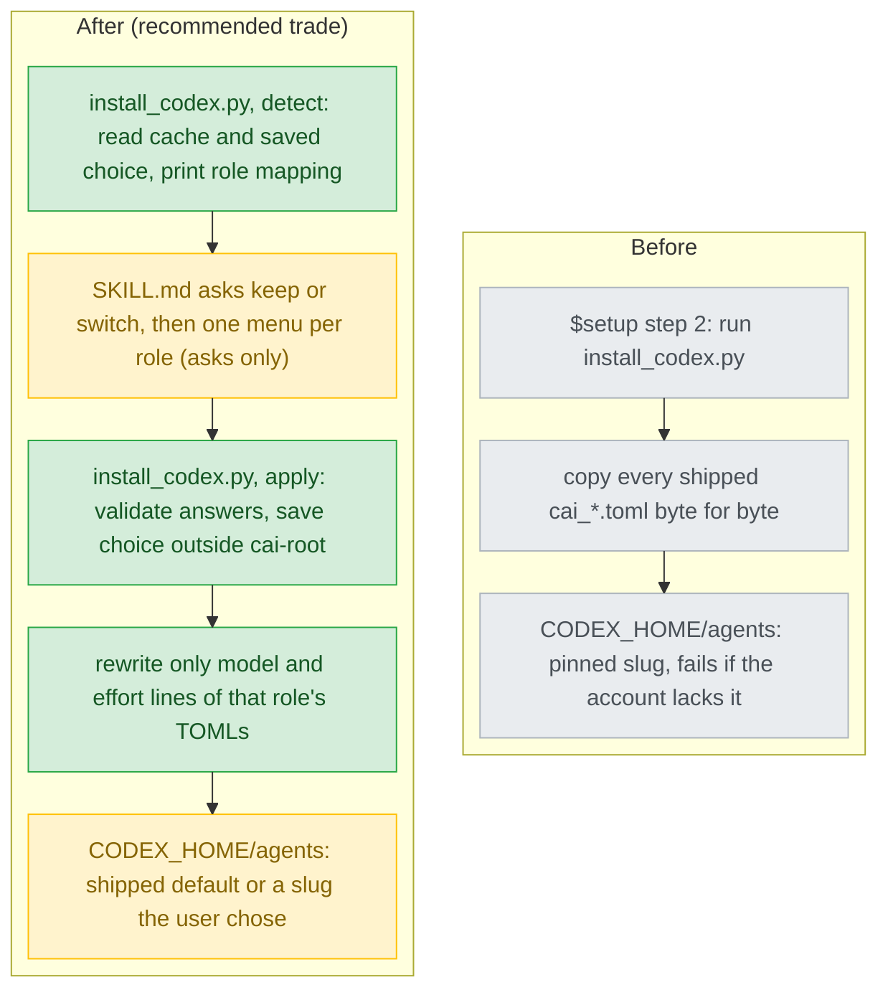

# codex-model-fallback — stance

Inputs: `.claude/track/codex-model-fallback/intake.md` (approved, Codex only, AC1-AC9), parent stance `docs/design/2026-09-18-codex-support-stance.md` (approved 2026-09-18). The trade below was chosen by the person on 2026-09-22 ("A. 寫在 installer (Recommended)", `.claude/track/codex-model-fallback/options-design-2.md`); the rejected list holds the alternative it was weighed against.

## Status

approved 2026-09-22

## Optimises for

Every model a cai agent runs on is one the user chose or the shipped default, and that is enforced by a tested program: `install_codex.py` detects, validates, saves and rewrites; `$setup`'s prose only asks and passes the answers on. Success is checkable: every rule in AC1-AC7 about what gets written or saved is a `tests/test_codex_install.py` case that CI runs on Linux (`CLAUDE.md`, "Platform coverage"). That setup actually shows the mapping and asks (AC1, AC2) stays in prose, checked only by a live Codex run.

## Sacrifices

- **The parent stance's "lowest hand-written cost"** (`2026-09-18-codex-support-stance.md:11`): the hand-written installer grows from copying TOMLs byte for byte (`install_codex.py:93-106`) to a detect / apply contract with its own input format.
- **A zero-touch setup.** Every `$setup` stops for a keep/switch answer, even when nothing changed (intake AC1).
- **cai's cost tiering as a guarantee.** A user may put `chore` on the most expensive model; cai shows its default and does not refuse.
- **Byte-identity of installed agents.** A switched role's installed `cai_*.toml` differs from the shipped one, where today every installed file is a copy (`install_codex.py:105`).
- **Assumption, not tested: the detection source is right.** `models_cache.json` is not a documented interface (F1 below). A restricted account's cache was never seen, so whether it omits a model the account cannot use is UNVERIFIED; if it lists one anyway, the user is offered it and finds out at dispatch.
- **Assumption, not asked: effort follows the role** (AC5 was a default). On a model whose `supported_reasoning_levels` lacks the role's level, the lower level is used without asking. Every listed model in this cache supports low, medium and high (`C:/Users/millerlai/.codex/models_cache.json:452-464` for luna), so today this path is reached only by a future model.

## Invariants

**This system's:**

- M1 — No installed `cai_*.toml` names a slug nobody chose: its `model =` is the shipped one, or one the user picked from a detection or typed in a `$setup` run (AC2, AC6).
- M2 — A role with no saved choice leaves its installed TOMLs byte-identical to the shipped ones (AC1, AC2).
- M3 — Only the `model =` and `model_reasoning_effort =` lines may differ from the shipped file. Line 1's `# cai-codex-version:` stamp is never touched, because the launcher's pre-dispatch check reads exactly that line (`plugins/cai-codex/scripts/launcher.py:29`, `:97-100`).
- M4 — A typed slug reaches a TOML only after passing a fixed character set, and is rejected otherwise (AC7).
- M5 — The installer never prompts. Every question is asked by `skills/setup/SKILL.md`; the installer takes the answers as input and is deterministic given them and the detection source (intake, open item e).
- M6 — Every rule that decides what gets written (M1-M4, AC4's re-ask set, AC5's effort fallback) lives in `install_codex.py` and has a `tests/test_codex_install.py` case. None lives only in `SKILL.md` prose.
- M7 — The saved choice lives outside `<cai-root>` and outside every file the installer rewrites wholesale, so a plugin update cannot erase it (AC3).

**Cross-project:**

- The parent stance's I1 (`plugins/cai/` unchanged), I2 (hand-written files listed, `scripts/gen-codex.py:77-83`), I4 (no Codex claim beyond its verified status) and I8 (subagents never ask) — `2026-09-18-codex-support-stance.md:25-32`.
- `CLAUDE.md`, "Who a file is for": `install_codex.py` is Theirs, so it may not read `scripts/codex-models.json` (Ours, not shipped); cai's defaults are the shipped TOMLs' own `model =` lines (`plugins/cai-codex/agents/cai_explorer.toml:4`).
- The user's rule files as imported by `CLAUDE.md`; CI observes only Linux `validate.py` and `pytest`; no BOM in any written file; an output change ships with `gen-codex.py --release` (`CLAUDE.md`, "Who a file is for"; AC8).

## Rejected stances

- **Prose owns the choice (lowest hand-written cost).** `SKILL.md` reads the cache, builds the menus and writes the saved file; the installer only applies it. This keeps the parent stance's optimisation, but M1, M4 and AC4 would live in model-read prose that no test runs, so a silent miss surfaces only on a user's machine. It loses on "enforced by a tested program" — offered as option B and not chosen (`options-design-2.md`).
- **The installer asks on its own stdin.** It would keep every rule in one program, but whether Codex's command tool feeds stdin to a running script is UNVERIFIED, and it would bypass `request_user_input`, the one menu path observed working (`plugins/cai-codex/README.md:77`). It breaks M5.
- **Leave installed TOMLs untouched and override the model somewhere else.** No other per-agent model lever is verified; the TOML's `model` is the only one observed to apply (`README.md:78`).
- **Pick for the user when the default is missing.** Superseded by the person's redirect (intake, "Decisions taken by the person": switching is only the user's own choice).

## Use cases / Issues

- UC1 — Keep, nothing saved: setup prints each role, its agents and model/effort, the user keeps, and every installed TOML equals the shipped one byte for byte. Works when: AC1's test passes.
- UC2 — Switch per role: one question each for chore, build, think, offering only detected slugs, the current one marked. Works when: AC2's test finds the chosen slug in every TOML on that role and an untouched role byte-identical.
- UC3 — Survive an update: after a new cai-codex version, `$setup` shows the saved choice as in effect and keep re-applies it. Works when: AC3's test re-runs the installer against a fresh `<cai-root>`.
- UC4 — A saved slug disappears from a later detection: only that role is asked again. Works when: AC4's test.
- UC5 — Detection fails (missing, unparsable, no slugs): setup names the reason, reuses a saved choice, else offers keep or a typed name with a warning. Works when: AC6 and AC7's tests.
- R1 — An account that cannot use a pinned slug fails every agent on that role, with no way out but editing installed files by hand (`scripts/codex-models.json:9-10`).
- R2 — C19's evidence is stale: `docs/design/2026-09-18-codex-support-decisions.md:46` cites a three-model list; the cache now lists seven slugs, two hidden (F2 below). AC9's README row replaces it.

Findings the sacrifices above rest on (F-ids, so they do not collide with the parent C-ids; Decisions mode re-settles them in its feasibility table):

- F1 — `models_cache.json` is a documented interface: UNVERIFIED. Not found at https://learn.chatgpt.com/docs/config-file/environment-variables or .../config-basic (doc fetch 2026-09-22). Whether it follows `CODEX_HOME` is therefore inferred only from C15 (`CODEX_HOME` "sets the root for Codex state", re-quoted unchanged 2026-09-22). A documented alternative exists: https://learn.chatgpt.com/docs/developer-commands?surface=cli, `codex debug models`: "Print the raw model catalog Codex sees, including an option to inspect only the bundled catalog". Whether its output is per-account is UNVERIFIED. Which source to read is Decisions work (intake item a); if the cache moves or changes shape, detection fails into UC5, never into a wrong write (M1).
- F2 — cache shape, observed (codex-cli 0.155.1, `CODEX_HOME` unset, fetched 2026-09-19T17:20:41Z): top-level `fetched_at`, `etag`, `client_version`, `identity`, `models` (`models_cache.json:2-4`); listed `gpt-5.6-sol` (:8), `gpt-6-astra` (:134), `gpt-5.6-terra` (:353), `gpt-5.6-luna` (:448), `gpt-5.5` (:539, with an `upgrade`); hidden `gpt-reserve` (:262, `"visibility": "hide"` at :289) and `codex-auto-review` (:619).

## Overview

What to look at: the green boxes are all inside `install_codex.py` (M6); the one amber box that talks to the user, `SKILL.md`, holds no rule about what gets written (M5). Under rejected option B, A1, A3 and A4's rules would move into that amber box.

## Out of scope

- Claude Code's `/cai:setup` (follow-up issue, intake "Follow-up issue").
- Left to Decisions, not this stance: the answers format between `SKILL.md` and the installer; the saved file's path and format; `visibility: hide` handling (intake b); re-tiered defaults (intake d); the typed-name character set.
- For Decisions to weigh, found while reading intake item c: `~/.codex/cai/` is fixed under the real home and never follows `CODEX_HOME` (`install_codex.py:12-13`, `:83`, `:290`), while agents are written under `CODEX_HOME` (`:98`, `:291`, `:305`). A choice saved beside the launcher is therefore shared by every `CODEX_HOME` on the machine — including one per account — while the agents it rewrites are not.
- Checking, between setups, that an installed slug is still offered: a slug that disappears is noticed only at the next `$setup`. Accepted by the person ("A. 寫進說明 (Recommended)", `.claude/track/codex-model-fallback/options-design-3.md`): the README and setup's report say to re-run `$setup` when an agent fails to dispatch on a model error. It rests on Codex failing loudly on an unavailable model (UNVERIFIED); veto: evidence that it fails silently or falls back to another model moves the check into the launcher's pre-dispatch step, as G3 did for version drift (`2026-09-18-codex-support-decisions.md:67`).
- `docs/` is git-ignored; this file needs `git add -f` at ship.
