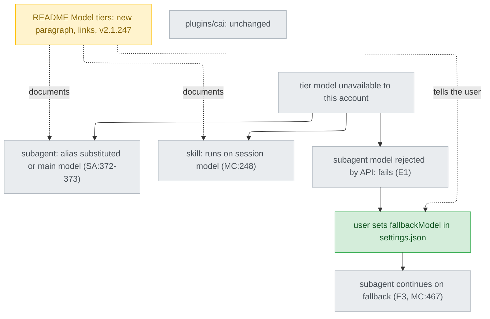

# model-fallback-readme — stance

Inputs: `.claude/track/setup-role-model-switch/intake.md` (issue #117) and `discover/findings.md`, whose AC1-AC5 supersede intake's AC1-AC8. The trade below was chosen by the person on 2026-09-22 — "甲 只寫文件 (Recommended)" (`options-discover-2.md`); rejected list holds what it was weighed against. Doc quotes are from snapshots fetched 2026-09-22 under `discover/raw/docs/`, each the markdown of `https://code.claude.com/docs/en/<name>.md`; `MC` = model-config, `SA` = sub-agents.

## Status

approved 2026-09-22

## Optimises for

A cai user whose account cannot run a tier's model learns from the root `README.md` what Claude Code already does about it and how to close the one gap left, without cai shipping any new code. Success: the Model tiers section (`README.md:389-418`) carries that paragraph, every claim in it traceable to a doc sentence, and `plugins/cai/` is byte-identical to `main`.

## Sacrifices

- **No per-role model switching in cai.** A user who wants `think` on something other than `opus` still has no cai command for it.
- **The remedy is the user's own step.** Nothing sets `fallbackModel` for them; a user who never reads the README keeps E1's failure (`discover/raw/exp1/log.json:29`, `model_not_found, HTTP 404`).
- **A global remedy for a cai problem.** `fallbackModel` applies to every Claude Code session, not only cai's agents (MC:450, "To persist a chain across sessions, set `fallbackModel` in settings").
- **Assumption, not tested: an account lacking a model is rejected like a retired ID.** E1-E3 used a retired ID. Fallback "never" triggers on "Authentication, billing, rate-limit ... errors, and a denial by your organization's policy check" (MC:440); if entitlement rejections land there, the README's remedy does not cover the case #117 was filed for. UNVERIFIED.
- **Assumption, not tested: organisation restriction and non-Anthropic providers.** Whether subagent frontmatter is substituted under an Enterprise restriction is not stated (SA:370 names only `availableModels`); Bedrock, Vertex and Foundry were not run. UNVERIFIED.

## Invariants

**This system's:**

- N1 — Nothing under `plugins/` changes: setup keeps `model: haiku` (`plugins/cai/skills/setup/SKILL.md:4`), `plugins/cai/models.json` keeps its tiers (`:26,30,34`) and setup's assignment (`:43`), version stays `1.28.0` (`plugins/cai/.claude-plugin/plugin.json:3`), no `gen-codex.py --release`. `plugins/cai-codex/README.md` is out of reach too (findings, landmine 6).
- N2 — The README states only what a doc sentence guarantees, each with its link. Allowed: a subagent alias blocked by `availableModels` moves to the newest permitted version or to the main model (SA:372-373); a blocked skill model is ignored for the session model (MC:248); Haiku cannot be disabled by an organisation (MC:359) — scoped to the Anthropic API and LLM gateway, the only places organisation restrictions reach (MC:362).
- N3 — The remedy is described by what the docs say it covers: "overloaded, unavailable, or ... another non-retryable server error" (MC:440). The README never says fallback rescues an account without access (findings, landmine 4).
- N4 — The README names the minimum Claude Code version, v2.1.247 ("Before v2.1.247, a failure the chain covers ended the subagent instead", MC:467), which also satisfies v2.1.222 (SA:372).
- N5 — `fallbackModel`'s scope is stated with it: every session, only on a failed request, for the current turn only (MC:442), and invisible in `/status` (MC:460).
- N6 — Only the root `README.md` is edited. It is Ours: `.claude-plugin/marketplace.json:11` ships `./plugins/cai` alone.

**Cross-project:**

- `CLAUDE.md`, "Who a file is for" and "Before pushing" (`validate.py` and `pytest` green, no BOM), and the rule files it imports.
- The Codex sibling's stance, `docs/design/2026-09-22-codex-model-fallback-stance.md`, is not reopened by this one.

## Rejected stances

- **A / 丙 — cai rewrites the installed copy per role.** Feasible (E1: full IDs apply, edits are not reverted), but a pinned full ID that retires becomes E1's 404, a failure alias-only never had; it also rests on the undocumented `~/.claude/cache/model-catalog/` (findings D11). Loses on "no new cai code" and adds a failure — offered as 丙, not chosen.
- **乙 — README plus `/cai:setup` offering to write `fallbackModel`.** Reaches users who skip the README, but ships a script, a version bump and a global-settings write from a cai command. Breaks N1 — offered, not chosen.
- **B — remap aliases with `ANTHROPIC_DEFAULT_{HAIKU,SONNET,OPUS}_MODEL`.** Rejected by the person at intake Q1; MC:61 names these variables as the way "to pin to a specific version", which reintroduces pinning for every session.

## Use cases / Issues

- R1 — The README says nothing about what happens when a tier's model is unavailable (`README.md:389-418`). Gone when: the new paragraph covers subagent substitution, skill fallback and the Haiku guarantee, each linked, with v2.1.247 (AC1; N2, N4).
- R2 — The one remaining failure has no documented way out. Gone when: the same paragraph names it (subagent model rejected by the API), gives a `fallbackModel` example for `~/.claude/settings.json`, and states N5's scope (AC2; N3, N5).
- UC1 — `plugins/cai/` stays as shipped. Works when: `git diff main -- plugins/` is empty (AC3; N1).
- UC2 — The repo still validates. Works when: `python scripts/validate.py` and `python -m pytest` exit 0 (AC4).
- UC3 — #117 carries the discover evidence. Works when: `ticket.py project` has posted it; closing is asked at Gate 2 (AC5).

## Overview

What to look at: the only amber box is the README and the only green one is a step the user takes; every behaviour box is grey because Claude Code already does it, and `plugins/cai` has no arrow in or out (N1).

## Out of scope

- The Codex README and `$setup` (handled by #115's stance).
- Closing #117: asked at ship's Gate 2 (AC5).
- Veto on this stance: evidence that an account-entitlement rejection is an auth or policy-class error fallback skips (MC:440) means R2's remedy does not reach #117's case; that reopens the trade toward 乙 or 丙 rather than being patched in wording.
- Left to build: the paragraph's wording, placement and `fallbackModel` example values (entries accept an alias, MC:458).
- `docs/` is git-ignored; this file needs `git add -f` at ship.
