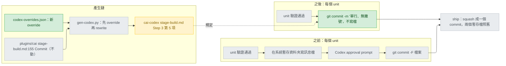

# codex-commit-message-prompts — stance

輸入：`.claude/track/codex-commit-message-prompts/intake.md`（issue #123，AC1-AC4）。取捨本身已由使用者在 intake 選定：「A 單行 -m (Recommended)」（`options-intake.md`）；ship 的兩個暫存檔不在範圍內。那句話落在哪一邊，已由使用者於 2026-09-23 在 Q1 選定「(b) 只加 Codex override (Recommended)」（見 N3，`options-placement.md`）。

## Status

approved 2026-09-23

## Optimises for

在 Codex 上跑 `$track` 的 build 並選 commit per unit 時，提交一個 unit 不必在 workspace 外寫任何檔，所以訊息檔引起的 approval prompt 為 0 次；改動只有一句程序文字加一個測試。成功的判準：生成的 `plugins/cai-codex/skills/track/references/stage-build.md` Step 3 第 5 項寫出這個做法，且有測試斷言（AC1）。

## Sacrifices

- **per-unit commit 只剩標題，沒有內文。** ship Step 4 起草最終訊息時讀的是 `git log <BASE>..HEAD --pretty=format:'%h %s%n%b'`（`plugins/cai/skills/track/references/stage-ship.md:98`），之後只剩標題、diff stat 與設計文件可用；main 上的歷史不變，因為 ship 會 `git reset --soft <BASE>` 壓成一個（`stage-ship.md:113`）。
- **per-unit 標題不能含撇號。** bash 與 PowerShell 跳脫撇號的方式不同；ship 的 PR 標題已有同一限制（`scripts/codex-overrides.json:206`）。
- **ship 的兩個暫存檔照舊會問。** `cai-commit-msg.txt`、`cai-pr-body.md` 仍寫在系統暫存資料夾（`scripts/codex-overrides.json:186,203`），每條 track 約 2 次 prompt。
- **假設，未測：`git commit` 本身（寫 workspace 內的 `.git`）在 macOS Codex 上不另跳 prompt**（`intake.md:44`）。若不成立，本改動只解一半；只有 AC4 的手動回報驗得到。UNVERIFIED。
- **假設，未測：model 會照 stage 程序的這一句，而不是 git skill 的一般建議。** git skill 說多行訊息寫檔、單行用單引號 `-m`（`plugins/cai-codex/skills/git/SKILL.md:13`）；這句把 per-unit 訊息限定為單行，兩者不衝突，但 model 是否照做只有 AC4 驗得到。UNVERIFIED。

## Invariants

**This system's:**

- N1 — 提交一個 unit 不寫訊息檔：只用一個單引號包住的單行 `git commit -m '<type(scope): summary>'`，標題不含撇號（使用者在 intake 的選擇），也不含反引號與 `$`（允許它們的寫法違反下方使用者全域規則，依 conflict test 刪除，不另權衡）。
- N2 — ship 的 Codex override（`scripts/codex-overrides.json:176-210`）一字不動（intake 決定，範圍外）。
- N3 — `plugins/cai/` 不變（Q1 於 2026-09-23 答 (b)）：`git diff main -- plugins/cai/` 為空，Claude Code 的 build/ship 行為逐字不變（AC2），不 bump `plugins/cai/.claude-plugin/plugin.json:3`（`1.28.2`）。這句以新 override 進 `scripts/codex-overrides.json`，anchor 為 `plugins/cai/skills/track/references/stage-build.md:155-156` 整句；該處目前無任何 override（現有三條在 `:3-5`、`:8-9`、`:127`，`scripts/codex-overrides.json:20-34,420-439`），也不被 `docs/rule-provenance.md` 引用（該檔只引 Step 1、Step 4、Step 6，`:25,77,84`）。
- N4 — 生成的句子只講做法，不宣稱 Codex 的 sandbox 行為；理由寫在 override 的 `why` 欄（Ours）。這是 codex-support stance I4 的直接套用。
- N5 — 解法是程序文字，不是叫使用者關 approval 或改 Codex 設定；codex-support stance 假設使用者保持 sandbox 與 approval 開著（`docs/design/2026-09-18-codex-support-stance.md:18`）。
- N6 — cai-codex 輸出一變就 `python scripts/gen-codex.py --release 0.2.4`（現為 `0.2.3`，`scripts/codex-release.json:2`），否則 `validate.py` 報 DRIFT/UNRELEASED（`scripts/gen-codex.py:681,684`）。

**Cross-project:**

- 專案 `CLAUDE.md` 的「Who a file is for」（cai-codex 由產生器生成、不手改）與「Before pushing」（`validate.py`、`pytest` 全綠、無 BOM）。
- codex-support stance 的 I2、I3、I4（`docs/design/2026-09-18-codex-support-stance.md:26-28`）：單一來源、override 錨定原句、不宣稱未驗證的 Codex 行為。
- 使用者全域 `CLAUDE.md` 的 Environment：Bash 不用 heredoc，`-m` 不帶反引號或 `$`。

## Rejected stances

- **B — build 與 ship 的訊息檔都改放專案內、被 git 忽略的固定位置。** 能把 ship 的 prompt 也消掉，但無 track 時放哪要另做決定，專案沒忽略該處時留下的檔會卡住 ship 的乾淨工作樹檢查；使用者在 intake 選 A 而非 B（`options-intake.md`）。
- **C — 只在 cai-codex README 教使用者改設定。** 沒改設定的使用者照樣每個 unit 被問，與 issue 的預期相反；相關設定鍵也查無文件。
- **(a) 把這句寫進 `plugins/cai/skills/track/references/stage-build.md` 本身，兩個平台都拿到。** 單一來源、不多一條 override，也可能讓在 Claude Code 上寫暫存檔的使用者少一次 prompt；代價是 Claude Code 的 per-unit 內文一併消失（`stage-ship.md:98` 讀不到）、要 bump plugin 版本，而 Claude Code 側沒有任何回報。使用者於 2026-09-23 在 Q1 選 (b)，否決此項。

## Use cases / Issues

- R1 — Codex 上 build 的每個 per-unit commit 都為訊息檔跳一次 approval（`intake.md:11`），因為程序只寫「**Commit**」、沒指定方法（`plugins/cai-codex/skills/track/references/stage-build.md:160`）。消除的判準：生成檔 Step 3 第 5 項寫出單行 `-m`、不寫訊息檔，且測試斷言（AC1）；回報者在 macOS Codex 實跑 0 次（AC4，手動）。
- UC1 — Claude Code 的 build/ship 不退化（AC2）：依 N3，`git diff main -- plugins/cai/` 為空。
- UC2 — repo 仍驗證通過（AC3）：`python scripts/validate.py` 與 `python -m pytest` exit 0，cai-codex 已 release。
- UC3 — Codex 的 ship 照舊以暫存檔提交與開 PR（N2）：`test_every_shipped_override_matches_the_real_source_file`（`tests/test_gen_codex.py:138-159`）仍通過。

## Overview

看哪裡：綠色只有兩個，一條 override 與不寫檔的 `-m`；`plugins/cai` 那格是灰的（N3）。「之前」那條路的 prompt 格在「之後」消失，而兩條路都匯進同一個 ship，所以 main 上的結果不變，變的只是 build 期間被問幾次。

## Out of scope

- ship 的兩個暫存檔（intake 決定）；git skill 第 13 行與 bash guard 的 `REWRITE` 提示（`plugins/cai-codex/scripts/bash_guard.py:23-28`）照舊，`$git` 單獨提交多行訊息時仍可能寫檔。
- 否決條件：若 AC4 顯示 `git commit` 本身在 Codex 上也跳 prompt，問題在 commit 指令而非訊息檔，這份取捨重開，不在措辭上補。
- 留給 build（單一 unit，先寫會 fail 的測試）：在 `tests/test_gen_codex.py` 仿 `:498-524` 用 `--source` 真樹生成到 `tmp_path`，斷言生成的 `stage-build.md` 在 `5. **Commit**` 到 `**Never leave the tree` 之間含 `git commit -m '` 與 `no message file`、且不含 `-F`；再加 override、`python scripts/gen-codex.py`、`--release 0.2.4`。Verify with：`python -m pytest tests/test_gen_codex.py -q`，接著 `python scripts/validate.py`；收尾跑完整 `python -m pytest`。句子措辭與測試函式名稱屬 build。新句子不得含 `DENY_LIST` 字樣（`scripts/gen-codex.py:120-128`）。
- `docs/` 被 git 忽略；本檔要進 repo 需在 ship 時 `git add -f`。
