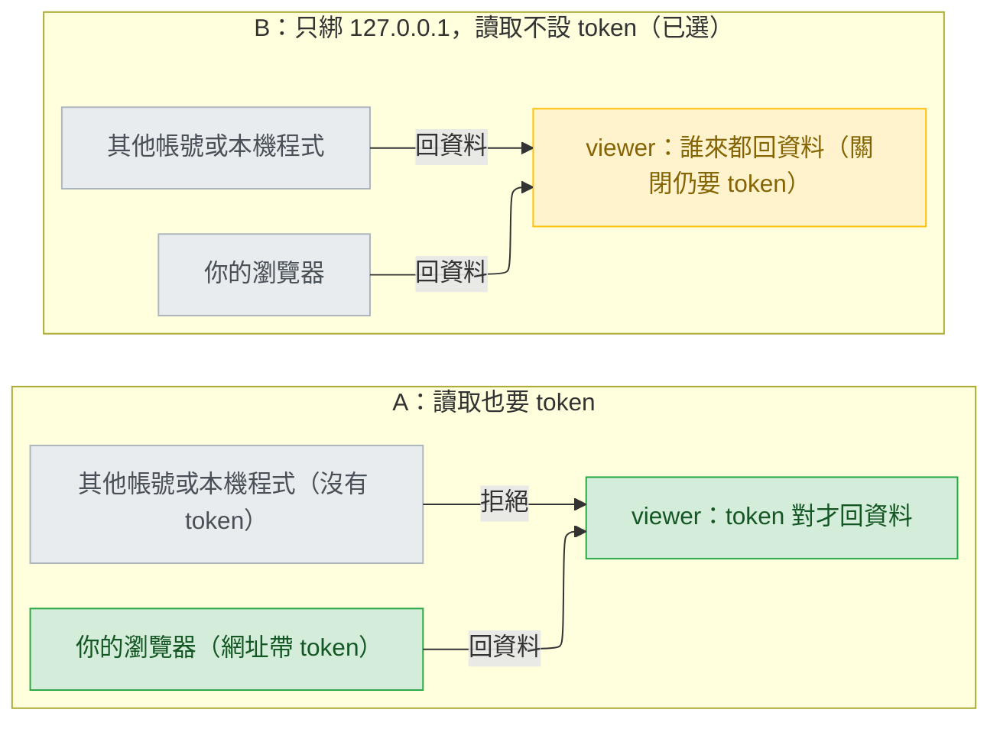
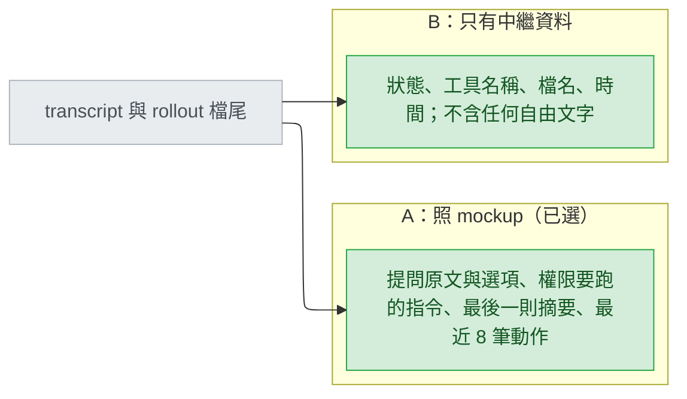
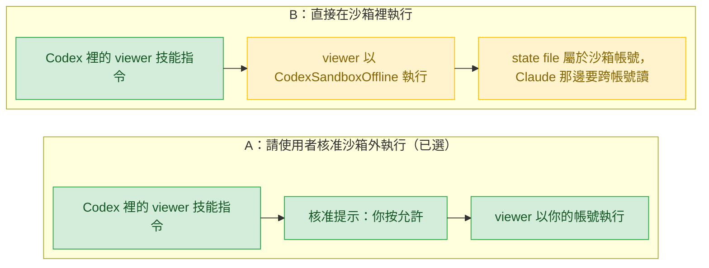

# agent-viewer-web-portal — decisions

## Reference

- Stance: `docs/design/2026-09-25-agent-viewer-web-portal-stance.md` — status: approved 2026-09-25
- 其他輸入：`.claude/track/agent-viewer-web-portal/intake.md`、`discover.md`、`discover-evidence.md`、`mockup.html`、`options-intake-*.md`；使用者看到的 Tier 1 與缺口選項原文：`options-D1.md`、`options-D2.md`、`options-D3.md`、`options-G1.md`、`options-G2.md`、`options-G3.md`（答案照這些檔的文字解讀）。
- 建置規格：`docs/design/2026-09-25-agent-viewer-web-portal-detail.md`。
- 用詞：登記檔（registry，`~/.claude/sessions/<pid>.json`）；對話紀錄（transcript）；Codex 紀錄檔（rollout）；權杖（token，每次啟動隨機產生、只有擁有者拿得到的一串字）；行程建立時間（procStart）；沙箱（sandbox，Codex 替模型執行指令時用的受限帳號 CodexSandboxOffline）；預寫日誌模式（WAL，sqlite 讓讀者不擋寫者的模式）；同源政策（same-origin policy，瀏覽器不讓一個網站讀另一個網站回應的規則）。

## Feasibility

| Id | Capability | Verdict | Evidence |
|---|---|---|---|
| C1 | 讀 Claude 登記檔，欄位有 `pid`、`procStart`、`sessionId`、`cwd`、`status`、`statusUpdatedAt`、`kind`、`name`、`pidDomain`；同目錄另有 `*.key` 檔 | verified | `discover-evidence.md:6-20`；`C:\Users\millerlai\.claude\sessions\45224.json:1`（2026-09-25 讀取：`procStart` 是字串 `"134348104489533736"`、`pidDomain` 是 `"win32:desktop-1c4jlj0"`）；目錄列表見到 `45224.<hex>.key` 等 6 個 `.key` 檔 |
| C2 | 登記檔的 `waitingFor` 與 `claude agents --json` 用同一組值 | UNVERIFIED | 文件只描述 `--json`：「`permission prompt` for an approval, `input needed` for a question from Claude or an MCP server's input request, `sandbox request`, `worker request`, or `dialog open`」（https://code.claude.com/docs/en/agent-view.md ，經子代理擷取）；登記檔只觀察到 `input needed`（`stance.md:17`） |
| C3 | Windows 不送 signal 判斷存活：`OpenProcess(PROCESS_QUERY_LIMITED_INFORMATION)` 加 `GetProcessTimes` 取建立時間，比對 `procStart` | verified | GetProcessTimes：「receives the creation time of the process」「The handle must have the PROCESS_QUERY_INFORMATION or PROCESS_QUERY_LIMITED_INFORMATION access right」（https://learn.microsoft.com/en-us/windows/win32/api/processthreadsapi/nf-processthreadsapi-getprocesstimes ）；OpenProcess：「If the function fails, the return value is NULL.」（https://learn.microsoft.com/en-us/windows/win32/api/processthreadsapi/nf-processthreadsapi-openprocess ）；`procStart` 與行程建立時間逐位相符（`discover-evidence.md:18`） |
| C4 | Linux 讀 `/proc/<pid>/stat` 第 22 欄取開機後的啟動時間 | verified | 「The time the process started after system boot. ... Since Linux 2.6, the value is expressed in clock ticks (divide by sysconf(_SC_CLK_TCK)).」（https://man7.org/linux/man-pages/man5/proc_pid_stat.5.html ） |
| C5 | Claude 在 Linux 上 `procStart` 的格式 | UNVERIFIED | 本機測不了（`discover.md:41`） |
| C6 | Windows 以 stdlib 的 ctypes 依執行檔名列舉行程 | verified | TH32CS_SNAPPROCESS「Includes all processes in the system in the snapshot.」（https://learn.microsoft.com/en-us/windows/win32/api/tlhelp32/nf-tlhelp32-createtoolhelp32snapshot ）；`szExeFile`「The name of the executable file for the process.」（https://learn.microsoft.com/en-us/windows/win32/api/tlhelp32/ns-tlhelp32-processentry32w ） |
| C7 | Linux 掃 `/proc` 依名稱列舉行程 | UNVERIFIED | 沒有取文件；規則出自 `discover.md:22` |
| C8 | 以唯讀開啟 Codex 的 sqlite，且不擋 Codex 寫入 | verified | `mode=ro`「determines if the new database is opened read-only」（https://www.sqlite.org/uri.html ）；「readers do not block writers and a writer does not block readers」，唯讀讀 WAL 自 3.22.0 起可行（https://www.sqlite.org/wal.html ）；`~/.codex/state_5.sqlite-wal`、`thread_history_1.sqlite-wal` 存在（2026-09-25 列目錄）；沙箱帳號唯讀開啟成功（`discover-evidence.md:34`） |
| C9 | Codex 的 `thread_turns.status`、`threads` 欄位、rollout 的提問與一輪結束形狀 | verified | `discover-evidence.md:43-51`；rollout 每行是 `type` 加 `payload.type`（與 `payload.name`）：`probe/monitor.py:58-59`，實際值 `response_item/function_call:request_user_input_async`、`response_item/function_call_output`、`event_msg/task_started`、`event_msg/task_complete`（`probe/monitor-log.jsonl:4-33`） |
| C10 | Windows 上切斷關係的背景行程在發起端結束後存活 | verified | 四種啟動方式都存活（`discover-evidence.md:24-31`）；旗標語意：DETACHED_PROCESS「will not inherit its parent's console」、CREATE_BREAKAWAY_FROM_JOB「is not associated with the job」（https://docs.python.org/3/library/subprocess.html ） |
| C11 | Linux 上 `start_new_session=True` 起的行程在發起端結束後存活 | UNVERIFIED | 文件只保證「the setsid() system call will be made in the child process」（https://docs.python.org/3/library/subprocess.html ）；存活本機測不了（`discover.md:41`） |
| C12 | Codex 經使用者核准在沙箱外執行的指令，以本人帳號執行 | UNVERIFIED | 核准的做法有先例（`plugins/cai-codex/skills/models/SKILL.md:69-70`）；帳號是本人屬假設（`discover.md:39`）；Codex 文件查無相關句子（2026-09-25，子代理查 learn.chatgpt.com 的 security、windows-sandbox 頁） |
| C13 | 沙箱帳號能開 127.0.0.1 port、讀 `~/.claude` 與 `~/.codex`，與本人看到同一個暫存目錄 | verified | `discover-evidence.md:31-35` |
| C14 | 同機另一個帳號連得到某帳號開的 127.0.0.1 port | verified | 主 session 2026-09-25 實測（方向：沙箱帳號開、本人連）：`codex sandbox -c windows.sandbox="elevated" -c sandbox_mode="workspace-write" python probe/probe_serve.py` 在 127.0.0.1:7799 開 port，擁有者 CodexSandboxOffline（pid 45344），以 millerlai 執行 `urllib.request.urlopen` 取回頁面；同時關閉 `discover.md:40` 列的「瀏覽器連沙箱帳號的 port」 |
| C15 | 同機其他一般帳號讀不到本人的 `~/.claude` | verified | 本機 `icacls C:\Users\millerlai\.claude`（主 session 2026-09-25，結果也寫在使用者看到的 `.claude/track/agent-viewer-web-portal/options-D1.md:3`）：只有 CodexSandboxUsers:(OI)(CI)(RX)、SYSTEM (F)、Administrators (F)、millerlai (F)；本機啟用中的其他一般帳號 DevToolsUser、defaultuser0 不在清單上。只證本機，不證其他使用者的機器 |
| C16 | state file 只有擁有者讀得到 | UNVERIFIED | Windows 暫存目錄在使用者目錄下，但沙箱帳號看到同一路徑且可寫（`discover-evidence.md:35`）；POSIX：`os.open` 的 mode「the current umask value is first masked out」（https://docs.python.org/3/library/os.html#os.open ），只保證不比 mode 寬；Windows：`os.chmod`「you can only set the file's read-only flag」（同頁） |
| C17 | cai 對應的輸入：ledger 的 `session_id` 來自 `CLAUDE_CODE_SESSION_ID`，Codex 永遠是空；`format_status` 以 `"."` 找專案 | verified | `plugins/cai/scripts/ledger.py:236-251`、`usage_collector.py:65-68`、`scripts/codex-overrides.json:645-651`、`plugins/cai/scripts/track_state.py:135` |
| C18 | gen-codex 對每個產出檔（含 `.py`）掃 DENY_LIST，並改寫 `${CLAUDE_PLUGIN_ROOT}`、`/cai:` 與反引號裡的 agent 名稱 | verified | `scripts/gen-codex.py:126-134`、`:267-282`、`:285-313`、`:659` |
| C19 | 由 `cwd` 與 `sessionId` 算出 transcript 路徑，config 目錄尊重 `CLAUDE_CONFIG_DIR`；Codex 產出的同一檔照樣保留這兩個函式 | verified | `plugins/cai/scripts/usage_collector.py:48-49`、`:71-83`；`plugins/cai-codex/scripts/usage_collector.py:48-49`、`:72` |
| C20 | stdlib 開 127.0.0.1 的 HTTP port | verified | 探針開了 127.0.0.1 port（`discover-evidence.md:24`、`:28-31`）；ThreadingHTTPServer「uses threads to handle requests」「useful to handle web browsers pre-opening sockets」（https://docs.python.org/3/library/http.server.html ） |
| C21 | `codex exec` 不會停下來等人 | verified | `codex exec --help` 第 1 行「Run Codex non-interactively」（主 session 2026-09-25 執行，引用於 `.claude/track/agent-viewer-web-portal/options-G3.md:3`） |
| C22 | 同一 port 不會被第二個行程靜默共用 | verified | `allow_reuse_address`「This defaults to False, and can be set in subclasses to change the policy」（https://docs.python.org/3/library/socketserver.html ）；SO_REUSEADDR「allows a socket to forcibly bind to a port in use by another socket」（https://learn.microsoft.com/en-us/windows/win32/winsock/using-so-reuseaddr-and-so-exclusiveaddruse ） |
| C23 | 瀏覽器要使用者先操作過頁面才能出聲 | verified | 「If an `AudioContext` is created before the document receives a user gesture, it will be created in the 'suspended' state, and you will need to call `resume()` after the user gesture.」（https://developer.chrome.com/blog/autoplay ） |
| C24 | 瀏覽器的 localStorage 以主機加 port 為範圍 | verified | localStorage 屬於「the Document's origin」（https://developer.mozilla.org/en-US/docs/Web/API/Window/localStorage ）；origin 由「protocol, port (if specified), and host」決定（https://developer.mozilla.org/en-US/docs/Web/Security/Same-origin_policy ） |
| C25 | 別的網站讀不到 127.0.0.1 頁面的回應（沒有 CORS 標頭時） | verified | 「Cross-origin reads are typically disallowed」（https://developer.mozilla.org/en-US/docs/Web/Security/Same-origin_policy ）；DNS rebinding 繞過這一條，由 V3 的 Host 檢查擋（`stance.md:28`） |

## Ruled out

| Option | Invariant it violates | Evidence |
|---|---|---|
| 以 `os.kill(pid, 0)` 判斷存活 | V2：Windows 上等於對行程群組送 Ctrl+C | `stance.md:27`；`discover.md:22` |
| 用 psutil 判斷存活或列舉行程 | Cross-project：出貨腳本零相依，不替使用者裝套件 | `plugins/cai/scripts/track_state.py:2`；`plugins/cai/rules/workflow.md:21` |
| Codex 版 `viewer.py` 手寫一份 | V5：一支腳本服務兩平台，由 gen-codex 產生 | `stance.md:30` |
| 放寬 DENY_LIST，或讓 viewer 以外的檔案豁免 | Cross-project：DENY_LIST 對 viewer 以外每個產出檔照舊生效 | `stance.md:37`；C18 |
| 用 hook 取得 Codex 的權限等待 | V1：兩平台 hook 設定不改 | `stance.md:26` |
| 把 Codex 的 sqlite 複製一份再讀 | V1：唯一會寫的是 state file | `stance.md:26`；C8 |
| Linux 上照猜的格式比對 `procStart`，不符就判為已結束 | V4：讀不懂的不得歸入確定狀態；格式未知（C5） | `stance.md:29`；`discover.md:41` |
| 綁 0.0.0.0 或任何非回送位址 | V3 | `stance.md:28` |
| 另開一個鎖檔防止兩個實例同時啟動 | V1：唯一會寫的是 state file | `stance.md:26` |

## Requirement gaps

| # | The behavioural assumption | Veto condition, or verification path | Deletes |
|---|---|---|---|
| G1 | Codex 推斷的等權限（黃燈）響不響（`intake.md:42` 對 `mockup.html:553`；`stance.md:53` 對 `:108`）。賭的是使用者對「可能是假警報的聲音」的容忍度 | **已解**（使用者 2026-09-25 選「換一種音色響」，`options-G1.md`）。否決條件：「推斷的等權限用一種與確定狀態分得出來、較輕的聲音；頁面上有它自己的開關」。開關預設開：選項原文寫「多一個開關讓你關掉它」「改回不響只要關掉開關」（`options-G1.md` 第二個選項的欄位 3、5） | 刪「只亮不響」與「跟確定的一樣響」 |
| G2 | 「一輪做完」響不響（`mockup.html:231`、`:553`；`stance.md:108`）。賭的是做完的提醒是有用還是吵 | **已解**（使用者 2026-09-25 選「響，開關預設關」，`options-G2.md`）。否決條件：「一輪做完只在『完成時也響』開著時響單音『叮』；開關預設關，選擇記在這個瀏覽器」 | 刪「預設就響」與「不響也沒有開關」 |
| G3 | 不列 `codex exec`（`intake.md:31`、`:41`；`stance.md:52`）。賭的是使用者不想在表上看到非互動的批次執行 | **已解**（使用者 2026-09-25 選「不列」，`options-G3.md`）。否決條件：「表上只列可能停下來等人的主 session」；驗證路徑已走完：C21 | 刪「exec 也列成執行中的列」 |

**V7 在 G1、G2 之後的讀法（stance 未改；Gate 1 與 stance 一起簽）。** V7 寫「進入『需要你』時閃爍並響一次，不重複」（`stance.md:32`），G1、G2 讓它變窄，本文件把它讀成四句。（1）閃爍不變：每一個進入「需要你」的列都閃，直到按「已讀」或狀態再變。（2）聲音：每一次進入（一個新的「進入編號」，見 detail 的 `entryId`）最多響一次、不重複；只在「聲音」總開關與該聲音自己的開關都開著時才響。（3）每一種會響的聲音都關得掉：叮咚（提問、確定的等權限、等你處理、簽核）由總開關管；叮（一輪做完）由「完成時也響」管，預設關；嗒（Codex 推斷的等權限）由「推斷的等權限也響」管，預設開。（4）所以「進入需要你一定響一次」不再成立：一輪做完預設不響，這是使用者在 G2 的選擇，不是本文件的決定。

## Tier 1

### D1 — 同一台機器上，誰可以讀這個網頁？



看哪裡：兩邊只差左下那條箭頭——沒有 token 的其他帳號在 A 被擋、在 B 拿得到資料。

| Option | Rests on | What it costs | Fails when |
|---|---|---|---|
| A — 每次啟動產生隨機 token，印出的網址帶著它；頁面每次向 server 取資料都附上，缺了就拒絕；state file 存 token，只給擁有者讀 | C14、C16、C20 | 網址變長（`http://127.0.0.1:7788/#t=...`）；viewer 重啟後舊網址失效，要再下一次 `/cai:viewer` 取新網址；state file 權限要處理（C16 未驗證） | state file 被別人讀到（Windows 上沙箱帳號看得到同一個暫存目錄，C13，但它本來就讀得到 `~/.claude`） |
| B — 不設讀取 token，只靠綁 127.0.0.1 與 Host 檢查（V3）；token 只用在關閉，防惡意網頁跨站送關閉請求 | C14、C15、C20、C25 | 零額外成本 | 機器上有其他一般帳號，而它們原本讀不到你的 `~/.claude`：網頁成了它們讀你對話內容的新管道。本機屬實（C14、C15 皆已驗證：DevToolsUser、defaultuser0 原本讀不到，現在連得到網頁） |

- **Blast radius:** server 的每個端點、頁面取資料的方式、state file 的內容與權限、啟動時印出的網址；D2 的選項跟著變。
- **Found out when:** 有人在共用機器上讀到別人的畫面時；測試抓不到（屬「誰能做什麼」，`stage-design.md` 預設高）。
- **Undo cost:** B 改 A 要改網址格式，使用者存的書籤失效；A 改 B 只是拿掉檢查。
- **Decided:** B — 「讀取不設權杖」（使用者，2026-09-25，選單；與推薦的 A 相反）。使用者看到的適用條件是「你確定 cai 的使用者幾乎都是一人一台電腦，而且你很在意網址能固定、能存書籤」（`options-D1.md` 第二個選項欄位 6），代價「同一台電腦的其他帳號打開同一個網址，就看得到你的提問原文與指令」寫在同一選項欄位 3。

### D2 — 頁面顯示多少對話原文？

D1 選了 B，所以此項需要回答。



看哪裡：同一個來源，A 把原文送上頁面，B 只送標籤。

| Option | Rests on | What it costs | Fails when |
|---|---|---|---|
| A — 照 `mockup.html:289-342`：提問原文與選項、權限提示的指令（例如 `rm -rf dist/ && npm run build`）、做完的摘要、最近動作 | C19、C9 | 檔尾要讀得比較深（位元組上限見 detail 的預算表） | D1 選 B 且機器上有其他帳號：他們讀得到你的提問與指令原文 |
| B — 只有狀態、工具名稱、檔名（不含路徑以外的參數）、時間 | C19、C9 | 看不出「它在問什麼」，要回終端機才知道；與已看過的 mockup 不同 | 你要靠頁面判斷先處理哪一個時資訊不夠 |

同一個提問列，兩種選項在頁面上的樣子：

```
A： ❓ 資料庫 migration 要用哪個工具？  [Alembic (recommended)] [手寫 SQL 檔] [這次先不做 migration]
B： ❓ 等你回答（AskUserQuestion，3 個選項）
```

- **Blast radius:** 分類器輸出的欄位、頁面的每種列、檔尾讀取深度。
- **Found out when:** 對話內容被不該看的人看到時；測試抓不到。
- **Undo cost:** 改顯示只動一支腳本；但已經被看到的內容收不回來。
- **Decided:** A — 「照 mockup 顯示原文 (Recommended)」（使用者，2026-09-25，選單；主 session 的推薦，與本文件上一輪推薦的 B 不同）。範圍照選項原文欄位 1 的清單：「提問原文和選項、權限提示要跑的指令、做完時的最後一則摘要、最近 8 筆動作」（`options-D2.md`）。mockup 的「經過」裡還有使用者訊息（`mockup.html:297`「你：修 invoice…」），不在這張清單上，所以不顯示；Gate 1 時一併確認。

### D3 — Codex 版在沙箱外還是沙箱內執行？



看哪裡：A 多一個你要按的核准；B 少一步，但行程與 state file 屬於另一個帳號。

| Option | Rests on | What it costs | Fails when |
|---|---|---|---|
| A — 技能指令請使用者核准在沙箱外執行，比照 `$models`（`plugins/cai-codex/skills/models/SKILL.md:69-70`） | C12 | 每次從 Codex 啟動或 `stop` 都要按一次核准；「沙箱外＝本人帳號」要到 verify 才確認 | 核准後仍不是本人帳號（C12 未驗證）；或 Codex TUI 結束時收掉子行程（`discover-evidence.md:38`，兩案同樣未知） |
| B — 直接在沙箱裡執行 | C13、C14 | 不用核准；但行程屬於沙箱帳號 | 沙箱帳號寫暫存目錄只在 `workspace-write` 下驗證過（`discover-evidence.md:35`）；本人連得到沙箱開的 port 已驗證（C14） |

- **Blast radius:** Codex 技能指令的內容、單一實例判斷（D7）、`stop` 能不能跨平台互關。
- **Found out when:** verify 在真實 Codex TUI 跑一次時（`discover.md:39`）；Linux 上的 Codex 要到發版後。
- **Undo cost:** 改技能指令一段文字。
- **Decided:** A — 「在沙箱外執行 (Recommended)」（使用者，2026-09-25，選單）。從兩個平台啟動的是同一個帳號、同一個實例（`options-D3.md` 第一個選項欄位 3）。

## Tier 2

### D4 — Claude 列的資料來源：登記檔，還是 `claude agents --json`？

選登記檔 `~/.claude/sessions/*.json`（C1），因為使用者在 intake 的 Q1 選的就是它（`intake.md:17`），且已實測可讀。`claude agents --json` 雖有文件（「Use `--json` to print active sessions as a JSON array for scripting」，https://code.claude.com/docs/en/cli-reference.md ），但它是否列出終端機裡的一般 session 文件只寫「every live session」、會不會起常駐行程或寫檔文件沒說（https://code.claude.com/docs/en/agent-view.md ），且每 2 秒要起一個行程。**Found out when:** 解析錯誤在 fixture 測試隔天就抓到；平台改格式要到使用者看到（stance 已接受，`stance.md:15`）。

### D5 — Windows 上怎麼判斷 Claude 的行程還活著？

選 `OpenProcess(PROCESS_QUERY_LIMITED_INFORMATION)` 加 `GetProcessTimes`（C3）：開得起來且建立時間等於 `procStart` 才算活著；時間不符算已結束（pid 被重用）；開啟失敗且錯誤是 `ERROR_ACCESS_DENIED` 標「活著（推斷）」（`discover.md:22`）；其他失敗算已結束，殘留的登記檔因此不會成列（`stance.md:106`）。`os.kill` 與 psutil 見 Ruled out；每 2 秒起 PowerShell 太重（`discover.md:26`）。**Found out when:** 下一次測試——測試起一個子行程、結束它，檢查兩種結果；「其他失敗＝不存在」這一條由同一個測試證明。

### D6 — Codex 列的「還活著」怎麼推斷？

選：`thread_turns.status = inProgress` 的 thread 確定在跑（C9，唯讀讀 sqlite，C8）；其餘以 Windows 的 ctypes 依執行檔名數出 `codex` 行程數 K（C6），把最近更新（`threads.updated_at_ms`）、非封存、`codex-tui` 且 `thread_source=user` 的前 K 個 thread 標「活著（推斷）」。只看 rollout 修改時間會把等人的 session 判死（`intake.md:48`），sqlite 沒有 pid（`discover-evidence.md:44`），每 2 秒起 PowerShell 太重（`discover.md:26`），所以只剩這一個。**Found out when:** 多個 Codex 同開時出現殘影或漏列，要等使用者看到；stance 已接受（`stance.md:16`）。2026-09-26 看到了：Codex 0.157 的 VS Code 擴充套件用常駐的 app-server daemon（執行檔在 `packages/app-server-daemon/` 下），它的 `codex.exe` 永遠在，K 永遠 ≥ 2，兩個早已關掉的 VS Code thread 永遠列成「完成，等指示（存活：推斷）」。修正：推斷名額只數非 app-server 的行程（`count_processes(..., skip_app_server=True)`），`source = vscode` 的 thread 只在 `inProgress` 時列且不佔名額。

### D7 — 單一實例與 `stop` 怎麼做？

選：state file 記 pid、行程建立時間、port、關閉用 token、協定版本；「已在跑」要 pid 活著且建立時間相符（C3）並且 `GET /identity` 帶 token 回應正確；`stop` 送帶 token 的 `POST /shutdown`（C20）；只有 pid 與建立時間都對得上才退而結束該行程，絕不只憑 pid（pid 會重用，`discover-evidence.md:18`）。D1 選 B 之後 token 只守關閉與身分，不守讀取；token 放在自訂標頭，別的網站的頁面讀不到回應（C25）。**Found out when:** AC7 的生命週期測試，下一次測試；但含 token，依 `stage-design.md` 列為高成本。

### D8 — 背景行程怎麼切斷與發起端的關係？

Windows 選 `DETACHED_PROCESS | CREATE_NEW_PROCESS_GROUP | CREATE_BREAKAWAY_FROM_JOB`、stdio 一律 DEVNULL、cwd 設系統暫存目錄，四種啟動方式實測存活（C10，`discover-evidence.md:24-31`）。所在的 job 不准脫離時建立會失敗（UNVERIFIED），失敗就不帶該旗標重試一次。Linux 用 `start_new_session=True`（https://docs.python.org/3/library/subprocess.html ：「the setsid() system call will be made in the child process」），存活沒實測（stance 已接受，`stance.md:20`）。**Found out when:** verify 在 Windows 實機跑 UC1；Linux 上「發起的 launcher 結束後仍活著」由 CI 的生命週期測試抓，「終端機關掉後仍活著」要到發版後。

### D9 — Codex 的 sqlite 怎麼讀？

選 `sqlite3.connect("file:<path>?mode=ro", uri=True)`（C8），檔名以前綴 glob（`state_*.sqlite`、`thread_history_*.sqlite`），因為兩個資料庫都是 WAL（`-wal` 檔存在），讀者不擋寫者，不會拖慢 Codex；開不起來或欄位不符就退回只掃 rollout，所有 Codex 列標「推斷」（V4，`stance.md:29`）。複製資料庫見 Ruled out。**Found out when:** Codex 升版換 schema 時，由退回路徑兜住；fixture 測試涵蓋退回。

### D10 — Linux 上怎麼判斷 Claude 的行程還活著？

選：`/proc/<pid>` 不在就算已結束；在的話，若 `procStart` 能換算成 `/proc/<pid>/stat` 第 22 欄（C4）就比對，換算不了就標「活著（推斷）」。照猜的格式判死見 Ruled out（V4，`stance.md:29`）。**Found out when:** 發版後由 Linux 使用者回報；stance 已接受 Linux 本機測不了（`stance.md:20`）。

### D11 — 多人共用 `/tmp` 的 Linux 上，state file 叫什麼名字？

選：POSIX 上檔名帶帳號的數字 id，一個帳號一個實例；共用目錄裡同一個檔名只能屬於一個帳號，不帶 id 的話第二個帳號永遠啟動不了，而且會讀到別人檔裡關閉用的 token（檔案權限擋不擋得住沒驗證，所以不靠它）。Windows 不帶：暫存目錄在使用者自己的目錄下（`discover-evidence.md:35`），D3 選 A 之後兩個平台都以本人帳號啟動，要找到同一個實例（C13）。這把 V6 的「一個暫存目錄最多一個實例」讀成「每個帳號一個」（`stance.md:31`）。**Found out when:** 多人共用的 Linux 上，發版後才會有人碰到。

## Tier 3

| Decision | Chose | Instead of | Found out when |
|---|---|---|---|
| Claude `waiting` 的細分（C2 兩種讀法都要成立） | 「需要你」只看 `status=waiting`（確定）；提問或權限由 transcript 檔尾決定：最後一個沒有 result 的 tool_use 是 AskUserQuestion→提問，是其他工具→等你核准權限；兩者皆無→「等你處理」並附 `waitingFor` 原值。`waitingFor` 只在值是 `sandbox request`、`worker request`、`dialog open` 時改標籤；`permission prompt`、`input needed` 不覆蓋檔尾的判斷，所以不論登記檔對權限寫哪一個值都判得對（C2） | 照文件的值直接分（上一輪草稿）：登記檔若對權限也寫 `input needed`，權限會被標成提問 | fixture 測試，下一次測試 |
| `idle`、`shell`、過時的 `busy` | `idle`→一輪做完；`shell`→執行中（確定），正在做的事是最新一個還在跑的背景 Bash 的 `description`，沒有才用 `command`，找不到就留空，仍標「背景 shell 執行中」（2026-09-26 修正）；`busy` 但檔尾是 `turn_duration`、其 `pendingBackgroundAgentCount` 是 0 或沒有、且 `statusUpdatedAt` 超過 60 秒→一輪做完（推斷）並標「登記檔可能過時」（`discover.md:20`）；任一 `pending*Count > 0` 是在等背景 subagent 或 Workflow，仍是執行中並列出它們（2026-09-26 修正） | 照 `status` 原樣顯示；或不看 `pending*Count`（修正前：等 subagent 的列全被標成「完成，等指示」）；或 `shell`→一輪做完並標「背景 shell 執行中」（修正前：等背景 shell 的列被標成「完成，等指示」並響鈴） | fixture 測試；修正前的 `shell` 讀法測試抓不到，因為測試斷言的就是它（`tests/test_viewer_claude.py:206-210`）。2026-09-26 觀察：Claude Code 2.1.283 寫 `shell` 的條件是一輪已結束（`idle`）且有 `local_bash` task 未結束（`claude.exe` 內 `nn=bo==="idle"&&$o?"shell":bo`，`$o` 來自 `eEr(tasks)`＝有 `type==="local_bash"` 且狀態未終結的 task）；shell 結束後 Claude 排入一則 `<task-notification>`，模型不經人就接續（本機 transcript 核對）。代價：永不結束的背景 shell（例如 dev server）讓列一直停在執行中，登記檔沒有訊號分得出來，靠畫面上的 description 讓人自己判斷；要等使用者看到才知道 |
| 登記檔目錄只讀哪些檔 | 只 glob `*.json`，不開 `*.key`（C1） | 讀整個目錄 | 單元測試 |
| 哪些登記檔成列 | `kind` 不是 `interactive` 就不列；沒有 `kind` 欄位照列（C1） | 不看 `kind` | fixture 測試 |
| `pidDomain` 與本機不符 | 冒號前的平台與本機不同，或 Windows 上冒號後的主機名（不分大小寫）與本機不同，就不做存活檢查、標「未知」（C1、V4）；Linux 主機名格式沒看過，只比平台 | 照常檢查 pid | fixture 測試 |
| cai 對應 | 先比 ledger 的 `session_id`；對不到退回 `cwd` 加 `.claude/track/current` 並標「推斷」；只用 `stage_ids()`、`current_feature()` 與 `preflight.state_row(<絕對 track 目錄>, ...)`，不呼叫 `format_status`（C17） | 只用 `cwd` | fixture 測試（AC3） |
| transcript 路徑 | 重用 `usage_collector.config_root()` 與 `session_transcript()`（C19），每次輪詢重讀 `sessionId` | 自己組 `~/.claude/` 路徑（也會觸發 DENY_LIST） | 單元測試 |
| gen-codex 豁免 | 以（路徑, token）為單位的允許清單，只含 `scripts/viewer.py` 的 `AskUserQuestion` 與 `subagent_type` 兩項，附測試；腳本不含 `${CLAUDE_PLUGIN_ROOT}`、`/cai:`、`~/.claude/`、`CLAUDE_CODE_`，也沒有以三個反引號開頭的行（C18） | 整檔豁免 viewer.py；或把字串拆開躲過掃描 | `gen-codex.py --check` 與 pytest |
| Linux 列舉 `codex` 行程 | 掃 `/proc/*/comm`（C7），CI 的 Linux 測試以找到自己的 python 行程驗證 | 不在 Linux 數行程，Codex 列一律只靠 `inProgress` | CI 的 Linux pytest |
| Linux 背景行程存活 | CI 驗 launcher 結束後仍活著；verify 請有 Linux 的人跑一次 UC1（C11） | 不驗 | verify |
| 預設 port | 7788（`mockup.html:220`），被占用才往上找到 7797，找到的寫進 state file；主題與開關存在 localStorage，以主機加 port 為範圍（C24），所以固定 port；server 明設 `allow_reuse_address = False`，避免 Windows 上兩個行程搶同一 port（C22） | 每次由作業系統指派 | 生命週期測試 |
| state file 格式 | JSON，含 `format` 版本號 | 純文字一行一欄 | 生命週期測試 |
| 頁面怎麼更新 | 頁面每 1 秒向 JSON 端點取資料；背景執行緒每 2 秒輪詢檔案、快取結果，HTTP 處理只回快取；最壞約 3 秒反映（AC4） | server-sent events（伺服器推送）長連線 | 單元測試 |
| HTML 放哪 | 內嵌在 `viewer.py`（`discover.md:24`） | 另放一個檔案 | 單元測試 |
| Codex 等權限的推斷 | `inProgress` 且某個不是 `request_user_input` 的 `function_call` 超過 30 秒沒有 output → 等權限（推斷，`discover.md:26`）；響「嗒」（G1） | 不推斷，Codex 權限等待看不見（stance 已否決，`stance.md:46`） | fixture 測試 |
| 聲音與開關（V7 讀法見 Requirement gaps） | 三種合成音：叮咚、叮沿用 `mockup.html:529-545`；嗒是單一短音、音量較低；「完成時也響」預設關、「推斷的等權限也響」預設開，兩者記在 localStorage；「聲音」總開關照 mockup 不記；第一次取資料只建立基準、不響；需要先點「啟用提示音」（C23） | 三個開關都不記，或都記 | verify 對照 mockup 手動核對 |
| 不送 CORS 標頭 | 任何回應都不帶 `Access-Control-Allow-*`；不處理 `OPTIONS`；讀取靠同源政策加 Host 檢查（C25、V3） | 送 `Access-Control-Allow-Origin: *` | HTTP 單元測試 |
| `codex exec` 篩選 | `threads.originator` 或 rollout 第 1 行 `session_meta` 的 `originator` 是 `codex_exec` 就不列（G3、C21） | 列成永不亮燈的執行中 | fixture 測試 |
| 已結束的列 | 不顯示：存活檢查判為已結束的下一次輪詢就消失（UC3「已結束的幾秒內消失」），拿掉 mockup 的「已結束」列與計數 | 照 mockup 顯示已結束列（`mockup.html:339-342`） | fixture 測試 |
