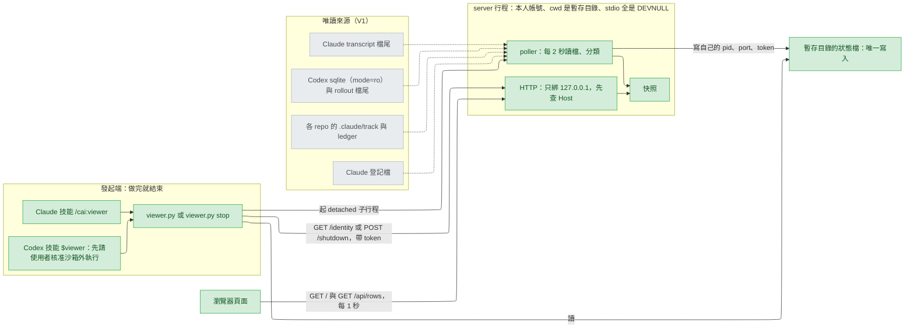
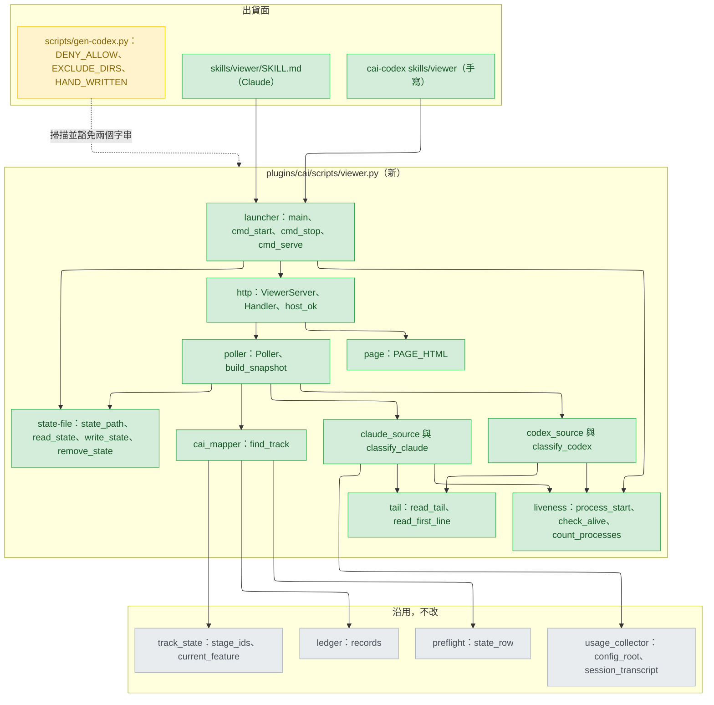
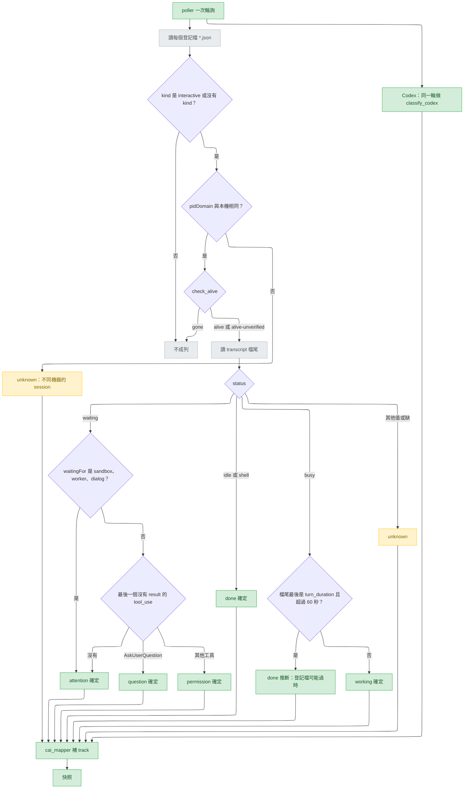
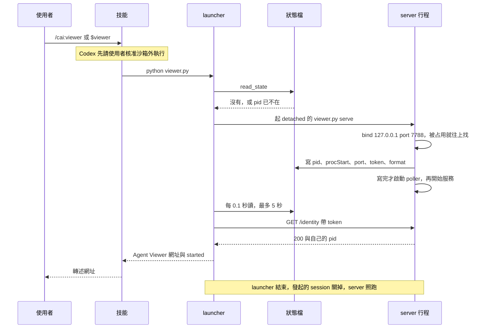
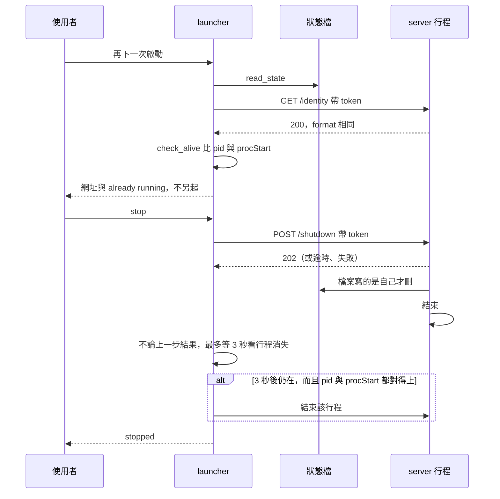
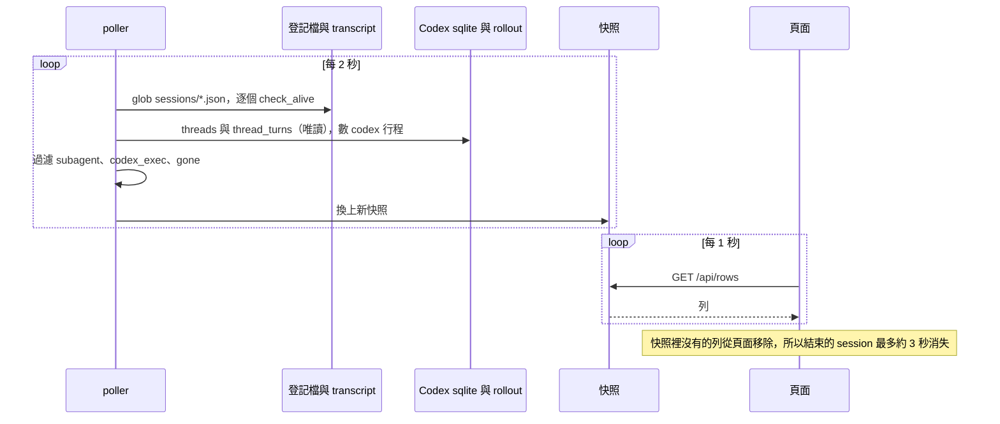
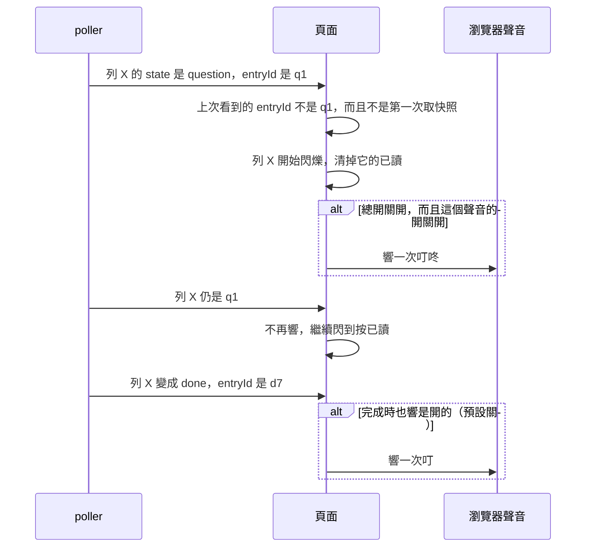
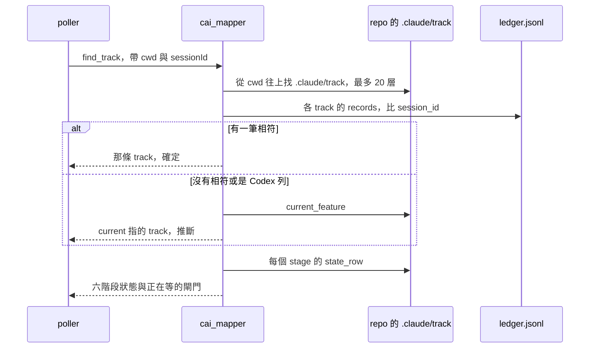
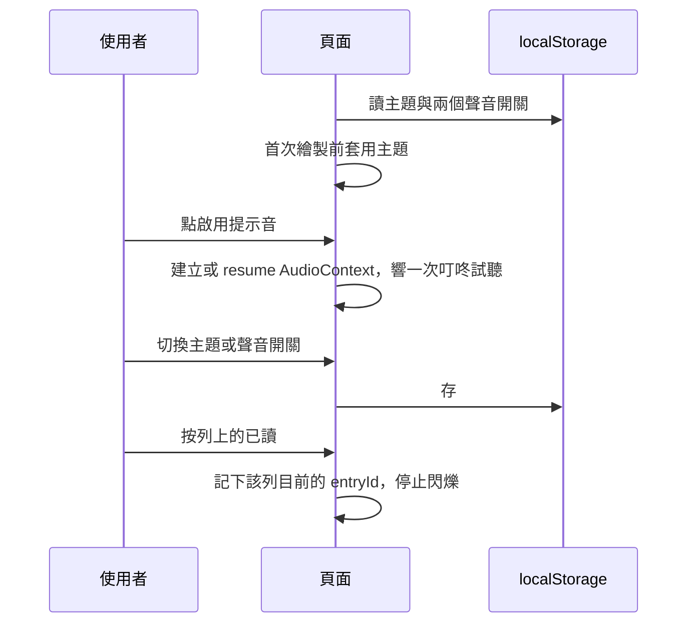

# agent-viewer-web-portal — detail design

## Reference

Stance doc: docs/design/2026-09-25-agent-viewer-web-portal-stance.md
Decisions doc: docs/design/2026-09-25-agent-viewer-web-portal-decisions.md
Status: approved 2026-09-25（stance）；decisions 的 Tier 1 三項皆有 `Decided:`（使用者 2026-09-25），decisions 本身仍是 draft，Gate 1 與 stance 一起簽。

其他輸入：`.claude/track/agent-viewer-web-portal/` 的 `intake.md`（AC1–AC7）、`discover.md`（地雷 1–8）、`discover-evidence.md`、`mockup.html`（已核准的畫面）、`options-D1.md`…`options-G3.md`（使用者答案的原文）。本文件不做新的架構決定；這一層新出現的小決定都列在 `## Design decisions`，並標明哪幾項要在 Gate 1 讓使用者看到。

用詞（第一次出現的英文詞）：登記檔（registry，Claude Code 每個執行中 session 一個的小 JSON 檔）；對話紀錄（transcript，Claude 的 `.jsonl`）；Codex 紀錄檔（rollout，Codex 的 `.jsonl`）；狀態檔（state file，viewer 記錄自己在哪個 port 的暫存檔）；權杖（token，每次啟動隨機產生的一串字）；輪詢（poll，定時重讀檔案）；快照（snapshot，一次輪詢的結果）；檔尾（tail，檔案最後固定位元組數）；閘門（gate，cai track 的人工簽核點）；分類器（classifier，把檔尾換成狀態的純函式）；沙箱（sandbox，Codex 的受限帳號）；同源政策（same-origin policy）；內容安全政策（CSP，瀏覽器限制頁面能載入什麼的標頭）；跨站腳本（XSS，別人的文字被當成程式在頁面上執行）。

### Traceability

| From the high-level design | Satisfied by | Status |
|---|---|---|
| UC1 | `launcher.cmd_start` 起 detached `serve`（`### launcher`）；兩個技能（`### skill-claude`、`### skill-codex`）；Verification 的 lifecycle 測試加 verify 實機 | covered（Codex TUI 實機、TUI 會不會收掉子行程、Linux 終端機關閉留給 verify） |
| UC2 | `cmd_start` 的「已在跑」判斷、`cmd_stop`、殘留狀態檔處理（`### launcher`、`### state-file`） | covered |
| UC3 | `claude_source`、`codex_source` 產生列；`gone` 的列下一次輪詢就不在快照裡；`codex_exec` 與 subagent 過濾 | covered |
| UC4 | `classify_claude`、`classify_codex` 的狀態表；頁面的 `entryId` 聲音規則（`### page`） | covered（V7 依 decisions 的讀法：一輪做完預設不響） |
| UC5 | `cai_mapper` 與頁面 stepper（兩道閘門） | covered |
| UC6 | 頁面：主題三段切換存 localStorage、「啟用提示音」、「已讀」 | covered（verify 手動對照 mockup） |
| R1 | 頁尾文字改寫：Claude 的等權限是確定的，推斷只用在 Codex（`### page`） | covered |
| AC5 | V1 寫入邊界：只寫狀態檔；讀檔只讀檔尾；sqlite 唯讀；不開 `auth.json`（Verification 的 write-boundary 測試） | covered |
| AC6 | gen-codex 允許清單、EXCLUDE_DIRS、HAND_WRITTEN、CLAUDE.md、版本（`### gen-codex`） | covered |
| AC7 | Verification 表的 fixture 與生命週期測試 | covered |

## Requirement

同時開著好幾個 Claude Code 與 Codex 主 session 的人，打開一個只在本機的網頁，約 3 秒內看出哪一個在等他（提問、等權限、一輪做完），不必切回每個終端機；cai track 的 session 另外看得到六階段進度與兩道閘門。被看的 agent 那一側什麼都不改。做到的判準：AC4 每個狀態一個 fixture 測試、AC7 的生命週期測試全綠，加上 verify 在 Windows 實機從 Claude Code 與 Codex 各啟動一次。

## Glossary

| Term | Definition | Where it lives |
|---|---|---|
| viewer.py | 唯一的腳本：launcher、背景 server、分類器與內嵌頁面都在這一檔 | new — plugins/cai/scripts/viewer.py |
| 登記檔（registry） | Claude Code 每個執行中 session 一個的 JSON 檔 `<config_root>/sessions/<pid>.json` | .claude/track/agent-viewer-web-portal/discover-evidence.md:6 |
| 對話紀錄（transcript） | Claude session 的 `.jsonl`，路徑由 cwd 與 sessionId 算出 | plugins/cai/scripts/usage_collector.py:81 |
| Codex 紀錄檔（rollout） | Codex thread 的 `.jsonl`，第 1 行是 `session_meta` | .claude/track/agent-viewer-web-portal/discover-evidence.md:51 |
| 主 session | 使用者在終端機對話的那個行程；subagent 與 `codex exec` 不算 | concept |
| 列（row） | 快照裡一個主 session 的 JSON 物件，欄位見 `### poller` | new — plugins/cai/scripts/viewer.py |
| 列鍵（row key） | Claude：`claude:<pid>:<procStart>`；Codex：`codex:<threadId>` | new — plugins/cai/scripts/viewer.py |
| 狀態（state） | 列的六個值之一：`question`、`permission`、`attention`、`done`、`working`、`unknown` | new — plugins/cai/scripts/viewer.py |
| 確定度（certainty） | `confirmed` 或 `inferred`；畫面上寫「確定」「推斷」（V4） | docs/design/2026-09-25-agent-viewer-web-portal-stance.md:29 |
| 需要你（needs-you） | 狀態是 `question`、`permission`、`attention`、`done` 其中之一 | concept |
| 進入編號（entryId） | 列每進入一次「需要你」就換一個的字串；頁面以它判斷「這次響過沒」 | new — plugins/cai/scripts/viewer.py |
| 存活結果（liveness） | `alive`、`alive-unverified`、`gone` 三值之一 | new — plugins/cai/scripts/viewer.py |
| 狀態檔（state file） | 暫存目錄裡記 pid、procStart、port、token 的 JSON；viewer 唯一寫的檔 | new — <tempfile.gettempdir()>/cai-viewer.json |
| 關閉權杖（token） | 64 個十六進位字元，只守 `/identity` 與 `/shutdown`，不守讀取（D1=B） | new — plugins/cai/scripts/viewer.py |
| launcher | 前景執行的 `viewer.py` 或 `viewer.py stop`；做完就結束 | new — plugins/cai/scripts/viewer.py |
| server 行程 | `viewer.py serve` 起的背景行程，開 port、輪詢、回頁面 | new — plugins/cai/scripts/viewer.py |
| poller | server 裡每 2 秒輪詢一次的執行緒，產生快照 | new — plugins/cai/scripts/viewer.py |
| 快照（snapshot） | poller 最近一次的結果，HTTP 只回它 | new — plugins/cai/scripts/viewer.py |
| 頁面（page） | 內嵌在 viewer.py 的 HTML/CSS/JS，版面照 mockup | .claude/track/agent-viewer-web-portal/mockup.html:1 |
| 安全插值清單（SAFE_INTERPOLATIONS） | 頁面模板裡允許不經 `esc()` 的插值運算式，只放數字、布林與固定的 class 名稱 | new — plugins/cai/scripts/viewer.py |
| stepper | cai track 的六階段進度條，兩道閘門畫在 build 與 ship 前 | .claude/track/agent-viewer-web-portal/mockup.html:402 |
| 閘門（gate） | cai 的人工簽核點：Gate 1 在 build 前、Gate 2 在 ship 內 | .claude/track/agent-viewer-web-portal/mockup.html:269 |
| config_root | Claude 設定目錄，尊重 `CLAUDE_CONFIG_DIR` | plugins/cai/scripts/usage_collector.py:48 |
| session_transcript | 由 projects 目錄、cwd、sessionId 回傳 transcript 路徑或 None | plugins/cai/scripts/usage_collector.py:81 |
| stage_ids | 六個 stage 的 id，依 stages.json 順序 | plugins/cai/scripts/track_state.py:33 |
| current_feature | 讀 `<track_root>/current` 回傳 track 名或 None | plugins/cai/scripts/track_state.py:38 |
| state_row | 讀 track 目錄的 state.md，回傳某 stage 那一列的儲存格 | plugins/cai/scripts/preflight.py:73 |
| ledger.records | 讀 track 的 `ledger.jsonl`，壞行變成 malformed 佔位 | plugins/cai/scripts/ledger.py:418 |
| Codex home | `CODEX_HOME` 或 `~/.codex` | plugins/cai-codex/scripts/launcher.py:34 |
| DENY_LIST | gen-codex 對每個產出檔掃的禁用字串 | scripts/gen-codex.py:126 |
| DENY_ALLOW | 新增的（路徑, 字串）允許清單，只放 viewer.py 的兩項 | new — scripts/gen-codex.py |
| HAND_WRITTEN | gen-codex 不寫也不刪的 Codex 手寫檔清單 | scripts/gen-codex.py:81 |
| EXCLUDE_DIRS | gen-codex 不複製到 Codex 樹的目錄 | scripts/gen-codex.py:47 |
| 叮咚、叮 | 頁面合成的兩種提示音 | .claude/track/agent-viewer-web-portal/mockup.html:529 |
| 嗒 | 新的第三種提示音，只給 Codex 推斷的等權限（G1） | new — plugins/cai/scripts/viewer.py |
| 已讀（ack） | 列上的按鈕，停止該列閃爍直到下一個 entryId | .claude/track/agent-viewer-web-portal/mockup.html:462 |
| 啟用提示音 | 頁面頂端要使用者先點一次的橫幅（C23） | .claude/track/agent-viewer-web-portal/mockup.html:235 |

## Budgets

| What | Number | Where it comes from |
|---|---|---|
| server 輪詢間隔 | 2 秒 | `intake.md:17`（約每 2 秒） |
| 頁面向 server 取快照的間隔 | 1 秒 | 2 + 1 ＝ 最壞 3 秒，湊 AC4（`intake.md:33`） |
| 狀態改變到畫面反映的上限 | 3 秒 | AC4 |
| transcript 檔尾 | 262144 位元組 | designer 決定（Tier 3）；要容得下最後一個提問、最後 8 個 tool_use 與最後一則文字，夠不夠由 verify 在實機看 |
| rollout 檔尾 | 262144 位元組 | 同上 |
| 登記檔單檔讀取上限 | 65536 位元組 | 實際約 700 位元組（`C:\Users\millerlai\.claude\sessions\45224.json` 一行） |
| rollout 第 1 行讀取上限 | 65536 位元組 | 只要 `session_meta` |
| 最近動作筆數 | 8 | D2 的答案（`options-D2.md` 欄位 1）；`mockup.html:448` 的 `slice(-8)` |
| 列上「剛剛」顯示筆數 | 3 | `mockup.html:311` 顯示 3 筆 |
| Codex 等權限推斷門檻 | 30 秒 | designer 決定（decisions Tier 3）；Gate 1 列為可推翻 |
| Claude `busy` 過時門檻 | 60 秒 | designer 決定（decisions Tier 3） |
| sqlite 取最近 thread 數 | 50 | 上限；K 個 codex 行程只會用到前 K 個 |
| 退回路徑：只看最近修改的 rollout | 24 小時 | 退回路徑（D9）不掃整棵 `sessions/` |
| 退回路徑：rollout 檔數上限 | 200 | 同上 |
| 預設 port | 7788 | `mockup.html:220` |
| port 嘗試個數 | 10 | 7788 到 7797（decisions Tier 3） |
| launcher 等 server 就緒 | 5 秒 | 每 0.1 秒看一次狀態檔 |
| `/identity` 請求逾時 | 1 秒 | |
| `/shutdown` 請求逾時 | 2 秒 | |
| `stop` 送出關閉後等行程結束 | 3 秒 | 不論 `/shutdown` 回 202 或失敗都等；之後才退而結束行程 |
| 關閉權杖長度 | 32 位元組 | `secrets.token_hex(32)`，64 個十六進位字元 |
| 往上層找 `.claude/track` 的層數 | 20 | cwd 可能在 repo 的子目錄 |
| 提問原文截斷 | 1000 字元 | 每個選項 200 字元，最多 10 個選項 |
| 權限指令截斷 | 500 字元 | |
| 摘要截斷 | 400 字元 | |
| 最近動作的參數截斷 | 120 字元 | |
| 頁面判定「離線」 | 3 次 | 連續取快照失敗 3 次 |
| 狀態檔讀到半截 JSON 時重試 | 1 次 | 隔 100 毫秒；再失敗視為沒有狀態檔 |

## Design decisions

照 decisions 文件執行 D1–D11、G1–G3 與 Tier 3 全部條目，不再重述。這一層新出現、decisions 沒有的決定：

- **狀態檔直接寫，不經暫存再改名。** V1 說唯一寫的是狀態檔（`stance.md:26`），另寫一個 `.tmp` 再 `os.replace` 等於多寫一個檔。讀到半截 JSON 的機率由「重試 1 次、再失敗當作沒有」處理（Budgets），兩個實例同時啟動由 server 的自我檢查收斂（`### poller`）。服務 V1、V6。
- **兩個實例同時起來時，由 server 自己退讓。** 每次輪詢讀狀態檔：檔案不見了，或寫的是另一個還活著的 pid，就自行關閉；寫的是已經死掉的 pid，就寫回自己。不另開鎖檔（decisions Ruled out）。server 一定先寫狀態檔、再啟動 poller，所以第一輪不會把自己誤判成被取代。服務 V6。
- **不同協定版本的 viewer 在跑時，不起第二個。** launcher 的判斷有固定順序（`### launcher`）：身分端點答得上來、但 `format` 不同，就只印一行請使用者先 `stop`，不自動重啟、也不另起一個（另起會綁到下一個 port，變成兩個實例，違反 V6）。
- **launcher 印英文、只用 ASCII。** 技能透過 Claude 的 Bash 工具（Windows 上是 Git Bash）或 Codex 的 PowerShell 讀輸出，非 ASCII 會被主控台字碼頁弄壞（`probe/monitor.py:31-32` 的探針就得明設 `encoding="utf-8"`）；模型轉述時再翻成使用者的語言。頁面是 UTF-8 的 HTML，照 mockup 用中文。服務 UC1。
- **使用者訊息不上頁面。** D2 答案的範圍是選項原文列出的四種（`options-D2.md`），mockup「經過」裡的「你：…」不在其中（`mockup.html:297`）。**Gate 1 要讓使用者看到這一條。**
- **不顯示已結束的列。** UC3「已結束的幾秒內消失」（`stance.md:52`）勝過 mockup 的「已結束」列（`mockup.html:339-342`），頂端計數拿掉「已結束」。服務 UC3。
- **保留 mockup 的 resume 複製鈕與 subagent 標籤。** 兩者都在核准的 mockup 裡（`mockup.html:463`、`:418`）。`codex resume <id>` 的語法沒查文件（UNVERIFIED，verify 實按一次）；subagent 名稱讀 Claude 的 `Agent`／`Task` tool_use 的 `subagent_type`，所以 gen-codex 允許清單多一項。服務 UC6。
- **對話原文一律跳脫，並有測試守住。** D1=B 讓同機其他帳號也打得開頁面，D2=A 讓工具參數與提問原文上頁面；原文裡的 HTML 若被當成標記，就會在頁面上執行（CSP 允許內嵌 script）。所以頁面模板裡每一個 `${...}` 插值都必須是 `esc(...)`，或列在 `SAFE_INTERPOLATIONS`；有一個靜態測試逐一檢查，另有一個帶 `` 的 fixture 列留給 verify 在瀏覽器實看。頁面同時帶 CSP 與 `X-Content-Type-Options: nosniff`；token 不在頁面上，所以就算被注入也送不出關閉請求。服務 V3、D2。
- **檔尾快取。** 以（路徑、大小、修改時間）為鍵，沒變就不重新解析；10 個 Claude 加 10 個 Codex session 每 2 秒最多讀 5 MiB，大多數輪詢是零。服務 AC4 的 3 秒。
- **協定版本不看腳本內容。** 狀態檔與 `/identity` 帶 `format: 1`。gen-codex 產生的 Codex 副本不必與 Claude 那份逐位相同也能互認。服務 V6。
- **聲音開關記憶。** 「完成時也響」（預設關，G2）、「推斷的等權限也響」（預設開，G1）存 localStorage；「聲音」總開關照 mockup 不記（`mockup.html:380`）。第一次取到快照只建立基準、不響，重新整理頁面不會把所有等待中的列再響一遍。
- **`--port` 只給測試用。** 測試不能碰使用者正在用的 7788，也不能碰真的暫存目錄；`--port` 加上子行程環境裡的 `TMPDIR`（`tempfile.gettempdir()` 第一個看的變數，https://docs.python.org/3/library/tempfile.html ：「The directory named by the TMPDIR environment variable」）就隔離。技能不傳它。比照 `CAI_USAGE_LEDGER` 為測試隔離而設（`tests/conftest.py:55-62`）。

## Diagrams

### Architecture

看哪裡：瀏覽器只碰 HTTP，HTTP 只回快照，不會因為一個請求去讀檔；token 只在 launcher 與 HTTP 之間走，從不經過瀏覽器（D1=B 之後它只守關閉與身分）。

### Component

看哪裡：兩個分類器（`classify_claude`、`classify_codex`）不讀檔、不看時鐘以外的東西，是測試的主力；灰色的四個模組只被呼叫，一行都不改；唯一被修改的既有檔是黃色的 gen-codex。

### Flow

看哪裡：`waiting` 底下的判斷不看 `waitingFor` 是 `permission prompt` 還是 `input needed`，只看 transcript 檔尾，所以登記檔對權限寫哪一個值都判得對（C2 未驗證也成立）；推斷只出現在過時的 `busy` 一格，Claude 的等權限是確定的（R1）。

### Sequence — UC1

看哪裡：launcher 不信任「子行程起來了」，要讀到子行程自己寫的狀態檔、並且 `/identity` 回的 pid 對得上才印網址。

### Sequence — UC2

看哪裡：退而結束行程只看「3 秒後還在、而且 pid 與建立時間都對得上」，不看 `/shutdown` 有沒有回 202；殘留的狀態檔（pid 已不在）在啟動與 stop 兩條路上都被當成「沒有在跑」。

### Sequence — UC3

看哪裡：列的消失不是頁面自己判斷的，是快照裡少了它；頁面只做比對。

### Sequence — UC4

看哪裡：「不重複」靠的是 server 給的 `entryId`，不是頁面記得的狀態名稱；同一個提問答完又問一次，`entryId` 換了就會再響。

### Sequence — UC5

看哪裡：Codex 列一定走下面那條（ledger 沒有 Codex 的 session id，C17），所以 Codex 的 cai 列永遠標「推斷」。

### Sequence — UC6

看哪裡：聲音在使用者點擊之前不可能響（C23），所以橫幅在點過之前一直顯示；「已讀」記的是 `entryId`，下一次進入會重新亮起。

## Implementation spec

所有 `### launcher` 到 `### page` 都在同一檔 `plugins/cai/scripts/viewer.py`（新），只用 stdlib；開頭 `sys.path.insert(0, HERE)` 後 import `usage_collector`、`track_state`、`preflight`、`ledger`，比照 `plugins/cai/scripts/track_state.py:28-30`。檔案內不得出現 `${CLAUDE_PLUGIN_ROOT}`、`/cai:`、`~/.claude/`、`CLAUDE_CODE_`、反引號包住的 agent 名稱，也不得有以三個反引號開頭的行（C18；gen-codex 會改寫或拒絕）。所有檔案開啟都指定 `encoding="utf-8"` 或二進位。

### launcher

- **Responsibility:** 解析指令列，啟動、找到或關閉唯一的 server 行程，印出結果。
- **Interface:**
  - `main(argv: list[str]) -> int`：`[]` 或 `["start"]` 走 `cmd_start`；`["stop"]` 走 `cmd_stop`；`["serve", "--port", N]` 走 `cmd_serve`；`--port N` 也可接在 `start` 後；其他印用法、回 1。
  - `cmd_start(port: int = 7788) -> int`
  - `cmd_stop() -> int`
  - `cmd_serve(port: int) -> int`
  - `spawn_server(port: int) -> subprocess.Popen`
- **Data:** stdout 只印 ASCII 行，技能照抄：`Agent Viewer: http://127.0.0.1:<port>`；接著一行 `started (pid <n>)`、`already running (pid <n>)`、`stopped (pid <n>)`、`not running`、`not running (removed a stale state file)`，或 `a different viewer version is running (pid <n>); run stop, then start again`。錯誤一行 `error: <原因>`。
- **`cmd_start` 的判斷，依序，第一個成立的算：**
  1. `read_state()` 是 None → 起新的 server。
  2. 帶狀態檔的 token 送 `GET /identity` 到狀態檔的 port：連不上、逾時、非 200、或 body 的 `pid` 不等於狀態檔的 pid → 起新的 server（server 起來後會覆寫狀態檔）。
  3. body 的 `format` 不是 1 → 印網址與「different version」那行，回 0，**不起新的 server**。
  4. `check_alive(pid, procStart, exact=True) == "gone"` → 起新的 server。
  5. 其餘 → 印網址與 `already running`，回 0。
- **`cmd_stop` 的判斷：** `read_state()` 是 None → `not running`，回 0；`check_alive(..., exact=True) == "gone"` → 刪狀態檔，`not running (removed a stale state file)`，回 0；否則送 `POST /shutdown`（不論回 202、非 202 或逾時，下一步都一樣），然後最多等 3 秒看 `check_alive` 變成 `gone`；3 秒後仍是 `alive` → `os.kill(pid, signal.SIGTERM)`（這是結束自己的 server，不是存活探測，V2 不適用），再等 1 秒；仍在 → `error: could not stop pid <n>`，回 1。3 秒後是 `alive-unverified` → 不結束任何行程，印 `error: could not stop pid <n>`，回 1。行程消失後若狀態檔仍寫著該 pid 就刪掉，印 `stopped (pid <n>)`，回 0。
- **`cmd_serve` 的順序：** 產生 token → 依序試 port 7788 到 7797 綁 `ViewerServer`（全失敗回 3）→ `write_state`（`OSError` 回 2）→ 啟動 `Poller` 執行緒 → `serve_forever()`；結束時若狀態檔寫的是自己就刪。狀態檔一定在 poller 第一輪之前寫好，否則 poller 會把「檔案不在」當成被取代而自行關閉。
- **Errors:**
  - `cmd_start`：子行程以 3 結束 → `error: ports 7788-7797 are all in use`，回 1；5 秒內沒就緒 → `error: the viewer did not come up within 5 seconds`，回 1，不刪任何檔。
  - `cmd_serve`：其他未預期例外回 2（stdio 是 DEVNULL，看不到訊息；launcher 以結束碼判斷）。
- **Concurrency:** 兩個 `cmd_start` 同時跑會各起一個 server；收斂由 `### poller` 的自我檢查負責。`cmd_stop` 可以重跑，第二次印 `not running`。
- **Observability:** 只有 stdout 那幾行與結束碼（0 成功、1 失敗）；server 行程沒有日誌（stdio 全 DEVNULL，`discover.md:24`）。
- **Where it lives:** plugins/cai/scripts/viewer.py（新）。
- **What it reuses:** detached 旗標與存活證據 `.claude/track/agent-viewer-web-portal/probe/spawn_probe.py`（探針，只作參考，不 import）；`sys.stdout.reconfigure(errors="replace")` 比照 `plugins/cai/scripts/design_probe.py`（`main()` 開頭）。
- `spawn_server`：`[sys.executable, os.path.abspath(__file__), "serve", "--port", str(port)]`，`stdin/stdout/stderr=subprocess.DEVNULL`，`cwd=tempfile.gettempdir()`，`close_fds=True`。Windows：`creationflags=DETACHED_PROCESS | CREATE_NEW_PROCESS_GROUP | CREATE_BREAKAWAY_FROM_JOB`，`OSError` 時拿掉 `CREATE_BREAKAWAY_FROM_JOB` 重試一次（D8）。POSIX：`start_new_session=True`。

### state-file

- **Responsibility:** 讀、寫、刪暫存目錄裡的那一個狀態檔。
- **Interface:** `state_path() -> str`；`read_state(path: str) -> dict | None`；`write_state(path: str, state: dict) -> None`；`remove_state(path: str, pid: int) -> None`。
- **Data:** Windows 路徑 `<tempfile.gettempdir()>/cai-viewer.json`；POSIX `<tempfile.gettempdir()>/cai-viewer-<os.getuid()>.json`（D11）。內容一行 JSON：`{"format": 1, "pid": int, "procStart": str, "port": int, "token": str, "startedAt": int}`，`startedAt` 是 epoch 毫秒。
- **Errors:** `read_state`：檔案不在 → None；JSON 壞 → 隔 100 毫秒重讀一次，仍壞 → None；`pid`、`port` 不是整數或 `token` 不是字串 → None；`format` 可以是任何整數（版本不同的判斷交給 launcher 第 3 步），`procStart` 缺則為 None。`write_state`：`os.open(path, O_WRONLY | O_CREAT | O_TRUNC, 0o600)` 後寫入（POSIX 權限只保證不寬於 0o600，C16），`OSError` 往上拋，`cmd_serve` 回 2。`remove_state`：只有檔案內的 pid 等於參數才刪；不在就算了。
- **Concurrency:** 多個寫者時後寫的贏；讀者可能讀到寫一半的內容，由重試與 poller 自我檢查兜住。
- **Observability:** 無。
- **Where it lives:** plugins/cai/scripts/viewer.py（新）。
- **What it reuses:** 無。

### liveness

- **Responsibility:** 不送任何 signal 地回答「這個 pid 還是當初那個行程嗎」，以及「現在有幾個 codex 行程」。
- **Interface:** `process_start(pid: int) -> str | None`；`check_alive(pid: int, expected_start: str | None, exact: bool) -> str`（回 `"alive"`、`"alive-unverified"`、`"gone"`）；`count_processes(name: str) -> int`。
- **Data:** Windows 的建立時間是 FILETIME 組成的整數，轉成十進位字串（與登記檔 `procStart` 同格式，C1）；Linux 是 `/proc/<pid>/stat` 最後一個 `)` 之後第 20 個欄位（整份的第 22 欄，C4）的原字串。
- **Errors / 規則:**
  - Windows：`kernel32 = ctypes.WinDLL("kernel32", use_last_error=True)`；`OpenProcess(0x1000, False, pid)`；NULL 且 `get_last_error() == 5` → `alive-unverified`，其他 NULL → `gone`；`GetExitCodeProcess` 不是 259 → `gone`（只要 handle 還被別人握著，結束的行程也開得起來；UNVERIFIED 文件，由「起子行程、結束它、仍握著 Popen」的測試證明）；`GetProcessTimes` 的建立時間等於 `expected_start` → `alive`，不等 → `gone`；`expected_start` 是 None → `alive-unverified`；一定 `CloseHandle`。
  - Linux：`/proc/<pid>/stat` 讀不到 → `gone`；狀態欄是 `Z` → `gone`；第 22 欄等於 `expected_start` → `alive`；不等時 `exact=True`（自己寫的狀態檔）→ `gone`，`exact=False`（Claude 的 `procStart`，格式未知，C5）→ `alive-unverified`（D10）。
  - `count_processes`：Windows 用 `CreateToolhelp32Snapshot(TH32CS_SNAPPROCESS)` 加 `Process32FirstW/NextW`，`szExeFile` 不分大小寫等於 `codex.exe`（C6，`discover-evidence.md:42`）；Linux 掃 `/proc/*/comm` 等於 `codex`（C7）；任何錯誤 → 0。
- **Concurrency:** 無共享狀態，可並行。
- **Observability:** 無；誤判以列的「存活：推斷」標籤呈現。
- **Where it lives:** plugins/cai/scripts/viewer.py（新）。
- **What it reuses:** 無；repo 內沒有可沿用的存活 helper（`discover.md:22`）。本元件任何路徑都不得呼叫 `os.kill`（V2）。

### tail

- **Responsibility:** 只讀檔尾固定位元組數，回傳解析得了的 JSON 物件。
- **Interface:** `read_tail(path: str, max_bytes: int) -> list[dict]`；`read_first_line(path: str, max_bytes: int = 65536) -> dict | None`。
- **Data:** 以二進位開啟，`seek(max(0, size - max_bytes))`；offset 大於 0 時丟掉第一個換行之前的半行；`decode("utf-8", "replace")`；逐行 `json.loads`，失敗或不是 dict 就略過。快取鍵（路徑、`st_size`、`st_mtime_ns`），沒變就回上次的結果。
- **Errors:** 檔案不在或 `OSError` → `[]` 或 None。
- **Concurrency:** 快取只由 poller 執行緒存取。
- **Observability:** 無。
- **Where it lives:** plugins/cai/scripts/viewer.py（新）。
- **What it reuses:** 壞行容忍與 UTF-8 `replace` 的作法比照 `plugins/cai/scripts/ledger.py:423-438`。

### claude_source 與 classify_claude

- **Responsibility:** 把每個登記檔變成零或一個 Claude 列；分類是純函式。
- **Interface:** `claude_rows(config_root: str, now_ms: int) -> tuple[list[dict], list[str]]`（列、problems）；`classify_claude(reg: dict, tail: list[dict], now_ms: int) -> dict`。
- **Data（輸入）：** 登記檔欄位見 C1；transcript 形狀：`type` 為 `assistant` 的項目 `message.content[]` 內有 `{"type": "tool_use", "id", "name", "input"}` 與 `{"type": "text", "text"}`，`message.model`；`type` 為 `user` 的項目內有 `{"type": "tool_result", "tool_use_id"}`；`{"type": "system", "subtype": "turn_duration"}`（`intake.md:57`）。tool_use／tool_result 的欄位路徑沒有文件（transcript 格式是內部的，`stance.md:15`），**unit 2 第一步**對照 `intake.md:58` 那兩行本機樣本只核對鍵名，fixture 照實際形狀造。
- **分類規則（依序，第一個成立的算）：**
  1. `status` 不在 `busy`、`idle`、`waiting`、`shell` → `unknown`。
  2. `waiting`：`waitingFor` 是 `sandbox request`、`worker request`、`dialog open` → `attention`（確定，標籤附原值）；否則看最後一個沒有對應 tool_result 的 tool_use：`name == "AskUserQuestion"` → `question`（確定，`input.questions[*].question` 與 `options[*].label`）；其他工具 → `permission`（確定，工具名與參數摘要）；沒有 → `attention`（確定，附 `waitingFor` 原值或「原因未知」）。
  3. `idle` → `done`（確定）；`shell` → `done`（確定），notes 加「背景 shell 執行中」。
  4. `busy`：檔尾最後一項是 `turn_duration` 且 `now_ms - statusUpdatedAt > 60000` → `done`（推斷），notes 加「登記檔可能過時」；否則 `working`（確定），`current` 是最後一個沒有 result 的 tool_use。
  - 參數摘要：`file_path`、`path`、`pattern`、`command`、`url` 依序取第一個存在的，否則 `json.dumps(input)`；依 Budgets 截斷。
  - `entryId`：`question`／`permission` 用那個 tool_use 的 `id`；其他用 `<state>:<statusUpdatedAt>`。`since` 用 `statusUpdatedAt`。
- **claude_rows 規則：** glob `<config_root>/sessions/*.json`（不開 `*.key`）；`kind` 存在且不是 `interactive` → 略過；`pidDomain` 平台不符（或 Windows 上主機名不分大小寫不符）→ `unknown` 列、不做存活檢查；`check_alive(pid, procStart, exact=False)`：`gone` → 略過，`alive-unverified` → notes 加「存活：推斷」；transcript 用 `usage_collector.session_transcript(os.path.join(config_root, "projects"), cwd, sessionId)`，None 時檔尾是 `[]`（所以 `waiting` 會落在 `attention`）。
- **Errors:** 單一登記檔讀不了或 JSON 壞 → 略過並在 problems 加一行；絕不讓一個檔的錯誤中斷整輪。
- **Concurrency:** 只在 poller 執行緒跑。
- **Observability:** problems 進快照，頁尾顯示「有 N 個來源讀不了」。
- **Where it lives:** plugins/cai/scripts/viewer.py（新）。
- **What it reuses:** `plugins/cai/scripts/usage_collector.py:48-49`（`config_root`）、`:81-83`（`session_transcript`）。

### codex_source 與 classify_codex

- **Responsibility:** 列出活著的互動式 Codex thread 並分類。
- **Interface:** `codex_rows(codex_home: str, now_ms: int, process_count: int) -> tuple[list[dict], list[str]]`；`classify_codex(turn_status: str | None, tail: list[dict], now_ms: int, tail_mtime_ms: int) -> dict`。
- **Data（輸入）：** `state_*.sqlite` 取編號最大的一個，`thread_history_*.sqlite` 亦同，皆 `sqlite3.connect("file:<posix 路徑>?mode=ro", uri=True)`（C8、D9）。`threads`：`rollout_path`、`cwd`、`updated_at_ms`、`thread_source`、`originator`、`archived`、`name`（`discover-evidence.md:44`），條件 `archived = 0 AND originator = 'codex-tui' AND thread_source = 'user'`，依 `updated_at_ms` 由新到舊取 50 筆。`thread_turns`：`thread_id`、`status`、`started_at`（`probe/monitor.py:39`），每個 thread 取 `started_at` 最大的一筆的 `status`。threads 對 thread_turns 的鍵：thread id 取 rollout 檔名最後 36 個字元（UNVERIFIED；**unit 3 第一步**以唯讀查詢比對本機 `thread_turns.thread_id` 與 rollout 檔名，不符就改用 `threads` 的 id 欄，記進 implementation-notes）。rollout 每行 `{"type", "payload": {"type", "name", "call_id", "arguments"}}`（C9，`probe/monitor.py:58-59`）；`request_user_input` 的 `arguments` 鍵名、助理訊息文字的位置、每行有沒有 `timestamp`，都在 unit 3 第一步只核對鍵名。
- **存活：** K 是 `count_processes("codex.exe" 或 "codex")`；K 為 0 → 沒有 Codex 列；否則先放最新 turn 是 `inProgress` 的 thread（存活：確定），再依 `updated_at_ms` 補到 K 個（存活：推斷），總數不超過 K（D6）。
- **分類規則：**
  1. 本輪進行中＝`turn_status == "inProgress"`（確定）；sqlite 不可用時改看 rollout：最後一個 `task_started` 在最後一個 `task_complete` 之後（推斷）。
  2. 進行中：最後一個沒有 `function_call_output` 的 `function_call` 名稱是 `request_user_input` → `question`（確定）；是其他名稱且已超過 30 秒 → `permission`（推斷，`entryId` 用 `call_id`，響嗒）；否則 `working`。
  3. 不在進行中：最後一輪（最後一個 `task_started` 之後）有 `request_user_input_async` → `question`（確定）；否則 `done`（確定），`turn_status` 是 `failed` 或 `interrupted` 時 notes 加「上一輪 failed／interrupted」。
  4. 檔尾是空的或沒有任何可辨識的事件 → `unknown`。
  - 時間：事件有時間欄就用，沒有就用 rollout 的修改時間（`tail_mtime_ms`）。
- **退回路徑（sqlite 開不起來、表或欄位不符）：** 掃 `<codex_home>/sessions/**/rollout-*.jsonl` 中 24 小時內修改過的最多 200 個，`read_first_line` 取 `session_meta` 的 `originator`、`thread_source`、`cwd` 過濾，所有 Codex 列的確定度一律 `inferred`，problems 加「Codex 資料庫讀不了，改看紀錄檔」。
- **Errors:** 任何 `sqlite3.Error` → 退回路徑；單一 rollout 讀不了 → 略過並記 problems。連線用完即關，不長開。
- **Concurrency:** 唯讀連線不擋 Codex 寫入（C8）。
- **Observability:** problems。
- **Where it lives:** plugins/cai/scripts/viewer.py（新）。
- **What it reuses:** Codex home 的解析照 `plugins/cai-codex/scripts/launcher.py:34-36`（`CODEX_HOME` 或 `~/.codex`）；不開 `auth.json`（V1）。

### cai_mapper

- **Responsibility:** 給一個 cwd 與可有可無的 sessionId，回傳該列對應的 cai track 與六階段狀態。
- **Interface:** `find_track(cwd: str, session_id: str | None) -> dict | None`。
- **Data（輸出）：** `{"name": str, "certainty": "confirmed" | "inferred", "stages": [{"id": str, "status": str}], "current": str | None, "gateWaiting": "build" | "ship" | None}`；`status` 是 state.md 的原值（空字串代表未開始）。
- **規則:** 從 cwd 往上最多 20 層找含有 `.claude/track` 目錄的那一層；每個不叫 `done` 的子目錄用 `ledger.records(track_dir)` 找 `session_id == session_id` 的紀錄 → 確定；否則 `track_state.current_feature(track_root)` → 推斷；都沒有 → None。`stages` 用 `track_state.stage_ids()` 與 `preflight.state_row(<絕對 track 目錄>, sid)`，絕不呼叫 `format_status`（它以 `"."` 找專案，`plugins/cai/scripts/track_state.py:135`）。`current` 是第一個狀態不是 `done`／`skipped` 的 stage。`gateWaiting`（只在列的狀態是 `question` 時計算）：design 是 `done` 且 build 是空 → `build`；current 是 `ship` → `ship`；頁面此時把標籤換成「等你簽核」。
- **Errors:** 任何 `OSError` 或 state.md 缺列 → 該 stage 狀態為空字串；整體失敗 → None。
- **Concurrency:** 每輪以 track_root 為鍵快取一次。
- **Observability:** 無。
- **Where it lives:** plugins/cai/scripts/viewer.py（新）。
- **What it reuses:** `plugins/cai/scripts/track_state.py:33-43`、`plugins/cai/scripts/preflight.py:73-86`、`plugins/cai/scripts/ledger.py:418-445`。

### poller

- **Responsibility:** 每 2 秒產生一份快照並做實例自我檢查。
- **Interface:** `class Poller(threading.Thread)`：`__init__(self, config_root: str, codex_home: str, state_path: str, own_pid: int, on_superseded: Callable[[], None])`；`snapshot(self) -> bytes`（已編碼的 JSON）；`build_snapshot(config_root: str, codex_home: str, now_ms: int) -> dict`（純組裝，可單獨測）。
- **Data（快照）：** `{"format": 1, "generatedAt": int, "rows": [Row], "problems": [str]}`。Row：`{"key": str, "platform": "claude" | "codex", "state": str, "certainty": "confirmed" | "inferred", "entryId": str, "since": int, "project": str, "cwd": str, "branch": str | null, "name": str | null, "sessionId": str | null, "model": str | null, "aliveCertainty": "confirmed" | "inferred", "notes": [str], "question": {"text": str, "options": [str]} | null, "permission": {"tool": str, "input": str} | null, "current": {"tool": str, "input": str, "since": int} | null, "summary": str | null, "recent": [{"at": int | null, "tool": str, "input": str}], "subagents": [str], "track": Track | null}`。`project` 是 cwd 的最後一段；`branch` 讀 `<repo>/.git/HEAD` 的 `ref: refs/heads/<x>`（`.git` 是檔案時跟 `gitdir:`），讀不到為 null。
- **自我檢查：** 每輪 `read_state`：檔案不在，或寫的是另一個 pid 且 `check_alive(..., exact=True) != "gone"` → 呼叫 `on_superseded()`（server 關閉、不刪檔）；寫的是已經 `gone` 的 pid → `write_state` 寫回自己。只在 `cmd_serve` 寫完狀態檔之後才啟動（`### launcher`）。
- **Errors:** 一輪中任何未預期例外 → 保留上一份快照，problems 加一行，下一輪照跑。
- **Concurrency:** 快照以 `threading.Lock` 保護換上；HTTP 執行緒只讀。
- **Observability:** `problems`、`generatedAt`（頁面若 10 秒沒更新就顯示「資料停在 hh:mm:ss」）。
- **Where it lives:** plugins/cai/scripts/viewer.py（新）。
- **What it reuses:** 上面各元件。

### http

- **Responsibility:** 在 127.0.0.1 上回頁面與快照，並提供帶 token 的身分與關閉。
- **Interface:** `class ViewerServer(http.server.ThreadingHTTPServer)`，`allow_reuse_address = False`（C22）、`daemon_threads = True`；`class Handler(http.server.BaseHTTPRequestHandler)`：`do_GET`、`do_POST`、`log_message` 改成什麼都不做；`host_ok(host_header: str | None, port: int) -> bool`。
- **Data:**
  - `GET /` → 200 `text/html; charset=utf-8`，`PAGE_HTML` 內的 `__PORT__` 換成實際 port。
  - `GET /api/rows` → 200 `application/json; charset=utf-8`，快照。
  - `GET /identity`，標頭 `X-Cai-Viewer-Token` → 相符（`hmac.compare_digest`）回 200 `{"app": "cai-viewer", "format": 1, "pid": int, "port": int}`，否則 403。
  - `POST /shutdown`，同一標頭 → 202 後另起執行緒呼叫 `server.shutdown()`；否則 403。
  - 其他路徑 404；其他方法（含 `OPTIONS`）走 `BaseHTTPRequestHandler` 預設的 501。
  - 每個回應都帶 `Cache-Control: no-store`、`X-Content-Type-Options: nosniff`、`Referrer-Policy: no-referrer`；HTML 另帶 `Content-Security-Policy: default-src 'none'; script-src 'unsafe-inline'; style-src 'unsafe-inline'; connect-src 'self'; base-uri 'none'; form-action 'none'; frame-ancestors 'none'`；任何回應都不帶 `Access-Control-Allow-*`。
- **Errors:** Host 不是 `127.0.0.1:<port>` 或 `localhost:<port>`（不分大小寫）或缺 → 403，body 是 `forbidden host`，且在檢查 token 之前（V3）。
- **Concurrency:** 每請求一執行緒；只讀快照與不變的 token。
- **Observability:** 無日誌（stdio 是 DEVNULL）。
- **Where it lives:** plugins/cai/scripts/viewer.py（新）。
- **What it reuses:** stdlib `http.server`（「not recommended for production. It only implements basic security checks」，https://docs.python.org/3/library/http.server.html ；所以只綁回送位址並自己查 Host）。

### page

- **Responsibility:** 照核准的 mockup 畫出列，並負責閃爍、聲音、已讀與主題。
- **Interface:** `PAGE_HTML: str`；`SAFE_INTERPOLATIONS: frozenset[str]`；前端每 1 秒 `fetch("/api/rows", {cache: "no-store"})`。
- **Data / 規則:**
  - 照抄 `mockup.html:7-212` 的首繪前主題腳本與整段 CSS（深色／淺色兩組色票、科技感背景），`mockup.html:215-265` 的版面，去掉「MOCKUP 模擬台」（`:240-247`）與假資料（`:280-354`）、`SIMS`、`churn`。
  - 主題：三段 系統／深色／淺色，鍵 `agent-viewer-theme`（`mockup.html:357`）。
  - 標籤對照（`META`，改自 `mockup.html:271-278`）：`question`→等你回答（有 `track.gateWaiting` 時是「等你簽核」）；`permission` 確定→等你核准權限；`permission` 推斷→可能在等權限；`attention`→等你處理；`done`→完成，等指示；`working`→執行中；`unknown`→未知（灰）。每個標籤旁顯示「確定」或「推斷」（V4）；`aliveCertainty` 是推斷時 meta 行加「存活：推斷」；平台徽章 CLAUDE／CODEX（`mockup.html:455`）；有 track 時徽章 CAI TRACK 與 stepper（`mockup.html:402-414`，兩道閘門在 build 與 ship 前，正在等的那道閃）。
  - 內容框（D2=A）：提問原文與選項；權限的工具與指令（推斷時加 `mockup.html:434` 那行提示，確定時提示「要核准請回終端機」）；做完的摘要；執行中的當前工具、「剛剛」3 筆、subagent；「經過」展開顯示 `recent` 8 筆。使用者訊息不顯示。
  - 跳脫：模板裡每一個 `${...}` 插值，運算式要嘛以 `esc(` 開頭，要嘛原樣列在 `SAFE_INTERPOLATIONS`（只准數字、布林與 viewer 自己產生的 class 名稱，例如 `m.cls`）；`esc()` 沿用 `mockup.html:387`，另加跳脫單引號。不得用 `innerHTML` 以外的方式插入未經模板的字串。
  - 排序與篩選照 `mockup.html:470-471`、`:249-254`：需要你（等最久優先）→ 執行中 → 未知。頂端計數只有「需要你（未讀）」與「執行中」。
  - 聲音：「啟用提示音」橫幅與總開關照 `mockup.html:230`、`:235-238`、`:633-645`；勾選框「完成時也響」（鍵 `agent-viewer-done-chime`，預設關）與「推斷的等權限也響」（鍵 `agent-viewer-inferred-chime`，預設開）。叮咚、叮用 `mockup.html:529-545` 的 `chime`；嗒是單一 440 Hz、振幅 0.12、0.25 秒的音。響的條件：不是第一次取快照、該列 `entryId` 與上次看到的不同、狀態屬需要你、總開關開、該聲音的開關開（V7 讀法）。
  - 已讀：記 `key → entryId`，`entryId` 變了就重新閃（`mockup.html:450-462`）。
  - resume 鈕照 `mockup.html:619-623`：`claude --resume <sessionId>` 或 `codex resume <sessionId>`。
  - 離線：連續 3 次取不到 → LIVE 改「離線」並顯示「viewer 沒有回應（可能已經 stop）」。
  - 頁尾（R1）：「回答問題、核准權限、簽核仍然在終端機做；這一頁只負責讓你看見誰在等你。『可能在等權限』只出現在 Codex 列：某個工具呼叫超過 30 秒沒有結果時推斷，工具只是跑得久也會這樣顯示。Claude 列的等權限讀自登記檔，是確定的。」頁面任何地方都不寫啟動指令（`/cai:` 會被 gen-codex 改寫，C18）。
- **Errors:** `fetch` 失敗計數；JSON 壞當成一次失敗。
- **Concurrency:** 單一頁面；多個分頁各自獨立，各自會響（已知，見 Failure modes）。
- **Observability:** `document.title` 顯示未讀數（`mockup.html:509`）。
- **Where it lives:** plugins/cai/scripts/viewer.py 內的字串常數（新）。
- **What it reuses:** `.claude/track/agent-viewer-web-portal/mockup.html:1-661` 的 CSS、版面與函式。

### skill-claude

- **Responsibility:** 讓 Claude Code 使用者打 `/cai:viewer` 或 `/cai:viewer stop`。
- **Interface:** `plugins/cai/skills/viewer/SKILL.md`，frontmatter：`name: viewer`、`description:`（說明開啟本機 Agent Viewer 網頁、用法 `/cai:viewer [stop]`）、`model: haiku`、`disable-model-invocation: true`（AC1；比照 `plugins/cai/skills/git-sweep/SKILL.md:1-6`）。本文：參數只接受空或 `stop`，其他就說用法並停；執行 `python "${CLAUDE_PLUGIN_ROOT}/scripts/viewer.py" [stop]`；原樣轉述 stdout 的網址那行，其他行用使用者的語言轉述；結束碼非 0 時引用 `error:` 行並停，不重試、不自行殺行程。
- **Data:** 無。
- **Errors:** 見上。
- **Concurrency / Observability:** 無。
- **Where it lives:** plugins/cai/skills/viewer/SKILL.md（新）；`plugins/cai/models.json` 加 `"skills/viewer/SKILL.md": "chore"`（比照 `plugins/cai/models.json:50`）。
- **What it reuses:** `plugins/cai/skills/git-sweep/SKILL.md:8` 的「執行腳本、轉述輸出」寫法。

### skill-codex

- **Responsibility:** 讓 Codex 使用者打 `$viewer` 或 `$viewer stop`，並在沙箱外以本人帳號執行（D3=A）。
- **Interface:** `plugins/cai-codex/skills/viewer/SKILL.md`（手寫），frontmatter `name: viewer`、`description:`；`plugins/cai-codex/skills/viewer/agents/openai.yaml` 內容與 `plugins/cai-codex/skills/models/agents/openai.yaml` 相同（`allow_implicit_invocation: false`）。本文照 `plugins/cai-codex/skills/models/SKILL.md:11-14`（解析 `<cai-root>`）、`:27-44`（直譯器順序與 Windows 管線）、`:69-70`（先請使用者核准在沙箱外執行，再執行 `"<cai-root>/scripts/viewer.py"` 加可選的 `stop`）；轉述規則同 Claude 技能。
- **Data / Errors:** 直譯器全失敗 → 引用最後一個錯誤並停。
- **Where it lives:** plugins/cai-codex/skills/viewer/（新，手寫）。
- **What it reuses:** `plugins/cai-codex/skills/models/SKILL.md`。

### gen-codex

- **Responsibility:** 讓 viewer.py 照常產生到 Codex 樹，只豁免它需要的兩個字串。
- **Interface:** `scripts/gen-codex.py`：新增 `DENY_ALLOW = {("scripts/viewer.py", "AskUserQuestion"), ("scripts/viewer.py", "subagent_type")}`；`deny_hits` 的 DENY_LIST 迴圈改成 `if token in line and (path, token) not in DENY_ALLOW`（`scripts/gen-codex.py:297-299`），其餘檢查不動；`EXCLUDE_DIRS` 加 `"skills/viewer"`；`HAND_WRITTEN` 加 `"skills/viewer/SKILL.md"`、`"skills/viewer/agents/openai.yaml"`。
- **Data:** 無。
- **Errors:** 允許清單以外的任何命中照舊 `DENY` 並回 1。
- **Where it lives:** scripts/gen-codex.py（改）；`tests/test_gen_codex.py` 加三個案例：允許的配對通過、同一字串出現在別的檔仍擋、viewer.py 出現別的禁用字串仍擋。
- **What it reuses:** `scripts/gen-codex.py:285-313`。

## Naming

| Name | What it is | Chosen by |
|---|---|---|
| `/cai:viewer`、`$viewer` | 兩平台的指令 | intake 的假設，隨 stance 的 UC1 於 2026-09-25 核准（`stance.md:50`） |
| `stop` | 關閉用的參數 | the user, 2026-09-25（intake Q3，`intake.md:19`） |
| `plugins/cai/scripts/viewer.py` | 腳本 | follows the scripts convention at `intake.md:35`（AC6） |
| `plugins/cai/skills/viewer/`、`plugins/cai-codex/skills/viewer/` | 技能目錄 | follows `plugins/cai-codex/skills/models/SKILL.md:2` 的「目錄名＝指令名」 |
| `serve` | server 行程的內部子指令 | designer 提案 2026-09-25，Gate 1 待確認（不對使用者公開） |
| `--port` | 測試用的 port 參數 | designer 提案 2026-09-25，Gate 1 待確認 |
| `cai-viewer.json`、`cai-viewer-<uid>.json` | 狀態檔名 | designer 提案 2026-09-25，Gate 1 待確認 |
| `format`、`pid`、`procStart`、`port`、`token`、`startedAt` | 狀態檔欄位 | `procStart` follows 登記檔欄位（`C:\Users\millerlai\.claude\sessions\45224.json:1`）；其餘 designer 提案，Gate 1 待確認 |
| `/identity`、`/shutdown` | 帶 token 的端點 | follows `discover.md:23`、`:50`（身分端點、shutdown 端點） |
| `/api/rows` | 快照端點 | designer 提案 2026-09-25，Gate 1 待確認 |
| `X-Cai-Viewer-Token` | token 標頭 | designer 提案 2026-09-25，Gate 1 待確認 |
| `cai-viewer` | `/identity` 回的 `app` 值 | designer 提案 2026-09-25，Gate 1 待確認 |
| `question`、`permission`、`attention`、`done`、`working`、`unknown` | 狀態值 | designer 提案 2026-09-25，Gate 1 待確認（內部；畫面顯示中文標籤） |
| `confirmed`、`inferred` | 確定度值 | follows V4 的「確定」「推斷」（`stance.md:29`） |
| `alive`、`alive-unverified`、`gone` | 存活結果 | follows `discover.md:22` 的「活著但未驗證」 |
| 快照欄位 `key`、`entryId`、`since`、`notes`、`recent`、`track`、`gateWaiting` 等 | JSON 欄位 | designer 提案 2026-09-25，Gate 1 待確認 |
| `SAFE_INTERPOLATIONS` | 頁面允許不跳脫的插值清單 | designer 提案 2026-09-25（內部常數） |
| `agent-viewer-theme` | 主題的 localStorage 鍵 | follows `mockup.html:357` |
| `agent-viewer-done-chime`、`agent-viewer-inferred-chime` | 兩個聲音開關的 localStorage 鍵 | follows `mockup.html:357` 的前綴；designer 提案 |
| 等你回答、等你簽核、可能在等權限、完成，等指示、執行中、完成時也響、啟用提示音、已讀 | 畫面文字 | follows `mockup.html:231`、`:237`、`:272-277`、`:462` |
| 等你核准權限、等你處理、未知、推斷的等權限也響、確定、推斷 | 新的畫面文字 | 未知、確定、推斷 follow `stance.md:29`；其餘 designer 提案，Gate 1 待確認 |
| `DENY_ALLOW` | gen-codex 的允許清單常數 | follows `scripts/gen-codex.py:126` 的 `DENY_LIST` 命名 |
| `tests/test_viewer_liveness.py`、`test_viewer_lifecycle.py`、`test_viewer_claude.py`、`test_viewer_codex.py`、`test_viewer_cai.py`、`test_viewer_http.py`、`test_viewer_page.py` | 測試檔 | follows `tests/test_<script>.py`（例：`tests/test_gen_codex.py`） |

## Change points

| Path | Change | Exists today |
|---|---|---|
| plugins/cai/scripts/viewer.py | 新增整支腳本 | no |
| plugins/cai/skills/viewer/SKILL.md | 新增 Claude 技能 | no |
| plugins/cai/models.json | 加 `skills/viewer/SKILL.md: chore` | yes |
| plugins/cai/.claude-plugin/plugin.json | version 1.30.0 → 1.31.0（新指令；`:3`） | yes |
| plugins/cai-codex/skills/viewer/SKILL.md | 新增手寫 Codex 技能 | no |
| plugins/cai-codex/skills/viewer/agents/openai.yaml | 新增，`allow_implicit_invocation: false` | no |
| plugins/cai-codex/scripts/viewer.py 與其餘產出 | 由 `python scripts/gen-codex.py` 產生，再 `--release <大於 0.2.12 的版本>`（`plugins/cai-codex/.codex-plugin/plugin.json:3`） | no |
| plugins/cai-codex/README.md | 手寫，補 `$viewer` 一段（比照 `:66-70` 的 `$models`） | yes |
| scripts/gen-codex.py | DENY_ALLOW、EXCLUDE_DIRS、HAND_WRITTEN | yes |
| tests/test_gen_codex.py | 三個允許清單案例 | yes |
| tests/test_viewer_*.py（7 檔） | 新測試，fixture 在測試內以 `tmp_path` 產生，不含真實對話（AC7） | no |
| CLAUDE.md | `:30` 的「seven」改「nine」，`:31-33` 的清單補兩個 viewer 檔 | yes |
| README.md | `:130-142` 的「The other tools」表加 `/cai:viewer` 一列 | yes |
| MANUAL.md | `:16-32` 的表加一列 | yes |
| 新相依 | 無；只用 stdlib（`plugins/cai/scripts/track_state.py:2` 的 Zero deps） | — |

## Failure modes

| Situation | What happens | What the caller sees |
|---|---|---|
| 沒有任何 session 在跑 | 快照 `rows` 為空 | 頁面「目前沒有 agent」（`mockup.html:495` 的空狀態） |
| 第一次啟動、暫存目錄沒有狀態檔 | 起 server | `started` |
| 殘留狀態檔，pid 已不在 | `/identity` 連不上 → 起新的，server 覆寫 | `started`（UC2） |
| 殘留狀態檔，pid 被別的行程重用 | `/identity` 連不上或 pid 不符 → 起新的 | `started` |
| 7788 被別的程式占用 | 往上試到 7797 | 網址顯示實際 port；主題、開關設定因 port 不同而是預設值（C24） |
| 7788–7797 全被占用 | server 以 3 結束 | `error: ports 7788-7797 are all in use` |
| 另一版（`format` 不同）的 viewer 在跑 | 不起新的 | 網址加「different version」那行，請使用者先 `stop` |
| 兩個 session 同時啟動 | 可能起兩個 server；各自每 2 秒自我檢查，後寫狀態檔者留下 | 兩個 launcher 可能印不同 port；其中一個網址在 2 秒內失效，重下一次指令拿到留下的那個 |
| `/shutdown` 回 202 但 server 超過 3 秒才結束 | 3 秒後 pid 與建立時間都對得上 → 結束該行程 | `stopped` |
| 使用者手動刪掉狀態檔 | server 在下一輪自我關閉 | 頁面顯示離線 |
| Windows 上 job 不准脫離 | 拿掉 `CREATE_BREAKAWAY_FROM_JOB` 重試；若所在 job 在發起端結束時收掉子行程，viewer 會跟著結束（UNVERIFIED） | verify 看得到；頁面離線 |
| Codex TUI 結束時收掉子行程 | viewer 結束（UNVERIFIED，`discover-evidence.md:38`） | verify 看得到 |
| 登記檔 `waitingFor` 是沒見過的值 | 仍是 `attention`，標籤附原值 | 「等你處理（<值>）」 |
| 登記檔 `status` 是沒見過的值 | `unknown` | 灰色「未知」列，不響 |
| transcript 找不到（resume 後路徑換了、`CLAUDE_CONFIG_DIR` 只在 Claude 的環境裡設） | 檔尾是空的；`waiting` 落在 `attention`、`busy` 落在 `working` | 列還在，但沒有原文 |
| 檔尾 256 KiB 裡找不到提問的 tool_use（最後一個工具結果很大） | `waiting` 落在 `attention` | 「等你處理」而不是提問原文；verify 若看到就調大 Budgets |
| 對話原文或工具參數裡有 HTML 或 script | 經 `esc()` 後當成文字顯示 | 原樣看到那段文字，不會被執行 |
| 登記檔的 `pidDomain` 是別台機器 | 不做存活檢查 | 「未知」列 |
| Linux 上 Claude `procStart` 格式不同 | `alive-unverified` | meta「存活：推斷」 |
| Codex 資料庫被鎖或 schema 換了 | 退回掃 rollout，Codex 列全標推斷 | 頁尾 problems 一行 |
| 同時開多個 Codex，或 `codex exec` 也在跑（行程數 K 被灌大） | 多出來的 K 會把最近的互動 thread 標成活著（推斷） | 殘影列，標「存活：推斷」（stance 已接受，`stance.md:16`） |
| Codex 崩潰留下 `inProgress` | 只要還有任何 codex 行程，它可能佔一個名額 | 殘影列（存活：確定——已知的誤判） |
| 工具只是跑很久（Codex） | 30 秒後成為推斷的等權限，響嗒（開關預設開） | 「可能在等權限」，頁面提示可能只是跑得久 |
| 同一台機器的其他帳號連進來（D1=B） | 照樣回資料 | 他們看得到原文（使用者已接受，decisions D1） |
| 惡意網頁用 DNS rebinding 連 127.0.0.1 | Host 不符 → 403 | 無 |
| 惡意網頁跨站送 `POST /shutdown` | 沒有 token 標頭 → 403 | 無 |
| 開了兩個分頁 | 兩個分頁各自響 | 同一事件響兩次（已知，不處理） |
| 使用者沒點「啟用提示音」 | 不出聲（C23） | 橫幅一直在 |
| `/plugin update` 後舊 server 還在跑 | 照跑舊版；新版 launcher 看到 `format` 相同就沿用 | 要換新版得先 `stop`；`format` 不同時 launcher 明說 |
| Windows 主控台字碼頁 | launcher 只印 ASCII | 模型轉述時翻成中文 |

## Rollout

- **分段出貨：** 一個 PR 出完。最小可用的一片是 unit 1 到 unit 5 加上 Claude 技能；Codex 技能與 gen-codex 的變更必須同一個 PR，否則 `gen-codex.py --check` 會對 viewer.py 報 DENY，validate.py 與 CI 會紅。
- **既有資料：** 無 migration、無 backfill。viewer 不寫任何既有檔案。
- **進行中的呼叫者：** 無；新增的指令與腳本。gen-codex 的 DENY_LIST 對其他檔案照舊生效，CLAUDE.md 的手寫檔清單同步改。
- **版本：** `plugins/cai/.claude-plugin/plugin.json` bump 到 1.31.0；Codex 樹重產後 `python scripts/gen-codex.py --release <大於 0.2.12>`（CLAUDE.md「Who a file is for」）。確切的 Codex 版號由 ship 決定。
- **Rollback：** revert 那個 commit。唯一留在機器上的是可能還在跑的 server 行程與暫存目錄的狀態檔：revert 之前先 `stop`；忘了的話，重開機或結束該 python 行程即可，狀態檔下次不會有人讀。

## Verification

| Criterion | Level | What it needs | Green before |
|---|---|---|---|
| V2：存活檢查與行程計數不送任何 signal | unit | monkeypatch `os.kill` 為會 raise 的函式，跑 `check_alive`、`count_processes` | unit 1 合併 |
| D5：活著、已結束（Popen 仍握 handle）、pid 重用（建立時間不符）三種結果 | integration | 真的起一個 python 子行程 | unit 1 合併 |
| UC1、UC2：啟動印網址、再啟動只印網址、`stop` 關閉並刪檔、殘留狀態檔被覆寫 | integration | 子行程環境設 `TMPDIR=tmp_path`，`--port` 用測試先找到的空 port；每個測試結束時一定 `stop` | unit 1 合併 |
| `cmd_start` 的五步順序：`format` 不同時不起第二個 server | unit | 假的狀態檔加一個回 `format: 2` 的測試 HTTP server | unit 1 合併 |
| `cmd_stop`：`/shutdown` 回 202 但行程不結束時，3 秒後結束它；`alive-unverified` 時不結束 | unit | monkeypatch `check_alive` 與 HTTP 呼叫，記錄 `os.kill` 的呼叫 | unit 1 合併 |
| `cmd_serve` 先寫狀態檔再啟動 poller | unit | monkeypatch `Poller.start`，斷言呼叫當下狀態檔已存在 | unit 5 合併 |
| UC1（Linux）：launcher 結束後 server 仍活著 | integration | 同上，CI 的 Linux | unit 1 合併（CI） |
| 兩個實例同時啟動會收斂成一個 | integration | 兩個 `serve` 指向同一 TMPDIR、不同 port，等 3 次輪詢 | unit 5 合併 |
| V3：Host 不符 403、token 缺或錯 403、沒有 CORS 標頭、HTML 帶 CSP | unit | 以 `http.client` 對測試 port 送請求 | unit 5 合併 |
| XSS：`PAGE_HTML` 的每一個 `${...}` 插值都以 `esc(` 開頭或在 `SAFE_INTERPOLATIONS` 裡；`SAFE_INTERPOLATIONS` 不含任何快照裡的字串欄位名 | unit | 以正規式掃 `PAGE_HTML`（`tests/test_viewer_page.py`） | unit 5 合併 |
| AC4 Claude：執行中、提問未答、等權限（`waitingFor` 分別是 `permission prompt` 與 `input needed` 兩種讀法都判成權限）、`idle`、`shell`、過時 `busy`、`attention`、resume 換 sessionId、未知 `status` | unit | 合成的登記檔與 transcript fixture（形狀依 unit 2 第一步核對的鍵名） | unit 2 合併 |
| AC2：`kind` 非 interactive 不列、已結束不列、`pidDomain` 不符為未知 | unit | 同上加假的 `check_alive` | unit 2 合併 |
| AC4 Codex：執行中、同步提問、非同步提問、一輪做完、`failed`、推斷的等權限（29 秒不是、31 秒是）、subagent 排除、`codex_exec` 排除（G3） | unit | 合成的 sqlite（以 `sqlite3` 在 tmp_path 建）與 rollout fixture | unit 3 合併 |
| D6：K 為 0 時沒有 Codex 列；K 個名額先給 `inProgress` | unit | 同上，`process_count` 直接傳 | unit 3 合併 |
| D9：sqlite 壞掉退回掃 rollout，全部標推斷 | unit | 寫一個不是 sqlite 的檔案當資料庫 | unit 3 合併 |
| Linux 行程列舉找得到自己的 python 行程 | integration | CI 的 Linux | unit 3 合併（CI） |
| UC5、AC3：ledger 相符為確定、退回 current 為推斷、兩道閘門的 `gateWaiting`、不呼叫 `format_status` | unit | tmp_path 下造 `.claude/track/<name>/state.md` 與 `ledger.jsonl`；monkeypatch `track_state.format_status` 為會 raise | unit 4 合併 |
| AC5：唯一寫的檔是狀態檔 | integration | 跑一次完整啟動與兩輪輪詢，前後比對 fixture 目錄的檔案清單與修改時間；sqlite 以 `mode=ro` 開 | unit 5 合併 |
| 快照 JSON 形狀與 `entryId` 規則 | unit | `build_snapshot` 加 fixture | unit 5 合併 |
| AC6：`gen-codex.py --check` 無 DENY、允許清單三案例、validate.py 全 PASS | unit | 既有測試架構 | unit 7 合併 |
| R1、UC6：頁面與 mockup 對照（配色、主題三段存 localStorage、啟用提示音、已讀、平台徽章、stepper 兩道閘門、三種聲音與開關預設值、頁尾文字） | end-to-end（手動） | 瀏覽器；**留給 verify** | verify |
| XSS 實看：一個提問原文是 `` 的 fixture 列，在瀏覽器只顯示成文字 | end-to-end（手動） | 以 `--port` 起一個指向 fixture 目錄的 viewer；**留給 verify** | verify |
| UC1 Windows 實機：從 Claude Code 啟動，關掉該 session 後頁面仍更新 | end-to-end（手動） | **留給 verify** | verify |
| UC1 Codex 實機：`$viewer` 經核准在沙箱外執行，行程擁有者是本人（C12）；Codex TUI 結束後 viewer 是否還活著（`discover-evidence.md:38`） | end-to-end（手動） | 真實 Codex TUI；**留給 verify** | verify |
| UC1 Linux：終端機關掉後仍活著、Claude `procStart` 格式（C5、C11） | end-to-end（手動） | 有 Linux 的人；**留給 verify**，找不到人就在 ship 的說明寫明未驗 | verify |
| 256 KiB 檔尾是否夠、30 秒門檻是否太吵、`codex resume` 語法 | end-to-end（手動） | 實際使用；**留給 verify** | verify |

## Work breakdown

所有 viewer 的 unit 都改同一檔 viewer.py，所以彼此依序、每個 unit 自己的測試綠了就 commit（`workflow.md` 的分段）；unit 6 動的是別的檔，可以並行。偏離照 `stage-build.md` 定的格式記進 implementation-notes。

| Unit | Depends on | Can run alongside | Done when |
|---|---|---|---|
| 1 liveness、state-file、launcher、http 骨架（`/identity`、`/shutdown`、Host 檢查、`/api/rows` 先回空列） | nothing | 6 | V2、D5、UC1、UC2、`cmd_start` 五步、`cmd_stop` 的測試在 Windows 本機綠，CI 的 Linux 綠 |
| 2 tail、claude_source、classify_claude；第一步核對 transcript 鍵名 | 1 | 6 | AC4 Claude 與 AC2 的 fixture 測試綠 |
| 3 codex_source、classify_codex、行程計數；第一步核對 thread id 與 rollout 鍵名 | 2 | 6 | AC4 Codex、D6、D9 的測試綠 |
| 4 cai_mapper | 3 | 6 | UC5、AC3 的測試綠 |
| 5 poller、快照、自我檢查、page（照 mockup） | 4 | 6 | V3、XSS 靜態檢查、`cmd_serve` 順序、AC5、快照形狀、雙實例收斂的測試綠；本機瀏覽器打開能看到自己這個 session 的列 |
| 6 gen-codex 的 DENY_ALLOW、EXCLUDE_DIRS、HAND_WRITTEN 與三個測試 | nothing | 1–5 | `tests/test_gen_codex.py` 綠 |
| 7 兩個技能、models.json、README、MANUAL、cai-codex README、CLAUDE.md、版本 bump、重產 Codex 樹與 `--release` | 5、6 | nothing | `python scripts/gen-codex.py --check` 無 DENY／DRIFT／UNRELEASED；`python scripts/validate.py` 全 PASS；`python -m pytest` 全綠 |

### Upstream blockers

| What | Owned by | Needed before |
|---|---|---|
| 真實 Codex TUI 可由使用者操作，核准一次沙箱外執行 | 使用者 | verify |
| 一台 Linux 機器跑一次 UC1 | 使用者或其找的人；找不到就在 PR 寫明未驗 | verify |
| 無 repo 以外的相依 | — | — |
