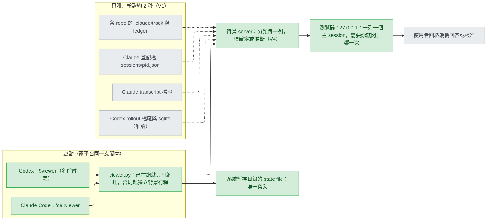

# agent-viewer-web-portal — stance

輸入：`.claude/track/agent-viewer-web-portal/intake.md`（2026-09-25 核准，AC1–AC7、Q1–Q3）、`discover.md`（地雷 1–8、AC 調整）、`discover-evidence.md`、使用者看過的 `mockup.html`。取捨已由使用者在 intake 以選單選定：「A 純讀檔輪詢」（`options-intake-approach.md`）、「兩邊都看」（`options-intake-codex.md`；當時推薦只看 Claude Code，使用者沒選）、「獨立行程」（`options-intake-launch.md`）。本文件把這三個答案寫成取捨與不變條件，沒有另選方向。

## Status

approved 2026-09-25

## Optimises for

同時開著好幾個 Claude Code 與 Codex 主工作階段（main session，終端機裡對話的那個行程）的人，約 3 秒內在一個本機網頁上看出哪一個在等他；被看的 agent 那一側什麼都不必改：不掛任何掛鉤（hook，平台在特定事件自動執行的指令），除了一個暫存狀態檔（state file）什麼都不寫。判準：AC4 的每個狀態各有一個合成測試資料（fixture）的測試（AC7），AC5 的寫入邊界有測試。

## Sacrifices

- **狀態讀自平台的內部檔案，不是承諾過的介面。** 對話紀錄（transcript）：「The entry format is internal to Claude Code and changes between versions, so scripts that parse these files directly can break on any release.」（https://code.claude.com/docs/en/sessions.md ）。登記檔（registry）目錄只有用途有文件：「holds one small file per running session, used to detect concurrent sessions and crashes」（https://code.claude.com/docs/en/claude-directory.md ），欄位沒有。Codex 的紀錄檔（rollout）與 sqlite 資料庫查無文件（2026-09-25 查詢）。平台一改格式，列就讀錯或消失，要等使用者看到才知道。
- **Codex 的列比 Claude 的弱，而且會一直弱。** 行程與 thread 沒有連結，同時開多個 Codex 時「還活著」是推斷（`discover-evidence.md` U3）；等權限在 rollout 裡沒有痕跡（U5），只能從「工具呼叫太久沒結果」推成黃燈；cai 對應退回以 cwd 找 `.claude/track/current`，同一 cwd 的多個 Codex 顯示同一條 track（AC3）。
- **Claude 的「需要你」確定，細分只到排除法。** `waiting` 在提問與權限提示各觀察到一次（U1）；「最後不是未答的提問就是權限」是排除法，其他會造成 `waiting` 的情況沒觀察過。登記檔另有 `waitingFor` 欄位，只見過一個值 `input needed`（`~/.claude/sessions/20648.json`，2026-09-25 讀取）。`busy` 會過時（39300 標了 140 分鐘，原因不明）。
- **有延遲，也有一個常駐行程。** 輪詢約 2 秒一次、約 3 秒才反映（AC4）；viewer 在發起的 session 關掉後仍在跑，直到 `stop` 或重開機，期間開著一個 127.0.0.1 的 port（Q3）。
- **只能看，不能答。** 回答提問、核准權限、簽核仍在終端機做（`mockup.html:259`）。
- **macOS 沒有承諾。** 只承諾 Windows 與 Linux（AC1）；Linux 的啟動流程與 `procStart` 格式本機測不了，CI 只驗純邏輯（`discover.md:41`）；macOS 沒有任何涵蓋（`CLAUDE.md:155-157`）。

## Invariants

**This system's:**

- V1 — 唯讀：唯一會寫的是系統暫存目錄裡的 state file；不寫 `~/.claude`、`~/.codex` 或任何 repo；兩平台的 hook 設定不改；不開 `~/.codex/auth.json`；sqlite 只以唯讀開啟；紀錄檔只讀尾端固定位元組數（AC5）。
- V2 — 不碰被看的行程：判斷存活不送任何 signal 或主控台事件。Windows 上 `signal.CTRL_C_EVENT == 0`（本機 Python 3.13.5 印出 `0`），而 `os.kill` 對它「can only be sent to console processes which share a common console window」、其他值則「unconditionally killed by the TerminateProcess API」（https://docs.python.org/3/library/os.html#os.kill ），所以任何探測都不得呼叫 `os.kill`（地雷 4），並有測試證明。
- V3 — 資料不離開本機回送位址（loopback，127.0.0.1）：只綁 127.0.0.1；Host 標頭不是本機名稱的請求一律拒絕，防 DNS rebinding（惡意網頁把自己的網域解析到 127.0.0.1 來讀資料，地雷 5）。
- V4 — 推斷永遠標成推斷：畫面上每個狀態都標明「確定」或「推斷」；讀不懂的紀錄顯示「未知」，不歸入任何確定狀態。
- V5 — 一支腳本服務兩個平台：兩邊的技能指令（skill）呼叫同一支只用 Python 內建函式庫（stdlib）的腳本，Codex 那份由 gen-codex 照常產生，不另寫一份（AC1、AC6）。
- V6 — 生命週期與發起的 session 無關：發起端結束後仍在；一個暫存目錄最多一個實例；已在跑只印網址；`stop` 會把它關掉（AC1）。
- V7 — 進入「需要你」時閃爍並響一次，不重複；聲音必須先由使用者在頁面上點一次才啟用（AC4、`mockup.html:237`；瀏覽器是否一定要求這一步未查文件，UNVERIFIED，但這一步已隨 mockup 核准，照留）。

**Cross-project:**

- `CLAUDE.md`「Who a file is for」：腳本與兩個 skill 是 Theirs，不得假設這個 repo 的佈局；`plugins/cai-codex/` 只由 `scripts/gen-codex.py` 產生，手寫檔以 `HAND_WRITTEN` 為準（`scripts/gen-codex.py:81-89`）；改到 `plugins/cai/` 要 bump 版本並跑 `--release`。
- gen-codex 的 `DENY_LIST`（`scripts/gen-codex.py:126-134`）與 `rewrite()`（`:267-282`）對 viewer 以外的每一個產出檔照舊生效，一條都不放鬆。
- 出貨的腳本不依賴第三方套件（`plugins/cai/scripts/track_state.py:2`、`usage_collector.py:2-3`「Zero deps」）；使用者規則不准替使用者安裝套件（`plugins/cai/rules/workflow.md:21`）。
- `CLAUDE.md`「Before pushing」：`validate.py`、`pytest` 全綠，無 BOM，`.cmd` 純 ASCII；CI 只看得到 Linux。

## Rejected stances

- **B：hook 寫狀態檔。** 權限等待也能確定，但每位安裝 cai 的人、每次事件都付一個 Python 行程，不管開不開 viewer；輸在「agent 那一側什麼都不必改」。使用者選 A（`options-intake-approach.md`）。C（A 加選用 hook）保留為黃燈太常出現時的下一步，這一版不做。
- **只看 Claude Code。** Claude 側證據強得多、工作量約一半；輸在「一個畫面看到所有主 session」。使用者選兩邊都看，接受 Codex 的推斷（`options-intake-codex.md`）。
- **綁在 session，或終端機指令。** 前者發起的 session 一關畫面就斷；後者要改使用者的 PATH，複製出去的那份不隨 plugin 更新（`options-intake-launch.md`）。
- **只顯示確定的狀態，推斷的不顯示。** 能守住「不說錯」，但 Codex 的等權限整個看不見，而那正是使用者要看的；使用者看過並接受 mockup 的黃燈（`mockup.html:432-434`）。

## Use cases / Issues

- UC1 — 啟動：Claude Code 下 `/cai:viewer`、Codex 下 `$viewer`（名稱為 intake 假設）印出網址；發起的 session 關掉後網頁仍在更新。判準：AC1 的生命週期測試，加 verify 在 Windows 實機跑一次。
- UC2 — 再下一次只印網址；`stop` 結束並刪 state file；pid 已不在的殘留 state file 視為沒在跑。判準：AC7 的生命週期測試。
- UC3 — 一個主 session 一列，Claude 與 Codex 同一張表，每列有平台、專案、名稱、最後動作、距上次活動多久；subagent 與 `codex exec` 不列；已結束的幾秒內消失。判準：AC2 的 fixture。
- UC4 — 需要你的列亮起並響一次：提問未答、一輪做完、Claude 的 `waiting`、Codex 推斷的等權限（黃燈）。判準：AC4 每個狀態一個 fixture。
- UC5 — cai 的列顯示六階段進度與兩道人工關卡；Codex 以 cwd 對應的標「推斷」。判準：AC3 的 fixture。
- UC6 — 主題切換記在瀏覽器；聲音一次點擊啟用；「已讀」停止閃爍。判準：verify 對照 `mockup.html` 手動核對。
- R1 — mockup 對 Claude 列寫「讀檔分不出權限等待和工具還在跑」（`mockup.html:260`），已被推翻（地雷 1）；正式版不得沿用。

## Overview

看哪裡：灰色的四個資料來源只有虛線指向 server，沒有任何箭頭指回去（V1）；唯一實線寫入的綠框是暫存目錄的 state file。最後一格「回終端機」是灰的：網頁只負責讓人看見，回答仍在原地做。

## Out of scope

- 遠端存取、從網頁回答或核准、任何 hook（intake 問題陳述）。
- 留給 Decisions，其中前兩項屬「誰能做什麼」，依 `stage-design.md` 預設為高成本：
  - 誰能讀這個網頁。只綁 127.0.0.1 時，同一台機器的其他帳號也連得到（Codex 沙箱帳號 CodexSandboxOffline 就能開 port、讀 `~/.claude`，U2）；連帶：頁面顯示多少對話內容（mockup 顯示提問原文與使用者訊息，`mockup.html:289-303`）。
  - Codex 版在沙箱外執行（比照 `plugins/cai-codex/skills/models/SKILL.md:69-70` 請使用者核准）或以沙箱帳號執行（U2 顯示可行，但 `stop` 與 state file 跨帳號）。
  - Claude 列的來源：直接讀登記檔，或呼叫有文件的 `claude agents --json`。該頁寫「The `claude agents` command opens agent view, a terminal interface for managing multiple background Claude Code sessions」（https://code.claude.com/docs/en/agent-view.md ）；據文件查詢的轉述，`--json` 輸出含 `status`、`waitingFor`、`pid`、`sessionId`，與登記檔欄位重疊（未逐字核對）。它列不列終端機裡的一般 session、每 2 秒起一次的成本，都 UNVERIFIED。
  - 列的鍵（pid+procStart）與存活檢查：當掉的 session 會留下登記檔，「clears crash leftovers on the next launch」（claude-directory.md），所以存活檢查必須擋得住殘檔；cai 對應規則（地雷 3）；Codex 存活的判斷來源（行程列舉、sqlite、rollout 修改時間）；Claude `waiting` 的細分與 `waitingFor` 能否取代排除法。
  - 單一實例與 `stop` 的機制（地雷 5 提的帶 token 身分與 shutdown 端點）；gen-codex 豁免的形狀；預設 port；state file 格式。
- 需求缺口（對人會怎麼反應的假設，要有人拍板）：推斷的等權限響不響（intake 假設只亮不響）；「一輪做完」響不響（mockup 有開關，`mockup.html:553`）；不列 `codex exec`。
- 留給 verify：真實 Codex TUI 由模型啟動；TUI 結束時會不會收掉子行程（`discover.md:39`）。
- `docs/` 被 git 忽略；本檔要進 PR 需在 ship 時 `git add -f`。
