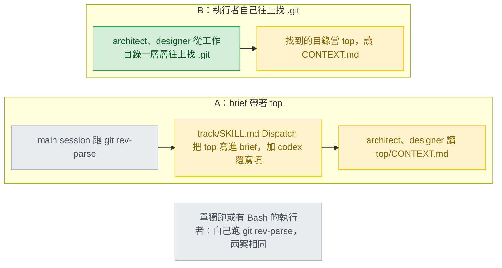

# cross-track-glossary — decisions

名詞（第一次出現的英文詞，先給中文意思）：track 是一個功能從 intake 走到 ship 的流程，stage 是其中一段，依序是 intake（定需求）、discover（找未知）、design（設計）、build（實作）、verify（審查）、ship（合併出貨）。Detail design 是可以直接照著寫程式的細部設計，它的 `## Glossary`（詞彙表）每列是「詞｜定義｜Where it lives（在程式裡的位置）」。PR 是 pull request，合併前的審查單位。main session 是本人直接對話的 Claude；subagent 是它派出去、沒有提問工具的子代理；派工時交給 subagent 的說明叫 brief。讀取點（read point）是開頭先讀 `<top>/CONTEXT.md` 的四個程序步驟（AC1）；`<top>` 是專案頂層目錄，也就是 `git rev-parse --show-toplevel` 印出的那個（stance:5）。選單（menu）是 2–4 個選項、外加一個自由輸入（free text）欄的提問。錨點（anchor）是 `scripts/codex-overrides.json` 用來定位原文的那幾行，覆寫項（override）是其中一筆「anchor 換成 replacement」的資料。Tier 1 要本人回答，Tier 2 列出來給人掃過，Tier 3 只記錄。origin test（來源測試）問的是：一個選項會失敗，是因為技術事實，還是因為對人行為的假設；需求缺口（requirement gap）是失敗條件建立在「人會怎麼做」的選擇；否決條件（veto condition）是改寫成能直接刪掉選項的需求。conformance lens 是 verify 裡逐條對照需求的審查角度。deny list 是 `gen-codex.py` 禁止出現在 Codex 產出裡的字串清單。rewrap 是不改字、只重新換行。待答問題（`## Pending questions`）是 subagent 答不了、交給 main session 代問的問題；重新派工（re-dispatch）是問完之後，main session 帶著答案再派一次同一個 stage 的 agent。T1–T6 是 `## Tier 3` 表格下方的逐字文字，build 照抄。

## Reference

- Stance: `docs/design/2026-09-25-cross-track-glossary-stance.md` — status: approved 2026-09-25。下文的 `stance:N` 指這個檔的第 N 行。
- Intake：`.claude/track/cross-track-glossary/intake.md`（AC1–AC12 已核准）。Round 2 的取捨題答案是「A：只改文字 (Recommended)」，確立 S5：凡需要新 script、新 `validate.py` 檢查或 `tests/` case 的選項，一律進 `## Ruled out`。
- 補一個 stance 漏列的同步點，不動任何不變式：`codex-overrides.json:753-761` 的錨點是 `CLAUDE-project.md.tpl:25`，這一行就在 AC8 要加句子的 `## Conventions` 註解裡（`:24-26`）。S6 只列了 `:735`、`:745`。錨點必須恰好出現一次（C8），所以 AC8 的句子只能從 `:26` 接著寫（見 Tier 3）。
- 查證 stance 與 intake 留下的兩件事：`track/SKILL.md` 本文照 `validate.py:2122-2123` 的算法是 128 行（C7；intake.md:72 記的 129 不對）。`CLAUDE-project.md.tpl` 沒有任何 CRLF（C10），`codex-overrides.json:740` 的 why 欄寫錯了，只記錄不修。Round 3 只有 D1 一條 Tier 1；README 那題（stance R6）過不了 origin test，改列 `## Requirement gaps` 的 G2。
- Round 4（2026-09-25）：本人答了 D1（選 A）與 G2（接受否決條件）。答完重跑成本測試：D2–D4 不碰 `<top>` 也不碰 README，位置不變；多出一個只有 D1=A 才有的選擇，發現時間是發布後，所以進 Tier 2 成為 D5；Tier 3 刪 1 列（D1=B 的往上找規則）、新增 3 列、改寫 14 列，並在表格下方附上 T1–T6。沒有條目回到 Tier 1。

## Feasibility

| Id | Capability | Verdict | Evidence |
|---|---|---|---|
| C1 | track 裡跑 intake 的是 architect，工具只有 Read／Grep／Glob，沒有 Bash，跑不了 `git` | verified | `plugins/cai/skills/track/stages.json:3`；`plugins/cai/agents/architect.md:7` |
| C2 | track 裡跑 design 的是 designer，Bash 只准 `python`／`py`／`python3`／`mmdc`；diagnosis 模式的 debug 步驟 1–4 也是它在跑 | verified | `stages.json:7`；`plugins/cai/agents/designer.md:8`；`plugins/cai/skills/track/references/stage-design.md:218-232` |
| C3 | procedure-scan 的 Step 1 由跑 refactor skill 的人執行。這個 skill 的 frontmatter 沒有 `context`／`agent`，所以就是 main session。refactoring-detector 只在 Step 4 被派出，而且不讀 procedure-scan | verified | `plugins/cai/skills/refactor/SKILL.md:1-5`、`:77`；`plugins/cai/skills/refactor/references/procedure-scan.md:10-13`、`:33-38`；`plugins/cai/agents/refactoring-detector.md:4`、`:13-14` |
| C4 | `/cai:debug`、`/cai:intake`、`/cai:design`、`/cai:build` 單獨跑時都在 main session 執行，沒有任何 skill 用 `context: fork` | verified | `plugins/cai/skills/debug/SKILL.md:1-4`；`plugins/cai/skills/intake/SKILL.md:1-13`；`plugins/cai/skills/build/SKILL.md:1-13`；Grep `^(context\|agent):` 在 `plugins/cai/skills` 零命中 |
| C5 | track 裡跑 build 的是 implementer，Bash、Write、Edit 都不設限。在 Codex 上，stage-build 由 main session 直接讀、自己派 helper | verified | `stages.json:9`；`plugins/cai/agents/implementer.md:6`；`scripts/codex-overrides.json:58-70`、`:98-105` |
| C6 | main session 在 Preflight 就拿著專案根目錄。Dispatch 那一步只叫 agent 去讀它的 reference 檔，今天並不把 `<top>` 交給 agent | verified | `plugins/cai/skills/track/SKILL.md:49-52`、`:53-57` |
| C7 | `track/SKILL.md` 本文 128 行，上限 130。AC10 不准增加行數。這個檔本來就有遠超 80 字的長行，所以一個子句可以靠 rewrap 塞進去，不必多一行 | verified | `python -c` 照 `scripts/validate.py:2122-2123` 的算法數出 128；round 4 把 T1 的五行在記憶體裡換進去再照同一算法數，仍是 128，舊的五行在檔裡恰好出現 1 次（scratchpad 的一次性 python，不寫任何檔）；`validate.py:2118`；`intake.md:43`；`track/SKILL.md:69`、`:88`、`:89` |
| C8 | override 的 anchor 必須在目標檔恰好出現一次，否則 gen-codex 失敗。`codex-overrides.json:91-95` 一字不差地錨定 `track/SKILL.md:53-57`，替換文字在 `:98-105` | verified | `scripts/gen-codex.py:246-248`；`scripts/codex-overrides.json:89-106` |
| C9 | `codex-overrides.json:474-475` 錨定 `stage-build.md:8-9`（含「Step 0.5's two answers」），`:478-479` 是替換文字 | verified | `scripts/codex-overrides.json:471-482`；`plugins/cai/skills/track/references/stage-build.md:8-9` |
| C10 | `CLAUDE-project.md.tpl` 有四條 override，錨定 `:3`、`:4`、`:25`、`:32`。Codex 沒有任何 skill 用到這個模板。檔案是 LF，不是 CRLF | verified | `scripts/codex-overrides.json:733-771`（`:730` 寫明 unreachable）；Grep `CLAUDE-project` 只命中 `plugins/cai/skills/setup/SKILL.md:92`、`:103`，而 `skills/setup` 被排除（`gen-codex.py:49`）；python 數出 CRLF 0、LF 32；`.gitattributes:11` |
| C11 | deny list 在所有檔都擋 `AskUserQuestion` 與 `~/.claude/`。`CLAUDE.md` 只在 `rules/`、`agents/` 底下被擋。沒有任何規則提到 `CONTEXT.md`。新的 `templates/CONTEXT.md.tpl` 會自動帶進 Codex tree | verified | `scripts/gen-codex.py:126-134`、`:143`、`:291`、`:303`；`:47-54`、`:195-198`（templates 不在排除清單） |
| C12 | `stage-build.md` 現在的樣子：`:9`、`:54`、`:61-62` 寫「two」；Step 0.5 兩個 bullet 在 `:65-71`；Step 1 的 notes 段落在 `:88-103`；Step 6 在 `:247-261`，第 2 項在 `:255-258`；`## Report` 的欄位在 `:270-273` | verified | `plugins/cai/skills/track/references/stage-build.md:9`、`:54`、`:61-62`、`:65-71`、`:88-103`、`:247-261`、`:255-258`、`:270-273` |
| C13 | `approval-gates.md:148-149` 寫「commit per unit, and the parallel lane. Two decisions, so two turns.」。選單 2–4 個選項，自由輸入由工具自動加上 | verified | `plugins/cai/skills/track/references/approval-gates.md:11`、`:21-23`、`:148-149` |
| C14 | Read 會把 Markdown 檔裡的 HTML 註解原樣帶進 context；只有 `CLAUDE.md` 在自動注入時才會剝掉註解 | verified | https://code.claude.com/docs/en/memory ：「When you open a CLAUDE.md file directly with the Read tool, comments remain visible.」（由 chore subagent 抓取）；這一輪 Read `templates/design-decisions.md.tpl` 時，`:1-17` 的註解原樣出現 |
| C15 | `stage-build.md` 被釘住的地方：`state.md` 出現 3 次；Step 1、Step 6 各有一句不能動；`:1951` 只是標籤，真正的檢查在 `:1957-1959` | verified | `scripts/validate.py:1881`、`:1999-2002`、`:1810-1814`、`:1951`、`:1957-1959`；`docs/rule-provenance.md:76-77`、`:83-84` |
| C16 | `/cai:goal` 的逐單元 lane 照 `stage-build.md` 跑；goal 本來就會用選單提問 | verified | `plugins/cai/skills/goal/SKILL.md:75-79`、`:25-26`、`:44` |
| C17 | 只有 Detail design 的模板有 `## Glossary`，三欄，最後一欄可以是 `concept` | verified | Grep `^## Glossary` 在 `plugins/cai/templates` 只命中 `design-detail.md.tpl:53`；`design-detail.md.tpl:61-65`、`:68-70` |
| C18 | track 的 subagent 在 Step 0.5 的提問，全部放進同一份 `## Pending questions` 報告交回；main session 一題一回合問完，再派一次工。最多三輪 | verified | `stage-build.md:7-13`；`plugins/cai/skills/track/references/pending-questions.md:56-66` |
| C19 | 「從工作目錄往上，第一個有 `.git` 的目錄」在所有情況都等於 `git rev-parse --show-toplevel`（worktree、submodule、有設 `GIT_DIR` 的都算），而且 architect 用 Read／Glob 就能判斷 `.git` 在不在 | UNVERIFIED | 沒有抓 git 官方文件；Glob 會不會略過 `.git` 也沒查。已知的只有 architect 的工具清單（`plugins/cai/agents/architect.md:7`）。D1 選項 B 靠的就是這條 |
| C20 | README 目前寫到 cai 會留在使用者 repo 的每一種檔：track 的 `state.md`、ledger、implementation notes、`docs/design/`，以及 setup 加的專案 `CLAUDE.md`。`validate.py` 不檢查 README 的內容 | verified | `README.md:229-236`、`:505-507`；Grep `README` 在 `validate.py` 只命中 hook 測試案例 `:826`、`:2362`、`:2390` |
| C21 | designer 可以把自己做不到的指令寫成 request 交回給 main session 代跑，但每次交回都會用掉三輪上限中的一輪 | verified | `stage-design.md:227-245`；`pending-questions.md:65-66` |

## Ruled out

| Option | Invariant it violates | Evidence |
|---|---|---|
| `<top>` 直接用工作目錄（cwd） | S4：只讀 `<top>/CONTEXT.md` 這一個檔。從子目錄開 session 時，會讀到另一個檔，或在檔案其實存在時什麼也沒讀到 | stance:31、:5；C6 |
| 讓 designer 用 `python -c` 呼叫 `subprocess` 去跑 `git rev-parse`（C2） | cross-project：各 agent 的工具範圍以它自己的 frontmatter 為準；這樣做是繞過 `designer.md:8` 的範圍 | stance:40；`plugins/cai/agents/designer.md:8` |
| 用 `validate.py` 釘住四個讀取句，或加一個印出 `<top>` 的 script | S5，而且本人 round 2 已經選「只改文字」 | stance:32、:44 |
| 模板裡放一條看得見的範例條目，建立 `CONTEXT.md` 時整份照抄 | S2：範例詞沒出現在本人回答過的選單裡，卻被寫進去了 | stance:29；`CONTEXT-FORMAT.md:12-22`（來源的範例就是這種寫法） |
| 讀取點也讀 `CONTEXT-MAP.md` 或子目錄的 `CONTEXT.md` | S4：只讀一個檔 | stance:31、:107 |
| 逐詞勾選的選單 | cross-project：選單只能有 2–4 個選項 | stance:40、:48；C13 |
| 在 ship 或 `/cai:track done` 寫入 | S3：唯一的寫入點是 build 的 Step 6 | stance:30 |
| 把 Detail design 的 Glossary 整列照搬，連 Where it lives 欄一起 | S1 | stance:28；C17 |

## Requirement gaps

| # | The behavioural assumption | Veto condition, or verification path | Deletes |
|---|---|---|---|
| G1 | 分組是 implementer 在沒人在場時做的判斷。這個設計成立的前提是：本人會真的讀兩組，而不是直接按 recommended（stance R8，stance:64） | 否決條件（stance 已核准，就是 S2，stance:29）：選單訊息沒有逐條列出詞名與理由的詞，一律不寫入；取代既有定義時，新舊定義並列。驗證途徑：AC11 那條真實 track 記下本人有沒有用自由輸入改動分組。這一輪不需要新答案 | 刪掉只列組名或詞數的選單訊息，以及寫入訊息沒點名的詞的任何做法 |
| G2 | README 要不要提 `CONTEXT.md`（stance R6，stance:62）。兩個選項的失敗條件都是讀者行為：選「加一句」，是賭使用者會從 README 得知 cai 寫了什麼檔；選「不加」，是賭使用者看選單訊息就夠了。兩邊都過不了 origin test，所以整題交回，不拆 | 否決條件：「cai 會寫進使用者 repo、並進入版控的每一種檔，README 都要點名。」就這一輪查到的幾種檔而言，現況符合這條（C20：`README.md:229-236`、`:505-507`；`.claude/cai.json` 見 `README.md:196`）。**已解決：**本人 2026-09-25 答「A：接受，README 加一句 (Recommended)」，這條否決條件從此是需求 | 已刪掉「README 不改」。build 在 `README.md:126` 的 `/cai:build` 列、「User-invoked only.」之前加一個子句（Tier 3 的 README 列，逐字文字 T3） |

## Tier 1

只有一條，本人已回答（見 D1 的 `Decided:`）。答完之後重跑成本測試：Tier 3 裡原本標著「D1=B」的那一列失去作用，已刪除；標著「D1=A」的幾列改成確定的做法，逐字文字放在 T1、T2。D1=A 另外帶出兩個新選擇：重新派工時 brief 裡的 `<top>` 從哪裡來（發現時間是發布後，所以不能放 Tier 3，進 Tier 2 成為 D5），以及 build 的單元 brief 要不要帶 `<top>`（三項都低，進 Tier 3）。D2–D4 都不碰 `<top>`，沒有移動。G2 是需求缺口，不是決定；本人接受了它的否決條件，結果記在 `## Requirement gaps`。

### D1 — track 裡沒有 git 可用的讀取點（intake 的 architect、design 的 designer），`<top>` 從哪裡來？



看圖的重點：兩案只差在 architect 與 designer 的 `<top>` 從哪裡來。A 多改一個有行數上限的路由檔，外加一組 Codex 覆寫項；B 不碰路由檔，但 intake 與 design 的讀取句要寫出往上找的規則，而那條規則沒有查證過（C19）。

| Option | Rests on | What it costs | Fails when |
|---|---|---|---|
| A — main session 在每次派工時，把 `git rev-parse --show-toplevel` 的輸出寫進 brief。`track/SKILL.md:53-57` 用 rewrap 加一個子句，不增加行數（AC10）。`codex-overrides.json:91-95` 的 anchor 與 `:98-105` 的 replacement 在同一次改完。讀取句寫成：track 裡看 brief；單獨跑就自己跑 `git rev-parse`；兩者都沒有時，當作檔案不存在 | C1、C2、C4、C6、C7、C8 | 路由檔多一個子句（C7）；一組覆寫項，要跟原文同步（C8）；每個 stage 的 brief 多一行路徑 | main session 漏寫 brief 裡那一行。這時讀取點會安靜地不讀，因為 S4 規定不提 |
| B — 路由檔不改。讀取句寫成：有 git 的人跑 `git rev-parse --show-toplevel`；沒有的人從工作目錄往上找，第一個有 `.git`（目錄或檔案）的那一層就是 `<top>` | C1、C2、C19 | intake 與 design 兩處讀取句要帶這條往上找的規則（debug 在 track 裡由 designer 跑，它在 design 的讀取點已經讀過；procedure-scan 由 main session 跑，C3）；它跟 `git rev-parse` 結果相同這件事沒有查證（C19） | worktree、submodule 或 `GIT_DIR` 的情況下找錯目錄；或 Glob、Read 看不到 `.git` |

不列入比較的做法：`<top>` 直接用 cwd，以及讓 designer 用 python 呼叫 git，都在 `## Ruled out`。請 main session 代跑 `git rev-parse`（照 C21 的前例）每次 design 都要用掉三輪中的一輪，而得到的東西跟 A 一樣，所以劣於 A。讀取句只寫「專案頂層目錄」、讓執行者自己想辦法，跟 B 一樣不改路由檔，卻沒說怎麼找，劣於 B。

- **Blast radius:** A：`track/SKILL.md`、`codex-overrides.json`，加四個讀取句。B：四個讀取句。
- **Found out when:** 發布後。沒有任何測試或檢查會發現讀取點安靜地沒讀，S5 也不准新增。
- **Undo cost:** 改文字，A 還要改一組覆寫項。已經寫出的 `CONTEXT.md` 不受影響，因為寫入點（implementer）有 Bash（C5）。
- **Decided:** A — 「A：brief 帶 <top> (Recommended)」（本人，2026-09-25）

## Tier 2

### D2 — Step 0.5 的第三個選單排第幾個？

選排在最後：先問「每個單元都 commit」，再問「平行 lane」，最後問 Glossary 併入。依據有三。第一，一次一個決定，先問會限制其他答案的那一個（`plugins/cai/rules/epistemics.md:22-24`、`approval-gates.md:31-33`）。第二，commit 的答案會關掉平行 lane（`stage-build.md:65-68`），也決定 Step 6 寫入後要不要 commit（AC4，intake.md:37）；Glossary 的答案則不限制前兩題。第三，三題放在同一份 `## Pending questions` 交回，不多用一輪（C18），所以順序只影響問的先後。**Found out when:** 發布後，第一條真實 track（AC11）。

### D3 — 從模板建立 `CONTEXT.md` 時，模板的 HTML 註解留不留？

選留下，並且範例條目只放在註解裡。Read 會把註解原樣帶進 context（C14），所以代價是：每個讀取點每次都要多讀這幾行（Tier 3 把註解限制在 8 行以內）。整段刪掉的話，AC7 那條「`_Avoid_` 那一行可由人事後手寫」的說明，就到不了真正要手寫的人手上（intake.md:29、:40）。範例條目如果放在註解外面，會變成沒人核准的詞，這違反 S2，已列在 `## Ruled out`。**Found out when:** AC11 那條 track 的 PR diff，因為建立出來的檔一定經過 PR（S3，stance:30）。

### D4 — `/cai:goal` 的逐單元 lane 也要問第三題嗎？

選要問，而且 `goal/SKILL.md` 不改。那條 lane 照 `stage-build.md` 跑（C16，`goal/SKILL.md:75-79`），goal 本來就會用選單提問（`goal/SKILL.md:25-26`、`:44`）。AC6 列出的「不問」情況裡也沒有 goal（intake.md:39）。另一個做法是把 goal 排除，但那要在 `stage-build.md` 或 `goal/SKILL.md` 多寫一條例外，超出 AC 的範圍。**Found out when:** 發布後，第一次有人對一份有 Glossary 資料列的 Detail design 跑 `/cai:goal`。

### D5 — 重新派工時，brief 也帶 `<top>` 嗎？要不要在 `pending-questions.md` 另寫一次？

選不另寫，`pending-questions.md` 不改。main session 把 stage 交給 agent 的規則只有 Dispatch 這一步（C6，`track/SKILL.md:53-57`，改法見 T1），而 `pending-questions.md:59` 重新派工交給的是「the same stage's agent」；讀 Dispatch 與 `pending-questions.md` 的也是同一個人：main session（`pending-questions.md:3-6`）。另寫一次只是同一條規則的第二份拷貝，不會多一道檢查（S5 不准加，stance:32）；漏寫的後果是讀取點安靜地不讀，這正是 D1 選項 A 的「Fails when」，本人選 A 時已經接受。**Found out when:** 發布後：某條 track 的 intake 或 design 交回待答問題，重新派工那一輪沒讀 `CONTEXT.md`；沒有測試會發現。

## Tier 3

| Decision | Chose | Instead of | Found out when |
|---|---|---|---|
| 寫入點的 `<top>` | implementer 在 Step 6 跑 `git rev-parse --show-toplevel`（C5），跟 `stage-verify.md:29`、`setup/SKILL.md:98` 同一條指令。build 的 Step 0 本來就要求在 git 分支上（`stage-build.md:43-46`），所以寫入時不會碰到「不在 git 裡」的情況。D1=A 之後 build 的 brief 也會帶 `<top>`，但 Step 6 不引用它：單獨跑的 `/cai:build`（C4）與 Codex（main session 直接讀 stage-build，C5）都沒有 brief，只有 `git rev-parse` 在三種跑法下都成立，而且 brief 裡的 `<top>` 也是 main session 在同一個工作目錄跑同一條指令得到的 | 沿用讀取端的來源（brief 寫的 `<top>`） | 本 track 的 verify：conformance 對照 AC4 |
| 讀取點拿不到 `<top>`：brief 沒寫，執行者又跑不了 `git`（architect、designer，C1、C2）；或 `git rev-parse` 失敗（不在 git repo 裡） | 當作檔案不存在：不讀、不提（S4） | 報錯，或改讀 cwd（cwd 已被 `## Ruled out` 排除） | 本 track 的 verify：conformance 對照 AC1 |
| 四個讀取句的措辭 | 照逐字文字 T5 寫，只准依所在檔的寬度調整換行。每句都含這幾點：① 路徑是 `<top>/CONTEXT.md`；`<top>` 依序取 brief 寫的路徑，brief 沒寫就取 `git rev-parse --show-toplevel` 印出的目錄，兩者都拿不到就當作檔案不存在 ② 存在就先讀，沿用它的詞 ③ 不存在就不提，也不建議建立 ④ 只讀這一個檔 ⑤ 只讀不寫 ⑥ 段落裡找得到 `CONTEXT.md`，而且寫了存在、不存在兩種情況（AC1 的檢查）。`procedure-scan.md` 用 T5 的第二版，沒有 brief 那個分支：它只由 main session 跑，從來收不到 brief（C3） | 四處都寫 brief 分支；或由 build 自己定措辭 | 本 track 的 verify：conformance 逐條對照 AC1 |
| 讀取句放在哪裡 | `stage-intake.md`：`:19` 之後另起一段，仍在 Step 1 裡。`stage-design.md`：`:18` 標題與 `:20` 模式清單之間另起一段，前後各留一個空行。`procedure-scan.md`：接在 `:13` 後面，當 Step 1 的最後一句。`debug/SKILL.md`：在 `:43` 之前加一個 bullet，成為 Step 2 的第一個 bullet | 放在各檔開頭 | 本 track 的 verify：conformance 對照 AC1 的四個位置 |
| `<top>` 交給哪些 stage | Dispatch 那一句不分 stage，六個 stage 的 brief 都帶 `<top>`；只有 intake、design 用得到，其他四個不引用 | 只給 intake、design：Dispatch 那句要多一個條件子句，而 `track/SKILL.md` 已經擠不下（C7） | 下一條 track 的任一次派工：brief 裡看得到 `<top>` |
| `stage-build.md` Step 3 第 2 項（單元 brief）要不要帶 `<top>` | 不改。單元的 implementer 不讀也不寫 `CONTEXT.md`；寫入在 Step 6，由跑這個 stage 的人自己跑 `git rev-parse`（本表第一列）。Step 4 的平行 lane 也不受影響：worktree 在 `:192-193` 就移除了，Step 6（`:247-255`）在所有單元完成後才跑 | 在 brief 的清單（`:134-143`）加一項 `<top>` | 本 track 的 verify：conformance 對照 AC4 |
| refactoring-detector 的派工（`procedure-scan.md:37-38`） | 不改。AC1 只要求 Step 1 讀（C3） | 把 `CONTEXT.md` 的詞一起交給 detector | 本 track 的 verify：conformance 對照 AC1 |
| 第三個選單什麼時候問 | build 要讀的那份設計文件有 `## Glossary`，而且至少一列不是模板的佔位列 `\| … \|`（`design-detail.md.tpl:70`）。只有 Detail design 有這個標題（C17），所以 AC6 列的各種情況自然不會問 | 看檔名是不是 `-detail.md` | 本 track 的 verify：conformance 對照 AC2、AC6 |
| 分組怎麼判斷 | Where it lives 欄是 `concept` 的，傾向「提議併入」；是 `file:line` 或 `new — path` 的，傾向「不併入」。最後用 `CONTEXT-FORMAT.md:29` 的問題判斷：這是這個專案獨有的概念，還是一般的程式概念？每個詞附一句理由 | 只看 Where it lives 欄 | 選單訊息本身：寫入之前，本人就看得到每個詞放在哪一組、理由是什麼（S2、G1） |
| 第三個選單訊息的格式（交給 build 照寫） | 形狀照 T6，用本人的語言：一句說明（這些詞會在 Step 6、verify 之前寫進 `<top>/CONTEXT.md`，所以會進 PR）；「提議併入」組每詞一行，寫成 `**詞** — 將寫入的定義。理由：一句`（定義照抄 Glossary 的 Definition 欄，本人用自由輸入改過的就用改過的），已有同名詞時下一行加 `取代：<現有定義原文>`；「不併入」組每詞一行 `**詞** — 理由：一句`（例如是檔名、函式、欄位）；最後一句「要把詞移到另一組、刪掉某個詞或改定義，請用自由輸入」。選項只有兩個，整組選：「照提議併入 (recommended)」與「全部不併入」，自由輸入由工具自動加上（C13）。「提議併入」是空的就不問。track 裡的交回與 lint 由 `stage-build.md:7-13` 與 `pending-questions.md:41-55` 既有的流程處理，新 bullet 不重述 | 每個詞一個選項 | AC11 那條 track |
| Step 0.5 的文字（C12） | `:54` 整行改成 `## Step 0.5 — Say what it will cost, then get up to three answers`。`:61-63` 改成「Then up to three answers, once for the whole run and not per unit. Up to three decisions, so up to three menus on as many turns — `references/approval-gates.md` holds the shape, and none is a sentence the person types a word back into:」，換行由 build 定。`:71` 之後加第三個 bullet，以 ``- **Which glossary terms join `CONTEXT.md`.**`` 開頭，內容是本表「什麼時候問」與「訊息的格式」兩列，另外寫明三題放進同一份待答問題交回（C18） | 標題 `:54` 維持「two answers」 | 本 track 的 verify；另外用 Grep 查 `two answers`，在 `plugins/cai` 底下應為 0 筆 |
| `stage-build.md:9` 與它的覆寫項 | `:9` 整行改成 ``whatever `tools:` says. Step 0.5's answers, and Step 2's row that sends``，`:8`、`:10` 不動。`codex-overrides.json:475` 的 anchor 第二行改成同一行字；`:479` 的 replacement 改成 ``Step 0.5's answers, and Step 2's row that sends``。三處同一次改 | 只改原文 | 下一次 `python scripts/gen-codex.py`：anchor 對不上就 exit 1（C8、C9） |
| `approval-gates.md:148-149` | 改成「`stage-build.md` Step 0.5 — commit per unit, the parallel lane, and, for a detail design whose glossary has project terms, which of them join `CONTEXT.md`. Up to three decisions, so up to three turns.」 | 只改數字 | 本 track 的 verify：conformance 對照 AC9 |
| `validate.py:1951` 的標籤 | 改成 `"Step 0.5's answers"`，其他不動（C15） | 不改 | 下一次 `python scripts/validate.py` |
| AC3：答案記在哪裡 | Step 1 在 `:95`（「Say in the notes which design document the table belongs to.」）後面加一小段：把 Step 0.5 的 Glossary 答案記進 `implementation-notes.md`，包括最後定案的詞、每個詞要寫入的定義、以及被取代的舊定義。這段不寫 `state.md` 這個字（C15） | 另開一個檔 | 下一次 `validate.py`（`state.md` 次數必須維持 3）；本 track 的 verify |
| AC4：Step 6 的寫入 | 在 `:254` 與 `:255` 之間插入新的第 2 項，原本的 2、3 項改成 3、4。內容：最後定案要併入的詞是 0 個（第三個選單沒問、答「全部不併入」，或用自由輸入刪光）時，整項跳過：不建立檔案，報告也不提 `CONTEXT.md`（AC6）。否則在 `<top>` 找 `CONTEXT.md`，沒有就把 `${CLAUDE_PLUGIN_ROOT}/templates/CONTEXT.md.tpl` 整份照抄建立（D3）；每個新詞寫成一行 `**詞**: 定義`，詞名與定義在同一行，接在檔尾（模板的 `## Language` 與註解之後；人手改過的檔沒有這個標題也照樣接在檔尾）。同名詞（以 `**詞**:` 開頭的那一行，詞名完全相同、不分大小寫）整行換成 `**詞**: 新定義`，人手寫的 `_Avoid_` 行與分組小標題原樣保留。不寫 Where it lives。因為同名就換、不重複新增，中斷後重跑這一項，結果相同。Step 0.5 的 commit 答案是「是」時，照 Step 3 第 5 項的方式另外 commit 一次，這樣 Codex 那一側會沿用 `codex-overrides.json:73-86` 的做法，commit 訊息用 conventional commit 格式；答案是「否」就留在工作樹 | 詞名一行、定義另起一行；或在最後一個單元裡順便寫入 | 本 track 的 verify：conformance 對照 AC4；AC11 |
| AC5：conformance 收到什麼 | 新的第 3 項（原 `:255-258`）在「passing the design document」後面，再加上「and Step 0.5's glossary answer as recorded in `implementation-notes.md`」 | 只交設計文件 | 本 track 的 verify：conformance 對照 AC5 |
| 被取代的舊定義寫在哪裡 | 兩個地方：Step 6 的 Report 項（原 `:259-261`）逐條列出；`## Report` 的欄位清單（`:270-273`）多一個 bullet，寫「every `CONTEXT.md` definition replaced, old text quoted」 | 只寫在 notes | 本 track 的 verify：conformance 對照 AC4 |
| `templates/CONTEXT.md.tpl` 的內容 | 第 1 行 `# Glossary`；一句看得見的說明（這個檔只是詞彙表，只收這個專案獨有的概念，每個詞一兩句說它是什麼，不放決策或規格）；`## Language`；一段不超過 8 行的註解，寫範例格式（一行 `**Term**: 一兩句定義`，跟 Step 6 寫入的格式相同，出自 `CONTEXT-FORMAT.md:12-13`、`:28-29`），並說明 `_Avoid_` 那一行可由人事後手寫、build 不會寫。註解是檔案的最後一段。LF 行尾、沒有 BOM；不寫 `~/.claude/`、`AskUserQuestion`、`CLAUDE.md`（C11） | 照來源寫 `# {Context Name}`，那樣 build 得自己取專案名稱 | 下一次 `validate.py`（BOM 檢查）與 `gen-codex.py`（deny list）；本 track 的 verify 對照 AC7 |
| AC8：`CLAUDE-project.md.tpl` | 照 T4：`:22-25` 一字不改，句子接在 `:26` 的「guess.」後面，`-->` 移到最後。句子寫「this one」，不寫 `CLAUDE.md`，也不寫 `~/.claude/` | 把 `:24-26` 重新 rewrap | 下一次 `python -m pytest`（`tests/test_project_template_guard.py:24`）與 `gen-codex.py`（`:755` 的 anchor，C10） |
| Codex 版模板要不要加覆寫項（stance R5） | 不加。沒有 Codex skill 用到這個模板（C10），而上一列的寫法沒有碰到 deny list（C11） | 在 `codex-overrides.json:771` 後面加一條 | 下一次 `gen-codex.py`：寫了 `~/.claude/` 就會被 deny list 擋下 |
| `codex-overrides.json:740` 的 why 欄寫著 CRLF | 不改（C10） | 順手修正 | 不會浮現：gen-codex 只比對 anchor，不讀 why 欄（`gen-codex.py:246`） |
| `debug/SKILL.md` 的長度 | 目前 120 行，可以多一句；沒有任何程式檢查它的行數 | 為了守 120 行而改寫別的段落 | 下一次 `validate.py`：唯一的 120 行檢查是 `validate.py:170` 的 goal.md |
| `track/SKILL.md` Dispatch 的改法（D1=A） | `:53-57` 換成 T1 的五行：前兩行一字不改，第三行起 rewrap，末尾多「, and give it `<top>`, what `git rev-parse --show-toplevel` prints.」。本文仍是 128 行（C7）。同一次把 `codex-overrides.json:90-96` 的 anchor 與 `:97-106` 的 replacement 換成 T2，`why` 欄不動。`:69` 與 `validate.py:2148-2167` 釘住的 passing-path bullet 都不在這個範圍 | 另加一行（AC10 不准） | 下一次 `validate.py`：`skills/track/SKILL.md is within its 130-line ceiling (128)` 括號裡必須是 128；`gen-codex.py`（C8） |
| README 的子句（G2 已接受） | `README.md:126` 在「User-invoked only.」之前插入 T3 的那句，其他字不動。README 沒有程式檢查（C20），也不在 `plugins/` 底下，不需要 Codex 覆寫項 | README 不動（G2 的否決條件已刪掉這個選項） | 本 track 的 verify：conformance 對照 G2 的否決條件 |
| AC11 由誰做 | build 不做任何事；ship 的 report 在「what is left open」（`stage-ship.md:182`）列一項：下一條有 Detail design 的真實 track，確認出現第三個選單、`CONTEXT.md` 有寫入並進了 PR | 在 build 加一個自我檢查 | 本 track 的 ship：report 少了這一項，本人讀 ship report 時看得到 |
| 單元怎麼切 | 交給 build；建議切四個，風險高的先做。① `stage-build.md`、`approval-gates.md`、`codex-overrides.json:475`、`:479`、`validate.py:1951`（被釘住的句子最多）② 四個讀取點、`track/SKILL.md:53-57`、`codex-overrides.json:90-106`（T1、T2、T5）③ 兩個模板（T4）④ README（T3）、升版、gen-codex、`--release`、全套檢查 | 一次改完 | build 各單元的驗證指令 |
| 改動檔案範圍（build brief） | 只動這些：`plugins/cai/skills/track/references/stage-intake.md`（`:19` 後）；`plugins/cai/skills/track/references/stage-design.md`（`:18` 與 `:20` 之間）；`plugins/cai/skills/refactor/references/procedure-scan.md`（`:13` 後）；`plugins/cai/skills/debug/SKILL.md`（`:43` 前）；`plugins/cai/skills/track/references/stage-build.md` 的 `:9`、`:54`、`:61-63`、`:71` 後、`:95` 後、`:254-261`、`:270-273`；`plugins/cai/skills/track/references/approval-gates.md:148-149`；`plugins/cai/skills/track/SKILL.md:53-57`；新增 `plugins/cai/templates/CONTEXT.md.tpl`；`plugins/cai/templates/CLAUDE-project.md.tpl` 的 `:26` 起；`scripts/codex-overrides.json` 的 `:90-106`、`:475`、`:479`，不新增任何一筆（新文字沒有 deny list 的字串，C11）；`scripts/validate.py:1951`；`plugins/cai/.claude-plugin/plugin.json:3` 由 1.31.0 改成 1.32.0；`README.md:126`（C20）；`plugins/cai-codex/` 只由 gen-codex 產生，含 `--release 0.2.14` 改的 `plugins/cai-codex/.codex-plugin/plugin.json:3` | 另外動 `agents/*.md`、`goal/SKILL.md`、`pending-questions.md`（D5）、`stage-build.md` Step 3（本表「單元 brief」列）、`rules/`、`tests/`、`docs/rule-provenance.md`、`design-detail.md.tpl` | 本 track 的 verify：`git diff --stat` 裡唯一的 `.py` 是 `scripts/validate.py`，`tests/` 底下沒有任何改動（stance:13） |
| 必須一字不改的句子（S6） | build 前後各用 Grep 工具（不用 `grep.exe`）查一次：`stage-build.md:3-5`（`codex-overrides.json:58-60` 的錨點）；`:8`（`:474`）；`:88`「never in the design document itself」與 `:252-254`「never back into the design document's own `### Traceability`」（`validate.py:1810-1814`，`rule-provenance.md:76-77`、`:83-84`）；`:127`（`codex-overrides.json:486`）；`:155-156`（`:75-76`）；`:171-172`「Two lanes, never three」（`rule-provenance.md:25`）；`procedure-scan.md:35-38`（`rule-provenance.md:27`）；`CLAUDE-project.md.tpl` 的 `:3`、`:4`、`:22-25`、`:32`（`codex-overrides.json:735`、`:745`、`:755`、`:765`，以及 `tests/test_project_template_guard.py:24`；`:25` 就是 `:753-761` 那筆的錨點）；`track/SKILL.md:53-54`（T1 的前兩行）與 `validate.py:2158-2162` 釘住的 passing-path bullet；`approval-gates.md` 被檢查的字串（`validate.py:1966-1988`）。`stage-build.md` 的 `state.md` 維持 3 次；新文字不出現 `AskUserQuestion`、`~/.claude/`、「Dispatch `explorer`」、`scripts/options_lint.py`（`validate.py:1919-1921`、C11） | 只靠讀 diff | 下一次 `validate.py`（provenance 與各個釘點）或 `gen-codex.py`（anchor 或 deny list） |
| build 要跑的檢查（AC12） | `python scripts/validate.py` 沒有 FAIL、exit 0，而且輸出裡 `skills/track/SKILL.md is within its 130-line ceiling` 那行的括號是 `(128)`（算法 `validate.py:2122-2123`）；`python -m pytest` 全過；`python scripts/gen-codex.py` exit 0，接著 `python scripts/gen-codex.py --release 0.2.14`；用 Grep 工具（`-o`，數出現次數而非行數）在 `plugins/cai/skills/track/references/stage-build.md` 查 `state\.md` 是 3 筆（`validate.py:1881`）；在 `plugins/cai-codex/skills/track/references/stage-build.md`、`plugins/cai-codex/templates/CONTEXT.md.tpl` 查 `AskUserQuestion` 與 `~/.claude` 都是 0 筆；在 `plugins/cai-codex/skills/track/SKILL.md` 查 `git rev-parse --show-toplevel` 是 1 筆（T2 生效，改動前是 0 筆）；在 `plugins/cai` 底下查 `two answers` 是 0 筆；四個讀取點的段落裡都有 `CONTEXT.md`（AC1）；`README.md` 查 `CONTEXT.md` 是 1 筆（改動前 0 筆）；`git diff --stat` 符合上面「改動檔案範圍」那一列 | 只跑 `validate.py` | build 跑這些指令的當下 |

**逐字文字**（上表引用的 T1–T6。T1–T4 逐字照抄；T5 只准依所在檔的寬度調整換行；T6 是訊息的形狀，角括號是要填的地方）

T1 — `plugins/cai/skills/track/SKILL.md:53-57` 的新五行：

```text
2. **Dispatch.** Look up this stage's row in `stages.json` and hand its work
   to the subagent named in that row's `agent` field — never choose by
   judgement, the field decides, because model tier rides on it. Tell the agent to
   read its `reference` file, resolved against `${CLAUDE_PLUGIN_ROOT}/skills/track/`,
   and give it `<top>`, what `git rev-parse --show-toplevel` prints.
```

T2 — `scripts/codex-overrides.json:90-106` 的新 anchor 與 replacement（`target` 與 `why` 不動）：

```text
      "anchor": [
        "2. **Dispatch.** Look up this stage's row in `stages.json` and hand its work",
        "   to the subagent named in that row's `agent` field — never choose by",
        "   judgement, the field decides, because model tier rides on it. Tell the agent to",
        "   read its `reference` file, resolved against `${CLAUDE_PLUGIN_ROOT}/skills/track/`,",
        "   and give it `<top>`, what `git rev-parse --show-toplevel` prints."
      ],
      "replacement": [
        "2. **Dispatch.** Look up this stage's row in `stages.json` and hand its work",
        "   to the subagent named in that row's `agent` field — never choose by",
        "   judgement, the field decides, because model tier rides on it. Tell the agent to",
        "   read its `reference` file, resolved against `${CLAUDE_PLUGIN_ROOT}/skills/track/`,",
        "   and give it `<top>`, what `git rev-parse --show-toplevel` prints. For `build`",
        "   and `verify`, that reference file has you dispatch its helpers directly",
        "   yourself instead of handing over the whole procedure — follow what it says",
        "   there before dispatching the stage's own agent, if any."
      ],
```

T3 — 插在 `README.md:126` 的「User-invoked only.」之前，前面留一個空格（出自 `.claude/track/cross-track-glossary/options-G2.md:19`）：

```text
With a detail design whose glossary names project concepts, it asks which to add to `CONTEXT.md` at the repo's top level, which intake, design, debug and refactor read when it exists.
```

T4 — `plugins/cai/templates/CLAUDE-project.md.tpl:24` 起的新註解（前兩行就是現在的 `:24-25`，一字不改）：

```text
<!-- Only what is specific to this repo and not already covered by
     ~/.claude/rules/ — naming, layout, patterns a new session would not
     guess. If this repo keeps a `CONTEXT.md` glossary at its top level, add
     one line here pointing to it; the terms themselves stay in that file,
     not in this one. -->
```

T5 — 讀取句。第一版用在 `stage-intake.md`、`stage-design.md`、`debug/SKILL.md`；第二版用在 `procedure-scan.md`：

```text
If `<top>/CONTEXT.md` exists — `<top>` being the path your brief names or, if
it names none, what `git rev-parse --show-toplevel` prints — read it first and
use its terms. If it does not exist, or neither gives you `<top>`, say nothing
about it and do not suggest creating one. Read only that one file, not a
`CONTEXT.md` in any subdirectory, and never write it.

If `<top>/CONTEXT.md` exists — `<top>` being what `git rev-parse --show-toplevel`
prints — read it first and use its terms. If it does not exist, or that command
fails, say nothing about it and do not suggest creating one. Read only that one
file, not a `CONTEXT.md` in any subdirectory, and never write it.
```

T6 — 第三個選單的訊息形狀（範例用中文，實際用本人的語言；`取代：` 那行只在同名詞時出現）：

```text
這些詞會在 Step 6（verify 之前）寫進 <top>/CONTEXT.md，所以會跟著這條分支進 PR。

提議併入：
**<詞>** — <將寫入的定義>。理由：<一句>
    取代：<CONTEXT.md 現有定義原文>
**<詞>** — <將寫入的定義>。理由：<一句>

不併入：
**<詞>** — 理由：<一句，例如「是檔名」>

要把詞移到另一組、刪掉某個詞或改定義，請用自由輸入。

選項：照提議併入 (recommended)／全部不併入
```
