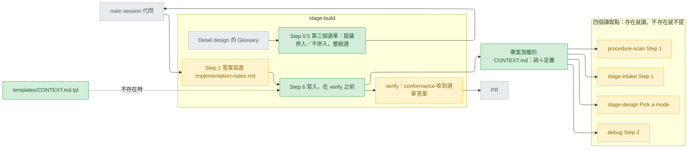

# cross-track-glossary — stance

依據：`.claude/track/cross-track-glossary/intake.md`（已核准，AC1–AC12，三題已答）；來源 `docs/design/2026-09-25-mattpocock-skills-gap-analysis.md` 的 MP-03。下面的取捨是 designer 的建議，還沒有人選；另一個取捨放在 `## Rejected stances` 第一條，並以 pending question（交回 main session 代問的問題）交上。

名詞：詞彙表（glossary）。track 是一個功能從 intake 走到 ship 的流程，stage 是其中一段。`<top>` 是 `git rev-parse --show-toplevel` 印出的目錄，沿用 `stage-verify.md:29`。讀取點是開頭先讀 `<top>/CONTEXT.md` 的四個程序步驟（AC1）。選單（menu）是用 `AskUserQuestion` 給 2–4 個選項的提問。錨點（anchor）是 `codex-overrides.json` 用來定位原文的那幾行。Detail design 是可以直接照著寫程式的細部設計。subagent 是沒有提問工具的子代理，main session 是本人直接對話的那個。派工說明叫 brief。conformance lens 是 verify 裡拿需求逐條對照改動的審查角度。Decisions 文件把決定分成三級：Tier 1 要本人回答，Tier 2 列出來給人掃過，Tier 3 只記錄。veto condition（否決條件）是寫成能直接刪掉選項的需求。

## Status

approved 2026-09-25

## Optimises for

目標是讓專案自己的詞在 track 之間留下來。每個詞寫進 `<top>/CONTEXT.md` 之前，它的詞名加一句理由，都已經出現在一則本人回答過的選單訊息裡。做到這點只改文字、加一個模板，不新增 script 或檢查。怎麼算成功：AC1–AC12 各自指得到一段新文字；`git diff --stat` 裡唯一的 `.py` 改動是 AC9 的 `validate.py:1951` 訊息標籤，`tests/` 底下沒有任何檔案被改。

## Sacrifices

- **四個讀取點沒有機械保證會同步。** 有人刪掉其中一句，`validate.py` 照樣全綠；`GATE_POINTERS`（`validate.py:1946-1959`）那種釘點這次不加。
- **詞彙表內容沒有程式把關**（AC10）。實作名詞被分錯組、定義寫成規格，只能靠人看選單訊息與 PR diff 抓。
- **build 開始多問一題**：Step 0.5 從兩個決定變三個（`stage-build.md:61-62`），每題各佔一次對話。
- **沒有 Detail design 的工作不累積詞**：diagnosis 直接進 build、Delta、`--kind hld`、獨立的 `/cai:build`（AC6）。debug、refactor 只讀不寫。
- **同名詞以新定義取代舊定義**；舊的只留在 build report 與 git 歷史（AC4）。
- **`_Avoid_`（來源格式裡每個詞底下「不要用的同義詞」那一行）不自動產生**，由人事後手寫（intake 第 2 題）。

## Invariants

**This system's:**

- S1 — `CONTEXT.md` 只是詞彙表：詞加一兩句定義，只收專案獨有的概念；不放決策、規格，也沒有 Where it lives 欄（`CONTEXT-FORMAT.md:28-29`、`domain-modeling/SKILL.md:64`；AC4、AC7）。
- S2 — 詞名與一句理由沒出現在本人回答過的選單訊息裡，就不寫入。取代既有定義時，新舊定義並列在同一則訊息（AC2）。build 不把實作名詞放進「提議併入」組（intake 更正 1）；本人用自由輸入移進去的詞照寫。
- S3 — 唯一的寫入點是 build 的 Step 6，在 verify 之前（`stage-build.md:255`），所以寫入一定經過 verify 與 PR（intake 第 1 題）。其他 stage、skill，以及 `/cai:track done`，都不寫（AC10）。
- S4 — 讀取點遇到檔案不存在時：不提，也不建議建立（`domain.md:11`；AC1）。只讀 `<top>/CONTEXT.md` 這一個檔。
- S5 — 不新增 script、`validate.py` 檢查或 `tests/` case。改動只落在這幾處：prose、`templates/CONTEXT.md.tpl`、`codex-overrides.json` 的資料項、`validate.py:1951` 的標籤字串、版本號，以及重新產生的 `plugins/cai-codex/`（AC9、AC10、AC12）。
- S6 — 釘住的句子照 AC 改，而且同一次改完：`stage-build.md:9` 與它的錨點 `codex-overrides.json:475`、`:479`（錨點必須恰好出現一次，`gen-codex.py:246-248`）。下列都不動：`validate.py:1881` 規定的 `state.md` 次數（維持 3）、`tests/test_project_template_guard.py:24` 的錨點、`codex-overrides.json:735` 與 `:745` 錨定的兩行（AC3、AC8、AC9）。

**Cross-project:**

- 本 repo `CLAUDE.md` 的「Who a file is for」與「Before pushing」兩節，以及 `.gitattributes:11` 的 LF 規定。
- 常駐文字的字數上限 `validate.py:297`（所有 description 都不動）、`track/SKILL.md` 的行數上限 `validate.py:2118`、`RETIRED_IMPERATIVES`（`validate.py:1918-1925`）。
- 使用者的 rules，以 `CLAUDE.md:7-13` 匯入的版本為準，包括 `workflow.md` 的「沒被要求就不 commit」。
- 平台限制：subagent 沒有 `AskUserQuestion`（`pending-questions.md:8-11`）；選單只能有 2–4 個選項（`approval-gates.md:11`）；各 agent 的工具範圍以它自己的 frontmatter 為準（`architect.md:7`、`designer.md:8`、`implementer.md:6`、`shipper.md:7`）。

## Rejected stances

- **在文字之外再加一個小機制。** 做法是讓 `validate.py` 仿照 `GATE_POINTERS`，要求四個讀取點與 `stage-build.md` 都含有 `CONTEXT.md`，或加一個印出 `<top>` 的 script。好處是讀取句被刪掉時會被抓到。代價有三個。第一，S5 失效，範圍超出 AC10 與 AC12。第二，它只抓得到「句子不見了」，抓不到「句子改錯了」，`validate.py:1906-1910` 自己就這麼說。第三，印 `<top>` 的 script 幫不了 architect，因為 architect 沒有 Bash（`architect.md:7`）。這個選項以 pending question 交上，還沒被否決。
- **build 自己決定，不另外問。** 這個做法影響範圍最小，下列句子全都不用動：`stage-build.md:9`、`:54`、`:61-62`，`approval-gates.md:148-149`，錨點 `:475` 與 `:479`，`validate.py:1951`。但它違反 S2 與已核准的 AC2：一個 subagent 的判斷，會寫進之後每條 track 都要讀的檔。
- **整張 Glossary 照搬。** 違反 S1：模板本身就會收檔名、函式名這類名詞（`design-detail.md.tpl:55-57`）。
- **讓 `CONTEXT.md` 也記決策。** 違反 S1。來源把決策放在另一個地方（`domain-modeling/SKILL.md:66-74`），而 cai 的決策本來就寫在 stance 與 decisions 文件裡。
- **逐詞勾選的選單。** 選單最多 4 個選項（`approval-gates.md:11`），詞一超過 4 個就排不下。所以改成整組選，個別調整走自由輸入（AC2）。

## Use cases / Issues

- R1 — 詞彙只活在單一 track 的 Detail design 裡（`design-detail.md.tpl:53`、`GUIDE.md:116`）。怎麼知道修好了：AC4；實地確認延到下一條真實 track（AC11）。
- R2 — 下一條 track、debug、refactor 都不知道已經有哪些詞。怎麼知道修好了：AC1 的四個讀取點。
- UC1 — 沒有 `CONTEXT.md`，或沒有 Detail design：不提、不問、不寫（AC1、AC6）。
- UC2 — 同名詞：新舊定義並列，由新定義取代，舊定義寫進 report（AC2、AC4）。
- UC3 — 換 session 接手：答案記在 `implementation-notes.md`（AC3）。
- UC4 — conformance lens 收到第三個選單的答案，不會把寫入誤報成沒人要求的改動（AC5）。
- UC5 — 發版與 Codex 產出（AC12）。
- R3 —（交 Decisions，可能是唯一的 Tier 1）`<top>` 由誰算出來。各讀取點的執行者工具不同：intake 的 architect 只有 Read/Grep/Glob（`architect.md:7`）；designer 的 Bash 只能跑 python 類指令與 mmdc（`designer.md:8`），而 track 裡 debug 的步驟 1–4 就是它在跑（`stage-design.md:218-222`）。寫入者 implementer 有 Bash（`implementer.md:6`）。main session 本來就把 `<project root>` 交給 preflight（`track/SKILL.md:50`）；要它也把 `<top>` 寫進 brief，最直接的做法是改 Dispatch 那一步（`track/SKILL.md:53-57`），但那個檔有行數上限。
- R4 —（交 Decisions）要同步的句子比 AC2、AC9 列的多一處：`stage-build.md:54` 的標題「then get two answers」，它的 Codex 產出在 `plugins/cai-codex/skills/track/references/stage-build.md:59`。其餘是 `:9`、`:61-62`、`approval-gates.md:148-149`、錨點 `:475` 與 `:479`、`validate.py:1951`。
- R5 —（交 Decisions）Codex 版 `CLAUDE-project.md.tpl` 要不要另加 override。沒有任何 Codex skill 會用到這個模板（`codex-overrides.json:730`、`:740`）；`CLAUDE.md` 這個字只在 `rules/` 與 `agents/` 底下被擋（`gen-codex.py:291`、`:303`）。`:740` 說此檔是 CRLF，與 `.gitattributes:11` 不符；這裡只記錄。
- R6 —（交 Decisions）README 要不要提 `CONTEXT.md`。目前 README 與 GUIDE 都沒有提到（Grep 零命中）。
- R7 —（交 Decisions）第三個選單排在 Step 0.5 的第幾個；commit-per-unit 答「否」時，`CONTEXT.md` 留在工作樹。
- R8 —（需求缺口）分組是 implementer 在沒人在場時做的判斷。「本人會真的讀兩組，而不是直接按 recommended」是對人行為的假設。veto condition：選單訊息裡沒有逐條列出詞名與理由的詞，一律不寫入；取代既有定義時，舊定義也要列出。驗證途徑：AC11 那條 track 記下本人有沒有用自由輸入改動分組。
- R9 —（已查證）https://code.claude.com/docs/en/memory：「Block-level HTML comments (`<!-- maintainer notes -->`) in CLAUDE.md files are stripped before the content is injected into Claude's context.」所以 AC8 那句只給填寫模板的人看，不佔 context。`CONTEXT.md` 不是 CLAUDE.md；它的模板註解會不會跟著 Read 進入 context，是 UNVERIFIED（交 Tier 3：建立檔案時要不要刪掉註解）。

## Overview

看圖的重點有三個。`CONTEXT.md` 只有一條寫入箭頭（W），而且它在 verify 與 PR 之前（S3）。寫入之前一定先經過「main session 代問」（S2）。綠色與琥珀色的方框全是文字或模板，沒有程式（S5）。要是選了 Rejected stances 第一條，圖上會多一個守著四個讀取點的 `validate.py` 方框。

## Out of scope

- 新句子的實際措辭、`CONTEXT.md.tpl` 的確切內容、build 單元怎麼切：交給 Decisions 的 Tier 3，或交給 build。
- `CONTEXT-MAP.md`（一個 repo 有多個 context 時用的索引）與 ADR（架構決策紀錄）：這次都不引入。
- `_Avoid_` 欄（intake 第 2 題）、端到端驗證（AC11）、詞彙表正確性的檢查（AC10）、版本號（AC12 已定）。
- `procedure-scan.md:36` 在 shipped 檔裡寫了 repo 內部路徑（intake 更正 5）：這次只記錄，不修。
- `docs/` 被 git 忽略；這份文件在 ship 時要用 `git add -f`。
