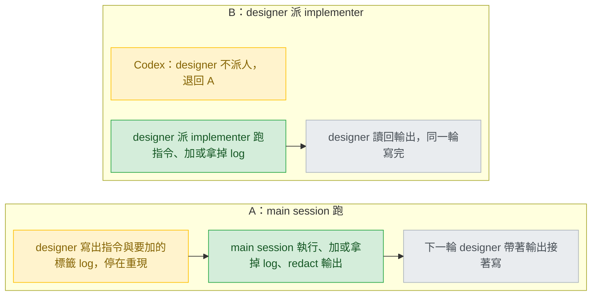
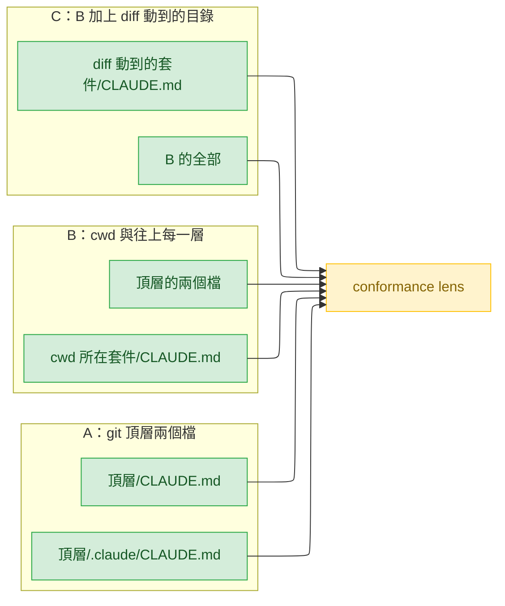
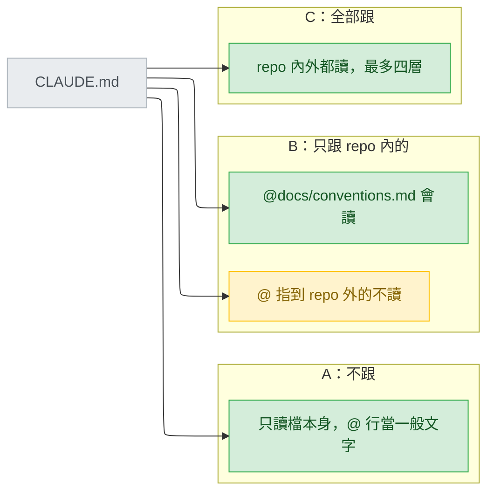
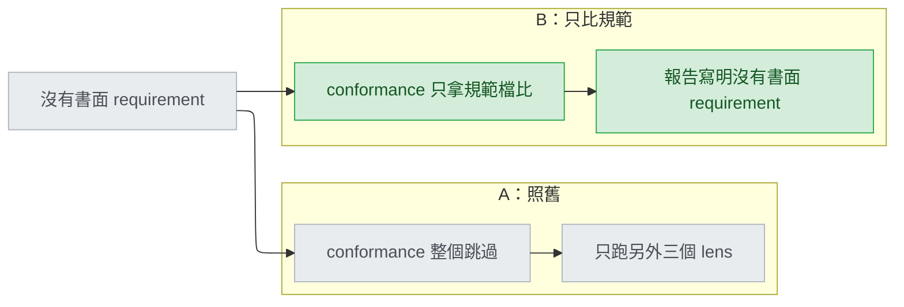

# debug-verify-conventions — decisions

## Reference

- Stance: `docs/design/2026-09-25-debug-verify-conventions-stance.md` — status: approved 2026-09-25。下文的 `stance:N` 指這個檔的第 N 行。
- Intake：`.claude/track/improvement/intake.md`（AC1–AC9 已核准）。Round 2 的取捨題答案是「A：只改文字 (Recommended)」，確立了 S5：凡是需要新 script、`validate.py` 檢查或 `tests/` case 的選項，都進 `## Ruled out`。
- 更正 stance 一處行號：本 repo `CLAUDE.md` 的 `@import` 在 `CLAUDE.md:8-14`，不是 stance 寫的 `:7-13`（`:5-6` 是說明句）。不影響任何不變式。
- Round 4（2026-09-25）：D1–D4 已由本人逐題回答，答案記在各條的 `Decided:`；重跑成本測試的結果寫在 `## Tier 1` 開頭。本 track 跳過 Detail，`build` 從這份文件、stance 與 intake.md 的 AC1–AC9 自己切單元；要動哪些檔、哪些句子一字不改、要跑哪些檢查，寫在 `## Tier 3` 最後幾列。

## Feasibility

| Id | Capability | Verdict | Evidence |
|---|---|---|---|
| C1 | Claude Code 在啟動時從 cwd 與其上每一層目錄載入 `CLAUDE.md`；專案檔可放 `./CLAUDE.md` 或 `./.claude/CLAUDE.md` | verified | https://code.claude.com/docs/en/memory ：「Claude Code loads `CLAUDE.md` and `CLAUDE.local.md` from your current working directory and every directory above it.」與「A project CLAUDE.md can be stored in either `./CLAUDE.md` or `./.claude/CLAUDE.md`.」 |
| C2 | cwd 底下子目錄的 `CLAUDE.md` 不在啟動時載入，讀到該子目錄的檔才載入 | verified | https://code.claude.com/docs/en/memory ：「Instead of loading them at launch, they are included when Claude reads files in those subdirectories.」 |
| C3 | 往上載入是停在 git top-level，還是一路走到檔案系統根 | UNVERIFIED | https://code.claude.com/docs/en/memory 只寫 "every directory above it"，沒寫終點。影響 D2 選項 B 的邊界要怎麼寫（D2 已選 A，不再影響任何現存選項）。 |
| C4 | `@path` import 在啟動時展開；相對路徑以匯入它的檔為基準；最多遞迴四層；code span 與 fenced block 內的 `@` 不解析 | verified | https://code.claude.com/docs/en/memory ：「Imported files are expanded and loaded into context at launch.」「Relative paths resolve relative to the file containing the import」「with a maximum depth of four hops」「Import parsing skips Markdown code spans and fenced code blocks.」 |
| C5 | `CLAUDE.local.md` 是個人檔，文件要求加進 `.gitignore`，與 `CLAUDE.md` 一起載入 | verified | https://code.claude.com/docs/en/memory ：表格列「Local instructions / `./CLAUDE.local.md` / Personal project-specific preferences; add to `.gitignore`」 |
| C6 | 沒有 `paths` frontmatter 的 `.claude/rules/*.md` 在啟動時載入 | verified | https://code.claude.com/docs/en/memory ：「Rules without [`paths` frontmatter] are loaded at launch with the same priority as `.claude/CLAUDE.md`.」 |
| C7 | subagent 一啟動就帶著整個 `CLAUDE.md` 階層（含 `CLAUDE.local.md`、project rules）；那是 context 裡的文字，要引 `檔案:行號` 仍得用 Read 開檔 | verified | https://code.claude.com/docs/en/sub-agents ：「CLAUDE.md files - Every level of the CLAUDE.md hierarchy: `~/.claude/CLAUDE.md`, Project rules, `CLAUDE.local.md` …」；行號只來自 Read 的輸出（`reviewer.md:6` 的工具清單） |
| C8 | reviewer 只能 Read／Grep／Glob 與 `git diff`／`log`／`show`，並且被要求讀 diff 所在的整個檔 | verified | `plugins/cai/agents/reviewer.md:6`、`:13-14` |
| C9 | verifier 能跑測試指令與 `python`，會實際跑 repo 的測試指令並讀輸出；它的工具清單不含 `git rev-parse`，也不含 Step 0 要跑的 `git symbolic-ref`、`git merge-base` | verified | `plugins/cai/agents/verifier.md:7`、`:30-31`；`plugins/cai/skills/track/references/stage-verify.md:23-27` |
| C10 | track 的 main session 手上有專案根目錄，並自己跑指令（preflight、ledger）；單獨跑 `/cai:verify` 時整份 stage-verify 由 main session 自己跑 | verified | `plugins/cai/skills/track/SKILL.md:49-50`、`:62-66`；`plugins/cai/skills/verify/SKILL.md:9-12` |
| C11 | designer 的 Bash 只准 `python`／`py`／`python3`／`mmdc`，只寫文件、不碰程式碼 | verified | `plugins/cai/agents/designer.md:8`、`:13-19` |
| C12 | test-runner 跑非測試指令（CLI、curl） | infeasible | `plugins/cai/agents/test-runner.md:6` 只列測試指令 |
| C13 | Claude Code 上 designer 有 `Agent`，可派 implementer；implementer 有不限範圍的 Bash 與 Edit | verified | `plugins/cai/agents/designer.md:8`、`plugins/cai/agents/implementer.md:6` |
| C14 | Codex 上 designer 不派任何 agent；Codex 上 stage-verify 的 Step 0–1 由 main session 跑 | verified | `scripts/codex-overrides.json:81-83`（"you never dispatch anyone"）、`:11-13` |
| C15 | override 的 anchor 必須在目標檔恰好出現一次，否則 gen-codex 失敗 | verified | `scripts/gen-codex.py:246-248` |
| C16 | `CLAUDE.md` deny list 只掃 `rules/` 與 `agents/`；`~/.claude/` 在任何檔都被擋 | verified | `scripts/gen-codex.py:291`、`:303`、`:132` |
| C17 | Codex 從 project root（通常是 Git root）往下走到 cwd，每層讀 `AGENTS.override.md` 或 `AGENTS.md` | verified | https://developers.openai.com/codex/guides/agents-md （轉址到 learn.chatgpt.com 同名頁）：「Starting at the project root (typically the Git root), Codex walks down to your current working directory」 |
| C18 | `AGENTS.md` 有 `@path` 之類的 import 語法 | UNVERIFIED | https://developers.openai.com/codex/guides/agents-md 同頁沒提到任何 import 語法（round 4 重抓一次，結果相同）。D3 已選 A，不再影響任何現存選項。 |
| C19 | reviewer 自己跑 repo 的 verification 指令，確認它擋什麼 | infeasible | `plugins/cai/agents/reviewer.md:6` 沒有任何建置或測試指令 |
| C20 | `validate.py` 檢查 skill 裡引用的 plugin 檔是否存在 | verified | `scripts/validate.py:206-210` |
| C21 | pending question 最多三輪；交回 pending question 的那一輪不算 ledger attempt | verified | `plugins/cai/skills/track/references/pending-questions.md:65`、`:70-75` |
| C22 | track 的 main session 對每個以 `## Pending questions` 結尾的報告只有一套處理：列選項並 lint、一次問一題、把問題與答案原樣帶進下一次派工；沒有「不問就照做」的分支 | verified | `plugins/cai/skills/track/SKILL.md:89`；`plugins/cai/skills/track/references/pending-questions.md:41-64` |
| C23 | 已有前例把「請 main session 代做一件 designer 做不到的事」寫成 `## Pending questions` 項目，並標明是 request 不是 decision | verified | `scripts/codex-overrides.json:102-106`（Codex 版 stage-design：「hand the fetch up as a `## Pending questions` item (a request, not a decision)」） |

## Ruled out

| Option | Invariant it violates | Evidence |
|---|---|---|
| 放寬 designer 的 `tools:`，讓它能跑 CLI／curl、加 log（C11） | S5：改動只落在 prose、一個 references 檔、override 資料；agent frontmatter 不在其中 | stance:29；`plugins/cai/agents/designer.md:8` |
| 放寬 test-runner 的 `tools:`，讓它跑非測試的重現指令（C12） | S5，理由同上 | stance:29；`plugins/cai/agents/test-runner.md:6` |
| 放寬 reviewer 的 `tools:`，讓 lens 自己跑 verification 指令（C19） | S5，理由同上 | stance:29；`plugins/cai/agents/reviewer.md:6` |
| 把 `.claude/rules/*.md` 也算規範來源（C6） | S4：規範按檔案界定，只有 `CLAUDE.md` 與 `.claude/CLAUDE.md`（R5 只開放 `@import` 與 `CLAUDE.local.md` 兩題） | stance:28、:56 |
| 按 `## Conventions` 標題取規範 | S4：按檔案，不按標題 | stance:28；`plugins/cai/skills/setup/SKILL.md:116-117` |
| 帶進來源的 Fowler smell baseline | S4：baseline 不出自任何規範檔 | stance:17、:28；`code-review/SKILL.md:38-56`（來源） |
| 用 `validate.py` 或 `tests/` 守步驟標題、120 行、Codex 的 `CLAUDE.md` | S5，且 round 2 本人已選「只改文字」 | stance:29、:41 |
| minimise 獨立成新的 Step 2，後面順延 | S1：Step 1–5 編號不變 | stance:25；intake.md:37 |
| 加第五個 Standards lens | S3：規範是 conformance 的第二個比對依據，「Four and not more」 | stance:27；`plugins/cai/skills/track/references/stage-verify.md:46-48` |

## Requirement gaps

| # | The behavioural assumption | Veto condition, or verification path | Deletes |
|---|---|---|---|
| G1 | D1 還有一個選項：track 的 diagnosis 停在重現，請本人自己跑指令、自己 redact 後把輸出貼回。它能成立的前提是本人在場、會跑那條指令、會把 secret 清乾淨 | 否決條件：「track 的 diagnosis 不得把重現交給本人手動執行」。驗證路徑：本人回答一句「track 的 diagnosis 能不能停下來等我跑指令」。Round 4 狀態：本人在 D1 選了 A，當時的選項檔已註明這個選項列為 G1、不在比較內（`.claude/track/improvement/options-D1.md:10`），所以它不再擋任何設計；只有本人想推翻 D1 時才需要回答。本人在 D10 的選單選「不跑」時，落到 AC1 的「寫出試過什麼、停下」，不是改由本人手動跑 | 否決成立就刪掉「本人手動跑」這個選項；不成立它就回到 D1 當第三個選項 |

## Tier 1

這四題的答案不會改變彼此的選項，只有 D2 會改變 D3 的成本：D2 選的檔越多，D3 若選跟著 import，要跟的檔也越多。所以排序按影響範圍：D1 動兩個 skill 加 Codex，先問；D2 決定讀哪幾個檔，排在 D3「要不要跟 import」之前；D4 只動一段文字，最後問。

**Round 4 重跑成本測試的結果。** 沒有任何一條回到 Tier 1。D5 降到 Tier 3：D2=A 只列兩個檔，D3=A 只准引這兩個檔本身的行，`CLAUDE.local.md` 自然不在內，剩下的只是「要不要另寫一句」。D3=A 讓 C18 不再影響任何選項，Codex 不需要處理 import 的 override。D2=A 把 `<top>` 定為 `git rev-parse --show-toplevel` 印出的目錄，D6、D9 的措辭因此寫死；D2 選項 A 的「實際改變」寫的是「Git root 的 `AGENTS.md`」，所以 Codex 那側讀哪個檔拆成 D12。D4=B 要改寫 `stage-verify.md:58-60`，另外補一列 Tier 3，處理「requirement 與規範檔兩者都沒有」的情況。D1=A 的成本欄裡藏著兩個沒回答的問題，拆成 D10（交回走哪個管道）與 D11（涵蓋哪些動作），規則放在哪個檔則進 Tier 3。D7、D8 不受影響。

### D1 — 在 track 裡，非測試型的重現指令（CLI、curl）誰來跑，帶標籤的 log 誰加、誰拿掉？

看圖的重點：A 多一次來回，但兩個平台同一種做法；B 同一輪做完，但 Codex 那一側要另寫一條退路。

| Option | Rests on | What it costs | Fails when |
|---|---|---|---|
| A — designer 在 diagnosis 文件寫出指令與要加的 log，停在重現並交回；main session 跑、加或拿掉 log、redact 後在下一輪交給 designer | C10、C11、C21 | 每個非測試型 bug 至少多一輪。交回走 pending question 會用掉三輪上限的一輪；不走的話，這一輪會被記成一次 ledger attempt（C21）。`stage-design.md` Diagnosis step 1 與 `debug/SKILL.md` 的 `## Inside a track` 各加一段 | 使用者的權限設定擋下那條指令（main session 仍要本人放行，細節 UNVERIFIED） |
| B — designer 派 `implementer` 跑指令、加與拿 log，自己讀輸出 | C13、C14 | 一輪做完。但 implementer 被拿來「跑指令」而不是實作，而且繞過了 designer 不碰程式碼的約束（`designer.md:13-19`）；Codex 要加一條 override 退回 A（C14） | 派出去的 implementer 沒把標籤 log 拿乾淨；或 Codex 的退路 override 漏掉 |

test-runner 跑不了 CLI 與 curl（C12），所以不是選項；放寬任何 agent 的工具已在 `## Ruled out`。

- **Blast radius:** 兩個 skill 檔（`stage-design.md`、`debug/SKILL.md`），選 B 另加 `codex-overrides.json`。
- **Found out when:** 發布後，第一條走 diagnosis 的 track 遇到沒有現成測試的 bug 時。
- **Undo cost:** 改文字即可；但選 B 期間留在使用者 repo 的標籤 log 要人去清。
- **Decided:** A — 「A：main session 跑 (Recommended)」(本人, 2026-09-25)。落到文字的方式見 D10、D11 與 Tier 3。

### D2 — 規範檔的「專案根目錄」指哪裡，monorepo 子目錄的 `CLAUDE.md` 算不算？

看圖的重點：三個選項只差箭頭數。A 固定兩支，B 看 session 從哪裡開，C 看 diff 動到哪些目錄。

| Option | Rests on | What it costs | Fails when |
|---|---|---|---|
| A — 只讀 git 頂層的 `CLAUDE.md` 與 `.claude/CLAUDE.md`，跟 `setup/SKILL.md:97-107` 同一個定義 | C1、C9、C10、C14、C17 | 最少。頂層路徑在 Step 0 與 base ref 一起取得，跑得了 Step 0 的人就跑得了這條：單獨跑時是 main session（C10），Codex 上也是 main session（C14）。track 裡的 verifier 工具清單沒有這條，也沒有 Step 0 原本的 `git merge-base`（C9），這是 Step 0 既有的缺口，不是 A 新增的。Codex 那側對應「Git root 的 `AGENTS.md`」（C17） | monorepo 的套件層 `CLAUDE.md` 才是那次改動的規範，卻沒讀到 |
| B — cwd 以及往上每一層，也就是 Claude Code 啟動時載入的那組 | C1、C3、C17 | 要寫清楚往上到哪裡停（C3 未證實）；同一個 diff 從不同目錄開 session，會得到不同的規範 | 同一個 branch 兩次 verify 結果不同，只因為 cwd 不同 |
| C — B 再加上 diff 動到的每個目錄與其上層的 `CLAUDE.md`，對應子目錄按需載入的行為 | C1、C2 | 讀的檔最多，派工文字最長；Codex 的 `AGENTS.md` 只從 root 走到 cwd（C17），兩個平台讀到的檔不一樣 | diff 很大時要讀的檔多，conformance 的 context 被規範檔吃掉 |

- **Blast radius:** `stage-verify.md` 的 Step 0、conformance 列與派工段，加上 `codex-overrides.json` 對應 `AGENTS.md` 的那一條。
- **Found out when:** 發布後，monorepo 或從子目錄開 session 的使用者回報漏報、多報時。
- **Undo cost:** 改文字與一條 override 資料即可。
- **Decided:** A — 「A：git 頂層兩個檔 (Recommended)」(本人, 2026-09-25)。`<top>` 是 `git rev-parse --show-toplevel` 印出的目錄，見 D6、D9、D12 與 Tier 3。

### D3 — 規範檔裡的 `@path` import 要不要跟著讀？

看圖的重點：同一個 `CLAUDE.md` 出發，A 停在檔本身，B 只跨進 repo 內的檔，C 連使用者家目錄的檔也讀。

| Option | Rests on | What it costs | Fails when |
|---|---|---|---|
| A — 不跟：只讀那兩個檔本身；`@path` 行只是文字 | C4、C7 | 最少；但 reviewer 的 context 裡仍有 import 進來的內容（C7），文字要明說只有檔本身的行可以引 | 團隊把規範放在被 import 的檔（例如 `@docs/conventions.md`），conformance 讀不到 |
| B — 只跟解析後落在 repo 內的 import，照 Claude Code 的規則（相對於匯入檔、最多四層，C4） | C4、C18 | 本 repo 的 `CLAUDE.md:8-14` 匯入七個出貨的 rule 檔，每個 diff 都要對照 `coding.md`、`workflow.md` 等跨專案規則，finding 會變多；Codex 沒有已知的 import 語法（C18），那句要用 override 拿掉 | import 進來的是通用規則，不是這個 repo 的規範，finding 變成雜訊 |
| C — 全部跟，包括指到使用者家目錄的 import | C4、C16 | 報告會引到 `~/.claude/...` 之類的路徑，同一份報告的其他讀者開不了那個檔；文字若寫出 `~/.claude/`，Codex 端會被 deny list 擋下（C16） | finding 引到隊友機器上沒有的檔 |

- **Blast radius:** 選 A 只動 `stage-verify.md`；選 B 或 C 另加 `codex-overrides.json`。
- **Found out when:** 發布後，有人發現被 import 的規範沒報，或報告引到個人檔案時。
- **Undo cost:** 改文字即可。
- **Decided:** A — 「A：不跟 (Recommended)」(本人, 2026-09-25)。Codex 不需要 import 相關的 override。

### D4 — 沒有書面 requirement、但有規範檔時，conformance 要不要只拿規範跑？

看圖的重點：A 完全不動現有文字；B 讓規範在沒有 requirement 時也有人看。

| Option | Rests on | What it costs | Fails when |
|---|---|---|---|
| A — 照 `stage-verify.md:59-60`：沒有書面 requirement 就說明，然後只跑另外三個 lens | 不需要新能力（`stage-verify.md:57-60`） | 零改動；但單獨跑 `/cai:verify` 又沒有 plan 時，規範永遠沒人看 | 規範被違反，卻只因為沒有寫下 requirement 而沒報 |
| B — conformance 照跑，只拿規範檔比；requirement 那半寫明「無書面 requirement」 | C8 | `stage-verify.md:58-60` 那兩句要改寫，因為「The conformance lens is useless without that last one」不再成立；沒有 plan 的 verify 會多出 Minor 為主的規範 finding | 使用者只想做快速檢查，多出的規範 finding 被當成雜訊 |

- **Blast radius:** 只有 `stage-verify.md`（Codex 版由 gen-codex 重產）。
- **Found out when:** 發布後。規範漏報是無聲的，沒有測試會抓到。
- **Undo cost:** 改兩句文字。
- **Decided:** B — 「B：照跑，只拿規範比 (Recommended)」(本人, 2026-09-25)。兩者都沒有時的處理見 Tier 3。

## Tier 2

### D6 — 規範檔由誰讀：verifier 讀好附進派工，還是 reviewer 自己讀？

選派工者（Claude Code 上是 verifier，Codex 上是 main session，`scripts/codex-overrides.json:10-15`）在 Step 1 派工前，用 Glob 或 Read 確認 `<top>/CLAUDE.md`、`<top>/.claude/CLAUDE.md` 哪幾個存在（D2=A；verifier 有 Read／Glob，`verifier.md:7`），只把存在的路徑寫進 conformance 的派工；reviewer 用自己的 Read 開檔，`reviewer.md` 不改，所以 AC8 後半（`reviewer.md` 的 override，intake.md:32）不觸發。理由有四：派工本來就帶輸入（`stage-verify.md:57`）；reviewer 有 Read，也被要求讀整個檔（C8，`reviewer.md:6`、`:13-14`）；context 裡的副本沒有行號（C7）；`reviewer.md` 由三個 lens 共用（`stage-verify.md:46-47`），而且放在 `agents/` 底下，寫進 `CLAUDE.md` 就會觸發 deny list（C16，`gen-codex.py:303`）。**Found out when:** 發布後第一次在有規範檔的 repo 跑 verify。

### D7 — 「verification 指令已經會擋的不報」由誰判斷？

選由 verifier 在 Step 2 判斷：一條規範 finding 的 `檔案:行號` 如果已經出現在本次實際跑過的指令輸出裡，就合併掉；那條指令這次沒跑到的，finding 照報，並在 `Not covered` 寫明。lens 不自己推測。依據有三：reviewer 跑不了那條指令（C8，`reviewer.md:6`）；verifier 會跑，並讀輸出（C9，`verifier.md:30-31`）；stage-verify 的證據規則要求每個判定都能追到本次跑過的指令（`stage-verify.md:15-19`）。lens 靠讀 linter 設定去推測，屬於 UNVERIFIED。**Found out when:** 發布後，同一個問題在報告裡出現兩次：一次是指令失敗，一次是規範 finding。

### D8 — AC4 的 redact 那一行放哪裡？

選放在 `## Step 1` 標題之前（`debug/SKILL.md:22` 之前），對整份 skill 都生效，track 裡代跑指令的 main session（D10）也照這一行處理輸出；寫成 `## The rule` 裡的一段還是自成一節，交給 build。不放進 Step 1 裡面，因為會貼出輸出的地方有三個：Step 1 的指令輸出（AC1，intake.md:25）、Step 3 的邊界 log（`debug/SKILL.md:38-41`）、Step 5 的測試輸出（`debug/SKILL.md:53-58`）。來源也把 `## Redact` 放在 Phase 1 之前（`diagnosing-bugs/SKILL.md:12-16`）。這一行牽涉 credentials，依規定成本算高。**Found out when:** 發布後，secret 出現在 Step 3 或 Step 5 貼出的輸出裡。

### D9 — Codex 版的 `stage-verify.md` 怎麼改指向 `AGENTS.md`？

選在 `codex-overrides.json` 加兩條資料項，照 D11 前例（`scripts/codex-overrides.json:607-615`），這是 AC8 的做法（intake.md:32）。兩條分別覆寫 Step 1 表格的 conformance 列，以及派工段裡寫出兩個路徑的那一行，把 `<top>/CLAUDE.md` 與 `<top>/.claude/CLAUDE.md` 換成 `<top>/AGENTS.md`（讀哪個檔見 D12）；`<top>` 的取法兩個平台相同，Codex 上由 main session 跑 Step 0（C14，`codex-overrides.json:11-13`）。D3=A 不跟 import，所以不需要處理 import 的 override。另一條路是把原文寫成中性說法、不寫檔名，但那樣 lens 不知道該開哪個檔。`skills/` 不在 deny list 裡（C16，`gen-codex.py:291`），漏掉一處不會失敗；anchor 沒對上則會失敗（C15，`gen-codex.py:246-248`）。**Found out when:** anchor 錯了在下一次 `python scripts/gen-codex.py` 就會失敗；漏掉一處則要等發布後 Codex 使用者讀到才發現。

### D10 — D1=A 的交回走哪個管道，main session 照什麼做？

選 `## Pending questions` 項目，寫明「a request, not a decision」，但照格式給兩個選項：「照寫的跑 (recommended)」與「不跑：designer 寫出試過什麼，停在重現（AC1）」。依據：main session 對 `## Pending questions` 只有一套處理，就是列選項、lint、問本人、把答案原樣帶回（C22，`track/SKILL.md:89`、`pending-questions.md:41-64`），沒有不問就照做的分支；要加那條分支得改 `pending-questions.md` 或 `track/SKILL.md`，兩者都不在 intake 的範圍（intake.md:7、:37）。本人選 A 時看到的也是「你會看到 designer 交回一段像這樣的內容」（`.claude/track/improvement/options-D1.md:22`）。把 request 寫成 pending question 有前例（C23，`codex-overrides.json:102-106`）；照這個說法寫明，就不會跟 `designer.md:29-32`「只有 Tier 1 才交上」衝突，`designer.md` 不改。改走 outcome、記一次 ledger attempt 的做法被排除，因為還沒有 outcome 的一輪不寫 ledger row（C21，`pending-questions.md:70-75`）。代價：每次交回佔三輪上限的一輪（`pending-questions.md:65-66`），本人選 A 時已看過這一條（options-D1.md:23）。**Found out when:** 發布後，第一條走 diagnosis、又沒有現成測試的 track。

### D11 — D1=A 涵蓋哪些動作：只有重現指令與標籤 log，還是 steps 1–4 裡 designer 做不到的全部？

選後者：designer 的 Bash 只准 `python`／`py`／`python3`／`mmdc`，而且只寫設計文件（C11，`designer.md:8`、`:13-19`），而 `stage-design.md:218-221` 要它做到 Step 4 的「one small test」，那往往是暫時改一行程式碼（`debug/SKILL.md:45-47`）。只寫重現與 log 的話，Step 4 會留下 stance R6 指出的同一個缺口（stance:57）；D1 的 B（派 implementer）本人沒選。所以規則寫成：steps 1–4 需要、而 designer 自己的工具做不到的指令與暫時改動（Step 1 的重現、Step 3 的標籤 log、Step 4 的小實驗），都走 D10 的交回；以 `python`、`py` 或 `python3` 開頭、不改任何檔的指令，designer 自己跑。Step 4 的暫時改動跟標籤 log 一樣，在帶回輸出前改回原狀，修正留給 build（`debug/SKILL.md:15`「No fix before the root cause is found and stated」）。**Found out when:** 發布後，第一次 diagnosis 走到 Step 4、需要暫時改程式碼時。

### D12 — Codex 那側讀哪個檔：只讀 Git root 的 `AGENTS.md`，還是有 `AGENTS.override.md` 就改讀它？

選只讀 `<top>/AGENTS.md`：AC8 寫的是「改指向 `AGENTS.md`」（intake.md:32），本人選 D2 的 A 時看到的改動也是「`codex-overrides.json` 那條寫成 Git root 的 `AGENTS.md`」（`.claude/track/improvement/options-D2.md:36`）。Codex 在同一層若有 `AGENTS.override.md` 會讀它、不讀 `AGENTS.md`（C17，https://developers.openai.com/codex/guides/agents-md ）。那一頁只把 `~/.codex/AGENTS.override.md` 說成「a temporary global override」，專案層的 override 是不是個人檔、該不該進版控，頁面沒寫，這點 UNVERIFIED（round 4 由 chore subagent 以 WebFetch 取得，拿到的是摘要，沒有對過原頁逐字）。如果專案層的 override 其實是團隊進版控的檔，這條要改成「有 override 就讀 override」。**Found out when:** 發布後，某個 Codex 使用者的規範寫在 `AGENTS.override.md`，conformance 卻沒讀到。

## Tier 3

| Decision | Chose | Instead of | Found out when |
|---|---|---|---|
| debug 的 references 檔名 | `plugins/cai/skills/debug/references/feedback-loops.md`，用 `${CLAUDE_PLUGIN_ROOT}` 路徑引用 | `loop-methods.md` | 路徑拼錯時，下一次 `python scripts/validate.py` 就會 FAIL（C20，`validate.py:206-210`） |
| 新句子的實際措辭 | build 照 AC1–AC8 的字面寫，逐條對應；本文件 Tier 2 與下面「必須寫到的點」兩列是內容的下限 | 在這份文件裡先寫好全文 | 本 track 的 verify：conformance 會逐條對照 AC |
| 標籤 `[DEBUG-xxxx]` 的 `xxxx` | 每次除錯現場產生 4 個 hex 字元 | 固定寫 `[DEBUG]` | 同一次除錯收尾 grep 時：標籤不夠獨特，grep 會命中 repo 原有的字串而不為 0 |
| stage-verify 裡 `CLAUDE.md` 的 override | `CLAUDE.md` 只出現在 `stage-verify.md` 的兩行：Step 1 表格的 conformance 列，以及派工段裡列出兩個路徑的那一行（兩個路徑寫在同一行，不跨行斷開）；其他新句子一律說「the convention files」。每行一條 override，anchor 用單行、各自在檔裡唯一（單行 anchor 的前例與理由：`codex-overrides.json:704`） | 一條 override 包住跨段的多行 anchor | 下一次 `python scripts/gen-codex.py`：anchor 不唯一或沒對上就失敗（C15，`gen-codex.py:246-248`） |
| 「無書面規範」「無書面 requirement」寫在報告哪裡 | 兩者都寫在 Step 3 的 `Not covered`（`stage-verify.md:100`） | 寫進 Verdict 那一行 | 本 track 的 verify：conformance 會對照 AC6 與 D4 |
| references 檔的方法清單 | 取 `diagnosing-bugs/SKILL.md` 的 loop 方法，改寫成 cai 的用語 | 全文照搬，包括它引用的 `scripts/hitl-loop.template.sh`（`diagnosing-bugs/SKILL.md:35`；`plugins/cai/` 底下 Glob 零命中） | 本 track 的 verify：conformance 會對照 AC5，validate 會查引用 |
| `CLAUDE.local.md`（原 D5） | 不另寫一句；派工段「只有這兩個檔本身的行能引」一句，同時排除 `@path` 匯入的檔（D3=A）與 `CLAUDE.local.md`（C5、C7） | 另寫一句點名排除 `CLAUDE.local.md` | 本 track 的 verify：conformance 對照 AC6 與 D3 |
| 沒有書面 requirement、也沒有規範檔 | conformance 照 `stage-verify.md:59-60` 現行做法跳過，另外三個 lens 照跑；`Not covered` 兩件事都寫 | 讓 conformance 在沒有任何比對依據時空跑 | 本 track 的 verify：conformance 對照 D4 |
| `<top>` 在 Step 0 怎麼取 | 在 `stage-verify.md:25-28` 的「as separate commands」清單加第三條 `git rev-parse --show-toplevel`，印出的目錄就是 `<top>`，跟 `setup/SKILL.md:97-98` 同一條指令。不在 git 裡的情況不另寫，因為 Step 0 的 `git merge-base` 本來就要 git。track 裡 verifier 的工具清單沒有這條（C9），與 `git merge-base` 同一個既有缺口，記錄不修 | 在 Step 1 才取，或直接用 cwd | 本 track 的 verify：conformance 對照 D2 |
| debug 的各步標題 | 五個 `## Step N — …` 標題與 `## After three fixes fail` 一字不改；AC2 的 minimise 寫在 Step 1 內文，AC3 的 3–5 個假說寫在 Step 4 內文。這樣 `stage-design.md:218-222` 的轉述（「one hypothesis and one small test at a time」）仍然成立，不用改（intake.md:37） | 把 Step 4 標題改成「先列 3–5 個假說」 | 本 track 的 verify：conformance 對照 AC5 |
| D10、D11 的規則寫在哪 | 完整規則寫在 `stage-design.md` Diagnosis step 1，接在 `:224-225`（「This mode is where "stated" gets a reader.」）之後另起一段，`:218-222` 原文不動。`debug/SKILL.md` 的 `## Inside a track` 在兩個 seam bullet 之後（`:87` 之後）加一段，內容只有兩點：在 track 裡，steps 1–4 需要而 designer 做不到的指令與暫時改動由 main session 代跑；規則見 `stage-design.md` 的 diagnosis mode。不加第三個 bullet，所以 `:78` 的「Two seams」仍然正確 | 兩個檔各寫一份完整規則 | 本 track 的 verify：conformance 對照 D1、AC5 |
| `stage-design.md` 新段必須寫到的點 | ① 只在被 track 派出、身為 subagent 時適用；單獨跑 `/cai:design` 時自己跑（`stage-design.md:7-12`）② 範圍照 D11 ③ 交回照 D10，寫明「a request, not a decision」，兩個選項照 D10 ④ 項目裡寫出完整指令、每行標籤 log 的 `檔案:行號` 與原文、Step 4 暫時改動的 `檔案:行號` 與改法、要貼回哪些輸出 ⑤ 一次交回帶上當下已能指名的所有指令與改動，因為每次交回佔三輪上限的一輪 ⑥ 項目裡寫明 main session 選「跑」之後的順序：加 log 與暫時改動、跑、把兩者都改回原狀、grep 標籤結果為 0、依 D8 的 redact 規則處理輸出、把輸出原樣帶進下一次派工 ⑦ 指令被拒或跑不起來時，diagnosis 寫出試過什麼、停在重現（AC1），不補寫輸出 ⑧ 新文字不出現 `AskUserQuestion`，否則 Codex 要多一條 override | 只寫一句「交給 main session」，其餘由 build 自己補 | 本 track 的 verify：conformance 對照 D1、D10、D11 |
| `stage-verify.md` 要改的地方與必須寫到的點 | ⓪ `:53` 的 conformance 列加第二個比對依據 `<top>/CLAUDE.md` 與 `<top>/.claude/CLAUDE.md`，按檔案、不按標題（AC6）① `:57-60` 派工段：conformance 另外帶 D6 確認存在的規範檔路徑 ② 只有這兩個檔本身的行能引，`@path` 行不跟（D3=A）③ 每條規範 finding 引其中一個檔的 `檔案:行號`，引不到就不算（AC6）④ 沒有書面 requirement 但有規範檔時，conformance 照跑、只比規範（D4=B），取代「The conformance lens is useless without that last one; if no requirement exists in written form, say so and review the other three.」⑤ 兩者都沒有照上面那一列 ⑥ 兩個規範檔都沒有時寫「無書面規範」⑦ Step 2 加一條 bullet 寫 D7 的合併規則 | 讓 build 從 AC6 自己推 | 本 track 的 verify：conformance 對照 AC6、D2–D7 |
| 改動檔案範圍 | 只動這些：`plugins/cai/skills/debug/SKILL.md`；新增 `plugins/cai/skills/debug/references/feedback-loops.md`；`plugins/cai/skills/track/references/stage-verify.md`（Step 0、Step 1 的 `:53` 與 `:57-60`、Step 2 一條 bullet）；`plugins/cai/skills/track/references/stage-design.md`（Diagnosis step 1 的新段）；`scripts/codex-overrides.json`（D9 兩條）；`plugins/cai/.claude-plugin/plugin.json`（版本）；`plugins/cai-codex/` 只由 gen-codex 重產 | 另動 `agents/*.md`、`pending-questions.md`、`track/SKILL.md`、`rules/`、`validate.py`、`tests/`、`docs/rule-provenance.md` | 本 track 的 verify：`git diff --stat` 沒有 `.py`，也沒有 `tests/` 底下的檔（stance:11） |
| 一字不改的句子怎麼守 | build 前後各用 Grep 工具查一次：S1 的 `debug/SKILL.md:68` 整行、`## After three fixes fail`、五個 Step 標題、AC3 的 `:46-47`「one variable, not a bundle」；S7 的 `stage-verify.md:3-5`（`codex-overrides.json:5-9` 的 anchor）、`:47-48` 的「Four and not more」句（`docs/rule-provenance.md:26`）、`validate.py:2083-2084`、`:2087`、`:2091` 釘住的三段文字 | 只靠讀 diff | 下一次 `python scripts/validate.py`（provenance 與 `:2081-2091` 會 FAIL）或 `python scripts/gen-codex.py`（anchor 對不上會 exit 1） |
| build 要跑的檢查 | `python scripts/validate.py` 全 PASS、exit 0；`python -m pytest` 通過；`python scripts/gen-codex.py` exit 0，再跑 `python scripts/gen-codex.py --release <大於 0.2.11 的版本>`；用 Grep 工具（不用 `grep.exe`）查產出的 `plugins/cai-codex/skills/track/references/stage-verify.md`、`plugins/cai-codex/skills/track/references/stage-design.md`、`plugins/cai-codex/skills/debug/SKILL.md`，`CLAUDE.md`、`AskUserQuestion`、`~/.claude` 都是 0 筆（2026-09-25 的現況就是 0）；`debug/SKILL.md` 不超過 120 行；`plugin.json` 版本大於 1.29.1，升 patch 還是 minor 由 build 決定（intake.md:42） | 只跑 `validate.py` | build 跑這些指令的當下 |
