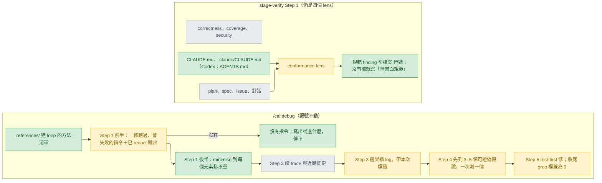

# debug-verify-conventions — stance

依據：`.claude/track/improvement/intake.md`（已核准，AC1–AC9，做法 A：minimise 併進 Step 1、編號不動）；來源 `docs/design/2026-09-25-mattpocock-skills-gap-analysis.md` 的 MP-01、MP-02。下面的取捨是 designer 的建議，還沒有人選；另一個取捨放在 `## Rejected stances`，並以 pending question 交上。

## Status

approved 2026-09-25

## Optimises for

`/cai:debug` 的每一步，以及 conformance lens 的每條規範 finding，都要停在讀者能在回覆或報告上直接核對的證據：一條本次跑過的指令加上已 redact 的輸出，或一個 `檔案:行號`。做到這點只改文字，不新增 script 或檢查。怎麼算成功：AC1–AC8 各自能指到一段新文字；`git diff --stat` 裡沒有 `.py` 檔，也沒有 `tests/` 底下的檔。

## Sacrifices

- **沒有機械保證。** 三個會漂移的地方都沒有程式在守：debug 步驟標題與各處編號引用是否一致（intake:37 已承認「目前沒有檢查會抓到漏改」）；`SKILL.md` 是否在 120 行內（AC5 明說這是預算，不是檢查）；Codex 版 `stage-verify.md` 會不會再多出 `CLAUDE.md`。第三個的原因是 deny list 只掃 `rules/` 與 `agents/`（`scripts/gen-codex.py:291`、`:303`），現成漏網的例子是 `plugins/cai-codex/skills/track/references/stage-discover.md:127`。漂移只有在有人讀到時才會被發現。
- **簡單 bug 變慢。** 沒有現成失敗測試的 bug（CLI 輸出、HTTP 回應）要先有一條跑過、會失敗的指令，才能開始想假說。
- **沒寫下、或寫在另外兩個檔以外的慣例，review 看不到。** 來源 skill 有一份 Fowler smell baseline（`code-review/SKILL.md:38-56`），這裡不帶進來。
- **`debug/SKILL.md` 從 96 行長到最多 120 行**，而且建 loop 的方法要另開一個 references 檔才看得到。
- **conformance 會多出規範型 finding，多半是 Minor**（差距文件 :180 的預估，UNVERIFIED，沒有量過）。

## Invariants

**This system's:**

- S1 — debug 的 Step 1–5 編號不變，`## After three fixes fail` 的標題不變（`stage-design.md:247` 引用它）；`debug/SKILL.md:68` 原句不變，因為它是 `codex-overrides.json:392-399` 的 anchor，而 anchor 必須恰好出現一次（`gen-codex.py:246-248`）。
- S2 — debug 的每個完成條件都要在回覆裡（在 track 裡則是 diagnosis 文件）留下可核對的東西：指令、已 redact 的輸出、或寫明試過什麼並停下（AC1）。規範 finding 一定引 `檔案:行號`，引不到就不算 finding（AC6）。
- S3 — 規範是 conformance 的第二個比對依據，不是第五個 lens。「Four and not more」（`stage-verify.md:46-48`）是釘住的句子（`docs/rule-provenance.md:26`）。
- S4 — 規範按檔案界定，不按標題：專案根目錄（「根目錄」指什麼見 R8）的 `CLAUDE.md` 與 `.claude/CLAUDE.md`（AC6）。repo 的 verification 指令已經會擋的，不報（做不做得到見 R10）。
- S5 — 不新增 script、`validate.py` 檢查或 `tests/` case。改動只落在 prose、一個 `plugins/cai/skills/debug/references/` 檔、`codex-overrides.json` 的資料項。
- S6 — 不在使用者的 repo 新增檔案；任何 skill 或 agent 的 description 都不改（intake:7）。
- S7 — AC7 列的句子一字不改：`docs/rule-provenance.md:26` 登記的那句、`validate.py:2081-2091` 釘住的三句、`codex-overrides.json:4-9` 的 anchor 段。

**Cross-project:**

- 本 repo `CLAUDE.md` 的「Who a file is for」（Theirs／Ours；改了 `plugins/cai/` 就重產 `cai-codex`，並跑 `--release`）與「Before pushing」（`validate.py` 加 `pytest`；改了被引用的 rule 句子要同步 ledger；description ratchet `validate.py:297`；不准有 BOM）。
- 使用者的 rules（`epistemics.md`、`coding.md` 的 Simplicity／Surgical、`workflow.md`），以 `CLAUDE.md:7-13` 匯入的版本為準。
- 平台限制：subagent 沒有 `AskUserQuestion`（`references/pending-questions.md:8-11`）；各 agent 的工具範圍以它自己的 frontmatter 為準（`designer.md:8`、`test-runner.md:6`、`reviewer.md:6`、`verifier.md:7`）；Codex 讀的專案規範檔是 `AGENTS.md`（`codex-overrides.json:615`，D11）。

## Rejected stances

- **在文字之外，再加程式釘住。** 用 `validate.py` 檢查去守 Sacrifices 第一條列的三處漂移。這樣換到的是漂移會被機械抓到，代價是 S5 失效、範圍超出 intake（AC5 明說 120 行不是檢查），而且每釘一句，之後改寫它就得連檢查一起改（`validate.py:2076-2091` 就是這樣的前例）。這個選項以 pending question 交給本人，還沒被否決。
- **整套照搬來源。** 包括第五個 Standards lens、smell baseline、列出假說後等人回覆。它違反 S3（跨專案的平行上限 `model-selection.md`，以及 `rule-provenance.md:26`）與 AC3 的「不等回覆」；smell 是 heuristic，這也跟 `reviewer.md:18-19`「說不出什麼會壞就不是 finding」衝突。
- **只補 Step 1 的一句完成條件，其他都不做。** 已核准的 AC2–AC4（intake:26-28）不允許。而且少了 minimise，假說的範圍不會縮小（`diagnosing-bugs/SKILL.md:82`），要優化的「每一步都可核對」只做到一步。
- **按 `## Conventions` 標題去讀規範**（差距文件 :174）。本 repo 的 `CLAUDE.md` 沒有這個標題（標題只在 :1、:20、:78、:83、:163）；`setup/SKILL.md:116-117` 也是看內容不看標題。intake 的 AC6 已經排除這個做法。

## Use cases / Issues

- R1 — debug 的 Step 1 沒有可判定的出口（`debug/SKILL.md:22-26`）。怎麼知道修好了：Step 1 以 AC1 的四要素句收尾；任何一段 debug 紀錄，要嘛在假說之前貼出指令與輸出，要嘛寫出試過什麼然後停下。
- R2 — 沒有 minimise；Step 4 只要一個假說（`debug/SKILL.md:43-49`）；暫時的 log 沒有標籤，也沒有 redact 規則（差距文件 :152 的零命中）。怎麼知道修好了：AC2–AC4 的句子都在，收尾清單有「grep 標籤結果為 0」。
- R3 — conformance 只拿 plan、spec、issue、對話來比（`stage-verify.md:53`、`:57-60`），沒有 lens 被告知要去讀寫下的規範。反過來看，`stage-verify.md:76-80` 與 `finding-severity.md:10-13` 早就接受 standing obligation 可以當 finding 的依據。怎麼知道修好了：AC6。
- R4 — Codex 版必須改指向 `AGENTS.md`（AC8）。deny list 只守 `rules/` 與 `agents/`（`gen-codex.py:291`），所以 `skills/` 底下只靠 override 保護；anchor 一旦沒對上，gen-codex 會以 exit 1 大聲失敗（`gen-codex.py:24`、`:246-248`）。
- UC1 — 已經有失敗測試的 bug：那個測試就是那條指令，直接往下走（AC1）。
- UC2 — 沒有任何規範檔的 repo：報告寫「無書面規範」，另外三個 lens 照舊（AC6）。
- UC3 — 既有的引用與釘住的句子都仍成立（AC5、AC7）。步驟編號的引用實際有四處，不是 AC5 列的三處：`stage-design.md:218-222`、`debug/SKILL.md:55`（「named in Step 4」）、`:74`、`:80`。另外，如果 Step 4 的標題改了，`stage-design.md:221` 對步驟內容的轉述也要跟著對上。
- UC4 — 發布：AC9。
- R5 —（交 Decisions）規範要不要跟著 `@import` 讀，要不要讀 `CLAUDE.local.md`。本 repo 的 `CLAUDE.md:7-13` 匯入的正是出貨的 rules；跟著讀，就等於把跨專案規則也變成 conformance 的依據。
- R6 —（交 Decisions）在 track 裡，非測試型的重現指令誰來跑，帶標籤的 log 誰加、誰拿掉。`stage-design.md:218-222` 要 diagnosis mode 跑 debug 的 steps 1–4；可是 designer 不准動程式碼（`designer.md:13-15`），Bash 只准 `python` 開頭的指令與 mmdc（`:8`）；`test-runner.md:6` 也只跑測試指令。
- R7 —（交 Decisions）規範檔由 verifier 讀好附進派工，還是 reviewer 自己讀。`reviewer.md` 目前沒提到 `CLAUDE.md`；在 Codex 上，派 lens 的是 main session（`codex-overrides.json:10-15`）。選 reviewer 自己讀的話，AC8 的後半就會觸發（`gen-codex.py:143`、`:303`）。
- R8 —（交 Decisions）`<top>` 指 git top-level 還是 cwd，monorepo 子目錄裡的 `CLAUDE.md` 算不算。setup 用的是 `git rev-parse --show-toplevel`（`setup/SKILL.md:97-98`），但 reviewer 與 verifier 的 Bash 範圍裡都沒有這條指令（`reviewer.md:6`、`verifier.md:7`）。
- R9 —（交 Decisions）沒有書面 requirement、但有規範檔的時候，conformance 要不要只拿規範跑。現在的寫法是整個 lens 跳過（`stage-verify.md:59-60`）。
- R10 —（交 Decisions 的 feasibility 表）AC6 的「verification 指令已經會擋的不報」，要求 lens 知道那條指令擋什麼。reviewer 只能讀檔和跑 `git diff`／`log`／`show`（`reviewer.md:6`），沒辦法跑那條指令來確認，所以只能靠讀 linter 設定檔判斷：UNVERIFIED。

## Overview

看圖的重點：綠色與琥珀色的方框全是文字改動，沒有一個是新的程式（S5）。verify 那一側只多了一條輸入箭頭，lens 的數目不變（S3）。要是選了 Rejected stances 的第一條，圖上會多出一個 `validate.py` 方框，守著 D1 到 D6 的標題與 STD 的 Codex 輸出。

## Out of scope

- MP-03 到 MP-09、review benchmark 的付費量測（intake:7、:9）；版本升 patch 還是 minor（intake:42，交給 build）。
- 新句子的實際措辭、references 檔的檔名、redact 那一行放哪裡：交給 Decisions 的 Tier 3 或 build。
- debug 的步驟順序：cai 先插 log（Step 3）再提假說（Step 4），來源則是先提假說再插 log（`diagnosing-bugs/SKILL.md:88-110`）。做法 A 保留 cai 的順序；AC4 的標籤不管 log 在哪一步插都適用。
- 現成的 Codex 漏網 `plugins/cai-codex/skills/track/references/stage-discover.md:127`（`CLAUDE.md`）：這次只記錄，不修。
- `docs/` 被 git 忽略；這份文件在 ship 時要用 `git add -f`。
