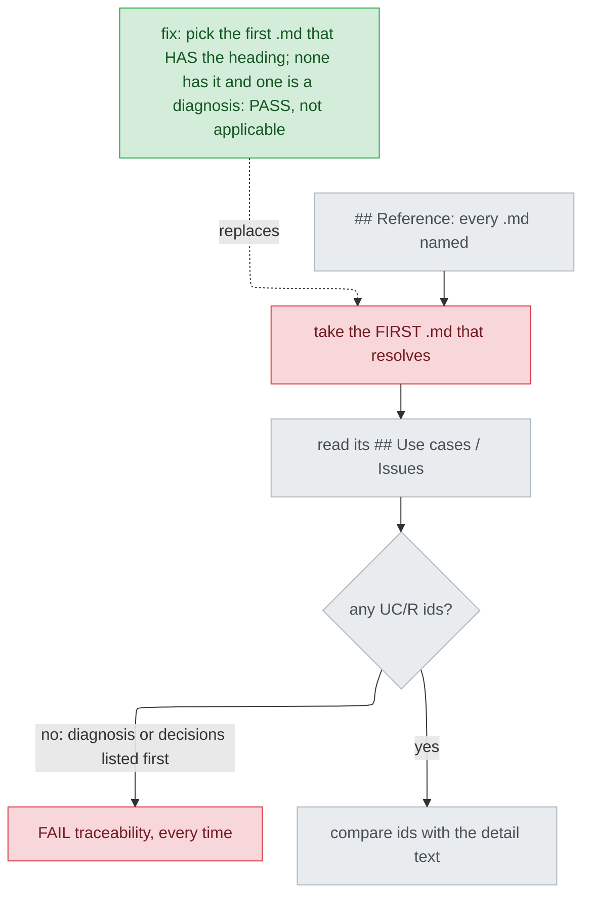

# 細部設計接在診斷之後，探針的可追溯性檢查必定失敗 — diagnosis

名詞：探針（probe，`plugins/cai/scripts/design_probe.py`，對設計文件逐項做固定檢查、每項印 PASS/FAIL 的腳本）；可追溯性檢查（traceability，探針裡確認細部設計有沒有提到上游文件每個需求編號的那一項）；診斷文件（diagnosis）、立場文件（stance）、決策文件（decisions）、細部設計（detail design）、舊式高層設計（HLD）是 design 階段的五種文件；使用情境編號（UC/R id，寫成 `UC1`、`R1`）。

## Status

approved 2026-09-26

## Symptom

`## Reference` 只列一份已核准診斷文件的細部設計，跑 `design_probe.py --kind detail`，不論內容寫什麼，都印 `FAIL traceability (the high-level design numbers no use cases)` 並 exit 2。

**重現**（2026-09-25，已安裝的 1.33.0 探針，與 repo 的 `plugins/cai/scripts/design_probe.py` 逐位元組相同，`filecmp.cmp(..., shallow=False)` → `True`）：在 scratchpad 寫兩份夾具——一份 `--kind diagnosis` 0 FAIL 的診斷（`## Status` 為 `approved 2026-09-25`），一份其餘各項都合格、`## Reference` 只寫 `Diagnosis doc: x-diagnosis.md` 的細部設計——然後執行 `python <plugin>/scripts/design_probe.py --kind detail --project-dir <scratch> <scratch>/x-detail.md`：

```
PASS reference_resolves (...\repro\x-diagnosis.md)
FAIL traceability (the high-level design numbers no use cases)
-- detail: 1 probe(s) failed
```

其餘五項 PASS，exit 2。縮減到只剩兩個必要條件：被引用文件沒有 `## Use cases / Issues` 標題，而且它是 `## Reference` 裡第一個讀得到的 `.md`。

**假設與小測試**（每次只改夾具的一處，不改程式）：

| # | 假設：若 X 是原因，改 Y 症狀就消失 | 改了什麼 | 結果 |
|---|---|---|---|
| H1 | 探針只讀被引用文件的 `## Use cases / Issues` | 診斷副本加上這個標題與 `UC1`，細部設計寫 `UC1` | PASS，成立 |
| H2 | 診斷其他段落的編號也會被讀到 | 把 `R1` 寫進 `## Failing test`，細部設計寫 `R1` | 仍 FAIL，不成立 |
| H3 | 看的是位置，不是文件種類 | 另寫一份有 `UC1` 的 stance，排在診斷前面 | PASS，成立 |
| H4 | 是細部設計自己漏寫編號 | 看 FAIL 走哪個分支 | 走的是 `:510-511` 的「空集合」分支，不是 `:512-514` 的「沒提到」分支，不成立 |

H1、H3 正是今天唯一能過關的兩種做法：改已簽核的診斷，或另加一份文件。這兩種都是 AC1 禁止的。

## Failing test

`tests/test_design_probe_diagnosis.py::test_a_detail_after_a_diagnosis_passes_traceability`（新增，由 build 先寫、先跑出紅燈）：把本檔 `DIAGNOSIS` 夾具的 `draft` 換成 `approved 2026-09-25`，寫進 `tmp_path/t-diagnosis.md`；細部設計的 `## Reference` 只寫這個檔名；斷言 `traceability` 為 True，而且標籤點名該診斷檔。今天會失敗，標籤是 `traceability (the high-level design numbers no use cases)`，值為 False。同一檔另加三個測試：列兩份診斷（AC3）；有標題但沒編號的 stance 仍 FAIL（AC4）；`[診斷, stance]` 的順序仍對 stance 的編號做追溯，缺一個就 FAIL。修法順帶改變的一種情況也要有測試：decisions 排在 stance 前面時，改為追溯 stance。

**所依承諾（promise）**：文件。`plugins/cai/skills/track/references/stage-design.md:294-301` 寫明診斷簽核後，改動不只幾個檔案時「goes straight to Detail」；同檔 `:485-487` 要求 Detail 的探針「fix and re-run until 0」。這條路徑上，後一句做不到。

## Root cause

`detail_probes` 用 `## Reference` 裡**第一個讀得到的 `.md`** 當可追溯性的來源，並且假定那份文件一定會為使用情境編號，完全不看文件種類。所以，排第一的上游只要沒有 `## Use cases / Issues`，編號集合就一定是空的，而空集合一律 FAIL。

- 選文件：`plugins/cai/scripts/design_probe.py:496-501`，第一個 `resolve()` 成功就 `break`。
- 只讀一個標題：`design_probe.py:508`。診斷的標題清單裡沒有它（`design_probe.py:82-84`），而且作者不准自己加（`stage-design.md:258-259`「Do not add or rename headings」）。
- 空集合一律 FAIL，訊息仍寫著 HLD 時代的「high-level design」：`design_probe.py:510-511`。
- 文件也是同一個假設：Detail step 0 只寫了 stance、decisions 和舊式 HLD 這三種上游（`stage-design.md:439-444`），範本也一樣（`plugins/cai/templates/design-detail.md.tpl:25-35`、`:45`），`stage-design.md:554-555` 亦然。
- 何時引入（UNVERIFIED，explorer 回報的 `git log`，本階段無法自己執行 git）：`fd30d5f`（#105，2026-09-16）新增了診斷這一種文件和 Diagnosis→Detail 路徑；`detail_probes` 的可追溯性區塊上一次修改是 `09ee5f5`（2026-08-27）。這不影響上面的結論，結論只依據現在的程式碼。

**只修 `:510-511` 會留下什麼**：一是讓空集合改成 PASS 的話，沒編號的 stance/HLD 也會過（違反 AC4）；二是 `## Reference` 把 decisions 排第一時，同一個原因換一條路發作，因為 decisions 也沒有這個標題，`plugins/cai/scripts/preflight.py:474-476` 的註解已經寫到這件事。所以根因是「照位置選文件」，不是空集合那一行。

## Blast radius

- **所有接在診斷後面的細部設計**：一律 FAIL，也就是 Detail step 8 在這條路徑上永遠做不到 0。
- **decisions 排第一的 `## Reference`**：同一個根因。intake 把它列為範圍外；下面的修法會順帶讓它正確追溯到 stance，這一點在 `## Fix` 明寫出來，不暗中擴大範圍。
- **`preflight.py design`**：它會對 design 列的文件跑同一支探針（`plugins/cai/scripts/preflight.py:112-136`）。如果 design 列指向一份接在診斷後的細部設計，之後要重派 design（例如 Gate 1 選了 Changes requested），preflight 會被 traceability 擋下。`preflight.py build` 不跑探針（`preflight.py:484-543`），不受影響。
- **既有的混合引用文件**：`docs/design/2026-09-25-convention-benchmark-case-detail.md:5-7` 依序列了 stance、decisions、diagnosis，今天能過是因為 stance 排第一。修法必須讓它繼續對 stance 的 UC1-UC4、R1 做追溯（同檔 `:14-20`）。
- **`decisions_probes`** 選文件用的是同一個「第一個讀得到的」迴圈（`design_probe.py:391-397`），但只用來檢查 stance 是否已核准，目前沒有回報故障，本次不改。
- **`plugins/cai-codex/scripts/design_probe.py`** 是產生出來的副本，重新產生即可。

## Fix

**方向：路徑是診斷時，直接 PASS 並附說明（issue 的第二個方向）。** 改在「選哪份文件」這一步：

1. 照今天的解析順序，把 `## Reference` 裡所有讀得到的 `.md` 都解析出來。`reference_resolves` 照舊報第一個。
2. 第一個有 `## Use cases / Issues` 標題的文件當來源，之後的行為完全不變：空集合 FAIL、有沒提到的 FAIL、全部提到才 PASS。
3. 如果沒有任何一份有這個標題，但至少一份是診斷，就 PASS，標籤寫明不適用，並列出每一份診斷解析後的路徑，寫法與 `reference_resolves` 印出的相同（AC2、AC3）。例如：`traceability (not applicable -- x-diagnosis.md is a diagnosis and numbers no use cases; build starts from its ## Failing test)`。判斷「是診斷」看的是有沒有 `## Failing test` 標題，這個標題只出現在 `DIAGNOSIS_HEADINGS`（`design_probe.py:52-84`）。不看檔名，因為作者可以自己指定路徑（`stage-design.md:255-256`），這樣 `-diagnosis.md` 字尾就會漏判。
4. 其餘情況照今天的訊息 FAIL。

step 8（`stage-design.md:485-487`）的文字不用改，1-3 做完，這條路徑就能跑到 0（AC6）。第 2 點也會讓 decisions 排第一的 `## Reference` 改成追溯後面的 stance（見 Blast radius 第二點）。intake 把這條記為範圍外，但它是修在根因上的直接結果，不需要多寫程式；build 會為它多加一個測試，把這個行為固定下來。

**為什麼不選第一個方向（改用診斷 `## Failing test` 裡的測試編號）**：探針從這一段能抽出來的，只有第一個帶副檔名的字串（`design_probe.py:49`、`:368`），而範本要求同一段也要寫出所依承諾（例如某份 `.md`），那個字串可能排在測試前面。要可靠地抽出測試，就得收緊診斷文件的格式，等於替一種已簽核的文件訂新的規則，這是 Stance 的工作（`stage-design.md:273-277`）。探針本身也寫明，誤擋一份正確文件的代價高於漏掉一次（`design_probe.py:28-31`）。何況失敗測試已經由 build 的 test-first 把關（`stage-build.md:160-165`），這比「文件裡提到它」更強。

**文件（AC5-AC7）**：
- `stage-design.md:439-444` step 0 加上診斷入口：打開診斷文件，確認 `## Status` 是 `approved` 並帶日期，沒有 Tier 1 要查。
- `:450-451` 的「same `<topic>` as the stance」補上「或診斷」。
- `:552-555` 補上細部設計的 `## Reference` 也可能指向診斷。
- 範本 `design-detail.md.tpl:20-35` 加一行 `Diagnosis doc:`，註解說明這時 traceability 為不適用；`:45` 的表頭改成不指名文件種類的寫法。
- 只改註解、Reference 那幾行和 `### Traceability` 表格，`##` 標題一個都不動（`scripts/validate.py:1224-1235` 會比對）。

**會動到的檔案**：`design_probe.py`、`stage-design.md`、`design-detail.md.tpl`、`tests/test_design_probe_diagnosis.py`，另外重新產生 `plugins/cai-codex/`。

## Invariants preserved

- 上游是 stance/HLD 時：沒提到的編號 FAIL（`scripts/validate.py:1185`）；有標題但沒編號也 FAIL（`:510-511` 的分支保留）。
- `scripts/validate.py:1177-1202` 的 PROBE_CASES 不改，全數通過；範本的 `##` 標題仍與 `DETAIL_HEADINGS` 相同（`validate.py:1224-1235`）。
- 診斷文件的格式不變，`DIAGNOSIS_HEADINGS` 不動。`preflight.py` 不動。
- 驗證方式：`python scripts/validate.py` 全 PASS，`python -m pytest` 全綠，重新產生 codex 後 `validate.py` 沒有 DRIFT；回報 UNRELEASED 時，照 `CLAUDE.md` 的規則跑 `python scripts/gen-codex.py --release <更大的版本>`（AC8）。

## Picture



請看紅色的 `PICK`：錯在「照位置選文件」，不在下游的空集合判斷。綠色節點取代的是 `PICK`，不是 `FAIL`。

## Out of scope

- `stage-build.md:285` 的追溯表在診斷路徑上沒有 UC/R 編號可填（intake 已記錄）。
- 用探針檢查細部設計有沒有提到診斷裡的失敗測試：這是新規則，要做就另開一條走 Stance 的 track。
- 細部設計探針不檢查上游文件是否已核准，stance 路徑也一樣不檢查，本次不改；`:510-511` 過時的「high-level design」字樣也不改。
- `decisions_probes` 的同型選文件迴圈（`design_probe.py:391-397`）。
