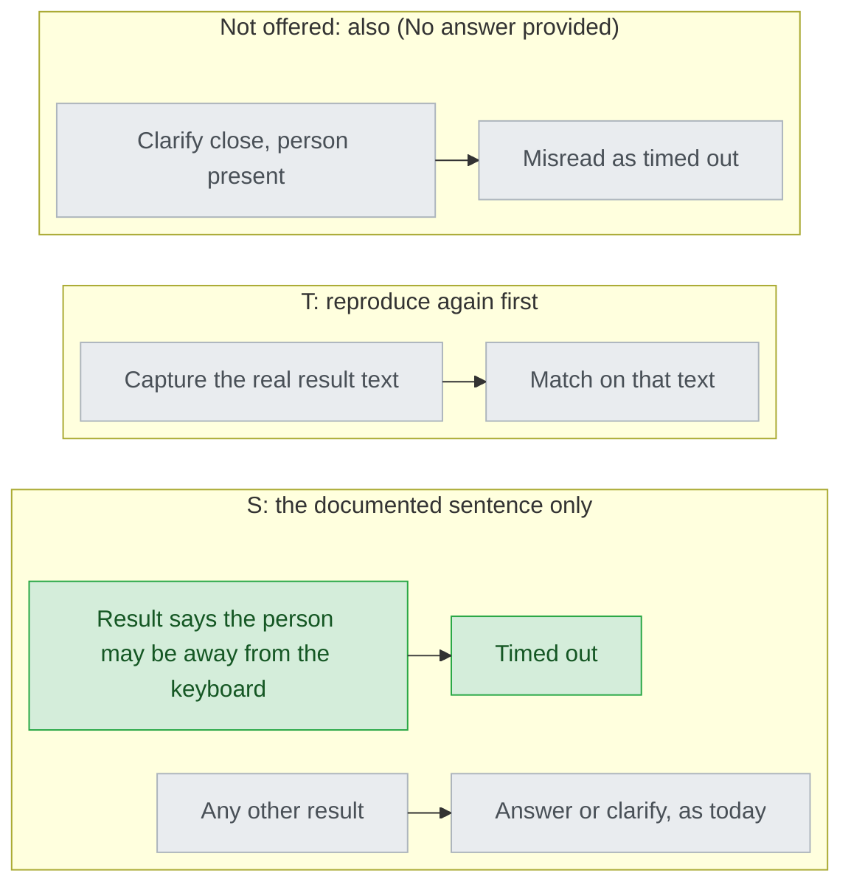

# Question timeout — decisions

## Reference

- Stance: `2026-09-25-question-timeout-stance.md` (this directory) — status: approved 2026-09-25

## Feasibility

| Id | Capability | Verdict | Evidence |
|---|---|---|---|
| C1 | Claude Code has a user setting that closes an unanswered menu after `60s`, `5m` or `10m`, off by default | verified | https://code.claude.com/docs/en/tools-reference.md — "Set the `askUserQuestionTimeout` setting to `60s`, `5m`, or `10m`"; "Questions stay open until you answer them." (quoted at `intake.md:11-13`) |
| C2 | On timeout the dialog submits options already selected and tells Claude the person may be away | verified (as documentation) | https://code.claude.com/docs/en/tools-reference.md — "it submits any options you'd already selected and tells Claude you may be away from your keyboard" (`intake.md:14-16`) |
| C3 | A real timed-out result on Claude Code 2.1.283 carries the words "away from your keyboard" | UNVERIFIED | three attempts never timed out (`design-round2-brief.md:95-99`); the docs give no exact result text |
| C4 | A cursor resting on an option of a single-choice menu is reported as selected | UNVERIFIED | the docs say only "options you'd already selected"; never observed (`design-round2-brief.md:81-85`) |
| C5 | The "clarify" close carries `(No answer provided)` and no "away from your keyboard" | verified (observed) | `design-round2-brief.md:101-116`, attempts A-2 and A-3 |
| C6 | Codex's question tool closes a question on its own | UNVERIFIED | `intake.md:21` |
| C7 | `gen-codex.py` replaces each override's anchor only when found exactly once, else fails | verified | `scripts/gen-codex.py:246-259` |
| C8 | The Codex deny-list is a case-sensitive substring test, so `askUserQuestionTimeout` does not trip the `AskUserQuestion` token | verified | `scripts/gen-codex.py:133`, `:307` |
| C9 | `claude plugin eval` cannot exercise `AskUserQuestion`, so the rule is testable as wording only | verified | `plugins/cai/evals/design-gate-is-a-menu/graders/label-approve.md:13` |
| C10 | `validate.py` requires seven stop-carrying files to name `approval-gates.md` | verified | `scripts/validate.py:1962-1976` |

## Ruled out

| Option | Invariant it violates | Evidence |
|---|---|---|
| Re-dispatch a round with its answered questions while one sits unanswered | I6 — nothing re-dispatched, no round used | `pending-questions.md:59-66` spends a round per re-dispatch |
| Parallel lane with nothing selected: take the option marked `(recommended)` | I5 — sequential regardless; Claude never picks `(recommended)` | `stage-build.md:72` |
| Harmless menu: use text typed into the free-text entry as the answer | I3 counts a selected *option* only; I1 covers the rest | C2 says "options"; the free-text entry "is never an option you write" (`approval-gates.md:21-23`) |
| Codex text describes the same timeout as Claude Code | cross-project: Codex text makes no timeout claim (stance, AC6) | C6; `intake.md:55-57` |
| `/cai:setup` or the docs turn the setting on | I7 — the track neither enables nor needs it | `intake.md:31-32` |

## Requirement gaps

| # | The behavioural assumption | Veto condition, or verification path | Deletes |
|---|---|---|---|

## Tier 1

### design-repro-stop — How does the rule recognise a timed-out menu?

| Option | Rests on | What it costs | Fails when |
|---|---|---|---|
| S — the documented sentence only | C1, C2, C3 | nothing more now | Claude Code rewords the result; nothing in cai notices (stance Sacrifices) |
| T — reproduce again for the exact text | C3 | minutes per attempt, and the timeout never fired on 2.1.283 | the timeout does not fire, as in all three attempts |
| Also treat `(No answer provided)` as timed out (not offered) | C5 | none | a person present picks clarify: Step 0.5 then silently becomes no/sequential |

- **Blast radius:** every stop in the track (`approval-gates.md:35-150`).
- **Found out when:** after release, only if the platform rewords the result.
- **Undo cost:** change one paragraph and its Codex override; users relearn nothing.
- **Decided:** S — the person, 2026-09-25. They first answered "T 再試一次"; after attempt A-3 they wrote "還是沒有自動 approve 走 選項 S" (`design-round2-brief.md:28-36`). Options shown: `options-design-repro-stop.md`, whose S field 3 says the rule recognises a timeout only by the documented sentence.

## Tier 2

### D2 — Where does the definition of a timed-out menu live?

Chose a closing section of `approval-gates.md`, pointed at from the three files that gain timeout text (build Step 0.5, `pending-questions.md`, `ticket-mirror.md`), because C10 (`scripts/validate.py:1962-1976`) already makes every stop-carrying file point there and `track/SKILL.md:99-102` sends the main session there for "where the answer lands". A new file would split that. **Found out when:** after release, when a stop is handled without the rule.

### D3 — What does the Codex tree say about it?

Chose one override that swaps only the Claude-specific recognition paragraph for "untested" wording, the precedent at `scripts/codex-overrides.json:170-182` and `:438-449`. Every other new line stays platform-neutral and passes through unchanged (C7). **Found out when:** after release, when a Codex user meets a question that came back unanswered.

### D4 — After one build Step 0.5 menu times out, are the rest still shown?

Chose yes, each on its own turn, because `stage-build.md:61-64` makes each decision its own menu, and the stance's UC1 has each one time out separately. Treating them as timed out unasked rests on an unwritten guess that the person is still away. **Found out when:** after release; the cost is three timeouts of waiting, 3 × 60 s at the shortest setting.

### D5 — What happens to questions queued behind an unanswered one?

Chose they wait with it, and all are asked again after the person next writes, starting with it. `pending-questions.md:56-58` orders by what constrains the rest, and a question asked past an unanswered one "gets answered against a guess about the first". **Found out when:** after release.

### D6 — Is an unanswered menu recorded in any file?

Chose no new record. A hand-up writes no ledger row (`pending-questions.md:70-75`) and a resume comes from `track_state.py` (`track/SKILL.md:21-25`), so a session that ends on an unanswered menu resumes like one that ends on an unasked one does today. **Found out when:** after release, on a resumed session.

## Tier 3

| Decision | Chose | Instead of | Found out when |
|---|---|---|---|
| Where the section sits in `approval-gates.md` | appended after "The other stops" (after `:153`), as a table of stop and outcome | a "Timed out" row in each gate's option table, where it is not an option | next review |
| Build Step 0.5's text | a paragraph after the glossary bullet giving the three outcomes (AC2), pointing at the section | a pointer only, which AC2 does not accept | next test run |
| `pending-questions.md` | a paragraph under step 1, no renumbering | a new numbered step, which renumbers step 3 | next test run |
| `ticket-mirror.md` | one sentence after step 3's `:33`; `:30-31`, a Codex anchor, untouched | rewording step 3 | next `gen-codex.py --check` |
| What the run says | one line per timed-out menu naming the stop and the outcome, plus the option used at the two menus that use one, since it may be a resting cursor (C4) | one summary at the end | next review |
| Negative guard for Codex | `askUserQuestionTimeout` and `away from your keyboard` join `gen-codex.py`'s deny-list (C8) | a pytest grep of `plugins/cai-codex/` | next `validate.py` run |
| Test level | wording assertions in one new pytest file over both trees (C9) | new pins in `validate.py` | next test run |
| User docs | a new `###` in `MANUAL.md`'s "Walking a track" (C1) | the README's one-line gate summary | next review |
| Versions | cai 1.34.0 and cai-codex `--release 0.2.18` | a patch number | next `validate.py` run (UNRELEASED) |
