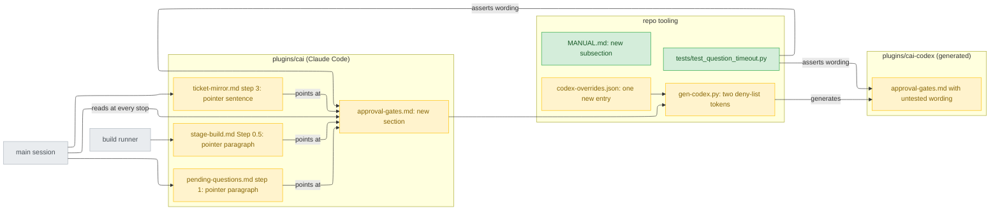
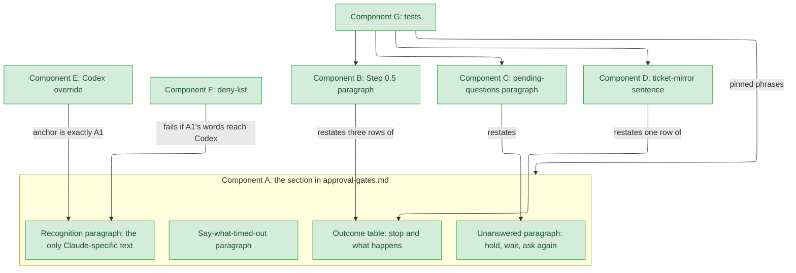
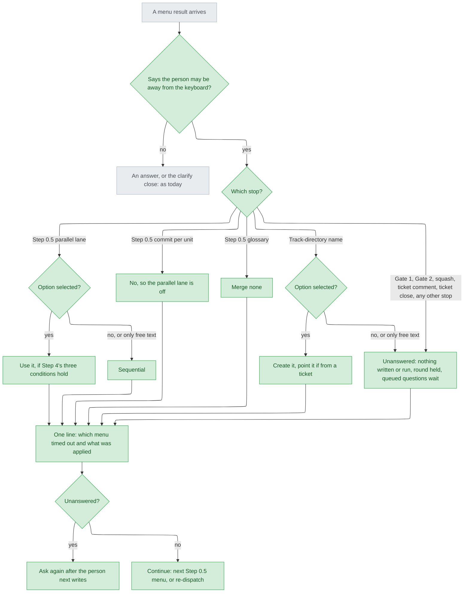
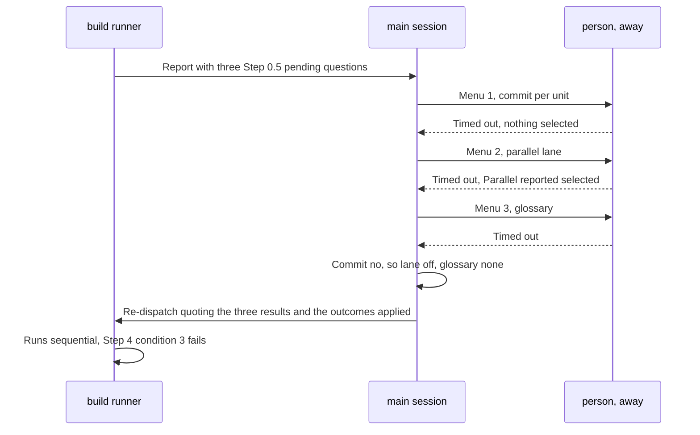
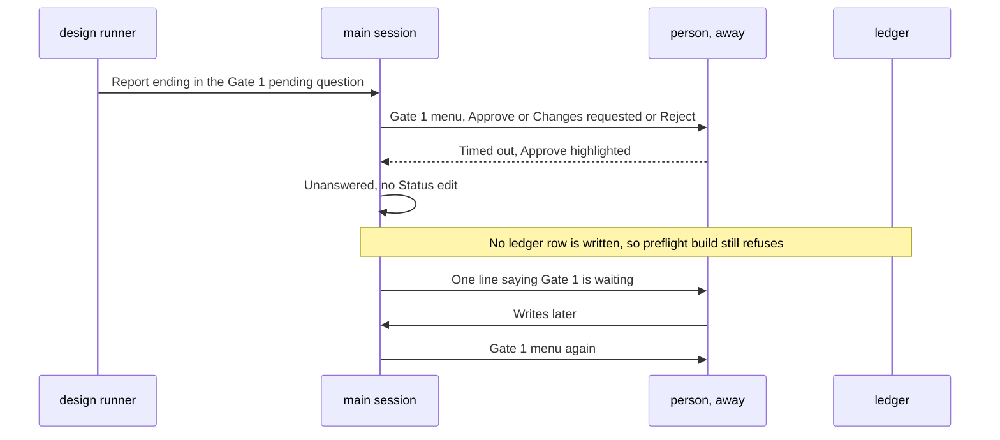
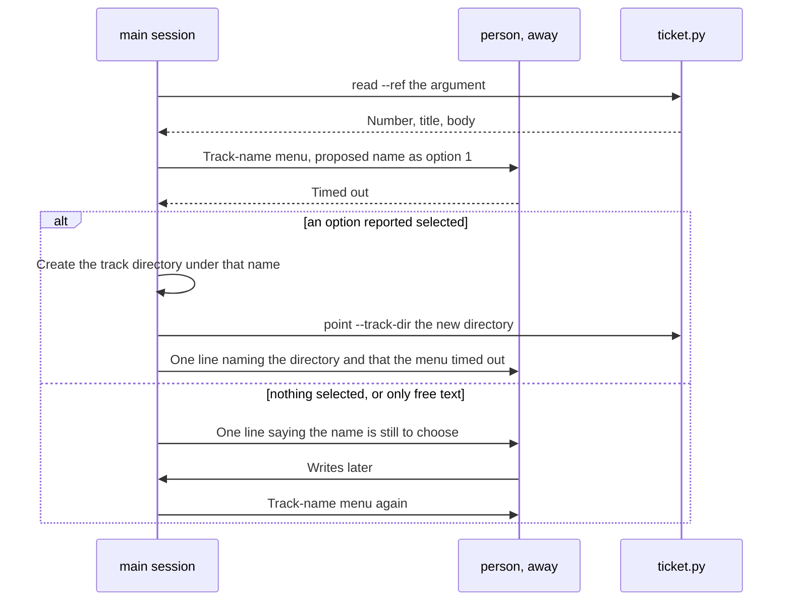
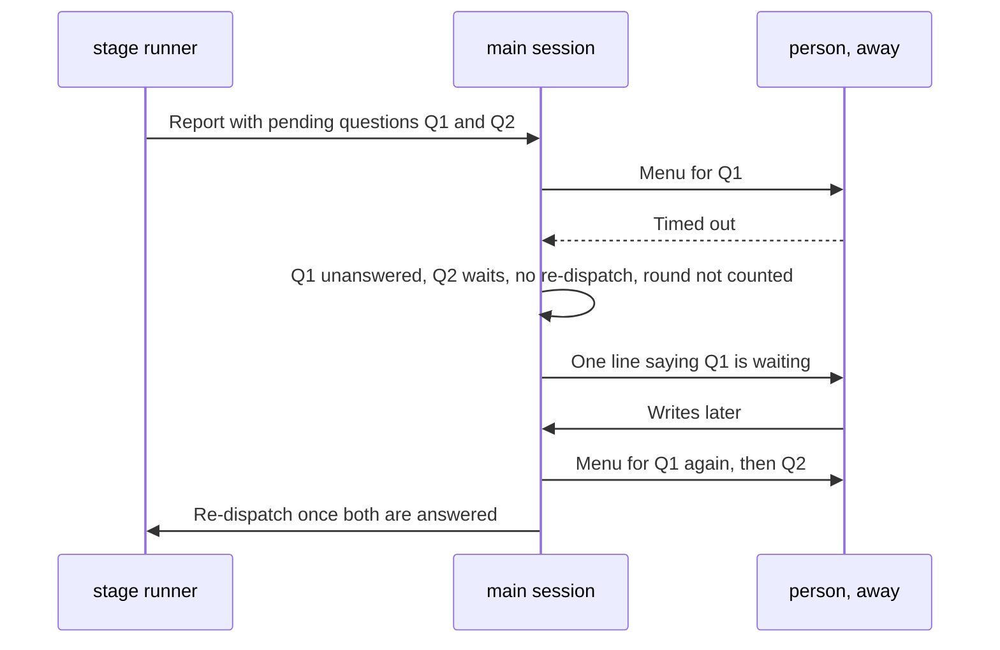
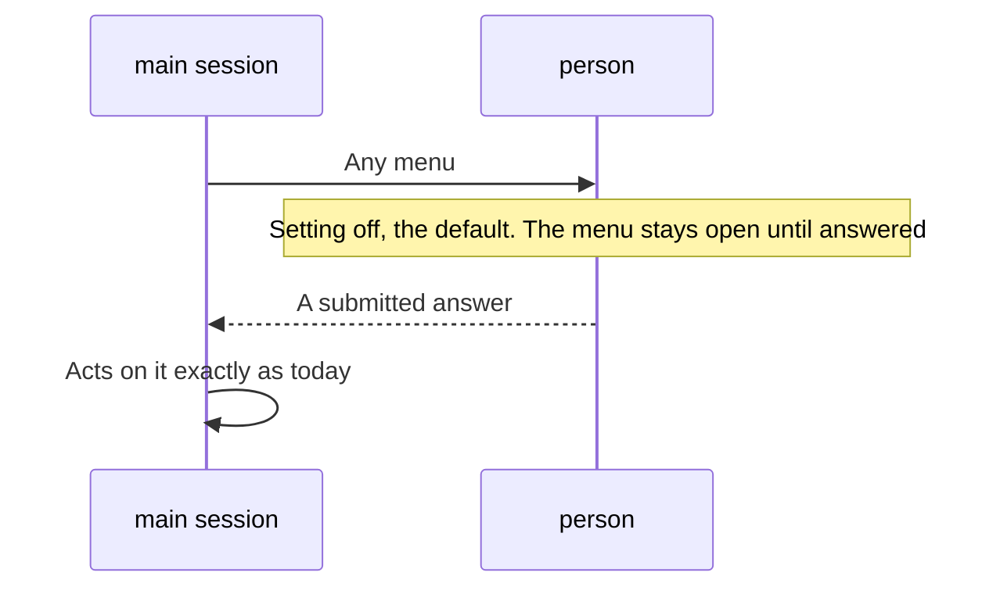

# Question timeout — detail design

## Reference

Stance doc: 2026-09-25-question-timeout-stance.md
Decisions doc: 2026-09-25-question-timeout-decisions.md
Status: approved 2026-09-25 (stance). The decisions document's one Tier 1 entry is decided (S, the person, 2026-09-25).

Both sit beside this file in `.claude/track/build-question-auto-accept/`. Every `file:line` below is relative to the repo root and was opened on branch `feat/158-build-question-auto-accept` at `a849078`.

### Traceability

| From the stance | Satisfied by | Status |
|---|---|---|
| R1 — no shipped sentence says what a timed-out menu means | Component A (the new section), with pointers from B, C and D | covered |
| UC1 — build Step 0.5 with the person away | Component B, and A's table rows for the three Step 0.5 menus; decision D4 | covered |
| UC2 — Gate 1, Gate 2 or a companion times out | A's table rows for Gate 1 and the four ship items | covered |
| UC3 — the track-name menu times out | Component D, and A's table row for the directory name | covered |
| UC4 — any other stop times out | A's "unanswered" paragraph, Component C; decisions D5 and D6 | covered |
| UC5 — the setting is off; docs, validate, pytest, gen-codex | Components H (MANUAL), E and F (Codex), G (tests), I (release) | covered |
| AC7 — pinned sentences and codex anchors survive | Change points: no edit touches `scripts/validate.py:1981-2004`'s strings or any anchor of the twelve overrides these four files carry (`scripts/codex-overrides.json:56`, `:73`, `:147`, `:157`, `:170`, `:438`, `:472`, `:484`, `:596`, `:612`, `:624`, `:634`) | covered |

## Requirement

Claude Code's `askUserQuestionTimeout` closes an unanswered menu and hands the next step to "Claude's own judgment" (https://code.claude.com/docs/en/tools-reference.md). Nothing cai ships says what that means at a track stop. This change gives the main session one rule. A timed-out menu is not an answer, except that at build Step 0.5's parallel-lane question and the track-directory-name question, an option the platform reports as selected is used. Consent is never granted by a timeout. Every other stop stays open and is asked again after the person next writes. The users are people running `/cai:track` who have turned the setting on. It worked when the shipped text states the rule (tests G pass on both trees), the Codex tree makes no timeout claim, and `validate.py`, `pytest` and `gen-codex.py --check` exit 0.

## Glossary

| Term | Definition | Where it lives |
|---|---|---|
| timed-out menu | A menu result that says the person may be away from the keyboard, the wording decided in Tier 1 (option S). | new — plugins/cai/skills/track/references/approval-gates.md |
| unanswered | The state of a stop whose menu timed out with no outcome defined for silence: nothing written, run or re-dispatched, no round used. | new — plugins/cai/skills/track/references/approval-gates.md |
| harmless menu | One of the two menus where a timed-out selection is used: the parallel lane and the track-directory name. | concept |
| selected option | An option the timed-out result reports as selected. Text typed into the free-text entry is not one. | concept |
| resting cursor | The highlight sitting on an option the person never moved to; whether it is reported as selected is UNVERIFIED (C4). | concept |
| clarify close | The platform's "wants to clarify" rejection, carrying `(No answer provided)`; not a timeout (C5). | concept |
| parallel lane | Build's option to run two units in worktrees at once. | plugins/cai/skills/track/references/stage-build.md:70 |
| commit per unit | Build's Step 0.5 consent to commit after each verified unit. | plugins/cai/skills/track/references/stage-build.md:66 |
| glossary question | Build's Step 0.5 menu on which terms join `CONTEXT.md`. | plugins/cai/skills/track/references/stage-build.md:73 |
| track-name menu | The menu that confirms a new track's directory name from a ticket. | plugins/cai/skills/track/references/ticket-mirror.md:30 |
| Gate 1 | The design sign-off menu. | plugins/cai/skills/track/references/approval-gates.md:35 |
| Gate 2 | The menu before ship's irreversible operations, with its three companions. | plugins/cai/skills/track/references/approval-gates.md:99 |
| round | One hand-up and re-dispatch of a stage; three at most. | plugins/cai/skills/track/references/pending-questions.md:65 |
| Codex override | An anchor and replacement pair `gen-codex.py` applies to the Claude text. | scripts/codex-overrides.json:147 |
| deny-list | Tokens that may not appear anywhere in the generated Codex tree. | scripts/gen-codex.py:130 |

## Budgets

| What | Number | Where it comes from |
|---|---|---|
| Shortest timeout the platform offers | 60 s | C1, tools-reference.md |
| Timeout values offered | 3 (`60s`, `5m`, `10m`) | C1 |
| Countdown shown before closing | 20 s | tools-reference.md, "You see a countdown for the last 20 seconds" (`design-round2-brief.md:128-129`) |
| Step 0.5 menus per build run | 3 | `stage-build.md:61-62` |
| Longest unattended wait at Step 0.5 | 180 s at `60s`, 1800 s at `10m` | 3 menus × the timeout (decision D4) |
| Menus where a timed-out selection is used | 2 | stance I3 |
| Rounds a timed-out menu uses | 0 | stance I6 |
| Rounds per stage | 3 | `pending-questions.md:65` |
| Parallel lanes | 2 | `stage-build.md:205` |
| New Codex overrides | 1 | decision D3 |
| New deny-list tokens | 2 | decisions, Tier 3 |

## Design decisions

- One definition, in `approval-gates.md` (D2). Three files gain a short, platform-neutral pointer (D2, Tier 3). Only the recognition paragraph names Claude Code, so only it needs a Codex override (D3).
- Recognition is by the documented sentence only (Tier 1, decided S). The clarify close's `(No answer provided)` is not a timeout.
- The outcomes are the stance's I1–I6, laid out as one table of stop and outcome. The two harmless menus use a selected option. The consent stops grant nothing. Everything else is unanswered.
- An unanswered menu holds its round: nothing is re-dispatched (ruled out: a partial re-dispatch), questions queued behind it wait (D5), and nothing is written to disk (D6).
- The remaining Step 0.5 menus are each still shown (D4).
- The run says what timed out, one line per menu (Tier 3), naming the option used at a harmless menu, because it may have been a resting cursor.
- Codex text says the behaviour is untested (D3), and two deny-list tokens keep Claude's setting name and wording out of the Codex tree (Tier 3).
- Tests assert wording, over both trees (Tier 3). A behavioural test is impossible (C9).

## Diagrams

### Architecture

Look at the three "points at" arrows: every new sentence outside `approval-gates.md` is a pointer into it, so the rule has one home and the Codex tree needs one override, not four.

### Component

The contract that matters is E → A1. The override's anchor is A1 verbatim, so rewording A1 without updating E fails `gen-codex.py` (C7). That is why A1 is kept to one paragraph and every other part stays platform-neutral.

### Flow

The branch to watch is "no, or only free text". Typed text on a timed-out harmless menu lands in the same box as nothing selected (ruled out in the decisions document), so the only way a timeout moves the track forward is through an option the stage itself wrote.

### Sequence — UC1

Menu 2's selection is used and still changes nothing, because I4 lets a timed-out selection get no more than a submitted one: the "no" from menu 1 keeps the lane off. That is consequence 1 the person approved.

### Sequence — UC2

The arrow that is missing is the point: nothing reaches the ledger. An Approve that only rested under the cursor never becomes a `--gate human` row.

### Sequence — UC3

The `alt` is the whole difference from today. With nothing selected, no directory exists, so no stage can start.

### Sequence — UC4

Q2 is never shown while Q1 is open (D5), and the round counter moves only on the final re-dispatch.

### Sequence — UC5

Nothing here is new. It is drawn so that the verifier checks the default path is untouched: no new branch fires without the timeout sentence.

## Implementation spec

The components are Markdown and JSON, not code, so "Interface" is the wording contract a test can hold: the heading or opening words, and the phrases the text must contain. The prose around those is the builder's.

### Component A — the section in `approval-gates.md`

- **Responsibility:** say what a timed-out menu means at every stop the track has.
- **Interface:** a new `## A menu that closes on its own` appended after the file's last line (`plugins/cai/skills/track/references/approval-gates.md:153`), in four parts, in this order:
  - **A1, recognition.** One paragraph, and the only one in the section that names `AskUserQuestion`, `askUserQuestionTimeout` or "away from your keyboard". It must state: the setting is the person's (`/config`, "Question auto-continue timeout"; `60s`, `5m` or `10m`; off by default). A timed-out result "tells Claude you may be away from your keyboard" (C2), and that sentence is the only sign (Tier 1, S). A result without it is an answer or the clarify close, handled as today.
  - **A2, outcomes.** One table, columns `Stop` and `On timeout`, with these rows:
    - Gate 1: nothing written, no `approved`, no `--gate human` row; `build` does not start.
    - Gate 2, the squash, the ticket comment, closing the ticket: nothing runs.
    - Step 0.5 commit per unit: no, so the parallel lane is off.
    - Step 0.5 parallel lane: the option the result reports selected, still subject to `stage-build.md` Step 4's three conditions; sequential when none is.
    - Step 0.5 glossary: merge none, `CONTEXT.md` untouched.
    - The track-directory name (`ticket-mirror.md`): the name the result reports selected; unanswered when none is.
    - Every other stop, in this file's list or handed up under `pending-questions.md`: unanswered.
  - **A3, unanswered.** Must contain: "is not an answer"; nothing acted on or written; no re-dispatch; "no round" of `pending-questions.md` used; queued questions wait with it; asked again "after the person next writes", never in the same turn. It must also say two more things. Text in the free-text entry counts as nothing selected. Never choose a `(recommended)` option yourself.
  - **A4, say what timed out.** One line per timed-out menu, naming the stop and the outcome applied; at the two harmless menus, also the option used, since it may have been a resting cursor. The track neither turns the setting on nor needs it.
- **Data:** in, the text of one menu result. Out, one of: selected option used, fixed outcome applied (no / sequential / none), or unanswered.
- **Errors:** a result that matches no row cannot happen, since the last row catches every stop. A reworded platform result is not recognised, and the stop falls back to today's behaviour. That is the accepted sacrifice, with nothing to detect it.
- **Concurrency:** one asker (the main session) and one menu at a time (`approval-gates.md:31-33`), so there is nothing shared.
- **Observability:** A4's line, on the transcript. No file records it (D6).
- **Where it lives:** `plugins/cai/skills/track/references/approval-gates.md`, which exists; the section is new.
- **What it reuses:** the stop list at `approval-gates.md:123-150`, which A2's last row refers to rather than repeats; the Gate 1 option table at `:68-72`, which is unchanged.

### Component B — Step 0.5 paragraph in `stage-build.md`

- **Responsibility:** give build's three Step 0.5 menus their timeout outcomes where the standalone `/cai:build` reads them (AC2).
- **Interface:** one paragraph inserted after the glossary bullet's last line (`plugins/cai/skills/track/references/stage-build.md:83`) and before `## Step 1` (`:85`). It opens with the words "A Step 0.5 menu that closes on its own". It must contain "commit per unit", "sequential", "merge none" and "approval-gates.md", and it must end by saying the run states which answers timed out and proceeds. It must not contain `AskUserQuestion` or `askUserQuestionTimeout`.
- **Data / Errors / Concurrency:** as A. Nothing new.
- **Observability:** the line A4 describes.
- **Where it lives:** the existing file. No Codex override touches `:54-83`: this file's four overrides (`scripts/codex-overrides.json:56`, `:73`, `:472`, `:484`) anchor at `:3-5`, `:8-9`, `:143` and `:171-172`, so the paragraph passes to Codex unchanged.
- **What it reuses:** `stage-build.md:72` ("default to sequential") and `:198-203` (Step 4's conditions).

### Component C — paragraph under step 1 of `pending-questions.md`

- **Responsibility:** tell the main session, at the point it asks a handed-up question, that a timed-out one holds the round.
- **Interface:** one indented paragraph after step 1's last line (`plugins/cai/skills/track/references/pending-questions.md:58`), before step 2 (`:59`), with no renumbering. It must contain "closes on its own", "approval-gates.md", "no round", and that queued questions wait. It must not contain `AskUserQuestion`. The Codex anchor on `:56` must stay byte-identical.
- **Where it lives:** the existing file.
- **What it reuses:** step 3's round cap (`:65-66`) and "Not a ledger attempt" (`:70-75`).

### Component D — sentence in step 3 of `ticket-mirror.md`

- **Responsibility:** say what a timed-out track-name menu does, where the main session reads it.
- **Interface:** one or two sentences appended to step 3 after `plugins/cai/skills/track/references/ticket-mirror.md:33` ("costs exactly one menu."), before step 4 (`:34`). They must contain "closes on its own" and "approval-gates.md". With a selected option, create and point as step 4 says. With none, create nothing and ask again after the person next writes. The wording must cover every ask for the directory name in this file, naming both step 3 and the mirroring-off ask at `:43-45`, which is not itself edited. Lines `:30-31` (a Codex anchor, `scripts/codex-overrides.json:438-449`) must stay byte-identical.
- **Where it lives:** the existing file.

### Component E — one new Codex override

- **Responsibility:** replace A1 in the Codex tree with wording that makes no timeout claim (AC6, D3).
- **Interface:** one object appended to `overrides` in `scripts/codex-overrides.json`, with the same four keys every entry has (`:147-154`). `target` is `"skills/track/references/approval-gates.md"`. `anchor` is A1's lines, verbatim. `replacement` says that whether the question tool ever closes a question on its own is untested, and that a question which comes back saying the person did not answer it is a timed-out menu, handled as below. `why` cites AC6 and C6, and names the precedent at `:170-182`.
- **Errors:** A1 not found exactly once makes `gen-codex.py` exit 1 with `ANCHOR` (C7, `scripts/gen-codex.py:246-259`).
- **Where it lives:** the existing file (Ours).

### Component F — two deny-list tokens

- **Responsibility:** fail generation if Claude Code's setting name or its result wording reaches the Codex tree.
- **Interface:** two strings appended to `DENY_LIST` (`scripts/gen-codex.py:130-138`): `"askUserQuestionTimeout"` and `"away from your keyboard"`, each with a comment citing AC6 and #158, in the style of `:133`.
- **Errors:** a hit prints `(path, line, token)` and exits 1 (`scripts/gen-codex.py:294-322`).
- **Where it lives:** the existing file (Ours).

### Component G — `tests/test_question_timeout.py`

- **Responsibility:** hold the wording of A–D in both trees, since no behavioural test is possible (C9).
- **Interface:** pytest functions in the style of `tests/test_options_shown_inline.py:13-40`: a `_reference(plugin_root, name)` helper, a `_flat` whitespace-collapser, and `@pytest.mark.parametrize("plugin_root", ["plugins/cai", "plugins/cai-codex"])` where the assertion holds in both trees. The section is sliced from `## A menu that closes on its own` to end of file. Assertions:
  - both trees: the heading; "is not an answer"; "parallel lane" and "sequential"; "directory name"; "no round"; "after the person next writes"; "`(recommended)`"; "free-text"; no match of `\b30\s?s\b` in the section.
  - `plugins/cai` only: "`askUserQuestionTimeout`", "away from your keyboard", "`60s`".
  - `plugins/cai-codex` only: "untested" in the section.
  - both trees: B's paragraph, sliced from "A Step 0.5 menu that closes on its own" to the next blank line, contains "commit per unit", "sequential", "merge none"; C's text between `1. **Ask one decision per turn.**` and `2. **Re-dispatch` contains "closes on its own" and "no round"; D's text between `3. **Ask` and `4. **Create` contains "closes on its own".
- **Where it lives:** new file.
- **What it reuses:** the helper pattern at `tests/test_options_shown_inline.py:13-30`.

### Component H — `MANUAL.md` subsection

- **Responsibility:** tell users where the setting is and what cai does when a menu closes on its own (AC5).
- **Interface:** `### When a menu closes on its own`, inserted after `MANUAL.md:229` and before `### Skipping a stage` (`:231`). It must state:
  - where to set it: `/config`, "Question auto-continue timeout", or `askUserQuestionTimeout` in the user `settings.json`;
  - `60s` is the shortest, and there is no 30 s;
  - it is off by default, and cai never needs it;
  - the outcome at each kind of stop, in user words;
  - that a highlight resting on an option may be reported as selected, and so used at the two harmless menus (UNVERIFIED, C4).
  It must not say the platform picks the recommended option.
- **Where it lives:** the existing file (Ours; not in the Codex tree).

### Component I — release

- **Responsibility:** version the change.
- **Interface:** `plugins/cai/.claude-plugin/plugin.json:3` becomes `"version": "1.34.0"`. Every unit that changes Codex output regenerates with `python scripts/gen-codex.py --release 0.2.18`, which rewrites `plugins/cai-codex/` and records the fingerprint in `scripts/codex-release.json`. Any change to the output leaves `--check` reporting UNRELEASED until that is re-run (`scripts/gen-codex.py:582-583`), and re-recording 0.2.18 is allowed while `main` holds 0.2.17 (`:599-606`); `81eac42` re-recorded its release the same way.
- **Errors:** `--release` refuses a version equal to or below the one published on the base ref (`scripts/gen-codex.py:599-606`, `:703-705`).

## Naming

| Name | What it is | Chosen by |
|---|---|---|
| `## A menu that closes on its own` | Component A's heading | the person-approved stance's own phrase, `2026-09-25-question-timeout-stance.md:9` |
| `A Step 0.5 menu that closes on its own` | Component B's opening words, which the tests slice on | the same phrase, scoped to the step as `stage-build.md:54` names it |
| `### When a menu closes on its own` | Component H's heading | follows `MANUAL.md:222` ("### When a stage has a question for you") plus the stance phrase |
| `tests/test_question_timeout.py` | Component G | follows `tests/test_<subject>.py`, e.g. `tests/test_options_shown_inline.py:1`, with this design's topic slug |
| `askUserQuestionTimeout`, `away from your keyboard` | deny-list tokens | the platform's own strings (C1, C2) |
| `1.34.0` | cai version | follows a minor bump per `feat`: 1.32.2 → 1.33.0 in `81eac42` (`plugins/cai/.claude-plugin/plugin.json:3`) |
| `0.2.18` | cai-codex release | follows +0.0.1 per release, `scripts/codex-release.json:2` (0.2.17) |

## Change points

| Path | Change | Exists today |
|---|---|---|
| `plugins/cai/skills/track/references/approval-gates.md` | Component A appended | yes |
| `plugins/cai/skills/track/references/stage-build.md` | Component B, one paragraph | yes |
| `plugins/cai/skills/track/references/pending-questions.md` | Component C, one paragraph | yes |
| `plugins/cai/skills/track/references/ticket-mirror.md` | Component D, one or two sentences | yes |
| `scripts/codex-overrides.json` | Component E, one entry | yes |
| `scripts/gen-codex.py` | Component F, two tokens | yes |
| `tests/test_question_timeout.py` | Component G | no |
| `MANUAL.md` | Component H | yes |
| `plugins/cai/.claude-plugin/plugin.json` | version 1.34.0 | yes |
| `scripts/codex-release.json`, `plugins/cai-codex/**` | regenerated, release 0.2.18 | yes |

No new dependency. Untouched on purpose: `track/SKILL.md` (its size is under test, `tests/test_track_skill_ticket_pointer.py`), `stage-design.md`, `stage-ship.md`, `stage-intake.md` (each already points at `approval-gates.md`, C10), `plugins/cai-codex/README.md` (hand-written; AC6), and `docs/rule-provenance.md` (no `rules/*.md` sentence is restated).

## Failure modes

| Situation | What happens | What the caller sees |
|---|---|---|
| The platform rewords the timed-out result | Not recognised, so the stop behaves as today: "Claude proceeds on its own judgment" | nothing flags it (accepted sacrifice, Tier 1) |
| The timeout never fires, as on 2.1.283 | Every menu waits as today | nothing changes |
| The setting is off (the default) | No result ever carries the sentence | nothing changes (UC5) |
| A cursor resting on option 1 is reported as selected at the track-name menu | That directory is created and pointed, and intake starts | A4's line names the directory and says the menu timed out; renaming it is by hand |
| Approve highlighted on a timed-out Gate 1 | Ignored; unanswered | A4's line says Gate 1 is waiting |
| Free text typed, then the menu times out, at a harmless menu | Counts as nothing selected | sequential, or the name asked again |
| Step 0.5: commit per unit times out, Parallel selected on the lane menu | Sequential, since Step 4 condition 3 fails | A4's lines for both menus (consequence 1, approved) |
| A round holds Q1 unanswered and Q2 queued | Q2 not shown, no re-dispatch | one line that Q1 is waiting |
| The session ends while a menu is unanswered | Nothing on disk records it (D6); a resume re-dispatches the stage from `track_state.py`, the same as a session that ended before asking | the stage runs again and hands up the same question |
| Component A1 reworded after E was written | `gen-codex.py` exits 1, `ANCHOR` | `validate.py` and `test_gen_codex.py` fail |
| Claude-only wording leaks into a neutral paragraph | deny-list hit, exit 1 | `gen-codex.py` names path, line and token |
| The first run with no track yet (ticket argument) | The track-name menu is the only stop; with nothing selected no directory exists | `track_state.py status` shows no new track |

## Rollout

- **In pieces?** It ships as one PR. The units below land as separate commits. Each Codex-changing unit re-records release 0.2.18 (Component I), so `gen-codex.py --check` and `validate.py` pass at every commit. Unit 1 carries its override and deny-list together because A1 without E is a deny-list hit.
- **Existing data:** none. No state file, ledger field or schema changes, and tracks already in progress need no migration.
- **In flight:** a running session keeps the reference text it already read, and picks up the new text after `/plugin update cai` and a restart (`MANUAL.md:553-560`). A track paused at a stop behaves as before until then.
- **Rollback:** revert the commit. On the Codex side, a reverted output still needs `gen-codex.py --release` with a version greater than 0.2.18, because a published version cannot be reused (`scripts/gen-codex.py:703-705`).

## Verification

| Criterion | Level | What it needs | Green before |
|---|---|---|---|
| R1, AC1 — A exists and states the rule | unit | `tests/test_question_timeout.py`, both trees | unit 1 merges |
| UC2, AC3 — gates and ship items grant nothing | unit | A2 rows asserted | unit 1 merges |
| AC6 — Codex says untested; no Claude timeout words | unit + script | the test's Codex-only assertion; `python scripts/gen-codex.py --check` exits 0 | unit 1 merges |
| UC1, AC2 — Step 0.5 outcomes | unit | B asserted, both trees | unit 2 merges |
| UC4, AC4 — held round, queued wait | unit | C asserted, both trees | unit 2 merges |
| UC3 — track-name menu | unit | D asserted, both trees | unit 2 merges |
| UC5, AC5 — docs, no 30 s, no "picks the recommended" | review | read H against Component H's list; no `30 s` or `30s` inside the new subsection | unit 3 merges |
| AC7 — whole repo green | integration | `python scripts/validate.py` exit 0, `python -m pytest` all pass, `python scripts/gen-codex.py --check` exit 0 | unit 4 merges |
| A real timeout behaves as designed | end-to-end, by hand, not a gate | a person with the setting on, on a version where it fires (C3, C5 UNVERIFIED) | not gated; recorded as open |

## Work breakdown

| Unit | Depends on | Can run alongside | Done when |
|---|---|---|---|
| 1 Component A, with E and F, plus G's section assertions; `python scripts/gen-codex.py --release 0.2.18` | nothing | 3 | `python -m pytest tests/test_question_timeout.py tests/test_gen_codex.py` passes and `python scripts/gen-codex.py --check` exits 0 |
| 2 Components B, C and D, plus G's pointer assertions; `python scripts/gen-codex.py --release 0.2.18` again | 1 | 3 | `python -m pytest tests/test_question_timeout.py tests/test_options_shown_inline.py tests/test_ticket_mirror_reference.py tests/test_gen_codex.py` passes and `python scripts/gen-codex.py --check` exits 0 |
| 3 Component H | nothing | 1, 2 | the Verification row for UC5 is checked by reading |
| 4 cai version 1.34.0 (Component I); full suites | 1, 2, 3 | nothing | `python scripts/validate.py` exits 0 and `python -m pytest` passes |

Unit 1 goes first because it is the riskiest: the only Codex override, whose anchor must match A1 exactly. `tests/test_question_timeout.py` is owned by units 1 and 2, so those two never run alongside each other. They are sequential anyway, since 2 depends on 1.

### Upstream blockers

| What | Owned by | Needed before |
|---|---|---|
| none — nothing outside this repo is needed, and the setting is never required | — | — |
