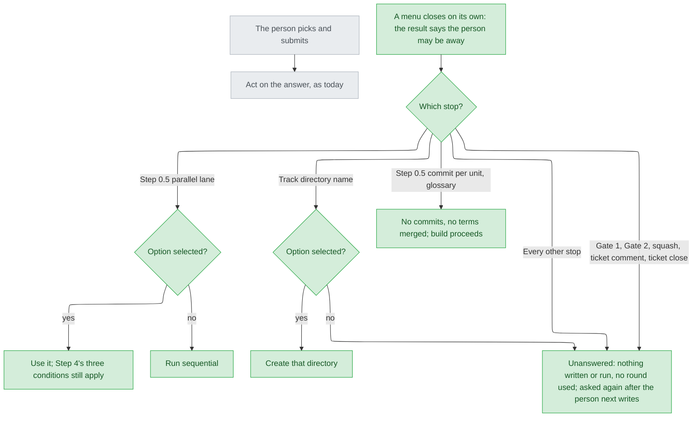

# Question timeout — stance

## Status

approved 2026-09-25

## Optimises for

A menu that closes on its own (Claude Code's `askUserQuestionTimeout`: it "submits any options you'd already selected and tells Claude you may be away from your keyboard", https://code.claude.com/docs/en/tools-reference.md) is never taken as a person's consent or answer. The one exception is the two menus the person called harmless — build Step 0.5's sequential-or-parallel question and the track-directory-name question — where an option the platform reports as selected is used, so the track need not wait there (issue #158; round-1 answer 3, 2026-09-26).

## Sacrifices

- A person who highlighted an option and walked away is asked again at every stop but those two, including both gates, commit per unit and the glossary (approach X, `intake.md:4-5`; answer 3).
- At the two harmless menus, whatever the platform reports as selected is acted on, even a highlight that was only resting there. Whether a resting cursor counts as selected is UNVERIFIED: the timeout never fired in three attempts on Claude Code 2.1.283 (round-2 brief, attempts A-1 to A-3).
- A track waiting at a gate or at any other stop stays waiting. The timeout moves only build Step 0.5 and the track name, never Gate 1 or Gate 2.
- A timed-out result is recognised by the documented sentence alone ("tells Claude you may be away from your keyboard"), which the person chose over further reproduction (round-1 answer 2, option S, field 3). If the platform rewords it, nothing in cai notices.
- No 30-second timeout. The platform offers "`60s`, `5m`, or `10m`" (tools-reference.md), so #158's 30 s becomes 60 s (`intake.md:32-33`).

## Invariants

**This system's:**

- I1 — A timed-out menu is not an answer (AC1). Where a stop has a defined outcome for "no answer", that outcome applies; where it has none, the stop stays open. Nothing is recorded as the person's choice, and a timed-out gate is never written up as Reject (`approval-gates.md:72` records an outcome; silence is not one).
- I2 — A timed-out consent menu grants nothing, whatever option it carries: Gate 1 writes no `--gate human` row and no `approved` in any `## Status`, and build does not start; Gate 2, the squash, the ticket comment and the ticket close run nothing (AC3); commit per unit is no (`workflow.md:20`); the glossary merges no term and leaves `CONTEXT.md` untouched (AC2).
- I3 — A selected option on a timed-out menu counts at exactly two menus: build Step 0.5's parallel lane (`stage-build.md:70-72`) and the track-directory name (`ticket-mirror.md:27-33`, and its no-mirroring ask at `:43-45`). Nowhere else (answer 3). This amends AC1's assumption ("a half-picked option is ignored") and AC4's "The parallel lane is the only exception" for the track name; `intake.md` itself is not edited.
- I4 — A timed-out selection gets no more than a submitted answer would: the parallel lane still needs all three conditions of `stage-build.md:198-203`, so a timed-out commit per unit (no) keeps the run sequential.
- I5 — Nothing selected: the parallel lane runs sequential (`stage-build.md:72`, "default to sequential"); the track name is unanswered. Claude never picks a `(recommended)` option itself at any stop.
- I6 — Unanswered means nothing acted on, nothing re-dispatched, and no round of `pending-questions.md:65-66` used (AC4). It is asked again after the person next writes, never re-asked in the same turn — a re-ask would reopen the same menu and time out again.
- I7 — The track neither enables nor needs the setting. With it off, the default ("Questions stay open until you answer them", tools-reference.md), every menu behaves as today (`intake.md:31-32`, AC5).

**Cross-project:**

- Only the main session asks; the platform removes `AskUserQuestion` from subagents (`pending-questions.md:8-11`).
- `workflow.md:20`, never commit unless explicitly asked.
- `plugins/cai-codex/` is generated, and `AskUserQuestion` is deny-listed there (`scripts/gen-codex.py:133`); Codex text makes no timeout claim (AC6).
- `claude plugin eval` cannot exercise `AskUserQuestion` (`plugins/cai/evals/design-gate-is-a-menu/graders/label-approve.md:13`), so the rule is checkable as wording, not as behaviour.
- Pinned sentences and codex anchors listed in AC7 survive unedited.

## Rejected stances

- U: timed out = unanswered everywhere, with only the sequential fallback. Offered as recommended; the person chose V instead (answer 3).
- V as offered: a selection counts at every ordinary stop. The person narrowed it to #158's two examples, "因為 這兩個基本上是無害的" ("because these two are basically harmless", answer 3).
- #158 read literally: auto-accept the recommended option after 60 s at every question. Rejected with approach X, since a gate's yes cannot be defaulted (`options-intake-q1.md:23`).
- Y: X, plus skipping the parallel question when it cannot apply. The person chose X (`intake.md:4-5`).

## Use cases / Issues

- R1 — No shipped sentence says what a timed-out menu means (`plugins/cai/` hits for "timed out" are git only, `preflight.py:302`), so a timed-out Gate 1 is left to "Claude proceeds on its own judgment" (tools-reference.md). Known fixed when shipped text carries I1-I6.
- UC1 — Build Step 0.5 with the person away: a selection on the parallel question counts (I4 still applies); nothing selected runs sequential; commit per unit is no, and the glossary merges nothing. The run says which answers timed out, and build proceeds (AC2).
- UC2 — Gate 1, Gate 2, the squash, the ticket comment or the ticket close times out: nothing is written or run, and the track says what is waiting (AC3).
- UC3 — The track-name menu times out: a selected name is created, and pointed when the track started from a ticket (`ticket-mirror.md:34-36`); with none, no directory is created and the name is asked again. This adds `ticket-mirror.md` and its Codex override (`scripts/codex-overrides.json:438-449`) to AC4's file list.
- UC4 — Any other stop times out (intake Step 5, cost-sizing, stance approval, diagnosis sign-off, a Tier 1 entry, any pending question): unanswered per I6 (AC4).
- UC5 — The setting is off: nothing changes (AC5). The user docs say where to set it (`/config`, 60 s minimum) and what cai does on a timeout; `validate.py`, `pytest` and `gen-codex.py` pass (AC5-AC7).

## Overview

Look at the two "Option selected?" diamonds: they are the only places a timed-out selection is used, and every other branch ends in a box that grants nothing.

## Out of scope

- The diagnosis document. Its entry condition, a reproduced failure, was not met: three attempts closed by the "clarify" path, never by the timeout. The person moved the consent half here (answer 2, option S), recorded as a Diagnosis → Stance escalation (`stage-design.md:279-282`).
- Why the timeout never fired on 2.1.283. Not investigated, by the person's choice.
- Menus outside the track: `/cai:models`, `/cai:setup`, `/cai:goal`, `/cai:debug`, `/cai:options`.
- Codex's own question timeout. It is UNVERIFIED, so no claim is made (AC6).
- Changing the approved fallbacks: parallel lane with nothing selected runs sequential; track name with nothing selected is asked again.
