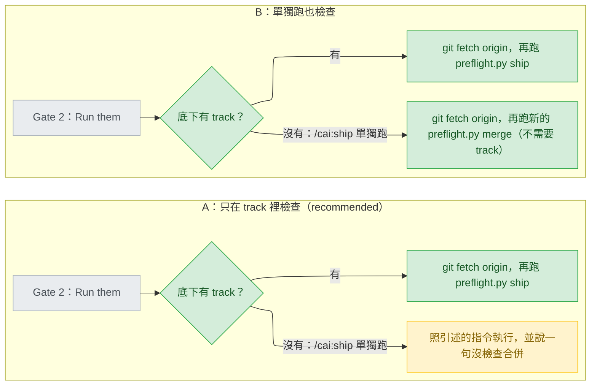

# ship-preflight-merge-check — decisions

名詞（第一次出現的英文詞，先給中文意思）：開工前檢查（preflight）是每個 stage 開始前跑的零 token 腳本 `preflight.py`；stage 是 track（一個功能從 intake 走到 ship 的流程）裡的一段。試合併指 `git merge-tree --write-tree`，只在 git 的物件庫裡算合併結果。結束碼（exit code）是指令結束時回傳的數字。遠端追蹤參照（remote-tracking ref，例如 `origin/main`）是本機記得的「上次抓取時遠端在哪」；抓取（fetch）是連網更新它們。基準 ref（base ref）是拿來試合併的那一邊。Gate 2 是 ship 執行不可逆指令前的人工選單；選項「Run them」是照做，「Stop — hand me the commands」是不執行、把指令交給本人。main session 是本人直接對話的那個 Claude；shipper 是跑 ship 的 subagent（被派出去、沒有提問工具的子代理）。單獨跑（standalone）指直接下 `/cai:ship`，底下沒有 track。ledger 是記錄每次 stage 嘗試的 `ledger.jsonl`；blocked 是其中「preflight 擋下」的結果。淺層複製（shallow clone）只下載最近一段歷史；merge base 是兩條分支的共同起點。stderr 是指令的錯誤輸出。C-quote 指 git 把非 ASCII 檔名寫成 `"\344\270\255"` 這種跳脫形式。實測指這一輪在 scratchpad 的拋棄式 repo 裡實際執行（git 2.39.2.windows.1、Python 3.13、Windows 主控台編碼 cp950，2026-09-25），不碰本 repo 的 ref、索引或工作區。Tier 1 要本人回答，Tier 2 列出來給人掃過，Tier 3 只記錄。

## Reference

- Stance: `docs/design/2026-09-25-ship-preflight-merge-check-stance.md` — status: approved 2026-09-25。下文 `stance:N` 指該檔第 N 行，S1–S7 在 stance:28-34。
- Intake：`.claude/track/ship-preflight-merge-check/intake.md`（AC1–AC8 已核准）。
- 這一輪實測推翻了 stance 的一個前提：S2 依 git 文件說「1 是衝突」，但**參照解析不到時 `merge-tree` 也回 1**（C2）。S2 本身不變——做法是先把兩邊解析成 commit SHA，解析不到就是「沒檢查」，所以 1 只剩衝突一種意思（Tier 3）。
- stance 沒畫到的一條路：單獨跑 `/cai:ship` 也會走 Gate 2（C13），但它沒有 track，`preflight.py ship` 在那裡必定 exit 2。S5 寫的是 stance 圖裡 track 的流程（stance:5、:76）。單獨跑時要不要也檢查，是 D1；本人 2026-09-25 以選單選 A：只在 track 裡檢查。
- R9（本 track 自己出貨時可能撞到版號衝突，stance:65）不是設計決定，留給 ship：出貨前照 AC8 用當下 main 的版號再往上 bump。
- 建造規格：`docs/design/2026-09-25-ship-preflight-merge-check-detail.md`。

## Feasibility

| Id | Capability | Verdict | Evidence |
|---|---|---|---|
| C1 | `merge-tree --write-tree` 乾淨回 0、衝突回 1；乾淨時輸出只有 tree OID 一行 | verified | https://git-scm.com/docs/git-merge-tree ：「For a successful, non-conflicted merge, the exit status is 0. When the merge has conflicts, the exit status is 1.」實測：抓取前對舊的 `origin/main` 回 0、stdout 只有 OID；抓取後回 1 |
| C2 | 參照解析不到時，`merge-tree` 也回 **1**（違反文件的「錯誤回 0、1 以外」），stdout 為空 | verified | https://raw.githubusercontent.com/git/git/v2.39.2/builtin/merge-tree.c 的 `real_merge`：`if (!parent1) help_unknown_ref(branch1, "merge-tree", _("not something we can merge"));`；https://raw.githubusercontent.com/git/git/v2.39.2/help.c 的 `help_unknown_ref` 以 `exit(1);` 結束。實測：`origin/nope` 回 1（stderr `merge-tree: origin/nope - not something we can merge`）；未有 commit 的 HEAD 回 1；175 個 commit 的 clone 裡 `origin/main~300` 回 1、stdout 空 |
| C3 | `git rev-parse --verify --quiet <ref>` 能判斷參照是否解析得到；preflight 已經這樣用 | verified | `plugins/cai/scripts/preflight.py:555`；實測：沒有 origin 的 repo 裡 `origin/main`、`main` 等四個都回 1 |
| C4 | 試合併不動 ref、HEAD、索引、工作區；但會把合併出的物件寫進物件庫 | verified | 文件：「does not make any new commits and does not read from or write to either the working tree or index」（https://git-scm.com/docs/git-merge-tree ）。實測：`for-each-ref`、HEAD、`.git/index` 的 sha256、`status --porcelain` 前後相同；`count-objects` 從 21 變 24 |
| C5 | 試合併耗時遠低於 `git()` 的 5 秒逾時 | verified | `preflight.py:284`（`timeout=5`）。實測：小 repo 15–22 ms；本 repo 的 clone（175 個 commit、555 個檔）衝突 18–29 ms、乾淨 18–26 ms；`git --version` 14 ms。更大的 repo 沒量，逾時時照 S3 是「沒檢查」 |
| C6 | 淺層複製：`--depth 1` 抓回的新 main 與分支沒有 merge base 時，`merge-tree` 回 128；一般 `fetch` 會把歷史接上，回 0 | verified | 文件：「merge-tree will by default error out if the two branches specified share no common history」（https://git-scm.com/docs/git-merge-tree ）；v2.39.2 `real_merge`：`die(_("refusing to merge unrelated histories"));`，`die` 以 `exit(128)` 結束（https://raw.githubusercontent.com/git/git/v2.39.2/usage.c ）。實測：`clone --depth 1` 後 origin/main 是淺層根時回 0；`fetch --depth 1` 之後 `merge-base` 回 1、`merge-tree` 回 128；改用一般 `fetch` 回 0 |
| C7 | 衝突的檔名有非 ASCII 字時，preflight 現有 `git()` 的 `text=True`（用主控台編碼解碼）會讓 stdout 變成 `None`；加 `--no-messages` 後輸出只剩 C-quote 過的 ASCII；`-z` 則是原始 UTF-8 | verified | `preflight.py:283-284`（`text=True`，沒指定 encoding）。文件 `--[no-]messages`：「the default is to include these messages if there are merge conflicts」；`-z`：「Do not quote filenames in the <Conflicted file info> section」（https://git-scm.com/docs/git-merge-tree ）。實測：預設訊息段含 `CONFLICT (content): Merge conflict in 中文.txt` 的原始 UTF-8，reader thread 拋 `UnicodeDecodeError: 'cp950' codec can't decode`，`stdout is None`；`--no-messages` 的 stdout 為 `"\344\270\255\346\226\207.txt"` |
| C8 | git 舊於 2.38 時，`merge-tree --write-tree` 加上兩個參照的呼叫不會回 1：參數個數不對走 `usage()`，exit 129 | verified | https://raw.githubusercontent.com/git/git/v2.37.0/builtin/merge-tree.c ：`if (argc != 4) usage(merge_tree_usage);`；https://raw.githubusercontent.com/git/git/v2.37.0/usage.c 的 `usage_builtin` 以 `exit(129);` 結束。沒有安裝舊 git 實跑（stance:40） |
| C9 | `git --version` 印出 `git version 2.39.2.windows.1` 這種格式，開頭的「主版號.次版號」可以直接讀出 | verified | https://raw.githubusercontent.com/git/git/v2.38.0/Documentation/RelNotes/2.38.0.txt （`--write-tree` 在 2.38 加入，stance:30）。實測輸出 `git version 2.39.2.windows.1` |
| C10 | `git fetch origin`、`git fetch origin main` 都會更新 `origin/main`；遠端不存在時抓取回 128 | verified | https://git-scm.com/docs/git-fetch ：「The remote.<repository>.fetch values determine which remote-tracking branch, if any, is updated.」實測：`fetch origin main` 印出 `12042bc..6bc2906 main -> origin/main`；遠端指向不存在的路徑時 `fetch origin` 回 128，同一時間 `merge-tree` 仍依既有參照回 1（AC5） |
| C11 | `origin/HEAD` 不一定存在（clone 空 repo 時、`remote add` 加 fetch 時都沒有），此時要往下找 `origin/main` | verified | https://git-scm.com/docs/git-remote 的 `set-head`：「With -a or --auto, the remote is queried to determine its HEAD, then the symbolic-ref refs/remotes/<name>/HEAD is set」。實測：兩種情況 `symbolic-ref refs/remotes/origin/HEAD` 都回 128；一般 clone 回 `origin/main` |
| C12 | shipper 只能跑 git 與 gh；`approval-gates.md` 只給 main session 讀；Codex 上 Gate 2 之後由 main session 自己執行指令 | verified | `plugins/cai/agents/shipper.md:7`；`plugins/cai/skills/track/references/approval-gates.md:3-7`；`scripts/codex-overrides.json:194-199` |
| C13 | 單獨跑 `/cai:ship` 讀同一份 `stage-ship.md`，Gate 2 照樣適用，但沒有 track、也不跑 preflight；`preflight.py ship` 需要 `--track-dir`，讀不到 state.md 就 FAIL | verified | `plugins/cai/skills/ship/SKILL.md:10-19`；`approval-gates.md:25-29`；`plugins/cai/skills/track/references/stage-ship.md:14-17`；`plugins/cai/skills/track/SKILL.md:49-52`；`MANUAL.md:264-266`；`preflight.py:609-611`、`:656` |
| C14 | gen-codex 會把 `python ${CLAUDE_PLUGIN_ROOT}/scripts/preflight.py` 改寫成 `<cai> preflight`；沒有任何 Codex 覆寫項錨定 Gate 2 的表格 | verified | `scripts/gen-codex.py:111-112`、`:271`；`scripts/codex-overrides.json:147-182`（三條 approval-gates 覆寫項錨在 `approval-gates.md:6`、`:10`、`:21-23`） |
| C15 | preflight exit 2 記為 `blocked`，除非輸出含 `FAIL ledger_attempts`；`blocked` 計入 5 次上限 | verified | `plugins/cai/skills/track/SKILL.md:71-73`；`MANUAL.md:295` |
| C16 | 既有的 ship 測試只斷言標籤、不斷言結束碼；`SHIP_CLEAN` 是沒有 origin 的暫存 repo；已有用真 bare remote 的測試手法 | verified | `tests/test_preflight_status_gates.py:70-92`；`scripts/validate.py:761-773`、`:1535-1539`；`tests/test_branch_sweep.py:28-44` |
| C17 | `main()` 已把 stdout 改成 UTF-8，所以 FAIL 行可以印出真正的非 ASCII 檔名 | verified | `preflight.py:651` |

## Ruled out

| Option | Invariant it violates | Evidence |
|---|---|---|
| preflight 自己先抓取再試合併 | S1 | stance:28、:45 |
| 看輸出第一行（或輸出有沒有檔名）判斷衝突 | S2：只看結束碼。C1 也說明乾淨時輸出本來就只有一行 | stance:29；C1 |
| 判斷不了（舊 git、淺層複製、其他結束碼、逾時）就 FAIL | S3 | stance:30、:47 |
| 用 `git merge --no-commit` 或另開 worktree 真的合一次再還原 | S4：會動工作區與索引 | stance:31；C4 |
| 單獨跑時，由 main session 自己下 `merge-tree` 讀結束碼 | 已否決的做法三（stance:46），判斷落在模型讀輸出；intake:11 記錄主 session 就讀錯過一次 | stance:46；intake.md:11 |
| 有衝突就自動把基準分支合進來 | 已否決（stance:48），也在 Out of scope | stance:48、:100 |

## Requirement gaps

| # | The behavioural assumption | Veto condition, or verification path | Deletes |
|---|---|---|---|

## Tier 1

### D1 — 單獨跑 `/cai:ship` 時，Gate 2 的「Run them」也要先抓取再檢查合併嗎？

兩張圖只差右下角：A 在單獨跑時照今天的樣子執行；B 為單獨跑多開一個不需要 track 的新入口。

| Option | Rests on | What it costs | Fails when |
|---|---|---|---|
| A — 只在 track 裡檢查（recommended） | C13、C12 | Gate 2 那一列多一句「單獨跑時照引述執行，並說沒檢查合併」。preflight 的命令列不變；preflight 本來就只在 track 裡跑（C13），單獨跑本來就沒有任何 preflight 檢查。以後要改成 B 是純加法 | 有人不開 track、直接 `/cai:ship`，push 了一條有衝突的分支：PR 顯示 CONFLICTING、CI 不跑，和今天一樣 |
| B — 單獨跑也檢查 | C13、C14、C3 | `preflight.py` 多一個不讀 track 的入口 `merge`（不需要 `--track-dir`、不印 ledger 兩行），加測試與 `MANUAL.md` 說明；Codex 版自動變成 `<cai> preflight merge`（C14）。這是發佈出去的命令列介面，之後拿掉就是破壞性變更。另一種寫法是讓 `ship` 接受沒有 `--track-dir`，但 track 裡漏傳這個參數時會悄悄跳過 `verify_status`，所以 B 取獨立入口 | 新入口要當成公開介面一直維護；它和 `ship` 裡的 `merges_cleanly` 必須共用同一個函式，否則兩處判斷會分歧 |

- **Blast radius:** A 只動 `approval-gates.md` 一列；B 另外動 `preflight.py` 的命令列、`MANUAL.md`、Codex 產出。
- **Found out when:** A 的漏檢在發佈後、有人單獨出貨撞到衝突時才知道；B 的維護成本在下一次有人改 preflight 命令列時才知道。
- **Undo cost:** A→B 是加法，低；B→A 要移除一個公開入口，高。
- **Decided:** A — 只在 track 裡檢查。本人 2026-09-25 以選單回答，選的標籤是「只在 track 裡檢查 (Recommended)」，選項原文在 `.claude/track/ship-preflight-merge-check/options-D1.md`。結果：Gate 2 的「Run them」在單獨跑的 `/cai:ship` 裡照引述的指令執行，並說一句沒檢查合併；`preflight.py` 的命令列不變。答完之後重跑成本測試：D2–D6 不受影響，仍是 Tier 2；D7 失去它依附的另一支（見下）。

## Tier 2

### D2 — Gate 2 的抓取與重跑由誰執行？

Chose main session：本人選「Run them」之後、重新派 shipper 之前，自己跑 `git fetch origin` 與 `python ${CLAUDE_PLUGIN_ROOT}/scripts/preflight.py ship`；exit 0 才把「Run them」交給 shipper。shipper 只有 git 與 gh（`plugins/cai/agents/shipper.md:7`），而 `approval-gates.md:3-7` 本來就只給 main session 讀；替 shipper 加 `Bash(python:*)` 是放寬一個會做不可逆動作的 agent 的權限。Codex 上本來就是 main session 執行（`scripts/codex-overrides.json:194-199`，C12）。**Found out when:** 發佈後第一次 track 出貨。

### D3 — 試合併的基準 ref 怎麼找？

Chose 只找遠端追蹤參照：`origin/HEAD` → `origin/main` → `origin/master`，取第一個用 `rev-parse --verify --quiet` 解析得到的（C3、C11）；不用本機的 `main`／`master`。stance:13 要的是「剛抓下來的遠端預設分支」；抓取只更新遠端追蹤參照（https://git-scm.com/docs/git-fetch ，C10），本機 main 當基準時 Gate 2 的重跑和第一次一模一樣，S5 就落空；ship 自己算 BASE 也只走 origin 這條（`plugins/cai/skills/track/references/stage-ship.md:79-84`）。**Found out when:** 發佈後，第一個沒有 origin、只有本機 main 的使用者出貨時（看到「沒檢查」而不是結果）。

### D4 — Gate 2 的抓取失敗時怎麼辦？

Chose 照樣重跑 `preflight.py ship`，exit 0 就照引述執行，並把抓取失敗的 stderr 第一行轉告本人。本人對「判斷不了」選的是放行並講明原因（`.claude/track/ship-preflight-merge-check/intake.md:22`、`options-intake-unknown.md:6`）；抓取失敗時重跑用的是上次的參照，屬於同一類。遠端連不上時，接著的 push 也會失敗（實測 `fetch` 回 128，C10），不會多出一次未經檢查的推送。**Found out when:** 發佈後第一次在離線或權限錯誤時按「Run them」。

### D5 — Gate 2 重跑 exit 2 時，ledger 記什麼？

Chose 照既有規則記 `ship` 為 `blocked`，`--note` 引述每一條 FAIL 行；輸出含 `FAIL ledger_attempts` 時只回報、不追加；state.md 的 ship 列不動。`plugins/cai/skills/track/SKILL.md:71-73` 已規定 preflight exit 2 就是 `blocked`，不另立一種結果；這一筆計入 5 次上限（`MANUAL.md:295`，C15）。**Found out when:** ledger 累積之後、有人讀 `/cai:track status` 時。

### D6 — 選「Stop — hand me the commands」時，要不要把抓取與重跑也交出去？

Chose 不要：照今天只交出引述的指令（`plugins/cai/skills/track/references/approval-gates.md:108`）。本人自己執行的 push 不受這道檢查保護，是 stance 已接受的代價（`docs/design/2026-09-25-ship-preflight-merge-check-stance.md:22`）；交出一條 `preflight.py` 指令還得附上 track 路徑，而本人手打的指令本來就不經過 track。**Found out when:** 發佈後，本人手動 push 的 PR 在 GitHub 上顯示 CONFLICTING 時，和今天一樣。

### D7 — Gate 2 重跑整個 `preflight.py ship`，還是只跑合併那一項？

Chose 整個 `preflight.py ship`。S5 與 AC6 寫的就是重跑它（`docs/design/2026-09-25-ship-preflight-merge-check-stance.md:32`、`.claude/track/ship-preflight-merge-check/intake.md:38`），不必為 Gate 2 另開一個入口；因此 Gate 2 時 `clean_tree` 也會再查一次，squash 之後有未 commit 的檔案時同樣擋下，FAIL 行會說是 `clean_tree`（`MANUAL.md:294`）。D1 選了 A（2026-09-25），「單獨跑時改跑 `merge`」那一支已不存在：單獨跑的 `/cai:ship` 在 Gate 2 不跑任何 preflight。**Found out when:** 第一次在 squash 與 Gate 2 之間有檔案寫進沒被忽略的目錄時。

## Tier 3

| Decision | Chose | Instead of | Found out when |
|---|---|---|---|
| 新檢查的名字 | `merges_cleanly`（stance:102 交給這裡；本人在 `options-intake-unknown.md:6` 的範例裡已看過這個名字；照 `clean_tree` 的 snake_case，`preflight.py:622`） | `merge_clean`、`base_mergeable` | 下一次測試 |
| 放在 `ship()` 的哪裡 | 回傳清單最後，`not_main_branch` 之後（`preflight.py:630`） | 放在最前面 | 下一次測試 |
| 參照解析不到時 exit 1 的陷阱（C2） | 先用 `rev-parse --verify --quiet` 把 HEAD 與基準 ref 解析成 SHA，把 SHA 交給 `merge-tree`；解析不到就是「沒檢查」 | 相信文件說的「錯誤不會回 1」 | 下一次測試（未有 commit 的 HEAD 那一條） |
| 找基準 ref 的程式 | 新函式，走 D3 的三個遠端候選並逐一驗證；`find_base_ref()` 不動 | 給 `find_base_ref()`（`preflight.py:546-558`）加參數，那是 verify 在用的 | 下一次測試 |
| 輸出編碼（C7） | `--name-only --no-messages -z`，以 `encoding="utf-8", errors="replace"` 解碼；`git()` 加一個只限關鍵字的 `encoding` 參數，預設行為不變 | 沿用 `text=True`（非 ASCII 檔名在 cp950 下讓 stdout 變 `None`） | Windows 上的下一次測試（CJK 檔名那一條）；Linux CI 的 UTF-8 locale 抓不到 |
| 舊 git 的判斷 | 先跑 `git --version`（C9），讀開頭的「主.次」版號，低於 2.38 就「沒檢查」；讀不出版號時照跑，靠 C8（舊 git 回 129，不是 1）兜底 | 只靠結束碼（訊息會變成「exited 129」，看不出是版本問題）；intake:44 也寫了先讀版本 | 發佈後，舊 git 的使用者回報時 |
| 逾時 | 沿用 `git()` 的 5 秒（實測最多 29 ms，C5） | 為試合併另設更長的逾時 | 發佈後，大 repo 的使用者看到「沒檢查」時 |
| 「沒檢查」的原因字串 | 其他結束碼時寫 `git merge-tree exited <N>: <stderr 第一行>`，不解析 stderr 的內容 | 依 stderr 內容對應成自訂說法（例如把 128 認成淺層複製） | 下一次測試 |
| 淺層複製沒有 merge base（C6） | 不加 `--allow-unrelated-histories`，回 128 就是「沒檢查」 | 加上它，沒有共同起點時變成兩方比對、報出不存在的衝突 | 下一次測試 |
| FAIL 行列幾個衝突檔 | 前 10 個，其餘寫 `and <N> more` | 全列 | 下一次測試 |
| 訊息格式 | 乾淨：寫出基準 ref 與它的短 SHA（AC2）；衝突：寫出基準 ref、短 SHA、檔名與通用下一步（S6），下一步先寫「抓取」再寫「合進來」，因為這次擋下用的可能是舊的參照；沒檢查：`not checked: <原因>`（S3、`options-intake-unknown.md:6`）。檔名照原字印出（C17）。逐字字串由 Detail 定 | 在這裡定逐字字串 | 下一次測試 |
| Gate 2 的抓取指令 | `git fetch origin`（不必知道基準分支叫什麼，D3 的三個候選都在 origin 底下，C10） | `git fetch origin <branch>`，要先從 preflight 的輸出讀出分支名 | 下一次測試 |
| 物件庫裡多出的物件（C4） | 留給 git 自己清理，不另處理 | 用暫時的物件目錄隔開 | 不會發現：不影響任何 ref 或工作區 |
| 測試放哪 | 新檔 `tests/test_preflight_merge_check.py`，用真的 bare remote（C16 的手法）；`validate.py` 不加新項，`SHIP_CLEAN` 原樣維持 exit 0（S7） | 在 `validate.py` 加 case | 下一次測試 |
| `approval-gates.md` 與 `MANUAL.md` 的文字 | 在同一個測試檔斷言 Gate 2 那一段有 `git fetch origin`、`preflight.py ship`、「Exit 2」，以及 D1 的單獨跑那一句（`/cai:ship`、沒檢查合併）；`MANUAL.md` 的擋下條件表有 `merges_cleanly` | 不測文字 | 下一次測試 |
| 版號 | `plugin.json` 取大於出貨當下 main 的 minor 版號（新檢查算新功能，同 `46e099b` 的 minor bump；main 已在 1.33.0，所以是 1.34.0）；cai-codex 以 `gen-codex.py --release` 取大於出貨當下 main 的版號（main 已在 0.2.17）（R9） | patch bump | ship 時 `validate.py` 報 DRIFT／UNRELEASED |
