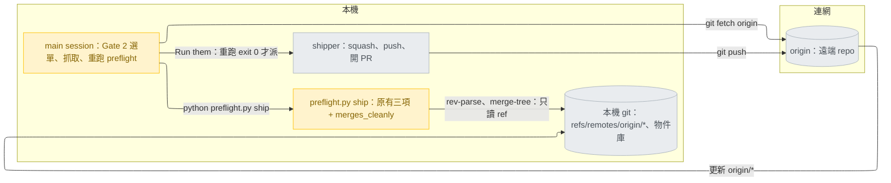
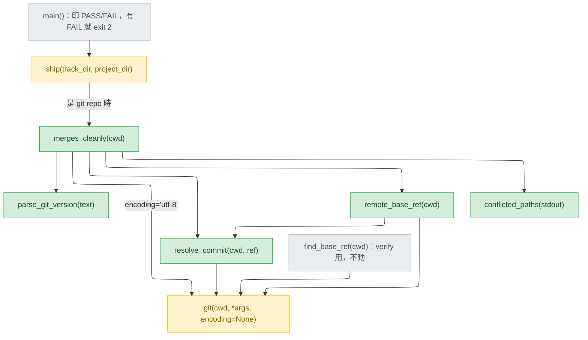
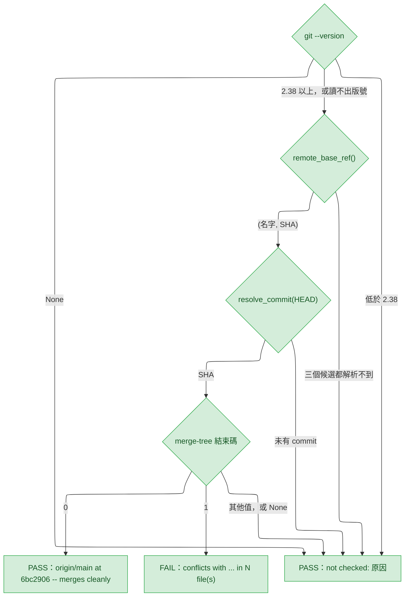
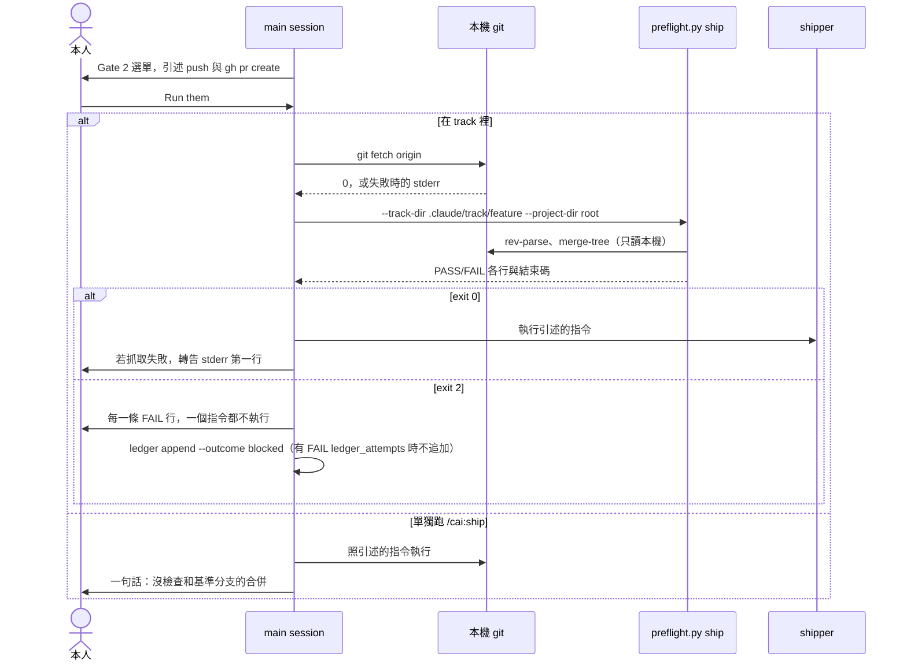
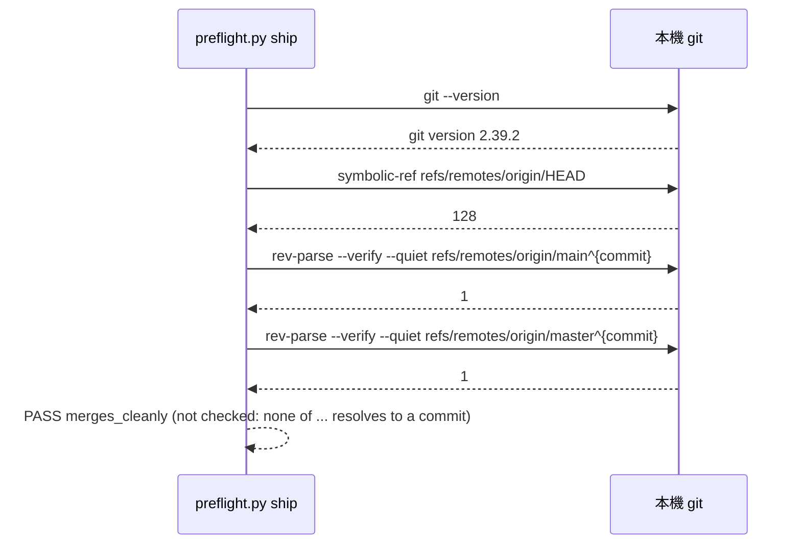
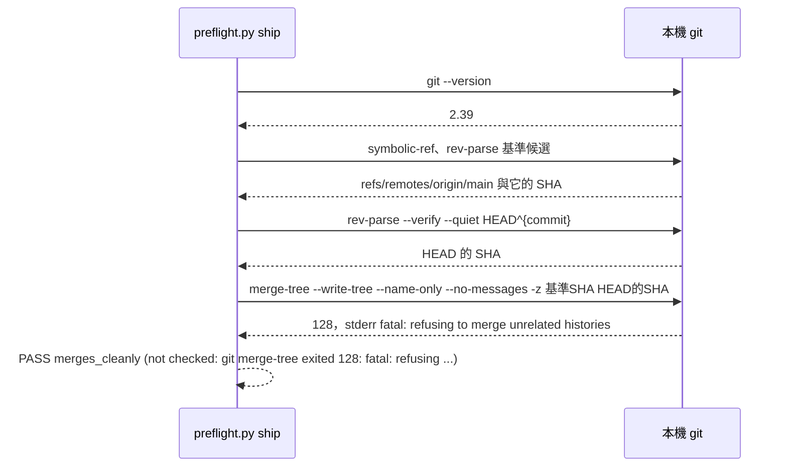
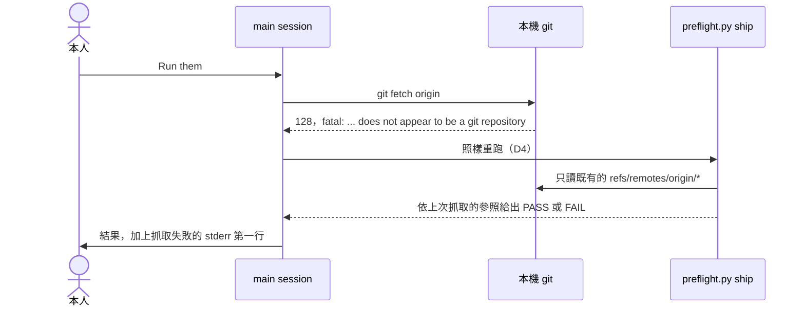
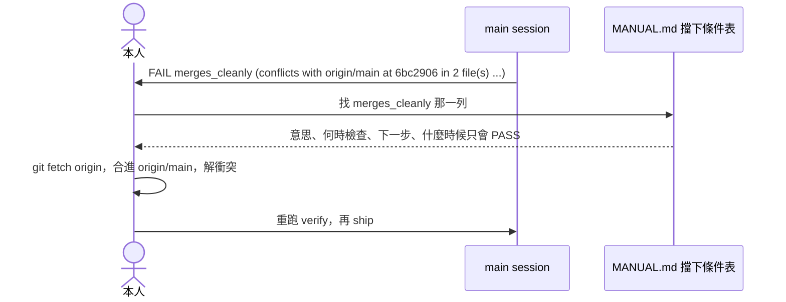
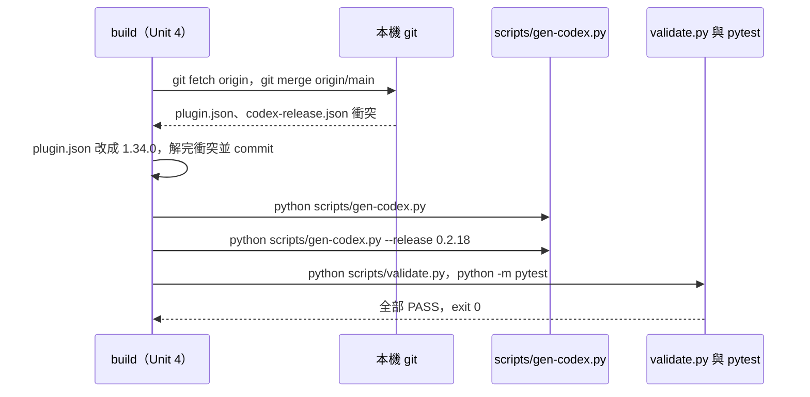

# ship-preflight-merge-check — detail design

名詞（第一次出現的英文詞，先給中文意思；逐項定義見 `## Glossary`）：開工前檢查（preflight）是每個 stage 開始前跑的零 token 腳本 `plugins/cai/scripts/preflight.py`，印出 `PASS`／`FAIL` 行，有 `FAIL` 就結束碼（exit code）2。stage 是 track（一個功能從 intake 走到 ship 的流程）裡的一段。試合併是 `git merge-tree --write-tree`：只在 git 的物件庫裡算合併結果，不動工作區。遠端追蹤參照（remote-tracking ref，例如 `origin/main`）是本機記得的「上次抓取時遠端在哪」；抓取（fetch）是連網更新它們。基準 ref（base ref）是拿來試合併的那一邊。Gate 2 是 ship 執行不可逆指令前的人工選單。main session 是本人直接對話的那個 Claude；shipper 是跑 ship 的 subagent（被派出去的子代理）。單獨跑（standalone）指直接下 `/cai:ship`，底下沒有 track。ledger 是記錄每次 stage 嘗試的 `ledger.jsonl`。淺層複製（shallow clone）只下載最近一段歷史；merge base 是兩條分支的共同起點。stderr 是指令的錯誤輸出。實測指在 scratchpad 的拋棄式 repo 裡實際執行（git 2.39.2.windows.1、Python 3.13、主控台編碼 cp950，2026-09-25）；round 2 的紀錄在 decisions 文件的 Feasibility 表，這一輪另外補了四項，寫在用到它的地方。

## Reference

Stance doc: docs/design/2026-09-25-ship-preflight-merge-check-stance.md
Decisions doc: docs/design/2026-09-25-ship-preflight-merge-check-decisions.md
Status: approved 2026-09-25（stance）；decisions 的 Tier 1 只有 D1，本人 2026-09-25 以選單回答 A（只在 track 裡檢查），選項原文在 track 目錄的 `options-D1.md`。

`stance:N`、`decisions:N` 指上面兩份的第 N 行；S1–S7 是 stance 的不變式（stance:28-34），D1–D7 與 Tier 3 是 decisions 的條目，C1–C17 是 decisions 的 feasibility 列，AC1–AC8 是 intake 的驗收條件（`.claude/track/ship-preflight-merge-check/intake.md:33-40`）。

### Traceability

| From the high-level design | Satisfied by | Status |
|---|---|---|
| R1 — ship 的 preflight 不查合併 | `merges_cleanly()` 接在 `ship()` 回傳清單最後（Unit 1）；測試 `test_conflict_blocks_and_names_base_and_files`、`test_clean_branch_passes_with_ref_and_sha` | covered |
| R2 — preflight 到 push 之間 main 可能又前進 | Gate 2「Run them」先 `git fetch origin` 再重跑 `preflight.py ship`（Unit 2 的 approval-gates 文字） | covered |
| R3 — 抓取與重跑由誰執行 | D2：main session，在重新派 shipper 之前；寫進 Gate 2 文字 | covered |
| R4 — 基準分支怎麼選 | D3：`remote_base_ref()` 只走 `origin/HEAD` 指向的分支 → `origin/main` → `origin/master` | covered |
| R5 — 抓取指令與失敗時的處理 | Tier 3：`git fetch origin`；D4：失敗照樣重跑，轉告 stderr 第一行 | covered |
| R6 — 舊 git 的判斷與逾時 | `parse_git_version()` 加 `MERGE_TREE_MIN_VERSION`；沿用 `git()` 的 5 秒 | covered |
| R7 — 重跑 exit 2 時 ledger 記什麼；Stop 時交出什麼 | D5（`blocked`，`--gate auto`）、D6（只交出引述的指令）；寫進 Gate 2 文字 | covered |
| R8 — 重跑的是整個 `preflight.py ship` | D7；`clean_tree` 在 Gate 2 也再查一次，列在 Failure modes | covered |
| R9 — 本 track 自己出貨時的版號衝突 | Unit 4 先把 `origin/main` 合進來，再 bump 到 1.34.0 與 cai-codex 0.2.18；見 Rollout | covered |
| UC1 — 沒有 origin、沒有 main | `PASS merges_cleanly (not checked: none of origin/HEAD, origin/main, origin/master resolves to a commit)`；`validate.py` 的 `SHIP_CLEAN` 不改、維持 exit 0 | covered |
| UC2 — 舊 git、淺層複製、其他錯誤、逾時 | 各有一條 `not checked:` 字串與一個測試 | covered |
| UC3 — 離線 | 測試把遠端改指向不存在的路徑；另有靜態測試證明 `preflight.py` 不呼叫任何連網的 git 子指令 | covered |
| UC4 — 使用者看得懂為什麼被擋 | `MANUAL.md` 擋下條件表多一列 `merges_cleanly`（Unit 3） | covered |
| UC5 — 發版與 Codex 版 | Unit 4：bump、`gen-codex.py` 重產並 `--release`；Codex 版 Gate 2 文字自動變成 `<cai> preflight ship` | covered |

## Requirement

ship 在 push 之前，要知道分支能不能乾淨合進「剛抓下來的」遠端預設分支；不能就不 push，並說出基準 ref 與衝突檔。preflight 本身維持不連網（S1）。對象是用 track 出貨的人；單獨跑 `/cai:ship` 照今天的樣子，只多一句「沒檢查合併」（D1）。怎麼知道成功：AC1–AC8 各有一個測試或 `validate.py` 行指得到（見 `## Verification`），且 `preflight.py` 的原始碼裡沒有任何連網的 git 子指令。

## Glossary

| Term | Definition | Where it lives |
|---|---|---|
| `merges_cleanly` 檢查 | preflight `ship` 的第四項：本機試合併 HEAD 與基準 ref，只看結束碼 | new — plugins/cai/scripts/preflight.py |
| `merges_cleanly()` | 算出上面那一項的函式，回傳一個 `(ok, label)` | new — plugins/cai/scripts/preflight.py |
| `remote_base_ref()` | 找基準 ref：`origin/HEAD` 指向的分支、`origin/main`、`origin/master` 中第一個解析得到 commit 的 | new — plugins/cai/scripts/preflight.py |
| `resolve_commit()` | 把一個 ref 解析成完整的 commit SHA，解析不到回 `None` | new — plugins/cai/scripts/preflight.py |
| `parse_git_version()` | 從 `git --version` 的輸出讀出 `(主版號, 次版號)` | new — plugins/cai/scripts/preflight.py |
| `conflicted_paths()` | 從 `merge-tree -z` 的輸出取出衝突檔名清單 | new — plugins/cai/scripts/preflight.py |
| `git()` | preflight 呼叫 git 的唯一入口，5 秒逾時，叫不動回 `None` | plugins/cai/scripts/preflight.py:278 |
| `ship()` | preflight 的 ship 關卡，今天回傳三項 | plugins/cai/scripts/preflight.py:608 |
| `find_base_ref()` | verify 用來找比對基準的函式，會退到本機 main；這次不動 | plugins/cai/scripts/preflight.py:546 |
| 基準 ref | 試合併的另一邊，一律是遠端追蹤參照（D3） | concept |
| 沒檢查（not checked） | 判斷不了時的結果：印 `PASS`，括號裡寫 `not checked: <原因>`，從不擋（S3） | concept |
| Gate 2 | ship 不可逆指令前的選單，選項「Run them」與「Stop — hand me the commands」 | plugins/cai/skills/track/references/approval-gates.md:99 |
| blocked | ledger 的一種結果：preflight exit 2 | plugins/cai/skills/track/SKILL.md:71 |
| 擋下條件表 | `MANUAL.md` 的「When it blocks you」表，每個 preflight 標籤一列 | MANUAL.md:278 |
| `SHIP_CLEAN` | `validate.py` 裡沒有 origin、沒有 main 的暫存 repo 案例，要維持 exit 0 | scripts/validate.py:1535 |
| cai-codex 發版紀錄 | `gen-codex.py --release` 寫入的版號與指紋 | scripts/codex-release.json:2 |
| cai 版號 | Claude Code 版 plugin 的版號 | plugins/cai/.claude-plugin/plugin.json:3 |
| 合併檢查的測試檔 | 這次新增的行為測試與文字測試 | new — tests/test_preflight_merge_check.py |

## Budgets

| What | Number | Where it comes from |
|---|---|---|
| preflight 呼叫的連網 git 子指令 | 0 | S1（stance:28） |
| 每次 `preflight.py ship` 多出的 git 呼叫，最多 | 7 | 本設計：`--version` 1、`symbolic-ref` 1、基準候選 `rev-parse` 最多 3、HEAD `rev-parse` 1、`merge-tree` 1 |
| 每次 git 呼叫的逾時（秒） | 5 | `plugins/cai/scripts/preflight.py:284` |
| 試合併實測耗時上限（ms） | 29 | C5（decisions:21） |
| 七次呼叫全部逾時時的理論上限（秒） | 35 | 7 × 5；實測每次 14–29 ms（C5） |
| 最低 git 版本 | 2.38 | S3（stance:30）；C9 |
| FAIL 行列出的衝突檔數上限 | 10 | decisions Tier 3「FAIL 行列幾個衝突檔」 |
| 短 SHA 的字元數 | 7 | 本設計（見 `## Design decisions`） |
| 「沒檢查」原因裡引述的 stderr 行數 | 1 | decisions Tier 3「沒檢查的原因字串」 |
| Gate 2「Run them」多出的指令數 | 2 | D2、D7：`git fetch origin`、`preflight.py ship` |
| 出貨後的 cai 版號 | 1.34.0 | main 已在 1.33.0（實測 `git show refs/remotes/origin/main:plugins/cai/.claude-plugin/plugin.json`，2026-09-25）；minor bump，decisions Tier 3「版號」 |
| 出貨後的 cai-codex 版號 | 0.2.18 | main 已在 0.2.17（實測 `git show refs/remotes/origin/main:scripts/codex-release.json`）；`--release` 只拒絕小於或等於 main 的版號（`scripts/gen-codex.py:590-597`） |

## Design decisions

decisions 文件已定的，照用，不重議：D1 A（單獨跑不檢查、說一句）、D2 main session 跑抓取與重跑、D3 只找遠端追蹤參照、D4 抓取失敗照樣重跑並轉告、D5 重跑 exit 2 記 `blocked`、D6 Stop 只交出引述的指令、D7 重跑整個 `preflight.py ship`，以及 16 條 Tier 3。

Detail 這一輪新定的，都過了成本測試的三個「低」（只動 `preflight.py` 一個元件、下一次測試就會發現、改了就好），所以直接定、不上交；這一輪是程序允許的最後一輪，也照交代採保守做法：

| Decision | Chose | Instead of | Why | Found out when |
|---|---|---|---|---|
| 基準候選用哪種寫法解析 | 完整名稱 `refs/remotes/origin/main`、`refs/remotes/origin/master`，加 `^{commit}` | 短名 `origin/main` | 實測：本機有一個叫 `origin/main` 的分支時，`rev-parse --verify --quiet origin/main` 回的是那個本機分支（`a6ec647`），完整名稱才回遠端追蹤參照（`8c7f001`）；`^{commit}` 確保拿到的是 commit | 下一次測試 |
| `origin/HEAD` 怎麼讀 | `git symbolic-ref refs/remotes/origin/HEAD`（不加 `--short`），得到完整名稱再用 `resolve_commit()` 驗證 | 直接信 `symbolic-ref` 的結果 | 實測：`origin/HEAD` 指向的 `refs/remotes/origin/main` 被刪掉後，`symbolic-ref` 仍回 0 並印 `origin/main`，只有 `rev-parse` 回 1；不加 `--short` 時印完整名稱 `refs/remotes/origin/main` | 下一次測試（懸空的 `origin/HEAD` 那一條） |
| 四個步驟的順序 | 版本 → 基準 ref → HEAD → 試合併 | 先解析 HEAD | 兩個都缺時說哪一個都對；先說基準 ref 與 AC3 的措辭一致 | 下一次測試 |
| 不是 git repo 時 | `ship()` 既有的 else 分支裡直接給 `PASS merges_cleanly (not checked: <dir> is not a git repository)`，不呼叫 `merges_cleanly()` | 呼叫它，讓它回「找不到基準 ref」 | 原因說錯了會誤導；`clean_tree` 在同一情況已經 FAIL（`preflight.py:616-618`） | 下一次測試 |
| 短 SHA | 完整 SHA 的前 7 個字元，不另呼叫 `rev-parse --short` | 讓 git 決定長度 | 少一次 git 呼叫；只是顯示用 | 下一次測試 |
| 型別註記 | 不寫進程式，型別只寫在這份文件與 docstring | 加 `-> tuple[int, int] | None` | `preflight.py` 全檔沒有型別註記，照檔案既有風格（`coding.md`） | 下一次 review |
| Gate 2 擋下時的 `--gate` | `auto`（`ledger.py` 的預設，`plugins/cai/scripts/ledger.py:578`） | `human` | 擋下的是 preflight，不是本人的選擇；`usage_report.py:551-572` 把 `gate: human` 的紀錄當成人工關卡計數 | ledger 累積之後讀報表時；但只影響統計，不影響任何關卡 |
| 衝突結束碼但 git 沒列出檔名 | 照樣 FAIL，寫 `git named no file` | 改判「沒檢查」 | S2：1 就是衝突；檔名只是說明 | 下一次測試 |
| 函式與常數的名字 | 見 `## Naming`；照檔案既有的 snake_case 與大寫常數慣例 | 上交給本人命名 | 都是 `preflight.py` 內部名字，不是使用者看得到的介面；唯一看得到的 `merges_cleanly` 已在 decisions Tier 3 定案 | 下一次 review |

## Diagrams

### Architecture



看圖的重點：碰到「連網」框的只有兩條箭頭——main session 的 `git fetch origin` 和 shipper 的 `git push`；preflight 的箭頭只到本機 git（S1）。main session 因此多了一個責任：先抓取、再重跑，exit 0 才派 shipper（D2）。

### Component



看圖的重點：新東西全在 `merges_cleanly()` 底下，對外只經過 `ship()` 的回傳清單；`find_base_ref()` 與它沒有邊，verify 的行為不變。`git()` 只多一個預設為 `None` 的關鍵字參數，既有呼叫者看不到差別。

### Flow



看圖的重點：走到 `merge-tree` 之前兩邊都已經是 SHA，所以 1 只剩衝突一種意思（C2）；FAIL 只有一個入口（S3），其餘判斷不了的路全部匯到「沒檢查」。

### Sequence — R2 Gate 2（R3、R5、R7、R8 同一條路）



看圖的重點：抓取與重跑都在 main session 手上、在派 shipper 之前（D2）；exit 2 那一支沒有任何箭頭指向 shipper。單獨跑那一支不經過 preflight（D1 A）。

### Sequence — UC1 沒有基準 ref



看圖的重點：沒有任何一步呼叫 `merge-tree`；`SHIP_CLEAN` 走的就是這條，所以 exit 0 不變（S7）。

### Sequence — UC2 淺層複製沒有 merge base



看圖的重點：128 不被解讀成任何特定原因，原樣引述 stderr 第一行（decisions Tier 3）；舊 git 在第一步就停，逾時則是 `merge-tree` 回 `None`，都匯到同一種 PASS。

### Sequence — UC3 離線



看圖的重點：抓取失敗不會讓 preflight 失去答案，它從頭到尾沒有碰遠端（AC5）；接著的 push 也會因為同一個原因失敗，不會多出一次未經檢查的推送（D4）。

### Sequence — UC4 看懂為什麼被擋



看圖的重點：FAIL 行本身已帶著下一步（S6），表格那一列補上「何時檢查、何時不擋」；兩者都不寫任何本 repo 專用的修法。

### Sequence — UC5 發版



看圖的重點：先合 main 再 bump，版號才會大於出貨當下 main 的 1.33.0 與 0.2.17（R9）；`--release` 只接受大於 main 的版號（`scripts/gen-codex.py:590-597`）。

## Implementation spec

`preflight.py` 全檔沒有型別註記；下面的型別只寫在這裡與 docstring，程式裡不加（`## Design decisions`）。

### `git()`（修改）

- **Responsibility:** 呼叫 git 的唯一入口，可選擇用指定編碼解碼輸出。
- **Interface:** `def git(cwd, *args, encoding=None)`，回傳 `subprocess.CompletedProcess` 或 `None`。
- **Data:** `encoding is None` 時與今天逐字相同：`capture_output=True, text=True, timeout=5`（`plugins/cai/scripts/preflight.py:283-284`）。`encoding` 有值時改傳 `encoding=encoding, errors="replace"`，其餘相同。`stdout`／`stderr` 是 `str`。
- **Errors:** `OSError` 或 `subprocess.SubprocessError`（含 `TimeoutExpired`）時回 `None`，與今天相同（`:285-286`）。
- **Concurrency:** 無共享狀態。
- **Observability:** 無。
- **Where it lives:** `plugins/cai/scripts/preflight.py:278-286`，檔案已存在。
- **What it reuses:** 自己。docstring 補一句：`encoding` 存在的原因是 `text=True` 用主控台編碼解碼，非 ASCII 檔名在 cp950 下讓 stdout 變成 `None`（C7）。

### `parse_git_version()`（新增）

- **Responsibility:** 從 `git --version` 的輸出讀出主、次版號。
- **Interface:** `def parse_git_version(text)`，`text: str`，回傳 `(major: int, minor: int)` 或 `None`。
- **Data:** 以 `re.match(r"git version (\d+)\.(\d+)", text.strip())` 比對；`"git version 2.39.2.windows.1"` → `(2, 39)`，`"git version 2.38.0"` → `(2, 38)`，`""` 或其他 → `None`。
- **Errors:** 無；讀不出就是 `None`。
- **Concurrency:** 純函式。
- **Observability:** 無。
- **Where it lives:** `plugins/cai/scripts/preflight.py`，新函式，放在 `find_base_ref()` 之後。
- **What it reuses:** `re`（`preflight.py:16` 已 import）。

### `resolve_commit()`（新增）

- **Responsibility:** 把一個 ref 解析成完整 commit SHA。
- **Interface:** `def resolve_commit(cwd, ref)`，`ref: str`，回傳 `str`（40 或 64 個十六進位字元）或 `None`。
- **Data:** 呼叫 `git(cwd, "rev-parse", "--verify", "--quiet", ref + "^{commit}")`；結束碼 0 且 stdout 去掉前後空白後非空，回那個字串。
- **Errors:** `git()` 回 `None`、結束碼非 0、stdout 空，都回 `None`。實測：未有 commit 的 HEAD、`refs/remotes/origin/nope` 都回 1。
- **Concurrency:** 只讀。
- **Observability:** 無。
- **Where it lives:** `plugins/cai/scripts/preflight.py`，新函式。
- **What it reuses:** `git()`（`preflight.py:278`）；`rev-parse --verify --quiet` 的用法同 `preflight.py:555`（C3）。

### `remote_base_ref()`（新增）

- **Responsibility:** 找出第一個解析得到 commit 的遠端基準 ref（D3）。
- **Interface:** `def remote_base_ref(cwd)`，回傳 `(name: str, sha: str)` 或 `None`。`name` 是候選的完整名稱去掉開頭的 `refs/remotes/`，例如 `"origin/main"`；候選不以 `refs/remotes/` 開頭時原樣使用。
- **Data:** 候選依序為：`git(cwd, "symbolic-ref", "refs/remotes/origin/HEAD")` 結束碼 0 時、stdout 去掉前後空白後的字串（完整名稱，例如 `refs/remotes/origin/main`），然後是常數 `BASE_REF_CANDIDATES = ("refs/remotes/origin/main", "refs/remotes/origin/master")` 的兩個。每個候選用 `resolve_commit()` 驗證，第一個成功的就回傳；候選重複（`origin/HEAD` 指向 `origin/main`）時第二次照樣驗證，不去重。
- **Errors:** 都不成功回 `None`。`symbolic-ref` 回 128（沒有 `origin/HEAD`，C11）或 `git()` 回 `None` 時跳過這個候選。
- **Concurrency:** 只讀。
- **Observability:** 無；`name` 會出現在 `merges_cleanly` 的標籤裡。
- **Where it lives:** `plugins/cai/scripts/preflight.py`，新函式。
- **What it reuses:** `resolve_commit()`、`git()`。不呼叫、也不修改 `find_base_ref()`（`preflight.py:546-558`，verify 在用，而且會退到本機 main，D3 不要）。

### `conflicted_paths()`（新增）

- **Responsibility:** 從試合併輸出取出衝突檔名。
- **Interface:** `def conflicted_paths(stdout)`，`stdout: str`，回傳 `list[str]`。
- **Data:** 輸出格式是 `<tree OID>\0<檔名>\0<檔名>\0`（實測：`b'740c786...\x00f.txt\x00\xe4\xb8\xad\xe6\x96\x87.txt\x00'`，以 UTF-8 解碼後為 `['740c786...', 'f.txt', '中文.txt', '']`）。回傳 `[p for p in stdout.split("\0")[1:] if p]`，保持 git 給的順序。一個檔名有多個衝突 stage 時 git 只列一次：https://raw.githubusercontent.com/git/git/v2.38.0/Documentation/git-merge-tree.txt ：「just provide a list of filenames with conflicts (and do not list filenames multiple times if they have multiple conflicting stages)」。
- **Errors:** 空字串回 `[]`。
- **Concurrency:** 純函式。
- **Observability:** 無。
- **Where it lives:** `plugins/cai/scripts/preflight.py`，新函式。
- **What it reuses:** 無。

### `merges_cleanly()`（新增）

- **Responsibility:** 回答「HEAD 和基準 ref 本機試合併有沒有衝突」，判斷不了就說為什麼。
- **Interface:** `def merges_cleanly(cwd)`，回傳 `(ok: bool, label: str)`，與其他檢查同形（例如 `ledger_attempts()`，`preflight.py:152`）。呼叫者保證 `cwd` 是 git repo。
- **Data:** 依序：
  1. `done = git(cwd, "--version")`。`None` → 沒檢查（git did not answer）。`v = parse_git_version(done.stdout or "")`；`v` 不是 `None` 且 `v < MERGE_TREE_MIN_VERSION`（`(2, 38)`）→ 沒檢查（版本）。`v` 是 `None` 時照跑：舊 git 在第 4 步回 129，不是 1（C8）。
  2. `base = remote_base_ref(cwd)`；`None` → 沒檢查（沒有基準）。
  3. `head = resolve_commit(cwd, "HEAD")`；`None` → 沒檢查（HEAD 沒有 commit）。
  4. `done = git(cwd, "merge-tree", "--write-tree", "--name-only", "--no-messages", "-z", base_sha, head, encoding="utf-8")`。三個選項在 2.38.0 都已存在：https://raw.githubusercontent.com/git/git/v2.38.0/builtin/merge-tree.c 的 option 表有 `OPT_BOOL_F(0, "name-only", ...)`、`OPT_BOOL(0, "messages", ...)`、`OPT_SET_INT('z', NULL, &line_termination, ...)`。不加 `--allow-unrelated-histories`（decisions Tier 3）。
  5. `done is None` → 沒檢查（merge-tree 沒回答）；`returncode == 0` → PASS；`returncode == 1` → FAIL，檔名來自 `conflicted_paths(done.stdout)`；其他值 → 沒檢查，原因引述 stderr：`(done.stderr or "").strip()` 的第一行，是空字串就寫 `no message`。

  逐字標籤（`<sha7>` 是完整 SHA 的前 7 字元，`<name>` 是 `remote_base_ref()` 的短名）：

  | 情況 | 印出的整行 |
  |---|---|
  | 不是 git repo（在 `ship()` 裡處理，不進這個函式） | `PASS merges_cleanly (not checked: <project_dir> is not a git repository)` |
  | `git --version` 沒回答 | `PASS merges_cleanly (not checked: git did not answer)` |
  | git 低於 2.38 | `PASS merges_cleanly (not checked: git <major>.<minor> has no merge-tree --write-tree, needs 2.38+)` |
  | 沒有基準 ref | `PASS merges_cleanly (not checked: none of origin/HEAD, origin/main, origin/master resolves to a commit)` |
  | HEAD 沒有 commit | `PASS merges_cleanly (not checked: HEAD has no commit yet)` |
  | `merge-tree` 沒回答（逾時或叫不動） | `PASS merges_cleanly (not checked: git merge-tree did not answer)` |
  | 其他結束碼 | `PASS merges_cleanly (not checked: git merge-tree exited <N>: <stderr 第一行，或 no message>)` |
  | 乾淨 | `PASS merges_cleanly (<name> at <sha7> -- merges cleanly)` |
  | 衝突 | `FAIL merges_cleanly (conflicts with <name> at <sha7> in <N> file(s): <files> -- git fetch origin, merge <name> into this branch, resolve the conflicts, then run verify again)` |
  | 衝突但 git 沒列檔名 | `FAIL merges_cleanly (conflicts with <name> at <sha7>, git named no file -- git fetch origin, merge <name> into this branch, resolve the conflicts, then run verify again)` |

  `<N>` 是檔名總數。`<files>` 是前 `MAX_CONFLICTS_SHOWN`（10）個檔名以 `, ` 連接；總數超過 10 時後面再接 ` and <N-10> more`。例如 12 個檔時是 `c01.txt, c02.txt, c03.txt, c04.txt, c05.txt, c06.txt, c07.txt, c08.txt, c09.txt, c10.txt and 2 more`。

  範例（實測 repo 的值）：`FAIL merges_cleanly (conflicts with origin/main at 8c7f001 in 2 file(s): f.txt, 中文.txt -- git fetch origin, merge origin/main into this branch, resolve the conflicts, then run verify again)`。`<...>` 以外的字逐字照抄；測試斷言它們。
- **Errors:** 永不拋例外；每一種判斷不了都是 `(True, "merges_cleanly (not checked: ...)")`（S3）。只有結束碼 1 回 `False`（S2）。
- **Concurrency:** 不動 ref、HEAD、索引、工作區；只在物件庫多寫幾個物件（C4），不處理（decisions Tier 3）。git 文件說它「does not read from or write to either the working tree or index」（C4），所以不會和使用者同時執行的 git 指令搶 `index.lock`。可以重跑，結果只取決於當下的本機 ref。
- **Observability:** 只有那一行標籤，經 `main()` 印到 UTF-8 的 stdout（`preflight.py:651`，C17）。
- **Where it lives:** `plugins/cai/scripts/preflight.py`，新函式，放在 `ship()` 之前。常數 `MERGE_TREE_MIN_VERSION = (2, 38)`、`BASE_REF_CANDIDATES`、`MAX_CONFLICTS_SHOWN = 10` 放在檔案開頭 `DEFAULT_MAX_ATTEMPTS`（`preflight.py:33`）旁邊。
- **What it reuses:** `git()`、`parse_git_version()`、`remote_base_ref()`、`resolve_commit()`、`conflicted_paths()`。

### `ship()`（修改）

- **Responsibility:** 不變：ship 的關卡。
- **Interface:** 不變，`def ship(track_dir, project_dir)`，回傳 `list[tuple[bool, str]]`。
- **Data:** 在 `is_git_repo()` 為假的分支（`preflight.py:616-618`）多一個 `merge_check = (True, "merges_cleanly (not checked: %s is not a git repository)" % project_dir)`；為真的分支（`:619-628`）多一個 `merge_check = merges_cleanly(project_dir)`。回傳改成 `[status_check, clean_check, branch_check, merge_check]`（decisions Tier 3：放在最後）。讀不到 state.md 時的提早回傳（`:609-611`）不變，不跑合併檢查。
- **Errors:** 同上。
- **Concurrency:** 同上。
- **Observability:** 多印一行。
- **Where it lives:** `plugins/cai/scripts/preflight.py:608-630`。
- **What it reuses:** `is_git_repo()`（`:289`）、`merges_cleanly()`。模組開頭的 docstring（`preflight.py:4-7`）說它只回答「state.md 與磁碟上的檔案」能決定的事；本機 ref 也在磁碟上，`clean_tree` 早就讀 git，不必改。

### Gate 2 的文字（`approval-gates.md`，修改）

- **Responsibility:** 告訴 main session：在 track 裡，「Run them」之前先抓取、再重跑 `preflight.py ship`；單獨跑時照做並說一句。
- **Interface:** 下面是替換後的 `## Gate 2` 整段，到「Three more confirmations」那一段之前為止（原文在 `plugins/cai/skills/track/references/approval-gates.md:99-108`；標題與前三行不變，表格的「Run them」列改寫，表格之後插入新段落）：

  ````
  ## Gate 2 — before `ship`'s irreversible operations

  Quote the exact commands about to run — merging, tagging, publishing, a
  force-push — and what each one makes public. "Confirm the release?" is not
  this question; the commands are.

  | Option | What it does |
  |---|---|
  | Run them | Checked once more first, then they run, in the order quoted — see below. |
  | Stop — hand me the commands | Nothing runs. Report them for the person to run themselves. |

  **Before "Run them" runs anything, inside a track**, the base branch may have
  moved since `ship`'s preflight read it, and a branch that no longer merges
  cleanly opens a PR that GitHub marks conflicting and runs no CI on. So you —
  the main session, before dispatching anything — run these two, in order:

  ```
  git fetch origin
  python ${CLAUDE_PLUGIN_ROOT}/scripts/preflight.py ship --track-dir .claude/track/<feature> --project-dir <project root>
  ```

  - **Exit 0** → the quoted commands run. If the fetch failed, say so with the
    first line of its error: the check then used what the last fetch saw.
  - **Exit 2** → none of the quoted commands runs. Report every `FAIL` line to
    the person, and record `ship` as `blocked` (`--gate auto`) with `--note`
    quoting them, the way `SKILL.md`'s "Running a stage" step 3 records a
    preflight exit 2 — unless a line is `FAIL ledger_attempts`, which is
    reported without appending. `state.md`'s ship row does not change.

  "Stop — hand me the commands" hands over the quoted commands only, not
  these two.

  **Standing alone** (`/cai:ship`, no track), there is no `state.md` for
  `preflight.py ship` to read, so neither runs: the quoted commands run as
  quoted, and you say in one line that the merge with the base branch was not
  checked.
  ````

- **Data:** 兩條指令的參數寫法照 `plugins/cai/skills/track/SKILL.md:49-50`。
- **Errors:** 抓取失敗 → 照樣重跑（D4）；重跑 exit 2 → 不執行、記 `blocked`（D5）。
- **Concurrency:** 抓取、重跑、派工依序進行，不平行。
- **Observability:** 轉告給本人的 FAIL 行；ledger 的 `blocked` 紀錄。
- **Where it lives:** `plugins/cai/skills/track/references/approval-gates.md:99-108`，檔案已存在。
- **What it reuses:** `SKILL.md` 的 Record 規則（`plugins/cai/skills/track/SKILL.md:62-73`）。Codex 版由 `gen-codex.py` 自動改寫：`python ${CLAUDE_PLUGIN_ROOT}/scripts/preflight.py` 變成 `<cai> preflight`（`scripts/gen-codex.py:111-112`、`:271`），`/cai:ship` 變成 `$ship`（`:279`），並因為出現了 `<cai>` 而在檔頭加上說明段（`:272-278`）。三條既有覆寫項錨定的句子（`scripts/codex-overrides.json:147-182`）都不在這一段，不受影響。

### 擋下條件表的新列（`MANUAL.md`，修改）

- **Responsibility:** 讓看到 `merges_cleanly` 的人知道它的意思與下一步（AC7、UC4）。
- **Interface:** 在 `MANUAL.md:294`（`clean_tree` 那一列）之後插入這一列，逐字：

  ```
  | `merges_cleanly` | `ship`: your branch conflicts with the remote's default branch — `origin/HEAD`, else `origin/main`, else `origin/master` — as this clone last fetched it. Checked when `ship` starts, and again when you pick "Run them", right after a `git fetch origin`. `/cai:ship` on its own does not check it | `git fetch origin`, merge that branch into yours, resolve the files the line names, and run verify again. When it cannot tell — no such branch, git older than 2.38, a shallow clone with no common history, any other git error — it prints `PASS` with `not checked: <why>` and never blocks |
  ```

- **Data:** 三欄，與表頭 `| Names | Meaning | Do this |`（`MANUAL.md:278`）一致。
- **Errors:** 無。
- **Concurrency:** 無。
- **Observability:** 無。
- **Where it lives:** `MANUAL.md`，檔案已存在（repo 根目錄，不隨 plugin 出貨）。
- **What it reuses:** 表格既有格式。

### 測試檔 `tests/test_preflight_merge_check.py`（新增）

- **Responsibility:** 證明 AC1–AC7 與 S1、S4 在真的 git 上成立。
- **Interface:** pytest 模組。輔助函式：
  - `git(repo, *args)`：照 `tests/test_branch_sweep.py:19-25`，帶 `-c user.email=t@example.com -c user.name=t`，`encoding="utf-8"`，回 `(stdout, returncode)`。
  - `make_track(tmp_path)`：寫一份 verify 為 `done` 的六列 state.md，照 `tests/test_preflight_status_gates.py:21-34`。
  - `conflict_fixture(tmp_path, names=("f.txt",), conflict=True)`，依序：(1) `git init --bare -b main remote.git`；(2) `git init -b main work`、`remote add origin`、寫入 `names` 每個檔各三行、commit、`push -u origin main`（照 `tests/test_branch_sweep.py:28-44`）；(3) `git clone remote.git other`，改 `names` 每個檔的第二行為 `main`，commit、push；(4) 在 `work` 開 `feat`（從它自己的 main），`conflict=True` 時把 `names` 每個檔的第二行改為 `feat`，`conflict=False` 時改寫另一個檔 `other.txt`；commit；(5) `work` 裡 `git fetch origin`。回傳 `(work, remote, other)` 三個路徑。
  - `run_ship(track, project)`：`subprocess.run([sys.executable, PREFLIGHT_PY, "ship", "--track-dir", track, "--project-dir", project], capture_output=True, encoding="utf-8")`，照 `tests/test_preflight_status_gates.py:37-41`。
  - `needs_merge_tree`：`pytest.mark.skipif`，本機 `git --version` 經 `preflight.parse_git_version()` 低於 `(2, 38)` 或讀不出時跳過，原因寫明。套在所有要真的試合併的測試上。
- **Data:** 測試清單（名字即斷言）：

  | 測試 | 做法 | 斷言 |
  |---|---|---|
  | `test_conflict_blocks_and_names_base_and_files` | `conflict_fixture()` | exit 2；stdout 含整行 `FAIL merges_cleanly (conflicts with origin/main at <sha7> in 1 file(s): f.txt -- git fetch origin, merge origin/main into this branch, resolve the conflicts, then run verify again)`，`<sha7>` 取 `work` 裡 `rev-parse refs/remotes/origin/main` 的前 7 字元 |
  | `test_clean_branch_passes_with_ref_and_sha` | `conflict_fixture(conflict=False)` | exit 0；stdout 含整行 `PASS merges_cleanly (origin/main at <sha7> -- merges cleanly)` |
  | `test_no_base_ref_is_not_checked` | `git init -b feature`、一個 commit、沒有 origin | exit 0；stdout 含 `PASS merges_cleanly (not checked: none of origin/HEAD, origin/main, origin/master resolves to a commit)` |
  | `test_dangling_origin_head_is_not_a_conflict` | `conflict_fixture()` 後在 `work` 跑 `remote set-head origin main`，再 `update-ref -d refs/remotes/origin/main` | exit 0；同上一條的 `not checked` 字串（證明沒把 `merge-tree` 對解析不到的參照回的 1 當成衝突，C2） |
  | `test_local_branch_named_like_the_remote_is_ignored` | `conflict_fixture()` 後在 `work` 跑 `git branch origin/main feat`（一個本機分支，名字和遠端追蹤參照的短名相同，指向 HEAD 自己） | exit 2，標籤是衝突那一句，`<sha7>` 是 `refs/remotes/origin/main` 的；若誤用短名，會拿 HEAD 和自己合併而得到乾淨 |
  | `test_unborn_head_is_not_checked` | `conflict_fixture()` 取得 `remote`；另開 `git init -b work unborn`、`remote add origin <remote>`、`fetch origin`，不 commit | exit 0；stdout 含 `PASS merges_cleanly (not checked: HEAD has no commit yet)` |
  | `test_shallow_clone_without_merge_base_is_not_checked` | `conflict_fixture(conflict=False)` 取得 `remote`、`other`；`git clone --depth 1 <Path(remote).as_uri()> shallow`，在 `shallow` 開 `feat` 並 commit 一個新檔；在 `other` 再 commit 兩次並 push；`shallow` 裡 `git fetch --depth 1 origin main` | exit 0；stdout 含以 `PASS merges_cleanly (not checked: git merge-tree exited 128: ` 開頭的一行 |
  | `test_old_git_is_not_checked` | 在同一個 process 裡 `import preflight`，monkeypatch `preflight.git`：`--version` 回 `stdout="git version 2.37.1"`、結束碼 0 的物件，其餘參數轉給原本的 `git()` | `preflight.merges_cleanly(work) == (True, "merges_cleanly (not checked: git 2.37 has no merge-tree --write-tree, needs 2.38+)")` |
  | `test_unreadable_version_still_checks` | 同上，`--version` 回 `stdout="nonsense"`，`work` 來自 `conflict_fixture()` | 回傳的第一個值是 `False`（照跑，仍判出衝突） |
  | `test_git_not_answering_is_not_checked` | monkeypatch `preflight.git` 對 `--version` 回 `None` | `(True, "merges_cleanly (not checked: git did not answer)")` |
  | `test_merge_tree_timeout_is_not_checked` | monkeypatch `preflight.git` 只對第一個參數為 `merge-tree` 的呼叫回 `None`，其餘轉給原本的 | `(True, "merges_cleanly (not checked: git merge-tree did not answer)")` |
  | `test_parse_git_version` | 純函式，參數化 | `"git version 2.39.2.windows.1"` → `(2, 39)`；`"git version 2.38.0\n"` → `(2, 38)`；`"nonsense"` → `None` |
  | `test_non_ascii_conflicting_filename_is_named` | `conflict_fixture(names=("中文.txt",))`，以 subprocess 跑 | exit 2；stdout 含 `中文.txt`，不含 `\344` |
  | `test_more_than_ten_conflicts_are_elided` | `conflict_fixture(names=("c01.txt", …, "c12.txt"))`（12 個） | stdout 含 `in 12 file(s): ` 與 ` and 2 more -- ` |
  | `test_answers_offline_from_the_last_fetch` | `conflict_fixture()` 後 `remote set-url origin <tmp_path>/does-not-exist.git`；先確認 `work` 裡 `git fetch origin` 結束碼非 0 | preflight exit 2，stdout 含 `FAIL merges_cleanly (conflicts with origin/main` |
  | `test_preflight_calls_no_network_git_subcommand` | 用 `ast` 解析 `preflight.py`，收集所有 `git(...)` 呼叫的第二個位置參數（字串常數）與所有 `subprocess.run(...)` 第一個參數串列的第一個元素 | 前者沒有 `fetch`、`pull`、`push`、`clone`、`ls-remote`、`remote`；後者沒有 `gh`（S1） |
  | `test_trial_merge_leaves_repo_untouched` | `conflict_fixture()`，跑 preflight 前後各取 `for-each-ref`、`rev-parse HEAD`、`symbolic-ref HEAD`、`.git/index` 的 sha256、`status --porcelain` | 前後相同（S4、C4） |
  | `test_not_a_git_repo_is_not_checked` | `project` 是普通目錄 | stdout 含 `PASS merges_cleanly (not checked: ` 與 ` is not a git repository)` |
  | `test_gate2_fetches_then_reruns_preflight_inside_a_track` | 讀 `plugins/cai/skills/track/references/approval-gates.md` 的 `## Gate 2` 段，取段方式照 `tests/test_ship_ticket_gate.py:165-167`（空白壓成單一空格） | 段內含 `git fetch origin`、`preflight.py ship`、`**Exit 2**`、`` `blocked` ``、`FAIL ledger_attempts`；且 `git fetch origin` 第一次出現的位置小於 `preflight.py ship` 第一次出現的位置 |
  | `test_gate2_standalone_ship_says_the_merge_was_not_checked` | 同一段 | 段內含 `**Standing alone**`、`/cai:ship`、`the merge with the base branch was not checked` |
  | `test_codex_gate2_uses_the_launcher` | 讀 `plugins/cai-codex/skills/track/references/approval-gates.md` | 含 `<cai> preflight ship` 與 `git fetch origin`，不含 `${CLAUDE_PLUGIN_ROOT}` |
  | `test_manual_blocks_table_names_merges_cleanly` | 讀 `MANUAL.md` | 有一行以 `` | `merges_cleanly` | `` 開頭，且那一行含 `not checked: <why>` |

- **Errors:** 本機 git 低於 2.38 時，真的試合併那幾條跳過並寫明原因，不是失敗。Linux CI 上 git 的版本這次沒查（UNVERIFIED）；若低於 2.38，這些測試在 CI 顯示 skipped，不會假裝 passed。
- **Concurrency:** 每個測試只用自己的 `tmp_path`；不碰本 repo 的工作樹。
- **Observability:** pytest 輸出。
- **Where it lives:** `tests/test_preflight_merge_check.py`，新檔。
- **What it reuses:** `tests/conftest.py:17-20`（把 `plugins/cai/scripts` 放進 `sys.path`，所以能 `import preflight`）、上面列出的三個既有測試檔的手法。

### 版號與 Codex 版（修改）

- **Responsibility:** 讓已安裝的使用者真的拿到新版（AC8、UC5）。
- **Interface:** `plugins/cai/.claude-plugin/plugin.json:3` 的 `"version"` 改成 `"1.34.0"`；`python scripts/gen-codex.py` 重產 `plugins/cai-codex/`；`python scripts/gen-codex.py --release 0.2.18` 寫 `scripts/codex-release.json`。
- **Data:** 兩個數字都要大於出貨當下 `origin/main` 的值；今天是 1.33.0 與 0.2.17（實測，`## Budgets`）。出貨前 main 若又前進，照同樣規則再往上。
- **Errors:** 版號不大於 main 時，`validate.py` 報 DRIFT／UNRELEASED，`--release` exit 2（`scripts/gen-codex.py:590-597`）。
- **Concurrency:** 無。
- **Observability:** `validate.py` 的 PASS 行。
- **Where it lives:** 上面三個檔案都已存在。
- **What it reuses:** `scripts/gen-codex.py`。

## Naming

| Name | What it is | Chosen by |
|---|---|---|
| `merges_cleanly` | preflight 標籤、`MANUAL.md` 表格列名 | decisions Tier 3；本人在 `options-intake-unknown.md:6` 的範例看過；snake_case 照 `clean_tree`（`plugins/cai/scripts/preflight.py:622`） |
| `merges_cleanly()` | 產生該標籤的函式 | follows 函式名等於標籤名的慣例：`ledger_attempts()` at plugins/cai/scripts/preflight.py:152、`track_ignored()` at :352 |
| `remote_base_ref()`、`resolve_commit()`、`parse_git_version()`、`conflicted_paths()` | 內部輔助函式 | follows snake_case 的輔助函式慣例：`find_base_ref()` at plugins/cai/scripts/preflight.py:546、`change_size()` at :561；本設計取名，沒有上交（`## Design decisions`） |
| `MERGE_TREE_MIN_VERSION`、`BASE_REF_CANDIDATES`、`MAX_CONFLICTS_SHOWN` | 模組常數 | follows `DEFAULT_MAX_ATTEMPTS` at plugins/cai/scripts/preflight.py:33 |
| `encoding` | `git()` 的新關鍵字參數 | follows `subprocess.run` 自己的參數名（`preflight.py:283` 呼叫的就是它） |
| `tests/test_preflight_merge_check.py` | 新測試檔 | decisions Tier 3；follows `tests/test_preflight_*.py` 的命名 |
| `1.34.0`、`0.2.18` | 兩個版號 | decisions Tier 3「版號」：大於 main 的 1.33.0／0.2.17 |

## Change points

| Path | Change | Exists today |
|---|---|---|
| `plugins/cai/scripts/preflight.py` | `git()` 加 `encoding`；新增三個常數與五個函式；`ship()` 多回傳一項 | yes |
| `plugins/cai/skills/track/references/approval-gates.md` | `## Gate 2` 的「Run them」列改寫，加兩段（track 裡、單獨跑） | yes |
| `MANUAL.md` | 擋下條件表多一列 | yes |
| `tests/test_preflight_merge_check.py` | 新測試檔 | no |
| `plugins/cai/.claude-plugin/plugin.json` | 版號 1.34.0 | yes |
| `plugins/cai-codex/**` | `gen-codex.py` 重產（approval-gates 與 preflight 的副本） | yes |
| `scripts/codex-release.json` | `--release 0.2.18` | yes |
| `scripts/validate.py` | 不改；`SHIP_CLEAN` 維持 exit 0（S7） | yes |
| `docs/design/2026-09-25-ship-preflight-merge-check-{stance,decisions,detail}.md` | ship 時 `git add -f`（`docs/` 被忽略） | yes |

沒有新增任何相依套件。

## Failure modes

| Situation | What happens | What the caller sees |
|---|---|---|
| 不是 git repo | `ship()` 直接給 PASS | `PASS merges_cleanly (not checked: <dir> is not a git repository)`；同時 `clean_tree` FAIL（既有） |
| `git --version` 逾時或 git 叫不動 | 不再往下 | `not checked: git did not answer` |
| git 低於 2.38 | 不試合併 | `not checked: git 2.37 has no merge-tree --write-tree, needs 2.38+` |
| 版號讀不出來 | 照跑；若其實是舊 git，`merge-tree` 回 129（C8） | `not checked: git merge-tree exited 129: ...` |
| 沒有 origin，或 origin 底下三個候選都不存在（UC1、`SHIP_CLEAN`） | 不試合併 | `not checked: none of origin/HEAD, origin/main, origin/master resolves to a commit`；exit 碼由其他三項決定 |
| 遠端不叫 origin（例如只有 `upstream`） | 同上（D3 只找 origin） | 同上 |
| `origin/HEAD` 懸空（指向已刪的 ref） | 跳到下一個候選 | 用下一個解析得到的；都沒有就是上一列 |
| 本機有一個叫 `origin/main` 的分支 | 用完整名稱，不會誤用它 | 照常 |
| HEAD 沒有 commit | 不試合併 | `not checked: HEAD has no commit yet` |
| detached HEAD | 照常試合併；`not_main_branch` 在 detached 時本來就 PASS（`preflight.py:624-628`，不改） | 照常 |
| HEAD 與基準相同，或基準是 HEAD 的祖先 | `merge-tree` 回 0（實測兩邊同一個 SHA 回 0） | PASS 乾淨 |
| 淺層複製沒有 merge base（C6） | 回 128 | `not checked: git merge-tree exited 128: fatal: refusing to merge unrelated histories` |
| 試合併逾時（超過 5 秒） | `git()` 回 `None` | `not checked: git merge-tree did not answer` |
| 其他結束碼、stderr 空 | 引述 | `not checked: git merge-tree exited <N>: no message` |
| 衝突超過 10 個檔 | 列前 10 個 | `... and <N-10> more -- ...` |
| 結束碼 1 但沒列檔名 | 照樣 FAIL（S2） | `... at <sha7>, git named no file -- ...` |
| 檔名有非 ASCII 字 | `-z` 加 UTF-8 解碼，原字印出（C7、C17） | 例如 `中文.txt` |
| 檔名裡有換行字元 | 標籤被拆成兩行；第一行仍以 `FAIL merges_cleanly` 開頭，exit 2 不受影響 | 多一行殘句；不另處理 |
| Gate 2 抓取失敗（離線、權限） | 照樣重跑（D4） | 結果加上抓取 stderr 的第一行 |
| Gate 2 重跑因 `clean_tree` exit 2（R8） | 同一條擋下路徑，記 `blocked` | `FAIL clean_tree (working tree has uncommitted changes)` |
| Gate 2 重跑含 `FAIL ledger_attempts` | 不執行、只回報、不追加 ledger（D5） | 那一行列出的三個出路（`MANUAL.md:295`） |
| 單獨跑 `/cai:ship` | 不抓取、不重跑（D1 A） | 指令照引述執行，加一句「沒檢查和基準分支的合併」 |
| 本人選「Stop — hand me the commands」 | 只交出引述的指令（D6） | 和今天一樣 |
| 試合併在物件庫留下物件（C4） | 不處理，交給 git 自己清 | 看不到 |

## Rollout

- **分批出？** 不分。Unit 1 單獨也有用（ship 一開始就擋），但 Gate 2 的文字（Unit 2）依賴它的輸出，兩者和 `MANUAL.md` 一起出才不會有「文件說會查、其實沒查」的中間狀態。一個 PR、一次 squash。
- **既有資料：** 沒有遷移。ledger 格式不變，`blocked` 是既有結果（`plugins/cai/skills/track/SKILL.md:71-73`）；state.md 格式不變。
- **正在進行中的呼叫者：** 使用者 `/plugin update` 之後，進行到一半的 track 在下一次 `preflight.py ship` 就會多這一項；分支若已和 main 衝突，會在這裡被擋——這正是目的。git 低於 2.38 的使用者只多一行 PASS。Codex 使用者要等 cai-codex 的版號前進才拿得到（Unit 4）。注意：這個 session 的 plugin 從快取載入（交給本 stage 的程序檔路徑是 `.claude/plugins/cache/claude-all-in-one/cai/1.30.0/...`），所以**本 track 自己的 ship stage 跑的是快取裡的舊 preflight**，不會有 `merges_cleanly`；Verification 的最後一列用分支上的 `preflight.py` 手動跑一次來補。
- **本 track 自己出貨（R9）：** Unit 4 先 `git fetch origin`、`git merge origin/main`（今天是 `81eac42`，PR #153）。預期衝突在 `plugins/cai/.claude-plugin/plugin.json` 與 `scripts/codex-release.json`（兩者在 main 上都改過：1.33.0、0.2.17，實測）；解法是取 main 的內容再把版號改成 1.34.0，重產 Codex 版並 `--release 0.2.18`。merge commit 會在 ship 的 squash 裡被壓掉：`stage-ship.md` Step 2 以 `git merge-base HEAD origin/<default-branch>` 為 BASE（`plugins/cai/skills/track/references/stage-ship.md:79-84`），Step 5 `git reset --soft <BASE>`（`:113`）；合過 main 之後 BASE 就是 main 的頂端。三份設計文件在 ship 時 `git add -f`。
- **Rollback：** revert 那一個 squash commit，再以更大的版號出一版（兩個版號都要前進，否則快取不更新）。已寫進 ledger 的 `blocked` 紀錄不會消失（append-only），仍計入 5 次上限；要清就用 `MANUAL.md:295` 的三個出路之一。沒有其他狀態要還原。

## Verification

| Criterion | Level | What it needs | Green before |
|---|---|---|---|
| AC1 — 衝突時 exit 2，FAIL 行寫出基準 ref 與衝突檔，只看結束碼 | integration（真的 git 與 bare remote） | `test_conflict_blocks_and_names_base_and_files`、`test_non_ascii_conflicting_filename_is_named`、`test_more_than_ten_conflicts_are_elided`、`test_dangling_origin_head_is_not_a_conflict` | Unit 1 merges |
| AC2 — 乾淨時 PASS，寫出 ref 與 SHA | integration | `test_clean_branch_passes_with_ref_and_sha`、`test_local_branch_named_like_the_remote_is_ignored` | Unit 1 merges |
| AC3 / UC1 — 沒有基準 ref 時 PASS 並註明；`SHIP_CLEAN` exit 0 | integration + `validate.py` | `test_no_base_ref_is_not_checked`；`python scripts/validate.py` 印出 `PASS preflight ship [clean tree, verify done, not main] -> 0` | Unit 1 merges |
| AC4 / UC2 — 舊 git、淺層複製、其他錯誤、逾時都 PASS 並寫原因 | unit（monkeypatch `preflight.git`）+ integration（淺層複製） | `test_old_git_is_not_checked`、`test_unreadable_version_still_checks`、`test_git_not_answering_is_not_checked`、`test_merge_tree_timeout_is_not_checked`、`test_parse_git_version`、`test_shallow_clone_without_merge_base_is_not_checked`、`test_unborn_head_is_not_checked`、`test_not_a_git_repo_is_not_checked` | Unit 1 merges |
| AC5 / UC3 / S1 — 不連網 | integration + 靜態 | `test_answers_offline_from_the_last_fetch`、`test_preflight_calls_no_network_git_subcommand` | Unit 1 merges |
| S4 — 不動 ref、HEAD、索引、工作區 | integration | `test_trial_merge_leaves_repo_untouched` | Unit 1 merges |
| 既有行為不變 | 全套 | `tests/test_preflight_status_gates.py`（只斷言標籤，C16）、`validate.py` 的 `SHIP_DIRTY`、`SHIP_NO_VERIFY`、`SHIP_ON_MAIN` 各行照舊 | Unit 1 merges |
| AC6 / R2 / R3 / R5 / R7 / R8 — Gate 2 文字 | 文字斷言 | `test_gate2_fetches_then_reruns_preflight_inside_a_track`、`test_gate2_standalone_ship_says_the_merge_was_not_checked`；`python scripts/validate.py` 的 approval-gates 各項（`scripts/validate.py:1960-2002`）照舊 PASS | Unit 2 merges |
| AC7 / UC4 — `MANUAL.md` 多一列 | 文字斷言 | `test_manual_blocks_table_names_merges_cleanly` | Unit 3 merges |
| AC8 / UC5 / R9 — 版號、Codex 版、全綠 | 全套 | `test_codex_gate2_uses_the_launcher`；`python scripts/gen-codex.py --check` exit 0；`python scripts/validate.py` exit 0 且沒有 DRIFT／UNRELEASED；`python -m pytest` 全部 passed（真試合併的測試不得是 skipped） | Unit 4 merges |
| 實地跑一次（補快取版 preflight 的缺口） | end-to-end，手動 | 在本 repo 跑 `python plugins/cai/scripts/preflight.py ship --track-dir .claude/track/ship-preflight-merge-check --project-dir .`：Unit 4 合過 main 之後應印 `PASS merges_cleanly (origin/main at <sha7> -- merges cleanly)` | ship 開始之前 |

## Work breakdown

| Unit | Depends on | Can run alongside | Done when |
|---|---|---|---|
| 1 — `preflight.py`：`git()` 的 `encoding`、三個常數、`parse_git_version()`、`resolve_commit()`、`remote_base_ref()`、`conflicted_paths()`、`merges_cleanly()`、`ship()` 接上；加上 `tests/test_preflight_merge_check.py` 裡所有非文字的測試 | nothing | 2 | Verification 中「Unit 1 merges」各列在 Windows 上綠（CJK 檔名那一條只有 Windows 的 cp950 抓得到，C7）；`python scripts/validate.py` exit 0 |
| 2 — `approval-gates.md` 的 Gate 2 改寫；兩條 Gate 2 文字測試 | nothing（逐字文字已在上面定好） | 1 | 兩條測試綠；`python scripts/validate.py` exit 0 |
| 3 — `MANUAL.md` 新列；它的文字測試 | 1（新列引述 Unit 1 的標籤與 `not checked:` 措辭，要以實作後的字串為準） | 2 | 測試綠 |
| 4 — 發版：`git fetch origin`、`git merge origin/main` 並解版號衝突、`plugin.json` 1.34.0、`python scripts/gen-codex.py`、`python scripts/gen-codex.py --release 0.2.18`、`test_codex_gate2_uses_the_launcher` | 1、2、3 | nothing | Verification 中「Unit 4 merges」一列與「ship 開始之前」一列都成立 |

Unit 1 風險最高（唯一的程式碼，也是唯一碰 git 行為的），而且沒有未滿足的相依，所以先做。建造中發現這份文件有錯時，照 `stage-build.md` 規定的格式記錄偏離，不要悄悄改範圍。

### Upstream blockers

| What | Owned by | Needed before |
|---|---|---|
| 無：不需要任何外部服務、憑證或他人的變更。唯一的外部事實是 `origin/main` 會不會在出貨前再前進；前進了就照 Unit 4 的規則再往上 bump | 本人（合併其他 PR 的人） | unit 4 |
