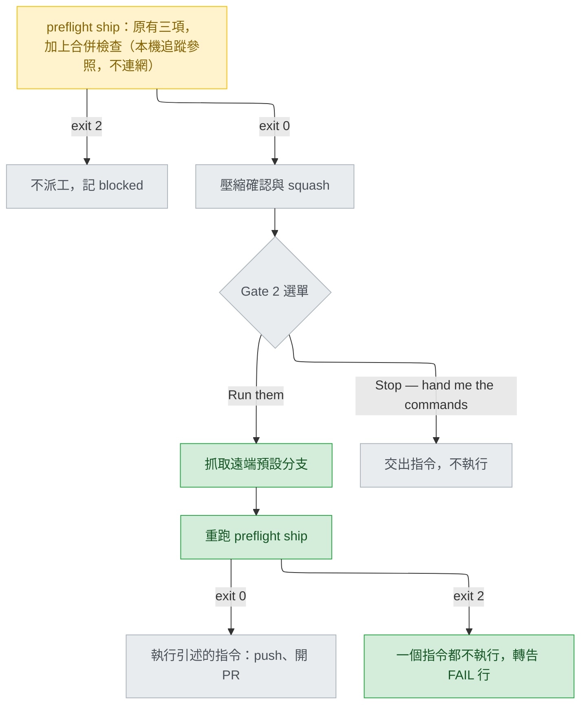

# ship-preflight-merge-check — stance

依據：`.claude/track/ship-preflight-merge-check/intake.md`（已核准，AC1–AC8）。三題都經選單拍板（intake:17-23）：做法二、無法判斷時放行並講明原因、直接進 design。這份文件不重新選方向，只把已選的取捨寫成能刪選項的形式，交上去等核准。

名詞：開工前檢查（preflight）是每個 stage 開始前跑的零 token 腳本 `preflight.py`。試合併指 `git merge-tree --write-tree`：只在 git 的物件庫裡算出合併結果。結束碼（exit code）是指令結束時回傳的數字。遠端追蹤參照（remote-tracking ref，例如 `origin/main`）是本機記得的「上次抓取時遠端在哪」。抓取（fetch）是連網更新這些參照。Gate 2 是 ship 執行不可逆指令前的人工選單（`approval-gates.md:99-108`）。shipper 是 ship 的 subagent（沒有提問工具的子代理）；main session 是使用者直接對話的那個。淺層複製（shallow clone）只下載最近一段歷史；merge base 是兩條分支的共同起點。ledger 是記錄每次 stage 嘗試的 `ledger.jsonl`。Codex 版是 `scripts/gen-codex.py` 從 `plugins/cai/` 產生的 `plugins/cai-codex/`。

## Status

approved 2026-09-25

## Optimises for

分支在 push 前幾秒，已經和「剛抓下來的」遠端預設分支試合併過；有衝突就不 push，並說出是哪些檔案。同時 preflight 維持不連網，結果只由本機狀態決定。怎麼算成功：AC1–AC6 各有一個測試或 `validate.py` case 指得到；`preflight.py` 裡沒有任何會碰遠端的 git 呼叫。

## Sacrifices

- **舊環境沒有這層保護。** git 舊於 2.38、淺層複製、試合併出錯或逾時的使用者，只看到 PASS 加一句沒檢查的原因。衝突要等 GitHub 標示，和今天一樣（intake 第 2 題）。
- **晚擋比早擋貴。** ship 一開始的檢查用的是上次抓取的狀態。它放行之後，Gate 2 的重跑仍可能擋下；那時 squash 已經做完，使用者也已經回答過壓縮確認（`stage-ship.md:104-107`）。
- **「合得起來」只看文字衝突。** 合併後測試會不會壞（語意衝突）不檢查，仍要靠 CI。
- **只偵測，不修。** 擋下後由使用者自己把基準分支合進來、解衝突、重跑 verify。本 repo 專用的修法（兩個版號、`--release`）不寫進出貨檔（intake:25）。
- **Gate 2 多幾秒。** 選「Run them」後多一次抓取、一次 preflight。
- **track 外的 push 不受保護。** 使用者自己打的 `git push` 不經過這道檢查。

## Invariants

**This system's:**

- S1 — `preflight.py` 不連網：不呼叫 `git fetch`、`git ls-remote`、`gh`，或任何會碰遠端的指令，只讀本機已有的參照（`preflight.py:4-7`、`MANUAL.md:157`；AC5）。
- S2 — 衝突只由試合併的結束碼判定：1 是衝突，0 是乾淨，其他值是「沒判斷」。不讀輸出的第一行，因為乾淨時輸出就只有 tree OID 那一行（intake:11；AC1）。依據 https://git-scm.com/docs/git-merge-tree ：「For a successful, non-conflicted merge, the exit status is 0. When the merge has conflicts, the exit status is 1. If the merge is not able to complete (or start) due to some kind of error, the exit status is something other than 0 or 1 (and the output is unspecified).」
- S3 — 只有一種情況 FAIL：git 至少 2.38、找得到基準分支、試合併回 1。2.38 的依據是 https://raw.githubusercontent.com/git/git/v2.38.0/Documentation/RelNotes/2.38.0.txt ：「"git merge-tree" learned a new mode where it takes two commits and computes a tree that would result in the merge commit」。其他情況一律 PASS，括號裡寫 `not checked: <原因>`：沒有基準分支、git 太舊、沒有 merge base、其他結束碼、逾時、git 叫不動（intake 第 2 題；AC3、AC4）。`not_main_branch` 是「不知道就擋」（`preflight.py:301-304`），這裡刻意相反。
- S4 — 檢查不改使用者的工作區、索引、HEAD 或任何分支（使用者選的做法：`options-intake-approach.md:3`「不動工作區」）。文件只保證前兩者與不建 commit：「does not make any new commits and does not read from or write to either the working tree or index」（同上 git-merge-tree 頁）；不動 ref 這點文件沒寫，UNVERIFIED，交 Decisions 的 feasibility 表實測。
- S5 — Gate 2 選「Run them」後，先抓取，再重跑 `preflight.py ship`。重跑 exit 2 時，引述的指令一個都不執行，並把 FAIL 行轉告使用者（AC6）。
- S6 — FAIL 行寫出基準 ref 與衝突檔。下一步只寫通用做法：把基準分支合進來、解衝突、重跑 verify。不寫任何特定 repo 的修法（intake:25；AC1）。
- S7 — `validate.py:1535-1539` 的 `SHIP_CLEAN`（沒有 origin、沒有 main 的暫存 repo，`validate.py:761-773`）維持 exit 0（AC3）。

**Cross-project:**

- 本 repo `CLAUDE.md` 的「Who a file is for」與「Before pushing」。`preflight.py` 與 `approval-gates.md` 是 Theirs，不能假設使用者的 repo 有 origin、預設分支叫 main、HEAD 在分支上；Windows 與 Linux 都要能跑。
- `model-selection.md` 的 program 層：preflight 是不花 token 的確定性檢查。
- 使用者的 rules，以 `CLAUDE.md:8-14` 匯入的版本為準，包括 `workflow.md`「沒問過不安裝套件」，所以舊 git 不裝來測。
- 平台限制：subagent 沒有 `AskUserQuestion`（`pending-questions.md:8-11`）；各 agent 的工具以它自己的 frontmatter 為準（`shipper.md:7`）。

## Rejected stances

- **做法一：preflight 裡先抓取再試合併。** 違反 S1。而且抓取之後還隔著壓縮確認與 Gate 2，push 那一刻未必還對（`options-intake-approach.md:18`）。使用者 2026-09-25 沒選。
- **做法三：只寫進 ship 的程序文字。** 由 shipper 自己抓取、試合併、讀結束碼，判斷就落在最便宜的模型上（`shipper.md:9`）。intake:11 記錄 main session 自己就踩過一次「只看第一行，把衝突看成乾淨」。使用者沒選。
- **無法判斷時擋下。** git 舊於 2.38 或淺層複製的使用者會完全不能 ship，除非另外設計略過機制（`options-intake-unknown.md:26-28`）。使用者選了放行。
- **偵測到衝突就自動合進基準分支。** 會在沒人看的時候改寫分支內容，合併後還是得重跑 verify；intake:25 已把範圍定在只偵測。

## Use cases / Issues

- R1 — ship 的 preflight 只查 verify 狀態、工作區、分支（`preflight.py:608-630`），不查合併。怎麼知道修好了：AC1、AC2 的測試。
- R2 — preflight 到 push 之間隔著兩個選單，main 可能又前進（intake:11 記錄了兩次）。怎麼知道修好了：AC6。
- UC1 — 沒有 origin，也沒有 main／master：PASS 並註明沒檢查；`SHIP_CLEAN` 維持 exit 0（AC3）。
- UC2 — 舊 git、淺層複製、其他錯誤、逾時：PASS 加原因（AC4）。沒有共同歷史時試合併會報錯（git-merge-tree 頁：「merge-tree will by default error out if the two branches specified share no common history」）；淺層複製是否落在這一條，UNVERIFIED，交 feasibility 表用 `git clone --depth 1` 實測。
- UC3 — 離線：遠端指向不存在的路徑，preflight 仍依既有的追蹤參照回答（AC5）。
- UC4 — 使用者看得懂為什麼被擋：`MANUAL.md` 的擋下條件表（`:278-295`）多一列（AC7）。
- UC5 — 發版與 Codex 版（AC8）。Codex 版在 Gate 2 之後本來就由 main session 執行指令（`codex-overrides.json:195-199`）。approval-gates 裡的新指令若寫成 `python ${CLAUDE_PLUGIN_ROOT}/scripts/preflight.py`，產生器會自動改寫（`gen-codex.py:111-112`、`:271`）。
- R3 —（交 Decisions）Gate 2 的抓取與重跑由誰執行。可以是 main session 在重新派工前自己跑，也可以給 shipper 加 python 權限；shipper 目前只有 git 與 gh（`shipper.md:7`），而 `approval-gates.md:3-7` 說此檔只給 main session 讀。
- R4 —（交 Decisions）基準分支怎麼選。可以沿用 `find_base_ref()`（origin/HEAD → origin/main → origin/master → 本機 main／master，`preflight.py:546-558`），也可以照 `stage-ship.md:79-84` 只走 origin 那條。本機 main 可能比遠端舊。
- R5 —（交 Decisions）抓取寫成哪一條指令；抓取失敗時（沒網路、沒有 origin）是否照樣重跑。
- R6 —（交 Decisions）舊 git 靠 `git --version` 判斷還是靠結束碼。`git()` 的 5 秒逾時（`preflight.py:278-287`）夠不夠試合併用：耗時沒量過，UNVERIFIED。
- R7 —（交 Decisions）Gate 2 重跑 exit 2 時 ledger 記什麼；`track/SKILL.md:71-72` 只規定 stage 開始前那次。選「Stop — hand me the commands」時，交出的指令要不要也含抓取與重跑。
- R8 —（交 Decisions）重跑的是整個 `preflight.py ship`，原有各項也會再跑一次（`preflight.py:608-630`、`:668-670`）。Gate 2 之前若有檔案寫進沒被 git 忽略的 track 目錄，`clean_tree` 會在這裡擋下（`MANUAL.md:294`），擋的理由與合併無關。
- R9 —（交 Decisions）本 track 自己出貨時，可能撞到同樣的版號衝突（intake:48）。

## Overview

看圖的重點：連網只出現在一個綠色方框（抓取），而且它在 Gate 2 之後、preflight 之外（S1）。同一個 preflight 跑兩次：第一次用舊的追蹤參照，早一點擋；第二次在 push 前幾秒，才是準的那次（S5）。從 Gate 2 到「執行」只有一條路，就是經過重跑且 exit 0。

## Out of scope

- 修衝突（自動合併或 rebase）、語意衝突、CI 狀態：只偵測文字衝突。
- `stage-ship.md` 的 Step 1–7 本身，以及 verify 要不要也做同樣的檢查：這次不動。
- 新增的檢查叫什麼名字、訊息的確切措辭、測試怎麼造 repo：交給 Decisions 的 Tier 3 或 Detail。
- 本 repo 專用的修法寫進 `CLAUDE.md`：intake:25 已定不寫，只留在記憶。
- `docs/` 被 git 忽略；這份文件在 ship 時要用 `git add -f`。
