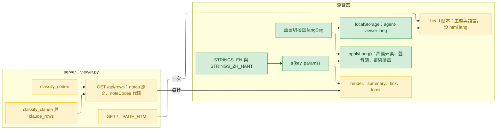
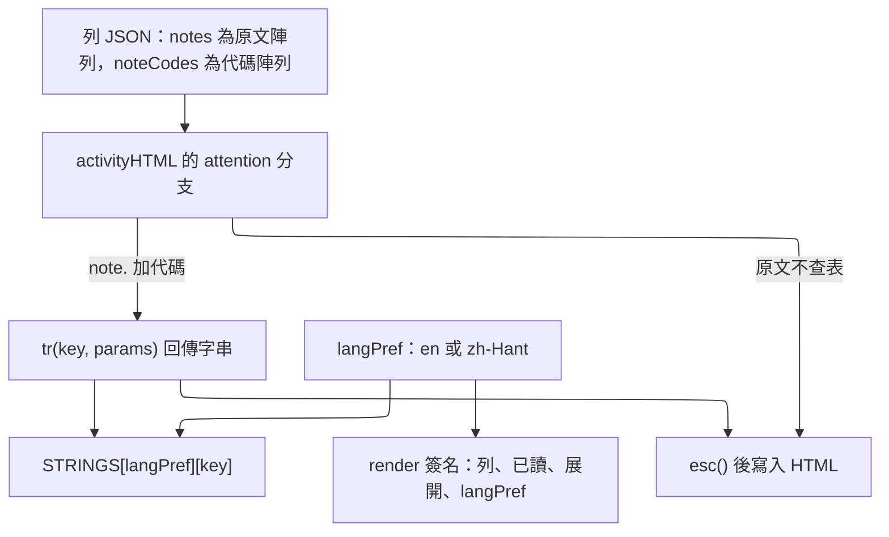
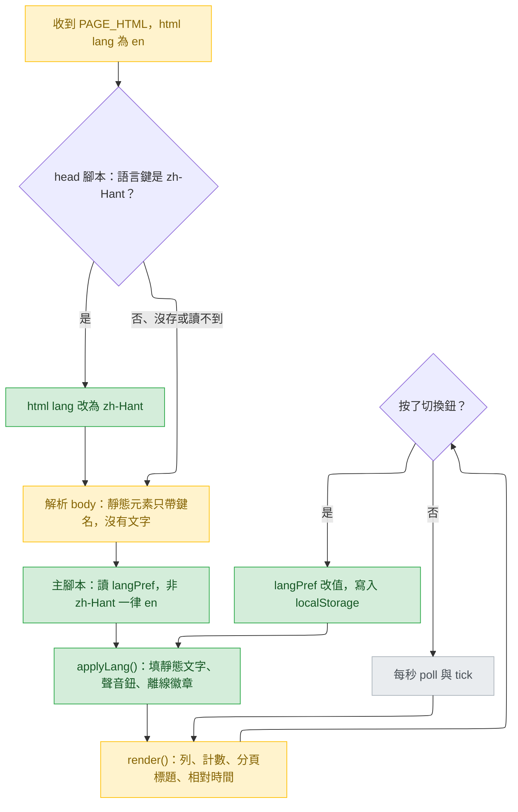
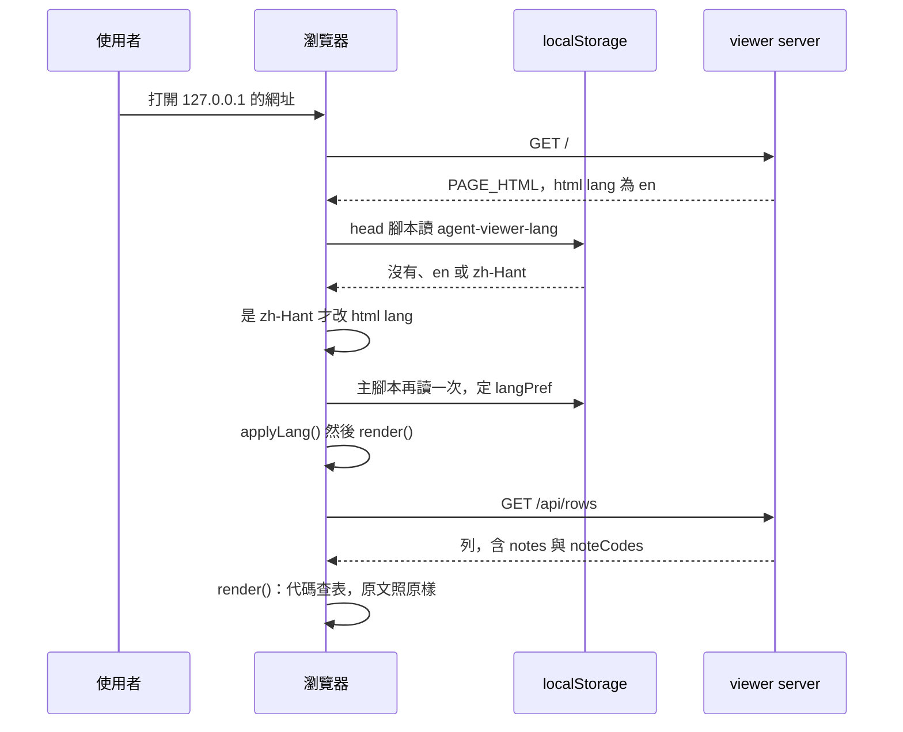
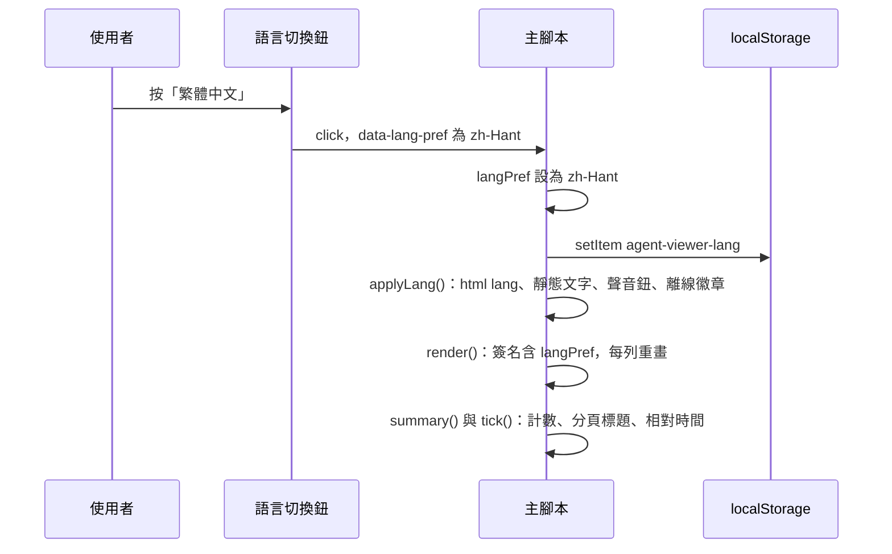
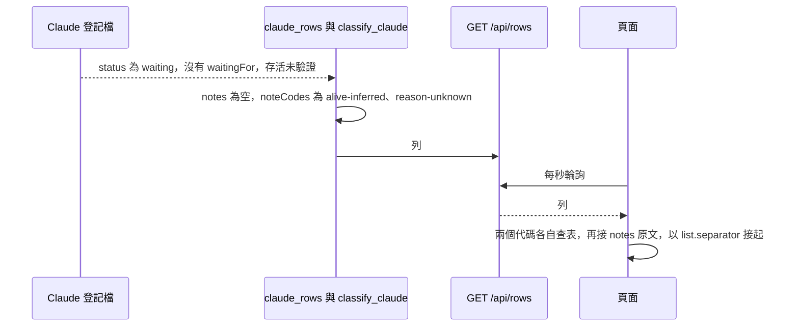

# agent-viewer-language-switch — detail design

## Reference

Stance doc: docs/design/2026-09-26-agent-viewer-language-switch-stance.md
Decisions doc: docs/design/2026-09-26-agent-viewer-language-switch-decisions.md
Status: approved 2026-09-26（stance）；decisions 的 Tier 1 零項，沒有待答的 `Decided:`；decisions 本身隨 Gate 1 一起簽。

照 decisions 的 D1–D3 與 Tier 3 全部條目執行，不再重述。下文行號一律是 `plugins/cai/scripts/viewer.py` 在分支起點（`aabb2e1`）的行號，簡寫為 `viewer.py:<n>`。

### Traceability

| From the referenced document | Satisfied by | Status |
|---|---|---|
| UC1 首次打開整頁英文 | `### 語言偏好` 的 `langPref` 預設 `en`、`<html lang="en">`；`### 字串表` 的 en 欄；`### 各處改寫` 換掉每段寫死的中文 | covered |
| UC2 頁首切換、不重新載入、狀態保留 | `### 語言偏好` 的 `#langSeg` 與 `applyLang()`；`render()` 簽名加 `langPref` | covered |
| UC3 重開沿用、首次繪製前讀出 | `### 語言偏好` 的 head 腳本片段與 `LANG_KEY` | covered |
| UC4 繁體中文逐字不變 | `### 字串表` 的 zh-Hant 欄逐字搬自原行；頁尾三句拆鍵保留原空白；`## Verification` 的一次性比對 | covered |
| UC5 server 的兩句備註依語言顯示 | `### server：noteCodes`；attention 分支先查代碼再接原文 | covered |
| UC6 原 UC1–UC6 照舊、驗證全綠、Codex 重產、版本 1.37.0 | `### 出貨`；`## Work breakdown` 單元 3 | covered |
| R1 `PAGE_HTML` 寫死繁中 | 同 UC1、UC4 | covered |
| R2 原 detail:114「照 mockup 用中文」被取代 | `## Design decisions` 第一條記下取代；launcher 仍印 ASCII 英文不變 | covered |

## Requirement

Agent Viewer 的網頁今天只有繁體中文（`viewer.py:285`，介面文字散在 `:503-940`）。改成：沒存偏好時整頁英文，頁首有「English／繁體中文」切換，選擇存在瀏覽器、下次沿用；繁體中文模式與今天逐字相同；server 自己寫、會上頁面的備註改送代碼由頁面翻譯，平台原文照原樣。怎麼知道做對了：intake 的 AC1–AC7（intake.md:16-22），逐條對到 `## Verification`。

## Glossary

| Term | Definition | Where it lives |
|---|---|---|
| 字串表 | 頁面內每種語言一個、鍵完全相同的 JSON 相容物件字面值，值是該語言的介面文字 | new — plugins/cai/scripts/viewer.py（主 `<script>` 開頭） |
| 鍵 | 字串表裡一段介面文字的名字，例如 `state.working` | new — plugins/cai/scripts/viewer.py（字串表） |
| 佔位 | 字串值裡以大括號包住的參數名，例如 `{n}`，由 `tr()` 換成實際值 | new — plugins/cai/scripts/viewer.py（`tr()`） |
| `tr()` | 以目前語言查鍵、代入佔位、回傳字串的函式 | new — plugins/cai/scripts/viewer.py（字串表之後） |
| `langPref` | 目前語言，只會是 `en` 或 `zh-Hant` | new — plugins/cai/scripts/viewer.py（字串表之後） |
| `applyLang()` | 依 `langPref` 重寫所有靜態文字與幾個由狀態決定的標籤 | new — plugins/cai/scripts/viewer.py（主題區段之後） |
| 靜態元素 | HTML 裡帶 `data-i18n*` 屬性、文字由 `applyLang()` 填入的元素 | new — plugins/cai/scripts/viewer.py（`<body>`） |
| 語言切換鈕 | 頁首 `#langSeg`，兩個按鈕「English」「繁體中文」 | new — plugins/cai/scripts/viewer.py（主題切換之後） |
| head 腳本 | `<head>` 內在首次繪製前執行的內嵌腳本，今天只定主題 | plugins/cai/scripts/viewer.py:290 |
| 簽名 | `render()` 判斷一列要不要重畫所比對的字串 | plugins/cai/scripts/viewer.py:759 |
| `notes` | 列上的平台原文陣列（改完後只放原文） | plugins/cai/scripts/viewer.py:1565 |
| `noteCodes` | 列上的新欄位，server 自己的備註，每項一個代碼 | new — plugins/cai/scripts/viewer.py（`classify_claude`、`classify_codex`） |
| 代碼 | 與語言無關、頁面拿去查表的短字串，例如 `reason-unknown` | concept |
| 原文 | 平台或使用者寫的字，頁面照原樣顯示、不查表（L3） | concept |
| attention 方框 | attention 列活動欄裡顯示備註的方框，今天唯一顯示 `notes` 的地方 | plugins/cai/scripts/viewer.py:690 |
| `aliveCertainty` | 列上「存活」的確定度，頁面據此顯示身分欄的「存活：推斷」 | plugins/cai/scripts/viewer.py:1721 |
| `format` | launcher 與 server 之間的協定版本（本次不改，D3） | plugins/cai/scripts/viewer.py:1039 |
| CJK | 中日韓文字與其標點、全形字元，範圍見 `### 測試` | concept |
| gen-codex 改寫 | 產生 Codex 樹時對每個檔做的字面替換 | scripts/gen-codex.py:277 |
| `DENY_LIST` | Codex 樹裡不得出現的字串清單 | scripts/gen-codex.py:129 |

## Budgets

| What | Number | Where it comes from |
|---|---|---|
| 字串表的鍵數（每種語言） | 64 | `### 字串表` 逐列計數 |
| 新增的 localStorage 鍵 | 1 | `agent-viewer-lang`；L4 |
| 新增的網路請求、檔案、字型 | 0 | L6；CSP 不改（`viewer.py:275`） |
| 切換語言時的重新載入 | 0 | AC2 |
| 新增的第三方套件 | 0 | AC7 |
| CJK 檢查涵蓋的 Unicode 區段 | 9 | `### 測試` |
| zh-Hant 表以外允許的 CJK 字串 | 1 | 切換鈕上的「繁體中文」（L1，stance 核准時的例外） |
| 輪詢間隔（不變） | 1000 ms | `viewer.py:947` |
| toast 顯示時間（不變，切換時不重寫） | 2200 ms | `viewer.py:816` |
| cai 版本 | 1.37.0 | intake AC7 |
| cai-codex `--release` 版本的下限（須大於） | 0.2.28 | `plugins/cai-codex/.codex-plugin/plugin.json:3` |

## Design decisions

這一層新出現、decisions 沒有的決定：

- **R2：原 detail:114「頁面是 UTF-8 的 HTML，照 mockup 用中文」由本設計取代。** 同一條的「launcher 印英文、只用 ASCII」不變，launcher 一行都不改。服務 UC1。
- **頁尾那段三行的說明拆成三個鍵，HTML 裡保留原本的換行與縮排。** 今天那三行（`viewer.py:531-533`）之間的換行在畫面上摺成空白；三個 `` 之間留著同樣的換行，zh-Hant 顯示的空白就與今天完全一樣，不必在值裡放換行或反斜線（C7）。服務 UC4。
- **中文相同、角色相同的地方共用一個鍵。** 狀態標籤「等你核准權限」與權限方框第一行（`viewer.py:625`、`:683`）共用 `state.permission`；「執行中」的狀態與頂端計數（`:630`、`:788`）共用 `state.working`；「需要你」的篩選與計數（`:521`、`:787`）共用 `common.needsYou`；身分欄與備註的「存活：推斷」（`:711`、`:1708`）共用 `note.alive-inferred`。中文相同才共用，所以 zh-Hant 不變；英文因此也只有一種說法。
- **空列表的提示在切換時要改字。** `render()` 今天只在沒有提示時插入（`viewer.py:773-775`），已插入的提示切換後會留在舊語言；改成已存在時重寫它的文字。服務 UC2。
- **`applyLang()` 只在腳本最後與切換時呼叫，不在定義處呼叫。** 它會讀 `soundOn`（`:595`）與 `failCount`（`:845`），兩者是 `let`，在宣告之前讀會丟 ReferenceError。服務 UC1、UC2。
- **`clock` 改成函式宣告，參數改名 `ms`。** 今天的參數叫 `t`（`:616`）；改名避免讀的人以為它是查表。英文分支用 `pad()`（`:604`）組 `HH:MM:SS`。

## Diagrams

### Architecture

看哪裡：server 到瀏覽器只有兩條線（頁面一次、列每秒一次），沒有任何線從語言鍵或切換鈕回到 server（L2）。綠框全在瀏覽器；server 那側黃框改的只是列上多一個 `noteCodes`。

### Component

看哪裡：attention 分支出去有兩條路，只有代碼那條經過 `tr()`，原文那條直接到 `esc()`（L3）。`langPref` 同時接到字串表與簽名——少了簽名那條，切換後已畫好的列不會重畫（C6）。

### Flow

看哪裡：切換鈕的迴圈回到 `applyLang()`，不回到「收到 PAGE_HTML」——沒有重新載入（AC2）。head 腳本只決定 `lang`，文字一律由主腳本的 `applyLang()` 填（L1：一個出處）。

### Sequence — UC1 與 UC3（打開或重開頁面）

看哪裡：語言讀了兩次（head 腳本一次、主腳本一次），比照主題（`viewer.py:293`、`:557`）；兩次之間沒有任何請求帶著語言出去。

### Sequence — UC2（切換語言）

看哪裡：`filter`、`acks`、`expanded` 三個集合沒有出現在這張圖上——切換不碰它們，所以篩選、已讀、展開都保留（AC2）。

### Sequence — UC5（server 的備註）

看哪裡：server 送出的列裡沒有任何一種語言的字；zh-Hant 下接起來是「存活：推斷、原因未知」，與今天 `viewer.py:1708`、`:1715`、`:1585`、`:691` 組出的字相同。

UC4（逐字不變）與 UC6（原有用例照舊）沒有新的呼叫順序可畫：UC4 是字串表的內容，UC6 是既有行為不變，兩者都由 `## Verification` 的檢查涵蓋。

## Implementation spec

### 字串表

- **Responsibility:** 頁面上每段會隨語言變的文字，只在這裡寫一次。
- **Interface:** 主 `<script>`（`viewer.py:540`）開頭三個常數：`const STRINGS_EN = {...};`、`const STRINGS_ZH_HANT = {...};`、`const STRINGS = {'en': STRINGS_EN, 'zh-Hant': STRINGS_ZH_HANT};`。前兩個各自從 `{` 開頭、以單獨一行的 `};` 結尾，中間是嚴格的 JSON（雙引號鍵、無尾逗號、無註解），供測試以 `json.loads` 解析。
- **Data:** 鍵 → 字串，64 個鍵，兩表相同。值不得含反斜線或 ASCII 雙引號（C7；要引號用 `“ ”`）。只有 `footer.terminal` 的值可含 HTML（`<b>`）。
- **Errors:** 無執行期錯誤路徑；鍵不齊或 JSON 壞由 pytest 擋。
- **Concurrency:** 常數，不變動。
- **Observability:** 無。
- **Where it lives:** `plugins/cai/scripts/viewer.py`，主 `<script>` 開頭（存在的檔案）。
- **What it reuses:** 無。

### 字串表內容

en 為本設計的提案，Gate 1 一起看；zh-Hant 是今天的字，逐字搬過來。「取代」指它換掉的 `viewer.py` 行。

| 鍵 | en | zh-Hant | 取代 |
|---|---|---|---|
| `lang.aria` | `Language` | `語言` | 新增（切換鈕群組的 `aria-label`） |
| `theme.aria` | `Theme` | `主題` | :503 |
| `theme.system.title` | `Follow the operating system setting` | `跟隨作業系統設定` | :504 的 `title` |
| `theme.system` | `◐ System` | `◐ 系統` | :504 |
| `theme.dark` | `☾ Dark` | `☾ 深色` | :505 |
| `theme.light` | `☀ Light` | `☀ 淺色` | :506 |
| `sound.on` | `🔔 Sound: on` | `🔔 聲音：開` | :508、:934 |
| `sound.off` | `🔕 Sound: off` | `🔕 聲音：關` | :934 |
| `chime.done` | `Also chime when done` | `完成時也響` | :509 |
| `chime.inferred` | `Also chime for inferred permission waits` | `推斷的等權限也響` | :510 |
| `unlock.text` | `Browsers only let a page play sound after it has been clicked once →` | `瀏覽器規定頁面要先被點過一次才能發出聲音 →` | :515 |
| `unlock.button` | `Enable chimes (plays one now so you can hear it)` | `啟用提示音（會先響一次給你聽）` | :516 |
| `filter.all` | `All` | `全部` | :520 |
| `common.needsYou` | `Needs you` | `需要你` | :521、:787 |
| `filter.plain` | `Other agents` | `一般 agent` | :523 |
| `footer.codexLock` | `Codex: thread-writer-locks not found, so it cannot tell which sessions are open` | `Codex：找不到 thread-writer-locks，無法判斷哪個 session 開著` | :529 |
| `footer.terminal` | `Answering questions, approving permissions and signing off still happen in the terminal; this page only lets you <b>see</b> who is waiting for you.` | `回答問題、核准權限、簽核仍然在終端機做；這一頁只負責讓你<b>看見</b>誰在等你。` | :530 |
| `footer.inference1` | `One list shows the main sessions of both Claude Code and Codex. “Maybe waiting for permission” appears only on Codex rows and is inferred:` | `同一張表列出 Claude Code 與 Codex 的主 session。「可能在等權限」只出現在 Codex 的列上，是推斷出來的：` | :531 |
| `footer.inference2` | `a tool call with no result after 30 seconds counts, so a call that is merely slow looks the same;` | `一次工具呼叫超過 30 秒還沒有結果就算，只是跑得比較久的呼叫看起來會一樣；` | :532 |
| `footer.inference3` | `Claude's “Waiting for permission” is read from its own session registry file, so it is confirmed, not inferred.` | `Claude 的「等你核准權限」是從它自己的登記檔讀到的，是確定，不是推斷。` | :533 |
| `footer.order` | `Order: rows that need you first (longest wait first) → running. Press “Seen” to stop the flashing; it lights up again when the state changes.` | `排序：需要你的在最上面（等最久的優先）→ 執行中。按「已讀」停止閃爍，狀態再變時會重新亮起。` | :534 |
| `footer.theme` | `Your theme choice is kept in this browser and used next time.` | `主題選擇記在這個瀏覽器裡，下次打開沿用。` | :535 |
| `dur.seconds` | `{n} s` | `{n} 秒` | :612 |
| `dur.minutes` | `{n} min` | `{n} 分鐘` | :613 |
| `dur.hoursMinutes` | `{h} h {m} min` | `{h} 小時 {m} 分` | :614 |
| `state.gate` | `Waiting for your sign-off` | `等你簽核` | :620 |
| `state.question` | `Waiting for your answer` | `等你回答` | :621 |
| `state.permission` | `Waiting for permission` | `等你核准權限` | :625、:683 |
| `state.permissionInferred` | `Maybe waiting for permission` | `可能在等權限` | :626 |
| `state.attention` | `Needs your attention` | `等你處理` | :628 |
| `state.done` | `Done, awaiting instructions` | `完成，等指示` | :629 |
| `state.working` | `Running` | `執行中` | :630、:788 |
| `state.workingBackground` | `Running (background)` | `執行中（背景）` | :630 |
| `state.unknown` | `Unknown` | `未知` | :631 |
| `gate.title` | `Human gate` | `人工閘門` | :643 |
| `now.recent` | `Just now:` | `剛剛：` | :662 |
| `now.subagents` | `subagents:` | `subagents：` | :663 |
| `question.hint` | `Answer in the terminal · this page only shows, it never answers for you` | `回終端機作答 · 這一頁只顯示，不代答` | :679 |
| `permission.lineInferred` | `Maybe waiting for your permission (inferred)` | `可能在等你核准權限（推斷）` | :683 |
| `permission.hint` | `To approve, go back to the terminal` | `要核准請回終端機` | :685 |
| `permission.hintInferred` | `Inferred: this tool call has had no result for a long time · if it is only slow it will recover by itself · to approve, go back to the terminal` | `推斷：這個工具呼叫太久沒有結果 · 若只是跑得久會自己恢復 · 要核准請回終端機` | :686 |
| `list.separator` | `, `（逗號加一個空白） | `、` | :691 |
| `certainty.confirmed` | `confirmed` | `確定` | :710 |
| `certainty.inferred` | `inferred` | `推斷` | :710 |
| `ack.button` | `Seen` | `已讀` | :713 |
| `expand.open` | `▾ History` | `▾ 經過` | :724 |
| `expand.close` | `▴ Collapse` | `▴ 收起` | :724 |
| `copy.title` | `Copy the resume command` | `複製 resume 指令` | :741 |
| `empty.list` | `No agents in this view right now` | `這個分類目前沒有 agent` | :774 |
| `summary.unread` | `{n} unread` | `未讀 {n}` | :785 |
| `title.unread` | `({n}) Needs you · Agent Viewer` | `({n}) 需要你 · Agent Viewer` | :789 |
| `stale.note` | `Data stopped at {time}` | `資料停在 {time}` | :796 |
| `since.wait` | `Waiting {time}` | `已等 {time}` | :806 |
| `since.run` | `This turn {time}` | `本輪 {time}` | :806 |
| `since.ago` | `Ended {time} ago` | `{time}前結束` | :806 |
| `offline.badge` | `OFFLINE` | `離線` | :854 |
| `offline.note` | `The viewer is not responding (it may have been stopped)` | `viewer 沒有回應（可能已經 stop）` | :856 |
| `toast.copied` | `Copied: {cmd}` | `已複製：{cmd}` | :917 |
| `toast.noAudio` | `This browser does not support Web Audio` | `這個瀏覽器不支援 Web Audio` | :940 |
| `note.reason-unknown` | `Reason unknown` | `原因未知` | server :1585 |
| `note.alive-inferred` | `Alive: inferred` | `存活：推斷` | :711；server :1708 |
| `note.background-shell` | `Background shell running` | `背景 shell 執行中` | server :1608 |
| `note.registry-may-be-stale` | `Session registry may be stale` | `登記檔可能過時` | server :1626 |
| `note.previous-turn-failed` | `Previous turn failed/interrupted` | `上一輪 failed／interrupted` | server :1893 |

`now.recent`、`now.subagents` 與後面的項目之間不需要空白：兩個容器是 `display:flex` 加 `gap`（`viewer.py:462`、`:464`）；頂端計數的 `common.needsYou` 與數字之間同理（`:357`）。

### tr()

- **Responsibility:** 以目前語言取一個鍵的字串，代入佔位。
- **Interface:** `function tr(key, params)`；`key: string`，`params: object | undefined`（值會以 `String()` 轉字串）；回傳 `string`。
- **Data:** `s = STRINGS[langPref][key]`；`undefined` 時 `s = key`；對 `params` 的每個名字，`s = s.split('{' + name + '}').join(String(params[name]))`。不用正規式（C7）。
- **Errors:** 找不到鍵時回傳鍵名本身（decisions Tier 3），不丟例外。
- **Concurrency:** 純函式，讀 `langPref`。
- **Observability:** 畫面上出現鍵名（例如 `note.xyz`）即表示缺鍵或未知代碼。
- **Where it lives:** `viewer.py`，緊接在字串表與 `langPref` 之後。
- **What it reuses:** 無。回傳值寫進 HTML 時由呼叫端以 `esc()`（`viewer.py:603`）包住，唯一例外是 `applyLang()` 對 `data-i18n-html` 的寫入（值只來自頁內表）。

### 語言偏好與切換鈕

- **Responsibility:** 決定、記住並套用目前語言。
- **Interface:**
  - head 腳本（`viewer.py:290-297`）在既有 `try` 區塊之後加一個：`try { if (localStorage.getItem('agent-viewer-lang') === 'zh-Hant') document.documentElement.setAttribute('lang', 'zh-Hant'); } catch (e) {}`，前面加一行英文註解說明「在首次繪製前定語言」。
  - `<html lang="zh-Hant">`（`:285`）改為 `<html lang="en">`。
  - 字串表之後：`const LANG_KEY = 'agent-viewer-lang';`、`let langPref = 'en';`、`try { if (localStorage.getItem(LANG_KEY) === 'zh-Hant') langPref = 'zh-Hant'; } catch (e) {}`。
  - 頁首，緊接在 `#themeSeg`（`:503-507`）之後：`
`，內含 `<button data-lang-pref="en" lang="en">English</button>` 與 `<button data-lang-pref="zh-Hant" lang="zh-Hant">繁體中文</button>`。兩個標籤兩種語言都一樣，不走表（L1 的例外）。
  - `function renderSoundBtn()`：`document.getElementById('soundBtn').textContent = tr(soundOn ? 'sound.on' : 'sound.off');`。
  - `function applyLang()`，依序：`setAttribute('lang', langPref)` 於 `<html>`；每個 `[data-i18n]` 設 `textContent = tr(el.dataset.i18n)`；每個 `[data-i18n-html]` 設 `innerHTML = tr(el.dataset.i18nHtml)`；每個 `[data-i18n-title]` 設 `title`；每個 `[data-i18n-aria-label]` 設 `aria-label`；每個 `[data-lang-pref]` 依是否等於 `langPref` 切換 `active` class 與 `aria-checked`（比照 `applyTheme()`，`:561-564`）；`renderSoundBtn()`；`setOffline(failCount >= 3)`。
  - `#langSeg` 的 click：取 `closest('[data-lang-pref]')`，沒有就 return；`langPref = b.dataset.langPref`；`localStorage.setItem(LANG_KEY, langPref)` 包在 `try` 裡；`applyLang()`；`render()`。
  - 腳本最後（今天 `:945` 的 `render();` 之前）呼叫一次 `applyLang();`。
- **Data:** localStorage `agent-viewer-lang` ∈ {`en`, `zh-Hant`}；其他值與讀不到都當 `en`。
- **Errors:** localStorage 丟例外時（例如隱私模式）：讀當 `en`，寫就不記，當下切換照常生效——與主題相同（`viewer.py:557`、`:571`）。
- **Concurrency:** 單執行緒；`applyLang()` 讀 `soundOn`、`failCount` 兩個 `let`，只能在腳本跑完宣告後呼叫（見 `## Design decisions`）。兩個分頁各自有 `langPref`，只在開頁時讀 localStorage，一個分頁切換不會即時改另一個分頁（與主題相同）。
- **Observability:** `<html lang>` 屬性可在開發者工具看到。
- **Where it lives:** `viewer.py` 的 `<head>`、頁首 HTML、主題區段（`:553-574`）之後的新區段「language: en / zh-Hant, remembered per browser」。
- **What it reuses:** 主題切換的形狀與 CSS（`.seg`，`viewer.py:366-370`；`applyTheme()`，`:558-565`；click 處理，`:567-573`）；`setOffline()`（`:849`）。

### 各處改寫

每一處都保留原本的結構，只把中文字面值換成查表。模板字串 `${...}` 裡的查表一律寫成 `${esc(tr('...'))}`，所以 `tests/test_viewer_page.py:22-59` 的允許清單不必改。模板字串裡的查表不帶參數物件：該測試的正規式不跨大括號（`tests/test_viewer_page.py:73`），`${esc(tr('x', {n: 1}))}` 會被切壞；要帶參數的查表一律先以 `+` 組好字串（今天的 `unreadHTML` 就是這樣，`viewer.py:785`）。

| 位置 | 改成 |
|---|---|
| :503 | 拿掉 `aria-label="主題"`，改帶 `data-i18n-aria-label="theme.aria"` |
| :504-506 | 三個按鈕內容清空，各帶 `data-i18n="theme.system"`／`theme.dark`／`theme.light`；:504 另把 `title` 換成 `data-i18n-title="theme.system.title"` |
| :508 | `<button id="soundBtn" class="toggle on"></button>`（文字由 `renderSoundBtn()` 填） |
| :509-510 | 文字包進 ``／`chime.inferred`，`<input>` 留在 `<label>` 裡、`` 之前保留一個空白 |
| :515-516 | 文字包進 ``；按鈕內容清空、帶 `data-i18n="unlock.button"` |
| :520、:521、:523 | 內容清空，帶 `data-i18n="filter.all"`／`common.needsYou`／`filter.plain`；:522 的 `cai track` 不動 |
| :529 | ` ` |
| :530 | ` ` |
| :531-533 | 三行各換成 ``、`inference2`、`inference3`，行與行之間保留原本的換行與兩格縮排，第三個之後接 ` ` |
| :534、:535 | ` `、`` |
| :610-615 `humanFmt` | `tr('dur.seconds', {n: s})`、`tr('dur.minutes', {n: Math.floor(s / 60)})`、`tr('dur.hoursMinutes', {h: Math.floor(s / 3600), m: Math.floor(s % 3600 / 60)})` |
| :616 `clock` | `function clock(ms)`：`langPref === 'zh-Hant'` 時回傳原呼叫 `new Date(ms).toLocaleTimeString('zh-TW', {hour12:false})`，否則 `pad(d.getHours()) + ':' + pad(d.getMinutes()) + ':' + pad(d.getSeconds())` |
| :618-632 `stateLabel` | 每個 `label` 改成對應的 `tr('state.…')`；working 那行維持 `return {label: row.background === true ? tr('state.workingBackground') : tr('state.working'), icon:''};` 的形狀（`tests/test_viewer_page.py:178` 以此行比對） |
| :643 | `'" title="' + esc(tr('gate.title')) + '">⚑</li>…'` |
| :655-656、:714 | 註解改寫成英文，不留任何 CJK（引號「」改成 ASCII 引號） |
| :662、:663 | `esc(tr('now.recent'))`、`esc(tr('now.subagents'))` 取代字面值 |
| :679 | `
${esc(tr('question.hint'))}
` |
| :683-686 | `qline = confirmed ? tr('state.permission') : tr('permission.lineInferred')`；`hint = confirmed ? tr('permission.hint') : tr('permission.hintInferred')` |
| :691 | `const notes = (row.noteCodes \|\| []).map(c => tr('note.' + c)).concat(row.notes \|\| []).join(tr('list.separator'));`（D1：先代碼、後原文） |
| :710 | `tr('certainty.confirmed')`／`tr('certainty.inferred')` |
| :711 | `'
' + esc(tr('note.alive-inferred')) + '
'` |
| :713 | `'<button class="ack" data-act="ack">' + esc(tr('ack.button')) + '</button>'` |
| :723-724 | `esc(expanded.has(row.key) ? tr('expand.close') : tr('expand.open'))` |
| :741 | `title="${esc(tr('copy.title'))}"` |
| :759 | `JSON.stringify([row, acks.has(row.key), expanded.has(row.key), langPref])` |
| :773-775 | 沒有列時：提示不存在就插入 `'
' + esc(tr('empty.list')) + '
'`，已存在就設 `empty.textContent = tr('empty.list')` |
| :785 | `'<em>' + esc(tr('summary.unread', {n: unread})) + '</em>'` |
| :787-788 | `${esc(tr('common.needsYou'))}<b>…`、`${esc(tr('state.working'))}<b>…` |
| :789 | `document.title = unread ? tr('title.unread', {n: unread}) : 'Agent Viewer';` |
| :796 | `tr('stale.note', {time: clock(lastGeneratedAt)})` |
| :806 | `wait: tr('since.wait', {time: clockFmt(d)})`、`run: tr('since.run', {time: clockFmt(d)})`、`ago: tr('since.ago', {time: humanFmt(d)})`，`dur` 不變 |
| :854 | `badge.textContent = tr('offline.badge');` |
| :856 | `note.textContent = tr('offline.note');` |
| :917 | `toast(tr('toast.copied', {cmd}));` |
| :931-935 | `soundOn = !soundOn; e.currentTarget.classList.toggle('on', soundOn); renderSoundBtn();` |
| :940 | `toast(tr('toast.noAudio'))` |
| :945 | 前面加 `applyLang();` |

### server：noteCodes

- **Responsibility:** server 自己寫的備註以代碼送出，`notes` 只留平台原文（D1、D2）。
- **Interface:** 列多一個鍵 `"noteCodes": list[str]`，永遠存在（可為空）。代碼只有五個：`reason-unknown`、`alive-inferred`、`background-shell`、`registry-may-be-stale`、`previous-turn-failed`。
- **Data:**
  - `classify_claude` 的起始 dict（`viewer.py:1553`）加 `"noteCodes": []`。
  - `:1585` 改為 `notes=[waiting_for] if waiting_for else [], noteCodes=[] if waiting_for else ["reason-unknown"]`。
  - `:1608` 改為 `notes=[], noteCodes=["background-shell"]`；`:1626` 改為 `notes=[], noteCodes=["registry-may-be-stale"]`。
  - `_unknown_domain_row`（`:1667`）加 `"noteCodes": []`。
  - `claude_rows`：`:1708` 改為 `codes = ["alive-inferred"] if alive == "alive-unverified" else []`；`:1715` 改為 `classified["noteCodes"] = codes + classified["noteCodes"]`，`notes` 不再被加前綴。
  - `classify_codex` 的起始 dict（`:1840`）加 `"noteCodes": []`；`:1893-1895` 改為 `codes = ["previous-turn-failed"] if turn_status in ("failed", "interrupted") else []`，`notes=[], noteCodes=codes`。
  - 其餘每個 `notes=[]` 不動；`_as_background`（`:1542`）沿用傳入 dict 的 `noteCodes`。
- **Errors:** 無新路徑。`waiting_for` 是非字串的真值時照舊原樣進 `notes`，由頁面 `esc(String())`。
- **Concurrency:** 純函式，無共享狀態。
- **Observability:** `/api/rows` 的 JSON 直接看得到 `noteCodes`。
- **Where it lives:** `viewer.py` 的 `claude_source` 與 `codex_source` 區段。
- **What it reuses:** 既有的 `result.update(...)` 形狀；docstring 的「always carries」慣例（`:1547-1550`）。

### 測試

`tests/test_viewer_page.py` 新增：

- `test_string_tables_have_the_same_keys`：以 `re.search(r"const STRINGS_EN = (\{.*?\n\});", js, re.S)` 取出兩表、`json.loads`，鍵集合相等且為 64。
- `test_no_cjk_outside_the_zh_hant_table`：自 `PAGE_HTML` 移除以同一個正規式（換成 `STRINGS_ZH_HANT`）比對到的整段，從 `const STRINGS_ZH_HANT = ` 到結尾的 `};`，剩下的恰有一個「繁體中文」；再移除它後，沒有任何字元落在九個區段：U+2E80–2FDF、U+3000–303F、U+3040–30FF、U+3100–31BF、U+3400–4DBF、U+4E00–9FFF、U+AC00–D7AF、U+F900–FAFF、U+FF00–FFEF。
- `test_every_i18n_attribute_names_a_key`：`data-i18n`、`data-i18n-html`、`data-i18n-title`、`data-i18n-aria-label` 的每個值都是英文表的鍵。
- `test_every_note_code_has_a_key`：五個代碼的 `note.<code>` 都在英文表。
- `test_html_defaults_to_english_and_prepaint_reads_the_language_key`：`<html lang="en">`；head 腳本含 `agent-viewer-lang`。
- `test_language_switch_has_two_labelled_buttons`：`data-lang-pref="en"` 的按鈕文字是 `English`，`data-lang-pref="zh-Hant"` 的是 `繁體中文`。
- `test_render_signature_includes_language`：`const sig = ...` 那行含 `langPref`。
- `test_attention_notes_put_codes_before_raw_text`：`activityHTML` 的 `const notes = ` 那行含 `row.noteCodes` 且其位置在 `row.notes` 之前。

修改：`test_footer_has_the_codex_lock_note_hidden_by_default`（`:163-166`）改為斷言 span 內帶 `data-i18n="footer.codexLock"`，且英文表該鍵的值含 `thread-writer-locks`。`:135-136`、`:177-180` 不改仍會過：兩段中文在 zh-Hant 表裡、也就在主 `<script>` 裡。

`tests/test_viewer_claude.py`：`:195` 改為 `notes == []` 且 `noteCodes == ["reason-unknown"]`；`:259`、`:334` 改為 `notes == []` 且 `noteCodes == ["background-shell"]`；`:345` 改為 `noteCodes == ["registry-may-be-stale"]`；`:760` 改為 `"alive-inferred" in rows[0]["noteCodes"]`；`:162` 與新增一條斷言原文 `waitingFor` 在 `notes`、`noteCodes` 為空。`tests/test_viewer_codex.py`：`:219`、`:225` 改為 `notes == []` 且 `noteCodes == ["previous-turn-failed"]`。

### 出貨

- `plugins/cai/.claude-plugin/plugin.json` 的 `version` 由 `1.36.2` 改為 `1.37.0`。
- `python scripts/gen-codex.py` 重產 `plugins/cai-codex/`，再 `python scripts/gen-codex.py --release <大於 0.2.28 的版本>`；確切版號由 ship 決定，比照原 detail:728。
- `python scripts/validate.py` 全 PASS、`python -m pytest` 全綠（CLAUDE.md「Before pushing」）。

## Naming

| Name | What it is | Chosen by |
|---|---|---|
| `English`、`繁體中文` | 切換鈕上的兩個標籤 | the user, 2026-09-26（intake AC2；stance 核准時含 L1 例外） |
| `agent-viewer-lang` | localStorage 的語言鍵 | follows `agent-viewer-theme` at viewer.py:554 與 `agent-viewer-done-chime` at viewer.py:578 |
| `en`、`zh-Hant` | 語言值：存的值、`<html lang>`、`STRINGS` 的鍵 | follows `lang="zh-Hant"` at viewer.py:285（BCP 47 語言標籤） |
| `LANG_KEY`、`langPref`、`applyLang`、`langSeg`、`data-lang-pref` | 語言偏好的常數、變數、函式、元素 id、按鈕屬性 | follows `THEME_KEY`、`themePref`、`applyTheme`、`themeSeg`、`data-theme-pref` at viewer.py:554、:556、:558、:503、:504 |
| `STRINGS_EN`、`STRINGS_ZH_HANT`、`STRINGS` | 字串表常數 | 大寫常數 follows `STAGES`、`META` at viewer.py:541、:544；名字本身 designer 提案，Gate 1 待確認 |
| `tr` | 查表函式 | designer 提案，Gate 1 待確認（不用 `t` 的理由見 decisions Tier 3） |
| `renderSoundBtn` | 依 `soundOn` 寫聲音鈕文字的函式 | designer 提案，Gate 1 待確認 |
| `data-i18n`、`data-i18n-html`、`data-i18n-title`、`data-i18n-aria-label` | 靜態元素的鍵屬性 | `data-` 前綴 follows `data-act` at viewer.py:713；名字本身 designer 提案，Gate 1 待確認 |
| `noteCodes` | 列上的代碼陣列欄位 | camelCase follows `aliveCertainty` at viewer.py:1721；名字本身 designer 提案，Gate 1 待確認 |
| `reason-unknown`、`alive-inferred`、`background-shell`、`registry-may-be-stale`、`previous-turn-failed` | 五個代碼 | kebab-case follows `alive-unverified` at viewer.py:1706；名字本身 designer 提案，Gate 1 待確認 |
| `### 字串表內容` 的 64 個鍵 | 字串表的鍵 | designer 提案，Gate 1 待確認 |
| `### 測試` 的八個新測試名 | pytest 函式名 | `test_` 加描述 follows tests/test_viewer_page.py:76；名字本身 designer 提案 |

## Change points

| Path | Change | Exists today |
|---|---|---|
| `plugins/cai/scripts/viewer.py` | `PAGE_HTML`：字串表、`tr()`、語言偏好與切換鈕、`### 各處改寫` 全部；server：`noteCodes` | yes |
| `tests/test_viewer_page.py` | 八個新測試，一個改寫 | yes |
| `tests/test_viewer_claude.py` | 五處斷言改寫，一條新增 | yes |
| `tests/test_viewer_codex.py` | 兩處斷言改寫 | yes |
| `plugins/cai/.claude-plugin/plugin.json` | 版本 1.37.0 | yes |
| `plugins/cai-codex/scripts/viewer.py` 與 `.codex-plugin/plugin.json` | 由 `gen-codex.py` 重產與 `--release` | yes |
| 新相依套件 | 無 | — |

## Failure modes

| Situation | What happens | What the caller sees |
|---|---|---|
| 沒存偏好（第一次打開） | `langPref = 'en'` | 整頁英文 |
| localStorage 存了其他值（手改、未來版本） | 當 `en` | 英文；按一次切換就覆寫 |
| localStorage 讀寫丟例外 | 讀當 `en`；寫略過 | 可切換，但下次打開回到英文 |
| 字串表缺鍵（測試應已擋下） | `tr()` 回傳鍵名 | 畫面出現 `state.xyz` 之類的鍵名 |
| 較新的 server 送來未知代碼 | `tr('note.<code>')` 回傳鍵名 | attention 方框出現 `note.<code>`，經 `esc()` |
| attention 列：沒有 `waitingFor`、存活未驗證 | `noteCodes = ["alive-inferred", "reason-unknown"]`，`notes = []` | zh-Hant「存活：推斷、原因未知」（與今天同）；en「Alive: inferred, Reason unknown」 |
| attention 列：`waitingFor` 為 `input needed` | `notes = ["input needed"]`，不查表 | 兩種語言都顯示 `input needed`（L3） |
| 主腳本在 `applyLang()` 之前丟例外 | 靜態元素保持空白 | 控制項沒有文字；今天同樣情況下列表也不會出現（`:945-948` 不會執行） |
| 首次繪製發生在主腳本之前（C10，UNVERIFIED） | 一幀空白控制項 | 與今天的列表、計數一樣先空後填 |
| 切換時正顯示 toast | toast 不重寫 | 最多 2200 ms 仍是舊語言 |
| 切換時列表是空的 | 已存在的提示改字 | 提示換成新語言 |
| 更新後舊 viewer 仍在跑（D3） | launcher 回「already running」 | 仍是舊的中文頁面、沒有切換鈕，直到 `stop` 或重開機 |
| viewer 重啟後仍開著的舊分頁（D1） | 舊 JS 讀新列：只顯示 `notes` 原文 | attention 方框少了「原因未知」「存活：推斷」；身分欄的「存活：推斷」照舊（`:711` 讀 `aliveCertainty`）；重新整理後正常 |
| 兩個分頁 | 各自在開頁時讀偏好 | 一個分頁切換，另一個要重新整理才跟上（與主題相同） |

## Rollout

- **分段：** 一個 PR 出貨。單元 2（`noteCodes`）單獨上線時英文模式會少翻兩句，單元 1 單獨上線時 attention 方框仍是中文句；兩者都不值得分開發版。
- **既有資料：** 沒有遷移。新增一個 localStorage 鍵；主題與聲音的既有鍵不動。
- **進行中的呼叫者：** 見 `## Failure modes` 的最後三列——舊 viewer 行程、舊分頁、兩個分頁。launcher 與 `format` 不動（D3），Claude 與 Codex 兩份不同版本仍互認。
- **Rollback：** revert 這個 commit、重跑 gen-codex 與 `--release`。瀏覽器裡留下的 `agent-viewer-lang` 無害：舊頁面不讀它。

## Verification

| Criterion | Level | What it needs | Green before |
|---|---|---|---|
| AC1／UC1：沒存偏好就整頁英文 | unit＋manual | `test_html_defaults_to_english_and_prepaint_reads_the_language_key`、`test_no_cjk_outside_the_zh_hant_table`；verify 在語言設為中文的瀏覽器、清掉該站 localStorage 後實開 | 單元 1 合併 |
| AC2／UC2：切換、不重載、狀態保留、`lang` 跟著換 | unit＋manual | `test_language_switch_has_two_labelled_buttons`、`test_render_signature_includes_language`；verify 先設篩選、按已讀、展開一列，再切換兩次並看開發者工具的 `<html lang>` | 單元 1 合併 |
| AC3／UC3：重開沿用、首次繪製前讀出 | unit＋manual | `test_html_defaults_to_english_and_prepaint_reads_the_language_key`；verify 選 zh-Hant 後重新整理 | 單元 1 合併 |
| AC4／UC4：zh-Hant 逐字不變 | one-off＋manual | build 改動前先以一次性指令抄下 `PAGE_HTML` 裡每段中文字面值，改完逐一確認出現在 zh-Hant 表（不進 repo）；verify 以 zh-Hant 對照改動前的頁面看一次 | 單元 1 合併 |
| AC5：兩表同鍵、表外無 CJK | unit | `test_string_tables_have_the_same_keys`、`test_no_cjk_outside_the_zh_hant_table`、`test_every_i18n_attribute_names_a_key` | 單元 1 合併 |
| AC6／UC5：server 備註依語言、原文不翻 | unit | `tests/test_viewer_claude.py` 與 `tests/test_viewer_codex.py` 的改寫、`test_every_note_code_has_a_key`、`test_attention_notes_put_codes_before_raw_text` | 單元 2 合併 |
| AC7／UC6：不多寫、無新套件、CSP 不變、驗證全綠、Codex 重產、1.37.0 | unit＋CI | 既有 `tests/test_viewer_*.py` 全綠；`python scripts/validate.py`；`python scripts/gen-codex.py --check` 無 DENY／DRIFT／UNRELEASED | 單元 3 合併 |
| R1、R2 | unit | 同 AC1、AC5 | 單元 1 合併 |

## Work breakdown

| Unit | Depends on | Can run alongside | Done when |
|---|---|---|---|
| 1 頁面：字串表（含 `note.*` 五鍵）、`tr()`、語言偏好與切換鈕、`### 各處改寫` 除 :691 外全部、頁面測試 | nothing | 無（同一個檔案） | `python -m pytest tests/test_viewer_page.py` 全綠；AC4 的一次性比對通過 |
| 2 server `noteCodes` 與頁面 :691；claude、codex 測試 | 1（`tr()` 與 `note.*` 鍵） | 無 | `python -m pytest tests/test_viewer_claude.py tests/test_viewer_codex.py tests/test_viewer_page.py` 全綠 |
| 3 版本 1.37.0、gen-codex 重產與 `--release` | 1、2 | 無 | `python scripts/validate.py` 全 PASS；`python -m pytest` 全綠；`gen-codex.py --check` 乾淨 |

單元 1 風險最高（64 個鍵、L5 逐字），又沒有未滿足的相依，所以先做。build 中發現本文件有誤，依 `stage-build.md` 定的格式記偏差。

### Upstream blockers

| What | Owned by | Needed before |
|---|---|---|
| 無：不依賴本 repo 以外的任何東西 | — | — |
