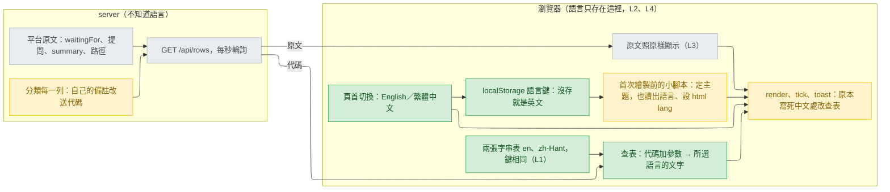

# agent-viewer-language-switch — stance

輸入：`.claude/track/support-multiple-langauge-for-agent-viewer/intake.md`（2026-09-26 核准，AC1–AC7、四條假設、Findings for design）。取捨已由使用者在 intake 選定：「A 頁內字串表」（intake.md:30-31），勝過 B（每種語言一個 JSON 檔、由 server 嵌入）。本文件把那個答案寫成取捨與不變條件，沒有另選方向；原 viewer 的取捨（`docs/design/2026-09-25-agent-viewer-web-portal-stance.md`，下稱「原 stance」）不重述，只引用。

## Status

approved 2026-09-26

## Optimises for

不讀中文的人打開 Agent Viewer 就能用英文看懂每一個地方，讀中文的人在頁首按一次就回到今天的畫面並一直沿用；所有措辭只由頁面自己決定，server 與它送出的資料不因語言而分岔。判準：AC5 的兩個 pytest（兩張表的鍵相同；zh-Hant 表以外沒有中日韓文字，CJK），加 verify 依 AC1–AC3 在瀏覽器手動核對。

## Sacrifices

- **今天在用的人更新後先看到英文。** 沒存過偏好就是英文、不看瀏覽器語言（intake.md:25、:28）；讀中文的人得自己按一次切換。
- **加第三種語言要改 `viewer.py` 本身。** 沒有可以丟進來的語言檔，也沒有給譯者的流程；新表跟現有兩張一樣大，放在出貨的腳本裡（B 才有的好處，intake.md:31）。
- **每段介面文字都要寫兩次。** 新增或改一句，兩張表都得動，少一張 pytest 就紅；英文措辭全是新文字，沒有 mockup 核准過。
- **一列裡仍會混兩種語言。** 平台與使用者的原文照原樣顯示。今天的中文頁面已經如此（注意列顯示登記檔的 `waitingFor` 原文，例如 `input needed`，原 stance :17；進入 notes 見 `viewer.py:1565`、`:1585`）；英文模式下反過來，中文提問仍是中文。
- **`/api/rows` 裡 server 自己寫的備註不再是看得懂的句子。** 直接讀 JSON 的人看到的是代碼；出貨程式裡讀它的只有頁面本身（`viewer.py:890`）。

## Invariants

**This system's:**

- L1 — 一個出處：頁面上今天寫成中文的每段文字（可見文字、`title`、`document.title`、toast（畫面下方短暫浮出的提示）、相對時間與時鐘格式、分隔符號如 `、`），以及新增的 `aria-label`（給螢幕閱讀器的標籤），都從 `PAGE_HTML` 裡每種語言一張的表查出；兩張表的鍵完全相同；zh-Hant 表以外的 `PAGE_HTML` 不含任何 CJK 字元（含 `：、（`），唯一例外是切換鈕上用該語言自己寫的名稱「繁體中文」（AC2 指定的標籤）。兩項各有 pytest（AC5）。
- L2 — server 不知道語言：語言選擇不離開瀏覽器，不新增請求、查詢參數、標頭或 cookie；server 自己寫、會上頁面的字串一律以與語言無關的代碼送出，由頁面查表翻譯（AC6）。
- L3 — 原文照原樣：`waitingFor`、提問與選項、summary、工具輸入、track 名稱、路徑一律不翻譯，也不得被頁面當成代碼去查表（AC6）。
- L4 — 語言是瀏覽器端的偏好，比照主題：存在 localStorage（瀏覽器替每個網站保存的鍵值資料）自己的鍵（主題的鍵見 `viewer.py:554`），首次繪製前就讀出（比照 `:290-297`）；沒存就是英文；切換不重新載入，篩選、已讀、展開照舊，`<html lang>` 跟著換（AC1–AC3）。
- L5 — 繁體中文模式下，今天已有的每段文字逐字不變；新增的只有切換鈕（AC4）。
- L6 — 頁面仍是一個自足的回應：內容安全政策（CSP，`viewer.py:275`）不改，不多抓任何檔案或字型，不加相依套件（AC7）。
- 原 stance 的 V1–V7（:26-32）照舊，尤其 V1：server 不多寫任何東西。

**Cross-project:**

- 原 stance 的四條（:36-39）照舊。其中 gen-codex 的行號已移動：禁字清單 `DENY_LIST` 現在是 `scripts/gen-codex.py:129-139`，`rewrite()` 是 `:277-292`。
- 英文字串也是出貨文字，gen-codex 會照抄並改寫：不得含任何 `DENY_LIST` 項目，`/cai:` 會被改成 `$`（`scripts/gen-codex.py:289`）；`tests/test_viewer_page.py:96-100` 已斷言 `PAGE_HTML` 不含其中四項。

## Rejected stances

- **B：每種語言一個 JSON 檔，server 送頁時嵌入。** 加語言不必動 `viewer.py`；但 server 送頁時要讀語言檔，多一條失敗路徑（檔案缺或壞時送什麼）、出貨檔變多，輸在「措辭只由頁面決定」。使用者選 A（intake.md:31）。
- **server 依語言產生頁面（cookie 或查詢參數）。** 切換得重新載入（違 AC2），每秒更新的相對時間仍要一張頁內表，等於兩套機制（intake.md:31）。
- **預設跟隨瀏覽器語言。** 讀中文的現有使用者更新後不必多按一次；但使用者指定預設英文，核准的假設明寫不偵測（intake.md:25）。
- **只翻頁面自己的字，server 備註維持中文句子。** 不必動 server 與 `tests/test_viewer_claude.py` 的五處斷言（:195、:259、:334、:345、:760）；但英文模式仍會出現「原因未知」「存活：推斷」（`viewer.py:1585`、`:1708`），違 AC1、AC6。

## Use cases / Issues

- UC1 — 第一次打開（沒存過偏好）：整頁英文，不論瀏覽器語言。判準：AC1；verify 在語言設為中文的瀏覽器實開一次。
- UC2 — 頁首主題切換旁的「English／繁體中文」：一按全頁文字一起換、不重新載入，篩選、已讀、展開都保留，`<html lang>` 跟著換。判準：AC2；verify 手動核對。
- UC3 — 重開頁面沿用上次的語言；選擇在首次繪製前讀出、設好 `<html lang>`，比照主題。判準：AC3。
- UC4 — 繁體中文模式與今天逐字相同（切換鈕除外）。判準：AC4。
- UC5 — server 會上頁面的兩句備註（「原因未知」`viewer.py:1585`、「存活：推斷」`:1708`）依所選語言顯示，原文照舊。判準：AC6，`tests/test_viewer_claude.py` 的 fixture（合成測試資料）。
- UC6 — 原 stance 的 UC1–UC6（:50-55）照舊；`validate.py`、`pytest` 全綠，`plugins/cai-codex` 重新產生並 `--release`，版本 1.36.2 → 1.37.0。判準：AC7。
- R1 — `PAGE_HTML` 寫死繁中（`<html lang="zh-Hant">`，`viewer.py:285`；介面文字散在 `:503-940`），沒有辦法顯示其他語言。
- R2 — 原 detail 的「頁面是 UTF-8 的 HTML，照 mockup 用中文」（`docs/design/2026-09-25-agent-viewer-web-portal-detail.md:114`）由本文件取代；同一條的「launcher 印英文、只用 ASCII」不變。

## Overview

看哪裡：所有綠框都在瀏覽器那一側，沒有任何箭頭從語言鍵或切換鈕通往 server（L2）；server 那側唯一的黃框只是把自己的備註換成代碼。從 `/api/rows` 出來的線分兩條：代碼走查表，原文不經查表直接顯示（L3）。

## Out of scope

- 第三種語言；偵測瀏覽器語言（intake.md:25）；`/cai:viewer` 的終端機輸出，由模型以使用者的語言轉述（`plugins/cai/skills/viewer/SKILL.md:14-16`、intake.md:27）；翻譯平台與使用者原文（L3）。
- `CONTEXT.md:22-23` 以中文畫面標籤定義兩個詞（執行中（背景）、存活確定度）；本階段不寫 `CONTEXT.md`，要不要改寫由 Decisions 提出。
- 留給 Decisions：
  - 代碼的形狀，以及頁面如何分辨代碼與原文：`waitingFor` 與「原因未知」同在 notes 陣列的同一個位置（`viewer.py:1585`），「存活：推斷」被併在最前面（`:1715`）。
  - 今天上不了頁面的三句備註（`:1608`、`:1626`、`:1893`；notes 只在注意列顯示，`:690-692`）與頁面不讀的 `problems`（`:2149`；頁面只取 rows、generatedAt、codexLockDirMissing，`:901-904`）要不要也改成代碼。
  - 更新後仍在跑的舊 viewer：launcher 只比對 `format`（`:2495`），相同就回「already running」（`:2505`），舊行程繼續送舊的中文頁面，直到 `stop` 或重開機；要不要升 `format`。
  - 頁首、篩選列、頁尾這些寫在 HTML 裡的靜態文字，能不能在首次繪製前就換成所選語言、選中文的人不先閃一下英文：UNVERIFIED，進可行性表。
  - 今天兩種語言都一樣的英文字（`Agent Viewer`、`LIVE`、`CLAUDE`／`CODEX`、階段名、`resume`）要不要也走表，L1 不強制。
  - 英文措辭與它在哪一關給使用者看、兩種語言的時鐘格式（今天寫死 `'zh-TW'`，`:616`）、相對時間的語序佔位（`:612-614`、`:806`）、切換鈕的 `aria-label`。
- `docs/` 被 git 忽略；本檔要進 PR 需在 ship 時 `git add -f`。
